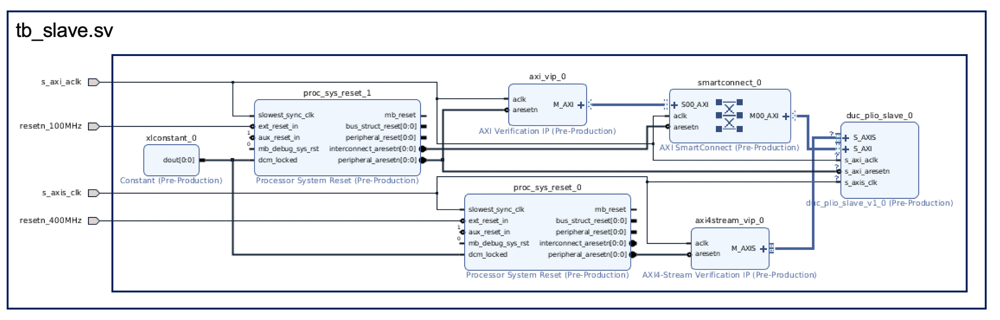

<table class="sphinxhide" width="100%">
 <tr width="100%">
    <td align="center"><h1>AI Engine Development</h1>
    <a href="https://www.xilinx.com/products/design-tools/vitis.html">See Vitis™ Development Environment on xilinx.com </a>
    <a href="https://www.xilinx.com/products/design-tools/vitis/vitis-ai.html">See Vitis™ AI Development Environment on xilinx.com</a>
    </td>
 </tr>
</table>

# Summary

This simulation design builds on the IP that was generated by using the Makefile in the parent directory, that is, `dlbf_slave`. The design is built using the following blocks:

1. AXI4 LITE VIP
2. AXI4 Stream Master VIP
3. Reset blocks
4. dlbf_slave IP

## Block diagram of test design

## Resources

1. [Xilinx AXI VIP](https://www.xilinx.com/products/intellectual-property/axi-vip.html)
2. [Xilinx AXI Stream VIP](https://www.xilinx.com/products/intellectual-property/axi-stream-vip.html)
3. [Xilinx Wiki](https://xilinx-wiki.atlassian.net/wiki/spaces/A/pages/18842507/Using+the+AXI4+VIP+as+a+master+to+read+and+write+to+an+AXI4-Lite+slave+interface)

Copyright © 2020–2025 Advanced Micro Devices, Inc.

<a href="https://www.amd.com/en/corporate/copyright">Terms and Conditions</a>

