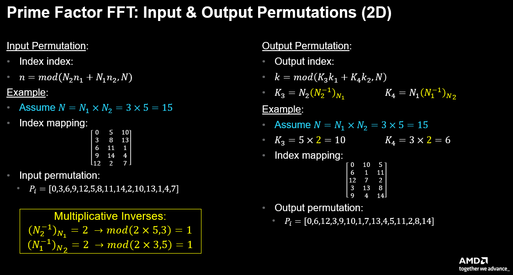
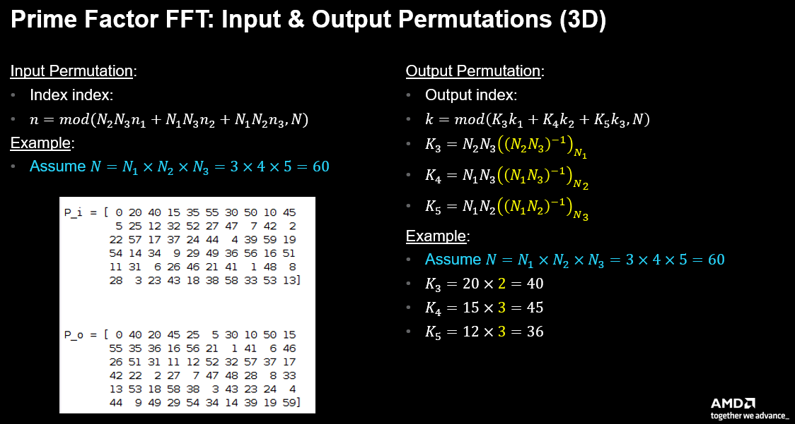
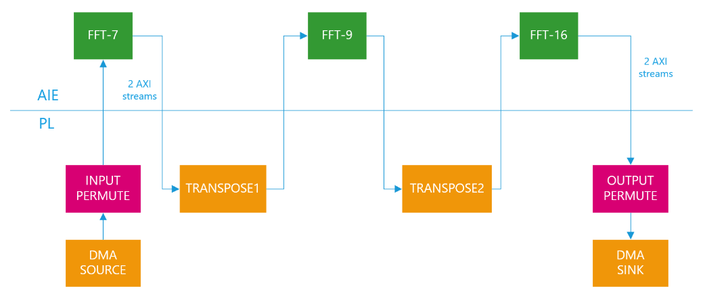
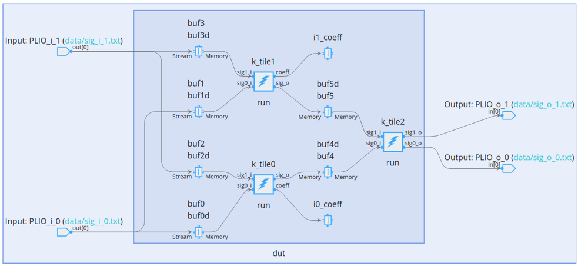
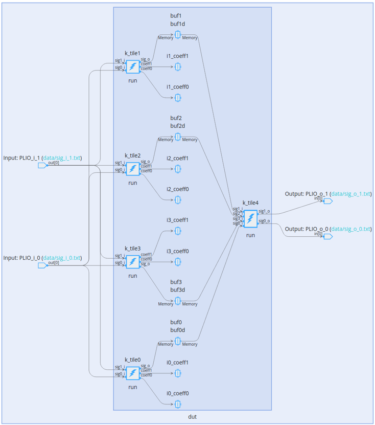

<!--
Copyright (C) 2023, Advanced Micro Devices, Inc. All rights reserved.
SPDX-License-Identifier: MIT
Author: Mark Rollins
-->
<table class="sphinxhide" width="100%">
 <tr width="100%">
    <td align="center"><h1>AI Engine Development</h1>
    <a href="https://www.xilinx.com/products/design-tools/vitis.html">See Vitis™ Development Environment on xilinx.com</br></a>
    <a href="https://www.xilinx.com/products/design-tools/vitis/vitis-ai.html">See Vitis™ AI Development Environment on xilinx.com</a>
    </td>
 </tr>
</table>

# Prime Factor FFT-1008

***Version: Vitis 2023.2***

## Table of Contents

1. [Introduction](#introduction)
2. [Matlab Models](#matlab-models)
3. [Design Overview](#design-overview)
4. [Design Resources](#design-resources)
5. [Build and Run Design](#build-and-run-design)

[References](#references)

[Support](#support)

[License](#license)

## Introduction
The Prime Factor Algorithm (PFA) [[1]] is a Fast Fourier Transform (FFT) algorithm [[2]] discovered by Good & Thomas before the more popular Cooley-Tukey algorithm with some interesting properties. The PFA is another "divide and conquer" approach for computing a Discrete Fourier Transform (DFT) of size $N = N_1 \cdot N_2$ as a two-dimensional DFT of size $N_1 \times N_2$ as long as $N_1$ and $N_2$ are relatively prime (ie. share no common divisors). The smaller transforms of size $N_1$ and $N_2$ may be computed by some other technique, for example using the Winograd FFT Algorithm, or the PFA technique may be applied recursively again to both $N_1$ and $N_2$. It turns out Versal AI Engines compute DFT with small dimensions $N < 32$ very efficiently using direct vector/matrix multiplication. Consequently, the PFA approach using DFT on the individual prime factors provides an efficient approach to the FFT on Versal AI Engines.

A second advantage of the PFA approach is that unlike the popular Cooley-Tukey FFT, no extra multiplications by "twiddle factors" need be performed between stages. This fact falls out of the DFT factorization when $N_1$ and $N_2$ share no common factors. This provides a computational advantage compared to the more traditional Cooley-Tukey formulation, but the PFA incurs a drawback in that a complicated re-indexing or permutation of it's I/O samples is required. For Versal devices with both AI Engines and Programmable Logic (PL), however, this drawback is solved easily by leveraging the PL to implement these permutations as part of a custom data flow tailored to the PFA signal flow graph.

This tutorial illustrates these concepts by designing a PFA-1008 transform in Versal using both AI Engine and PL elements working cooperatively. The PFA approach may be applied here since $1008 = 7 \times 9 \times 16$. This illustrates a PFA implementation in three dimensions. The transforms for each of these three relatively prime factors are implemented on AI Engine using vector-matrix DFT's. RTL implementations for the I/O permutations and intermediate "memory transpose" operations are obtained using Vitis High Level Synthesis (HLS) from untimed C++ models. 

## Matlab Models

The figure below shows a block diagram of a 2D PFA transform. It's corresponding Matlab model is shown immediately below. The algorithm consists of the following five steps:
* An input permutation is applied to the input data. The specific input permutation depends on the values of the relative prime factors $N_1$ and $N_2$ as outlined below.
* The data is organized into an $N_2 \times N_1$ matrix and 1D FFT's are performed along the rows of that matrix.
* A "matrix transpose" operation converts the data flow from "row-wise" to "column-wise" ordering for the subsequent column-based transforms. This amounts to delivering the data using a "strided" addressing pattern.
* A second set of 1D FFT's are performed along the columns of the original matrix.
* An output permutation is applied to the output data after being read column-wise out of its 2D matrix form. The specific output permutation depends on the values of $N_1$ and $N_2$ as outlined below.

The Matlab code below shows all of these five steps clearly. The routine `compute_perm_2d()` computes the input permutation `P_i` and output permutation `P_o` applied based on the values of $N_1$ and $N_2$. 


```
function [sig_o] = fft_pfa_2d( sig_i, N1, N2 )
    [P_i,P_o,N] = compute_perm_2d(N1,N2);
    % Input permutation
    data = reshape(sig_i(1+P_i),N2,N1);
    % Row transform
    for rr = 1 : N2
      data(rr,:) = fft(data(rr,:));
    end
    % Col transform
    for cc = 1 : N1
      data(:,cc) = fft(data(:,cc));
    end
    % Output permutation
    data_o = reshape(data,1,[]);
    sig_o(1+P_o) = data_o;
end
```

The figure below shows a block diagram of a 3D PFA transform. It's corresponding Matlab model is shown immediately below. The algorithm consists of the same steps similar to the 2D case above with the following differences:
* The I/O permutations now depend on three relatively prime factors $N_1$, $N_2$ and $N_3$. The mathematics specific to these 2D and 3D permutations is given in detail below.
* The data is now organized in a $N_1 \times N_2 \times N_3$ cube instead of an $N_1 \times N_2$ rectangle. Transforms are taken in 1D along each of these dimensions in order, first along $N_1$, then along $N_2$ and finally along $N_3$.
* The "matrix transpose" operations required to extract data in the $N_2$ and $N_3$ dimensions involve slightly more complicated "stride" patterns. These patterns are computed by the Matlab routine `compute_addr_3d.m`.


```
function [sig_o] = fft_pfa_3d( sig_i, N1, N2, N3 )
    [P_i,P_o,N] = compute_perm_3d(N1,N2,N3);
    % Input permutation:
    data = reshape(sig_i(1+P_i),N1,N2,N3);
    % Transforms
    for cc = 1 : N2
      for dd = 1 : N3
        data(:,cc,dd) = fft(data(:,cc,dd));
      end
    end
    for rr = 1 : N1
      for dd = 1 : N3
        data(rr,:,dd) = fft(data(rr,:,dd));
      end
    end
    for rr = 1 : N1
      for cc = 1 : N2
        data(rr,cc,:) = fft(data(rr,cc,:));
      end
    end
    % Output permutation:
    data_o = reshape(data,1,[]);
    sig_o(1+P_o) = data_o;
end
```
The full suite of Matlab models illustrating the operation of the PFA transforms is given in the `matlab` folder of the repo.

### I/O Permutations (2D Case)

The figure below illustrates how to compute the I/O permutations required for a 2D PFA solution. The input permutation relies on a simple modulo computation with the relatively prime factors $N_1$ and $N_2$. The figure gives a specific sample with $N_1=3% and $N_2=5$. The input index mapping may be written in a 2D matrix form, or as a 1D address permutation $P_i$. 

The output permutation mapping relies on a similar modulo computation but with factors $K_3$ and $K_4$ computed from $N_1$ and $N_2$ and their "multiplicative modulo inverses". Such an inverse $\(a^{-1}\)_N\equiv I$ is defined such that $mod\(a\times I,N\)=1$. Using this to solve for $\(N_2^{-1}\)\_{N_1}$ and $\(N_1^{-1}\)\_{N_2}$ yields the solution of $K_3=10$ and $K_4=6$ shown in the figure. Once again, the output index mapping may be written in a 2D matrix form, or as a 1D address permutation $P_o$.




### I/O Permutations (3D Case)

The I/O permutations for a 3D PFA solution are solved in a manner similar to the 2D case as shown in the figure below. Essentially, the modulo computations are extended to include a third dimension, and three modulo-inverses are required to solve for the output permutation. These permutations may be expressed in a 3D matrix form, or as a 1D address permutation $P_i$ or $P_o$. The 1D formulation is preferred as it matches how the design will be implemented in hardware. 



## Design Overview

The figure below shows a block diagram of a 3D PFA-1008 hardware design implemented in Versal using AI Engines and PL. The design targets a 2 Gsps throughput (SSR=2). AI Engines implement the three DFT kernels, specifically DFT-7, DFT-9 and DFT-16, using a vector-matrix multiplication approach. The design implements the I/O permutation and matrix transpose kernels using Vitis HLS targeting in PL.



Some details on each kernel design is given in the sections below.

### INPUT PERMUTE Kernel

This PL kernel is implemented in HLS @ 312.5 MHz (SSR=8). Samples arriving in polyphase order on two 128-bit streams are written are written into a ping/pong buffer in 4X duplicate fashion. This is required since each buffer supports two R/W ports and we must read or write 8 samples per cycle. The input permutation $P_i$ is stored in a LUT (again with 4X duplication) so the samples may be read back in the required permuted order. The latency of the design is 1008/8+1 cycles due to the ping/pong nature of the design. The two output streams format the data such that consecutive 7-pt transforms are sent in alternating fashion over the two streams with all seven points of any particular transform are sent over the same stream.

### FFT-7 Kernel

This AI Engine kernel implements the DFT-7 using a vector-matrix approach based on mac8() intrinsics to compute two [1x1] x [1x4] OPs in parallel in a single cycle. Two compute tiles and 1 combiner tile are required. The first compute tile is 100% efficient whereas the second compute tile is 75% efficient. Input samples for two separate transforms arrive over two streams, one transform on each stream, over a period of seven cycles. The output samples are produced alternately for each transform on the two output streams over the same period. The graph for this AI Engine kernel is shown below.



### TRANSPOSE1 Kernel

This PL kernel implements in PL the matrix transpose operation required to feed the proper 9-point input samples to the DFT-9 on the second dimension of the 3D cube. The design uses HLS @ 312.5 MHz (SSR=8). The input 7-pt transforms arrive over two streams as outlined above. Samples are written linearly into a ping-pong buffer and read back using a strided order (seven points apart) producing output 9-pt transforms alternately on each of two output streams. The design has a latency of 1008/8+2 cycles.

### FFT-9 Kernel

This AI Engine kernel implements the DFT-9 using a similar approach to the DFT-7 kernel above. This kernel requires 3 compute tiles and 1 combiner tiles and operates in a manner very similar to the DFT-7 kernel. I/O transforms are transmitted in alternating fashion over two streams as above. The first two compute kernels are 100% efficient, whereas the third tile is only 25% efficient. The graph for this AI Engine kernel is shown below.


### TRANSPOSE2 Kernel

This PL kernel implements in PL the matrix transpose operation required to feed the proper 16-point input samples to the DFT-16 on the third dimension of the 3D cube. The design uses HLS @ 312.5 MHz (SSR=8). The 9-pt transforms arrive on alternate streams. Samples are written into a ping/pong buffer. Samples are read back in a transposed (stride-63) order. The kernel produces 4 samples alternately on two output streams. The design has a latency of 1008/8+1 cycles. 

### FFT-16 Kernel

This AI Engine kernel implements the DFT-16 using a similar approach to the DFT-7 and DFT-9 kernels above. Unlike those kernels, the I/O samples for the DFT-16 are transmitted four consecutive samples each on alternate streams (as compared to full transforms transmitted on alternate streams in the earlier kernels). The graph for this AI Engine kernel is shown below.



### OUTPUT PERMUTE Kernel

This PL kernel is implemented in HLS @ 312.5 MHz (SSR=8). Samples arriving in 4 samples alternately on two 128-bit streams are written are written into a ping/pong buffer in 4X duplicate fashion in a manner similar to the INPUT PERMUTE kernel. The output permutation $P_o$ is stored in a LUT (again with 4X duplication) so the samples may be read back in the required permuted order. The latency of the design is 1008/8 cycles due to the ping/pong nature of the design. The two output streams format the data in polyphase order for consumption by the DMA sink buffer.

## Design Resources

The figure below summarizes the AI Engine and PL resources required to implement the design in the VC1902 device on the VCK190 eval board. The design is using 12 AI Engine tiles for compute and 19 tiles for buffering. The PL portion requires ~100 BRAMs to provide the I/O permutes and matrix transpose operations. This design illustrates how Versal AI Engine and PL may be crafted to create a high performance tightly coupled custom data path tailored directly to the algorithm of interest. 


## Build and Run Design

### Setup & Initialization

IMPORTANT: Before beginning the tutorial ensure you have installed Vitis™ 2023.1 software. Ensure you have downloaded the Common Images for Embedded Vitis Platforms from this link.

https://www.xilinx.com/support/download/index.html/content/xilinx/en/downloadNav/embedded-platforms/2023-1.html

Set the environment variable ```COMMON_IMAGE_VERSAL``` to the full path where you have downloaded the Common Images. Then set the environment variable ```PLATFORM_REPO_PATHS``` to the value ```$XILINX_VITIS/lin64/Vitis/2023.1/base_platforms```.

The remaining environment variables are configured in the top level Makefile ```<path-to-design>/05-Prime-Factor-FFT/Makefile``` file.

```
RELEASE=2023.1
BOARD=vck190
BASE_NUM=202310_1

# Platform Selection...
VERSAL_VITIS_PLATFORM      = xilinx_${BOARD}\_base_${BASE_NUM}
VITIS_PLATFORM_DIR         = ${PLATFORM_REPO_PATHS}/${VERSAL_VITIS_PLATFORM}
export VITIS_PLATFORM_XPFM = ${VITIS_PLATFORM_DIR}/${VERSAL_VITIS_PLATFORM}.xpfm

# Set SysRoot, RootFS and Image
export VITIS_SYSROOTS   = ${COMMON_IMAGE_VERSAL}/sysroots/cortexa72-cortexa53-xilinx-linux
export KERNEL_IMAGE     = ${COMMON_IMAGE_VERSAL}/Image
export ROOTFS           = ${COMMON_IMAGE_VERSAL}/rootfs.ext4
export XLNX_VERSAL      = ${COMMON_IMAGE_VERSAL}
export PLATFORM         = ${VITIS_PLATFORM_XPFM}
export SYSROOT          = ${VITIS_SYSROOT}
```

### Hardware Emulation


```
[shell]% cd <path-to-design>/05-Prime-Factor-FFT
[shell]% make all TARGET=hw_emu
```

This will take about 90 minutes to run the first time as the build will perform C/RTL verification and Vivado out-of-context place-and-route runs for all six HLS IPs. This will only be done once, but is not strictly required for hardware emulation. To skip this step, alternately run using the following:

```
[shell]% cd <path-to-design>/05-Prime-Factor-FFT
[shell]% make all TARGET=hw_emu DO_COSIM=false
```

The build process will generate a folder ```05-Prime-Factor-FFT/package``` containing all the files required for hardware emulation. This can be run as shown below. An optional `-g` can be applied to the ```launch_hw_emu.sh``` command to launch the Vivado waveform GUI to observe the top-level AXI signal ports in the design.

```
[shell]% cd <path-to-design>/05-Prime-Factor-FFT/package
[shell]% ./launch_hw_emu.sh -run-app embedded_exec.sh
```

### Hardware

The design can be built for the VCK190 board using the Makefile as follows:

```
[shell]% cd <path-to-design>/05-Prime-Factor-FFT
[shell]% make all TARGET=hw
```

The build process will generate the SD card image in the ```<path-to-design>/05-Prime-Factor-FFT/package/sd_card``` folder.

## References

[1]: <https://en.wikipedia.org/wiki/Prime-factor_FFT_algorithm> "Prime Factor FFT Algorithm"

[[1]] Wikipedia, "[Prime Factor FFT Algorithm]([https://en.wikipedia.org/wiki/Prime-factor_FFT_algorithm])"

[2]: <https://eng.libretexts.org/Bookshelves/Electrical_Engineering/Signal_Processing_and_Modeling/Fast_Fourier_Transforms_(Burrus)> "Fast Fourier Transforms"

[[2]] C. Sidney Burrus, "[Fast Fourier Transforms]([https://eng.libretexts.org/Bookshelves/Electrical_Engineering/Signal_Processing_and_Modeling/Fast_Fourier_Transforms_(Burrus)])"

## Support

GitHub issues will be used for tracking requests and bugs. For questions, go to [support.xilinx.com](http://support.xilinx.com/).

## License

Components: xilinx-images

images in the documentation

Components: xilinx-files

The MIT License (MIT)

Copyright (c) 2023 Advanced Micro Devices, Inc.

Permission is hereby granted, free of charge, to any person obtaining a copy
of this software and associated documentation files (the "Software"), to deal
in the Software without restriction, including without limitation the rights
to use, copy, modify, merge, publish, distribute, sublicense, and/or sell
copies of the Software, and to permit persons to whom the Software is
furnished to do so, subject to the following conditions:

The above copyright notice and this permission notice shall be included in all
copies or substantial portions of the Software.

THE SOFTWARE IS PROVIDED "AS IS", WITHOUT WARRANTY OF ANY KIND, EXPRESS OR
IMPLIED, INCLUDING BUT NOT LIMITED TO THE WARRANTIES OF MERCHANTABILITY,
FITNESS FOR A PARTICULAR PURPOSE AND NONINFRINGEMENT. IN NO EVENT SHALL THE
AUTHORS OR COPYRIGHT HOLDERS BE LIABLE FOR ANY CLAIM, DAMAGES OR OTHER
LIABILITY, WHETHER IN AN ACTION OF CONTRACT, TORT OR OTHERWISE, ARISING FROM,
OUT OF OR IN CONNECTION WITH THE SOFTWARE OR THE USE OR OTHER DEALINGS IN THE
SOFTWARE.

<p class="sphinxhide" align="center">  &copy; Copyright 2023 Advanced Micro Devices, Inc.</p>
<p class="sphinxhide" align="center">  &copy; Copyright 2021 Xilinx Inc.</p>

