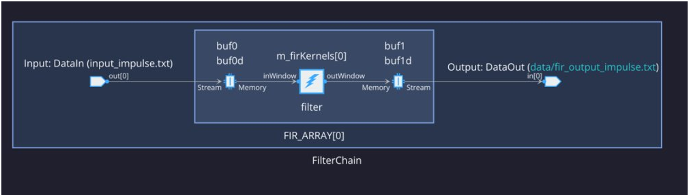

<table class="sphinxhide" width="100%">
 <tr>
   <td align="center"><h1>2023.1 Versal AI Engine/HLS FIR Filter Tutorial (AI Engine Implementation)</h1>
   </td>
 </tr>
</table>

# AI Engine Implementation

## Table of Contents
[Building the Design](#building-the-design)

[Hardware Design Details](#hardware-design-details)

[Software Design Details](#software-design-details)

[References](#references)

[Revision History](#revision-history)

## Building the Design

<details>
<summary>Design Build</summary>

### Design Build
In this section, you will build and run the FIR filter design using the AI Engine implementation. You will compile the AI Engine design and integrate it into a larger system design (including the programmable logic (PL) kernels and processing system (PS) host application). You can review [Integrating the Application Section in the AI Engine Documentation](#ai-engine-documentation) for the general flow.

At the end of this section, the design flow generates a new directory (called `build/`). Underneath are sub-directories named `fir_aie_$(N_FIR_FILTERS)firs_$(N_FIR_TAPS)taps` (for example, `fir_aie_1firs_15taps`) depending on value of `N_FIR_FILTERS` and `N_FIR_TAPS` chosen in the build. Each sub-directory contains the `Work/`, `hw_emu/`, and `hw/` subfolders. 
- `Work/` subfolder is an output from the AI Engine compiler. 
- `hw_emu/` subfolder contains the build for hardware emulation. 
- `hw/` subfolder contains the build for the hardware run on a VCK190 board.   

</details>

<details>
<summary>Make Steps</summary>

### Make Steps
To run the following `make` steps (for example, `make kernels`, `make graph`, and so on), navigate to the `AIE/` folder.
```bash
cd AIE
```

The following options can be specified in the make step. See the make steps for instructions on how to apply them.

* TARGET: It can be set to "hw" or "hw_emu" to build the design in hardware or hardware emulation flow. Default is "hw_emu"

* N_FIR_FILTERS: Specifies the number of FIR filters in the chain. Default is 1.

* N_FIR_TAPS: Specifies the number of FIR filter taps. Default is 15.

* FIR_WINDOW_SIZE: Specifies the size of the ping-pong buffers inserted between the FIR filter kernels. Default is 256.

* EN_TRACE: Flag to enable trace data to be captured. 0 is disabled and 1 is enabled. Default is 0.

The Makefile uses the following directory references:

```
#Relative fir directory
RELATIVE_PROJECT_DIR := ./

#Absolute fir directory = <user path>/Tutorials/AI_Engine/fir
PROJECT_REPO	:= $(shell readlink -f $(RELATIVE_PROJECT_DIR))

DESIGN_REPO  := $(PROJECT_REPO)/design
AIE_SRC_REPO := $(DESIGN_REPO)/aie_src
PL_SRC_REPO  := $(DESIGN_REPO)/pl_src
HOST_APP_SRC := $(DESIGN_REPO)/host_app_src
VIVADO_METRICS_SCRIPTS_REPO := $(DESIGN_REPO)/vivado_metrics_scripts

SYSTEM_CONFIGS_REPO    := $(DESIGN_REPO)/system_configs
PROFILING_CONFIGS_REPO := $(DESIGN_REPO)/profiling_configs
EXEC_SCRIPTS_REPO      := $(DESIGN_REPO)/exec_scripts
PYTHON_SCRIPTS_REPO    := $(DESIGN_REPO)/python_scripts

BASE_BLD_DIR := $(PROJECT_REPO)/build
FIR_TAPS_BLD_DIR    := $(BASE_BLD_DIR)/fir_$(N_FIR_TAPS)_taps
FIR_FILTERS_DIR     := $(FIR_TAPS_BLD_DIR)/x$(N_FIR_FILTERS)_firs
FIR_WINDOW_SIZE_DIR := $(FIR_FILTERS_DIR)/winSz_$(FIR_WINDOW_SIZE)
AIES_PER_FIR_DIR    := $(FIR_WINDOW_SIZE_DIR)/x$(N_AIES_PER_FIR)_aie_per_fir
BUILD_TARGET_DIR    := $(AIES_PER_FIR_DIR)/$(TARGET)

VIVADO_REPORTS_REPO := $(PROJECT_REPO)/vivado_reports_dir
VIVADO_BLD_REPORTS_DIR := $(REPORTS_REPO)/fir_$(N_FIR_TAPS)_taps/x$(N_FIR_FILTERS)_firs/winSz_$(FIR_WINDOW_SIZE)/x$(N_AIES_PER_FIR)_aie_per_fir

VCD_XPE_REPO := $(PROJECT_REPO)/vcd_xpe_dir
BLD_VCD_XPE_DIR := $(VCD_XPE_REPO)/fir_$(N_FIR_TAPS)_taps/x$(N_FIR_FILTERS)_firs/winSz_$(FIR_WINDOW_SIZE)/x$(N_AIES_PER_FIR)_aie_per_fir
VCD_FILE_NAME := fir_$(N_FIR_TAPS)_taps_x$(N_FIR_FILTERS)_firs_winSz_$(FIR_WINDOW_SIZE)_x$(N_AIES_PER_FIR)_aie_per_fir
BLD_TGT_VCD_FILE := $(BUILD_TARGET_DIR)/$(VCD_FILE_NAME).vcd
XPE_FILE := $(BLD_VCD_XPE_DIR)/graph_$(VCD_FILE_NAME).xpe

EMBEDDED_PACKAGE_OUT := $(BUILD_TARGET_DIR)/package
EMBEDDED_EXEC_SCRIPT := run_script.sh

WORK_DIR := Work
AIESIM_DATA_DIR := $(AIE_SRC_REPO)/aiesim_data
AIESIM_INPUT_FILE := $(AIESIM_DATA_DIR)/input_impulse.txt
```

</details>

<details>
<summary>Build the Entire Design with a Single Command</summary>

### Build the Entire Design with a Single Command
If you are already familiar with the AI Engine and Vitis accelerated kernel compilation flows, you can build the entire design with one command:

```
bash
make run (default hardware emulation, 1 filter 15 taps, no trace enabled)
```
or
```
bash
make run TARGET=hw N_FIR_FILTERS=1 N_FIR_TAPS=15 EN_TRACE=1   (hardware, 1 FIR filters, each with 15 taps, enable tracing)
```

This command runs the `make kernels`,`make graph`,`make xsa`,`make application`,`make package` and `make run_emu` for hardware emulation or to run on hardware (VCK190 board), depending on the specified `TARGET`. The default `TARGET` without specification is `hw_emu`. The settings also applies to the following individual make steps.

**Note**

1. The generated files for a particular build are placed under individual directory: `build/fir_aie_$(N_FIR_FILTERS)firs_$(N_FIR_TAPS)taps`
2. See the specification in each of the following make steps for options used and location of input and output files.

</details>

The individual make steps to build the design with the options applied to them are specified as follows.

<details>
<summary>make kernels: Compile PL Kernels</summary>

### make kernels: Compile PL Kernels
In this step, the Vitis compiler uses any kernels (RTL or HLS C) in the PL region of the target platform (`xilinx_vck190_base_202310_1`) and compiles them into their respective XO files.

The following command compiles the kernels (default TARGET=hw_emu, N_FIR_FILTERS=1, N_FIR_TAPS=15, FIR_WINDOW_SIZE=256, EN_TRACE=0):

```
make kernels
```

The expanded command is as follows:
```
mkdir -p build/fir_$(N_FIR_TAPS)_taps/x$(N_FIR_FILTERS)_firs/winSz_$(FIR_WINDOW_SIZE)/x$(N_AIE_PER_FIR)_aie_per_fir/hw_emu

cd build/fir_$(N_FIR_TAPS)_taps/x$(N_FIR_FILTERS)_firs/winSz_$(FIR_WINDOW_SIZE)/x$(N_AIE_PER_FIR)_aie_per_fir/hw_emu

v++ 	--target hw_emu					\
	--hls.clock 300000000:datamover 		\
        -D N_FIR_TAPS=$(N_FIR_TAPS)                     \
        -D N_FIR_FILTERS=$(N_FIR_FILTERS)               \
	--platform xilinx_vck190_base_202310_1		\
	--save-temps 					\
	--temp_dir build/fir_$(N_FIR_TAPS)_taps/x$(N_FIR_FILTERS)_firs/winSz_$(FIR_WINDOW_SIZE)/x$(N_AIE_PER_FIR)_aie_per_fir/hw_emu/_x	\
	--verbose 					\
	-g -c 						\
	-k datamover 					\
	design/pl_src/datamover.cpp 		\
	-o datamover.hw_emu.xo   
```
Summary of the switches used:
|Switch|Description|
|  ---  |  ---  |
|--target \| -t [hw\|hw_emu]|Specifies the build target.|
|--hls.clock | Specifies a frequency in Hz at which the listed kernel(s) should be compiled by Vitis HLS. |
|--platform \| -f|Specifies the name of a supported acceleration platform as specified by the `$PLATFORM_REPO_PATHS` environment variable or the full path to the platform XPFM file.|
|--save-temps \| -s|Directs the Vitis compiler command to save intermediate files/directories created during the compilation and link process. Use the `--temp_dir` option to specify a location to write the intermediate files to.|
|--temp_dir <string>|This allows you to manage the location where the tool writes temporary files created during the build process. The temporary results are written by the Vitis compiler, and then removed, unless the `--save-temps` option is also specified.|
|--verbose|Display verbose/debug information.|
| -g | Generates code for debugging the kernel during software emulation. Using this option adds features to facilitate debugging the kernel as it is compiled. |
|--compile \| -c|Required for compilation to generate XO files from kernel source files.|
|--kernel \<arg\>\|-k \<arg\>|Compile only the specified kernel from the input file. Only one -k option is allowed per Vitis compiler command.|
|--output \| -o|Specifies the name of the output file generated by the `v++` command. Ensure that the compilation process output name ends with the XO file suffix.|

[Detailed Description of All Vitis Compiler Switches](https://docs.xilinx.com/r/en-US/ug1393-vitis-application-acceleration/v-Command)

|Input|Description|
|  ---  |  ---  |
|datamover.cpp|The data-mover PL kernel source code.|

|Output|Description|
|  ---  |  ---  |
|datamover.hw/hw_emu.xo|The data-mover kernel object file.|

</details>

<details>
<summary>make graph: Creating the AI Engine ADF Graph for Vitis Compiler Flow</summary>

### make graph: Creating the AI Engine ADF Graph for Vitis Compiler Flow

An adaptive data flow (ADF) graph can be connected to an extensible Vitis platform (the graph I/Os can be connected either to platform ports or to ports on Vitis kernels through Vitis compiler connectivity directives).
* The AI Engine ADF C++ graph of the design contains AI Engine kernels.
* All interconnects between kernels are defined in the C++ graph
* All interconnections to external I/O are fully specified in the C++ simulation testbench (`graph.cpp`) that instantiates the C++ ADF graph object.

To compile the graph using the Makefile flow type (default TARGET=hw_emu, N_FIR_FILTERS=1, N_FIR_TAPS=15, FIR_WINDOW_SIZE=256, EN_TRACE=0):
```
make graph
```

The expanded command is as follows:
```
cd build/fir_aie_$(N_FIR_FILTERS)firs_$(N_FIR_TAPS)taps/hw_emu

aiecompiler     -include=$(DSPLIB_ROOT)/L1/src/aie 		\
		-include=$(DSPLIB_ROOT)/L1/include/aie 		\
		-include=$(DSPLIB_ROOT)/L2/include/aie 		\
		-include=design/aie_src 		\
		--platform=$(PLATFORM_REPO_PATHS)/xilinx_vck190_base_202310_1/xilinx_vck190_base_202310_1.xpfm 	\
		--workdir=Work 					\
	        --Xpreproc="-DITER_CNT=$(ITER_CNT)"             \
		--Xpreproc="-DN_FIR_FILTERS=$(N_FIR_FILTERS)"   \
		--Xpreproc="-DN_FIR_TAPS=$(N_FIR_TAPS)"         \
		--Xpreproc="-DN_AIES_PER_FIR=$(N_AIES_PER_FIR)"    \
		--Xpreproc="-DFIR_WINDOW_SIZE=$(FIR_WINDOW_SIZE)"  \
		--Xpreproc="-DN_AIE_ITERS=$(N_AIE_ITERS)"--Xpreproc="-N_FIR_FILTERS=1" \
                --Xpreproc="-N_FIR_TAPS=15" 			\
		--Xmapper=BufferOptLevel9			\
		--Xrouter=DMAFIFOsInFreeBankOnly		\
		--log-level=5 					\
		--pl-freq=300 					\
		--verbose 					\
		--dataflow 					\
		design/aie_src/fir_aie_graph.cpp
 ```

Summary of the switches used:
|Switch|Description|
|  ---  |  ---  |
|--include=\<string\>|Specify compile-time include directory (zero or more).|
|--platform=\<string\>|This is a path to a Vitis platform file that defines the hardware and software components available when doing a hardware design and its RTL co-simulation.|
|--workdir=\<string\>|By default, the compiler writes all outputs to a sub-directory of the current directory, called Work. Use this option to specify a different output directory.|
|--log-level=\<int\>|Log level for verbose logging (default=1).|
|--pl-freq=\<value\>|Specifies the interface frequency (in MHz) for all PLIOs. The default frequency is a quarter of the AI Engine frequency and the maximum supported frequency is half of the AI Engine frequency. The PL frequency specific to each interface is provided in the graph.|
|--verbose|Verbose output of the AI Engine compiler emits compiler messages at various stages of compilation. These debug and tracing logs provide useful messages regarding the compilation process.|

[AI Engine Compiler Options](https://docs.xilinx.com/r/en-US/ug1076-ai-engine-environment/AI-Engine-Compiler-Options)
[AI Engine Programming Environment Documentation](https://docs.xilinx.com/r/en-US/ug1076-ai-engine-environment)

|Inputs Sources|Description|
|  ---  |  ---  |
|fir_aie_graph.cpp|AIE kernel base FIR filter graph source code.|

|Output Objects|Description|
|  ---  |  ---  |
|libadf.a|Compiled AI Engine design graph|
|Work/|Directory that contains all outputs of the AI Engine compiler.|

</details>


<details>
<summary>make xsa: Use Vitis Tools to Link AI Engine and HLS Kernels with the Platform</summary>

### make xsa: Use Vitis Tools to Link AI Engine and HLS Kernels with the Platform
After the AI Engine graph and PL HLS kernels have been compiled, you can use the Vitis compiler to link them with the platform to generate an XSA file.

The Vitis tools allow you to integrate the AI Engine graph and HLS kernels into an existing extensible platform. This is an automated step from a software developer perspective where the platform chosen is provided by the hardware designer (or you can opt to use one of the many extensible base platforms provided by AMD and the Vitis tools build the hardware design and integrate the AI Engine and PL kernels into the design).

To test this feature in this tutorial, use the base VCK190 platform to build the design.

The command to run this step is shown as follows (default TARGET=hw_emu, N_FIR_FILTERS=1, N_FIR_TAPS=15, FIR_WINDOW_SIZE=256, EN_TRACE=0):
```
make xsa
```

The expanded command is as follows:
```
cd build/fir_$(N_FIR_TAPS)_taps/x$(N_FIR_FILTERS)_firs/winSz_$(FIR_WINDOW_SIZE)/x$(N_AIE_PER_FIR)_aie_per_fir/hw_emu

v++ 	-l 						\
	--platform xilinx_vck190_base_202310_1		\
	--save-temps 					\
	--temp_dir build/fir_$(N_FIR_TAPS)_taps/x$(N_FIR_FILTERS)_firs/winSz_$(FIR_WINDOW_SIZE)/x$(N_AIE_PER_FIR)_aie_per_fir/hw_emu/_x		\
	--verbose 					\
	-g 						\
	--clock.defaultTolerance 0.001 			\
	--clock.freqHz 300000000:datamover_0 		\
	--config $(SYSTEM_CONFIGS_REPO)/system.cfg 	\
	-t hw_emu 					\
	-o vck190_aie_fir.hw_emu.xsa  			\
	datamover.hw_emu.xo				\
        ../libadf.a

```

If EN_TRACE is enabled, ensure that the following `v++` flags are also set
```
	--profile.trace_memory DDR			\
  	--profile.data datamover:datamover_0:all \
	--profile.data ai_engine_0.DataIn		\
	--profile.data ai_engine_0.DataOut

```
This flag captures the trace data for the ports specified.

Summary of the switches used:

|Switch|Description|
|  ---  |  ---  |
|--platform \| -f|Specifies the name of a supported acceleration platform as specified by the $PLATFORM_REPO_PATHS environment variable or the full path to the platform XPFM file.|
|--save-temps \| -s|Directs the `v++` command to save intermediate files/directories created during the compilation and link process. Use the `--temp_dir` option to specify a location to write the intermediate files to.|
|--temp_dir <string>|This allows you to manage the location where the tool writes temporary files created during the build process. The temporary results are written by the Vitis compiler, and then removed, unless the `--save-temps` option is also specified.|
|--verbose|Display verbose/debug information.|
| -g | Generates code for debugging the kernel during software emulation. Using this option adds features to facilitate debugging the kernel as it is compiled. |
|--clock.freqHz \<freq_in_Hz\>:\<cu\>\[.\<clk_pin\>\]|Specifies a clock frequency in Hz and assigns it to a list of associated compute units (CUs) and optionally specific clock pins on the CU.|
|--config <config_file>|Specifies a configuration file containing `v++` switches.|
|--target \| -t [hw\|hw_emu]|Specifies the build target.|
|--output \| -o|Specifies the name of the output file generated by the `v++` command. The linking process output file name must end with the .xsa suffix|
|--profile.data [<kernel_name>\|all]:[<cu_name>\|all]:[<interface_name>\|all]\(:[counters\|all]\)|Enables monitoring of data ports through the monitor IPs. This option needs to be specified during linking. [Detailed Profiling Options](https://docs.xilinx.com/r/en-US/ug1393-vitis-application-acceleration/profile-Options) |
|--profile.trace_memory \<FIFO\>:\<size\>\|\<MEMORY\>[\<n\>]|When building the hardware target \(-t=hw\), use this option to specify the type and amount of memory to use for capturing trace data. [Detailed Profiling Options](https://docs.xilinx.com/r/en-US/ug1393-vitis-application-acceleration/profile-Options) |

[Detailed Description of All Vitis Compiler Switches](https://docs.xilinx.com/r/en-US/ug1393-vitis-application-acceleration/v-Command)
[Linking the Kernels in Vitis](https://docs.xilinx.com/r/en-US/ug1393-vitis-application-acceleration/Linking-the-System)

|Inputs Sources|Description|
|  ---  |  ---  |
|datamover.hw/hw_emu.xo|The data-mover kernel object file.|
|libadf.a|Compiled AI Engine design graph|

|Output Objects|Description|
|  ---  |  ---  |
|vck190_aie_fir.hw_emu.xsa|Compiled Platform Binary Container|

</details>

 <details>
<summary>make application: Compile the Host Application</summary>

### make application: Compile the Host Application
You can compile the host application by following the typical cross-compilation flow for the Cortex-A72. To build the application run the following command (default TARGET=hw_emu, N_FIR_FILTERS=1, N_FIR_TAPS=15, FIR_WINDOW_SIZE=256, EN_TRACE=0):
```
make application
```

The expanded command is as follows:
```
aarch64-linux-gnu-g++ 	-O 					\
			-c -std=c++17				\
			-D__linux__ 				\
			-D__PS_ENABLE_AIE__			\
			-DXAIE_DEBUG 				\
			-D__linux__				\
			-D__PS_ENABLE_AIE__			\
			-DXAIE_DEBUG				\
			-DN_FIR_FILTERS=$(N_FIR_FILTERS)	\
			-DN_FIR_TAPS=$(N_FIR_TAPS)		\
			-DN_AIES_PER_FIR=$(N_AIES_PER_FIR)	\
			-DFIR_WINDOW_SIZE=$(FIR_WINDOW_SIZE) 	\
			-I$(SDKTARGETSYSROOT)/usr/include/xrt 	\
			-I$(XILINX_VITIS)/aietools/include/ 	\									\
			-I$(SDKTARGETSYSROOT)/usr/include		\
			-I$(SDKTARGETSYSROOT)/usr/lib			\
			-Idesign/aie_src		\
			-Idesign/aie_src/inc		\
			-Idesign/aie_src/src		\
			-I$(DSPLIB_ROOT)/L1/src/aie 		\
			-I$(DSPLIB_ROOT)/L1/include/aie		\
			-I$(DSPLIB_ROOT)/L2/include/aie 	\
			build/fir_aie_$(N_FIR_FILTERS)firs_$(N_FIR_TAPS)taps/Work/ps/c_rts/aie_control_xrt.cpp 	\
			-o build/fir_$(N_FIR_TAPS)_taps/x$(N_FIR_FILTERS)_firs/winSz_$(FIR_WINDOW_SIZE)/x$(N_AIE_PER_FIR)_aie_per_fir/hw_emu/app_control.o

aarch64-linux-gnu-g++ 	-O 					\
			-c -std=c++14 				\
			-D__linux__ 				\
			-D__PS_ENABLE_AIE__ 			\
			-DXAIE_DEBUG				\
			-D__linux__				\
			-D__PS_ENABLE_AIE__			\
			-DXAIE_DEBUG				\
			-DN_FIR_FILTERS=$(N_FIR_FILTERS)	\
			-DN_FIR_TAPS=$(N_FIR_TAPS)		\
			-DN_AIES_PER_FIR=$(N_AIES_PER_FIR)	\
			-DFIR_WINDOW_SIZE=$(FIR_WINDOW_SIZE) 	\
			-I$(SDKTARGETSYSROOT)/usr/include/xrt 	\
			-I$(XILINX_VITIS)/aietools/include/ 	\									\
			-I$(SDKTARGETSYSROOT)/usr/include		\
			-I$(SDKTARGETSYSROOT)/usr/lib			\
			-Idesign/aie_src		\
			-Idesign/aie_src/inc		\
			-Idesign/aie_src/src		\
			-I$(DSPLIB_ROOT)/L1/src/aie 		\
			-I$(DSPLIB_ROOT)/L1/include/aie		\
			-I$(DSPLIB_ROOT)/L2/include/aie    	\
			design/app_src/fir_aie_app.cpp \
			-o build/fir_$(N_FIR_TAPS)_taps/x$(N_FIR_FILTERS)_firs/winSz_$(FIR_WINDOW_SIZE)/x$(N_AIE_PER_FIR)_aie_per_fir/hw_emu/fir_aie_app.o 			\
			-L$(SDKTARGETSYSROOT)/usr/lib 		\
			-L$(XILINX_VITIS)/aietools/lib/aarch64.o								\
			-L$(XILINX_VITIS)/aietools/lib/lnx64.o 	\
			-ladf_api_xrt 				\
			-lxrt_coreutil

aarch64-linux-gnu-g++ 	build/fir_$(N_FIR_TAPS)_taps/x$(N_FIR_FILTERS)_firs/winSz_$(FIR_WINDOW_SIZE)/x$(N_AIE_PER_FIR)_aie_per_fir/hw_emu/app_control.o			\
			build/fir_$(N_FIR_TAPS)_taps/x$(N_FIR_FILTERS)_firs/winSz_$(FIR_WINDOW_SIZE)/x$(N_AIE_PER_FIR)_aie_per_fir/hw_emu/fir_aie_app.o			\
			-L$(SDKTARGETSYSROOT)/usr/lib 			\
			-L$(XILINX_VITIS)/aietools/lib/aarch64.o							 	\
			-L$(XILINX_VITIS)/aietools/lib/lnx64.o 	\
			-ladf_api_xrt 				\
			-lxrt_coreutil 				\
			-o build/fir_$(N_FIR_TAPS)_taps/x$(N_FIR_FILTERS)_firs/winSz_$(FIR_WINDOW_SIZE)/x$(N_AIE_PER_FIR)_aie_per_fir/hw_emu/fir_aie_xrt.elf
```

Summary of the switches used:
|Switch|Description|
|  ---  |  ---  |
|-O \| Optimize| Optimizing compilation takes somewhat more time, and a lot more memory for a large function. With -O, the compiler tries to reduce code size and execution time, without performing any optimizations that can take a great deal of compilation time.|
|-c |Compile or assemble the source files, but do not link.|
|-std=<\standard\>|Set the language standard.|
|-D__linux__| |
|-DXAIE_DEBUG|Enable debug interface capabilities where certain core status, event status, or stack trace can be dumped out.|
|-D\<Pre-processor Macro String\>=\<value\>|Pass Pre-processor Macro definitions to the cross-compiler.|
|-I \<dir\>|Add the directory `dir` to the list of directories to be searched for header files.|
|-o \<file\>|Place output in file `<file>`. This applies regardless of the output being produced, whether it be an executable file, an object file, an assembler file or preprocessed C code.|
|-l\<library\>|Search the library named `library` when linking. The 2D-FFT tutorial requires `adf_api_xrt` and `xrt_coreutil` libraries.|
|-L \<dir\>|Add directory `<dir>` to the list of directories to be searched for -l.|

[XRT Documentation](https://xilinx.github.io/XRT/master/html/index.html)
[Details of Host Application Programming](https://docs.xilinx.com/r/en-US/ug1076-ai-engine-environment/Host-Programming-for-Bare-Metal)

|Inputs Sources|Description|
|  ---  |  ---  |
|Work/ps/c_rts/aie_control_xrt.cpp|This is the AI Engine control code generated implementing the FIR Filter graph APIs.|
|fir_aie_app.cpp|Host processor application source code file runs on an A72 processor.|

|Intermediate Objects|Description|
|  ---  |  ---  |
|app_control.o|Compiled AI Engine control code object.|
|fir_aie_app.o|Compiled host processor application object.|


|Output Objects|Description|
|  ---  |  ---  |
|fir_aie_xrt.elf|The executable runs on an A72 processor.|

</details>

<details>
<summary>make package: Package the Design</summary>

### make package: Package the Design
With the AI Engine outputs created, as well as the new platform, you can now generate the programmable device image (PDI) and a package to be used on an SD card. The PDI contains all executables, bitstreams, configurations of the device. The packaged SD card directory contains everything to boot Linux, the generated applications and `.xclbin`.

The command to run this step is as follows (default TARGET=hw_emu, N_FIR_FILTERS=1, N_FIR_TAPS=15, FIR_WINDOW_SIZE=256, EN_TRACE=0):
```
make package
```

or
```
cd build/fir_$(N_FIR_TAPS)_taps/x$(N_FIR_FILTERS)_firs/winSz_$(FIR_WINDOW_SIZE)/x$(N_AIE_PER_FIR)_aie_per_fir/hw_emu 

v++	-p  							\
	-t hw_emu						\
	--save-temps						\
	--temp_dir build/fir_$(N_FIR_TAPS)_taps/x$(N_FIR_FILTERS)_firs/winSz_$(FIR_WINDOW_SIZE)/x$(N_AIE_PER_FIR)_aie_per_fir/hw_emu/_x	\
	-f xilinx_vck190_base_202310_1												\
	--package.sd_dir $(XRT_ROOT) 									\
	--package.rootfs $(COMMON_IMAGE_VERSAL)/rootfs.ext4 						\
	--package.kernel_image $(COMMON_IMAGE_VERSAL)/Image 						\
	--package.boot_mode=sd										\
	--package.out_dir $(EMBEDDED_PACKAGE_OUT)							\
	--package.out_dir build/fir_aie_$(N_FIR_FILTERS)firs_$(N_FIR_TAPS)taps/hw_emu/package	        		\
	--package.image_format=ext4												\
	--package.sd_file build/fir_$(N_FIR_TAPS)_taps/x$(N_FIR_FILTERS)_firs/winSz_$(FIR_WINDOW_SIZE)/x$(N_AIE_PER_FIR)_aie_per_fir/hw_emu/fir_aie_xrt.elf     		\
			  build/fir_$(N_FIR_TAPS)_taps/x$(N_FIR_FILTERS)_firs/winSz_$(FIR_WINDOW_SIZE)/x$(N_AIE_PER_FIR)_aie_per_fir/hw_emu/vck190_aie_fir.hw_emu.xsa 	\
			  build/fir_$(N_FIR_TAPS)_taps/x$(N_FIR_FILTERS)_firs/winSz_$(FIR_WINDOW_SIZE)/x$(N_AIE_PER_FIR)_aie_per_fir/hw_emu/libadf.a 				\
	--package.defer_aie_run
```
If `EN_TRACE` is enabled, the following `v++` flags are also set
```
	--package.sd_file ./xrt.ini
```
This includes the XRT ini file which includes tracing parameters.

|Switch|Description|
|  ---  |  ---  |
|--package \| -p|Packages the final product at the end of the Vitis compile and link build process.|
|--target \| -t [hw\|hw_emu]|Specifies the build target.|
|--save-temps \| -s|Directs the `v++` command to save intermediate files/directories created during the compilation and link process. Use the `--temp_dir` option to specify a location to write the intermediate files to.|
|--temp_dir <string>|This allows you to manage the location where the tool writes temporary files created during the build process. The temporary results are written by the Vitis compiler, and then removed, unless the `--save-temps` option is also specified.|
|--platform \| -f|Specifies the name of a supported acceleration platform as specified by the $PLATFORM_REPO_PATHS environment variable or the full path to the platform XPFM file.|
|--package.sd_dir \<arg\>|Where <arg> specifies a folder to package into the sd_card directory/image. The contents of the directory are copied to a sub-folder of the sd_card folder.|
|--package.rootfs \<arg\>|Where \<arg\> specifies the absolute or relative path to a processed Linux root file system file. The platform RootFS file is available for download from xilinx.com. Refer to the Vitis Software Platform Installation for more information.|
|--package.kernel_image \<arg\>|Where \<arg\> specifies the absolute or relative path to a Linux kernel image file. Overrides the existing image available in the platform. The platform image file is available for download from xilinx.com. Refer to the Vitis Software Platform Installation for more information.|
|--package.boot_mode \<arg\>|Where \<arg\> specifies <ospi\|qspi\|sd> Boot mode used for running the application in emulation or on hardware.|
|--package.image_format|Where \<arg\> specifies \<ext4\|fat32\> output image file format. `ext4`: Linux file system and `fat32`: Windows file system|
|--package.sd_file|Where \<arg\> specifies an ELF or other data file to package into the `sd_card` directory/image. This option can be used repeatedly to specify multiple files to add to the `sd_card`.|
|--package.defer_aie_run| Load the AI Engine application with the ELF file, but wait to run it until graph run directs it. Required in PS based AI Engine flow.|

[Detailed Desicription of All Vitis Compiler Switches](https://docs.xilinx.com/r/en-US/ug1393-vitis-application-acceleration/v-Command)
[Details of Packaging the System](https://docs.xilinx.com/r/en-US/ug1076-ai-engine-environment/Packaging)

|Inputs Sources|Description|
|  ---  |  ---  |
|$(COMMON_IMAGE_VERSAL)/rootfs.ext4|The Root Filesystem file for Petalinux.|
|$(COMMON_IMAGE_VERSAL)/Image|The pre-built Petalinux Image the processor boots from.|
|$(BUILD_TARGET_DIR)/fir_aie_xrt.elf|The PS Host Application executable created in the `make application` step.|
|$(BUILD_TARGET_DIR)/vck190_aie_fir.hw_emu.xsa|The XSA file created in the `make xsa` step.|
|$(BUILD_TARGET_DIR)/libadf.a|The compiled AI Engine design graph created in the `make graph` step.|

The output of the `v++` Package step is the package directory that contains the contents to run hardware emulation.

|Output Objects|Description|
|  ---  |  ---  |
|$(BUILD_TARGET_DIR)/package|The hardware emulation package that contains the boot file, hardware emulation launch script, the PLM and PMC boot files, the PMC and QEMU command argument specification files, and the Vivado® tools simulation folder.|

</details>

<details>
<summary>make run_emu: Run Hardware Emulation</summary>

### make run_emu: Run Hardware Emulation
After packaging, everything is set to run emulation or hardware.
To run emulation use the following command (default TARGET=hw_emu, N_FIR_FILTERS=1, N_FIR_TAPS=15, FIR_WINDOW_SIZE=256, EN_TRACE=0):
```
make run_emu
```
or
```
cd build/fir_$(N_FIR_TAPS)_taps/x$(N_FIR_FILTERS)_firs/winSz_$(FIR_WINDOW_SIZE)/x$(N_AIE_PER_FIR)_aie_per_fir/hw_emu/package
./launch_hw_emu.sh 
```
When launched, the QEMU simulator loads. Wait for the autoboot countdown to go to zero, and after a few minutes, you will see the root Linux prompt comes up.
```bash
root@versal-rootfs-common-2023_1:~#
```

In some cases, the following error might come up on the screen:
```
root@versal-rootfs-common-2023_1:~## xinit: giving up
xinit: unable to connect to X server: Connection refused
xinit: server error
Enabling notebook extension jupyter-js-widgets/extension...
      - Validating: OK
[C 13:46:09.233 NotebookApp] Bad config encountered during initialization:
[C 13:46:09.239 NotebookApp] No such notebook dir: ''/usr/share/example-notebooks''
```
The error can be ignored. Press <enter> to return to the root prompt.

After the root prompt comes up, run the following commands to run the design:  
```
mount /dev/mmcblk0p1 /mnt
cd /mnt
./fir_aie_xrt.elf a.xclbin
```
The `fir_aie_xrt.elf` should execute, and after a few minutes, you should see the output with *TEST PASSED* on the console. When this is shown, run the following keyboard command to exit the QEMU instance:

```
#To exit QEMU Simulation
Press Ctrl-A, let go of the keyboard, and then press x
```

To run with waveform do the following:
```
cd build/fir_$(N_FIR_TAPS)_taps/x$(N_FIR_FILTERS)_firs/winSz_$(FIR_WINDOW_SIZE)/x$(N_AIE_PER_FIR)_aie_per_fir/hw_emu/package
./launch_hw_emu.sh -g
```
The XSIM Waveform Viewer is launched. Drag and drop the signals into the Viewer and click Play to start the emulation. Go back to the terminal and wait for the Linux prompt to show up.

In the XSIM Waveform Viewer, the signals you added to the waveform adjusting over the execution of the design. Once done, hit the pause button and close the window to end the emulation.

</details>

<details>
<summary>TARGET=hw: Run on Hardware</summary>

### Run on Hardware

To run the design in hardware, re-run the following "make" steps with TARGET=hw and other applicable options (see the previously listed make steps)
```
make kernels     TARGET=hw
make graph       TARGET=hw
make xsa         TARGET=hw
make application TARGET=hw
make package     TARGET=hw
```
this can also be done is a single step as follows:
```
make build TARGET=hw
```

These commands create a `build/fir_$(N_FIR_TAPS)_taps/x$(N_FIR_FILTERS)_firs/winSz_$(FIR_WINDOW_SIZE)/x$(N_AIE_PER_FIR)_aie_per_fir/hw` folder with the kernels, `xsa`, and `package` for a hardware run.

Running the following command copies the boot image (`build/fir_$(N_FIR_TAPS)_taps/x$(N_FIR_FILTERS)_firs/winSz_$(FIR_WINDOW_SIZE)/x$(N_AIE_PER_FIR)_aie_per_fir/hw/package/sd_card.img`) to the run_dir folder (`run_dir/fir_aie_$(N_FIR_FILTERS)firs_$(N_FIR_TAPS)taps`):
```
make run_emu TARGET=hw
```

Now follow **Steps 1-9** to run the `fir_aie_xrt.elf` executable on your VCK190 board.

**Step 1.** Ensure your board is powered OFF.

**Step 2.** Use an SD card writer (such as balenaEtcher) to flash the `sd_card.img` file onto an SD card.

**Step 3.** Plug the flashed SD card into the top slot of the VCK190 board.

**Step 4.** Set the switch SW1 Mode\[3:0\]=1110 = OFF OFF OFF ON.

**Step 5.** Connect your computer to the VCK190 board using the included USB cable.

**Step 6.** Open a TeraTerm terminal and select the correct COM port. Set the port settings to the following:
```
Port: <COMMXX>
Speed: 115200
Data: 8 bit
Parity: none
Stop Bits: 1 bit
Flow control: none
Transmit delay: 0 msec/char 0 msec/line
```

**Step 7.** Power ON the board.

**Step 8.** Wait until you see the `root@versal-rootfs-common-2023_1` Linux command prompt. Press enter a few times to get past any `xinit` errors.

**Step 9.** Run the following commands into the TeraTerm terminal:
```
cd /mnt/sd-mmcblk0p1
./fir_aie_xrt.elf a.xclbin
```

After execution completes and the testcase passes data integrity check, 'TEST PASSED' should appear on the terminal.

</details>

## Hardware Design Details
<details>
<summary>FIR Filter AI Engine Implementation architecture and  AI Engine/PL Function Partitioning</summary>

### FIR Filter AI Engine Implementation Architecture and AI Engine/PL Function Partitioning
The following figure shows a high level block diagram of the design. The test harness consists of the compute kernels, data mover kernels and DDR to store input and output vectors. This setup is maintained in the two implementations (using AI Engine in this section of the tutorial and HLS & DSPs in the other). In this setup, the interface between the data mover kernels and DDR is memory mapped AXI4 and it is AXI4-stream between data mover kernel and AI Engine kernel. The mm2s kernel moves data from the DDR memory into the FIR Filter and the s2mm kernel moves the data from FIR filter back to DDR memory. The data widths of both the kernels are 128-bit wide and runs at 300 MHz, thereby providing a transfer rate of up to 1.2 Gsamples/sec.


</details>

<details>
<summary>Design Details</summary>

### Design Details
The design in this tutorial starts with a base platform containing the control interface and processing system (CIPS), NoC, and AI Engine and the interfaces among them. The `v++` linker step builds on top of the base platform by adding the AI Engine graphs and PL kernels. To add the various functions in a system level design, PL kernels are added to the base platform depending on the application, that is, the PL kernels present in each design may vary. An ADF graph is connected to an extensible Vitis platform where the graph I/Os are connected either to the platform ports or to ports on Vitis kernels through the Vitis compiler connectivity directives. In the design, the components are added by v++ -l step (make XSA in the tool flow section above) and include the following:
* FIR Filter AI Engine Graph (`libadf.a`)
* data mover kernel (`datamover.[hw|hw_emu].xo`)
* connections interfaces defined in system configuration file (system.cfg)

To see a schematic view of the design with the extended platform as shown in the following figure, open in Vivado tools.

`build/fir_$(N_FIR_TAPS)_taps/x$(N_FIR_FILTERS)_firs/winSz_$(FIR_WINDOW_SIZE)/x$(N_AIE_PER_FIR)_aie_per_fir/[hw|hw_emu]/_x/link/vivado/vpl/prj/prj.xpr`


The actual FIR filter chain itself is implemented in the AI Engine domain. The graph connects together in a chain the specified number of filters. For purposes of simplicity in benchmarking, all the filters in the chain are identical, though it is unlikely such a chain would be used in a practical application.

Notice the system debugging and profiling IP (DPA) is added to the PL region of the device to capture AI Engine run-time trace data if the EN_TRACE option is enabled in the design. The mm2s/s2mm kernels and the AI Engine Array Interface are both operating at 300 MHz.

</details>

<details>
<summary>AI Engine and PL Kernels</summary>

### AI Engine and PL Kernels
The top level AI Engine graph fir_aie_graph.h instantiates the symmetric FIR filter from the AI Engine DSP library, (DSPLib), and uses a `for` loop to connect them all together in a chain. The file fir_aie_graph.cpp instantiates the filter chain, and connects it to the AI Engine's  128-bit PLIO interfaces.

The PL-based data mover consists of DATAMOVER kernels. It moves a data pattern into the AI Engine array through a streaming interface. The final FIR output from the AI Engine array is moved back into the DATAMOVER kernel through a streaming interface and is checked for errors. The AI Engine array interface with the DATAMOVER kernel uses an AXI4-Stream interface.
Some additional details regarding the data mover kernels include:

**DATAMOVER**
* The data width is 128-bit.
* The frequency is 300 MHz.

</details>

## Software Design Details
The software design in the FIR Filter AI Engine implementation consists of the following sections:

<details>
<summary>AI Engine Kernels and Graph Representation</summary>

### AI Engine Kernels and Graph Representation
DSPLib FIR filter kernels are C/C++ programs written using specialized intrinsic calls that target the VLIW vector processor. The AI Engine compiler compiles the kernel code to produce an executable ELF file for each of the AI Engines being used in the design. Review [AI Engine Kernel Programming Section in the AI Engine Documentation](#ai-engine-documentation) for a high-level overview of kernel programming. These DSPLib kernels can be stitched together to function as AI Engine graphs written in C++. In this design, the AI Engine compiler writes a summary of compilation results to `build/fir_aie_$(N_FIR_FILTERS)firs_$(N_FIR_TAPS)taps/Work/fir_aie_graph.aiecompile_summary`. You can view the graph by running the following command:

`vitis_analyzer build/fir_aie_$(N_FIR_FILTERS)firs_$(N_FIR_TAPS)taps/Work/fir_aie_graph.aiecompile_summary`

The following figures show the graph representation of the AI Engine kernels (N_FIR_FILTERS=1, N_FIR_TAPS=64).



</details>

<details>
<summary>Data Flow Graph</summary>

### Data Flow Graph

This section describes the overall data-flow graph specification of the FIR filter design using AI Engine which is compiled by the AI Engine compiler. Refer to [AI Engine Programming Section in the AI Engine Documentation](#ai-engine-documentation) for information on ADF graphs.

The overall graph definition of the design is contained in the `fir_aiegraph.cpp` file. The top level graph in turns contains the subgraph, `fir_aie_graph.h`, which is described in the following subsection.

#### Define the Graph Class
Define the FIR graph class by using the objects defined in the appropriate name space. It must include the ADF library. To access ADF library elements, the following declaration is used to scope into it:
` using namespace adf;`
In addition the following namespace is declared to access the DSPLib library:
`namespace dsplib = xf::dsp::aie`
All user graphs are defined from the class `graph` in `fir_aie_graph.h` file, for example:

`class FirGraph : public graph`

Declare the top level ports to the subgraph:

```public:
   input_plio   in    = input_plio::create("DataIn", plio_128_bits, "input_impulse.txt");
   output_plio  out  = output_plio::create("DataOut", plio_128_bits, "data/fir_output_impulse.txt");
```

#### Instantiate DSPLib FIR Filters

The DSPLib symmetric FIR Filter kernels are created using the following array declaration. The pre-processor #if statement is used as a workaround here because in C++ each array element requires its own template parameters, even if they are identical:
```
        FirGraph():  FIR_ARRAY {
                dsplib::fir::sr_sym::fir_sr_sym_graph<T_DATA, T_COEF, N_FIR_TAPS, FIR_DOWNSHIFT, FIR_ROUND_MODE, FIR_WINDOW_SIZE, N_AIES_PER_FIR> (FIR_TAP_COEFS)
#if (N_FIR_FILTERS >= 2)
                , dsplib::fir::sr_sym::fir_sr_sym_graph<T_DATA, T_COEF, N_FIR_TAPS, FIR_DOWNSHIFT, FIR_ROUND_MODE, FIR_WINDOW_SIZE, N_AIES_PER_FIR> (FIR_TAP_COEFS)
#endif
#if (N_FIR_FILTERS >= 3)
                , dsplib::fir::sr_sym::fir_sr_sym_graph<T_DATA, T_COEF, N_FIR_TAPS, FIR_DOWNSHIFT, FIR_ROUND_MODE, FIR_WINDOW_SIZE, N_AIES_PER_FIR> (FIR_TAP_COEFS)
#endif
<... etc>
```


#### Add Connectivity Information

This is done by using the templated connect<> object. For our cascaded chain, the first FIR filter must have its input connected to the subgraph input `in`, and the last FIR filter must have its output connected to the subgraph output `out`. If there is more than one FIR filter, their inputs and outputs must be daisy chained together:

```
                connect<>(in.out[0], FIR_ARRAY[0].in[0]);
		if (N_FIR_FILTERS > 1)  {
			for (ix = 1; ix < N_FIR_FILTERS; ix++)  {
				connect<>(FIR_ARRAY[ix-1].out[0], FIR_ARRAY[ix].in[0]);
			}
		}
		connect<>(FIR_ARRAY[N_FIR_FILTERS-1].out[0], out.in[0]);
```

#### Top Level Application
Define a top-level application file `fir_aie_graph.cpp` in this design. It creates an instance of the `FirGraph` graph, and triggers the instances with Graph API calls.
that contains an instance of the graph class and connects the graph to a simulation platform to provide file input and output:
```
FirGraph FilterChain;
```
For this graph to be simulated using the AI Engine simulator, or the x86 functional simulator, the main function is defined, which calls methods to initialize the FilterChain, runs it the specified number of iterations, and then performs cleanup:
```
#if defined(__AIESIM__) || defined(__NEW_X86Sim__)

int main(void) {
        FilterChain.init() ;
        FilterChain.run(ITER_CNT);
        FilterChain.end() ;
    return 0 ;
}

#endif
```
For more details, refer to the [AI Engine Documentation](https://docs.xilinx.com/search/all?filters=Document_ID~%2522UG1076%2522_%2522UG1079%2522&content-lang=en-US) for details.

Note that for running on the hardware (hw) or hardware emulation (hw_emu), the main() function is not required. In this case, it is only necessary to create an instance of the platform and graph, and the PS Host application code controls it through XRT calls. (See PS Host Application in the following section)


</details>

<details>
<summary>PL Kernels</summary>

### PL Kernels

In addition to the kernels operating in the AI Engine array, this design specifies kernels to run in the PL region of the device (written in HLS C++). The software design of the data mover kernels are described below:

#### datamover (datamover.cpp)

The datamover kernel reads and writes data from and to the AI Engine array using the AXI4-Stream interface.

##### Arguments
The datamover kernel takes the following arguments:
* `ap_int<N>` is an arbitrary precision integer data type defined in `ap_int.h` where `N` is a bit-size from 1-1024. In this design, the bit-size is set to 128.
* `hls::stream<qdma_axis<D,0,0,0>>` is a data type defined in `ap_axi_sdata.h`. It is a special data class used for data transfer when using a streaming platform. The parameter `<D>` is the data width of the streaming interface which is set to 128. The remaining three parameters should be set to 0.

The datamover kernel also specifies the following pragmas to help optimize the kernel code and adhere to interface protocols:

##### pragma HLS INTERFACE s_axilite
The datamover kernels has one `s_axilite` interface (specifying an AXI4-Lite slave I/O protocol) with `bundle=control` associated with all the arguments (`size` and iterCnt). This interface is also associated with `return`.

##### pragma HLS INTERFACE axis
The datamover kernel has one `axis` interface (specifying an AXI4-Stream I/O protocol).

##### pragma HLS PIPELINE II=1
The datamover kernel has a `for` loop that is a candidate for burst read because the memory addresses per loop iteration are consecutive (`ARBURST=INCR`). To pipeline this `for` loop, you can use this pragma by setting the initiation interval (`II`) = 1.

</details>

<details>
<summary>PS Host Application</summary>

### PS Host Application
The FIR filter AI Engine tutorial uses the embedded PS as an external controller to control the AI Engine graph and data mover PL kernel. Review [Programming the PS Host Application Section in the AI Engine Documentation](#ai-engine-documentation) to understand the process to create a host application.

In addition to the PS host application (`design/app_src/fir_aie_app.cpp`), the AI Engine control code must also be compiled. This control code (`aie_control_xrt.cpp`) is generated by the AI Engine compiler when compiling the AI Engine design graph and kernel code.

The AI Engine control code is used by the PS host application for the following reasons:
* Control the initial loading of the AI Engine kernels
* Run the graph for several iterations, exit, and reset the AI Engine tiles.

Within the PS host application, three classes are defined (two for the PL kernels (datamover) and one for the FilterChain graph), which defines methods used to control and monitor the corresponding kernels.

The main sections of the PS host application code is described in the following subsections:

#### Include graph.cpp
Includes the `fir_aie_graph.cpp` AI Engine application file. This file contains the instantiation of the AI Engine FIR FilterChain data flow graph object, and is required so that the application code understands the structure of the graph.
```
#include fir_aie_graph.cpp
```

#### load_xclbin Function
This function is responsible for loading the XCLBIN file into the device.

#### Datamover Class
This class provides the following methods for controlling/monitoring the kernel:
* init(): opens the kernel, and sets the kernel parameters (location of the buffer object, and its length).
* run(): starts execution of the datamover kernel
* waitTo_complete(): waits for the datamover kernel to finish
* close(): closes the input data buffer object and kernel

#### FIR Chain Class
This class provides the following methods for controlling the graph:
* init(): opens the AI Engine FIR chain graph
* run(): resets and starts execution the AI Engine FIR chain graph
* close(): closes the graph

#### Main Function
This is the main PS application code that controls the kernels and runs data through the design. The various steps this code goes through is described in the following subsections.

##### 1. Check Command Line Argument
The beginning of the A72 application is represented by the main function. It takes in one command line argument: an XCLBIN file.

##### 2. Open XCLBIN
The A72 application loads the XCLBIN binary file and creates the data mover kernels to be executed on the device.

##### 3. Create and Initialize Data Mover Kernels and FIR Chain Graph
Create the kernel objects and initialize them.

##### 4. Run the Data Mover Kernel and FIR Chain Graph
Start execution of the FIR Filter Graph and the datamover kernel.

##### 5. Wait for Data Mover Kernels to Complete
Wait for the datamover kernel to complete.

##### 6. Verify Output Results
Compare data in output with the reference golden data and get the error count from the kernel.

##### 7. Release Allocated Resources
Close the datamover kernel and FIR chain graph.

</details>

## References
The following documents provide supplemental information for this tutorial.

#### [AI Engine Documentation](https://docs.xilinx.com/search/all?filters=Document_ID~%2522UG1076%2522_%2522UG1079%2522&content-lang=en-US)
Contains sections on how to develop AI Engine graphs, how to use the AI Engine compiler, and AI Engine simulation, and performance analysis.

#### Support

GitHub issues will be used for tracking requests and bugs. For questions go to [forums.xilinx.com](http://forums.xilinx.com/).


<p class="sphinxhide" align="center"><sub>Copyright © 2020–2023 Advanced Micro Devices, Inc</sub></p>

<p class="sphinxhide" align="center"><sup><a href="https://www.amd.com/en/corporate/copyright">Terms and Conditions</a></sup></p>
