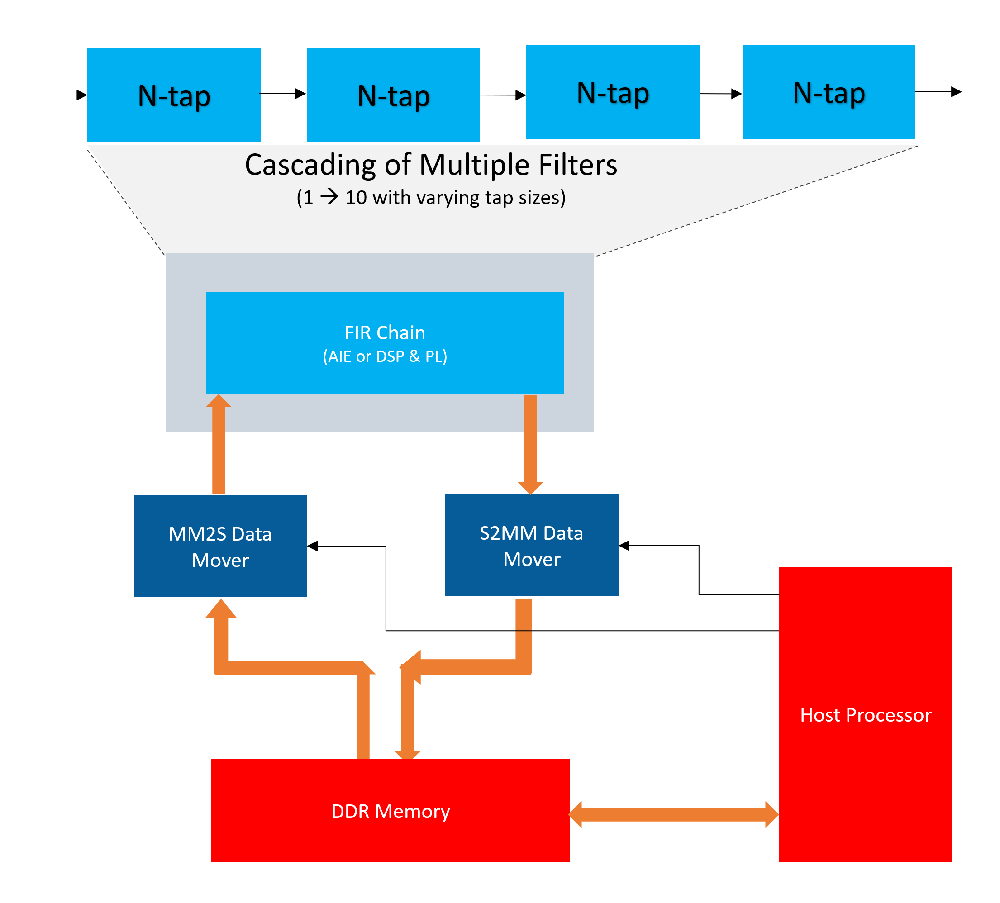
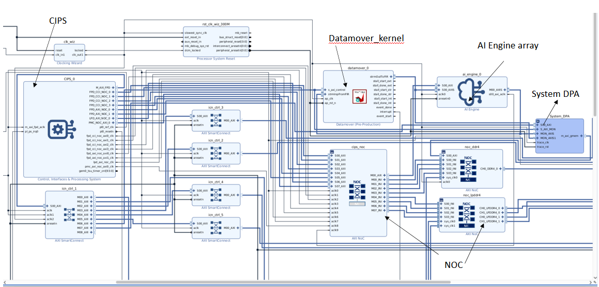
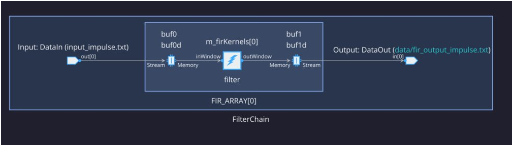

<table class="sphinxhide" style="width:100%;">
  <tr>
    <td align="center">
      <picture>
        <source media="(prefers-color-scheme: dark)" srcset="https://raw.githubusercontent.com/Xilinx/Image-Collateral/main/logo-white-text.png">
        
      </picture>
      <h1>AMD Vitis™ AI Engine Tutorials</h1>
      <a href="https://www.amd.com/en/products/software/adaptive-socs-and-fpgas/vitis.html">See Vitis Development Environment on amd.com</a>
        </br>
      <a href="https://www.amd.com/en/products/software/vitis-ai.html">See Vitis AI Development Environment on amd.com</a>
    </td>
  </tr>
</table>

# AI Engine Implementation

## Table of Contents
[Building the Design](#building-the-design)

[Hardware Design Details](#hardware-design-details)

[Software Design Details](#software-design-details)

[References](#references)

[Revision History](#revision-history)

## Building the Design

<details>
<summary>Design Build</summary>

### Design Build
In this section, you build and run the finite impulse response (FIR) filter design using the AI Engine implementation. You compile the AI Engine design and integrate it into a larger system design. This design includes the programmable logic (PL) kernels and processing system (PS) host application. You can review [Integrating the Application Section in the AI Engine Documentation](#ai-engine-documentation) to understand the general flow.

At the end of this section, the design flow generates a new directory named `build/`. Inside are sub-directories such as `fir_aie_$(N_FIR_FILTERS)firs_$(N_FIR_TAPS)taps` (for example, `fir_aie_1firs_15taps`) based on values of `N_FIR_FILTERS` and `N_FIR_TAPS` used in the build. Each sub-directory contains the `Work/`, `hw_emu/`, and `hw/` sub-folders. 
- `Work/` sub-folder contains the output from the AI Engine compiler. 
- `hw_emu/` sub-folder contains the build for hardware emulation. 
- `hw/` sub-folder contains the build for running hardware on a VCK190 board.   

</details>

<details>
<summary>Make Steps</summary>

### Make Steps
To run the following `make` steps, such as `make kernels`and `make graph`, navigate to the `AIE/` folder.
```bash
cd AIE
```

You can specify the following options in the make step. See the make steps for instructions on applying them.

* TARGET: Set to `hw` or `hw_emu` to build the design in hardware or hardware emulation. The default is `hw_emu`.

* N_FIR_FILTERS: Specifies the number of FIR filters in the chain. The default is 1.

* N_FIR_TAPS: Specifies the number of FIR filter taps. The default is 15.

* FIR_WINDOW_SIZE: Specifies the size of the ping-pong buffers inserted between the FIR filter kernels. The default is 256.

* EN_TRACE: Enables trace data capture when set to 1. Deactivates it when set to 0. The default is 0.

The Makefile uses the following directory references:

```
#Relative fir directory
RELATIVE_PROJECT_DIR := ./

#Absolute fir directory = <user path>/Tutorials/AI_Engine/fir
PROJECT_REPO	:= $(shell readlink -f $(RELATIVE_PROJECT_DIR))

DESIGN_REPO  := $(PROJECT_REPO)/design
AIE_SRC_REPO := $(DESIGN_REPO)/aie_src
PL_SRC_REPO  := $(DESIGN_REPO)/pl_src
HOST_APP_SRC := $(DESIGN_REPO)/host_app_src
VIVADO_METRICS_SCRIPTS_REPO := $(DESIGN_REPO)/vivado_metrics_scripts

SYSTEM_CONFIGS_REPO    := $(DESIGN_REPO)/system_configs
PROFILING_CONFIGS_REPO := $(DESIGN_REPO)/profiling_configs
EXEC_SCRIPTS_REPO      := $(DESIGN_REPO)/exec_scripts
PYTHON_SCRIPTS_REPO    := $(DESIGN_REPO)/python_scripts

BASE_BLD_DIR := $(PROJECT_REPO)/build
FIR_TAPS_BLD_DIR    := $(BASE_BLD_DIR)/fir_$(N_FIR_TAPS)_taps
FIR_FILTERS_DIR     := $(FIR_TAPS_BLD_DIR)/x$(N_FIR_FILTERS)_firs
FIR_WINDOW_SIZE_DIR := $(FIR_FILTERS_DIR)/winSz_$(FIR_WINDOW_SIZE)
AIES_PER_FIR_DIR    := $(FIR_WINDOW_SIZE_DIR)/x$(N_AIES_PER_FIR)_aie_per_fir
BUILD_TARGET_DIR    := $(AIES_PER_FIR_DIR)/$(TARGET)

VIVADO_REPORTS_REPO := $(PROJECT_REPO)/vivado_reports_dir
VIVADO_BLD_REPORTS_DIR := $(REPORTS_REPO)/fir_$(N_FIR_TAPS)_taps/x$(N_FIR_FILTERS)_firs/winSz_$(FIR_WINDOW_SIZE)/x$(N_AIES_PER_FIR)_aie_per_fir

VCD_XPE_REPO := $(PROJECT_REPO)/vcd_xpe_dir
BLD_VCD_XPE_DIR := $(VCD_XPE_REPO)/fir_$(N_FIR_TAPS)_taps/x$(N_FIR_FILTERS)_firs/winSz_$(FIR_WINDOW_SIZE)/x$(N_AIES_PER_FIR)_aie_per_fir
VCD_FILE_NAME := fir_$(N_FIR_TAPS)_taps_x$(N_FIR_FILTERS)_firs_winSz_$(FIR_WINDOW_SIZE)_x$(N_AIES_PER_FIR)_aie_per_fir
BLD_TGT_VCD_FILE := $(BUILD_TARGET_DIR)/$(VCD_FILE_NAME).vcd
XPE_FILE := $(BLD_VCD_XPE_DIR)/graph_$(VCD_FILE_NAME).xpe

EMBEDDED_PACKAGE_OUT := $(BUILD_TARGET_DIR)/package
EMBEDDED_EXEC_SCRIPT := run_script.sh

WORK_DIR := Work
AIESIM_DATA_DIR := $(AIE_SRC_REPO)/aiesim_data
AIESIM_INPUT_FILE := $(AIESIM_DATA_DIR)/input_impulse.txt
```

</details>

<details>
<summary>Build the Entire Design with a Single Command</summary>

### Build the Entire Design with a Single Command
If you are already familiar with the AI Engine and Vitis accelerated kernel compilation flows, you can build the entire design with one command:

```
bash
make run (default hardware emulation, 1 filter 15 taps, no trace enabled)
```
or
```
bash
make run TARGET=hw N_FIR_FILTERS=1 N_FIR_TAPS=15 EN_TRACE=1   (hardware, 1 FIR filters, each with 15 taps, enable tracing)
```

This command runs `make kernels`,`make graph`,`make xsa`,`make application`,`make package` and `make run_emu`. You run them for hardware emulation or for hardware on a VCK190 board, depending on the `TARGET` setting. The default `TARGET` value without specification is `hw_emu`. The provided settings also apply to each individual make step.

**Note**

1. Place the generated files for a build in the individual directory: `build/fir_aie_$(N_FIR_FILTERS)firs_$(N_FIR_TAPS)taps`
2. See the specification in each of the following make steps for applied options and file input and output locations.

</details>

You can build the design by running individual make steps with your chosen options applied to each step.

<details>
<summary>make kernels: Compile PL Kernels</summary>

### make kernels: Compile PL Kernels
In this step, the Vitis compiler uses any kernels (register transfer level (RTL) or high-level synthesis C (HLS C)) in the PL region of the target platform (`xilinx_vck190_base_202520_1`). The compiler creates the  respective XO files.

Run the following command to compile the kernels. The defaults are `TARGET=hw_emu`, `N_FIR_FILTERS=1`, `N_FIR_TAPS=15`, `FIR_WINDOW_SIZE=256`, and `EN_TRACE=0`:

```
make kernels
```

The expanded command is:
```
mkdir -p build/fir_$(N_FIR_TAPS)_taps/x$(N_FIR_FILTERS)_firs/winSz_$(FIR_WINDOW_SIZE)/x$(N_AIE_PER_FIR)_aie_per_fir/hw_emu

cd build/fir_$(N_FIR_TAPS)_taps/x$(N_FIR_FILTERS)_firs/winSz_$(FIR_WINDOW_SIZE)/x$(N_AIE_PER_FIR)_aie_per_fir/hw_emu

v++ 	--target hw_emu					\
	--hls.clock 300000000:datamover 		\
        -D N_FIR_TAPS=$(N_FIR_TAPS)                     \
        -D N_FIR_FILTERS=$(N_FIR_FILTERS)               \
	--platform xilinx_vck190_base_202520_1		\
	--save-temps 					\
	--temp_dir build/fir_$(N_FIR_TAPS)_taps/x$(N_FIR_FILTERS)_firs/winSz_$(FIR_WINDOW_SIZE)/x$(N_AIE_PER_FIR)_aie_per_fir/hw_emu/_x	\
	--verbose 					\
	-g -c 						\
	-k datamover 					\
	design/pl_src/datamover.cpp 		\
	-o datamover.hw_emu.xo   
```
Summary of the switches used:
|Switch|Description|
|  ---  |  ---  |
|--target \| -t [hw\|hw_emu]|Specifies the build target.|
|--hls.clock | Specifies a frequency in Hz for listed kernels compiled by Vitis HLS. |
|--platform \| -f|Specifies the name of a supported acceleration platform from the `$PLATFORM_REPO_PATHS` environment variable or the full path of the platform XPFM file.|
|--save-temps \| -s|Directs the Vitis compiler command to save intermediate files and directories created during the compilation and link process. Use the `--temp_dir` option to specify a location to write the intermediate files to.|
|--temp_dir <string>|Specifies where to store temporary files created during the build process. The Vitis compiler writes temporary results, then removes them unless you specify using the `--save-temps` option.|
|--verbose|Displays verbose or debug information.|
| -g | Generates code for debugging the kernel during software emulation. This option adds features to facilitate debugging the kernel during compilation. |
|--compile \| -c|Generate XO files from kernel source files. This is required.|
|--kernel \<arg\>\|-k \<arg\>|Compiles only the specified kernel from the input file. You can use only one `-k` option per Vitis compiler command.|
|--output \| -o|Specifies the name of the output file generated by the `v++` command. Make sure the compilation process output name ends with the XO file suffix.|

[Detailed Description of All Vitis Compiler Switches](https://docs.amd.com/r/en-US/ug1399-vitis-hls/vitis-v-and-vitis-run-Commands)

|Input|Description|
|  ---  |  ---  |
|datamover.cpp|The data-mover PL kernel source code.|

|Output|Description|
|  ---  |  ---  |
|datamover.hw/hw_emu.xo|The data-mover kernel object file.|

</details>

<details>
<summary>make graph: Creating the AI Engine ADF Graph for Vitis Compiler Flow</summary>

### make graph: Creating the AI Engine ADF Graph for Vitis Compiler Flow

You create an adaptive data flow (ADF) graph to connect to an extensible Vitis platform. You can connect the graph I/Os either to platform ports or to ports on Vitis kernels through Vitis compiler connectivity directives.
* The AI Engine ADF C++ graph of the design contains AI Engine kernels.
* The C++ graph defines all interconnects between kernels.
* The simulation testbench (`graph.cpp`) fully specifies all interconnections to external I/O when instantiating the C++ ADF graph object.

Run the following command to compile the graph using the Makefile flow type. The defaults are `TARGET=hw_emu`, `N_FIR_FILTERS=1`, `N_FIR_TAPS=15`, `FIR_WINDOW_SIZE=256`, and `EN_TRACE=0`:
```
make graph
```

The expanded command is as follows:
```
cd build/fir_aie_$(N_FIR_FILTERS)firs_$(N_FIR_TAPS)taps/hw_emu

aiecompiler     -include=$(DSPLIB_ROOT)/L1/src/aie 		\
		-include=$(DSPLIB_ROOT)/L1/include/aie 		\
		-include=$(DSPLIB_ROOT)/L2/include/aie 		\
		-include=design/aie_src 		\
		--platform=$(PLATFORM_REPO_PATHS)/xilinx_vck190_base_202520_1/xilinx_vck190_base_202520_1.xpfm 	\
		--workdir=Work 					\
	        --Xpreproc="-DITER_CNT=$(ITER_CNT)"             \
		--Xpreproc="-DN_FIR_FILTERS=$(N_FIR_FILTERS)"   \
		--Xpreproc="-DN_FIR_TAPS=$(N_FIR_TAPS)"         \
		--Xpreproc="-DN_AIES_PER_FIR=$(N_AIES_PER_FIR)"    \
		--Xpreproc="-DFIR_WINDOW_SIZE=$(FIR_WINDOW_SIZE)"  \
		--Xpreproc="-DN_AIE_ITERS=$(N_AIE_ITERS)"--Xpreproc="-N_FIR_FILTERS=1" \
                --Xpreproc="-N_FIR_TAPS=15" 			\
		--Xmapper=BufferOptLevel9			\
		--Xrouter=DMAFIFOsInFreeBankOnly		\
		--log-level=5 					\
		--pl-freq=300 					\
		--verbose 					\
		--dataflow 					\
		design/aie_src/fir_aie_graph.cpp
 ```

Summary of the switches used:
|Switch|Description|
|  ---  |  ---  |
|--include=\<string\>|Specifies compile-time include directory (zero or more).|
|--platform=\<string\>|This is a path to a Vitis platform file that defines the hardware and software components available for hardware design and register transfer level (RTL) co-simulation.|
|--workdir=\<string\>|Specifies a different output directory instead of the default `Work` sub-directory.|
|--log-level=\<int\>|Sets verbose logging level. The default=1.|
|--pl-freq=\<value\>|Specifies the interface frequency (in MHz) for all programmable logic input/output (PLIO)s. The default frequency is a quarter of the AI Engine frequency and the maximum supported frequency is half of the AI Engine frequency. The graph provides the PL frequency specific to each interface.|
|--verbose|Verbose output of the AI Engine compiler emits compiler messages at various stages of compilation. These debug and tracing logs provide useful messages regarding the compilation process.|

[AI Engine Programming Environment Documentation](https://docs.amd.com/r/en-US/ug1076-ai-engine-environment)

|Inputs Sources|Description|
|  ---  |  ---  |
|fir_aie_graph.cpp|AIE kernel base FIR filter graph source code.|

|Output Objects|Description|
|  ---  |  ---  |
|libadf.a|Compiled AI Engine design graph|
|Work/|Directory that contains all outputs of the AI Engine compiler.|

</details>


<details>
<summary>make xsa: Use Vitis Tools to Link AI Engine and HLS Kernels with the Platform</summary>

### make xsa: Use Vitis Tools to Link AI Engine and HLS Kernels with the Platform
After compiling the AI Engine graph and PL HLS kernels, you can use the Vitis compiler to link them with the platform to generate an XSA file.

With the Vitis tools you can integrate the AI Engine graph and HLS kernels into an existing extensible platform. This step runs automatically. You select a platform provided by the hardware designer or you can choose an extensible base platform from AMD. The Vitis tools then build the hardware design and integrate the AI Engine and PL kernels into the design.

To test this feature in this tutorial, use the base VCK190 platform to build the design.

Run this command with the default values `TARGET=hw_emu`, `N_FIR_FILTERS=1`, `N_FIR_TAPS=15`, `FIR_WINDOW_SIZE=256`, and `EN_TRACE=0`:
```
make xsa
```

The expanded command is as follows:
```
cd build/fir_$(N_FIR_TAPS)_taps/x$(N_FIR_FILTERS)_firs/winSz_$(FIR_WINDOW_SIZE)/x$(N_AIE_PER_FIR)_aie_per_fir/hw_emu

v++ 	-l 						\
	--platform xilinx_vck190_base_202520_1		\
	--save-temps 					\
	--temp_dir build/fir_$(N_FIR_TAPS)_taps/x$(N_FIR_FILTERS)_firs/winSz_$(FIR_WINDOW_SIZE)/x$(N_AIE_PER_FIR)_aie_per_fir/hw_emu/_x		\
	--verbose 					\
	-g 						\
	--clock.defaultTolerance 0.001 			\
	--clock.freqHz 300000000:datamover_0 		\
	--config $(SYSTEM_CONFIGS_REPO)/system.cfg 	\
	-t hw_emu 					\
	-o vck190_aie_fir.hw_emu.xsa  			\
	datamover.hw_emu.xo				\
        ../libadf.a

```

If `EN_TRACE` is active, also set these `v++` flags:
```
	--profile.trace_memory DDR			\
  	--profile.data datamover:datamover_0:all \
	--profile.data ai_engine_0.DataIn		\
	--profile.data ai_engine_0.DataOut

```
These flags capture trace data from the specified ports.

Summary of the switches used:

|Switch|Description|
|  ---  |  ---  |
|--platform \| -f|Specifies the name of a supported acceleration platform from the `$PLATFORM_REPO_PATHS` environment variable or the full path to the platform XPFM file.|
|--save-temps \| -s|Directs the `v++` command to save intermediate files and directories created during the compilation and link process. Use the `--temp_dir` option to specify a location to write the intermediate files to.|
|--temp_dir <string>|Manages the location where the tool writes temporary files created during the build process. The Vitis compiler writes the temporary results, and then removes them unless you specify the `--save-temps` option.|
|--verbose|Displays verbose and debug information.|
| -g | Generates code for debugging the kernel during software emulation. Use this option to add features to facilitate debugging the kernel as it compiles. |
|--clock.freqHz \<freq_in_Hz\>:\<cu\>\[.\<clk_pin\>\]|Specifies a clock frequency in Hz and assigns it to a list of associated compute units (CUs) and optional clock pins on the CU.|
|--config <config_file>|Specifies a configuration file containing `v++` switches.|
|--target \| -t [hw\|hw_emu]|Specifies the build target.|
|--output \| -o|Specifies the name of the output file generated by the `v++` command. The linking process output file name must end with the .xsa suffix|
|--profile.data [<kernel_name>\|all]:[<cu_name>\|all]:[<interface_name>\|all]\(:[counters\|all]\)|Enables monitoring of data ports through the monitor IPs. Specify this option during linking. [Detailed Profiling Options](https://docs.amd.com/r/en-US/ug1701-vitis-accelerated-embedded/Enabling-Profiling-in-Your-Application) |
|--profile.trace_memory \<FIFO\>:\<size\>\|\<MEMORY\>[\<n\>]|Specifies the type and amount of memory to use for capturing trace data when building the hardware target \(-t=hw\). [Detailed Profiling Options](https://docs.amd.com/r/en-US/ug1701-vitis-accelerated-embedded/Enabling-Profiling-in-Your-Application) |

[Detailed Description of All Vitis Compiler Switches](https://docs.amd.com/r/en-US/ug1399-vitis-hls/vitis-v-and-vitis-run-Commands)
[Linking the Kernels in Vitis](https://docs.amd.com/r/en-US/ug1701-vitis-accelerated-embedded/Linking-the-System)

|Inputs Sources|Description|
|  ---  |  ---  |
|datamover.hw/hw_emu.xo|The data-mover kernel object file.|
|libadf.a|Compiled AI Engine design graph|

|Output Objects|Description|
|  ---  |  ---  |
|vck190_aie_fir.hw_emu.xsa|Compiled Platform Binary Container|

</details>

 <details>
<summary>make application: Compile the Host Application</summary>

### make application: Compile the Host Application
You can compile the host application by following the typical cross-compilation flow for the Cortex-A72. To build the application run the following command (default TARGET=hw_emu, N_FIR_FILTERS=1, N_FIR_TAPS=15, FIR_WINDOW_SIZE=256, EN_TRACE=0):
```
make application
```

The expanded command is as follows:
```
aarch64-linux-gnu-g++ 	-O 					\
			-c -std=c++17				\
			-D__linux__ 				\
			-D__PS_ENABLE_AIE__			\
			-DXAIE_DEBUG 				\
			-D__linux__				\
			-D__PS_ENABLE_AIE__			\
			-DXAIE_DEBUG				\
			-DN_FIR_FILTERS=$(N_FIR_FILTERS)	\
			-DN_FIR_TAPS=$(N_FIR_TAPS)		\
			-DN_AIES_PER_FIR=$(N_AIES_PER_FIR)	\
			-DFIR_WINDOW_SIZE=$(FIR_WINDOW_SIZE) 	\
			-I$(SDKTARGETSYSROOT)/usr/include/xrt 	\
			-I$(XILINX_VITIS)/aietools/include/ 	\									\
			-I$(SDKTARGETSYSROOT)/usr/include		\
			-I$(SDKTARGETSYSROOT)/usr/lib			\
			-Idesign/aie_src		\
			-Idesign/aie_src/inc		\
			-Idesign/aie_src/src		\
			-I$(DSPLIB_ROOT)/L1/src/aie 		\
			-I$(DSPLIB_ROOT)/L1/include/aie		\
			-I$(DSPLIB_ROOT)/L2/include/aie 	\
			build/fir_aie_$(N_FIR_FILTERS)firs_$(N_FIR_TAPS)taps/Work/ps/c_rts/aie_control_xrt.cpp 	\
			-o build/fir_$(N_FIR_TAPS)_taps/x$(N_FIR_FILTERS)_firs/winSz_$(FIR_WINDOW_SIZE)/x$(N_AIE_PER_FIR)_aie_per_fir/hw_emu/app_control.o

aarch64-linux-gnu-g++ 	-O 					\
			-c -std=c++14 				\
			-D__linux__ 				\
			-D__PS_ENABLE_AIE__ 			\
			-DXAIE_DEBUG				\
			-D__linux__				\
			-D__PS_ENABLE_AIE__			\
			-DXAIE_DEBUG				\
			-DN_FIR_FILTERS=$(N_FIR_FILTERS)	\
			-DN_FIR_TAPS=$(N_FIR_TAPS)		\
			-DN_AIES_PER_FIR=$(N_AIES_PER_FIR)	\
			-DFIR_WINDOW_SIZE=$(FIR_WINDOW_SIZE) 	\
			-I$(SDKTARGETSYSROOT)/usr/include/xrt 	\
			-I$(XILINX_VITIS)/aietools/include/ 	\									\
			-I$(SDKTARGETSYSROOT)/usr/include		\
			-I$(SDKTARGETSYSROOT)/usr/lib			\
			-Idesign/aie_src		\
			-Idesign/aie_src/inc		\
			-Idesign/aie_src/src		\
			-I$(DSPLIB_ROOT)/L1/src/aie 		\
			-I$(DSPLIB_ROOT)/L1/include/aie		\
			-I$(DSPLIB_ROOT)/L2/include/aie    	\
			design/app_src/fir_aie_app.cpp \
			-o build/fir_$(N_FIR_TAPS)_taps/x$(N_FIR_FILTERS)_firs/winSz_$(FIR_WINDOW_SIZE)/x$(N_AIE_PER_FIR)_aie_per_fir/hw_emu/fir_aie_app.o 			\
			-L$(SDKTARGETSYSROOT)/usr/lib 		\
			-L$(XILINX_VITIS)/aietools/lib/aarch64.o								\
			-L$(XILINX_VITIS)/aietools/lib/lnx64.o 	\
			-ladf_api_xrt 				\
			-lxrt_coreutil

aarch64-linux-gnu-g++ 	build/fir_$(N_FIR_TAPS)_taps/x$(N_FIR_FILTERS)_firs/winSz_$(FIR_WINDOW_SIZE)/x$(N_AIE_PER_FIR)_aie_per_fir/hw_emu/app_control.o			\
			build/fir_$(N_FIR_TAPS)_taps/x$(N_FIR_FILTERS)_firs/winSz_$(FIR_WINDOW_SIZE)/x$(N_AIE_PER_FIR)_aie_per_fir/hw_emu/fir_aie_app.o			\
			-L$(SDKTARGETSYSROOT)/usr/lib 			\
			-L$(XILINX_VITIS)/aietools/lib/aarch64.o							 	\
			-L$(XILINX_VITIS)/aietools/lib/lnx64.o 	\
			-ladf_api_xrt 				\
			-lxrt_coreutil 				\
			-o build/fir_$(N_FIR_TAPS)_taps/x$(N_FIR_FILTERS)_firs/winSz_$(FIR_WINDOW_SIZE)/x$(N_AIE_PER_FIR)_aie_per_fir/hw_emu/fir_aie_xrt.elf
```

Summary of the switches used:
|Switch|Description|
|  ---  |  ---  |
|-O \| Optimize|Optimizes compilation. It increases time and memory, but reduces code size and execution time without performing any optimizations that can take a great deal of compilation time.|
|-c |Compiles or assembles the source files without linking.|
|-std=<\standard\>|Sets the language standard.|
|-D__linux__| |
|-DXAIE_DEBUG|Enables the debug interface so you can dump certain core status, event status, or stack trace information.|
|-D\<Pre-processor Macro String\>=\<value\>|Passes pre-processor macro definitions to the cross-compiler.|
|-I \<dir\>|Adds the directory `dir` to your header file search paths.|
|-o \<file\>|Places the output in `<file>` whether it is an executable file, object file, assembly language file, or preprocessed C code.|
|-l\<library\>|Searches the library named `library` when linking. The two-dimensional fast fourier transfer (2D-FFT) tutorial requires the `adf_api_xrt` and `xrt_coreutil` libraries.|
|-L \<dir\>|Adds the `<dir>` directory to your library search paths for the `-l` option.|

[XRT Documentation](https://xilinx.github.io/XRT/master/html/index.html)
[Details of Host Application Programming](https://docs.amd.com/r/en-US/ug1076-ai-engine-environment/Host-Programming-for-Bare-Metal)

|Inputs Sources|Description|
|  ---  |  ---  |
|Work/ps/c_rts/aie_control_xrt.cpp|This is the AI Engine control code generated implementing the FIR filter graph APIs.|
|fir_aie_app.cpp|Host processor application source code file runs on an A72 processor.|

|Intermediate Objects|Description|
|  ---  |  ---  |
|app_control.o|Compiled AI Engine control code object.|
|fir_aie_app.o|Compiled host processor application object.|


|Output Objects|Description|
|  ---  |  ---  |
|fir_aie_xrt.elf|The executable runs on an A72 processor.|

</details>

<details>
<summary>make package: Package the Design</summary>

### make package: Package the Design
With the AI Engine outputs and the new platform created, you can generate the programmable device image (PDI) and a package to use on an SD card. The PDI contains all executables, bitstreams, and device configurations. The packaged SD card directory contains everything needed to boot Linux, run generated applications, and load `.xclbin`.

run this command with the default values `TARGET=hw_emu`, `N_FIR_FILTERS=1`, `N_FIR_TAPS=15`, `FIR_WINDOW_SIZE=256`, and `EN_TRACE=0`:
```
make package
```

or use the expanded command:
```
cd build/fir_$(N_FIR_TAPS)_taps/x$(N_FIR_FILTERS)_firs/winSz_$(FIR_WINDOW_SIZE)/x$(N_AIE_PER_FIR)_aie_per_fir/hw_emu 

v++	-p  							\
	-t hw_emu						\
	--save-temps						\
	--temp_dir build/fir_$(N_FIR_TAPS)_taps/x$(N_FIR_FILTERS)_firs/winSz_$(FIR_WINDOW_SIZE)/x$(N_AIE_PER_FIR)_aie_per_fir/hw_emu/_x	\
	-f xilinx_vck190_base_202520_1												\
	--package.sd_dir $(XRT_ROOT) 									\
	--package.rootfs $(COMMON_IMAGE_VERSAL)/rootfs.ext4 						\
	--package.kernel_image $(COMMON_IMAGE_VERSAL)/Image 						\
	--package.boot_mode=sd										\
	--package.out_dir $(EMBEDDED_PACKAGE_OUT)							\
	--package.out_dir build/fir_aie_$(N_FIR_FILTERS)firs_$(N_FIR_TAPS)taps/hw_emu/package	        		\
	--package.image_format=ext4												\
	--package.sd_file build/fir_$(N_FIR_TAPS)_taps/x$(N_FIR_FILTERS)_firs/winSz_$(FIR_WINDOW_SIZE)/x$(N_AIE_PER_FIR)_aie_per_fir/hw_emu/fir_aie_xrt.elf     		\
			  build/fir_$(N_FIR_TAPS)_taps/x$(N_FIR_FILTERS)_firs/winSz_$(FIR_WINDOW_SIZE)/x$(N_AIE_PER_FIR)_aie_per_fir/hw_emu/vck190_aie_fir.hw_emu.xsa 	\
			  build/fir_$(N_FIR_TAPS)_taps/x$(N_FIR_FILTERS)_firs/winSz_$(FIR_WINDOW_SIZE)/x$(N_AIE_PER_FIR)_aie_per_fir/hw_emu/libadf.a 				\
	--package.defer_aie_run
```
If `EN_TRACE` is active, also add the following `v++` flags:
```
	--package.sd_file ./xrt.ini
```
This includes the XRT `ini` file with tracing parameters.

|Switch|Description|
|  ---  |  ---  |
|--package \| -p|Packages the final product at the end of the Vitis compile and link build process.|
|--target \| -t [hw\|hw_emu]|Specifies the build target.|
|--save-temps \| -s|Directs the `v++` command to save intermediate files/directories created during the compilation and link process. Use the `--temp_dir` option to specify a location to write the intermediate files to.|
|--temp_dir <string>|Manages the location where the tool writes temporary files created during the build process. The Vitis compiler writes the temporary results and then removes them unless you specify the `--save-temps` option.|
|--platform \| -f|Specifies the name of a supported acceleration platform as specified by the $PLATFORM_REPO_PATHS environment variable or the full path to the platform XPFM file.|
|--package.sd_dir \<arg\>|Where <arg> specifies a folder to package into the sd_card directory/image. The contents of the directory are copied to a sub-folder of the `sd_card` folder.|
|--package.rootfs \<arg\>|Where \<arg\> specifies the absolute or relative path to a processed Linux root file system file. The platform RootFS file is available for download from xilinx.com. Refer to the Vitis Software Platform Installation for more information.|
|--package.kernel_image \<arg\>|Where \<arg\>Specifies the absolute or relative path to a Linux kernel image file. Overrides the existing image available in the platform. The platform image file is available for download from xilinx.com. Refer to the Vitis Software Platform Installation for more information.|
|--package.boot_mode \<arg\>|Where \<arg\>Specifies <ospi\|qspi\|sd> Boot mode used for running the application in emulation or on hardware.|
|--package.image_format|Where \<arg\>Specifies \<ext4\|fat32\> output image file format. `ext4`: Linux file system and `fat32`: Windows file system|
|--package.sd_file|Where \<arg\>Specifies an ELF or other data file to package into the `sd_card` directory/image. You can use this option multiple times to specify files to add to the `sd_card`.|
|--package.defer_aie_run| Loads the AI Engine application with the ELF file, but start it only when directed by graph run commands. This is required in the PS-based AI Engine flow.|

[Detailed Description of All Vitis Compiler Switches](https://docs.amd.com/r/en-US/ug1399-vitis-hls/vitis-v-and-vitis-run-Commands)
[Details of Packaging the System](https://docs.amd.com/r/en-US/ug1701-vitis-accelerated-embedded/Packaging-for-Vitis-Flow)

|Inputs Sources|Description|
|  ---  |  ---  |
|$(COMMON_IMAGE_VERSAL)/rootfs.ext4|The root filesystem file for PetaLinux.|
|$(COMMON_IMAGE_VERSAL)/Image|The pre-built PetaLinux image the processor boots from.|
|$(BUILD_TARGET_DIR)/fir_aie_xrt.elf|The PS host application executable created in the `make application` step.|
|$(BUILD_TARGET_DIR)/vck190_aie_fir.hw_emu.xsa|The XSA file created in the `make xsa` step.|
|$(BUILD_TARGET_DIR)/libadf.a|The compiled AI Engine design graph created in the `make graph` step.|

The output of the `v++` Package step is the package directory that contains the contents to run hardware emulation.

|Output Objects|Description|
|  ---  |  ---  |
|$(BUILD_TARGET_DIR)/package|The hardware emulation package that contains the boot file, hardware emulation launch script, the PLM and PMC boot files, the PMC and QEMU command argument specification files, and the Vivado tools simulation folder.|

</details>

<details>
<summary>make run_emu: Run Hardware Emulation</summary>

### make run_emu: Run Hardware Emulation
After packaging, everything is set to run emulation or hardware.
To run emulation use the following command with the defaults `TARGET=hw_emu`, `N_FIR_FILTERS=1`, `N_FIR_TAPS=15`, `FIR_WINDOW_SIZE=256`, and `EN_TRACE=0`:
```
make run_emu
```
or
```
cd build/fir_$(N_FIR_TAPS)_taps/x$(N_FIR_FILTERS)_firs/winSz_$(FIR_WINDOW_SIZE)/x$(N_AIE_PER_FIR)_aie_per_fir/hw_emu/package
./launch_hw_emu.sh 
```
When launched, the QEMU simulator loads. Wait for the autoboot countdown to go to zero, and after a few minutes, the root Linux prompt appears.
```bash
root@versal-rootfs-common-2025_2:~#
```

In some cases, the following error might come up on the screen:
```
root@versal-rootfs-common-2025_2:~## xinit: giving up
xinit: unable to connect to X server: Connection refused
xinit: server error
Enabling notebook extension jupyter-js-widgets/extension...
      - Validating: OK
[C 13:46:09.233 NotebookApp] Bad config encountered during initialization:
[C 13:46:09.239 NotebookApp] No such notebook dir: ''/usr/share/example-notebooks''
```
You can ignore this error. Press <Enter> to return to the root prompt.

After the root prompt comes up, run the following commands to run the design:  
```
mount /dev/mmcblk0p1 /mnt
cd /mnt
./fir_aie_xrt.elf a.xclbin
```
The `fir_aie_xrt.elf` should execute, and after a few minutes, you should see the output with *TEST PASSED* on the console. When this is shown, run the following keyboard command to exit the QEMU instance:

```
#To exit QEMU Simulation
Press **Ctrl+A**, let go of the keyboard, and then press **x**
```

To run with waveform do the following:
```
cd build/fir_$(N_FIR_TAPS)_taps/x$(N_FIR_FILTERS)_firs/winSz_$(FIR_WINDOW_SIZE)/x$(N_AIE_PER_FIR)_aie_per_fir/hw_emu/package
./launch_hw_emu.sh -g
```
The XSIM Waveform Viewer is launched. Drag the signals into the Viewer and click **Play** to start the emulation. Go back to the terminal and wait for the Linux prompt to show up.

In the XSIM Waveform Viewer, the signals you added to the waveform adjusting over the execution of the design. Once done, hit the pause button and close the window to end the emulation.

</details>

<details>
<summary>TARGET=hw: Run on Hardware</summary>

### Run on Hardware

To run the design in hardware, re-run the following "make" steps with TARGET=hw and other applicable options (see the previously listed make steps)
```
make kernels     TARGET=hw
make graph       TARGET=hw
make xsa         TARGET=hw
make application TARGET=hw
make package     TARGET=hw
```
You can also do this in a single step with the following command:
```
make build TARGET=hw
```

These commands create a `build/fir_$(N_FIR_TAPS)_taps/x$(N_FIR_FILTERS)_firs/winSz_$(FIR_WINDOW_SIZE)/x$(N_AIE_PER_FIR)_aie_per_fir/hw` folder with the kernels, `xsa` and `package` for a hardware run.

Run the following command to copy the boot image to the `run_dir` folder (`build/fir_$(N_FIR_TAPS)_taps/x$(N_FIR_FILTERS)_firs/winSz_$(FIR_WINDOW_SIZE)/x$(N_AIE_PER_FIR)_aie_per_fir/hw/package/sd_card.img`)  (`run_dir/fir_aie_$(N_FIR_FILTERS)firs_$(N_FIR_TAPS)taps`):
```
make run_emu TARGET=hw
```

Now follow **Steps 1-9** to run the `fir_aie_xrt.elf` executable on your VCK190 board.

**Step 1.** Power off your board.

**Step 2.** Use an SD card writer (such as balenaEtcher) to flash the `sd_card.img` file onto an SD card.

**Step 3.** Plug the flashed SD card into the top slot of the VCK190 board.

**Step 4.** Set the switch SW1 Mode\[3:0\]=1110 = OFF OFF OFF ON.

**Step 5.** Connect your computer to the VCK190 board using the included USB cable.

**Step 6.** Open a TeraTerm terminal and select the correct COM port. Set the port settings to the following:
```
Port: <COMMXX>
Speed: 115200
Data: 8 bits
Parity: none
Stop Bits: 1 bit
Flow control: none
Transmit delay: 0 msec/char 0 msec/line
```

**Step 7.** Power ON the board.

**Step 8.** Wait until you see the `root@versal-rootfs-common-2025_2` Linux command prompt. Press enter a few times to get past any `xinit` errors.

**Step 9.** Run the following commands into the TeraTerm terminal:
```
cd /mnt/sd-mmcblk0p1
./fir_aie_xrt.elf a.xclbin
```

After execution completes and the testcase passes data integrity check, *TEST PASSED* should appear on the terminal.

</details>

## Hardware Design Details
<details>
<summary>FIR Filter AI Engine Implementation architecture and  AI Engine/PL Function Partitioning</summary>

### FIR Filter AI Engine Implementation Architecture and AI Engine/PL Function Partitioning
The following figure shows a high level block diagram of the design. The test harness consists of the compute kernels, data mover kernels, and DDR to store input and output vectors. The two implementations maintain this setup (using AI Engine in this section of the tutorial and HLS and DSPs in the other). In this setup, the interface between the data mover kernels and DDR is memory mapped AXI4 and it is AXI4-stream between data mover kernel and AI Engine kernel. The mm2s kernel moves data from the DDR memory into the FIR filter and the s2mm kernel moves the data from FIR filter back to DDR memory. The data widths of both the kernels are 128-bit wide and runs at 300 MHz, thereby providing a transfer rate of up to 1.2G samples per second.



</details>

<details>
<summary>Design Details</summary>

### Design Details
In this tutorial, you start with a base platform containing the control interface and processing system (CIPS), network on chip (NoC), AIE, and the interfaces among them. You run the v++ linker step to build on the base platform by adding AIE graphs and PL kernels. To implement various functions in a system-level design, you add PL kernels to the base platform depending on the application, so the PL kernels in each design vary. You connect an ADF graph to an extensible Vitis platform, linking the graph I/O ports to either platform ports or ports on Vitis kernels through Vitis compiler connectivity directives. In the design, you add the components with the v++ -l step (make XSA in the preceding tool flow section), which include the following:

* FIR filter AI Engine graph (`libadf.a`)
* Data mover kernel (`datamover.[hw|hw_emu].xo`)
* Connections interfaces defined in system configuration file (system.cfg)

Open the design in the Vivado tolls to view the schematic with the extended platform, as shown in the following figure.

`build/fir_$(N_FIR_TAPS)_taps/x$(N_FIR_FILTERS)_firs/winSz_$(FIR_WINDOW_SIZE)/x$(N_AIE_PER_FIR)_aie_per_fir/[hw|hw_emu]/_x/link/vivado/vpl/prj/prj.xpr`



Implement the actual FIR filter chain in the AI Engine domain. The graph connects the specified number of filters in sequence. For simple benchmarking, all filters in the chain are identical, though such a chain is unlikely in a practical application.

You add the system debugging and profiling IP (DPA) to the PL region of the device to capture AIE run-time trace data when the `EN_TRACE` option is enabled. The memory‑mapped‑to‑stream (mm2s) and stream‑to‑memory‑mapped (s2mm) kernels, along with the AI Engine array interface, operate at 300 MHz.

</details>

<details>
<summary>AI Engine and PL Kernels</summary>

### AI Engine and PL Kernels
In the top level AIE graph `fir_aie_graph.h`, you instantiate the symmetric FIR filter from the AI Engine DSP library, (DSPLib). You then use a `for` loop to connect them in a chain. The file `fir_aie_graph.cpp` instantiates this filter chain and connects it to the AIE's 128-bit PLIO interfaces.

The PL-based data mover consists of DATAMOVER kernels, which stream data pattern into the AI Engine array. The final FIR output from the AI Engine array moves back into the DATAMOVER kernel for error checking. The AI Engine array interface with the DATAMOVER kernel uses an AXI4-Stream protocol. The DATAMOVER kernels use a 128-bit data width and operate at 300 MHz. 

</details>

## Software Design Details
The software design in the FIR Filter AI Engine implementation consists of the following sections:

<details>
<summary>AI Engine Kernels and Graph Representation</summary>

### AI Engine Kernels and Graph Representation
DSPLib FIR filter kernels are C/C++ programs written using specialized intrinsic calls that target the VLIW vector processor. The AI Engine compiler compiles the kernel code to produce an executable ELF file for each of the AI Engines used in the design. Review [AI Engine Kernel Programming Section in the AI Engine Documentation](#ai-engine-documentation) for a high-level overview of kernel programming. You can stitch  DSPLib kernels together to function as AI Engine graphs written in C++. In this design, the AI Engine compiler writes a summary of compilation results to `build/fir_aie_$(N_FIR_FILTERS)firs_$(N_FIR_TAPS)taps/Work/fir_aie_graph.aiecompile_summary`. You can view the graph by running the following command:

`vitis_analyzer build/fir_aie_$(N_FIR_FILTERS)firs_$(N_FIR_TAPS)taps/Work/fir_aie_graph.aiecompile_summary`

The following figures show the graph representation of the AI Engine kernels (`N_FIR_FILTERS=1`, `N_FIR_TAPS=64`).



</details>

<details>
<summary>Data Flow Graph</summary>

### Data Flow Graph

This section describes the overall data-flow graph specification of the FIR filter design using AI Engine, compiled by the AI Engine compiler. Refer to [AI Engine Programming Section in the AI Engine Documentation](#ai-engine-documentation) for information on ADF graphs.

The overall graph definition of the design resides in the `fir_aiegraph.cpp` file, and the top level graph contains the subgraph defined in `fir_aie_graph.h`, described in the following subsection.

#### Define the Graph Class
Define the FIR graph class by using the objects defined in the appropriate name space that must include the ADF library. To access ADF library elements, use the following declaration to scope into it:
` using namespace adf;`
Additionaly declare the following namespace to access the DSPLib library:
`namespace dsplib = xf::dsp::aie`
Define all user graphs from the class `graph` in the `fir_aie_graph.h` file. For example:

`class FirGraph : public graph`

Declare the top level ports to the subgraph:

```public:
   input_plio   in    = input_plio::create("DataIn", plio_128_bits, "input_impulse.txt");
   output_plio  out  = output_plio::create("DataOut", plio_128_bits, "data/fir_output_impulse.txt");
```

#### Instantiate DSPLib FIR Filters

Instantiate the DSPLib symmetric FIR filter kernels using the following array declaration. In C++, each array element requires its own template parameters, even when identical:
```
        FirGraph():  FIR_ARRAY {
                dsplib::fir::sr_sym::fir_sr_sym_graph<T_DATA, T_COEF, N_FIR_TAPS, FIR_DOWNSHIFT, FIR_ROUND_MODE, FIR_WINDOW_SIZE, N_AIES_PER_FIR> (FIR_TAP_COEFS)
#if (N_FIR_FILTERS >= 2)
                , dsplib::fir::sr_sym::fir_sr_sym_graph<T_DATA, T_COEF, N_FIR_TAPS, FIR_DOWNSHIFT, FIR_ROUND_MODE, FIR_WINDOW_SIZE, N_AIES_PER_FIR> (FIR_TAP_COEFS)
#endif
#if (N_FIR_FILTERS >= 3)
                , dsplib::fir::sr_sym::fir_sr_sym_graph<T_DATA, T_COEF, N_FIR_TAPS, FIR_DOWNSHIFT, FIR_ROUND_MODE, FIR_WINDOW_SIZE, N_AIES_PER_FIR> (FIR_TAP_COEFS)
#endif
<... etc>
```


#### Add Connectivity Information

Add connectivity by using the templated `connect<>` object. In this cascaded chain, connect the input of the first FIR filter to the subgraph input `in`. Then connect the output of the last FIR filter to the subgraph output `out`. When more than one FIR filter is present, daisy-chain their inputs and outputs together:

```
                connect<>(in.out[0], FIR_ARRAY[0].in[0]);
		if (N_FIR_FILTERS > 1)  {
			for (ix = 1; ix < N_FIR_FILTERS; ix++)  {
				connect<>(FIR_ARRAY[ix-1].out[0], FIR_ARRAY[ix].in[0]);
			}
		}
		connect<>(FIR_ARRAY[N_FIR_FILTERS-1].out[0], out.in[0]);
```

#### Top Level Application
Define a top-level application `fir_aie_graph.cpp` file in this design to create an instance of the `FirGraph` graph, and trigger it with graph API calls. The file connects the graph to a simulation platform to provide file input and output:
```
FirGraph FilterChain;
```
To simulate the graph using the AI Engine simulator, or the x86 functional simulator, define a main function that initializes the `FilterChain`, runs it for the specified number of iterations, and performs cleanup:
```
#if defined(__AIESIM__) || defined(__NEW_X86Sim__)

int main(void) {
        FilterChain.init() ;
        FilterChain.run(ITER_CNT);
        FilterChain.end() ;
    return 0 ;
}

#endif
```
For more details, refer to the [AI Engine Documentation](https://docs.amd.com/search/all?filters=Document_ID~%2522UG1076%2522_%2522UG1079%2522&content-lang=en-US).

When running on hardware (`hw`) or hardware emulation (`hw_emu`), the `main()` function is not required. Instead, create an instance of the platform and graph. The PS host application code controls it through XRT calls. (See PS Host Application in the following section)


</details>

<details>
<summary>PL Kernels</summary>

### PL Kernels

In addition to the kernels operating in the AI Engine array, this design specifies kernels to run in the PL region written in HLS C++. The data mover kernels read and write data from and to the AIE array using the AXI4‑Stream protocol.

#### datamover (datamover.cpp)

The datamover kernel reads and writes data from and to the AI Engine array using the AXI4-Stream interface.

##### Arguments
The datamover kernel takes the following arguments:
* `ap_int<N>` an arbitrary precision integer data type defined in `ap_int.h` where `N` is 1-1024 bits. In this design, `N` is 128 bits.
* `hls::stream<qdma_axis<D,0,0,0>>` a data type defined in `ap_axi_sdata.h` used for streaming data transfer. The parameter `<D>` is the data width of the streaming interface set to 128. Set the remaining three parameters to 0.

The datamover kernel also specifies the following datamover pragmas to help optimize the kernel code and adhere to interface protocols:

##### Pragmas
* `#pragma HLS INTERFACE s_axilite` defines one `s_axilite` interface, which specifies an AXI4-Lite slave I/O protocol with `bundle=control` fo all arguments (`size` and `iterCnt`) and `return`.
* `#pragma HLS INTERFACE axis` defnes one `axis` interface (specifying an AXI4-Stream I/O protocol).
* `#pragma HLS PIPELINE II=1` pipelines a `for` loop that is a candidate for burst read because the memory addresses per loop iteration are consecutive (`ARBURST=INCR`). To pipeline this `for` loop, set the initiation interval (`II`) = 1.

</details>

<details>
<summary>PS Host Application</summary>

### PS Host Application
The FIR filter AI Engine tutorial uses the embedded PS as an external controller to control the AI Engine graph and data mover PL kernel. Review [Programming the PS Host Application Section in the AI Engine Documentation](#ai-engine-documentation) to understand the process to create a host application.

In addition to the PS host application (`design/app_src/fir_aie_app.cpp`), you must compile the AI Engine control code. The AI Engine compiler generates this control code (`aie_control_xrt.cpp`) when compiling the AI Engine design graph and kernel code.

The PS host application uses AI Engine control code for the following reasons:
* Control the initial loading of the AI Engine kernels
* Run the graph for several iterations, exit, and reset the AI Engine tiles.

Within the PS host application, there are three classes defined: two for the PL data mover kernels and one for the FilterChain graph, with methods for controlling and monitoring kernels.

The following subsections define the main sections of the PS host application code:

#### Include graph.cpp
The `fir_aie_graph.cpp` AI Engine source file contains the instantiation of the AI Engine FIR FilterChain data flow graph object. It also enables the application code to understand the structure of the graph.
```
#include fir_aie_graph.cpp
```

#### load_xclbin Function
This function is responsible for loading the XCLBIN file into the device.

#### Datamover Class
This class provides the following methods for controlling and monitoring the kernel:
* init(): opens the kernel and sets the kernel parameters (location of the buffer object, and its length).
* run(): starts execution of the datamover kernel
* waitTo_complete(): waits for the datamover kernel to finish
* close(): closes the input data buffer object and kernel

#### FIR Chain Class
This class provides the following methods for controlling the graph:
* init(): opens the AI Engine FIR chain graph
* run(): resets and starts execution the AI Engine FIR chain graph
* close(): closes the graph

#### Main Function
This is the main PS application code that controls the kernels and runs data through the design. The following subsections describe the various steps this code goes through.

##### 1. Check Command Line Argument
The main function represents the beginning of the A72 application by taking in one command line argument: an XCLBIN file.

##### 2. Open XCLBIN
The A72 application loads the XCLBIN binary file and creates the data mover kernels to be executed on the device.

##### 3. Create and Initialize Data Mover Kernels and FIR Chain Graph
Create the kernel objects and initialize them.

##### 4. Run the Data Mover Kernel and FIR Chain Graph
Start execution of the FIR filter graph and the datamover kernel.

##### 5. Wait for Data Mover Kernels to Complete
Wait for the datamover kernel to complete.

##### 6. Verify Output Results
Compare data in output with the reference golden data and get the error count from the kernel.

##### 7. Release Allocated Resources
Close the datamover kernel and FIR chain graph.

</details>

## References
The following documents provide supplemental information for this tutorial.

#### [AI Engine Documentation](https://docs.amd.com/search/all?filters=Document_ID~%2522UG1076%2522_%2522UG1079%2522&content-lang=en-US)
Contains sections that help you develop AI Engine graphs, use the AI Engine compiler, perform AI Engine simulation, and analyze performance.

#### Support

GitHub issues track requests and bugs. For questions go to [forums.xilinx.com](http://forums.xilinx.com/).


<p class="sphinxhide" align="center"><sub>Copyright © 2020–2026 Advanced Micro Devices, Inc.</sub></p>

<p class="sphinxhide" align="center"><sup><a href="https://www.amd.com/en/corporate/copyright">Terms and Conditions</a></sup></p>
