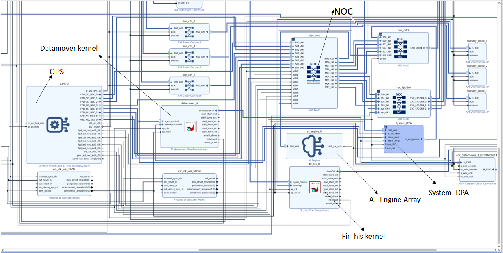

<table class="sphinxhide" style="width:100%;">
  <tr>
    <td align="center">
      <picture>
        <source media="(prefers-color-scheme: dark)" srcset="https://raw.githubusercontent.com/Xilinx/Image-Collateral/main/logo-white-text.png">
        
      </picture>
      <h1>AMD Vitis™ AI Engine Tutorials</h1>
      <a href="https://www.amd.com/en/products/software/adaptive-socs-and-fpgas/vitis.html">Refer to Vitis Development Environment on amd.com</a>
        </br>
      <a href="https://www.amd.com/en/products/software/vitis-ai.html">Refer to Vitis AI Development Environment on amd.com</a>
    </td>
  </tr>
</table>

# High-level Synthesis Implementation

## Table of Contents
[Building the Design](#building-the-design)

[Hardware Design Details](#hardware-design-details)

[Software Design Details](#software-design-details)

[References](#references)

## Building the Design

<details>
<summary>Design Build</summary>

### Design Build
In this section, you build and run the finite impulse response (FIR) filter design using the high-level synthesis (HLS) and digital signal processing (DSP) implementation. Unlike the  AI Engine implementation, where you compile the AI Engine design and integrate it into a larger system with programmable logic (PL) kernels and a processing system (PS) host application, you now implement the FIR filter in PL using DSP engines.  

At the end of this section, the design flow generates a new directory named `build/`. Inside are subdirectories named `fir_hls_$(N_FIR_FILTERS)firs_$(N_FIR_TAPS)taps` (for example, `fir_hls_1firs_15taps`) based on the `N_FIR_FILTERS` and `N_FIR_TAPS` values you set during the build. Each subdirectory contains the `hw_emu/` and `hw/` sub-folders. The `hw_emu/` sub-folder contains the build for hardware emulation. The `hw/` sub-folder contains the build for the hardware execution on a VCK190 board.   

</details>

<details>
<summary>Make Steps</summary>

### Make Steps
To run the following `make` steps (such as `make kernels` and `make graph`), you must be in the `HLS/` folder.
```bash
cd HLS
```

The following options apply to the make steps. See each step's instructions how to apply them.

* TARGET: Set to *hw* for hardware flow or *hw_emu* for hardware emulation flow. The default is *hw_emu*.

* N_FIR_FILTERS: Specifies the number of FIR filters in the chain. The default is *1*.

* N_FIR_TAPS: Specifies the number of FIR filter taps. The default is *15*.

* EN_TRACE: Flag to enable trace data capture. Use *0* for disabled and *1* for enabled. The default is *0*.

The Makefile uses these directory references:

```
#Relative FIR filter directory
RELATIVE_PROJECT_DIR := ./

#Absolute FIR filter directory = <user path>/Tutorials/AI_Engine/filter_AIEvsDSP
PROJECT_REPO := $(shell readlink -f $(RELATIVE_PROJECT_DIR))

DESIGN_REPO  := $(PROJECT_REPO)/design
PL_SRC_REPO  := $(DESIGN_REPO)/pl_src
HOST_APP_SRC := $(DESIGN_REPO)/host_app_src
VIVADO_METRICS_SCRIPTS_REPO := $(DESIGN_REPO)/vivado_metrics_scripts

DIRECTIVES_REPO        := $(DESIGN_REPO)/directives
SYSTEM_CONFIGS_REPO    := $(DESIGN_REPO)/system_configs
PROFILING_CONFIGS_REPO := $(DESIGN_REPO)/profiling_configs
EXEC_SCRIPTS_REPO      := $(DESIGN_REPO)/exec_scripts
PYTHON_SCRIPTS_REPO    := $(DESIGN_REPO)/python_scripts

BASE_BLD_DIR := $(PROJECT_REPO)/build
FIR_TAPS_BLD_DIR := $(BASE_BLD_DIR)/fir_$(N_FIR_TAPS)_taps
FIR_FILTERS_DIR  := $(FIR_TAPS_BLD_DIR)/x$(N_FIR_FILTERS)_firs
BUILD_TARGET_DIR := $(FIR_FILTERS_DIR)/$(TARGET)

REPORTS_REPO := $(PROJECT_REPO)/reports_dir
BLD_REPORTS_DIR := $(REPORTS_REPO)/fir_$(N_FIR_TAPS)_taps/x$(N_FIR_FILTERS)_firs

EMBEDDED_PACKAGE_OUT := $(BUILD_TARGET_DIR)/package
EMBEDDED_EXEC_SCRIPT := run_script.sh
```

</details>

<details>
<summary>Build the Entire Design with a Single Command</summary>

### Build the Entire Design with a Single Command
If you already understand AI Engine and Vitis accelerated kernel compilation flows, you can build the entire design with one command:

```bash
make run (default hardware emulation, 1 filter 15 taps, no trace enabled)
```
or
```bash
make run TARGET=hw N_FIR_FILTERS=1 N_FIR_TAPS=15 EN_TRACE=1   (hardware, 1 FIR filters, each with 15 taps, enable tracing)
```

This command executes:
- `make kernels`
- `make xsa`
- `make application`
- `make package`
- `make run_emu` (for hardware emulation) or runs directly on hardware 

Set `TARGET` to `hw` for hardware runs on the VCK190 board or keep the default `hw_emu` for hardware emulation. The settings also apply to the following individual make steps.

**Note**

1. Generated files for a specific build are placed under the directory: `build/fir_$(N_FIR_TAPS)_taps/x$(N_FIR_FILTERS)_firs`
2. See the specification in each make step for options used and location of input and output files.

</details>

Use the following individual `make` steps to build the design with their applicable options.

<details>
<summary>make kernels: Compile PL Kernels</summary>

### make kernels: Compile PL Kernels
In this step, you use the Vitis compiler to compile any kernels (RTL or HLS C) in the PL region of the target platform `xilinx_vck190_base_202520_1` into their respective XO files.

Run the following commands to compile kernels (default `TARGET=hw_emu`, `N_FIR_FILTERS=1`, `N_FIR_TAPS=15`, `EN_TRACE=0`):

```
make kernels
```

The expanded command sequence is:
```
mkdir -p build/fir_$(N_FIR_TAPS)_taps/x$(N_FIR_FILTERS)_firs/hw_emu

cd build/fir_$(N_FIR_TAPS)_taps/x$(N_FIR_FILTERS)_firs/hw_emu

v++ --target hw_emu					\
   	--hls.pre_tcl design/directives/hls_pre.tcl		\
	--hls.clock 500000000:fir_hls 			\
	-D N_FIR_FILTERS=$(N_FIR_FILTERS)		\
	-D N_FIR_TAPS=$(N_FIR_TAPS)			\
	--platform xilinx_vck190_base_202520_1		\
	--include design/pl_src 		\
	--save-temps 					\
	--temp_dir build/fir_$(N_FIR_TAPS)_taps/x$(N_FIR_FILTERS)_firs/hw_emu/_x 					\
	--verbose 					\
	-g -c 						\
	-k fir_hls 					\
	design/pl_src/fir_hls.cpp 		\
	-o fir_hls.hw_emu.xo   

v++ --target hw_emu					\
	--hls.clock 300000000:datamover 			\
	-D N_FIR_FILTERS=$(N_FIR_FILTERS)		\
	-D N_FIR_TAPS=$(N_FIR_TAPS)			\
	--platform xilinx_vck190_base_202520_1		\
	--include design/pl_src 			\
	--save-temps 					\
	--temp_dir build/fir_$(N_FIR_TAPS)_taps/x$(N_FIR_FILTERS)_firs/hw_emu/_x 					\
	--verbose 					\
	-g -c 						\
	-k datamover 					\
	design/pl_src/datamover.cpp 		\
	-o datamover.hw_emu.xo   

 ```
Summary of the switches used:
|Switch|Description|
|  ---  |  ---  |
|--target \| -t [hw\|hw_emu]|Specifies the build target.|
|--hls.clock | Sets kernel compile frequency in Hz for Vitis HLS. |
|--platform \| -f|Specifies acceleration platform from `$PLATFORM_REPO_PATHS` or XPFM path. |
|--save-temps \| -s|Directs the Vitis compiler command to save intermediate files and directories created during compilation and linking. Use `--temp_dir` to specify their location to write the intermediate files to.|
|--temp_dir <string>|Manages the location where the tool writes temporary files created during the build process. The Vitis compiler removes them unless you specify `--save-temps`|
|--verbose|Displays verbose and debug information.|
| -g | Generates code with debugging features for software emulation. |
|--compile \| -c|Generates XO files from kernel sources.|
|--kernel \<arg\>\|-k \<arg\>|Compiles only the specified kernel from input file.|
|--output \| -o|Specifies the name of the output file generated by the V++ command. The compilation process output name must end with the XO file suffix.|

[Detailed Description of All Vitis Compiler Switches](https://docs.amd.com/r/en-US/ug1399-vitis-hls/vitis-v-and-vitis-run-Commands)

|Input|Description|
|  ---  |  ---  |
|fir_hls.cpp|The FIR filter chain PL kernel source code.|
|datamover.cpp|The data-mover PL kernel source code.|

|Output|Description|
|  ---  |  ---  |
|fir_hls.hw/hw_emu.xo|The FIR filter chain PL kernel object file.|
|datamover.hw/hw_emu.xo|The stream-to-memory-mapped data-mover kernel object file.|

</details>

<details>
<summary>make xsa: Use Vitis Tools to Link HLS Kernels with the Platform</summary>

### make xsa: Use Vitis Tools to Link HLS Kernels with the Platform
After compiling the PL HLS kernels, you can use the Vitis compiler to link them with the platform to generate an XSA file.

You integrate HLS kernels into an extensible platform provided by the hardware designer or base platforms from AMD. The Vitis tools build the hardware design and link PL kernels automatically.

To test this tutorial, use the base Versal VCK190 platform to build the design.

Use this command to run this step (the defaults are `TARGET=hw_emu`, `N_FIR_FILTERS=1`, `N_FIR_TAPS=15`, `EN_TRACE=0`):
```
make xsa
```

The expanded command is as follows:
```
cd build/fir_$(N_FIR_TAPS)_taps/x$(N_FIR_FILTERS)_firs/hw_emu

v++ -l 				\
	--platform xilinx_vck190_base_202520_1 		\
	--include design/pl_src 		\
	--save-temps 					\
	--temp_dir build/fir_$(N_FIR_TAPS)_taps/x$(N_FIR_FILTERS)_firs/hw_emu/_x \
	--verbose 					\
	-g 						\
	--clock.defaultTolerance 0.001 			\
	--clock.freqHz 300000000:datamover_0 		\
	--clock.freqHz 500000000:fir_hls_0 		\
	--config design/system_configs/system.cfg 	\
	--vivado.prop run.synth_1.{STEPS.SYNTH_DESIGN.ARGS.CONTROL_SET_OPT_THRESHOLD}={16} \
	--advanced.param compiler.userPostSysLinkOverlayTcl=$(DIRECTIVES_REPO)/post_sys_link.tcl \
	-o vck190_hls_fir.hw_emu.xsa  		\
	datamover.hw_emu.xo					\
  	fir_hls.hw_emu.xo

```

If `EN_TRACE` is enabled, include the following `v++` flags:
```
	--profile.trace_memory DDR			\
	--profile.data datamover:datamover_0:all \
	--profile.data fir_hls:dir_hls_0:all

```
By enabling `EN_TRACE=1`, timing violation occurs for ten filters with a tolerance of `WNS=-0.050` set:
```
--xp param:compiler.worstNegativeSlack=-0.050
```

This captures the trace data for the ports specified.

Summary of the switches used:

|Switch|Description|
|  ---  |  ---  |
|--platform \| -f|Specifies the name of a supported acceleration platform from `$PLATFORM_REPO_PATHS` or an .xpfm file path.|
|--save-temps \| -s|Directs the `v++` command to save intermediate files and directories created during the compilation and link process. Use the `--temp_dir` option to specify a location to write the intermediate files to.|
|--temp_dir <string>|Manages the location where the tool writes temporary files created during the build process. The compiler removes them unless you use the `--save-temps` option.|
|--verbose|Displays verbose/debug information.|
| -g | Generates code for with debugging features for software emulation. Use this option to add features to help debugging the kernel during compilation. |
|--clock.freqHz \<freq_in_Hz\>:\<cu\>\[.\<clk_pin\>\]|Specifies a clock frequency in Hz and assigns it to a list of associated compute units (CUs) and optionally specific clock pins on the CU.|
|--config <config_file>|Specifies a configuration file containing `v++` switches.|
|--target \| -t [hw\|hw_emu]|Specifies the build target.|
|--output \| -o|Specifies the name of the output file generated by the `v++` command. The linking process output file name must end with the .xsa suffix|
|--profile.data [<kernel_name>\|all]:[<cu_name>\|all]:[<interface_name>\|all]\(:[counters\|all]\)|Enables monitoring of data ports through the monitor IPs. Specify this option during linking. [Detailed Profiling Options](https://docs.amd.com/r/en-US/ug1701-vitis-accelerated-embedded/Enabling-Profiling-in-Your-Application) |
|--profile.trace_memory \<FIFO\>:\<size\>\|\<MEMORY\>[\<n\>]|When building the hardware target \(-t=hw\), use this option to specify the type and amount of memory to use for capturing trace data. [Detailed Profiling Options](https://docs.amd.com/r/en-US/ug1701-vitis-accelerated-embedded/Enabling-Profiling-in-Your-Application) |

[Detailed Description of All Vitis Compiler Switches](https://docs.amd.com/r/en-US/ug1399-vitis-hls/vitis-v-and-vitis-run-Commands)
[Linking the Kernels in Vitis](https://docs.amd.com/r/en-US/ug1701-vitis-accelerated-embedded/Linking-the-System)

|Inputs Sources|Description|
|  ---  |  ---  |
|datamover.hw/hw_emu.xo|The data-mover kernel object file.|
|fir_hls.hw/hw_emu.xo|The FIR filter chain PL kernel object file.|

|Output Objects|Description|
|  ---  |  ---  |
|vck190_hls_fir.hw_emu.xsa|Compiled Platform Binary Container|

</details>

 <details>
<summary>make application: Compile the Host Application</summary>

### make application: Compile the Host Application
You can compile the host application by following the typical cross-compilation flow for the Cortex-A72. To build the application run the following command (default `TARGET=hw_emu`, `N_FIR_FILTERS=1`, `N_FIR_TAPS=15`, `EN_TRACE=0`):
```
make application
```

The expanded command is as follows:
```
aarch64-linux-gnu-g++ 	-O 					\
			-c -std=c++17 				\
			-D__linux__ 				\
			-DXAIE_DEBUG				\
         		-DITER_CNT=8 				\
         		-DN_FIR_FILTERS=1			\
         		-DN_FIR_TAPS=15 			\
			-I$(SDKTARGETSYSROOT)/usr/include/xrt 		\
			-I$(SDKTARGETSYSROOT)/usr/include		\
			-I$(SDKTARGETSYSROOT)/usr/lib			\
			-Idesign/host_app_src		\
			-Idesign/pl_src		\
			 design/app_src/fir_aie_app.cpp \
			-o fir_aie_app.o 			\
			-L$(SDKTARGETSYSROOT)/usr/lib 			\
			-lxrt_coreutil

aarch64-linux-gnu-g++ 	fir_hls_app.o			\
			-L$(SDKTARGETSYSROOT)/usr/lib 	\
			-lxrt_coreutil 			\
			-o build/fir_$(N_FIR_TAPS)_taps/x$(N_FIR_FILTERS)_firs/hw_emu/fir_hls_xrt.elf
```
Summary of the switches used:
|Switch|Description|
|  ---  |  ---  |
|-O \| Optimize| Optimizing compilation takes somewhat more time, and a lot more memory for a large function. With -O, the compiler tries to reduce code size and execution time, without performing any optimizations that can take a great deal of compilation time.|
|-c |Compile or assemble the source files, but do not link.|
|-std=<\standard\>|Set the language standard.|
|-D__linux__| |
|-DXAIE_DEBUG|Enable debug interface capabilities to dump core status, event status, or stack trace information.|
|-D\<Pre-processor Macro String\>=\<value\>|Pass pre-processor macro definitions to the cross-compiler.|
|-I \<dir\>|Add the directory `dir` to the header file search directories.|
|-o \<file\>|Place output in file `<file>`, whether executable, object, assembly language, or preprocessed C code.|
|-l\<library\>|Search the library named `library` when linking. The 2D-FFT tutorial requires `adf_api_xrt` and `xrt_coreutil` libraries.|
|-L \<dir\>|Add directory `<dir>` to library search directories for linking.|

[XRT Documentation](https://xilinx.github.io/XRT/master/html/index.html)
[Details of Host Application Programming](https://docs.amd.com/r/en-US/ug1076-ai-engine-environment/Host-Programming-for-Bare-Metal)

|Inputs Sources|Description|
|  ---  |  ---  |
|fir_hls_app.cpp|Host processor application source code file that runs on an A72 processor.|

|Intermediate Objects|Description|
|  ---  |  ---  |
|fir_hls_app.o|Compiled host processor application object.|


|Output Objects|Description|
|  ---  |  ---  |
|fir_hls_xrt.elf|The executable that runs on an A72 processor.|

</details>

<details>
<summary>make package: Package the Design</summary>

### make package: Package the Design
With the HLS kernel outputs ready and the new platform built, you generate the programmable device image (PDI) and package for an SD card. The PDI contains executables, bitstreams, and device configuration data. The packaged SD card directory  includes all files to boot Linux, the generated applications, and the `.xclbin` binary.

Run the command for this step as follows (default `TARGET=hw_emu`, `N_FIR_FILTERS=1`, `N_FIR_TAPS=15`, `EN_TRACE=0`):
```
make package
```

or
```
cd ../build/fir_hls_$(N_FIR_FILTERS)firs_$(N_FIR_TAPS)taps/hw_emu

v++	-p  							\
	-t hw_emu						\
	--save-temps						\
	--temp_dir build/fir_$(N_FIR_TAPS)_taps/x$(N_FIR_FILTERS)_firs/hw_emu/_x			\
	-f xilinx_vck190_base_202520_1									\
	--package.rootfs $(COMMON_IMAGE_VERSAL)/rootfs.ext4 						\
	--package.kernel_image $(COMMON_IMAGE_VERSAL)/Image 						\
	--package.boot_mode=sd										\
	--package.out_dir build/fir_$(N_FIR_TAPS)_taps/x$(N_FIR_FILTERS)_firs/hw_emu/package	  	\
	--package.image_format=ext4									\
	--package.sd_file build/fir_$(N_FIR_TAPS)_taps/x$(N_FIR_FILTERS)_firs/hw_emu/fir_hls_xrt.elf    \
			  build/fir_$(N_FIR_TAPS)_taps/x$(N_FIR_FILTERS)_firs/hw_emu/vck190_hls_fir.hw_emu.xsa 	\
			  --package.sd_file design//exec_scripts/run_script.sh
```
If EN_TRACE is active, also set the following `v++` flags:
```
	--package.sd_file design/profiling_configs/xrt.ini
```
This includes the XRT .ini file with tracing parameters.

|Switch|Description|
|  ---  |  ---  |
|--package \| -p|Packages the final product after compiling and linking in the Vitis build process.|
|--target \| -t [hw\|hw_emu]|Specifies the build target.|
|--save-temps \| -s|Directs the V++ command to save intermediate files and directories created during the compilation and link process. Use the `--temp_dir` option to specify a location to write the intermediate files to.|
|--temp_dir <string>|Sete the location for temporary files created during the build process. The Vitis compiler deletes them unless you also use `--save-temps`.|
|--platform \| -f|Specifies the name of a supported acceleration platform from the `$PLATFORM_REPO_PATHS` environment variable or the full path to the platform .xpfm file.|
|--package.sd_dir \<arg\>|Where <arg>Specifies a folder to package into the `sd_card` directory or image. The contents of the directory copy to a sub-folder of the `sd_card` folder.|
|--package.rootfs \<arg\>|Where \<arg\>Specifies the absolute or relative path to a processed Linux root file system file. The platform `RootFS` file is available for download from the [Adaptive Computing Support downloads page](https://www.xilinx.com/support/download/index.html/content/xilinx/en/downloadNav/embedded-platforms.html). Refer to Vitis Software Platform Installation for more information.|
|--package.kernel_image \<arg\>|Where \<arg\>Specifies the absolute or relative path to a Linux kernel image file. This overrides the existing image available in the platform. The platform image file is available for download from the [Adaptive Computing Support downloads page](https://www.xilinx.com/support/download/index.html/content/xilinx/en/downloadNav/embedded-platforms.html). Refer to the Vitis Software Platform Installation for more information.|
|--package.boot_mode \<arg\>|Where \<arg\>Specifies <ospi\|qspi\|sd> Boot mode used for running the application in emulation or on hardware.|
|--package.image_format|Where \<arg\>Specifies \<ext4\|fat32\> output image file format. `ext4`: Linux file system and `fat32`: Windows file system|
|--package.sd_file|Where \<arg\>Specifies an executable and linkable format (ELF) or other data file to package into the `sd_card` directory or image. Repeat this option to include multiple files.|


[Detailed Description of All Vitis Compiler Switches](https://docs.amd.com/r/en-US/ug1399-vitis-hls/vitis-v-and-vitis-run-Commands)
[Details of Packaging the System](https://docs.amd.com/r/en-US/ug1701-vitis-accelerated-embedded/Packaging-for-Vitis-Flow)

|Inputs Sources|Description|
|  ---  |  ---  |
|$(COMMON_IMAGE_VERSAL)/rootfs.ext4|The Root Filesystem file for Petalinux.|
|$(PLATFORM_REPO_PATHS)/Image|The pre-built Petalinux Image the processor boots from.|
|$(BUILD_TARGET_DIR)/fir_hls_xrt.elf|The PS Host Application executables created in the `make application` step.|
|$(BUILD_TARGET_DIR)/vck190_hls_fir.hw_emu.xsa|The XSA file created in the `make xsa` step.|

The output of the V++ Package step is the package directory that contains the contents to run hardware emulation.

|Output Objects|Description|
|  ---  |  ---  |
|$(BUILD_TARGET_DIR)/package|The hardware emulation package that contains the boot file, hardware emulation launch script, the PLM and PMC boot files, the PMC and QEMU command argument specification files, and the AMD Vivado™ tools simulation folder.|

</details>

<details>
<summary>make run_emu: Run Hardware Emulation</summary>

### make run_emu: Run Hardware Emulation
After packaging, you can run hardware emulation or hardware execution. 
To run hardware emulation use the following command (default `TARGET=hw_emu`, `N_FIR_FILTERS=1`, `N_FIR_TAPS=15`, `EN_TRACE=0`):
```
make run_emu
```
or
```
cd build/fir_$(N_FIR_TAPS)_taps/x$(N_FIR_FILTERS)_firs/hw_emu/package
./launch_hw_emu.sh
```
The QEMU simulator loads. Wait for the auto boot countdown to reach zero. After a few minutes, the Linux root prompt appears:
```bash
root@versal-rootfs-common-2025_2:~#
```

You might see the following error on the screen:
```
root@versal-rootfs-common-2025_2:~## xinit: giving up
xinit: unable to connect to X server: Connection refused
xinit: server error
Enabling notebook extension jupyter-js-widgets/extension...
      - Validating: OK
[C 13:46:09.233 NotebookApp] Bad config encountered during initialization:
[C 13:46:09.239 NotebookApp] No such notebook dir: ''/usr/share/example-notebooks''
```
Ignore this error and press <Enter> to return to the root prompt.

After the root prompt appears, run the following commands to run the design:  
```
mount /dev/mmcblk0p1 /mnt
cd /mnt
./fir_hls_xrt.elf a.xclbin
```
The `fir_hls_xrt.elf` executes. After a few minutes, the console shows TEST PASSED. When it appears, enter the following keyboard command to exit the quick emulator (QEMU) instance: 

```
#To exit QEMU Simulation
Press Ctrl-A, let go of the keyboard, and then press x
```

To run with waveform do the following:
```
cd build/fir_$(N_FIR_TAPS)_taps/x$(N_FIR_FILTERS)_firs/hw_emu/package
./launch_hw_emu.sh -g
```
The XSIM Waveform Viewer starts. Drag the signals into the viewer and click **Play** to start emulation. Return to the terminal and wait for the Linux prompt.

In the XSIM Waveform Viewer, watch the signals you added to the waveform adjust as the design runs. When done, press the **Pause** button and close the window to end emulation.

</details>

<details>
<summary>TARGET=hw: Run on Hardware</summary>

### Run on Hardware

To run the design in hardware, re-run the following make steps with `TARGET=hw` and other applicable options (see the previous make steps)
```
make kernels     TARGET=hw
make xsa         TARGET=hw
make application TARGET=hw
make package     TARGET=hw
```
You can do the same in a single step:
```
make build TARGET=hw
```

Now follow **Steps 1-9** to run the `fir_hls_xrt.elf` executable on your VCK190 board.

**Step 1.** Turn off your board.

**Step 2.** Use an SD card writer (such as balenaEtcher) to flash the `sd_card.img` file onto an SD card.

**Step 3.** Plug the flashed SD card into the top slot of the VCK190 board.

**Step 4.** Set the switch SW1 Mode\[3:0\]=1110 = OFF OFF OFF ON.

**Step 5.** Connect your computer to the VCK190 board using the included USB cable.

**Step 6.** Open a TeraTerm terminal and select the correct communications (COM) port. Set the port settings as follows:
```
Port: <COMMXX>
Speed: 115200
Data: 8 bit
Parity: none
Stop Bits: 1 bit
Flow control: none
Transmit delay: 0 msec/char 0 msec/line
```

**Step 7.** Power ON the board.

**Step 8.** Wait for the Linux command prompt `root@versal-rootfs-common-2025_2`. Press **Enter** a few times to get past any `xinit` errors.

**Step 9.** Run the following commands into the TeraTerm terminal:
```
mount /dev/mmcblk0p1 /mnt
cd /mnt
./fir_hls_xrt.elf a.xclbin
```

After execution completes and the test case passes the data integrity check, the terminal displays *TEST PASSED*.

</details>

## Hardware Design Details
<details>
<summary>FIR Filter HLS Implementation Architecture</summary>

### FIR Filter HLS Implementation Architecture

The following figure shows a high-level block diagram of the design. The test harness consists of the compute kernel and the data mover kernel. This setup appears in both implementations: HLS with DSP engines in this section of the tutorial and AI Engine in the other. In this setup, the interface between the data mover kernel and FIR filter kernel is AXI4-Stream. Both kernels use a 128-bit data width and run at 250 MHz, providing a transfer rate of up to 1.2 GB/S.


</details>

<details>
<summary>Design Details</summary>

### Design Details
This tutorial design starts with a base platform containing the control interface and processing system (CIPS), NoC, AI Engine, and the interfaces among them. The v++ linker step builds on top of the base platform by adding the PL kernels. In a system level design, you add PL kernels based on the application, so the PL kernels in each design vary. Add components with the `v++ -l` step (`make XSA` in the previous tool flow section), including:
* FIR filter chain kernel (`fir_hls.[hw|hw_emu].xo`)
* Data mover kernel (`datamover.[hw|hw_emu].xo`)
* Connection interfaces defined in the system configuration file (`system.cfg`)

To view a schematic of the extended platform, open the design in the Vivado tool as shown in the following figure:

`build/fir_hls_$(N_FIR_FILTERS)firs_$(N_FIR_TAPS)taps/[hw|hw_emu]/_x/link/vivado/vpl/prj/prj.xpr`



The design implements the FIR filter chain in a HLS PL kernel, which connects the specified number of filters in a seqence. For simplicity when comparing designs, all filters in the chain are identical, though such a chain is unlikely in a practical application.

Add the debug and profiling IP (DPA) to the PL region of the device to capture AI Engine run-time trace data when you enable the `EN_TRACE` option. The datamover kernel and the AI Engine array interface both operate at 300 MHz.

</details>

<details>
<summary>HLS PL Kernels</summary>

### HLS PL Kernels
In the HLS implementation of the FIR Filter design, you do not use the AI Engine. Therefore, no AI Engine-related kernels or graphs appear. You implement the compute and datamover functions as HLS kernels in the PL region.

The PL kernel `fir_hls` implements the FIR filter chain. It contains a single AXI-stream input port and a single AXI-stream output port. Because the FIR function requires no initialization, you do not add extra control or status ports. 

The PL-based data mover consists of DATAMOVER kernels. These kernels move a data pattern into the AI Engine array through a streaming interface. The array's final FIR output returns to the datamover kernel through a streaming interface and is checked for errors. The AI Engine array interface with the datamover kernel uses an AXI4-Stream interface.
Some additional details regarding the data mover kernels include:

**DATAMOVER**
* The data width is 128-bit.
* The frequency is 300 MHz.

</details>

## Software Design Details
The software design in the FIR Filter HLS implementation consists of the following sections:

<details>
<summary>PL Kernels</summary>

### PL Kernels
For the HLS implementation of this design, the data mover kernel and the FIR filter chain are all implemented in HLS.

#### fir_hls (fir_hls.cpp)
The `fir_filter` kernel contains one AXI-stream input and one AXI-stream output. The kernel makes use of the FIR compiler IP, the same module you can instantiate as an IP in Vivado tools. In HLS, you instantiate it as an object in the HLS code, then cascade objects into a chain in the design.

Include the following header to access the FIR compiler interface from the HLS IP libraries in the Vitis HLS libraries reference:
```
#include <fir_hls.h>
```   

This header files provides a parameterization struct (`hls::ip_fir::params_t`) that sets the static parameters of the filter:
```
struct fir_params : hls::ip_fir::params_t {
    static const unsigned num_coeffs    = N_FIR_TAPS;
    static const double   coeff_vec[N_FIR_TAPS];
    static const unsigned coeff_width   = 16;
    static const unsigned input_width   = 16;
    static const unsigned output_width  = 16;
    static const unsigned output_rounding_mode = hls::ip_fir::truncate_lsbs;
   #if N_FIR_TAPS == 15
     static const unsigned input_length  = WINDOW_LENGTH_HALF;
     static const unsigned output_length = WINDOW_LENGTH_HALF;
     static const unsigned sample_period = SAMP_PERIOD;
   #else
     static const unsigned input_length  = WINDOW_LENGTH;
     static const unsigned output_length = WINDOW_LENGTH;
     static const unsigned sample_period = SAMP_PERIOD;
   #endif
    static const unsigned coeff_structure = hls::ip_fir::symmetric;
};
```
Here, you set key non-default filter values, including the number of taps, tap vectors (`coeff_vec`), data widths, truncation mode, and filter structure.

The FIR filter wrapper uses an input/output length called `WINDOW_LENGTH`. This differs from `FIR_WINDOW_SIZE` in the AI Engine version of the design. In AI Engine graph design, you process data in fixed-size batches (windows), and `FIR_WINDOW_SIZE` specifies the size of these physical buffers. Here, the buffer size directly impacts latency.

In the HLS with DSP implementation, arrays (windows) act as a way to pass data to functions, but these arrays translate into AXI-streams. For this implementation, `WINDOW_SIZE` is 64k.

To match the performance of 15 taps of AIE with HLS, use a multi-instance method only for 15 taps. 
The following section instantiates arrays of filter objects, one for real values and one for imaginary values:
```
#if N_FIR_TAPS == 15
static hls::FIR<fir_params> fir_real[N_FIR_FILTERS*2];
static hls::FIR<fir_params> fir_imag[N_FIR_FILTERS*2];
#else
static hls::FIR<fir_params> fir_real[N_FIR_FILTERS];
static hls::FIR<fir_params> fir_imag[N_FIR_FILTERS];
#endif

```

In the `fir_hls.cpp` file, the `complex_split` function takes the incoming array (stream) of 128-bit data, and splits each word into two 16-bit word streams:
```
void complex_split(
        hls::stream<ap_axiu<128, 0, 0, 0>> &strmInp,
        DataWindow_t DataRealInp, DataWindow_t DataImagInp
        )
{
CMPLX_SPLIT_LOOP:for(int ix = 0; ix < WINDOW_LENGTH; ix += 4) {
#pragma HLS PIPELINE II=1

                     ap_axiu<128, 0, 0, 0> fir_inp = strmInp.read();

                     // To enable Dataflow...
                     Data_t tmp_imag_inp[4];
                     Data_t tmp_real_inp[4];
                     //#pragma HLS ARRAY_RESHAPE variable=tmp_imag_inp cyclic factor=4 dim=1
                     //#pragma HLS ARRAY_RESHAPE variable=tmp_real_inp cyclic factor=4 dim=1

                     tmp_imag_inp[0].range(15, 0) = fir_inp.data.range(15, 0);
                     tmp_real_inp[0].range(15, 0) = fir_inp.data.range(31, 16);

                     tmp_imag_inp[1].range(15, 0) = fir_inp.data.range(47, 32);
                     tmp_real_inp[1].range(15, 0) = fir_inp.data.range(63, 48);

                     tmp_imag_inp[2].range(15, 0) = fir_inp.data.range(79, 64);
                     tmp_real_inp[2].range(15, 0) = fir_inp.data.range(95, 80);

                     tmp_imag_inp[3].range(15, 0) = fir_inp.data.range(111, 96);
                     tmp_real_inp[3].range(15, 0) = fir_inp.data.range(127, 112);

                     DataImagInp[ix] = tmp_imag_inp[0];
                     DataRealInp[ix] = tmp_real_inp[0];

                     DataImagInp[ix + 1] = tmp_imag_inp[1];
                     DataRealInp[ix + 1] = tmp_real_inp[1];

                     DataImagInp[ix + 2] = tmp_imag_inp[2];
                     DataRealInp[ix + 2] = tmp_real_inp[2];

                     DataImagInp[ix + 3] = tmp_imag_inp[3];
                     DataRealInp[ix + 3] = tmp_real_inp[3];
                 }
}


```

In the `fir_hls.cpp` file, the `complex_merge` function reverses `complex_split` and combines words from two incoming 16-bit streams into one 32-bit stream:
```
void complex_merge(
        DataWindow_t DataRealOut, DataWindow_t DataImagOut,
        hls::stream<ap_axiu<128, 0, 0, 0>> &strmOut
        )
{
CMPLX_MERGE_LOOP:for(int ix = 0; ix < WINDOW_LENGTH; ix += 4) {
#pragma HLS PIPELINE II=1

                     ap_axiu<128, 0, 0, 0> fir_out;

                     fir_out.data.range(15,  0) = DataImagOut[ix].range(15, 0);
                     fir_out.data.range(31, 16) = DataRealOut[ix].range(15, 0);

                     fir_out.data.range(47, 32) = DataImagOut[ix + 1].range(15, 0);
                     fir_out.data.range(63, 48) = DataRealOut[ix + 1].range(15, 0);

                     fir_out.data.range(79, 64) = DataImagOut[ix + 2].range(15, 0);
                     fir_out.data.range(95, 80) = DataRealOut[ix + 2].range(15, 0);

                     fir_out.data.range(111,  96) = DataImagOut[ix + 3].range(15, 0);
                     fir_out.data.range(127, 112) = DataRealOut[ix + 3].range(15, 0);

                     strmOut.write(fir_out);
                 }
}

```

The function `fir_wrap` constructs the filter chain using a series of `#if` or `#elif` pre-processor directives to enable code sections. This approach replaces loop-based generation because sythesis does not support arrays of arrays. 
```
void fir_wrap(
        hls::stream<ap_axiu<128, 0, 0, 0>> &strmInp,
        hls::stream<ap_axiu<128, 0, 0, 0>> &strmOut
        )
{
#pragma HLS dataflow

    DataWindow_t DataRealInp, DataImagInp;
    DataWindow_t DataRealOut, DataImagOut;
#pragma HLS stream variable=DataRealInp depth=16
#pragma HLS stream variable=DataRealOut depth=16
#pragma HLS stream variable=DataImagInp depth=16
#pragma HLS stream variable=DataImagOut depth=16
#pragma HLS ARRAY_RESHAPE variable=DataRealInp cyclic factor=4 dim=1
#pragma HLS ARRAY_RESHAPE variable=DataImagInp cyclic factor=4 dim=1
#pragma HLS ARRAY_RESHAPE variable=DataRealOut cyclic factor=4 dim=1
#pragma HLS ARRAY_RESHAPE variable=DataImagOut cyclic factor=4 dim=1

#if (N_FIR_TAPS == 15)   
    DataWindow_t DataRealInp_buff1, DataImagInp_buff1;
    DataWindow_t DataRealInp_buff2, DataImagInp_buff2;
    DataWindow_t DataRealOut_buff1, DataImagOut_buff1;
    DataWindow_t DataRealOut_buff2, DataImagOut_buff2;
#pragma HLS stream variable=DataRealInp_buff1 depth=16
#pragma HLS stream variable=DataImagInp_buff1 depth=16
#pragma HLS stream variable=DataRealInp_buff2 depth=16
#pragma HLS stream variable=DataImagInp_buff2 depth=16
#pragma HLS stream variable=DataRealOut_buff1 depth=16
#pragma HLS stream variable=DataImagOut_buff1 depth=16
#pragma HLS stream variable=DataRealOut_buff2 depth=16
#pragma HLS stream variable=DataImagOut_buff2 depth=16
#else
    DataWindow_t DataRealOut_buff, DataImagOut_buff;
    DataWindow_t DataRealInp_buff, DataImagInp_buff;
#pragma HLS stream variable=DataRealInp_buff depth=16
#pragma HLS stream variable=DataImagInp_buff depth=16
#pragma HLS stream variable=DataRealOut_buff depth=16
#pragma HLS stream variable=DataImagOut_buff depth=16
#endif

    complex_split(strmInp, DataRealInp, DataImagInp);
#if (N_FIR_TAPS == 15)   
    buffInp_15tap(DataRealInp, DataImagInp, DataRealInp_buff1, DataImagInp_buff1, DataRealInp_buff2, DataImagInp_buff2);
#else
    buffInp(DataRealInp, DataImagInp, DataRealInp_buff, DataImagInp_buff);
#endif

#if (N_FIR_FILTERS == 1)
#if (N_FIR_TAPS == 15)
    fir_real[0].run(DataRealInp_buff1, DataRealOut_buff1);
    fir_imag[0].run(DataImagInp_buff1, DataImagOut_buff1);
    fir_real[1].run(DataRealInp_buff2, DataRealOut_buff2);
    fir_imag[1].run(DataImagInp_buff2, DataImagOut_buff2);
#else
    fir_real[0].run(DataRealInp_buff, DataRealOut_buff);
    fir_imag[0].run(DataImagInp_buff, DataImagOut_buff);
#endif

#elif (N_FIR_FILTERS > 1)
#if (N_FIR_TAPS == 15)
    DataWindow_t DataReal_a0, DataImag_a0;
    DataWindow_t DataReal_a1, DataImag_a1;
#pragma HLS stream variable=DataReal_a0 depth=16
#pragma HLS stream variable=DataImag_a0 depth=16
#pragma HLS stream variable=DataReal_a1 depth=16
#pragma HLS stream variable=DataImag_a1 depth=16

    fir_real[0].run(DataRealInp_buff1, DataReal_a0);
    fir_imag[0].run(DataImagInp_buff1, DataImag_a0);
    fir_real[1].run(DataRealInp_buff2, DataReal_a1);
    fir_imag[1].run(DataImagInp_buff2, DataImag_a1);
#else
    DataWindow_t DataReal_0, DataImag_0;
#pragma HLS stream variable=DataReal_0 depth=16
#pragma HLS stream variable=DataImag_0 depth=16

    fir_real[0].run(DataRealInp_buff, DataReal_0);
    fir_imag[0].run(DataImagInp_buff, DataImag_0);
#endif

#endif

#if (N_FIR_FILTERS == 2)
    fir_real[1].run(DataReal_0, DataRealOut_buff);
    fir_imag[1].run(DataImag_0, DataImagOut_buff);

#elif (N_FIR_FILTERS > 2)
#if (N_FIR_TAPS == 15)
    DataWindow_t DataReal_b0, DataImag_b0;
    DataWindow_t DataReal_b1, DataImag_b1;
#pragma HLS stream variable=DataReal_b0 depth=16
#pragma HLS stream variable=DataImag_b0 depth=16
#pragma HLS stream variable=DataReal_b1 depth=16
#pragma HLS stream variable=DataImag_b1 depth=16

    fir_real[2].run(DataReal_a0, DataReal_b0);
    fir_imag[2].run(DataImag_a0, DataImag_b0);
    fir_real[3].run(DataReal_a1, DataReal_b1);
    fir_imag[3].run(DataImag_a1, DataImag_b1);
#else
    DataWindow_t DataReal_1, DataImag_1;
#pragma HLS stream variable=DataReal_1 depth=16
#pragma HLS stream variable=DataImag_1 depth=16

    fir_real[1].run(DataReal_0, DataReal_1);
    fir_imag[1].run(DataImag_0, DataImag_1);
#endif

#endif


..etc
```
The `#pragma` HLS dataflow directive instructs the compiler to run the two processes in parallel, similar to register transfer level (RTL) design.


Finally, the `fir_hls` function it a top-level module or kernel that you can link with other HLS kernels.

##### Arguments
The FIR kernel takes the following arguments:
* `hls::stream<ap_axiu<128, 0, 0, 0>>` is a data type defined in `ap_axi_sdata.h`. You use this special data class for data transfer on a streaming platform. The parameter `<D>` is the sets the data width of the streaming interface to 128. Set the remaining three parameters to 0.

The `fir_hls` kernel also specifies the following pragmas to help optimize the kernel code and adhere to interface protocols:
```
 #pragma HLS interface axis port=strmInp
 #pragma HLS interface axis port=strmOut
   
 #pragma HLS INTERFACE s_axilite port=iterCnt bundle=control
 #pragma HLS INTERFACE s_axilite port=return bundle=control
```

#### datamover (datamover.cpp)

The datamover kernel reads and writes data from and to the AI Engine array through the AXI4-Stream interface.

##### Arguments
The datamover kernel uses the following arguments:
* `ap_int<N>` is an arbitrary precision integer data type defined in `ap_int.h`. Set `N` to a bit-size from 1-1024. In this design, yous et the bit-size to 128.
* `hls::stream<qdma_axis<D,0,0,0>>` is a data type defined in `ap_axi_sdata.h`. You use this special data class for data transfer on a streaming platform. Set `<D>` to 128. Set the remaining three parameters to 0.

The datamover kernel also specifies the following pragmas to help optimize the kernel code and adhere to interface protocols:

##### pragma HLS INTERFACE s_axilite
The datamover kernels has one `s_axilite` interface (specifying an AXI4-Lite slave I/O protocol) with `bundle=control` associated with all the arguments (`size` and `iterCnt`). This interface is also associated with `return`.

##### pragma HLS INTERFACE axis
The datamover kernel has one `axis` interface (specifying an AXI4-Stream I/O protocol).

##### pragma HLS PIPELINE II=1
The datamover kernel has a `for` loop that is a candidate for burst read because the memory addresses per loop iteration are consecutive (`ARBURST=INCR`). To pipeline this `for` loop, you can use this pragma by setting the initiation interval (`II`) = 1.

</details>

<details>
<summary>PS Host Application</summary>

### PS Host Application
The FIR filter HLS(DSP) tutorial uses the embedded PS as an external controller to control the AI Engine graph and data mover PL kernel. Review [Programming the PS Host Application Section in the AI Engine Documentation](#ai-engine-documentation) to understand the process to create a host application. Note that unlike the AI Engine implementation, there are no AI Engine graphs and associated control code.

Within the PS host application, you define two classes (`datamover_class`) containing methods to control and monitor the corresponding kernels.

The main sections of the PS host application code are in the following subsections:

#### load_xclbin Function
This function is responsible for loading the XCLBIN file into the device.

#### Datamover Class
This class provides the following methods for controlling/monitoring this kernel:
* init(): opens the kernel, and sets the kernel parameters (location of the buffer object, and its length).
* run(): starts execution of the datamover kernel
* waitTo_complete(): waits for the datamover kernel to finish
* close(): closes the input data buffer object and kernel

#### Main Function
This is the main PS application code that controls the kernels and runs data through the design. The following subsections describe each step in this process.

##### 1. Check Command Line Argument
The main function starts the application for the arm cortex‑a72 (A72) processor. It takes one command-line argument: an XCLBIN file.

##### 2. Open XCLBIN
The A72 application loads the xclbin binary file and creates data mover kernels to execute on the device.

##### 3. Create and Initialize Data Mover Kernels
Create the kernel objects and initialize them.

##### 4. Run Data Mover Kernels
Start execution of the datamover kernel.

##### 5. Wait for Data Mover Kernels to Complete
Wait for the datamover kernel to complete.

##### 6. Verify Output Results
Compare data in output with the reference golden data and get the error count from the kernel.

##### 7. Release Allocated Resources
Close the datamover kernel objects.

</details>

## References
The following documents provide supplemental information for this tutorial.

#### [AI Engine Documentation](https://docs.amd.com/search/all?filters=Document_ID~%2522UG1076%2522_%2522UG1079%2522&content-lang=en-US)
Contains sections on how to develop AI Engine graphs, how to use the AI Engine compiler, AI Engine simulation, and performance analysis.

#### [ FIR Compiler v7.2](https://docs.amd.com/r/en-US/pg149-fir-compiler)
Describes the FIR Compiler IP describes all of the parameters and settings and how they control the final filter implementation.


## Support

GitHub issues track requests and bugs. For questions go to [forums.xilinx.com](http://forums.xilinx.com/).


<p class="sphinxhide" align="center"><sub>Copyright © 2020–2026 Advanced Micro Devices, Inc.</sub></p>

<p class="sphinxhide" align="center"><sup><a href="https://www.amd.com/en/corporate/copyright">Terms and Conditions</a></sup></p>
