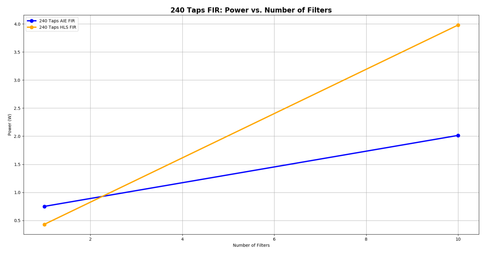
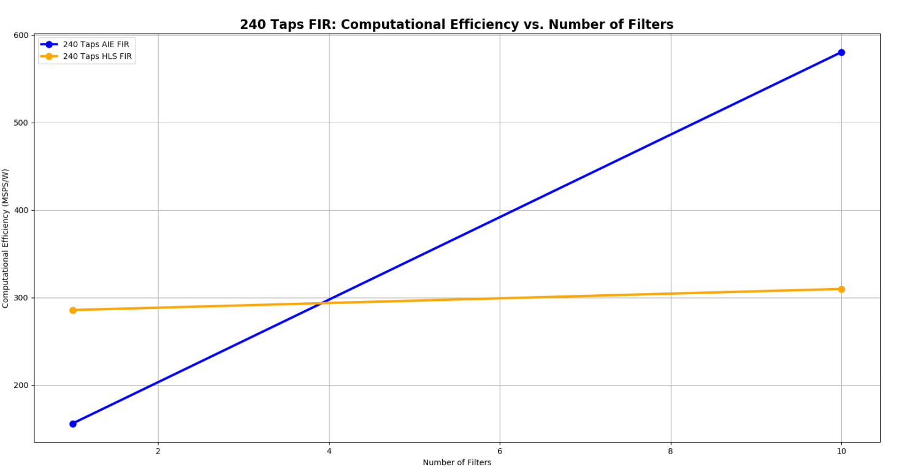
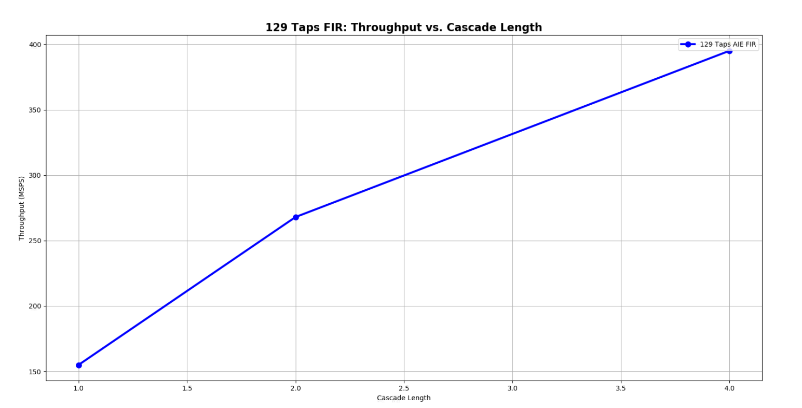
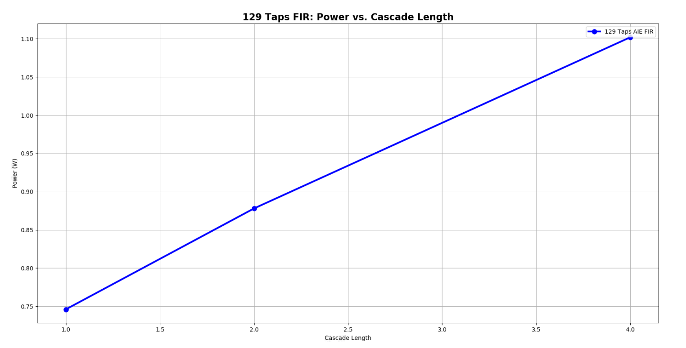
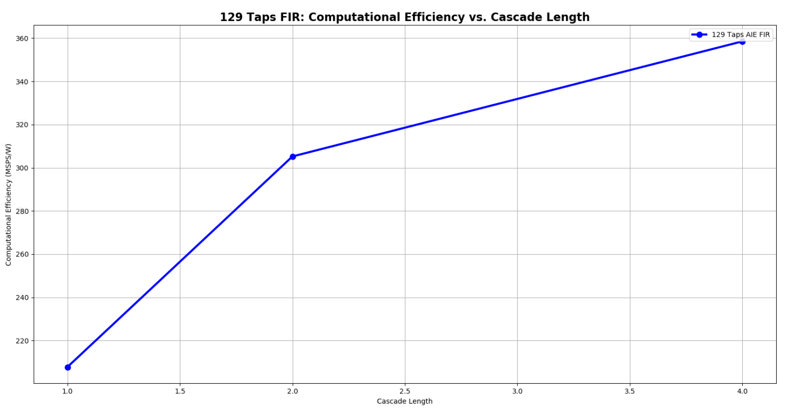
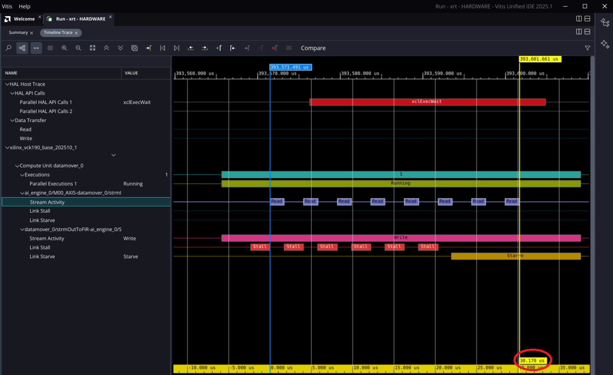
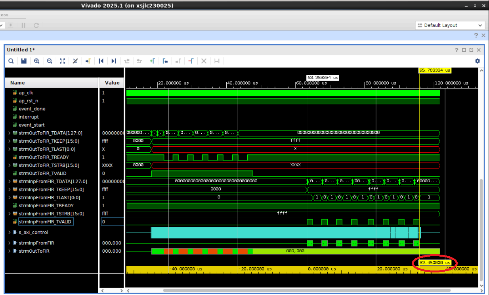

<table class="sphinxhide" style="width:100%;">
  <tr>
    <td align="center">
      <picture>
        <source media="(prefers-color-scheme: dark)" srcset="https://raw.githubusercontent.com/Xilinx/Image-Collateral/main/logo-white-text.png">
        
      </picture>
      <h1>AMD Vitis™ AI Engine Tutorials</h1>
      <a href="https://www.amd.com/en/products/software/adaptive-socs-and-fpgas/vitis.html">See Vitis Development Environment on amd.com</a>
        </br>
      <a href="https://www.amd.com/en/products/software/vitis-ai.html">See Vitis AI Development Environment on amd.com</a>
    </td>
  </tr>
</table>

# Versal AI Engine/HLS FIR Filter Tutorial

***Version: Vitis 2025.2***

## Table of Contents
[Introduction](#introduction)

[Before You Begin](#before-you-begin)

[Design Implementations](#design-implementations)

[Choosing between AI Engine and HLS Implementations](#Choosing-between-AI-Engine-and-HLS-Implementations)

[AI Engine Specific Design Considerations](#ai-engine-specific-design-considerations)

[Measuring Resources, Throughput, Latency, and Power](#measuring-resources-throughput-latency-and-power)

[Conclusion](#Conclusion)

## Introduction

AMD Versal™ adaptive SoCs combine programmable logic (PL), processing system (PS), and AI Engines with leading-edge memory and interfacing technologies. These features deliver powerful heterogeneous acceleration for any application. The hardware and software are targeted for programming and optimization by data scientists and software and hardware developers. A host of tools, software, libraries, IP, middleware, and frameworks enable Versal adaptive SoCs to support all industry-standard design flows.

This tutorial is one of the several to perform two system-level design approaches using AI Engines and high-level synthesis (HLS) with DSP engines in a Versal device. The PL resources include look-up tables (LUTs), flip-flops (FFs), and blockRAM modules. In each implementation, you perform hardware emulation and hardware runs in the context of a complete Versal adaptive SoC system design. Each tutorial includes a makefile for additional customisation. 

An important goal and criteria of this tutorial is the use of C++-based kernels for AI Engine and HLS library kernels for DSP Engine and data movers. Throughout the tutorial, you work with the Vitis application acceleration development flow and library kernels to integrate kernels easily and scale them in a system design. In the Vitis application acceleration development flow, the Vitis HLS tool automates many code modifications required to implement and optimize the C or C++ code in PL. This automation includes simplifying data mover kernel coding. The tool infers pragmas to define correct interfaces for your function arguments and to pipeline loops and functions. This process is central to Vitis HLS in the application acceleration flow. The inference of required pragmas to produce the right interface for your function arguments and to pipeline loops and functions is the foundation of the Vitis HLS in the application acceleration flow. Vitis HLS also supports customization of your code to implement different interface standards or specific optimizations to achieve design objectives, enable scaling, and leverage automation. **Note**: Alternative design methods to Vitis HLS can increase PL-based performance. For example, LogiCORE™ finite impulse response (FIR) Compiler IP and register transfer level (RTL)-based data movers can boost raw performance but also raise dynamic power and extend design time. 

A common question is whether using AI Engines, HLS, or RTL targeting digital signal processors (DSPs) produces the best implementation. The answer depends on your design objectives, complexity, and unique characteristics. Review the section in this tutorial that discusses trade-offs to identify the best choice for your design. Another section explains AI Engine-specific design considerations because AI Engines are a relatively new technology compared to the mature field‑programmable gate array (FPGA) fabric or PL with DSPs.

<details>
<summary>Objectives</summary>

### Objectives
After completing the tutorial, you can:
* Develop a system-level design, such as a FIR filter. Identify the algorithm and deploy the same algorithm on AI Engine and DSP engines using Vitis HLS.
* Build a complete system design by following the steps in the Vitis unified software platform flow. This includes creating the AI Engine adaptive data flow (ADF) API graph, compiling the A72 host application, and compiling PL kernels using the Vitis compiler (`v++`). You then link the AI Engine and HLS kernels with the platform and package the design. Run the design through hardware emulation and hardware flow in a mixed system C/RTL cycle-accurate/QEMU-based simulator.
* Develop a consistent harness so the data mover kernels keep a similar interface with AI Engine or HLS kernels (with AXI4-stream) and double date rate (DDR) memory with memory-mapped AXI4.
* Work with graph control APIs to enable run-time updates using the run-time parameter (RTP) interface for the AI Engine implementation and HLS APIs to control HLS or PL kernels.
* Understand performance factors such as resource usage, latency, and power in AI Engine and HLS DSP implementations. Use this knowledge to select the best approach.

</details>

<details>
<summary>Overview</summary>

### Overview
This tutorial implements a FIR filter chain in two ways: one targeted at AI Engines and one targeted at DSP engines using Vitis HLS.

Explore the FIR filters large design space using the following fixed/constant parameters:
* Data Type: `cint16`
* Coefficient type: `int16`
* Symmetric FIR
* Fixed, non-reloadable coefficients

Specify the number of filter taps and cascaded filters in the chain as parameters in the build process. Each filter in the chain consists of an identical number of taps with identical coefficients. While this is not necessarily a realistic design situation, it provides a simple means for generating, scaling, and managing the filter chain. You can further simplify the design by using a triangular window for the filter coefficients. This generates the taps through linear interpolation. (Refer to https://www.recordingblogs.com/wiki/triangular-window or https://en.wikipedia.org/wiki/Window_function#Triangular_window for more information.)

You deploy the same filter chain in AI Engine and DSP engine implementations. The design compiles through `v++` and creates a Petalinux-based platform using a script and generates the programmable device image (PDI) and host application.


Direct the makefile-based build process to build chains of different lengths with a specified number of taps. Maintain matching harnesses for both implementations to store input and output vectors in DDR memory. Use the data mover kernels to move data to and from AI Engine and HLS FIR kernels. Control data flow with XRT running on the Arm Cortex A-72 processor. Use graph control APIs for AI Engine kernels. Use HLS APIs to control HLS or PL kernels.

</details>

<details>
  <summary>Directory Structure</summary>

### Directory Structure
```
filter_AIEvsHLS
+-- AIE.................................contains AI Engine implementation
|   +-- design .........................contains source and include files
|   |	+-- aie_src ....................AI Engine source code
|   |   +-- exec_files .................contains hw_emu launch script
|   |   +-- host_app_src ...............A72 application source code
|   |	+-- pl_src .....................PL (HLS) source code
|   |   +-- profiling_configs ..........contains xrt.ini file
|   |   +-- python_scripts .............contains script to generate co-efficients
|   |   +-- system_configs..............contains all system configuration files
|   |   +-- vivado_metrics_scripts......contains script for reporting utilisation and power from vivado
|   +-- images .........................contains images of the design
|   +-- Makefile .......................with recipes for each step of the design compilation
|   +-- description.json................required for internal regression 
|   +-- multi_params.json...............required for internal regression 
|   +-- sample_env_setup.sh ............contains all environment variables
+-- HLS.................................contains HLS FIR implementation, targeting DSP Engines
|   +-- design..........................contains source and include files
|   |   +-- directives.................contains directives for various vitis compilation stages like hls.pre_tcl etc
|   |   +-- exec_files .................contains hw_emu launch script
|   |   +-- host_app_src ...............A72 application source code
|   |	+-- pl_src .....................PL (HLS) source code
|   |   +-- profiling_configs ..........contains xrt.ini file
|   |   +-- python_scripts .............contains script to generate co-efficients
|   |   +-- system_configs..............contains all system configuration files
|   |   +-- vivado_metrics_scripts......contains script for reporting utilisation and power from vivado
|   +-- images .........................contains images of the design
|   +-- Makefile .......................with recipes for each step of the design compilation
|   +-- description.json................required for internal regression 
|   +-- multi_params.json...............required for internal regression 
|   +-- sample_env_setup.sh ............contains all environment variables
```

</details>

## Before You Begin

<details>
<summary>Documentation: Explore AI Engine Architecture</summary>

### *Documentation*: Explore AI Engine Architecture

* [AI Engine Development Design Process](https://www.xilinx.com/support/documentation-navigation/design-process/ai-engine-development.html)

* [AM009 AI Engine Architecture Manual](https://docs.amd.com/r/en-US/am009-versal-ai-engine/Revision-History)

* [Versal adaptive SoC AI Engines for Dummies](https://forums.xilinx.com/t5/Design-and-Debug-Techniques-Blog/Versal-ACAP-AI-Engines-for-Dummies/ba-p/1132493)

### *Tools Documentation:

* [AI Engine Documentation](https://docs.amd.com/search/all?filters=Document_ID~%2522UG1076%2522_%2522UG1079%2522&content-lang=en-US)
</details>

<details>

<summary>Tools: Installing the Tools</summary>

### *Tools*: Installing the Tools

To build and run the FIR filter tutorial (AI Engine and DSP implementations), install the following tools.

* Install the [Vitis Software Platform 2025.2](https://docs.amd.com/r/en-US/ug1701-vitis-accelerated-embedded/Vitis-Software-Platform-Installation)

* Obtain licenses for AI Engine tools

* Download and set up the [VCK190 Vitis Platform for 2025.2](https://www.xilinx.com/support/download/index.html/content/xilinx/en/downloadNav/embedded-platforms.html)

* [DSP Library (DSPLib) Documentation](https://docs.amd.com/r/en-US/Vitis_Libraries/dsp/index.html)

* Download the [DSP Library](https://github.com/Xilinx/Vitis_Libraries/tree/master/dsp)

</details>

<details>
<summary>Environment: Setting Up the Shell Environment</summary>

### Environment: Setting Up the Shell Environment
After installing the elements of the Vitis software platform, update the shell environment script. Set the environment variables to your system specific paths.

Edit `sample_env_setup.sh` script with your file paths:
```bash
export PLATFORM_REPO_PATHS= <YOUR-2025.2-PLATFORM-DIRECTORY>
export XILINX_VITIS = <YOUR-2025.2-VITIS-DIRECTORY>/2025.2
export COMMON_IMAGE_VERSAL=<YOUR-XILINX-VERSAL-COMMON-V2025.2-DIRECTORY>
export DSPLIBS_VITIS=<YOUR-PATH-TO-2025.2-DSP-LIBRARY>

source $COMMON_IMAGE_VERSAL/environment-setup-cortexa72-cortexa53-amd-linux
source $XILINX_VITIS/settings64.sh

```
Then source the environment script:
```bash
source sample_env_setup.sh
```  

</details>

<details>
<summary>Validation: Confirming Tool Installation</summary>

### Validation: Confirming Tool Installation
```bash
which vitis
which aiecompiler
```

Confirm that the VCK190 production base platform is available.
```bash
platforminfo --list | grep -m 1 -A 9 vck190_base
```
The output of the previous command is as follows:
```bash
"baseName": "xilinx_vck190_base_202320_1",
            "version": "1.0",
            "type": "sdsoc",
            "dataCenter": "false",
            "embedded": "true",
            "externalHost": "false",
            "serverManaged": "false",
            "platformState": "pre_synth",
            "usesPR": "false",
```

</details>

## Design Implementations
The makefile and source files for the AI Engine and HLS implementations are in the respective **AIE** and **HLS** directories. For the documentation of the flow to build the design and details of the hardware and software design, click each of the following links:

[AI Engines design implementation](AIE)

[HLS with DSP Engines design implementation](HLS)


## Choosing between AI Engine and HLS Implementations
The choice of which engine (AI or DSP) to use for implementing a specific function in your design or application is not always a simple one. Base your decision on specific application requirements of performance and resource usage. Use high-level guidelines to assist with architecting your design to a Versal device with AI Engines. For example, small functions with modest amounts of computation most likely need to be more efficient targeting the PL and DSP engines. As computational need increase, move those functions to the AI Engine for more efficiency.

Do not decide engine placement in isolation at the function level. Evaluate the problem within the complete dataflow path. An inefficient function implemented in the AI Engine can improve total efficiency if surrounded by highly efficient compute functions in the dataflow. Such placement can deliver better throughput and latency compared to moving the data to PL for that function and back into the AI Engine array.

For this discussion, define computational efficiency as the throughput (samples per second) divided by power (watts). Use computational efficiency only when comparing functionally identical designs. Given two identical designs with identical throughputs, this tutorial considers the design using less power as a better solution.

Typically, start a design by deciding on an architecture and implementation to meet throughput and latency targets. Recognize that the architecture and implementation usually determine resource usage and power consumption, which can be critical for meeting specific targets.

<details>
<summary>Meeting Throughput Requirements</summary>

### Meeting Throughput Requirements

For DSP-based designs, start with an estimate of the system clock rate that the PL can support. Divide that clock rate by the desired filter throughput to determine the number of   available clock cycles per sample. Feed this number into the FIR compiler to construct the FIR with the minimum resources required to implement the design. More clock cycles per sample reduce the resources needed for implementation. 

For AI Engine based designs, a FIR kernel running on the AI Engine is executing its code at the AI Engine clock rate, which is 1 GHz for the platform used. Benchmark the maximum throughput for various filter configurations on the [Vitis DSP Library Benchmark/QoR page](https://docs.amd.com/r/en-US/Vitis_Libraries/dsp/user_guide/L2/benchmark.html).

For the filter sizes selected in this tutorial with a cascade length of one and a `window_size` of 2048, review the following AI Engine throughputs:

| Taps |  Throughput     |
|------|-----------------|
|   15 |  996.593 MSPS(*)|
|   64 |  512.480 MSPS   |
|  129 |  201.065 MSPS   |
|  240 |  116.928 MSPS   |

***Note***: This result is I/O bound.

The previous table shows the throughput achieved using one AI Engine per FIR. Within the AI Engine array architecture, you can cascade partial products between neighboring AI Engine tiles. Cascading partial products can improve overall throughput for a function but increases resource usage. This approach is similar to traditional FPGA design in the PL. Refer to  [Assigning Multiple AI Engines per Filter](#assigning-multiple-ai-engines-per-filter) for more information.

</details>

<details>
<summary>Resource Utilization</summary>

### Resource Utilization

The AI Engine reduces the overall requirement on the PL and DSPs in a design with a lot of vectorizable compute. For example, the following shows the required resources for the same 64-Tap FIR filter implemented in both AI Engine and PL with DSPs:

| Impl | Filters | Taps | Param        | Throughput    | LUTS  | Flops | DSP   | AIE   |
|------|---------|------|--------------|---------------|-------|-------|-------|-------|
| AIE  |     1   |   64 | win=2048     | 504.899  MSPS |   196 |   574 |     0 |   2   |
| HLS  |     1   |   64 | ck_per_sam=1 | 497.414  MSPS |  1888 |  5634 |    64 |   0   |
| AIE  |    10   |   64 | win=2048     | 5048.99  MSPS |   196 |   574 |     0 |   20  |
| HLS  |    10   |   64 | ck_per_sam=1 | 4781.55  MSPS | 10532 | 45009 |   640 |   0   |
| AIE  |     1   |  240 | win=2048     | 116.928  MSPS |   187 |   568 |     0 |   1   |
| HLS  |     1   |  240 | ck_per_sam=4 | 124.843  MSPS |  2528 |  7217 |    60 |   0   |
| AIE  |    10   |  240 | win=2048     | 1169.28  MSPS |   187 |   568 |    0  |   10  |
| HLS  |    10   |  240 | ck_per_sam=4 | 1235.09  MSPS | 16906 | 60872 |   600 |   0   |

It is clear that the AI Engine implementation offers significant savings of PL resources, especially as the design size increases.
***Note***: For the 240 tap FIR filter, the DSP version processes one sample every four clock cycles. This reduces the throughput, but also proportionately reduces the logic and power. If `ck_per_sam` is one, the result provides four times the resources, but also utilizes four times the resources and power, leading to an infeasible design from a resources point of view. In any design, targeting any architecture or technology, trade-offs exist and requires understanding to get the most efficient solution for your requirements.

</details>

<details>
<summary>Power Utilization</summary>

### Power Utilization
In general, smaller designs are more power-efficient in the PL than in AI Engines. As designs grow larger, efficiency advantage shifts to AI Engine implementations. This is represented in the following dynamic power graph for 240-tap FIR chains with 1 and 10 FIR filters connected sequentially. The AIE dynamic power values below use a `window_size` of 2048. For HLS or DSP implementation, the power slope is a straight line. For the AI Engine implementation, a single filter starts off with a much higher dynamic power, but the slope is shallower. One DSP implementation of a single fir filter uses less power than one AI Engine implementation filter. As the number of filters increases, AI Engine efficiency improves. In a ten-FIR chain, AI Engine implementation uses about two watts less than HLS or DSP-based FIR filter chains. The following table shows power utilization of FIR AIE and HLS for 240-taps

| No of Filters | AIE FIR    |   HLS FIR    |
|---------------|------------|--------------|
|      1        |   0.75     |   0.43       |
|      10       |   2.014    |   3.98       |



***Note:*** DSP Refers to the HLS Implementation.

</details>

<details>
<summary>Computational Efficiency</summary>

### Computational Efficiency
Computational efficiency is a common and important metric for comparing two designs. Calculate it by dividing the throughput by the power consumed, in mega samples per watt (MS/W). For a given design, a higher number is more efficient in its use of power to perform the computations. The following graph plots the computational efficiency for a 240-tap FIR filter chain with one and ten filters. The AIE computational efficiency values use a `window_size` of 2048. In this comparison, slope is irrelevant. Focus on whether, for a given chain, one design is more efficient than another. For a single FIR filter, a single DSP implementation is more efficient. As the number of filters increases in the chain, AI Engine implementations become more efficient than HLS or DSP designs. 
The following table shows computational efficiency of FIR AIE and HLS for 240-taps

| No of Filter  |   AIE FIR  |   HLS FIR    |
|---------------|------------|--------------|
|      1        |  155.904   |   285.682    |
|      10       |  580.576   |   309.779    |




***Note:*** DSP Refers to the HLS Implementation.

</details>

## AI Engine Specific Design Considerations

<details>
<summary>Assigning Multiple AI Engines per Filter</summary>

### Assigning Multiple AI Engines per Filter
For a HLS implementation, specifying the number of clocks per sample establishes the throughput and is the primary factor in determining how many resources you need. The relationship is linear.

For the AI Engine DSPLib FIR filter kernels, the kernels provide a parameter called cascade length (`CASC_LEN`). These kernels can assign multiple AI Engines to a particular filter kernel. This results in increased throughput, but the relationship is not linear. The following graphs and table shows the results for a single 129 tap FIR filter, with `CASC_LENs` of 1, 2, and 4, and window size of 256.

| Cascade length | Throughput (MSPS)       |
|----------------|-------------------------|
|      1         |     154.98              | 
|      2         |     267.99              | 
|      4         |     395.08              | 




| Cascade length | Dynamic power(W)        |
|----------------|-------------------------|
|      1         |    0.746                |
|      2         |    0.878                |
|      4         |    1.102                |





| CASCADE LENGTH |  Performance(MSPS/W)  |
|----------------|-----------------------|
|      1         |  207.747              |
|      2         |  305.227              |
|      4         |  358.511              |




As can be seen, going from CASC_LEN =1 to CASC_LEN=2 produces a significant improvement in performance. Going from CASC_LEN=2 to CASC_LEN=4 increases performance even further, but offers diminishing returns. Given that power increases with increasing AI Engines, the resulting computation efficiency chart shows that adding more AI Engines can potentially decrease computational efficiency as seem in this case.

Some application require maximum throughput performance available and are not power constrained. Other applications prefer the two-cascade option as optimal because it gives the best performance while maintaining the design within the power constraints. Make each design decision in the context of your complete application and its specific requirements.

The following table provides some additional information on data on throughput for various filter sizes implemented on the AI Engines using different cascade lengths and window size as 256:

| Filters | Taps | Throughput (CASC_LEN=1) | Throughput (CASC_LEN=2) | Throughput (CASC_LEN=4) |
|---------|------|-------------------------|-------------------------|-------------------------|
|     1   |   15 |  996.593 MSPS(*)         |  970.014 MSPS           | Too small to cascade    |
|     1   |   64 |  278.30 MSPS             |  504.89  MSPS           | 534.90    MSPS          |
|     1   |  129 |  154.98 MSPS             |  267.99  MSPS           | 395.08    MSPS          |
|     1   |  240 |  116.928 MSPS            |  169.064 MSPS           | 250.596   MSPS          |

(*)Note: this result is I/O bound.

</details>

<details>
<summary>Window Size</summary>

### Window Size
The AI Engine processes data in bursts. Data bursts transfer between AI Engines using ping-pong buffers. One engine writes burst data into one of the two buffers. When full, buffers swap, and the downstream engine reads the data. Window size refers to the size of these data bursts. Establishing the optimum window size is a balancing act between throughput and latency. Larger window sizes provide higher throughput because burst overhead impacts performance less. Latency increases proportionately to the window size.

Thus, choose the window size that is only as large as the desired throughput target.

The following is data for the AI Engine with one 64-tap FIR filter example for various window sizes:

| Impl | Filters | Taps | Window Size | Latency  | Execution Time  | Throughput   |
|------|---------|------|-------------|----------|-----------------|--------------|
| AIE  |     1   |   64 |       64    |  0.4 µs  |  74.27 µs       |  220.59 MSPS |
| AIE  |     1   |   64 |      256    |  1.19 µs |  58.87 µs       |  278.30 MSPS |
| AIE  |     1   |   64 |     1024    |  4.39 µs |  53.23 µs       |  307.79 MSPS |
| AIE  |     1   |   64 |     2048    |  8.29 µs |  47.59 µs       |  344.27 MSPS |

If, for example, our throughput requirements are 200 MSPS, a window size of 64 satisfies that performance requirement with the least amount of latency.

</details>

## Measuring Resources, Throughput, Latency, and Power

<details>
<summary>Measuring Resources, Throughput, Latency, and Power</summary>

### Resource and Power Utilization
The power and resource utilization information is in the `report_dir` directory, with the file name: fir_[aie|dsp]_<number_of_fir_filters>firs_<number_of_filter_taps>taps_utilization.txt

Or, you can remove this information from the design yourself by opening the project in Vivado tools:

`build/fir_aie_$(N_FIR_FILTERS)firs_$(N_FIR_TAPS)taps/[hw|hw_emu]/_x/link/vivado/vpl/prj/prj.xpr`

Open the implemented design and select **Report Utilization**. For AI Engine utilization and power, use power design manager (PDM).

The following table shows the utilization and power observations.

#### AIE
|Filters|Taps|Throughput(MSPS)|AI Engine Cores |Vector Load | Number Of Active Memory Banks | Memory R/W Rate | AI Engine Tiles | Interconnect Load | Power (W) | Performance (MSPS/Watt) |
|-------|----|----------------|----------------|------------|-------------------------------|-----------------|-----------------|-------------------|-----------|-------------------------|
|     1 | 15 |   996.593      |      1         |   13.48%   |     14                        |    2.51%        |    2            |     5.90    %     |  0.56     |   1763.88               |
|     1 | 64 |   504.899      |      2         |   23.45%   |     20                        |    9.92%        |    4            |     3.54    %     |  0.86     |   582.351               |
|     1 |129 |   267.990      |      2         |   40.22%   |     14                        |    19.09%       |    4            |     4.30    %     |  0.87     |   305.227               |
|     1 |240 |   116.928      |      1         |   38.47%   |     14                        |    9.66%        |    2            |     5.90    %     |  0.75     |   155.904               |
|    10 | 15 |   9965.93      |      10        |   13.48%   |     104                       |    2.51%        |    18           |     3.58    %     |  1.18     |   8381.77               |
|    10 | 64 |   5048.99      |      20        |   23.45%   |     164                       |    9.92%        |    35           |     3.62    %     |  2.82     |   1787.25               |
|    10 |129 |   2679.95      |      20        |   40.22%   |     104                       |    19.09%       |    26           |     4.05    %     |  3.15     |   850.507               |
|    10 |240 |   1169.28      |      10        |   38.47%   |     104                       |    9.66%        |    20           |     3.68    %     |  2.01     |   580.576               |

*Note: A script-based method measures the vector load, number of memory banks, and memory R/w rate and then imports the values manually in PDM to get the power.

#### HLS
|Filters|Taps| Throughput(MSPS)|LUTs  | FF (Regs) | DSPs | Dynamic Power(W) | Performance (MSPS/Watt) |   
|-------|----|-----------------|------|-----------|------|------------------|-------------------------| 
|     1 | 15 |   994.075       |1864  |  4248     |  32  |   0.191          |   5204.582              |      
|     1 | 64 |   497.414       |1895  |  5611     |  64  |   0.328          |   1516.506              | 
|     1 |129 |   249.319       |2756  |  12727    |  66  |   0.508          |   490.785               | 
|     1 |240 |   124.843       |2520  |  7194     |  60  |   0.437          |   285.682               | 
|    10 | 15 |   9609.86       |6966  |  25213    |  320 |   1.645          |   5841.862              | 
|    10 | 64 |   4782.13       |10570 |  45202    |  640 |   3.079          |   1553.146              | 
|    10 |129 |   2439.42       |17401 |  115899   |  660 |   5.168          |   472.025               | 
|    10 |240 |   1235.09       |16875 |  60886    |  600 |   3.987          |   309.779               | 

Achieve comparable throughput between AIE and HLS implementations by adjusting sample period, cascade length, and window size. Specifically, for 240 taps, use a cascade length of 1. For other taps, use a cascade length of 2. Also employ a window size of 256 for 129 taps, and apply a window size of 2048 for all other taps. In the HLS implementation, use a sample period of 1 for less than 64 taps, 2 for 129 taps, and 4 for 240 taps.

Upon analysis, observe the computation efficiency is high in a single DSP implementation of a FIR filter. Nevertheless, the efficiency of the AI Engine implementation improves as the number of filters in a chain increases.

#### Power from XPE vs HW

**AIE**
|Filters|Taps| xpe Load(in W) | HW Load(in W) |
|-------|----|----------------|---------------|
|    10 | 64 |      3.89      |    4.415      |
|    10 |240 |      1.94      |    2.734      |

**HLS**
|Filters|Taps| xpe Load(in W) | HW Load(in W) |
|-------|----|----------------|---------------|
|    10 | 64 |      3.30      |    2.97       |
|    10 |240 |      4.30      |    4.123      |

</details>

<details>
<summary>Throughput and Latency Measurements</summary>

### Throughput and Latency Measurements
To maintain consistency between the AI Engine and DSP implementation, run the design in hardware using the same flow to measure throughput and capture trace data in run-time. Refer to the [Vitis Unified Software Development Platform documentation](https://docs.amd.com/v/u/en-US/ug1416-vitis-documentation) for more information.


Refer to the section **Run on Hardware** in the AI Engine and HLS implementation documentation for setting up the flow to measure throughput and running the application.

After the application run, the following three files populate:
* device_trace_0.csv
* hal_host_trace.csv
* xrt.run_summary
Transfer the .csv and `_summary` files back to the `run_dir` directory, for example:
```
scp -r *.csv *_summary <user>@10.10.71.101:<path>
```
Then view the summary file with `vitis_analyzer xrt.run_summary` command and select `Timeline Trace`:

A trace of the AI Engine implementation with `N_FIR_FILTERS=1` and `N_FIR_TAPS=64 of TARGET=hw` is shown in the following figure:


The time reported by trace is with the data mover kernel running at 156.250 MHz. Because the data mover kernel is running at 300 MHz, scale the time data.

Line up the cursors with the start and end of the `datamover_0.strmInpFromFIR` stream to measure throughput. Obtain cursor times with µs resolution by zooming in further.
```
	Processing time = (End Timestamp of strmInpFromFIR - Start Timestamp of strmInpFromFIR)
			= 30.170 us

	Throughput (300MHz)= (Input Sample * Iterations) /(Processing time)
          	   = (2048 x 8 ) / 30.170 us
         	   =  543.056 Msamples / sec
```

Measure latency from the start of the `datamover_0.strmOutToFIR` stream write to the start of the `datamover_0.strmInpFromFIR` stream read:
```
	Latency = (Start Timestamp of strmInpFromFIR - Start Timestamp of strmOutToFIR)

	Latency (300MHz) = 5.730 µs


```

A trace of the AI Engine implementation with N_FIR_FILTERS=1 and N_FIR_TAPS=64 of TARGET=hw_emu is shown in the following figure:



Align cursors with the start and end of the `datamover_0.strmInpFromFIR` stream read to measure throughput. Zoom in to obtain cursor times with µs resolution.
```
	Processing time = (End Timestamp of strmInpFromFIR - Start Timestamp of strmInpFromFIR)
			=  32.450us

	Throughput = (Input Sample * Iterations) /(Processing time)
          	   = (2048 x 8 ) / 32.450 us
     	           = 504.899 Msamples / sec

```
## Latency Calculation of 64 Taps, 1 Filter is Below

Measure latency from the start of the `datamover_0.strmOutToFIR` stream writer to the start of the `datamover_0.strmInpFromFIR` stream read:
```
	Latency = (Start Timestamp of strmInpFromFIR - Start Timestamp of strmOutToFIR)
		= 6.076 us
```

</details>

## Conclusion

This tutorial demonstrates how to implement FIR filter chains in both the AI Engine and PL with DSPs using HLS and the Vitis kernel-based flow.

Also, you explored the AI Engine and FIR filter chain implementations and how design decisions impact throughput, resources, and performance. This exercise showed how small FIRs taken in isolation are not efficient in an implementation when targeting AI Engine. Larger FIRs with more instances show AI Engine becoming the most efficient solution. You can also see this from the results, how even more compute, beyond this example, and a larger data path enables greater efficiency of implementation and performance than the traditional FPGA programmable logic and DSP engines, if that is what your application needs.


### Support

Use GitHub issues to track requests and bugs. For questions go to [forums.xilinx.com](http://forums.xilinx.com/).


<p class="sphinxhide" align="center"><sub>Copyright © 2023–2026 Advanced Micro Devices, Inc.</sub></p>

<p class="sphinxhide" align="center"><sup><a href="https://www.amd.com/en/corporate/copyright">Terms and Conditions</a></sup></p>

