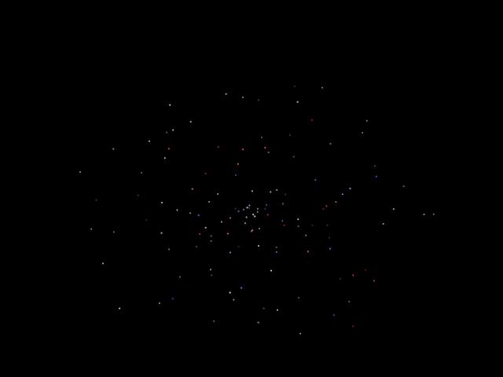

<table class="sphinxhide" style="width:100%;">
  <tr>
    <td align="center">
      <picture>
        <source media="(prefers-color-scheme: dark)" srcset="https://raw.githubusercontent.com/Xilinx/Image-Collateral/main/logo-white-text.png">
        
      </picture>
      <h1>AMD Vitis™ AI Engine Tutorials</h1>
      <a href="https://www.amd.com/en/products/software/adaptive-socs-and-fpgas/vitis.html">Refer to the Vitis™ Development Environment on amd.com</a>
        </br>
      <a href="https://www.amd.com/en/products/software/vitis-ai.html">Refer to the Vitis™ AI Development Environment on amd.com</a>
    </td>
  </tr>
</table>

# Running the Simulation

*Estimated time: less than 1 minute*

Run the python simulation with the following command:

```
make all
```

or

```
python3 test.py -v
```

The python scripts assume you have installed the following packages:

* python-3.9.2 or higher
* numpy
* matplotlib
* pandas

## Python Simulations on x86 Machine

Review the `test.py` file. Notice that it runs three unit tests: `test_random_x1`, `test_random_x10`, and `test_random_x100`. Each unit test creates two instances of the `Particles` class: `particles_i` and `particles_j`. Each `Particles` object contains arrays of floating point values for the particle positions, particle velocities, and mass (`x y z vx vy vz m`). These arrays are initalized with random values with the `setSphereInitialConditions()` function in `pylib/particles.py` file. Invoke the `cos()` and `sin()` functions to constrain the `x` and `y` positions in a sphere. The remaining constrains are as follows:

* minimum z initial position =–1000
* maximum z initial position = 1000
* minimum mass = 10
* maximum mass = 110
* minimum inital velocity =–2.0
* maximum inital velocity = 2.0
* timestep (ts) = 1
* softening factor<sup>2</sup> (sf<sup>2</sup>)= 1000

Each unit test then calls the `pylib/nbody.py`'s `compute()` function passing in the `particles_i` and `particles_j` objects as inputs. The `nbody.compute()` function is the vectorized python implementation of the N-Body Simulator and each call simulates 1 timestep. The `nbody.compute()` function outputs a new `Particles` object with the new `x y z vx vy vz m` floating point arrays.  

Each unit test simulates a different number of particles for 1 timestep.

|Test Name|Number of Particles|
| ------------- | ------------- |
|test_random_x1|128|
|test_random_x10|1280|
|test_random_x100|12800|

The 100 tile AI Engine design simulates 12,800 particles. The single tile AI Engine design (x1_design) simulates 128 particles, and the 10 tile AI Engine design (x10_design) simulates 1280 particles.

## Results

You should see something similar to the following execution times for the python simulation.

```
...
test_random_x1 (__main__.PySimUnitTest)
Sets all x,y,z,vx,vy,vz,m to be random values. ... Simulating 128 particles for 1 timestep
Elapsed time for NBody Simulator executed in x86 machines using python is 0.019344806671142578 seconds ...
ok
test_random_x10 (__main__.PySimUnitTest)
Sets all x,y,z,vx,vy,vz,m to be random values. ... Simulating 1280 particles for 1 timestep
Elapsed time for NBody Simulator executed in x86 machines using python is 0.2165219783782959 seconds ...
ok
test_random_x100 (__main__.PySimUnitTest)
Sets all x,y,z,vx,vy,vz,m to be random values. ... Simulating 12800 particles for 1 timestep
Elapsed time for NBody Simulator executed in x86 machines using python is 14.963038682937622 seconds ...
ok
```

Following are animations created from running the Python N-Body Simulator for 300 timesteps.

| 128 Particles                                         | 1,280 Particles                                            | 12,800 Particles                                             |
|-------------------------------------------------------|------------------------------------------------------------|--------------------------------------------------------------|
|   |   |   |
| x,y,z scale=+-1800                                    | x,y,z scale=+-2300                                         | x,y,z scale=+-63256                                          |

## (Optional) Creating Animation GiFs

You can create these .gifs with the following command:

*Estimated time: 3 hours*

```
make animations
```

## Next Steps

After running the Python NBody Simulator, you are ready to move to the next module, [Module 02-AI Engine Design](../Module_02_aie).

### Support

GitHub issues are used for tracking requests and bugs. For questions go to [support.xilinx.com](http://support.xilinx.com/).

<p class="sphinxhide" align="center"><sub>Copyright © 2020–2025 Advanced Micro Devices, Inc.</sub></p>

<p class="sphinxhide" align="center"><sup><a href="https://www.amd.com/en/corporate/copyright">Terms and Conditions</a></sup></p>
