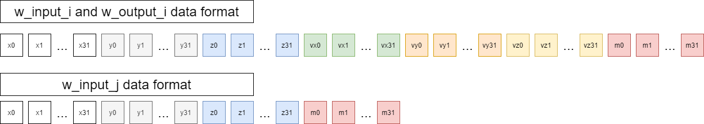
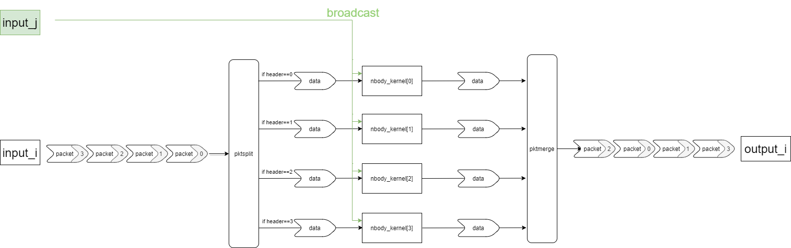
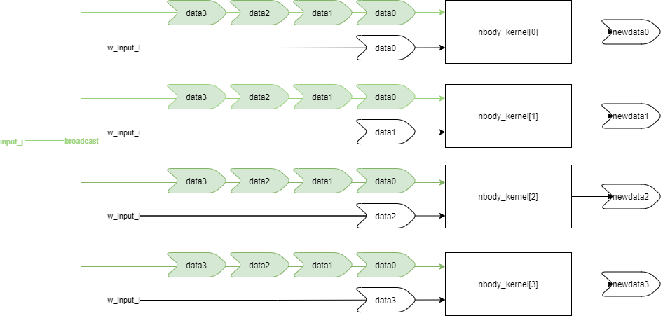
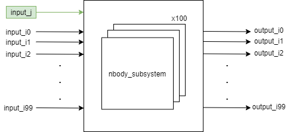
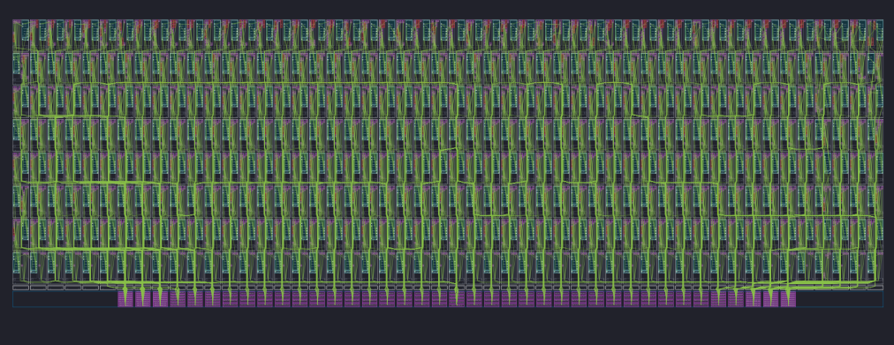
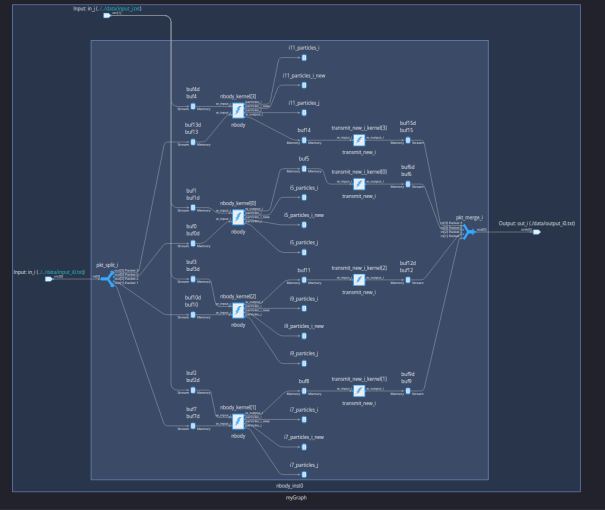

<table class="sphinxhide" style="width:100%;">
  <tr>
    <td align="center">
      <picture>
        <source media="(prefers-color-scheme: dark)" srcset="https://raw.githubusercontent.com/Xilinx/Image-Collateral/main/logo-white-text.png">
        
      </picture>
      <h1>AMD Vitis™ AI Engine Tutorials</h1>
      <a href="https://www.amd.com/en/products/software/adaptive-socs-and-fpgas/vitis.html">Refer to the Vitis™ Development Environment on amd.com</a>
        </br>
      <a href="https://www.amd.com/en/products/software/vitis-ai.html">Refer to the Vitis™ AI Development Environment on amd.com</a>
    </td>
  </tr>
</table>

# Build the Design

*Estimated time: 2 hours*

```
make aie
```

or

```
aiecompiler -v  --target=hw 					\
                --stacksize=2000 				\
                -include="$(XILINX_VITIS)/aietools/include" 	\
	        -include="./" 					\
	        -include="./src" 				\
	        -include="../data" 				\
	        nbody_x4_100.cpp 				\
	        -workdir=work
```

## AI Engine Design

This design uses the following AI Engine features:

* single precision floating-point compute of the N-Body gravity equations on 12,800 particles
* 400 tile design with 400 parallel accelerators
* 1:400 broadcast stream
* 1:4 packet split
* 4:1 packet merge
* PL Kernels designed to support packet switching in AI Engine

## A Single Nbody() Kernel

Review the `src/nbody.cc` file. It contains the implementation of a single AI Engine kernel mapped to a single AI Engine tile called `nbody()`. This kernel performs the following:

* Takes in the `x y z vx vy vz m` values for 32 particles
* Computes the N-Body gravity equations for a single timestep
* Outputs the new `x y z vx vy vz m` values for the 32 particles
  
The kernel takes in two inputs: `w_input_i` and `w_input_j`. The `w_input_i` window contains the `x y z vx vy vz m` floating point values for 32 particles. The `w_input_j` window contains the only `x y z m` floating-point values for the same 32 particles. This kernel produces one output: `w_output_i` which contains the new `x y z vx vy vz m` floating-point values for the 32 particles in the next timestep.  


|name|number of 32-bit data values|
| -------------|-----------|
|`w_input_i`|32 * 7 = 224|
|`w_input_j`|32 * 4 = 128|
|`w_output_i`|32 * 7 = 224|



The `nbody()` kernel is sectioned into two major `for` loops. The first major `for` loop (around lines 38-61) calculates the new `x y z` positions for the 32 particles. The second major `for` loop (around lines 64-202) calculates the new `vx vy vz` velocities for the 32 particles. The output mass (`m`) values remain the same as the inputs. The `w_output_i` window is then sent to the `transmit_new_i` kernel (source: `src/transmit_new_i.cc`) to be written to the final output window.

## Four NBody() Kernels Packet Switched

Next, review the `src/nbody_subsystem.h` graph. This graph creates four N-Body kernels, a packet splitter kernel, and a packet merger kernel. Review the packet switching feature tutorial to learn more about the packet switching feature in the AI Engine: [04-packet-switching](https://github.com/Xilinx/Vitis-Tutorials/tree/master/AI_Engine_Development/Feature_Tutorials/04-packet-switching).  



The `nbody_subsystem` graph has two inputs: `input_i` and `input_j`. The `input_i` port is a packet stream that connects to the packet splitter. The packet splitter redirects packets of data to the `w_input_i` port of each `nbody()` kernel. Each `input_i` packet contains a packet header, 224 32-bit data values, and TLAST asserted with the `m31` data value. The `input_j` port is a data stream that broadcasts to all the `nbody()` kernels (that is, all `nbody()` kernels receive the same `input_j` data). The `nbody()` kernels perform their computations and generate the new `w_output_i` data which merges into a single stream of packets, resulting in the output of the `nbody_subsystem` graph `output_i`.

|Name|Number of 32-bit Data Values|Window Size (bytes)|
| -------------|-----------|-----------|
|input_i|224 * 4 = 896| 896 * 4 = 3584 bytes|
|input_j|128| 128 * 4 = 512 bytes|
|output_i|224 * 4 = 896| 896 * 4 = 3584 bytes|

A single instance of the `nbody_subsystem` graph can simulate 128 particles using four AI Engine tiles.

### Workload Distribution and input_j

To calculate the N-Body gravity equations for 128 particles, each `nbody()` kernel calculates the N-Body gravity equations for 32 particles. However, to calculate acceleration and the new velocities, an `nbody()` kernel needs to know the data in the other kernels. For example, if particle 0 is mapped to `nbody_kernel[0]` and particle 32 is mapped to `nbody_kernel[1]`. Then `nbody_kernel[0]` needs to know the data in `nbody_kernel[1]` to accurately calculate the summation equation for acceleration, and then calculate the new velocity of particle 0.

This is where the `input_j` stream plays a vital role in data sharing. Even though the `input_j` data stream has a window size for 32 particles worth of data, the `LOOP_COUNT_J` value can be set to allow the `nbody()` kernels to take in any number of 32 particles worth of data at a time. For a single instance of the `nbody_subsystem` graph, the `LOOP_COUNT_J` should be set to 4 to stream in data for all four kernels. For the final AI Engine graph, which contains 100 instances of the `nbody_subsystem` graph, the `LOOP_COUNT_J` value is set to 400 to stream in data for all 400 kernels to each `nbody()` kernel.



For example, to calculate the new velocity of particle 0 mapped in `nbody_kernel[0]`, the `nbody_kernel[0]` can retrieve the data value of particle 32 from the `input_j` stream. This way, all `nbody()` kernels will have the data values for all other particles mapped in the other `nbody()` kernels through data streaming from `input_j`.  

## 100 N-Body Subsystems

Review the `nbody_x4_x100.h`. It contains the definition of the `nbodySystem` graph which contains 100 instances of the `nbody_subsystem` graph. Each `nbody_subsystem` maps to four AI Engine tiles which each contain an `nbody()` kernel. Therefore, the `nbodySystem` graph contains 400 `nbody()` kernels using up all 400 available AI Engine tiles. Since each `nbody()` kernel simulates 32 particles, the `nbodySystem` simulates 12,800 particles (32 particles * 400 kernels). There are 100 `input_i` ports (`input_i0-99`) and a single `input_j` port. For one iteration, the `input_i` ports receive four packetized `w_input_i` data which are distributed to four `nbody()` kernels in each `nbody_subsystem` graph. The `input_j` is a 1:400 broadcast stream to the 400 `w_input_j` ports in the 400 `nbody()` kernels.  

Review the `nbody_x4_100.cpp` file. It contains an instance of the `nbodySystem` graph and simulates it for one iteration. Also, review the data files in the data folder. This folder contains the input data files for the `nbodySystem` (`input_i0-99.txt` and `input_j.txt`) used by the `nbodySystem` graph.



Following is the implementation of the 100 compute unit on all 400 AI Engine tiles viewed on the AMD Vitis Analyzer tool.


The red highlighted region encompasses four AI Engine tiles which contain a single compute unit.

Following is the graph visualization of a single compute unit on the Vitis Analyzer tool.


## Why Packet Switching?

You might be curious about the need to implement the packet switching scheme 1:4/4:1. This is to circumvent an AI Engine architecture limitation on the number of simultaneous input and output AXI-Streams allowed per AI Engine column. There are 50 AI Engine columns in the AI Engine array. Each column contains eight AI Engine tiles. Each AI Engine column is allowed a maximum of six 32-bit AXI-Stream inputs and four 32-bit AXI-Stream outputs.

In the design, each `nbody()` kernel maps to an AI Engine tile. Meaning each column of eight AI Engine tiles has nine inputs streams and eight output streams. This violates these constraints.

* 8 `w_input_i` input streams
* 1 `w_intput_j` input stream
* 8 `w_output_i` output streams

With the 1:4/4:1 packet switching scheme, you can combine four streams into one. Because packet switching is applied on the `w_input_i` ports, the number of input streams into a single AI Engine column is reduced to three:

* 1 `input_i` stream that goes to tiles 0-3 in a column
* 1 `input_i` stream that goes to tiles 4-7 in a column
* 1 `input_j` stream that is broadcast to all the columns

On the output side, the number of output streams is reduced to two:

* 1 `output_i` stream coming from tiles 0-3 in a column
* 1 `output_i` stream coming from tiles 4-7 in a column

## (Optional) Simulate the AI Engine Design

*Estimated time: a few days*

Run the following make command to invoke the aiesimulator.

```
make sim
```

## References

* [Packet Switching AI Engine Tutorial](../../../Feature_Tutorials/04-packet-switching)

* [AI Engine Documentation - Explicit Packet Switching](https://docs.amd.com/r/en-US/ug1079-ai-engine-kernel-coding/Explicit-Packet-Switching)

* [Compiling an AI Engine Graph Application](https://docs.amd.com/r/en-US/ug1076-ai-engine-environment/Compiling-an-AI-Engine-Graph-Application)

* [Simulating an AI Engine Graph Application](https://docs.amd.com/r/en-US/ug1076-ai-engine-environment/Simulating-an-AI-Engine-Graph-Application)

## Next Steps

After compiling the 100 compute unit N-Body Simulator design, you are ready to create the PL datamover kernels in the next module, [Module 03 - PL Design](../Module_03_pl_kernels).

### Support

GitHub issues are used for tracking requests and bugs. For questions go to [support.xilinx.com](http://support.xilinx.com/).


<p class="sphinxhide" align="center"><sub>Copyright © 2020–2025 Advanced Micro Devices, Inc.</sub></p>

<p class="sphinxhide" align="center"><sup><a href="https://www.amd.com/en/corporate/copyright">Terms and Conditions</a></sup></p>
