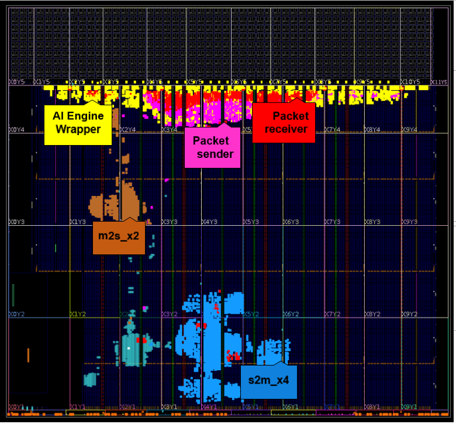

<table class="sphinxhide" style="width:100%;">
  <tr>
    <td align="center">
      <picture>
        <source media="(prefers-color-scheme: dark)" srcset="https://raw.githubusercontent.com/Xilinx/Image-Collateral/main/logo-white-text.png">
        
      </picture>
      <h1>AMD Vitis™ AI Engine Tutorials</h1>
      <a href="https://www.amd.com/en/products/software/adaptive-socs-and-fpgas/vitis.html">Refer to the Vitis™ Development Environment on amd.com</a>
        </br>
      <a href="https://www.amd.com/en/products/software/vitis-ai.html">Refer to the Vitis™ AI Development Environment on amd.com</a>
    </td>
  </tr>
</table>

# Building the Design

*Estimated time: 4 hours*

```
make all
```

or

```
v++ -l                                     \
    -t hw                                  \
    --platform xilinx_vck190_base_202520_1 \
    --save-temps                           \
    -g                                     \
    --optimize 2                           \
    --hls.jobs 8                           \
    --config ./conn.cfg                    \
    --clock.defaultFreqHz 150000000        \
    --temp_dir ./build/_x_temp.hw.xilinx_vck190_base_202520_1               \
    --report_dir ./build/reports/_build.hw.xilinx_vck190_base_202520_1/hpc  \
    --advanced.param compiler.userPostSysLinkOverlayTcl=./post_sys_link.tcl  \
    -o './build/build_dir.hw.xilinx_vck190_base_202520_1/hpc.xclbin'        \
    ../Module_03_pl_kernels/build/_x_temp.hw.xilinx_vck190_base_202520_1/packet_sender.xo   \
    ../Module_03_pl_kernels/build/_x_temp.hw.xilinx_vck190_base_202520_1/mm2s_mp.xo          \
    ../Module_03_pl_kernels/build/_x_temp.hw.xilinx_vck190_base_202520_1/packet_receiver.xo \
    ../Module_03_pl_kernels/build/_x_temp.hw.xilinx_vck190_base_202520_1/s2mm_mp.xo          \
    ../Module_02_aie/build/libadf.a
```

## Full System Design

The AMD Vitis Linker (`v++ -l`) links multiple kernel objects (XO) with the hardware platform XSA file to produce the device binary XCLBIN file.

Review the `conn.cfg` file. It creates an instance of each PL kernel described previously and provides the connection scheme between them and the AI Engine graph. At the end of the file, there are Vivado™ tool options specified to close timing and run the design at 300 MHz.

## Design Implementation

The following image is from the Vivado project for the entire design. It depicts the hardware implementation determined by the place-and-route on the adaptive SoC device.



## References

* [Beamforming Tutorial - Module_04 - AI Engine and PL Integration](../../03-beamforming)

* [Vitis Compiler Command](https://docs.amd.com/r/en-US/ug1399-vitis-hls/vitis-v-and-vitis-run-Commands)

## Next Steps

After linking the AI Engine design with the PL datamovers, you can create the host software. See the next module ([Module 05 - Host Software](../Module_05_host_sw)).

### Support

GitHub issues are used to track requests and bugs. For questions go to [support.xilinx.com](http://support.xilinx.com/).

<p class="sphinxhide" align="center"><sub>Copyright © 2020–2025 Advanced Micro Devices, Inc.</sub></p>

<p class="sphinxhide" align="center"><sup><a href="https://www.amd.com/en/corporate/copyright">Terms and Conditions</a></sup></p>
