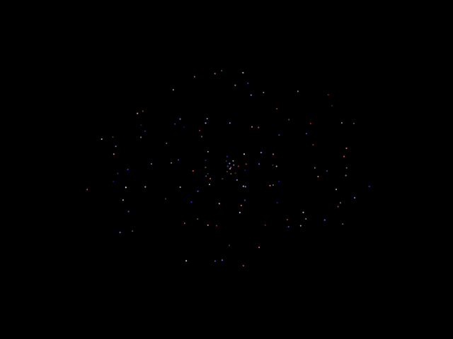

<table class="sphinxhide" style="width:100%;">
  <tr>
    <td align="center">
      <picture>
        <source media="(prefers-color-scheme: dark)" srcset="https://raw.githubusercontent.com/Xilinx/Image-Collateral/main/logo-white-text.png">
        
      </picture>
      <h1>AMD Vitis™ AI Engine Tutorials</h1>
      <a href="https://www.amd.com/en/products/software/adaptive-socs-and-fpgas/vitis.html">Refer to the Vitis™ Development Environment on amd.com</a>
        </br>
      <a href="https://www.amd.com/en/products/software/vitis-ai.html">Refer to the Vitis™ AI Development Environment on amd.com</a>
    </td>
  </tr>
</table>

# Creating the Animation GIF

You can create a gif from your own `data/animation_data.txt` file using the following command:

*Estimated time: 3 minutes*

```
make animation
```

## Results

The following is a GIF created from the [animation_data_golden.zip](https://www.xilinx.com/bin/public/openDownload?filename=animation_data_golden.zip) file. You should get a similar GIF from your own data.

 The following image shows 12,800 particles simulated on a 400 tile AI Engine accelerator for 300 timesteps.


## Latency Performance Comparisons

The following table compares the execution times to simulate 12,800 particles for one timestep on the various N-Body simulators explored in this tutorial.  

|Name|Hardware|Algorithm|Average Execution Time for 1 Timestep (seconds)|
|---|---|--|---|
|Python NBody Simulator|x86 Linux Machine|O(N)|14.96|
|C++ NBody Simulator|A72 Embedded Arm Processor|O(N<sup>2</sup>)|121.295|
|AI Engine NBody Simulator|Versal AI Engine IP|O(N)|0.00888979|

As you can see, the N-Body Simulator implemented on the AI Engine offers a x2,800 improvement over the Python O(N) implementation. It also offers a x24,800 improvement over the C++ O(N<sup>2</sup>) implementation. You can use pthreads to create a vectorized C++ NBody Simulator O(N) implementation, but this is not included in this tutorial.

## Design Throughput Calculations (Effective vs. Theoretical)

The following table describes the total number of floating-point operations (FLOP) for 1 iteration of a single `nbody()` AI Engine kernel:

|Section of Code|mac|mul|add|sub|invsqr|Total FLOP|
|--|--|--|--|--|--|--|
|Step 1|0|0|0|0|0|0|
|Step 2|96|0|0|0|0|192|
|Step 3|2,470,400|1,228,800|51,200|1,228,800|3,276,800|10,726,400|

**Note: Each section is clearly commented in the `nbody.cc` source file.**

**Note: To calculate the total, each `mac` is considered two operations (`mul` and `add`).**

Thus, each `nbody()` kernel executes ~10.7 million FLOP/iteration. Since we have 400 AI Engine tiles (that is, 400 `nbody()` kernels) that execute simulatenously, the total number for the entire AI Engine array becomes ~4.2 billion FLOP/iteration. We calculated each iteration of the entire design (including data movement from DDR to AI Engine) takes an average of 0.0072 seconds. **Therefore the effective throughput of the entire design is ~598.404 GFLOP/s**.  

The theoretical peak throughput the AI Engine array alone can acheive is ~8 Tera FLOP/s. You are using less than 1/10th of its potential!

|Effective Throughput|Theoretical Peak Throughput|
|--|--|
|0.598 TFLOP/s|8 TFLOP/s|

This design of an N-Body Simulator on the AI Engine is a straightforward implementation without any major optimizations done. To further maximize the throughput of the entire design:

* you can explore increasing `FMAX` of the PL kernels from 200 MHz to closer to 500 MHz to reduce the latency of moving data from DDR to the AI Engine
* PL kernels currently implement a round-robin method of transmitting data. You can design these to optimally cache and schedule to increate data bandwidth
* you can refactor the `nbody()` kernel to reduce its reliance on the scalar processor and only use the vector processor in each AI Engine tile by approximating inverse square root

## (Optional) Building x1_design and x10_design

What has been presented so far is the 100 compute unit AI Engine design utilizing all 400 AI Engine tiles. However, to get there you had to create the intermediate AI Engine designs that contain a single compute unit (4 tiles) and 10 compute units (40 tiles). If you want to run the `aiesimulator`, hardware emulation, or build an AI Engine NBody Simulator with significantly shorter build times, feel free to build the `x1_design` or `x10_design`.

### Building the x1_design (simulates 128 particles)

*Estimated time: 1 hour*

```
cd x1_design
make all TARGET=<hw|hw_emu>
```

The following image shows 128 particles simulated for 300 timesteps.



### Building the x10_design (simulates 1,280 particles)

*Estimated time: 1 hour*

```
cd x10_design
make all TARGET=<hw|hw_emu>
```

The following image shows 1,280 particles simulated for 300 timesteps.


### Support

GitHub issues are used to track requests and bugs. For questions go to [support.xilinx.com](http://support.xilinx.com/).

<p class="sphinxhide" align="center"><sub>Copyright © 2020–2025 Advanced Micro Devices, Inc.</sub></p>

<p class="sphinxhide" align="center"><sup><a href="https://www.amd.com/en/corporate/copyright">Terms and Conditions</a></sup></p>
