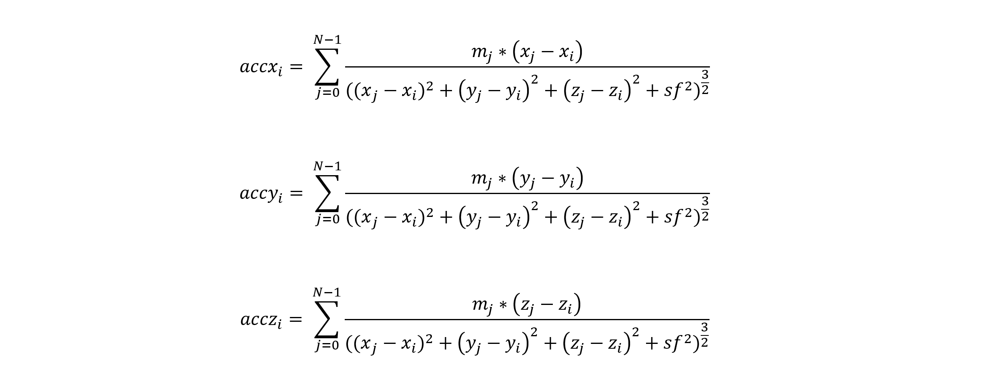
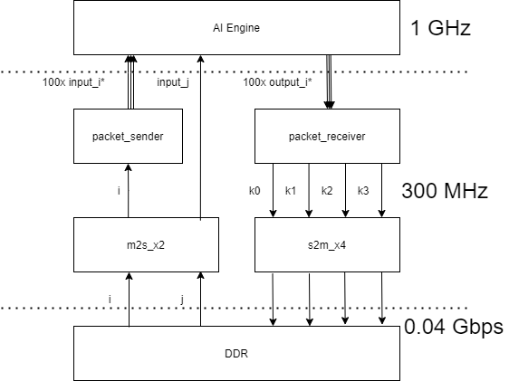

<table class="sphinxhide" style="width:100%;">
  <tr>
    <td align="center">
      <picture>
        <source media="(prefers-color-scheme: dark)" srcset="https://raw.githubusercontent.com/Xilinx/Image-Collateral/main/logo-white-text.png">
        
      </picture>
      <h1>AMD Vitis™ AI Engine Tutorials</h1>
      <a href="https://www.amd.com/en/products/software/adaptive-socs-and-fpgas/vitis.html">Refer to the Vitis™ Development Environment on amd.com</a>
        </br>
      <a href="https://www.amd.com/en/products/software/vitis-ai.html">Refer to the Vitis™ AI Development Environment on amd.com</a>
    </td>
  </tr>
</table>

# N-Body Simulator

***Version: Vitis 2025.2***

## Introduction

This tutorial is an implementation of an N-Body Simulator in the AI Engine. It is a system-level design that uses the AI Engine, PL, and PS resources to showcase the following features:

* A Python model of an N-Body Simulator run on x86 machine
* A scalable AI Engine design that can use up to 400 AI Engine tiles
* AI Engine packet switching
* AI Engine single-precision floating point calculations
* AI Engine 1:400 broadcast streams
* Codeless PL HLS datamover kernels from the AMD Vitis™ Utility Library
* PL HLS packet switching kernels
* PS Host Application that validates the data coming out of the AI Engine design
* C++ model of an N-Body Simulator
* Performance comparisons between Python x86, C++ Arm A72, and AI Engine N-Body Simulators
* Effective throughput calculation (GFLOPS) vs. Theoretical peak throughput of AI Engine

## Before You Begin

You can run this tutorial on the [VCK190 Board](https://www.xilinx.com/products/boards-and-kits/vck190.html) (Production or ES). If you have already purchased this board, download the necessary files from the lounge, ensuring you have the correct licenses installed. If you do not have a board, get in touch with your AMD sales contact.

### *Documentation*: Explore AI Engine Architecture

* [AM009 AI Engine Architecture Manual](https://docs.amd.com/r/en-US/am009-versal-ai-engine/Revision-History)

### *Tools*: Installing the Tools

1. Obtain a license to enable beta devices in AMD tools (to use the VCK190 platform).
2. Obtain licenses for AI Engine tools.
3. Follow the instructions for the [Vitis Software Platform Installation](https://docs.amd.com/r/en-US/ug1701-vitis-accelerated-embedded/Installing-the-Vitis-Software-Platform), ensuring you have the following tools:

      * [Vitis™ Unified Software Development Platform 2025.2](https://docs.amd.com/v/u/en-US/ug1416-vitis-documentation)
      * [Embedded Platform VCK190 Base or VCK190 Base](https://www.xilinx.com/support/download/index.html/content/xilinx/en/downloadNav/embedded-platforms.html)

### *Environment*: Setting Up Your Shell Environment

After installing the elements of the Vitis software platform, update the shell environment script. Set the necessary environment variables to your system specific paths for xrt, platform location, and AMD tools.

1. Edit the `sample_env_setup.sh` script with your file paths:

```bash
export PLATFORM_REPO_PATHS=<user-path>
export COMMON_IMAGE_VERSAL=$PLATFORM_REPO_PATHS/sw/versal/xilinx-versal-common-v<ver>
export XILINX_VITIS = <XILINX-INSTALL-LOCATION>/Vitis/<ver>
export PLATFORM=xilinx_vck190_base_<ver> #or xilinx_vck190_es1_base_<ver> is using an ES1 board
export DSPLIB_VITIS=<Path to Vitis Libs - Directory>


source $(XILINX_VITIS)/settings64.sh
source $(COMMON_IMAGE_VERSAL)/environment-setup-cortexa72-cortexa53-amd-linux

```

2. Source the environment script:

```bash
source sample_env_setup.sh
```  

### *Validation*: Confirming Tool Installation

Make sure you are using the 2025.2 version of the AMD tools.

```bash
which vitis
which aiecompiler
```

## Goals of this Tutorial

### HPC Applications

The goal of this tutorial is to create a general-purpose floating point accelerator for HPC applications. This tutorial demonstrates a x24,800 performance improvement using the AI Engine accelerator over the naive C++ implementation on the A72 embedded Arm® processor.

|Name|Hardware|Algorithm Complexity|Average Execution Time to Simulate 12,800 Particles for 1 Timestep (seconds)|
|---|---|--|---|
|Python N-Body Simulator|x86 Linux Machine|O(N)|14.96|
|C++ N-Body Simulator|A72 Embedded Arm Processor|O(N<sup>2</sup>)|121.295|
|AI Engine N-Body SImulator|Versal AI Engine IP|O(N)|0.00888979|

### PL Data-Mover Kernels

Another goal of this tutorial is to showcase how to generate PL Data-Mover kernels These kernels moves any amount of data from DDR buffers to AXI-Streams.  

## The N-Body Problem

The N-Body problem relates to predicting the motions of a group of N objects which each have a gravitational force on each other. For any particle `i` in the system, the summation of the gravitational forces from all the other particles results in the acceleration of particle `i`. From this acceleration, you can calculate a particle's velocity and its position (`x y z vx vy vz`) in the next timestep. Newtonian physics describes the behavior of very large bodies/particles within the universe. With certain assumptions, the laws can apply to bodies/particles ranging from astronomical size to a golf ball (and even smaller).

### 12,800 Particles Simulated on a 400 tile AI Engine Accelerator for 300 timesteps


The colormap simulates the Red Shift effect in astronomy. Red particles are farther away in space (`-z` direction). Blue particles are closer to you in space (`+z` direction).

### Newton's Second Law of Motion

Newton's Second Law of motion (in mathmatical form) states the force on body (`i`) equals the body's mass times acceleration.


### Gravity Equations - Two Bodies

When the force on body `i` is caused by its gravitational attraction to body `j`, you can calculate that force using the following gravity equation:


Where `G` is the gravitational constant, and `r` is the distance between body `i` and body `j`. Combining Newton's second law of motion with the gravity equation gives the following equation for calculating the acceleration of body `i` due to body `j`.


Multiply by the unit vector of `r` to maintain the direction of the force.

If given an initial velocity (v<sub>t</sub>) and position (x<sub>t</sub>), you can calculate the particle's new position, acceleration, and velocity in the next timestep (t+1).

* Position Equation: x<sub>t+1</sub>=x<sub>t</sub>+v\*ts
* Aceleration Equation: (from previous)
* Velocity Equation: v<sub>t+1</sub>=v<sub>t</sub>+a\*ts

### Gravity Equations - N Bodies

The NBody simulator extends the previous gravity equation to calcuate positions, accelerations, and velocities in the `x`, `y`, and `z` directions of `N` bodies in a system.
For the sake of simplicity in implementation, the following assumptions apply:

1. All particles are point masses
2. Gravitational constant G=1
3. A softening factor (sf<sup>2</sup>=1000) applies to gravity equations to avoid errors when two point masses are at exactly same co-ordinates.
4. The timestep constant ts=1

The N-Body Simulator implements the following gravity equations.

Given inital positions and velocities `x y z vx vy vz` at timestep `t`, you can calculate the new positions `x y z` of the next timestep `t+1`:


To calculate acceleration for the `x`, `y`, and `z` directions of any particle `i` (`accxi accyi acczi`), you must sum the acceleration caused by all other particles in the system (particles `j`):


When you have your accelerations, calculate the new velocities in the `x`, `y`, and `z` directions:


Using these gravity equations, you can calculate your particles' new positions and velocities `x y z vx vy vz` at timestep `t+1`. Then repeat the calculations for the next timestep after. If there are many particles in the system and / or you are simulating for many timesteps, the compute intensive nature of this problem becomes clear. This algorithm has a computational complexity of *O(N<sup>2</sup>)* due to the iterative nature of the process. This is a great opportunity for implementing an accelerator in hardware.

In Module_01-Python Simulations on x86, you can try the `nbody.py` to see how slow the particle simulation runs in software only. The particle simulation runs much faster with accelerators implemented in hardware (AI Engine).

You can vectorize this algorithm to reduce the complexity to O(N). In the AI Engine design, you break down the workload to parallelize the computation on 100 AI Engine compute units.

Source: [GRAPE-6: Massively-Parallel Special-Purpose Computer for Astrophysical Particle Simulations](https://academic.oup.com/pasj/article/55/6/1163/2056223)

### System Design Overview

The N-Body Simulator is implemented on an `XCVC1902 AMD Versal Adaptive SoC` device on the VCK190 board. The simulator consists of PL HLS datamover kernels from the AMD Vitis Utility Library (`mm2s_mp` and `s2mm_mp`), custom HLS kernels that enable packet switching (`packet_sender` and `packet_receiver`), and a 400 tile AI Engine design. Also, the design consists of host applications that enable the entire design, verify the data coming out of the AI Engine, and run the design for multiple timesteps.



#### Dataflow

* The host applications store input data (`i` and `j`) in global memory (DDR) and turn on the PL HLS kernels (running at 300 MHz) and the AI Engine graph (running at 1GHz).
* Data moves from DDR to the dual-channel HLS datamover kernel `mm2s_mp`. The `i` data goes into one channel and the `j` data goes into the other channel. Here, data movement switches from AXI-MM to AXI-Stream. The read/write bandwith of DDR is set to the default 0.04 Gbps.
* The AI Engine graph performs packet switching on the `input_i` data, so the `i` data must be packaged appropriately before going to the AI Engine. So from the `mm2s_mp` kernel, the data streams to the HLS `packet_sender` kernel. The `packet_sender` kernel sends a packet header and appropriately asserts `TLAST` before sending packets of `i` data to the 100 `input_i` ports in the AI Engine.
* The AI Engine graph expects the `j` data to stream directly into the AI Engine kernels, so requires no additional packaging. The `j` data is directly streamed from the `mm2s_mp` kernel into the AI Engine.  
* The AI Engine distributes the gravity equation computations onto 100 accelerators (each using four AI Engine tiles). The AI Engine graph outputs new `i` data through the 100 `output_i` ports. The `output_i` data is also packet switched and needs to be appropriately managed by the `packet_receiver`.
* The `packet_receiever` kernel receives a packet and evaluates the header as 0, 1, 2, or 3 and appropriately sends the `output_i` data to the `k0`, `k1`, `k2`, or `k3` streams.
* The `s2mm_mp` quad-channel HLS datamover kernel receives the `output_i` data and writes it to global memory (DDR). Here, data movement switches from AXI-Stream to AXI-MM.
* Then, depending on the host application, the new output data is read and compared with the golden expected data or saved as the next iteration of `i` data and the AI Engine N-Body Simulator runs for another timestep.

*Note:* The entire design is a compute-bound problem, limited by how fast the AI Engine tiles compute the floating-point gravity equations. This is not a memory-bound design.

## Where we are Headed...

Complete modules 01-07 in the following order:

### Module 01 - Python Simulations on x86

The module shows a python implementation of the N-Body Simulator and execution times to run the N-Body Simulator on an x86 machine.

[Read more ...](Module_01_python_sims/README.md)

### Module 02 - AI Engine Design

This module presents the final 400 tile AI Engine design:

* A single AI Engine kernel (`nbody()`)
* An N-Body Subsystem with 4 `nbody()` kernels which are packet switched (`nbody_subsystem` graph)
* An N-Body System with 100 `nbody_subsystem` graphs (that is., 400 `nbody()` kernels) which use all 400 AI Engine tile resources
* Invoke the AI Engine compiler

[Read more...](Module_02_aie/README.md)
  
### Module 03 - PL Kernels

This modules presents the PL HLS kernels:

* Create datamover PL HLS kernels from AMD Vitis Utility Library
* Create and simulate packet switching PL HLS kernels

[Read more...](Module_03_pl_kernels/README.md)

### Module 04 - Full System Design

This module shows how to link the AI Engine design and PL kernels together into a single XCLBIN and view the actual hardware implementation Vivado™ solution.

[Read more...](Module_04_xclbin/README.md)

### Module 05 - Host Software

This module presents the host software that enables the entire design:

* Create a functional host application that compares AI Engine output data to golden data
* Create a C++ N-Body Simulator to profile and compare performance between the A72 processor and AI Engine
* Create a host application that runs the system design for multiple timesteps and create animation data for post-processing

[Read more...](Module_05_host_sw/README.md)

### Module 06 - SD Card and Hardware Run

This module conducts the hardware run:

* Create the `sd_card.img`
* Execute the host applications and runs the system design on hardware
* Save animation data from hardware run

[Read more...](Module_06_sd_card_and_hw_run/README.md)

### Module 07 - Results

This module review the results of the hardware run:

* Create an animation for 12,800 particle for 300 timesteps
* Compare latency results between Python x86, C++ Arm A72, and AI Engine N-Body Simulator designs
* Estimate the number of GFLOPS of the design
* Explore ways to increase design bandwidth

[Read more...](Module_07_results/README.md)

### (Optional) x1_design and x10_design

This tutorial contains 3 AI Engine designs:

* x100_design (100 Compute Units using all 400 AI Engine tiles)
* x10_design (10 Compute Units using 40 AI Engine tiles)
* x1_design (1 Compute Unit using 4 AI Engine tiles)

Modules_01-07 builds walks through building the final 100 Compute Unit design. The intermediate designs (`x1_design` and `x10_design`) are also provided if you want to build an N-Body Simulator with shorter build times. Alternatively, use them to run hardware emulation in a reasonable amount of time.  

## Build Flows

This tutorial has two build flows you can choose from depending on your comfort level with AMD design processes.  

### For Advanced Users

If you are already familiar with the creating AI Engine designs and AMD Vitis projects, you may just want to build the entire design with a single command. You can do this by running the following command from the top-level folder:

*Estimated Time: 6 hours*

```
make all
```

### For Novice Users

If you are just starting out, you might want to build each module one at time and view the output on the terminal. This way you learn as you work your way through the tutorial. In this case, cd into each Module folder and run the `make all` command to build only that component of the design. The specific command `make all` runs under the hood. Each module's README.md specifies this command.

*Estimated Time: depends on the Module you're building*

```
cd Module_0*
make all
```

### A Word about Makefiles

This design uses Makefiles to build the project. Each module can run from the top-level Makefile or from the Makefile inside each module. You can see which make commands are available by running the `make help` command. You can also use the `make clean` command to remove the generated files.  

### Building for VCK190 ES1 Board

By default, the Makefiles build the design for the VCK190 Production board (that is, using the xilinx_vck190_base_<ver> embedded platform). To build the design for the VCK190 ES1 board, download the xilinx_vck190_es1_base_<ver> embedded platform from the lounge, and make it available for this design build. Then specify the environment variable `export PLATFORM=xilinx_vck190_es1_base_<ver>` with your `sample_env_setup.sh` script.  

## References

* [GRAPE-6: Massively-Parallel Special-Purpose Computer for Astrophysical Particle Simulations](https://academic.oup.com/pasj/article/55/6/1163/2056223)

* [N-body problem wiki page](https://en.wikipedia.org/wiki/N-body_problem)

## Next Steps

Get started by running the python model of the N-Body simulator on an x86 machine in [Module 01 - Python Simulations on x86](Module_01_python_sims).


### Support

GitHub issues are used for tracking requests and bugs. For questions go to [support.xilinx.com](http://support.xilinx.com/).


<p class="sphinxhide" align="center"><sub>Copyright © 2020–2025 Advanced Micro Devices, Inc.</sub></p>

<p class="sphinxhide" align="center"><sup><a href="https://www.amd.com/en/corporate/copyright">Terms and Conditions</a></sup></p>
