<table class="sphinxhide" style="width:100%;">
  <tr>
    <td align="center">
      <picture>
        <source media="(prefers-color-scheme: dark)" srcset="https://raw.githubusercontent.com/Xilinx/Image-Collateral/main/logo-white-text.png">
        
      </picture>
      <h1>AMD Vitis™ AI Engine Tutorials</h1>
      <a href="https://www.amd.com/en/products/software/adaptive-socs-and-fpgas/vitis.html">See Vitis™ Development Environment on amd.com</a>
        </br>
      <a href="https://www.amd.com/en/products/software/vitis-ai.html">See Vitis™ AI Development Environment on amd.com</a>
    </td>
  </tr>
</table>

# AI Engine Implementation

## Table of Contents

- [Building the Design](#building-the-design)
  - [Design Build](#design-build)
  - [Make Steps](#make-steps)
- [Hardware Design Details](#hardware-design-details)
  - [GeMM AI Engine Implementation Architecture and AI Engine/PL Function Partitioning](#gemm-ai-engine-implementation-architecture-and-ai-enginepl-function-partitioning)
  - [AI Engine Kernels and Graph Representation](#ai-engine-kernels-and-graph-representation)
  - [PL Data Mover Kernel](#pl-data-mover-kernel)
- [Software Design Details](#software-design-details)
  - [PS Host Application](#ps-host-application)
- [Performance Details](#performance-details)
  - [Resource Utilization and Power](#resource-utilization-and-power)
  - [Throughput and Latency](#throughput-and-latency)

## Building the Design

### Design Build

In this section, you build and run the GeMM design using the AI Engine implementation. You compile the AI Engine design and integrate it into a larger system design. This includes the PL kernels and PS host application. Review the [Integrating the Application section in the AI Engine Documentation](https://docs.amd.com/r/en-US/ug1702-vitis-accelerated-reference/Using-the-Vitis-Unified-IDE) for the general flow.

At the end of this section, the design flow generates a new directory (called `build/`). Underneath are sub-directories named `(gemm_$(MAT_DIMS)/` (for example, `gemm_32x32x32/`). The sub-directory naming depends on the Mat A and Mat B dimensions and the number of instances `x$(GEMM_INSTS)` chosen in the build. Each sub-directory contains the `hw_emu/` and/or `hw/` subfolders. The respective subfolders contain `Work/` and `libadf.a`, outputs from the AI Engine compiler, the host app executable and the builds. The builds target either `hw` or `hw_emu` respectively. The `hw_emu/` subfolder contains the build for hardware emulation. The `hw/` subfolder contains the build for hardware run on a VCK190 board.

### Make Steps

To run the following `make` steps (that is, `make kernels`, `make graph`, and so on), you must be in the `AIE/` folder. You can specify the following options in the `make` steps.

- `TARGET:` Set this to `hw` or `hw_emu` to build the design in the hardware or hardware emulation flow respectively. The default option is `hw_emu`.
- `GEMM_INSTS:` Defaults to `1` and cannot be changed currently.
- `GEMM_SIZE`: Matrix Dimensions Involved. `32` means Mat A (input matrix 1), B (input matrix 2) and C (output matrix) are square matrices of dimension `32`. Permissible values are `32`, `64`, `128`, `256`, `512`, and `1024`.
- `ITER_CNT:` The number of iterations the design runs. The default is `1`.
- `EN_TRACE:` Flag to enable trace profiling. Use `0` to disable and `1` to enable. The default is `0` (disabled).

The Makefile uses the following directory references:

```makefile
## Relative gemm directory
RELATIVE_PROJECT_DIR := ./

## Absolute gemm directory = <user path>/Tutorials/AI_Engine/gemm
PROJECT_REPO := $(shell readlink -f $(RELATIVE_PROJECT_DIR))

DESIGN_REPO  := $(PROJECT_REPO)/design
AIE_SRC_REPO := $(DESIGN_REPO)/aie_src
PL_SRC_REPO  := $(DESIGN_REPO)/pl_src
HOST_APP_SRC_REPO := $(DESIGN_REPO)/host_app_src

SYSTEM_CONFIGS_REPO    := $(DESIGN_REPO)/system_configs
PROFILING_CONFIGS_REPO := $(DESIGN_REPO)/profiling_configs
EXEC_SCRIPTS_REPO      := $(DESIGN_REPO)/exec_scripts
VIVADO_METRICS_SCRIPTS_REPO := $(DESIGN_REPO)/vivado_metrics_scripts
DIRECTIVES_REPO        := $(DESIGN_REPO)/directives


BASE_BLD_DIR     := $(PROJECT_REPO)/build
GEMM_BLD_DIR     := $(BASE_BLD_DIR)/gemm_$(MAT_DIMS)
INSTS_BLD_DIR    := $(GEMM_BLD_DIR)/x$(GEMM_INSTS)
BUILD_TARGET_DIR := $(INSTS_BLD_DIR)/$(TARGET)

REPORTS_REPO := $(PROJECT_REPO)/reports_dir
BLD_REPORTS_DIR := $(REPORTS_REPO)/gemm_$(MAT_DIMS)/x$(GEMM_INSTS)

XPE_REPO := $(PROJECT_REPO)/xpe_dir
BLD_XPE_DIR := $(XPE_REPO)/gemm_$(MAT_DIMS)/x$(GEMM_INSTS)/$(TARGET)
VCD_FILE_NAME := gemm_$(MAT_DIMS)_x$(GEMM_INSTS)
BLD_TGT_VCD_FILE := $(BUILD_TARGET_DIR)/$(VCD_FILE_NAME).vcd
XPE_FILE := $(BLD_XPE_DIR)/graph_$(VCD_FILE_NAME).xpe

EMBEDDED_PACKAGE_OUT := $(BUILD_TARGET_DIR)/package
EMBEDDED_EXEC_SCRIPT := run_script.sh

WORK_DIR := Work
AIE_SIM_IO_BASE_DIR := $(AIE_SRC_REPO)/aiesim_data
AIE_SIM_IO_DIR := $(AIE_SIM_IO_BASE_DIR)/gemm_$(MAT_DIMS)_ioFiles

```

### Build the Entire Design with a Single Command

If you are already familiar with the AI Engine and Vitis kernel compilation flows, you can build the entire design. Use one command for each case of `gemm_$(MAT_DIMS)`:

```bash
make run (default target is hardware emulation, 1 instance, gemm_$(MAT_DIMS) matrix dimensions, iterations=1 and no trace-profiling )
```

or,

```bash
make run TARGET=hw ITER_CNT=16 EN_TRACE=1 GEMM_SIZE=64 (hardware, 16 iterations, , matrix dimentions 64 for Mat A, B and C and enable trace profiling )
```

This command runs the `make kernels`,`make graph`,`make xsa`,`make application`,`make package`, and `make run_emu` targets. The targets build for hardware emulation or to run on hardware (VCK190 board). The build type depends on the `TARGET` you specify. The settings also apply to the individual make steps listed in the following section.

The system places the generated files for each `gemm_$(MAT_DIMS)` under an individual directory: `$(BUILD_TARGET_DIR)/`. The following sections specify each `make` step to build the design. These sections also detail the options used and the location of input and output files in each case.

### make kernels: Compiling PL Kernels

In this step, the Vitis compiler takes any Vitis compiler kernels (RTL or HLS C) in the PL region of the target platform (`xilinx_vck190_base_202420_1`). It also takes the AI Engine kernels and graph. The compiler then compiles them into their respective XO files. The following commands compile the kernels (default `TARGET=hw_emu`, `GEMM_INSTS=1`, `GEMM_SIZE=32`, `ITER_CNT=1` and `EN_TRACE=0`).

```bash
make kernels
```

The command with the options used is as follows (for `dma_hls`):

```makefile
$(BUILD_TARGET_DIR)/$(DATAMOVER_KERNEL_XO).xo: 
	mkdir -p $(BUILD_TARGET_DIR); \
	cd $(BUILD_TARGET_DIR); \
	v++ --target $(TARGET) $(DATAMOVER_KERNEL_VPP_FLAGS) \
		$(VPP_FLAGS) -c -k $(DATAMOVER_KERNEL_TOP) \
		$(DATAMOVER_KERNEL_SRC) -o $@
```

Refer to [this page](https://docs.amd.com/r/en-US/ug1399-vitis-hls/vitis-v-and-vitis-run-Commands) for a detailed description of all Vitis compiler switches. The following table provides a summary of the switches used.

|Switch|Description|
|---|---|
|--target \| -t [hw\|hw_emu]|Specifies the build target.|
|--platform \| -f|Specifies the name of a supported acceleration platform as specified by the $PLATFORM_REPO_PATHS environment variable or the full path to the platform XPFM file.|
|--save-temps \| -s|Directs the Vitis compiler command to save intermediate files/directories created during the compilation and link process. Use the `--temp_dir` option to specify a location to write the intermediate files to.|
|--temp_dir <string>|Lets you manage the location where the tool writes temporary files created during the build process. The Vitis compiler writes temporary results and then removes them unless you specify the `--save-temps` option.|
|--verbose|Displays verbose/debug information.|
|--compile \| -c|Required for compilation to generate XO files from kernel source files.|
|--kernel \<arg\>\|-k \<arg\>|Compiles only the specified kernel from the input file. Only one -k option is allowed per Vitis compiler command.|
|--output \| -o|Specifies the name of the output file generated by the V++ command. The DMA HLS kernels output must be XO.|

|Input|Description|
|---|---|
|$(PL_SRC_REPO)/dma_hls.cpp|Defines the data mover PL kernel|

|Output|Description|
|---|---|
|$(BUILD_TARGET_DIR)/dma_hls.hw_emu.xo|The data mover kernel object file|

### make graph: Creating the AI Engine ADF Graph for Vitis Compiler Flow

You can connect an ADF graph to an extensible Vitis platform. Connect the graph I/Os either to platform ports or to ports on Vitis kernels. Use Vitis compiler connectivity directives for the connections.

- The AI Engine ADF C++ graph of the design contains AI Engine kernels and PL kernels
- The C++ graph defines all interconnects between kernels
- All interconnections to external I/O are fully specified in the C++ simulation test bench (`graph.cpp`) that instantiates the C++ ADF graph object

To compile the graph using the Makefile flow type (default `TARGET=hw_emu`, `GEMM_INSTS=1`, `GEMM_SIZE=32`, `ITER_CNT=1` and `EN_TRACE=0`):

```bash
make graph
```

The following AI Engine compiler command and the options used, compiles the AI Engine design graph:

```text
...
AIE_FLAGS := -include=$(AIE_SRC_REPO)
AIE_FLAGS += -include=$(DSPLIB_ROOT)/L1/include/aie
AIE_FLAGS += -include=$(DSPLIB_ROOT)/L1/src/aie
AIE_FLAGS += -include=$(DSPLIB_ROOT)/L1/tests/aie/inc
AIE_FLAGS += -include=$(DSPLIB_ROOT)/L1/tests/aie/src
AIE_FLAGS += -include=$(DSPLIB_ROOT)/L2/include/aie
AIE_FLAGS += -include=$(DSPLIB_ROOT)/L2/tests/aie/common/inc
AIE_FLAGS += --verbose
AIE_FLAGS += --Xpreproc="-DITER_CNT=$(ITER_CNT)"
AIE_FLAGS += --Xpreproc="-DGRAPH_ITER_CNT=$(GRAPH_ITER_CNT)"
AIE_FLAGS += --Xpreproc="-DGEMM_SIZE=$(GEMM_SIZE)"
AIE_FLAGS += --Xpreproc="-DGEMM_INSTS=$(GEMM_INSTS)"
AIE_FLAGS += --platform=$(PLATFORM)
#AIE_FLAGS += --target=$(TARGET)

AIE_FLAGS += --log-level=5
#AIE_FLAGS += --test-iterations=2
AIE_FLAGS += --pl-freq=$(PL_FREQ)
#AIE_FLAGS += --dataflow

#AIE_FLAGS += --constraints=$(AIE_SRC_REPO)/constraints.aiecst

AIE_FLAGS += --Xmapper=BufferOptLevel9
AIE_FLAGS += --Xrouter=DMAFIFOsInFreeBankOnly


AIE_FLAGS += --workdir=$(WORK_DIR)

AIE_SIM_FLAGS := --pkg-dir $(WORK_DIR)/
AIE_SIM_FLAGS += -i=$(AIE_SIM_IO_DIR)

...
graph: $(LIBADF_A)

$(LIBADF_A):  $(AIE_SRC_REPO)/graph.*
	mkdir -p $(BUILD_TARGET_DIR); \
	cd $(BUILD_TARGET_DIR); \
	aiecompiler $(AIE_FLAGS) $(GRAPH_SRC_CPP) 2>&1 | tee -a aiecompiler.log
```

Refer to [this page](https://docs.amd.com/r/en-US/ug1076-ai-engine-environment) for full AI Engine programming environment documentation.

The following table provides a summary of the switches used.

|Switch|Description|
|---|---|
|--include=\<string\>|Specify compile-time include directory (zero or more).|
|--verbose\|-v|Verbose output of the AI Engine compiler emits compiler messages at various stages of compilation. These debug and tracing logs provide useful messages on the compilation process.|
|--Xpreproc="-D\<Pre-processor Macro String\>"|Specify compile time macro.|
|--Xchess="\<Chess Make Options\>"|Specify compile time chess make options; "main:bridge.llibs=softfloat m" enables floating point operations.|
|--heapsize=\<int\>|Heap size in bytes.|
|--log-level=\<int\>|Log level for verbose logging (default=1).|
|--workdir=\<string\>|By default, the compiler writes all outputs to a sub-directory of the current directory, called Work. Use this option to specify a different output directory.|

The following is a description of the output objects that results from executing the AI Engine compiler (`aiecompiler`) command.

|Inputs Sources|Description|
|---|---|
|$(AIE_SRC_REPO)/graph.cpp|Defines the GeMM graph objects|

|Output Objects|Description|
|---|---|
|$(BUILD_TARGET_DIR)/libadf.a|Compiled AI Engine design graph|
|$(BUILD_TARGET_DIR)/Work/|Directory that contains all outputs of the AI Engine compiler|

### make xsa: Using the Vitis Tools to Link AI Engine and HLS Kernels with the Platform

After compiling the AI Engine kernels, graph, and PL HLS kernels, you can link them with the platform. Use the Vitis compiler to generate an XSA file.

Vitis tools integrate the AI Engine, HLS, and RTL kernels into an existing extensible platform. This is an automated step from a software developer perspective. The hardware designer provides the chosen platform. Alternatively, you can use one of the many extensible base platforms provided by AMD. The Vitis tools can then build the hardware design and integrate the AI Engine and PL kernels.

To test this feature in this tutorial, use the base VCK190 platform to build the design. The following example shows the command to run this step (default `TARGET=hw_emu`, `GEMM_INSTS=1`, `GEMM_SIZE=32`, `ITER_CNT=1` and `EN_TRACE=0`):

```bash
make xsa
```

The command along with the options used is as follows:

```text
...
VPP_FLAGS := --platform $(PLATFORM)
VPP_FLAGS += --save-temps
VPP_FLAGS += --temp_dir $(BUILD_TARGET_DIR)/_x
VPP_FLAGS += --verbose
VPP_FLAGS += -g
...
VPP_LINK_FLAGS += --clock.freqHz $(VPP_CLOCK_FREQ):$(DATAMOVER_KERNEL_TOP)_0
VPP_LINK_FLAGS += --clock.defaultTolerance 0.001

### If Profiling for Performance Measurement is enabled..
ifeq ($(EN_TRACE),1)
   ifeq ($(TARGET),hw)
      VPP_LINK_FLAGS += --profile.data $(DATAMOVER_KERNEL_TOP):all:strmInp_from_C0
      VPP_LINK_FLAGS += --profile.trace_memory DDR
      
   endif
endif


VPP_LINK_FLAGS += --config $(SYSTEM_CONFIGS_REPO)/x$(GEMM_INSTS).cfg
VPP_LINK_FLAGS += --vivado.prop fileset.sim_1.xsim.simulate.log_all_signals=true

VPP_LINK_FLAGS += --vivado.prop run.impl_1.STEPS.PLACE_DESIGN.TCL.PRE=$(DIRECTIVES_REPO)/prohibit_select_bli_bels_for_hold.tcl

VPP_LINK_FLAGS += --vivado.prop run.synth_1.STEPS.SYNTH_DESIGN.ARGS.CONTROL_SET_OPT_THRESHOLD=16


VPP_LINK_FLAGS += --vivado.prop run.impl_1.{strategy}={Performance_ExplorePostRoutePhysOpt}
...
xsa:  kernels graph $(BUILD_TARGET_DIR)/$(XSA)

$(BUILD_TARGET_DIR)/$(XSA):$(KERNEL_XOS) $(SYSTEM_CONFIGS_REPO)/*
	cd $(BUILD_TARGET_DIR);	\
	v++ -l $(VPP_FLAGS) $(VPP_LINK_FLAGS) -t $(TARGET) -o $@ $(KERNEL_XOS) $(LIBADF_A)
```

Refer to [this page](https://docs.amd.com/r/en-US/ug1701-vitis-accelerated-embedded/Linking-the-System) for a detailed description of Vitis linking options.

|Switch|Description|
|---|---|
|--platform \| -f|Specifies the name of a supported acceleration platform as specified by the $PLATFORM_REPO_PATHS environment variable or the full path to the platform XPFM file.|
|--save-temps \| -s|Directs the V++ command to save intermediate files/directories created during the compilation and link process. Use the `--temp_dir` option to specify a location. Specify where to write the intermediate files.|
|--temp_dir <string>|This lets you manage the location where the tool writes temporary files created during the build process. The Vitis compiler writes temporary results. Then it removes them unless you specify the `--save-temps` option.|
|--verbose|Display verbose/debug information.|
|--config <config_file>|Specifies a configuration file containing V++ switches.|
|--output \| -o|Specifies the name of the output file generated by the V++ command. In this design the outputs of the DMA HLS kernels and the PL kernels interfacing with the AI Engine are in XO files.|
|--profile.data [<kernel_name>\|all]:[<cu_name>\|all]:[<interface_name>\|all]\(:[counters\|all]\)|Enables monitoring of data ports through the monitor IP cores. You must specify this option during linking. Refer to [this page](https://docs.amd.com/r/en-US/ug1702-vitis-accelerated-reference/profile-Options) for detailed profiling options.|
|--profile.trace_memory \<FIFO\>:\<size\>\|\<MEMORY\>[\<n\>]|When building the hardware target \(-t=hw\), use this option to specify the type and amount of memory to use for capturing trace data. Refer to [this page](https://docs.amd.com/r/en-US/ug1702-vitis-accelerated-reference/profile-Options) for detailed profiling options.|

A configuration file, `system_configs/x$(GEMM_INSTS).cfg`, tells the linker how to connect the AI Engine and PL kernels together. The file describes the overall connection scheme of the system.

```ini
[connectivity]
nk=dma_hls:1:dma_hls_0

#Connections For GEMM Insts 0...
stream_connect=dma_hls_0.strmOut_to_A0:ai_engine_0.DataInA0_CASC0:512
stream_connect=dma_hls_0.strmOut_to_A1:ai_engine_0.DataInA0_CASC1:512
stream_connect=dma_hls_0.strmOut_to_A2:ai_engine_0.DataInA0_CASC2:512
stream_connect=dma_hls_0.strmOut_to_A3:ai_engine_0.DataInA0_CASC3:512
stream_connect=dma_hls_0.strmOut_to_A4:ai_engine_0.DataInA0_CASC4:512
stream_connect=dma_hls_0.strmOut_to_A5:ai_engine_0.DataInA0_CASC5:512
stream_connect=dma_hls_0.strmOut_to_A6:ai_engine_0.DataInA0_CASC6:512
stream_connect=dma_hls_0.strmOut_to_A7:ai_engine_0.DataInA0_CASC7:512

stream_connect=dma_hls_0.strmOut_to_B0:ai_engine_0.DataInB0_CASC0:512
stream_connect=dma_hls_0.strmOut_to_B1:ai_engine_0.DataInB0_CASC1:512
stream_connect=dma_hls_0.strmOut_to_B2:ai_engine_0.DataInB0_CASC2:512
stream_connect=dma_hls_0.strmOut_to_B3:ai_engine_0.DataInB0_CASC3:512
stream_connect=dma_hls_0.strmOut_to_B4:ai_engine_0.DataInB0_CASC4:512
stream_connect=dma_hls_0.strmOut_to_B5:ai_engine_0.DataInB0_CASC5:512
stream_connect=dma_hls_0.strmOut_to_B6:ai_engine_0.DataInB0_CASC6:512
stream_connect=dma_hls_0.strmOut_to_B7:ai_engine_0.DataInB0_CASC7:512

stream_connect=dma_hls_0.strmOut_to_B8:ai_engine_0.DataInB1_CASC0:512
stream_connect=dma_hls_0.strmOut_to_B9:ai_engine_0.DataInB1_CASC1:512
stream_connect=dma_hls_0.strmOut_to_B10:ai_engine_0.DataInB1_CASC2:512
stream_connect=dma_hls_0.strmOut_to_B11:ai_engine_0.DataInB1_CASC3:512
stream_connect=dma_hls_0.strmOut_to_B12:ai_engine_0.DataInB1_CASC4:512
stream_connect=dma_hls_0.strmOut_to_B13:ai_engine_0.DataInB1_CASC5:512
stream_connect=dma_hls_0.strmOut_to_B14:ai_engine_0.DataInB1_CASC6:512
stream_connect=dma_hls_0.strmOut_to_B15:ai_engine_0.DataInB1_CASC7:512

stream_connect=dma_hls_0.strmOut_to_B16:ai_engine_0.DataInB2_CASC0:512
stream_connect=dma_hls_0.strmOut_to_B17:ai_engine_0.DataInB2_CASC1:512
stream_connect=dma_hls_0.strmOut_to_B18:ai_engine_0.DataInB2_CASC2:512
stream_connect=dma_hls_0.strmOut_to_B19:ai_engine_0.DataInB2_CASC3:512
stream_connect=dma_hls_0.strmOut_to_B20:ai_engine_0.DataInB2_CASC4:512
stream_connect=dma_hls_0.strmOut_to_B21:ai_engine_0.DataInB2_CASC5:512
stream_connect=dma_hls_0.strmOut_to_B22:ai_engine_0.DataInB2_CASC6:512
stream_connect=dma_hls_0.strmOut_to_B23:ai_engine_0.DataInB2_CASC7:512


stream_connect=ai_engine_0.DataOutC0:dma_hls_0.strmInp_from_C0
stream_connect=ai_engine_0.DataOutC1:dma_hls_0.strmInp_from_C1
stream_connect=ai_engine_0.DataOutC2:dma_hls_0.strmInp_from_C2

[advanced]
# Disable Profiling in hw_emu so that it is faster...
param=hw_emu.enableProfiling=false

```

Refer to [this page](https://docs.amd.com/r/en-US/ug1702-vitis-accelerated-reference/Vitis-Compiler-Configuration-File) for a detailed description of the Vitis compiler configuration file.

|Switch|Comment|
|---|---|
|--connectivity.nk|Number of kernels. `dma_hls:1:dma_hls_0` means that the Vitis compiler should instantiate one dma_hls kernel and name the instance `dma_hls_0`.|
|--connectivity.stream_connect|How the kernels connect to IP cores, platforms, or other kernels. The output of the AI Engine compiler tells you the interfaces that need to be connected. For example, `dma_hls_0.strmOut_to_A0:ai_engine_0.DataIn0` means the Vitis compiler should connect a specific port. It connects the port `strmOut_to_A0` of the `dma_hls` PL kernel to the shim channel. The shim channel is for the AI Engine with the logical name `DataIn0`. This name is defined in `$(AIE_SRC_REPO)/graph.cpp` as part of the PLIO instantiation.|
|param=compiler.addOutputTypes=hw_export|This option tells the Vitis compiler that besides creating an XCLBIN file, it also outputs an XSA file which is needed to create a post-Vivado fixed platform for Vitis software development.|

The AMD Vitis™ compiler calls the AMD Vivado™ IP integrator under the hood to build the design. The platform and kernels are input to the Vivado Design Suite. The Vivado tool generates either a simulation XSA or an XSA after running place and route on the design. The `-target` option set on the Vitis compiler command line determines when the Vivado tool produces the XSA.

You can now view the Vivado project in the `$(BUILD_TARGET_DIR)/_x/link/vivado/vpl/prj` directory. You have now generated the XCLBIN file that your design uses to execute on the platform.

### make application: Compiling the Host Application

You can compile the host application by following the typical cross-compilation flow for the Cortex A72. To build the application, run the following command (default `TARGET=hw_emu`, `GEMM_INSTS=1`, `GEMM_SIZE=32`, `ITER_CNT=1` and `EN_TRACE=0`):

```bash
make application
```

or,

```bash
application: graph $(BUILD_TARGET_DIR)/$(APP_ELF)

REG_GCC_FLAGS := $(GCC_FLAGS)
REG_GCC_FLAGS += -DITER_CNT=$(ITER_CNT)
REG_GCC_FLAGS += -DGRAPH_ITER_CNT=$(GRAPH_ITER_CNT)

$(BUILD_TARGET_DIR)/$(APP_ELF): $(HOST_APP_SRC)/* $(LIBADF_A)
	@rm -rf $(BUILD_TARGET_DIR)/app_control.o $(BUILD_TARGET_DIR)/gemm_aie_app.o $(BUILD_TARGET_DIR)/$(APP_ELF)
	$(CXX) $(REG_GCC_FLAGS) $(GCC_INC_FLAGS) $(AIE_CONTROL_CPP) -o $(BUILD_TARGET_DIR)/app_control.o
	$(CXX) $(REG_GCC_FLAGS) $(GCC_INC_FLAGS) $(APP_SRC_CPP) -o $(BUILD_TARGET_DIR)/gemm_aie_app.o $(GCC_INC_LIB) $(GCC_LIB)
	$(CXX) $(BUILD_TARGET_DIR)/app_control.o $(BUILD_TARGET_DIR)/gemm_aie_app.o $(GCC_INC_LIB) $(GCC_LIB) -o $(BUILD_TARGET_DIR)/$(APP_ELF)
```

Refer to [this page](https://xilinx.github.io/XRT/master/html/index.html) for XRT documentation. Refer to [this page](https://docs.amd.com/r/en-US/ug1076-ai-engine-environment/Programming-the-PS-Host-Application) for details of host application programming.

|Switch|Description|
|---|---|
|-O \| Optimize.|Optimizing compilation takes more time and a lot more memory for a large function. With -O, the compiler tries to reduce code size and execution time, without performing any of the optimizations that can take a great deal of compilation time.|
|-D__linux__| |
|-DXAIE_DEBUG|Enable debug interface capabilities where certain core status, event status, or stack trace can be dumped.|
|-D\<Pre-processor Macro String\>=\<value\>|Pass pre-processor macro definitions to the cross-compiler.|
|-I \<dir\>|Add the directory `dir` to the list of directories to be searched for header files.|
|-o \<file\>|Place output in file `<file>`. This applies to any output type, including executable files, object files, assembly language files, or preprocessed C code.|
|--sysroot=\<dir\>|Use `dir` as the logical root directory for headers and libraries. For example, if the compiler normally searches for headers in `/usr/include` and libraries in `/usr/lib`, it instead searches `dir/usr/include` and `dir/usr/lib`. The `env_setup.sh` script automatically sets this option.|
|-l\<library\>|Search the library named `library` when linking. The GeMM tutorial requires the `adf_api_xrt` and `xrt_coreutil` libraries.|
|-L \<dir\>|Add directory `<dir>` to the list of directories to be searched for `-l`.|

The following is a description of the input sources compiled by the AI Engine compiler command.

|Inputs Sources|Description|
|---|---|
|$(HOST_APP_SRC_REPO)/gemm_aie_app.cpp|Source application file for the `gemm_aie_xrt.elf` that runs on an A72 processor.|
|$(BUILD_TARGET_DIR)/Work/ps/c_rts/aie_control_xrt.cpp|This is the AI Engine control code generated implementing the graph APIs for the GeMM graph.|

The following is a description of the output objects that results from executing the AI Engine compiler command with the above inputs and options.

|Output Objects|Description|
|---|---|
|$(BUILD_TARGET_DIR)/gemm_aie_xrt.elf|The executable that runs on an A72 processor.|

### make package: Packaging the Design

With the AI Engine outputs created, as well as the new platform, you can now generate the programmable device image (PDI). You can also generate a package for use on an SD card. The PDI contains all the executables, bitstreams, and configurations of the device. The packaged SD card directory contains everything to boot Linux. It also includes the generated applications and the XCLBIN.

The command to run this step is as follows (default `TARGET=hw_emu`, `GEMM_INSTS=1`, `GEMM_SIZE=32`, `ITER_CNT=1` and `EN_TRACE=0`):

```bash
make package
```

or,

```text
...
PKG_FLAGS := -t $(TARGET)
PKG_FLAGS += --save-temps
PKG_FLAGS += --temp_dir $(BUILD_TARGET_DIR)/_x
PKG_FLAGS += -f $(PLATFORM)
PKG_FLAGS += --package.rootfs $(COMMON_IMAGE_VERSAL)/rootfs.ext4
PKG_FLAGS += --package.kernel_image $(COMMON_IMAGE_VERSAL)/Image
PKG_FLAGS += --package.boot_mode=sd
PKG_FLAGS += --package.out_dir $(EMBEDDED_PACKAGE_OUT)
PKG_FLAGS += --package.image_format=ext4
PKG_FLAGS += --package.sd_file $(BUILD_TARGET_DIR)/$(APP_ELF) $(BUILD_TARGET_DIR)/$(XSA) $(LIBADF_A)
PKG_FLAGS += --package.sd_file $(BUILD_TARGET_DIR)/$(APP_ELF_INF_RUN) 
PKG_FLAGS += --package.sd_file $(EXEC_SCRIPTS_REPO)/$(EMBEDDED_EXEC_SCRIPT)

## If Profiling for Performance Measurement is enabled..
ifeq ($(EN_TRACE),1)
   ifeq ($(TARGET),hw)
      PKG_FLAGS += --package.sd_file $(PROFILING_CONFIGS_REPO)/xrt.ini
   
   endif
endif

## If XRT_ROOT is set...
ifdef XRT_ROOT
   PKG_FLAGS += --package.sd_dir $(XRT_ROOT)

endif

PKG_FLAGS += --package.defer_aie_run
...
package: application application_inf_run xsa $(EMBEDDED_PACKAGE_OUT)

$(EMBEDDED_PACKAGE_OUT): $(PROFILING_CONFIGS_REPO)/* $(EXEC_SCRIPTS_REPO)/* $(BUILD_TARGET_DIR)/$(APP_ELF) $(BUILD_TARGET_DIR)/$(XSA) $(BUILD_TARGET_DIR)/$(APP_ELF_INF_RUN)
	rm -rf $(EMBEDDED_PACKAGE_OUT)
	cd $(BUILD_TARGET_DIR);	\
	v++ -p $(PKG_FLAGS)
```

Refer to [this page](https://docs.amd.com/r/en-US/ug1702-vitis-accelerated-reference/Package-Options) for more details about packaging the system.

|Switch|Description|
|---|---|
|--target \| -t [hw\|hw_emu]|Specifies the build target.|
|--package \| -p|Packages the final product at the end of the Vitis compile and link build process.|
|--package.rootfs \<arg\>|Where \<arg\> specifies the absolute or relative path to a processed Linux root file system file. The platform RootFS file is available for download from amd.com. Refer to the [Vitis Software Platform Installation](https://docs.amd.com/r/en-US/ug1701-vitis-accelerated-embedded/Vitis-Software-Platform-Installation) for more information.|
|--package.kernel_image \<arg\>|Where \<arg\> specifies the absolute or relative path to a Linux kernel image file. Overrides the existing image available in the platform. The platform image file is available for download from amd.com. Refer to the [Vitis Software Platform Installation](https://docs.amd.com/r/en-US/ug1701-vitis-accelerated-embedded/Vitis-Software-Platform-Installation) for more information.|
|--package.boot_mode \<arg\>|Where \<arg\> specifies <ospi\|qspi\|sd>. Boot mode used for running the application in emulation or on hardware.|
|--package.image_format|Where \<arg\> specifies the \<ext4\|fat32\> output image file format. `ext4` is the Linux file system and `fat32` is the Windows file system.|
|--package.sd_file|Where \<arg\> specifies an ELF or other data file to package into the `sd_card` directory/image. You can use this option multiple times. This allows specifying multiple files to add to the `sd_card` directory.|
|--package.defer_aie_run|Load the AI Engine application with the ELF file, but wait to run it until graph run directs it. The PS based AI Engine flow requires this.|

|Inputs Sources|Description|
|---|---|
|$(PLATFORM_REPO_PATHS)/sw/versal/xrt|The PS host application needs the XRT headers in this folder to execute.|
|$(PLATFORM_REPO_PATHS)/sw/versal/xilinx-versal/rootfs.ext4|The root filesystem file for PetaLinux.|
|$(PLATFORM_REPO_PATHS)/sw/versal/xilinx-versal/Image|The pre-built PetaLinux image that the processor boots from.|
|$(BUILD_TARGET_DIR)/gemm_aie_xrt.elf|The PS host application executable created in the `make application` step.|
|$(BUILD_TARGET_DIR)/vck190_aie_gemm.hw_emu.xsa|The XCLBIN file created in the `make xsa` step.|
|$(BUILD_TARGET_DIR)/libadf.a|The compiled AI Engine design graph created in the `make graph` step.|

The output of the Vitis compiler package step is the package directory that contains the contents to run hardware emulation.

|Output Objects|Description|
|---|---|
|$(BUILD_TARGET_DIR)/package|The hardware emulation package that contains the boot file, hardware emulation launch script, PLM and PMC boot files, PMC and QEMU command argument specification files, and Vivado simulation folder.|

### make run_emu: Running Hardware Emulation

After packaging, you have everything set to run hardware emulation. To run emulation, use the following command (default `TARGET=hw_emu`):

```bash
make run_emu 
```

or,

```text
###########################################################################
Hardware Emulation Goto:
$(BUILD_TARGET_DIR)/package

and do:
./launch_hw_emu.sh or ./launch_hw_emu.sh -g (for waveform viewer) or ./launch_hw_emu.sh -run-app $(EMBEDDED_EXEC_SCRIPT) (to check results without opening waveform viewer) ...

```

When hardware emulation is launched, you see the QEMU simulator load. Wait for the autoboot countdown to go to zero. After a few minutes, the root Linux prompt comes up:

```bash
root@versal-rootfs-common-2024_2:~#
```

After the root prompt comes up, run the following commands to run the design:  

```bash
mount /dev/mmcblk0p1 /mnt
cd /mnt
./gemm_aie_xrt.elf a.xclbin
```

The `gemm_aie_xrt.elf` executes. After a few minutes, you can see the output with `TEST PASSED` on the console. When the system shows this, run the following keyboard command to exit the QEMU instance:

```text
#To exit QEMU Simulation
Press CtrlA, let go of the keyboard, and then press x 
```

To run with waveform, do the following:

```bash
cd $(BUILD_TARGET_DIR)/package
./launch_hw_emu.sh -g
```

The XSIM Waveform Viewer is launched. Drag and drop the signals into the viewer and click **Play** to start the emulation. Go back to the terminal and wait for the Linux prompt to show up. In the XSIM Waveform Viewer, you see the signals you added. These signals adjust over the execution of the design. When this is done, hit the pause button. Then close the window to end the emulation.

The following figure shows a waveform view of the gemm_32x32x32 - 1x design.

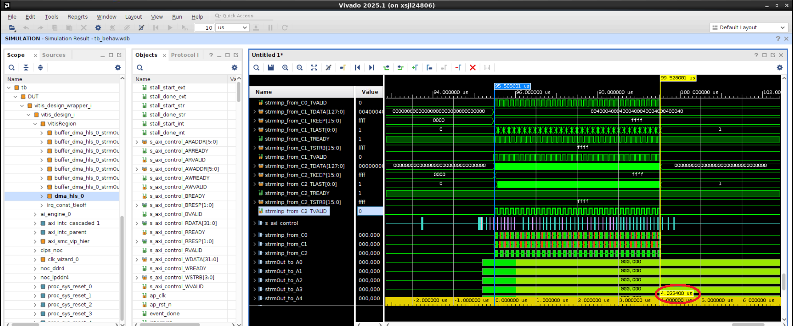

### Running on Hardware

To run the design in hardware, rerun the following `make` steps with `TARGET=hw` and other applicable options (see the preceding `make` steps specified above).

```bash
make kernels xsa package TARGET=hw 
```

These commands create a `$(BUILD_TARGET_DIR)` folder with the kernels, XSA, and `package` for a hardware run.

Run the following step to set up the execution file, generated images, and base images (`$(BUILD_TARGET_DIR)/package/sd_card` and `$(BUILD_TARGET_DIR)/package/sd_card.img`).

```bash
make run_emu TARGET=hw 
```

These commands create a `build/hw` folder with the kernels, XSA, and `package` for a hardware run. Follow steps 1-9 to run the `gemm_aie_xrt.elf` executable on your VCK190 board.

1. Ensure your board is powered off.
2. Use an SD card writer (such as balenaEtcher) to flash the `sd_card.img` file to an SD card.
3. Plug the flashed SD card into the top slot of the VCK190 board.
4. Set the switch (`SW1 Mode\[3:0\]=1110 = OFF OFF OFF ON`).
5. Connect your computer to the VCK190 board using the USB cable included with the board.
6. Open a Tera Term terminal and select the correct COM port. Set the port settings to the following:

      ```bash
      Port: <COMMXX>
      Speed: 115200
      Data: 8 bit
      Parity: none
      Stop Bits: 1 bit
      Flow control: none
      Transmit delay: 0 msec/char 0 msec/line
      ```

7. Power on the board.
8. Wait until you see the `root@versal-rootfs-common-2024.2` Linux command prompt. Press **Enter** a few times to get past any `xinit` errors.
9. Run the following commands in the Tera Term terminal:

      ```bash
      cd /mnt/sd-mmcblk0p1

      ./gemm_aie_xrt.elf a.xclbin
      ```

## Hardware Design Details

### GeMM AI Engine Implementation Architecture and AI Engine/PL Function Partitioning

The following figure shows a high-level block diagram of the design. The test harness consists of the AI Engine and data mover HLS kernels (`dma_hls`). In this setup, there is an AXI4-Stream interface between the data mover kernels and AI Engines, with a data width of 128 bits. The data mover kernels and the AI Engine array interface run at 312.5 MHz.

The data mover is a PL-based data generator and checker. It generates constant matrices as inputs and checks the output of the GeMM core for its output.

#### GeMM Block Diagram for Matrices 32x32x32 to 1024x1024x1024

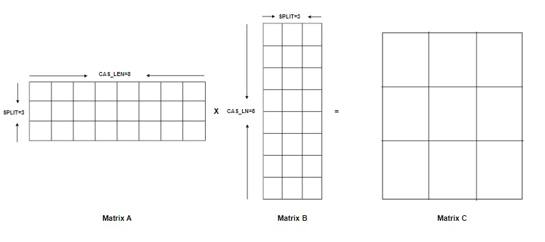

### Design Details

The design in this tutorial starts with a base platform. This platform contains the control interface and processing system (CIPS), NoC, AI Engine, and the interfaces among them. The Vitis compiler linker step builds on top of the base platform. It adds the AI Engine graphs and PL kernels. PL kernels are added to the base platform depending on the application. The specific PL kernels present in each design might vary. An ADF graph connects to an extensible Vitis platform. The graph I/Os connect either to the platform ports or to ports on Vitis kernels. This connection uses Vitis compiler connectivity directives. The Vitis compiler `-l` step adds the components (refer to [make XSA](#make-xsa-using-the-vitis-tools-to-link-ai-engine-and-hls-kernels-with-the-platform)). These include the following:

- `libadf.a`
- Data mover kernel (`dma_hls.[hw|hw_emu].xo`)
- Connection interfaces defined in the system configuration file

For a schematic view of the design with the extended platform as shown in the following figure, open the following in the Vivado IDE:

```bash
`build/gemm_$(MAT_DIMS)/x$(GEMM_INSTS)/[hw|hw_emu]/_x/link/vivado/vpl/prj/prj.xpr`
```

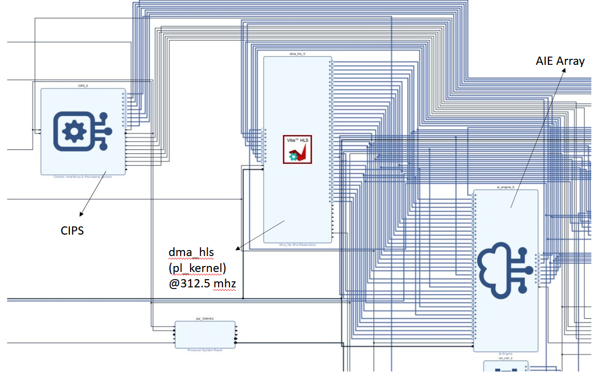

In this design, the GeMM computation happens in multiple stages. The input is split and broadcast to multiple cores. The number of rows in Mat A and the number of columns in Mat B is split into several blocks. This splitting is based on the cascade length. Then each block in Mat A is multiplied with the corresponding block in Mat B. This generates blocks of outputs. These blocks finally propagate to the final output.

The datamover kernel provides the parallel inputs required by the GeMM AIE graph. The data coming out of the AI Engines is streamed to a PL kernel. In this kernel, the data is compared to the expected constant pattern. If there is a mismatch, the system records it in the variable `errCnt`. The host app reads this variable to determine whether the test has passed or failed.

The system debugging and profiling IP (DPA) is added to the PL region of the device. It captures AI Engine runtime trace data if the `EN_TRACE` option is enabled in the design. The `dma_hls` kernel and the AI Engine array interface are both operating at 312.5 MHz.

### AI Engine and PL Kernels

The top-level AI Engine graph, `graph.cpp`, contains two subgraphs: `aiesynth_graph` and `GeMM`. The `aiesynth_graph` performs the block-level GeMM and the `GeMM` graph.

#### dma_hls

The PL-based data mover consists of the `dma_hls` kernel. It generates constant inputs for Mat A and B and checks the output of GeMM graph for the expected constant pattern.

- It internally comprises four loops (`inp_A`, `inp_B`, and `out_C`), with all concurrently scheduled.
- The data width is 128 bits at both the AXI4-stream I/O sides, running at 312.5 MHz.

## Software Design Details

The software design in the AI Engine GeMM tutorial consists of the following sections:

### Methodology

The following figure elaborates on the AI Engine implementation methodology.

#### GeMM Block Diagram Methodology for Matrices 32x32x32 to 1024x1024x1024

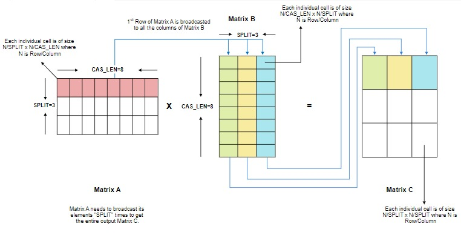

#### AI Engine

##### Independent Cores

The kernels in the AI Engine graph for `aiesynth_graph` must be configured to be independent, with runtime ratios set to >= 0.6 so that each can run independently of the other.

```cpp
...
for(int i = 0; i < 8; i++) {
            adf::runtime<ratio>(sg_0_0_kernels[i]) = 0.9;
         }
...
```

##### Window Streaming Buffer Config

The `graph.h` graph performs GeMM with graph window streaming buffer size as `WINDOW_SIZE`. The buffer size remains fixed to matrix dimension.

```cpp
...
   #define SPLIT 3
   #define CASC_LN 8
   #define N_SAMPLES 1
   
   //defining DIM_A, DIM_B, DIM_AB
   #if GEMM_SIZE == 32
   #define DIM_A 16 
   #define DIM_B 12
   #elif GEMM_SIZE == 64
   #define DIM_A 32 
   #define DIM_B 24
   #elif GEMM_SIZE == 128
   #define DIM_A 44 
   #define DIM_B 44 
   #elif GEMM_SIZE == 256
   #define DIM_A 44 
   #define DIM_B 44 
   #elif GEMM_SIZE == 512
   #define DIM_A 16 
   #define DIM_B 16
   #elif GEMM_SIZE == 1024
   #define DIM_A 16 
   #define DIM_B 16
   #endif
   #define DIM_AB (GEMM_SIZE)
   
   //defining GEMM_SIZE_ZP_A
   #if (GEMM_SIZE % DIM_A) == 0 
       #define GEMM_SIZE_ZP_A GEMM_SIZE
   #else 
       #define GEMM_SIZE_ZP_A (GEMM_SIZE - (GEMM_SIZE % DIM_A) + DIM_A)
   #endif
   
   //defining GEMM_SIZE_ZP_B
   #if (GEMM_SIZE % (DIM_B*SPLIT)) == 0 
       #define GEMM_SIZE_ZP_B GEMM_SIZE
   #else 
       #define GEMM_SIZE_ZP_B ((GEMM_SIZE) - ((GEMM_SIZE) % (DIM_B*SPLIT)) + (DIM_B*SPLIT))
   #endif

   #endif
   
   
   #define WINDOW_SIZE_A (DIM_A * DIM_AB * N_SAMPLES)
   #define WINDOW_SIZE_B (DIM_B * DIM_AB * N_SAMPLES)
...
```

#### Data Mover

##### Data Generation/Checking and Sequencing

The data mover comprises four loops (`inp_A`, `inp_B`, and `out_C`), with all concurrently scheduled.

##### Concurrent Scheduling

Concurrent scheduling is required so that each function runs independently. This ensures the execution of one function does not block the other. The concurrent scheduling of the three functions `inp_A`, `inp_B`, and `out_C` uses `#pragma HLS DATAFLOW`. The following example shows this usage.

```cpp
#pragma HLS DATAFLOW
   
   ap_uint<21> errCnt = 0;
   ap_uint<128> goldenVal_ZP = ap_uint<128> \
   ("0x00000000000000000000000000000000", 16);
   
   #if GEMM_SIZE == 32
      ap_uint<128> goldenVal = ap_uint<128> \
      ("0x00400040004000400040004000400040", 16);
   
   #elif GEMM_SIZE == 64
      ap_uint<128> goldenVal = ap_uint<128> \
      ("0x00800080008000800080008000800080", 16);
   
   #elif GEMM_SIZE == 128
      ap_uint<128> goldenVal = ap_uint<128> \
      ("0x01000100010001000100010001000100", 16);
   
   #elif GEMM_SIZE == 256
      ap_uint<128> goldenVal = ap_uint<128> \
      ("0x02000200020002000200020002000200", 16);
   
   #elif GEMM_SIZE == 512
      ap_uint<128> goldenVal = ap_uint<128> \
      ("0x04000400040004000400040004000400", 16);
   
   #elif GEMM_SIZE == 1024
      ap_uint<128> goldenVal = ap_uint<128> \
      ("0x08000800080008000800080008000800", 16);
   
   #endif


   inp_A(strmOut_to_A0, strmOut_to_A1, strmOut_to_A2, strmOut_to_A3, strmOut_to_A4, strmOut_to_A5, strmOut_to_A6, strmOut_to_A7,
         matSz_A);
   
   inp_B(strmOut_to_B0, strmOut_to_B1, strmOut_to_B2, strmOut_to_B3,
         strmOut_to_B4, strmOut_to_B5, strmOut_to_B6, strmOut_to_B7,
         strmOut_to_B8, strmOut_to_B9, strmOut_to_B10, strmOut_to_B11,
         strmOut_to_B12, strmOut_to_B13, strmOut_to_B14, strmOut_to_B15,
         strmOut_to_B16, strmOut_to_B17, strmOut_to_B18, strmOut_to_B19,
         strmOut_to_B20, strmOut_to_B21, strmOut_to_B22, strmOut_to_B23,
         matSz_B);
   
   out_C(strmInp_from_C0, strmInp_from_C1, strmInp_from_C2, matSz_C, errCnt, goldenVal, goldenVal_ZP);
   }
```

##### Vitis HLS Scheduling and Dataflow View

The following figure shows the data mover scheduler view.

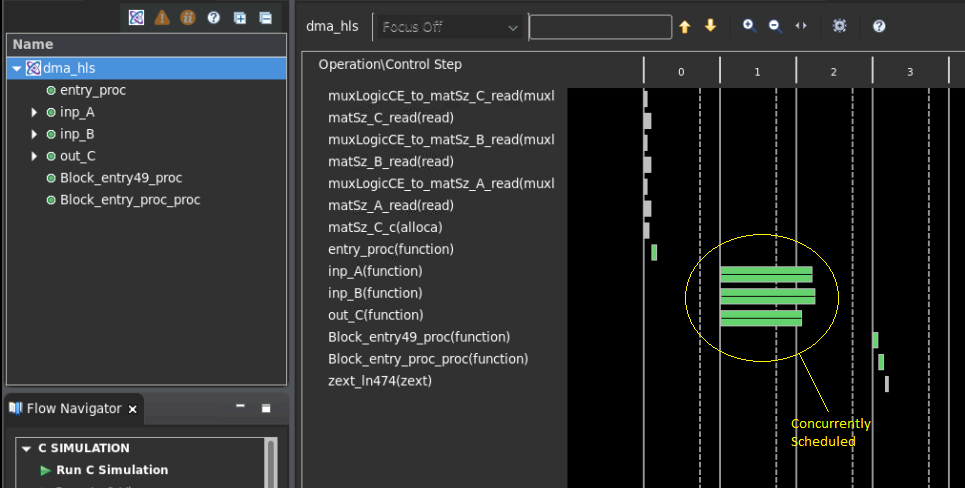

The following figure shows the data mover dataflow view.

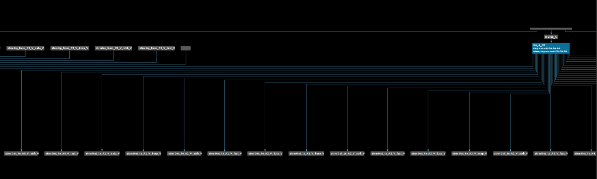

The following figure shows the data mover functional call graph view.

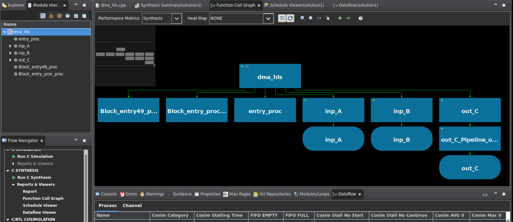

#### Streaming Interface Data Width

The streaming interface data is 128 bits wide to reduce read/write overhead while processing data.

### AI Engine Kernels and Graph Representation

An AI Engine kernel is a C/C++ program written using specialized intrinsic calls that target the VLIW vector processor. The AI Engine compiler compiles the kernel code to produce an executable ELF file for each of the AI Engines being used in the design. Review the [AI Engine Kernel Programming](https://docs.amd.com/r/en-US/ug1079-ai-engine-kernel-coding) section in the AI Engine documentation for a high-level overview of kernel programming. You can stitch these kernels together to function as AI Engine graphs written in C++. In this design, the AI Engine compiler writes a summary of compilation results. You can view the graph by running the following command:

`vitis_analyzer $(BUILD_TARGET_DIR)/Work/graph.aiecompile_summary`

The following figures show the graph representation of the AI Engine kernels (default gemm_32x32x32). It shows the compute units.

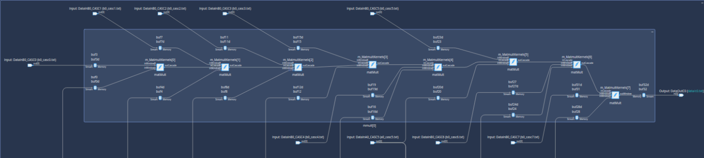

### Adaptive Data Flow (ADF) Graph

This section describes the overall data flow graph specification of the GeMM design using AI Engines. The AI Engine compiler compiles this graph.

The `graph.cpp` file contains the overall graph definition of the design. The top-level graph contains two sub-graphs, `aiesynth_graph` and `GeMM`. The following describes the definition of the sub-graphs.

#### Defining the Graph Class

Define the graph classes by using the objects defined in the appropriate namespace. It must include the ADF library and [Vitis DSP Library](https://docs.amd.com/r/en-US/Vitis_Libraries/dsp/user_guide/L2/dsp-lib-func.html#matrix-multiply) for GeMM. A general specification is put in for the ADF namespace:

```cpp
   class GeMM: public adf::graph
   {
      public:
         input_plio matA_inp[CASC_LN];
         input_plio matB_inp[(SPLIT * CASC_LN)];
         output_plio matC_out[SPLIT];
         
         GeMM() {
            // GeMM Graph Declarations...
            xf::dsp::aie::blas::matrix_mult::matrix_mult_graph<int16, int16, DIM_A, DIM_AB, DIM_B, 0, 0, \
               ROW_MAJOR, ROW_MAJOR, ROW_MAJOR, 0, 0, 0, WINDOW_SIZE_A, WINDOW_SIZE_B, CASC_LN> mmult[SPLIT];
            
            // Mat A PLIO node names...
            for(int j = 0; j < CASC_LN; ++j) {
               std::string matA_plioOut_str = "DataInA" + std::to_string(0) + "_CASC" + std::to_string(j);
               const char *matA_plioOut = matA_plioOut_str.c_str();
               
               std::string matA_Out_file_str = "a" + std::to_string(0) + "_casc" + std::to_string(j) + ".txt";
               const char *matA_Out_file = matA_Out_file_str.c_str();
               
               matA_inp[j] = input_plio::create(matA_plioOut, plio_128_bits, matA_Out_file);
            }
            
            for(int i = 0; i < SPLIT; ++i) {
               // CASC_LN No. of kernels will be created...
               adf::kernel *mmult_kernels = mmult[i].getKernels();
               
               for(int j = 0; j < CASC_LN; ++j) {
                  // Mat B PLIO node names...
                  std::string matB_plioOut_str = "DataInB" + std::to_string(i) + "_CASC" + std::to_string(j);
                  const char *matB_plioOut = matB_plioOut_str.c_str();
                  
                  std::string matB_Out_file_str = "b" + std::to_string(i) + "_casc" + std::to_string(j) + ".txt";
                  const char *matB_Out_file = matB_Out_file_str.c_str();
                  
                  matB_inp[(i * CASC_LN) + j] = input_plio::create(matB_plioOut, plio_128_bits, matB_Out_file);
               } 
               
               // Mat C PLIO node names...
               std::string matC_plioOut_str = "DataOutC" + std::to_string(i);
               const char *matC_plioOut = matC_plioOut_str.c_str();
               
               std::string matC_Out_file_str = "data/c" + std::to_string(i) + ".txt";
               const char *matC_Out_file = matC_Out_file_str.c_str();
               
               // Creating PLIO nodes...
               matC_out[i] = output_plio::create(matC_plioOut, plio_128_bits, matC_Out_file);
               
               // Connecting PLIO Nodes...
               for(int k = 0; k < CASC_LN; ++k) {
                  // Setting runtime ratio...
                  adf::runtime<ratio>(mmult_kernels[k]) = 0.8;
                  
                  // Connecting port IO nodes...
                  adf::connect<>(matA_inp[k].out[0], mmult[i].inA[k]);
                  adf::connect<>(matB_inp[(i * CASC_LN) + k].out[0], mmult[i].inB[k]);
               }
               
               // Connecting port IO nodes...
               adf::connect<>(mmult[i].out[0], matC_out[i].in[0]);
            }
            location<graph>(*this) = area_group({{aie_tile, 14, 0, 13+CASC_LN, SPLIT}});
         }
   };
```

#### Top-Level Application

Define a top-level application file (`graph.cpp` in this design) that contains an instance of the graph class:

```cpp
#include "graph.h"

int base_col = 0, base_row = 0, matrixCtr = 0;

GeMM g;

#ifdef __AIESIM__

   int main(void)
   {
      g.init();
      g.run(GRAPH_ITER_CNT);
      g.end();
   
      return 0;
   }

#endif
```

### PL Data Mover Kernel

Besides the kernels operating in the AI Engine array, this design also specifies a data mover kernel to run in the PL region of the device. This is written in HLS C++. The Vitis kernel compilation brings the data mover kernel into the design. The following sections describe the software design of the data mover kernel.

#### dma_hls (dma_hls.cpp)

The `dma_hls` kernel writes and reads data to AXI4-Stream interfaces.

##### Top Function Declaration

The `dma_hls` kernel takes the following arguments. These arguments are declared in `dma_hls.h`:

```cpp
int dma_hls(
   hls::stream<ap_axiu<128, 0, 0, 0>> &strmOut_to_A0,
   hls::stream<ap_axiu<128, 0, 0, 0>> &strmOut_to_A1,
   hls::stream<ap_axiu<128, 0, 0, 0>> &strmOut_to_A2,
   hls::stream<ap_axiu<128, 0, 0, 0>> &strmOut_to_A3,
   hls::stream<ap_axiu<128, 0, 0, 0>> &strmOut_to_A4,
   hls::stream<ap_axiu<128, 0, 0, 0>> &strmOut_to_A5,
   hls::stream<ap_axiu<128, 0, 0, 0>> &strmOut_to_A6,
   hls::stream<ap_axiu<128, 0, 0, 0>> &strmOut_to_A7,
   hls::stream<ap_axiu<128, 0, 0, 0>> &strmOut_to_B0,
   hls::stream<ap_axiu<128, 0, 0, 0>> &strmOut_to_B1,
   hls::stream<ap_axiu<128, 0, 0, 0>> &strmOut_to_B2,
   hls::stream<ap_axiu<128, 0, 0, 0>> &strmOut_to_B3,
   hls::stream<ap_axiu<128, 0, 0, 0>> &strmOut_to_B4,
   hls::stream<ap_axiu<128, 0, 0, 0>> &strmOut_to_B5,
   hls::stream<ap_axiu<128, 0, 0, 0>> &strmOut_to_B6,
   hls::stream<ap_axiu<128, 0, 0, 0>> &strmOut_to_B7,
   hls::stream<ap_axiu<128, 0, 0, 0>> &strmOut_to_B8,
   hls::stream<ap_axiu<128, 0, 0, 0>> &strmOut_to_B9,
   hls::stream<ap_axiu<128, 0, 0, 0>> &strmOut_to_B10,
   hls::stream<ap_axiu<128, 0, 0, 0>> &strmOut_to_B11,
   hls::stream<ap_axiu<128, 0, 0, 0>> &strmOut_to_B12,
   hls::stream<ap_axiu<128, 0, 0, 0>> &strmOut_to_B13,
   hls::stream<ap_axiu<128, 0, 0, 0>> &strmOut_to_B14,
   hls::stream<ap_axiu<128, 0, 0, 0>> &strmOut_to_B15,
   hls::stream<ap_axiu<128, 0, 0, 0>> &strmOut_to_B16,
   hls::stream<ap_axiu<128, 0, 0, 0>> &strmOut_to_B17,
   hls::stream<ap_axiu<128, 0, 0, 0>> &strmOut_to_B18,
   hls::stream<ap_axiu<128, 0, 0, 0>> &strmOut_to_B19,
   hls::stream<ap_axiu<128, 0, 0, 0>> &strmOut_to_B20,
   hls::stream<ap_axiu<128, 0, 0, 0>> &strmOut_to_B21,
   hls::stream<ap_axiu<128, 0, 0, 0>> &strmOut_to_B22,
   hls::stream<ap_axiu<128, 0, 0, 0>> &strmOut_to_B23,
   hls::stream<ap_axiu<128, 0, 0, 0>> &strmInp_from_C0,
   hls::stream<ap_axiu<128, 0, 0, 0>> &strmInp_from_C1,
   hls::stream<ap_axiu<128, 0, 0, 0>> &strmInp_from_C2,
   ap_int<32> matSz_A, ap_int<32> matSz_B, ap_int<32> matSz_C
   );
```

- `ap_int<N>` is an arbitrary precision integer data type defined in `ap_int.h` where `N` is a bit size from 1-1024. In this design, the bit size is 128.
- `hls::stream<ap_axiu<D,0,0,0>>` is a data type defined in `ap_axi_sdata.h`. It is a special data class used for data transfer when using a streaming platform. The parameter `<D>` is the data width of the streaming interface. This is set to 128. The remaining three parameters are set to 0.

##### Top Function Definition

Use the `dataflow` pragma for concurrently scheduling the three functions `inp_A`, `inp_B`, and `out_C`.

```cpp
int dma_hls(
   hls::stream<ap_axiu<128, 0, 0, 0>> &strmOut_to_A0,
   hls::stream<ap_axiu<128, 0, 0, 0>> &strmOut_to_A1,
   hls::stream<ap_axiu<128, 0, 0, 0>> &strmOut_to_A2,
   hls::stream<ap_axiu<128, 0, 0, 0>> &strmOut_to_A3,
   hls::stream<ap_axiu<128, 0, 0, 0>> &strmOut_to_A4,
   hls::stream<ap_axiu<128, 0, 0, 0>> &strmOut_to_A5,
   hls::stream<ap_axiu<128, 0, 0, 0>> &strmOut_to_A6,
   hls::stream<ap_axiu<128, 0, 0, 0>> &strmOut_to_A7,
   hls::stream<ap_axiu<128, 0, 0, 0>> &strmOut_to_B0,
   hls::stream<ap_axiu<128, 0, 0, 0>> &strmOut_to_B1,
   hls::stream<ap_axiu<128, 0, 0, 0>> &strmOut_to_B2,
   hls::stream<ap_axiu<128, 0, 0, 0>> &strmOut_to_B3,
   hls::stream<ap_axiu<128, 0, 0, 0>> &strmOut_to_B4,
   hls::stream<ap_axiu<128, 0, 0, 0>> &strmOut_to_B5,
   hls::stream<ap_axiu<128, 0, 0, 0>> &strmOut_to_B6,
   hls::stream<ap_axiu<128, 0, 0, 0>> &strmOut_to_B7,
   hls::stream<ap_axiu<128, 0, 0, 0>> &strmOut_to_B8,
   hls::stream<ap_axiu<128, 0, 0, 0>> &strmOut_to_B9,
   hls::stream<ap_axiu<128, 0, 0, 0>> &strmOut_to_B10,
   hls::stream<ap_axiu<128, 0, 0, 0>> &strmOut_to_B11,
   hls::stream<ap_axiu<128, 0, 0, 0>> &strmOut_to_B12,
   hls::stream<ap_axiu<128, 0, 0, 0>> &strmOut_to_B13,
   hls::stream<ap_axiu<128, 0, 0, 0>> &strmOut_to_B14,
   hls::stream<ap_axiu<128, 0, 0, 0>> &strmOut_to_B15,
   hls::stream<ap_axiu<128, 0, 0, 0>> &strmOut_to_B16,
   hls::stream<ap_axiu<128, 0, 0, 0>> &strmOut_to_B17,
   hls::stream<ap_axiu<128, 0, 0, 0>> &strmOut_to_B18,
   hls::stream<ap_axiu<128, 0, 0, 0>> &strmOut_to_B19,
   hls::stream<ap_axiu<128, 0, 0, 0>> &strmOut_to_B20,
   hls::stream<ap_axiu<128, 0, 0, 0>> &strmOut_to_B21,
   hls::stream<ap_axiu<128, 0, 0, 0>> &strmOut_to_B22,
   hls::stream<ap_axiu<128, 0, 0, 0>> &strmOut_to_B23,
   hls::stream<ap_axiu<128, 0, 0, 0>> &strmInp_from_C0,
   hls::stream<ap_axiu<128, 0, 0, 0>> &strmInp_from_C1,
   hls::stream<ap_axiu<128, 0, 0, 0>> &strmInp_from_C2,
   ap_int<32> matSz_A, ap_int<32> matSz_B, ap_int<32> matSz_C
   )
{
   #pragma HLS INTERFACE axis port=strmOut_to_A0
   #pragma HLS INTERFACE axis port=strmOut_to_A1
   #pragma HLS INTERFACE axis port=strmOut_to_A2
   #pragma HLS INTERFACE axis port=strmOut_to_A3
   #pragma HLS INTERFACE axis port=strmOut_to_A4
   #pragma HLS INTERFACE axis port=strmOut_to_A5
   #pragma HLS INTERFACE axis port=strmOut_to_A6
   #pragma HLS INTERFACE axis port=strmOut_to_A7
   #pragma HLS INTERFACE axis port=strmOut_to_B0  
   #pragma HLS INTERFACE axis port=strmOut_to_B1
   #pragma HLS INTERFACE axis port=strmOut_to_B2
   #pragma HLS INTERFACE axis port=strmOut_to_B3
   #pragma HLS INTERFACE axis port=strmOut_to_B4  
   #pragma HLS INTERFACE axis port=strmOut_to_B5
   #pragma HLS INTERFACE axis port=strmOut_to_B6
   #pragma HLS INTERFACE axis port=strmOut_to_B7
   #pragma HLS INTERFACE axis port=strmOut_to_B8  
   #pragma HLS INTERFACE axis port=strmOut_to_B9
   #pragma HLS INTERFACE axis port=strmOut_to_B10
   #pragma HLS INTERFACE axis port=strmOut_to_B11
   #pragma HLS INTERFACE axis port=strmOut_to_B12 
   #pragma HLS INTERFACE axis port=strmOut_to_B13
   #pragma HLS INTERFACE axis port=strmOut_to_B14
   #pragma HLS INTERFACE axis port=strmOut_to_B15
   #pragma HLS INTERFACE axis port=strmOut_to_B16
   #pragma HLS INTERFACE axis port=strmOut_to_B17
   #pragma HLS INTERFACE axis port=strmOut_to_B18
   #pragma HLS INTERFACE axis port=strmOut_to_B19
   #pragma HLS INTERFACE axis port=strmOut_to_B20
   #pragma HLS INTERFACE axis port=strmOut_to_B21
   #pragma HLS INTERFACE axis port=strmOut_to_B22
   #pragma HLS INTERFACE axis port=strmOut_to_B23
   #pragma HLS INTERFACE axis port=strmInp_from_C0 
   #pragma HLS INTERFACE axis port=strmInp_from_C1
   #pragma HLS INTERFACE axis port=strmInp_from_C2
   
   #pragma HLS INTERFACE s_axilite port=matSz_A bundle=control
   #pragma HLS INTERFACE s_axilite port=matSz_B bundle=control
   #pragma HLS INTERFACE s_axilite port=matSz_C bundle=control
   //#pragma HLS INTERFACE s_axilite port=iterCnt bundle=control
   #pragma HLS INTERFACE s_axilite port=return bundle=control  
   
   #pragma HLS DATAFLOW
   
   ap_uint<21> errCnt = 0;
      ap_uint<128> goldenVal_ZP = ap_uint<128> \
      ("0x00000000000000000000000000000000", 16);
   
   #if GEMM_SIZE == 32
      ap_uint<128> goldenVal = ap_uint<128> \
      ("0x00400040004000400040004000400040", 16);
   
   #elif GEMM_SIZE == 64
      ap_uint<128> goldenVal = ap_uint<128> \
      ("0x00800080008000800080008000800080", 16);
   
   #elif GEMM_SIZE == 128
      ap_uint<128> goldenVal = ap_uint<128> \
      ("0x01000100010001000100010001000100", 16);
   
   #elif GEMM_SIZE == 256
      ap_uint<128> goldenVal = ap_uint<128> \
      ("0x02000200020002000200020002000200", 16);
   
   #elif GEMM_SIZE == 512
      ap_uint<128> goldenVal = ap_uint<128> \
      ("0x04000400040004000400040004000400", 16);
   
   #elif GEMM_SIZE == 1024
      ap_uint<128> goldenVal = ap_uint<128> \
      ("0x08000800080008000800080008000800", 16);
   
   #endif
   
   inp_A(strmOut_to_A0, strmOut_to_A1, strmOut_to_A2, strmOut_to_A3, strmOut_to_A4, strmOut_to_A5, strmOut_to_A6, strmOut_to_A7,
         matSz_A);
   
   inp_B(strmOut_to_B0, strmOut_to_B1, strmOut_to_B2, strmOut_to_B3,
         strmOut_to_B4, strmOut_to_B5, strmOut_to_B6, strmOut_to_B7,
         strmOut_to_B8, strmOut_to_B9, strmOut_to_B10, strmOut_to_B11,
         strmOut_to_B12, strmOut_to_B13, strmOut_to_B14, strmOut_to_B15,
         strmOut_to_B16, strmOut_to_B17, strmOut_to_B18, strmOut_to_B19,
         strmOut_to_B20, strmOut_to_B21, strmOut_to_B22, strmOut_to_B23,
         matSz_B);
   
   out_C(strmInp_from_C0, strmInp_from_C1, strmInp_from_C2, matSz_C, errCnt, goldenVal, goldenVal_ZP);
   
   return errCnt;
}
```

The `dma_hls` kernel also specifies HLS pragmas to help optimize the kernel code and adhere to interface protocols. Refer to [this page](https://docs.amd.com/r/en-US/ug1399-vitis-hls/HLS-Pragmas) for detailed documentation of all HLS pragmas. The following table provides a summary of the HLS pragmas used in the kernel.

|Switch|Description|
|---|---|
|#pragma HLS INTERFACE|In C/C++ code, all input and output operations happen in zero time through formal function arguments. In a RTL design, these same input and output operations must happen through a port in the design interface. These operations typically use a specific input/output (I/O) protocol. For more information, refer to [this page](https://docs.amd.com/r/en-US/ug1399-vitis-hls/pragma-HLS-interface).|
|#pragma HLS PIPELINE II=1|Reduces the initiation interval (II) for a function or loop by allowing the concurrent execution of operations. The `config_compile -pipeline_style` command defines the default type of pipeline. However, the PIPELINE pragma or directive can override it. For more information, refer to [this page](https://docs.amd.com/r/en-US/ug1399-vitis-hls/pragma-HLS-pipeline).|
|#pragma HLS dataflow|The DATAFLOW pragma enables task-level pipelining. It allows functions and loops to overlap in their operation. This increases the concurrency of the RTL implementation and increases the overall throughput of the design. Refer to [this page](https://docs.amd.com/r/en-US/ug1399-vitis-hls/pragma-HLS-dataflow) for more information.|
|#pragma HLS loop_tripcount|When manually applied to a loop, specifies the total number of iterations performed by a loop. The `LOOP_TRIPCOUNT` pragma or directive applies to analysis only. It does not impact the results of synthesis. Refer to [this page](https://docs.amd.com/r/en-US/ug1399-vitis-hls/pragma-HLS-loop_tripcount) for more information.|

### PS Host Application

The GeMM AI Engine tutorial uses the embedded processing system (PS) as an external controller. It controls the AI Engine graph and data mover PL kernels. Review the [Programming the PS Host Application](https://docs.amd.com/r/en-US/ug1076-ai-engine-environment/Programming-the-PS-Host-Application) section in the AI Engine documentation. This documentation helps you understand the process to create a host application.

You must also compile the AI Engine control code. The AI Engine compiler generates this control code (`aie_control_xrt.cpp`). It generates the code when compiling the AI Engine design graph and kernel code. The PS host application uses the AI Engine control code for the following purposes:

- Controlling the initial loading of the AI Engine kernels
- Running the graph for several iterations, updating the runtime parameters associated with the graph, exiting, and resetting the AI Engine tiles

The steps to run the A72 application are as follows:

1. Include `graph.cpp` and other required headers. Define the required macros. The `graph.cpp` AI Engine application file contains the instantiation of the AI Engine GeMM data flow graph object.

   ```cpp
   #include <stdint.h>
   #include <fstream>
   #include <iostream>
   #include <string>
   #include <cstring>

   #include "adf/adf_api/XRTConfig.h"

   #include "experimental/xrt_aie.h"
   #include "experimental/xrt_kernel.h"
   #include "experimental/xrt_bo.h"

   #define OPTIMIZED_OVERLAY 1

   #if OPTIMIZED_OVERLAY

   // HLS Datamover Loops and Graph run Infinitely...
   #if ITER_CNT == -1
      #define MATA_SZ -1 
      #define MATB_SZ -1
      #define MATC_SZ -1

   #else
      #define MATA_SZ (((GEMM_SIZE_ZP_A) * GEMM_SIZE / CASC_LN) / 8) * ITER_CNT * ((GEMM_SIZE_ZP_B/SPLIT) / DIM_B)
      #define MATB_SZ (((GEMM_SIZE * GEMM_SIZE_ZP_B ) / (CASC_LN*SPLIT) ) / 8) * ITER_CNT * (GEMM_SIZE_ZP_A / DIM_A) 
      #define MATC_SZ (((GEMM_SIZE_ZP_A * GEMM_SIZE_ZP_B ) / SPLIT ) / 8) * ITER_CNT
   #endif

   #endif

   ```

2. Check the command line argument. The beginning of the A72 application is represented by the `main` function. It takes in one command line argument: an XCLBIN file.

   ```cpp
   int main(int argc, char** argv)
   ```

3. Open the XCLBIN and create data mover kernel handles. The A72 application loads the XCLBIN binary file. Then it creates the data mover kernels to execute on the device. The steps are:

   i. Open the device and load the XCLBIN:

      ```cpp
      auto dhdl = xrtDeviceOpen(0);
      auto xclbin = load_xclbin(dhdl, xclbinFilename);
      auto top = reinterpret_cast<const axlf*>(xclbin.data());
      ```

   ii. Open the data mover kernel and obtain handles to start the HLS PL kernels (see the following example for the `dma_hls` PL kernel):

      ```cpp
      xrtKernelHandle dma_hls_khdl;
      xrtRunHandle dma_hls_rhdl;

      // Open kernel handle exclusively to read the ap_return register later for reporting error...
      dma_hls_khdl = xrtPLKernelOpenExclusive(dhdl, top->m_header.uuid, dma_hls_obj);
      dma_hls_rhdl = xrtRunOpen(dma_hls_khdl);
      ```

4. Open the graph, obtain the handle, and execute the graph:

   - The A72 processor opens and obtains its handle using the `xrtGraphOpen` function.
   - The A72 processor resets the graph using the `xrtGraphReset` function and runs the graph execution using the `xrtGraphRun` function.

5. Execute the data mover kernels and generate the output results:

   - Set the `dma_hls` kernel arguments using the `xrtRunSetArg` function.
   - Start the `dma_hls` kernels using the `xrtRunStart` function.
   - Wait for `dma_hls` execution to finish using the `xrtRunWait` function.

6. Verify the output results by reading the `ap_return` in `$(BUILD_TARGET_DIR)/_x/dma_hls.$(TARGET)/dma_hls/dma_hls/ip/drivers/dma_hls_v1_0/src/xdma_hls_hw.h` using the `xrtKernelRegister` API, as shown in the following snippet:

   ```cpp
   void golden_check(uint32_t *errCnt, char insts)
      {
         //////////////////////////////////////////
         // Compare results
         //////////////////////////////////////////

         // Reading the error count for the ap_return reg of the hls kernel...
         xrtKernelReadRegister(dma_hls_khdl, 0x10, &instance_errCnt);
         
         //std::cout << "gemm_" << insts << std::endl;
         printf("gemm_%d ", insts);
         std::cout << (instance_errCnt ? "Failed! " : "Passed! ") << "With error count " << instance_errCnt << ".\n" << std::endl;

         // Adding instance error to the total error count...
         *errCnt += instance_errCnt;
      }
   ```

7. Release allocated resources. After post-processing the data, release the allocated objects and handles using the `xrtRunClose`, `xrtKernelClose`, `xrtGraphClose`, and `xrtDeviceClose` functions.

## Performance Details

For all applications, designers must work to predefined specifications. They build a system for their specific deployment by meeting system requirements. These requirements include available resources, latency, throughput, performance, and power. This section outlines how to measure those characteristics for the AI Engine implementation in this tutorial.

### Resource Utilization and Power

Resource utilization and power are measured using Vivado Design Suite, vcdanalyze, and Xilinx Power Estimator (XPE) for Versal (2024.2 version) tools.

Use the following steps to find the registers and CLB LUT utilization information in the Vivado project:

1. Open the Vivado project: ``$(BUILD_TARGET_DIR)/_x/link/vivado/vpl/prj/prj.xpr``.

2. Go to **Open Implemented Design**, then click **Report Utilization**. In the Utilization tab shown in the following figure, select **ai_engine_0** and view the **Registers** and **CLB LUTs** for gemm_32x32x32:

   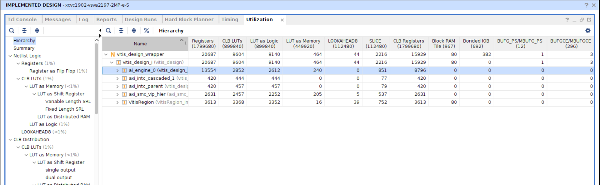

or,

Do `make report_metrics TARGET=hw`, (recipe expanded below), alongwith relevant options, to generate `utilization_hierarchical.txt` under `$(BLD_REPORTS_DIR)/` directory:

   ```cpp
   ...
   VIVADO_METRICS_SCRIPTS_REPO := $(DESIGN_REPO)/vivado_metrics_scripts
   ...
   REPORTS_REPO := $(PROJECT_REPO)/reports_dir
   BLD_REPORTS_DIR := $(REPORTS_REPO)/gemm_$(MAT_DIMS)/x$(GEMM_INSTS)
   ...
   report_metrics: xsa $(BLD_REPORTS_DIR)

   ifeq ($(TARGET),hw_emu)
      @echo "This build target (report-metrics) not valid when design target is hw_emu"

   else
      rm -rf $(BLD_REPORTS_DIR)
      mkdir -p $(BLD_REPORTS_DIR)
      cd $(BLD_REPORTS_DIR); \
      vivado -mode batch -source $(VIVADO_METRICS_SCRIPTS_REPO)/report_metrics.tcl $(BUILD_TARGET_DIR)/_x/link/vivado/vpl/prj/prj.xpr

   endif
   ...
   ```

The vcdanalyze tool generates a `graph.xpe` file. You can input this file to XPE for viewing the AI Engine resource utilization and power. The steps are as follows:

1. Run `make vcd` (recipe expanded below) to create the `graph.xpe` file under `$(BUILD_TARGET_DIR)/aiesim_xpe/`:

   ```cpp
   vcd: graph create_ioFiles $(XPE_FILE)

   $(XPE_FILE): $(BLD_TGT_VCD_FILE)
      cd $(BUILD_TARGET_DIR); \
      vcdanalyze --vcd $(VCD_FILE_NAME).vcd --xpe


   $(BLD_TGT_VCD_FILE): $(AIE_SRC_REPO)/aiesim_data/*
      cd $(BUILD_TARGET_DIR); \
      aiesimulator $(AIE_SIM_FLAGS) --profile --dump-vcd $(VCD_FILE_NAME) 2>&1 | tee -a vcd.log
   ```

2. Load the `graph.xpe` into PDM to see the AI Engine power comsumption and resource utilization for the gemm_32x32x32 design:

   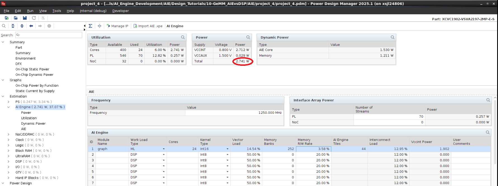

A summary of resource utilization and power for all variations is given in the following table.

| GeMM Configuration | Number of Compute Cores | Vector Load | Number of Active Memory Banks | Mem R/W Rate | Active AI Engine Tiles | Interconnect Load | FF (Regs) | CLB LUTS  | Dynamic Power<br/>(in mW) |
|:------------------:|:-----------------------:|:-----------:|:-----------------------------:|:------------:|:----------------------:|:-----------------:|:---------:|:---------:|:-------------------------:|
|        32x32x32    |         24              |   14.54%    |         231                   |     3.575%   |           44           |         12.87%    |  13633    |   2934    |          2741             |
|        64x64x64    |         24              |   35.53%    |         252                   |     6.345%   |           43           |         13.10%    |  13579    |   2881    |          3401             |
|     128x128x128    |         24              |   36.62%    |         231                   |     8.910%   |           43           |         13.10%    |  13507    |   3006    |          3563             |
|     256x256x256    |         24              |   61.82%    |         231                   |     14.725%  |           43           |         13.10%    |  13576    |   2880    |          4432             |
|     512x512x512    |         24              |   71.42%    |         252                   |     12.125%  |           43           |         13.41%    |  13507    |   3006    |          4524             |
|  1024x1024x1024    |         24              |   82.96%    |         252                   |     13.980%  |           43           |         12.57%    |  13540    |   2834    |          4876             |

#### Throughput and Latency

Throughput is measured in mega-samples transferred per second (MSPS). Latency defines the time between the first sample being sent by the data mover into the GeMM kernel and the first sample from the same being received by the data mover. You can measure both by viewing the runtime generated trace texts using Vitis analyzer or viewing the waveform viewer in the hw emulation. The following steps measure throughput and latency via runtime generated trace texts:

1. Compile the design using `EN_TRACE=1`. It automatically includes a `xrt.ini` file while packaging, which comprises the following:

   ```cpp
   [Debug]
   xrt_trace=true
   data_transfer_trace=fine
   trace_buffer_size=8M
   ```

   Refer to the [xrt.ini](https://docs.amd.com/r/en-US/ug1702-vitis-accelerated-reference/xrt.ini-File) documentation for more information.

2. After execution on the board, transfer the generated `device_trace_0.csv`, `hal_host_trace.csv`, and `xrt.run_summary` files back to your system.

3. Open `xrt.run_summary` using `vitis_analyzer`: `vitis_analyzer xrt.run_summary`.

4. The snapshot of the timeline trace for the AI Engine run with `ITER_CNT=1` is shown in the following figure:

   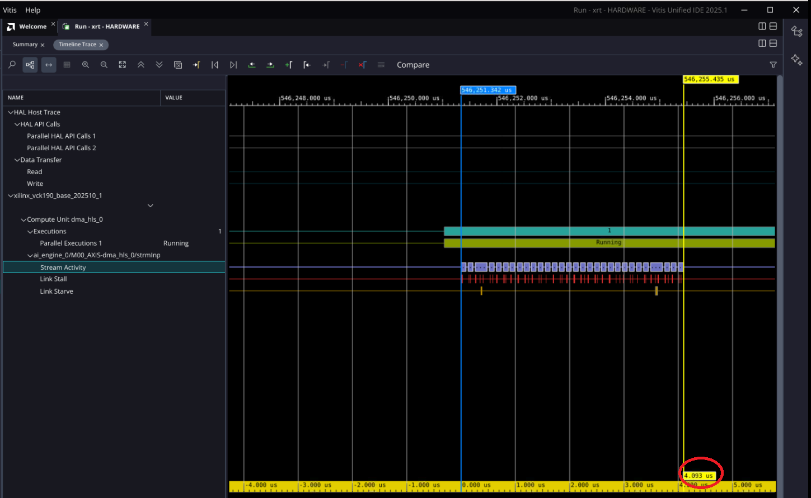

   The time reported by trace is with the dma_hls kernel running at 312.50 MHz.

   ```text
   Processing Time = (Start of Processing Timestamp of Stream output C) - (End of Processing Timestamp of Stream output C)

   Processing Time (with 312.50 MHz)    =  4.093 us

   Latency = (Start of  processing of Stream input A & B )- (Start of  processing Timestamp of Stream output C)

   Throughput = (Samples transferred) / processing time
            = ( (ROWS x COLS) x Iterations ) / processing time
            = (32 x 32) x 16 / 4.093us
            = 4002.9319 MSamples/s
            = 4002.9319 x 2 MB/s (As each sample is int16 = 2 bytes)
            = 8005.8636 MB/s
   ```

5. The profiling setup in the Makefile measures the execution time and all the interfaces.

   The following shows the throughput and latency calculations for the GeMM 32x32x32 design based on the `hw_emu` run along with the snapshot of the timeline trace of hw emulation:

   

   ```text
   Processing Time = (Start of Processing Timestamp of Stream output C) - (End of Processing Timestamp of Stream output C)
                  = 4.022 us

   Latency:
      = Difference between beginning of sending of input A & B  and receiving of output C
      = (Start of  processing of Stream input A & B -
      (Start of  processing Timestamp of Stream output C
      = 0.304us

   Throughput = (Samples transferred) / processing time
            = ( (ROWS x COLS) x Iterations ) / processing time
            = (32 x 32) x 16 / 4.022 us
            = 4073.5952 MSamples/s
            = 4073.5952 x 2 MB/s (As each sample is int16 = 2 bytes)
            = 8147.1904 MB/s
   ```

The following table shows a summary of throughput and latency for all variations.

| GeMM Configuration | Data Transfer Size | Latency<br/>(in μs) | Throughput<br/>(in MSPS)  | TOPs   | Matrices/s<br/>(in 10^6/s)|
|:------------------:|:------------------:|:-------------------:|:-------------------------:|:------:|:-------------------------:|
|        32x32x32    |         1024       |        0.304        |           4076.636        | 0.260  |         3.9781            |
|        64x64x64    |         4096       |        0.633        |           5680.999        | 0.727  |         1.3874            |
|     128x128x128    |        16384       |        2.371        |           2920.499        | 0.747  |         0.1782            |
|     256x256x256    |        65536       |        3.180        |           2290.347        | 1.172  |         0.0349            |
|     512x512x512    |       262144       |        1.782        |           1298.522        | 1.369  |         0.0049            |
|  1024x1024x1024    |      1048576       |        3.331        |           757.482         | 1.551  |         0.0007            |

>**Note**: Tabulated based on hw_emu.

#### TOPs per Watt

TOPs per Watt is represented as TOPs/Power in Watts. The following example shows the calculation for the gemm 32x32x32 design:

```text
TOPs per Watt = TOPs / Power(Watt)
              = (0.2854 / 2.792) MSPS/Watt
              = 0.102233 TOPs/Watt
```

The following table shows a summary of TOPs per Watt for all variations.

| GeMM Configuration | TOPs per Watt |
|:------------------:|:-------------:|
|        32x32x32    |     0.1022    |
|        64x64x64    |     0.2229    |
|     128x128x128    |     0.2139    |
|     256x256x256    |     0.2692    |
|     512x512x512    |     0.3034    |
|  1024x1024x1024    |     0.3208    |

#### Consolidated Summary

The following table shows a consolidated summary of observations for all the point sizes and all the corresponding instance variations.

| GeMM Configuration | Perf<br/>(in MSPS) | Latency<br/>(in μs) | TOPs  | No. of Compute Cores | Vector Load | No. of Active Mem Banks | Mem R/W Rate | Active AIE Tiles | Dynamic Power<br/>(in mW) | TOPs per Watt |
|:------------------:|:------------------:|:-------------------:|:-----:|:--------------------:|:-----------:|:-----------------------:|:------------:|:----------------:|:-------------------------:|:-------------:|
|        32x32x32    |        4076.636    |        0.303        | 0.260 | 24                   |  14.54%     | 231                     |  3.575%      | 44               |   2741                    |     0.1022    |
|        64x64x64    |        5608.999    |        0.633        | 0.727 | 24                   |  35.53%     | 252                     |  6.345%      | 46               |   3401                    |     0.2229    |
|     128x128x128    |        2920.499    |        2.3712       | 0.747 | 24                   |  36.62%     | 231                     |  8.910%      | 46               |   3563                    |     0.2139    |
|     256x256x256    |        2290.347    |        3.1808       | 1.172 | 24                   |  61.82%     | 231                     | 14.725%      | 46               |   4432                    |     0.2692    |
|     512x512x512    |        1337.522    |        1.782        | 1.369 | 24                   |  71.42%     | 252                     | 12.125%      | 46               |   4524                    |     0.3034    |
|  1024x1024x1024    |         769.482    |        3.3312       | 1.551 | 24                   |  82.96%     | 252                     | 13.980%      | 46               |   4876                    |     0.3208    |

A tighter placement solution could reduce power consumption further and lead to more favorable performance, as the low Vector Load indicates.

## Support

GitHub issues are used for tracking requests and bugs. For questions go to [forums.amd.com](https://adaptivesupport.amd.com/s/?language=en_US).

<p class="sphinxhide" align="center"><sub>Copyright © 2020–2026 Advanced Micro Devices, Inc.</sub></p>

<p class="sphinxhide" align="center"><sup><a href="https://www.amd.com/en/corporate/copyright">Terms and Conditions</a></sup></p>
