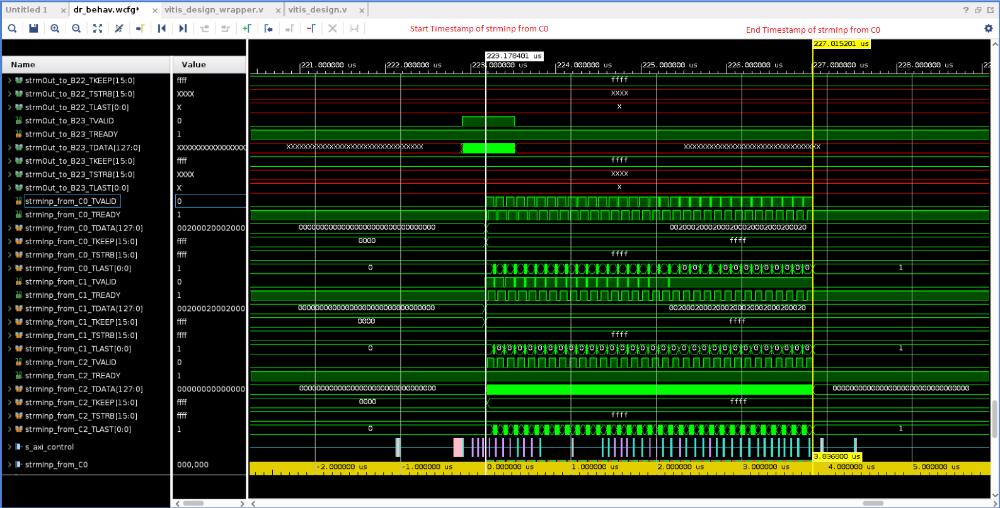
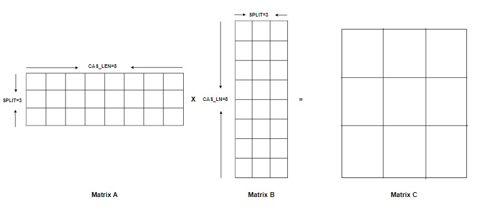
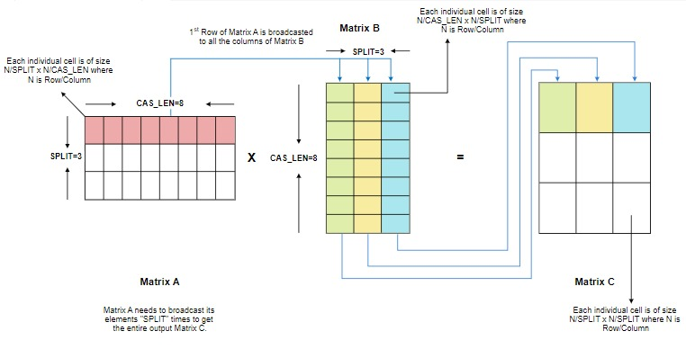
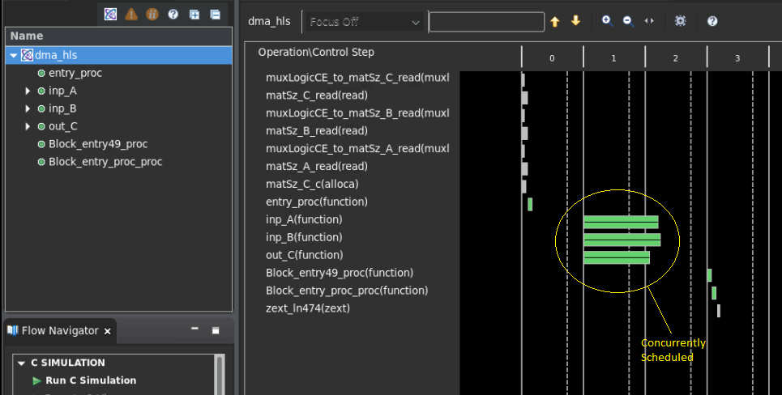
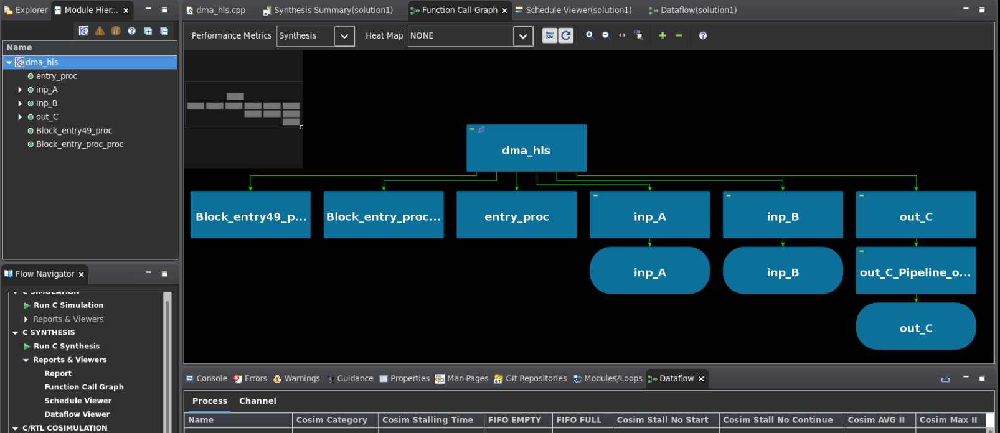
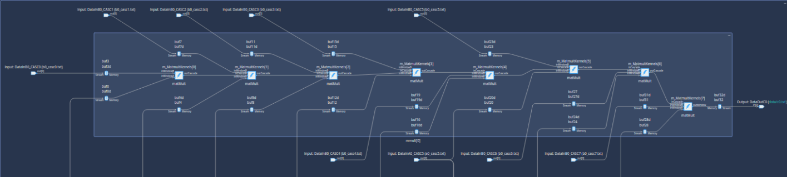
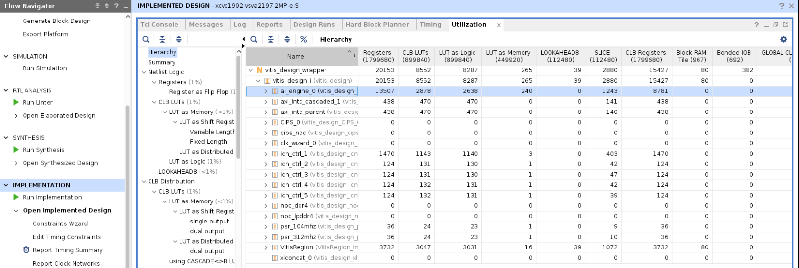
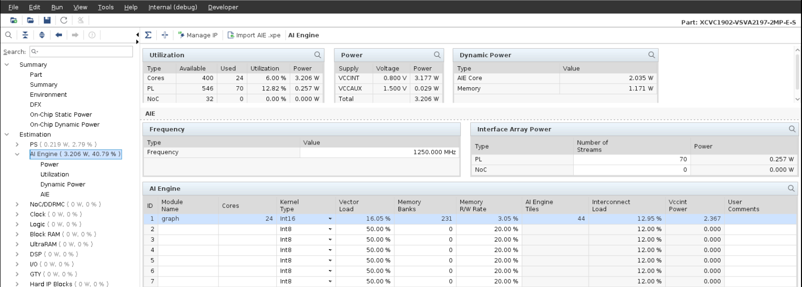
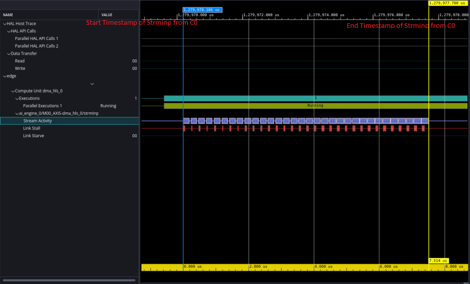

<table class="sphinxhide" width="100%">
 <tr width="100%">
    <td align="center"><h1>2023.1 Versal GeMM Implementation Using Vitis Acceleration Library Tutorial</h1>
    </td>
 </tr>
</table>

# AI Engine Implementation 

## Table of Contents

[Building the Design](#Building-the-Design)

[Hardware Design Details](#Hardware-Design-Details)

[Software Design Details](#Software-Design-Details)

[Performance Details](#Performance-Details)

## Building the Design

<details>
<summary>Design Build</summary> 

### Design Build

In this section, you build and run the GeMM design using the AI Engine implementation. You compile the AI Engine design and integrate it into a larger system design (including the PL kernels and PS host application). Review the [Integrating the Application section in the AI Engine Documentation](https://docs.xilinx.com/r/en-US/ug1076-ai-engine-environment/Integrating-the-Application-Using-the-Vitis-Tools-Flow) for the general flow. 

At the end of this section, the design flow will generate a new directory (called `build/`). Underneath are sub-directories named `(gemm_$(MAT_DIMS)/` (for example, `gemm_32x32x32/`) depending on the Mat A and Mat B dimensions and the number of instances `x$(GEMM_INSTS)` chosen in the build. Each sub-directory contains the `hw_emu/` and/or `hw/` subfolders. The respective subfolders contain `Work/` and `libadf.a`, outputs from the AI Engine compiler, the host app executable and the builds, targeted to `hw` or `hw_emu` respectively. The `hw_emu/` subfolder contains the build for hardware emulation. The `hw/` subfolder contains the build for hardware run on a VCK190 board.

</details>

<details>
<summary>Make Steps</summary> 

### Make Steps

To run the following `make` steps (that is, `make kernels`, `make graph`, and so on), you must be in the `AIE/` folder. The options that can be specified in the `make` steps are as follows.

`TARGET:` This can be set to `hw` or `hw_emu` to build the design in the hardware or hardware emulation flow respectively. The default option is `hw_emu`.

`GEMM_INSTS:` This is set to `1` by default and is not allowed to be changed right.

`GEMM_SIZE`: Matrix Dimensions Involved. `32` means Mat A (input matrix 1), B (input matrix 2) and C (output matrix) are square matrices of dimension `32`. Permissible values are `32`, `64`, `128`, `256`, `512`, and `1024`.

`ITER_CNT:` The number of iterations the design is run. The default is `1`.

`EN_TRACE:` Flag to enable trace profiling. `0` is disabled and `1` is enabled. The default is `0` (disabled).

The Makefile uses the following directory references:

```
## Relative gemm directory
RELATIVE_PROJECT_DIR := ./

## Absolute gemm directory = <user path>/Tutorials/AI_Engine/gemm
PROJECT_REPO := $(shell readlink -f $(RELATIVE_PROJECT_DIR))

DESIGN_REPO  := $(PROJECT_REPO)/design
AIE_SRC_REPO := $(DESIGN_REPO)/aie_src
PL_SRC_REPO  := $(DESIGN_REPO)/pl_src
HOST_APP_SRC_REPO := $(DESIGN_REPO)/host_app_src

SYSTEM_CONFIGS_REPO    := $(DESIGN_REPO)/system_configs
PROFILING_CONFIGS_REPO := $(DESIGN_REPO)/profiling_configs
EXEC_SCRIPTS_REPO      := $(DESIGN_REPO)/exec_scripts
VIVADO_METRICS_SCRIPTS_REPO := $(DESIGN_REPO)/vivado_metrics_scripts
DIRECTIVES_REPO        := $(DESIGN_REPO)/directives


BASE_BLD_DIR     := $(PROJECT_REPO)/build
GEMM_BLD_DIR     := $(BASE_BLD_DIR)/gemm_$(MAT_DIMS)
INSTS_BLD_DIR    := $(GEMM_BLD_DIR)/x$(GEMM_INSTS)
BUILD_TARGET_DIR := $(INSTS_BLD_DIR)/$(TARGET)

REPORTS_REPO := $(PROJECT_REPO)/reports_dir
BLD_REPORTS_DIR := $(REPORTS_REPO)/gemm_$(MAT_DIMS)/x$(GEMM_INSTS)

XPE_REPO := $(PROJECT_REPO)/xpe_dir
BLD_XPE_DIR := $(XPE_REPO)/gemm_$(MAT_DIMS)/x$(GEMM_INSTS)/$(TARGET)
VCD_FILE_NAME := gemm_$(MAT_DIMS)_x$(GEMM_INSTS)
BLD_TGT_VCD_FILE := $(BUILD_TARGET_DIR)/$(VCD_FILE_NAME).vcd
XPE_FILE := $(BLD_XPE_DIR)/graph_$(VCD_FILE_NAME).xpe

EMBEDDED_PACKAGE_OUT := $(BUILD_TARGET_DIR)/package
EMBEDDED_EXEC_SCRIPT := run_script.sh

WORK_DIR := Work
AIE_SIM_IO_BASE_DIR := $(AIE_SRC_REPO)/aiesim_data
AIE_SIM_IO_DIR := $(AIE_SIM_IO_BASE_DIR)/gemm_$(MAT_DIMS)_ioFiles

```

</details>

<details>
<summary>Build the Entire Design with a Single Command</summary>

### Build the Entire Design with a Single Command

If you are already familiar with the AI Engine and Vitis kernel compilation flows, you can build the entire design for each case of `gemm_$(MAT_DIMS)` with one command: 

```bash
make run (default target is hardware emulation, 1 instance, gemm_$(MAT_DIMS) matrix dimensions, iterations=1 and no trace-profiling )
```
or 

```bash
make run TARGET=hw ITER_CNT=16 EN_TRACE=1 GEMM_SIZE=64 (hardware, 16 iterations, , matrix dimentions 64 for Mat A, B and C and enable trace profiling )
```

This command runs the `make kernels`,`make graph`,`make xsa`,`make application`,`make package`, and `make run_emu` for hardware emulation or to run on hardware (VCK190 board) depending on the `TARGET` you specify. The settings also apply to the individual make steps listed below.

The generated files for each `gemm_$(MAT_DIMS)` are placed under an individual directory: `$(BUILD_TARGET_DIR)/`. Each `make` step to build the design is specified in the following sections. These sections also detail the options used and the location of input and output files in each case.

</details>

<details>
<summary>make kernels: Compiling PL Kernels</summary> 

### make kernels: Compiling PL Kernels


In this step, the Vitis compiler takes any Vitis compiler kernels (RTL or HLS C) in the PL region of the target platform (`xilinx_vck190_base_202310_1`) and the AI Engine kernels and graph and compiles them into their respective XO files. The following commands compile the kernels (default `TARGET=hw_emu`, `GEMM_INSTS=1`, `GEMM_SIZE=32`, `ITER_CNT=1` and `EN_TRACE=0`). 

```
make kernels
```

The command alongwith the options used is as follows (for `dma_hls`):

```
$(BUILD_TARGET_DIR)/$(DATAMOVER_KERNEL_XO).xo: 
	mkdir -p $(BUILD_TARGET_DIR); \
	cd $(BUILD_TARGET_DIR); \
	v++ --target $(TARGET) $(DATAMOVER_KERNEL_VPP_FLAGS) \
		$(VPP_FLAGS) -c -k $(DATAMOVER_KERNEL_TOP) \
		$(DATAMOVER_KERNEL_SRC) -o $@
```

See [this page](https://docs.xilinx.com/r/en-US/ug1393-vitis-application-acceleration/v-Command) for a detailed description of all Vitis compiler switches. The following table provides a summary of the switches used. 

|Switch|Description|
|  ---  |  ---  |
|--target \| -t [hw\|hw_emu]|Specifies the build target.|
|--platform \| -f|Specifies the name of a supported acceleration platform as specified by the $PLATFORM_REPO_PATHS environment variable or the full path to the platform XPFM file.|
|--save-temps \| -s|Directs the Vitis compiler command to save intermediate files/directories created during the compilation and link process. Use the `--temp_dir` option to specify a location to write the intermediate files to.|
|--temp_dir <string>|This allows you to manage the location where the tool writes temporary files created during the build process. The temporary results are written by the Vitis compiler, and then removed, unless the `--save-temps` option is also specified.|
|--verbose|Display verbose/debug information.|
|--compile \| -c|Required for compilation to generate XO files from kernel source files.|
|--kernel \<arg\>\|-k \<arg\>|Compile only the specified kernel from the input file. Only one -k option is allowed per Vitis compiler command.|
|--output \| -o|Specifies the name of the output file generated by the V++ command. The DMA HLS kernels output should be XO.|

|Input|Description|
|  ---  |  ---  |
|$(PL_SRC_REPO)/dma_hls.cpp|Defines the data mover PL kernel.|

|Output|Description|
|  ---  |  ---  |
|$(BUILD_TARGET_DIR)/dma_hls.hw_emu.xo|The data mover kernel object file.|

</details>

<details>
<summary>make graph: Creating the AI Engine ADF Graph for the Vitis Compiler Flow</summary> 

### make graph: Creating the AI Engine ADF Graph for Vitis Compiler Flow

An ADF graph can be connected to an extensible Vitis platform (the graph I/Os can be connected either to platform ports or to ports on Vitis kernels through Vitis compiler connectivity directives). 

* The AI Engine ADF C++ graph of the design contains AI Engine kernels and PL kernels. 
* All interconnects between kernels are defined in the C++ graph
* All interconnections to external I/O are fully specified in the C++ simulation testbench (`graph.cpp`) that instantiates the C++ ADF graph object. 

To compile the graph using the Makefile flow type (default `TARGET=hw_emu`, `GEMM_INSTS=1`, `GEMM_SIZE=32`, `ITER_CNT=1` and `EN_TRACE=0`):

```
make graph
```

The following AI Engine compiler command, alongwith the options used, compiles the AI Engine design graph: 

```
...
AIE_FLAGS := -include=$(AIE_SRC_REPO)
AIE_FLAGS += -include=$(DSPLIB_ROOT)/L1/include/aie
AIE_FLAGS += -include=$(DSPLIB_ROOT)/L1/src/aie
AIE_FLAGS += -include=$(DSPLIB_ROOT)/L1/tests/aie/inc
AIE_FLAGS += -include=$(DSPLIB_ROOT)/L1/tests/aie/src
AIE_FLAGS += -include=$(DSPLIB_ROOT)/L2/include/aie
AIE_FLAGS += -include=$(DSPLIB_ROOT)/L2/tests/aie/common/inc
AIE_FLAGS += --verbose
AIE_FLAGS += --Xpreproc="-DITER_CNT=$(ITER_CNT)"
AIE_FLAGS += --Xpreproc="-DGEMM_SIZE=$(GEMM_SIZE)"
AIE_FLAGS += --Xpreproc="-DGEMM_INSTS=$(GEMM_INSTS)"
AIE_FLAGS += --platform=$(PLATFORM)
AIE_FLAGS += --log-level=5
AIE_FLAGS += --test-iterations=2
AIE_FLAGS += --pl-freq=$(PL_FREQ)
AIE_FLAGS += --dataflow

AIE_FLAGS += --constraints=$(AIE_SRC_REPO)/constraints.aiecst

AIE_FLAGS += --Xmapper=BufferOptLevel9
AIE_FLAGS += --Xrouter=DMAFIFOsInFreeBankOnly


AIE_FLAGS += --workdir=$(WORK_DIR)

AIE_SIM_FLAGS := --pkg-dir $(WORK_DIR)/
AIE_SIM_FLAGS += -i=$(AIE_SIM_IO_DIR)

...
graph: $(LIBADF_A)

$(LIBADF_A):  $(AIE_SRC_REPO)/graph.*
	mkdir -p $(BUILD_TARGET_DIR); \
	cd $(BUILD_TARGET_DIR); \
	aiecompiler $(AIE_FLAGS) $(GRAPH_SRC_CPP) 2>&1 | tee -a aiecompiler.log
```

See [this page](https://docs.xilinx.com/r/en-US/ug1076-ai-engine-environment) for full AI Engine programming environment documentation.

The following table provides a summary of the switches used. 

|Switch|Description|
|  ---  |  ---  |
|--include=\<string\>|Specify compile-time include directory (zero or more).|
|--verbose\|-v|Verbose output of the AI Engine compiler emits compiler messages at various stages of compilation. These debug and tracing logs provide useful messages on the compilation process.|
|--Xpreproc="-D\<Pre-processor Macro String\>"|Specify compile time macro.|
|--Xchess="\<Chess Make Options\>"|Specify compile time chess make options; "main:bridge.llibs=softfloat m" enables floating point operations.|
|--heapsize=\<int\>|Heap size in bytes.|
|--log-level=\<int\>|Log level for verbose logging (default=1).|
|--workdir=\<string\>|By default, the compiler writes all outputs to a sub-directory of the current directory, called Work. Use this option to specify a different output directory.|

The following is a description of the output objects that results from executing the AI Engine compiler (`aiecompiler`) command.

|Inputs Sources|Description|
|  ---  |  ---  |
|$(AIE_SRC_REPO)/graph.cpp|Defines the GeMM graph objects.|

|Output Objects|Description|
|  ---  |  ---  |
|$(BUILD_TARGET_DIR)/libadf.a|Compiled AI Engine design graph.|
|$(BUILD_TARGET_DIR)/Work/|Directory that contains all outputs of the AI Engine compiler.|
</details>

<details>
<summary>make xsa: Using the Vitis Tools to Link AI Engine and HLS Kernels with the Platform</summary> 

### make xsa: Using the Vitis Tools to Link AI Engine and HLS Kernels with the Platform

After the AI Engine kernels and graph and PL HLS kernels have been compiled, you can use the Vitis compiler to link them with the platform to generate a XSA file. 

The Vitis tools allow you to integrate the AI Engine, HLS, and RTL kernels into an existing extensible platform. This is an automated step from a software developer perspective where the platform chosen is provided by the hardware designer. Alternatively, you can opt to use one of the many extensible base platforms provided by AMD, and use the Vitis tools to build the hardware design and integrate the AI Engine and PL kernels into it.
 
To test this feature in this tutorial, use the base VCK190 platform to build the design. The command to run this step is shown in the following example (default `TARGET=hw_emu`, `GEMM_INSTS=1`, `GEMM_SIZE=32`, `ITER_CNT=1` and `EN_TRACE=0`):

```
make xsa
``` 

The command along with the options used is as follows:

```
...
VPP_FLAGS := --platform $(PLATFORM)
VPP_FLAGS += --save-temps
VPP_FLAGS += --temp_dir $(BUILD_TARGET_DIR)/_x
VPP_FLAGS += --verbose
VPP_FLAGS += -g
...
VPP_LINK_FLAGS += --clock.freqHz $(VPP_CLOCK_FREQ):$(DATAMOVER_KERNEL_TOP)_0
VPP_LINK_FLAGS += --clock.defaultTolerance 0.001

### If Profiling for Performance Measurement is enabled..
ifeq ($(EN_TRACE),1)
   ifeq ($(TARGET),hw)
      VPP_LINK_FLAGS += --profile.data $(DATAMOVER_KERNEL_TOP):all:all
      VPP_LINK_FLAGS += --profile.trace_memory DDR
      
   endif
endif


VPP_LINK_FLAGS += --config $(SYSTEM_CONFIGS_REPO)/x$(GEMM_INSTS).cfg
VPP_LINK_FLAGS += --vivado.prop fileset.sim_1.xsim.simulate.log_all_signals=true

VPP_LINK_FLAGS += --vivado.prop run.impl_1.STEPS.PLACE_DESIGN.TCL.PRE=$(DIRECTIVES_REPO)/prohibit_select_bli_bels_for_hold.tcl

VPP_LINK_FLAGS += --vivado.prop run.synth_1.STEPS.SYNTH_DESIGN.ARGS.CONTROL_SET_OPT_THRESHOLD=16


VPP_LINK_FLAGS += --vivado.prop run.impl_1.{strategy}={Performance_ExplorePostRoutePhysOpt}
...
xsa:  kernels graph $(BUILD_TARGET_DIR)/$(XSA)

$(BUILD_TARGET_DIR)/$(XSA):$(KERNEL_XOS) $(SYSTEM_CONFIGS_REPO)/*
	cd $(BUILD_TARGET_DIR);	\
	v++ -l $(VPP_FLAGS) $(VPP_LINK_FLAGS) -t $(TARGET) -o $@ $(KERNEL_XOS) $(LIBADF_A)
```
See [this page](https://docs.xilinx.com/r/en-US/ug1393-vitis-application-acceleration/Building-the-Device-Binary) for a detailed description of Vitis linking options.

|Switch|Description|
|  ---  |  ---  |
|--platform \| -f|Specifies the name of a supported acceleration platform as specified by the $PLATFORM_REPO_PATHS environment variable or the full path to the platform XPFM file.|
|--save-temps \| -s|Directs the V++ command to save intermediate files/directories created during the compilation and link process. Use the `--temp_dir` option to specify a location to write the intermediate files to.|
|--temp_dir <string>|This allows you to manage the location where the tool writes temporary files created during the build process. The temporary results are written by the Vitis compiler, and then removed, unless the `--save-temps` option is also specified.|
|--verbose|Display verbose/debug information.|
|--config <config_file>|Specifies a configuration file containing V++ switches.|
|--output \| -o|Specifies the name of the output file generated by the V++ command. In this design the outputs of the DMA HLS kernels and the PL kernels interfacing with the AI Engine are in XO files.|
|--profile.data [<kernel_name>\|all]:[<cu_name>\|all]:[<interface_name>\|all]\(:[counters\|all]\)|Enables monitoring of data ports through the monitor IPs. This option needs to be specified during linking. See [this page](https://docs.xilinx.com/r/en-US/ug1393-vitis-application-acceleration/profile-Options) for detailed profiling options.|
|--profile.trace_memory \<FIFO\>:\<size\>\|\<MEMORY\>[\<n\>]|When building the hardware target \(-t=hw\), use this option to specify the type and amount of memory to use for capturing trace data. See [this page](https://docs.xilinx.com/r/en-US/ug1393-vitis-application-acceleration/profile-Options) for detailed profiling options.|

The information to tell the linker how to connect the AI Engine and PL kernels together is described in a configuration file, `system_configs/x$(GEMM_INSTS).cfg`. The file describes the overall connection scheme of the system.

```
[connectivity]
nk=dma_hls:1:dma_hls_0

#Connections For GEMM Insts 0...
stream_connect=dma_hls_0.strmOut_to_A0:ai_engine_0.DataInA0_CASC0
stream_connect=dma_hls_0.strmOut_to_A1:ai_engine_0.DataInA0_CASC1
stream_connect=dma_hls_0.strmOut_to_A2:ai_engine_0.DataInA0_CASC2
stream_connect=dma_hls_0.strmOut_to_A3:ai_engine_0.DataInA0_CASC3

stream_connect=dma_hls_0.strmOut_to_B0:ai_engine_0.DataInB0_CASC0
stream_connect=dma_hls_0.strmOut_to_B1:ai_engine_0.DataInB0_CASC1
stream_connect=dma_hls_0.strmOut_to_B2:ai_engine_0.DataInB0_CASC2
stream_connect=dma_hls_0.strmOut_to_B3:ai_engine_0.DataInB0_CASC3

stream_connect=dma_hls_0.strmOut_to_B4:ai_engine_0.DataInB1_CASC0
stream_connect=dma_hls_0.strmOut_to_B5:ai_engine_0.DataInB1_CASC1
stream_connect=dma_hls_0.strmOut_to_B6:ai_engine_0.DataInB1_CASC2
stream_connect=dma_hls_0.strmOut_to_B7:ai_engine_0.DataInB1_CASC3

stream_connect=dma_hls_0.strmOut_to_B8:ai_engine_0.DataInB2_CASC0
stream_connect=dma_hls_0.strmOut_to_B9:ai_engine_0.DataInB2_CASC1
stream_connect=dma_hls_0.strmOut_to_B10:ai_engine_0.DataInB2_CASC2
stream_connect=dma_hls_0.strmOut_to_B11:ai_engine_0.DataInB2_CASC3

stream_connect=dma_hls_0.strmOut_to_B12:ai_engine_0.DataInB3_CASC0
stream_connect=dma_hls_0.strmOut_to_B13:ai_engine_0.DataInB3_CASC1
stream_connect=dma_hls_0.strmOut_to_B14:ai_engine_0.DataInB3_CASC2
stream_connect=dma_hls_0.strmOut_to_B15:ai_engine_0.DataInB3_CASC3

stream_connect=dma_hls_0.strmOut_to_B16:ai_engine_0.DataInB4_CASC0
stream_connect=dma_hls_0.strmOut_to_B17:ai_engine_0.DataInB4_CASC1
stream_connect=dma_hls_0.strmOut_to_B18:ai_engine_0.DataInB4_CASC2
stream_connect=dma_hls_0.strmOut_to_B19:ai_engine_0.DataInB4_CASC3

stream_connect=dma_hls_0.strmOut_to_B20:ai_engine_0.DataInB5_CASC0
stream_connect=dma_hls_0.strmOut_to_B21:ai_engine_0.DataInB5_CASC1
stream_connect=dma_hls_0.strmOut_to_B22:ai_engine_0.DataInB5_CASC2
stream_connect=dma_hls_0.strmOut_to_B23:ai_engine_0.DataInB5_CASC3

stream_connect=dma_hls_0.strmOut_to_B24:ai_engine_0.DataInB6_CASC0
stream_connect=dma_hls_0.strmOut_to_B25:ai_engine_0.DataInB6_CASC1
stream_connect=dma_hls_0.strmOut_to_B26:ai_engine_0.DataInB6_CASC2
stream_connect=dma_hls_0.strmOut_to_B27:ai_engine_0.DataInB6_CASC3

stream_connect=dma_hls_0.strmOut_to_B28:ai_engine_0.DataInB7_CASC0
stream_connect=dma_hls_0.strmOut_to_B29:ai_engine_0.DataInB7_CASC1
stream_connect=dma_hls_0.strmOut_to_B30:ai_engine_0.DataInB7_CASC2
stream_connect=dma_hls_0.strmOut_to_B31:ai_engine_0.DataInB7_CASC3

stream_connect=ai_engine_0.DataOutC0:dma_hls_0.strmInp_from_C0
stream_connect=ai_engine_0.DataOutC1:dma_hls_0.strmInp_from_C1
stream_connect=ai_engine_0.DataOutC2:dma_hls_0.strmInp_from_C2
stream_connect=ai_engine_0.DataOutC3:dma_hls_0.strmInp_from_C3
stream_connect=ai_engine_0.DataOutC4:dma_hls_0.strmInp_from_C4
stream_connect=ai_engine_0.DataOutC5:dma_hls_0.strmInp_from_C5
stream_connect=ai_engine_0.DataOutC6:dma_hls_0.strmInp_from_C6
stream_connect=ai_engine_0.DataOutC7:dma_hls_0.strmInp_from_C7

[advanced]
# Disable Profiling in hw_emu so that it is faster...
param=hw_emu.enableProfiling=false

```

See [this page](https://docs.xilinx.com/r/en-US/ug1393-vitis-application-acceleration/Vitis-Compiler-Configuration-File) for a detailed description of the Vitis compiler configuration file.

|Switch|Comment|
|  ---  |  ---  |
|--connectivity.nk|Number of kernels. `dma_hls:1:dma_hls_0` means that the Vitis compiler should instantiate one dma_hls kernel and name the instance `dma_hls_0`.|
|--connectivity.stream_connect|How the kernels will connect to IPs, platforms, or other kernels. The output of the AI Engine compiler tells you the interfaces that need to be connected. `dma_hls_0.strmOut_to_A0:ai_engine_0.DataIn0` means that the Vitis compiler should connect the port `strmOut_to_A0` of the `dma_hls` PL kernel to the shim channel of the AI Engine with the logical name `DataIn0`, defined in `$(AIE_SRC_REPO)/graph.cpp` as part of the PLIO instantiation.|
|param=compiler.addOutputTypes=hw_export| This option tells the Vitis compiler that besides creating an XCLBIN file, it also outputs an XSA file which is needed to create a post-Vivado fixed platform for Vitis software development.|

The Vitis compiler calls the Vivado™ IP integrator under the hood to build the design. The platform and kernels are input to the Vivado Design Suite, which produces a simulation XSA or an XSA after running place and route on the design. The point at which the XSA is produced from Vivado depends on the `-target` option set on the Vitis compiler command line. 

You can now view the Vivado project, which is located in the `$(BUILD_TARGET_DIR)/_x/link/vivado/vpl/prj` directory. You have now have generated the XCLBIN file that will be used to execute your design on the platform.

</details>

<details>
<summary>make application: Compiling the Host Application</summary> 

### make application: Compiling the Host Application

You can compile the host application by following the typical cross-compilation flow for the Cortex A72. To build the application, run the following command (default `TARGET=hw_emu`, `GEMM_INSTS=1`, `GEMM_SIZE=32`, `ITER_CNT=1` and `EN_TRACE=0`):

```
make application
```
or

```
application: graph $(BUILD_TARGET_DIR)/$(APP_ELF)

REG_GCC_FLAGS := $(GCC_FLAGS)
REG_GCC_FLAGS += -DITER_CNT=$(ITER_CNT)

$(BUILD_TARGET_DIR)/$(APP_ELF): $(HOST_APP_SRC)/* $(LIBADF_A)
	@rm -rf $(BUILD_TARGET_DIR)/app_control.o $(BUILD_TARGET_DIR)/gemm_aie_app.o $(BUILD_TARGET_DIR)/$(APP_ELF)
	$(CXX) $(REG_GCC_FLAGS) $(GCC_INC_FLAGS) $(AIE_CONTROL_CPP) -o $(BUILD_TARGET_DIR)/app_control.o
	$(CXX) $(REG_GCC_FLAGS) $(GCC_INC_FLAGS) $(APP_SRC_CPP) -o $(BUILD_TARGET_DIR)/gemm_aie_app.o $(GCC_INC_LIB) $(GCC_LIB)
	$(CXX) $(BUILD_TARGET_DIR)/app_control.o $(BUILD_TARGET_DIR)/gemm_aie_app.o $(GCC_INC_LIB) $(GCC_LIB) -o $(BUILD_TARGET_DIR)/$(APP_ELF)
```


See [this page](https://xilinx.github.io/XRT/master/html/index.html) for XRT documentation. See [this page](https://docs.xilinx.com/r/en-US/ug1076-ai-engine-environment/Programming-the-PS-Host-Application) for details of host application programming.


|Switch|Description|
|  ---  |  ---  |
|-O \| Optimize.| Optimizing compilation takes more time and a lot more memory for a large function. With -O, the compiler tries to reduce code size and execution time, without performing any of the optimizations that can take a great deal of compilation time.|
|-D__linux__|
|-DXAIE_DEBUG|Enable debug interface capabilities where certain core status, event status, or stack trace can be dumped out.|
|-D\<Pre-processor Macro String\>=\<value\>|Pass pre-processor macro definitions to the cross-compiler.|
|-I \<dir\>|Add the directory `dir` to the list of directories to be searched for header files.|
|-o \<file\>|Place output in file `<file>`. This applies regardless of the output being produced, whether it be an executable file, an object file, an assembler file, or preprocessed C code.|
|--sysroot=\<dir\>|Use `dir` as the logical root directory for headers and libraries. For example, if the compiler normally searches for headers in `/usr/include` and libraries in `/usr/lib`, it instead searches `dir/usr/include` and `dir/usr/lib`. This is automatically set by the `env_setup.sh` script.|
|-l\<library\>|Search the library named `library` when linking. The GeMM tutorial requires the `adf_api_xrt` and `xrt_coreutil` libraries.|
|-L \<dir\>|Add directory `<dir>` to the list of directories to be searched for `-l`.|

The following is a description of the input sources compiled by the AI Engine compiler command. 

|Inputs Sources|Description|
|  ---  |  ---  |
|$(HOST_APP_SRC_REPO)/gemm_aie_app.cpp|Source application file for the `gemm_aie_xrt.elf` that will run on an A72 processor.|
|$(BUILD_TARGET_DIR)/Work/ps/c_rts/aie_control_xrt.cpp|This is the AI Engine control code generated implementing the graph APIs for the GeMM graph.|

The following is a description of the output objects that results from executing the AI Engine compiler command with the above inputs and options. 

|Output Objects|Description|
|  ---  |  ---  |
|$(BUILD_TARGET_DIR)/gemm_aie_xrt.elf|The executable that will run on an A72 processor.|

</details>

<details>
<summary>make package: Packaging the Design</summary> 

### make package: Packaging the Design

With the AI Engine outputs created, as well as the new platform, you can now generate the programmable device image (PDI) and a package to be used on an SD card. The PDI contains all the executables, bitstreams, and configurations of the device. The packaged SD card directory contains everything to boot Linux, the generated applications, and the XCLBIN.

The command to run this step is as follows (default `TARGET=hw_emu`, `GEMM_INSTS=1`, `GEMM_SIZE=32`, `ITER_CNT=1` and `EN_TRACE=0`):

```
make package
``` 

or

```
...
PKG_FLAGS := -t $(TARGET)
PKG_FLAGS += --save-temps
PKG_FLAGS += --temp_dir $(BUILD_TARGET_DIR)/_x
PKG_FLAGS += -f $(PLATFORM)
PKG_FLAGS += --package.rootfs $(COMMON_IMAGE_VERSAL)/rootfs.ext4
PKG_FLAGS += --package.kernel_image $(COMMON_IMAGE_VERSAL)/Image
PKG_FLAGS += --package.boot_mode=sd
PKG_FLAGS += --package.out_dir $(EMBEDDED_PACKAGE_OUT)
PKG_FLAGS += --package.image_format=ext4
PKG_FLAGS += --package.sd_file $(BUILD_TARGET_DIR)/$(APP_ELF) $(BUILD_TARGET_DIR)/$(XSA) $(LIBADF_A)
PKG_FLAGS += --package.sd_file $(BUILD_TARGET_DIR)/$(APP_ELF_INF_RUN) 
PKG_FLAGS += --package.sd_file $(EXEC_SCRIPTS_REPO)/$(EMBEDDED_EXEC_SCRIPT)

## If Profiling for Performance Measurement is enabled..
ifeq ($(EN_TRACE),1)
   ifeq ($(TARGET),hw)
      PKG_FLAGS += --package.sd_file $(PROFILING_CONFIGS_REPO)/xrt.ini
   
   endif
endif

## If XRT_ROOT is set...
ifdef XRT_ROOT
   PKG_FLAGS += --package.sd_dir $(XRT_ROOT)

endif

PKG_FLAGS += --package.defer_aie_run
...
package: application application_inf_run xsa $(EMBEDDED_PACKAGE_OUT)

$(EMBEDDED_PACKAGE_OUT): $(PROFILING_CONFIGS_REPO)/* $(EXEC_SCRIPTS_REPO)/* $(BUILD_TARGET_DIR)/$(APP_ELF) $(BUILD_TARGET_DIR)/$(XSA) $(BUILD_TARGET_DIR)/$(APP_ELF_INF_RUN)
	rm -rf $(EMBEDDED_PACKAGE_OUT)
	cd $(BUILD_TARGET_DIR);	\
	v++ -p $(PKG_FLAGS)
```

See [this page](https://docs.xilinx.com/r/en-US/ug1393-vitis-application-acceleration/package-Options) for more details about packaging the system.

|Switch|Description|
|  ---  |  ---  |
|--target \| -t [hw\|hw_emu]|Specifies the build target.|
|--package \| -p|Packages the final product at the end of the Vitis compile and link build process.|
|--package.rootfs \<arg\>|Where \<arg\> specifies the absolute or relative path to a processed Linux root file system file. The platform RootFS file is available for download from xilinx.com. Refer to the [Vitis Software Platform Installation](https://docs.xilinx.com/r/en-US/ug1393-vitis-application-acceleration/Vitis-Software-Platform-Installation) for more information.|
|--package.kernel_image \<arg\>|Where \<arg\> specifies the absolute or relative path to a Linux kernel image file. Overrides the existing image available in the platform. The platform image file is available for download from xilinx.com. Refer to the [Vitis Software Platform Installation](https://docs.xilinx.com/r/en-US/ug1393-vitis-application-acceleration/Vitis-Software-Platform-Installation) for more information.|
|--package.boot_mode \<arg\>|Where \<arg\> specifies <ospi\|qspi\|sd>. Boot mode used for running the application in emulation or on hardware.|
|--package.image_format|Where \<arg\> specifies the \<ext4\|fat32\> output image file format. `ext4` is the Linux file system and `fat32` is the Windows file system.|
|--package.sd_file|Where \<arg\> specifies an ELF or other data file to package into the `sd_card` directory/image. This option can be used repeatedly to specify multiple files to add to the `sd_card` directory.|
|--package.defer_aie_run| Load the AI Engine application with the ELF file, but wait to run it until graph run directs it. This is required in the PS based AI Engine flow.|

|Inputs Sources|Description|
|  ---  |  ---  |
|$(PLATFORM_REPO_PATHS)/sw/versal/xrt|The PS host application needs the XRT headers in this folder to execute.|
|$(PLATFORM_REPO_PATHS)/sw/versal/xilinx-versal/rootfs.ext4|The root filesystem file for PetaLinux.|
|$(PLATFORM_REPO_PATHS)/sw/versal/xilinx-versal/Image|The pre-built PetaLinux image that the processor boots from.|
|$(BUILD_TARGET_DIR)/gemm_aie_xrt.elf|The PS host application executable created in the `make application` step.|
|$(BUILD_TARGET_DIR)/vck190_aie_gemm.hw_emu.xsa|The XCLBIN file created in the `make xsa` step.|
|$(BUILD_TARGET_DIR)/libadf.a|The compiled AI Engine design graph created in the `make graph` step.|

The output of the Vitis compiler package step is the package directory that contains the contents to run hardware emulation. 

|Output Objects|Description|
|  ---  |  ---  |
|$(BUILD_TARGET_DIR)/package|The hardware emulation package that contains the boot file, hardware emulation launch script, PLM and PMC boot files, PMC and QEMU command argument specification files, and Vivado simulation folder.|

</details>

<details>
<summary>make run_emu: Running Hardware Emulation</summary>

### make run_emu: Running Hardware Emulation

After packaging, everything is set to run hardware emulation. To run emulation, use the following command (default `TARGET=hw_emu`):

```
make run_emu 
```

or

```
###########################################################################
Hardware Emulation Goto:
$(BUILD_TARGET_DIR)/package

and do:
./launch_hw_emu.sh or ./launch_hw_emu.sh -g (for waveform viewer) or ./launch_hw_emu.sh -run-app $(EMBEDDED_EXEC_SCRIPT) (to check results without opening waveform viewer) ...

```

When hardware emulation is launched, you see the QEMU simulator load. Wait for the autoboot countdown to go to zero. After a few minutes, the root Linux prompt comes up: 

```bash

root@versal-rootfs-common-2023_1:~#

```

After the root prompt comes up, run the following commands to run the design:  

```
mount /dev/mmcblk0p1 /mnt
cd /mnt
./gemm_aie_xrt.elf a.xclbin
```

The `gemm_aie_xrt.elf` executes. After a few minutes, you should see the output with `TEST PASSED` on the console. When this is shown, run the following keyboard command to exit the QEMU instance: 

```
#To exit QEMU Simulation
Press CtrlA, let go of the keyboard, and then press x 
```

To run with waveform, do the following:

```
cd $(BUILD_TARGET_DIR)/package
./launch_hw_emu.sh -g
```

The XSIM Waveform Viewer is launched. Drag and drop the signals into the viewer and click **Play** to start the emulation. Go back to the terminal and wait for the Linux prompt to show up. In the XSIM Waveform Viewer, you see the signals you added to the waveform adjusting over the execution of the design. When this is done, hit the pause button and close the window to end the emulation.

The following figure shows a waveform view of the gemm_32x32x32 - 1x design.



</details>

<details>
<summary>TARGET=hw: Running on Hardware</summary>

### Running on Hardware

To run the design in hardware, rerun the following `make` steps with `TARGET=hw` and other applicable options (see the preceding `make` steps specified above).

```
make kernels xsa package TARGET=hw 
```

These commands create a `$(BUILD_TARGET_DIR)` folder with the kernels, XSA, and `package` for a hardware run. 

Run the following step to set up the execution file, generated images, and base images (`$(BUILD_TARGET_DIR)/package/sd_card` and `$(BUILD_TARGET_DIR)/package/sd_card.img`).

```
make run_emu TARGET=hw 
```

These commands create a `build/hw` folder with the kernels, XSA, and `package` for a hardware run. Follow steps 1-9 to run the `gemm_aie_xrt.elf` executable on your VCK190 board. 

**Step 1.** Ensure your board is powered off. 

**Step 2.** Use an SD card writer (such as balenaEtcher) to flash the `sd_card.img` file to an SD card. 

**Step 3.** Plug the flashed SD card into the top slot of the VCK190 board. 

**Step 4.** Set the switch (`SW1 Mode\[3:0\]=1110 = OFF OFF OFF ON`).

**Step 5.** Connect your computer to the VCK190 board using the USB cable included with the board. 

**Step 6.** Open a TeraTerm terminal and select the correct COM port. Set the port settings to the following: 

```
Port: <COMMXX>
Speed: 115200
Data: 8 bit
Parity: none
Stop Bits: 1 bit
Flow control: none
Transmit delay: 0 msec/char 0 msec/line
```

**Step 7.** Power on the board.

**Step 8.** Wait until you see the `root@versal-rootfs-common-2023.1` Linux command prompt. Press **Enter** a few times to get past any `xinit` errors. 

**Step 9.** Run the following commands in the TeraTerm terminal: 

```
cd /mnt/sd-mmcblk0p1

./gemm_aie_xrt.elf a.xclbin
```

</details>

## Hardware Design Details
<details>
<summary>GeMM AI Engine Implementation Architecture and AI Engine/PL Function Partitioning</summary>

### GeMM AI Engine Implementation Architecture and AI Engine/PL Function Partitioning

The following figure shows a high-level block diagram of the design. The test harness consists of the AI Engine and data mover HLS kernels (`dma_hls`). In this setup, there is an AXI4-Stream interface between the data mover kernels and AI Engines, with a data width of 128 bits. The data mover kernels and the AI Engine array interface are running at 312.5 MHz.

The data mover is a PL-based data generator and checker. It generates constant matrices as inputs and checks the output of the gemm core for its output.

#### GeMM Block Diagram for Matrices 32x32x32 to 512x512x512



#### GeMM Block Diagram for Matrix 1024x1024x1024


</details>

<details>
<summary>Design Details</summary>

### Design Details

The design in this tutorial starts with a base platform containing the control interface and processing system (CIPS), NoC, AI Engine, and the interfaces among them. The Vitis compiler linker step builds on top of the base platform by adding the AI Engine graphs and PL kernels. To add the various functions in a system-level design, PL kernels are added to the base platform depending on the application (that is, the PL kernels present in each design might vary). An ADF graph is connected to an extensible Vitis platform where the graph I/Os are connected either to the platform ports or to ports on Vitis kernels through the Vitis compiler connectivity directives. In the design, the components are added by the Vitis compiler `-l` step (see [make XSA](#make-xsa-using-the-vitis-tools-to-link-ai-engine-and-hls-kernels-with-the-platform)) and include the following:


* `libadf.a`
* Data mover kernel (`dma_hls.[hw|hw_emu].xo`)
* Connection interfaces defined in the system configuration file

To see a schematic view of the design with the extended platform as shown in the following figure, open the following in Vivado:

```
`build/gemm_$(MAT_DIMS)/x$(GEMM_INSTS)/[hw|hw_emu]/_x/link/vivado/vpl/prj/prj.xpr`
```


In this design, the GeMM computation happens in multiple stages. The input is split and broadcast to multiple cores, the number of rows in Mat A and the number of columns in Mat B is split into several blocks, based on the cascade length and so on, and then each block in Mat A is multiplied with the corresponding block in Mat B, which generates blocks of outputs, which finally propagated for to the final output.

The datamover kernel provides the parallel inputs required by the GeMM AIE graph, and finally, the data coming out of the AI Engines is streamed to a PL kernel where it is checked against the expected constant pattern. If there is a mismatch, it is recorded in the variable `errCnt`, which is read in the host app to determine whether the test has passed or failed.

The system debugging and profiling IP (DPA) is added to the PL region of the device to capture AI Engine runtime trace data if the `EN_TRACE` option is enabled in the design. The `dma_hls` kernel and the AI Engine array interface are both operating at 312.5 MHz.

</details>

<details>
<summary>AI Engine and PL Kernels</summary>

### AI Engine and PL Kernels

The top-level AI Engine graph, `graph.cpp`, contains two sub-graphs: `aiesynth_graph` and `GeMM`. The `aiesynth_graph` performs the block-level GeMM and the `GeMM` graph.

#### dma_hls

The PL-based data mover consists of the `dma_hls` kernel, which generates constant Inputs for Mat A and B and checks the output of GeMM graph for the expected constant pattern.

* It internally comprises four loops (`inp_A`, `inp_B`, and `out_C`), with all concurrently scheduled.
* The data width is 128 bits at both the AXI4-stream I/O sides, running at 312.5 MHz.

</details>

## Software Design Details

The software design in the AI Engine GeMM tutorial consists of the following sections:

<details>
<summary>Methodology</summary>

### Methodology

The following figure elaborates on the AI Engine implementation methodology.


#### GeMM Block Diagram Methodology for Matrices 32x32x32 to 512x512x512



#### GeMM Block Diagram Methodology for Matrix 1024x1024x1024


#### AI Engine

##### Independent Cores

The kernels in the AI Engine graph for `aiesynth_graph` are to be configured to be independent, with runtime ratios set to >= 0.6 so that each can be run independently of the other.

```
...
for(int i = 0; i < 8; i++) {
            adf::runtime<ratio>(sg_0_0_kernels[i]) = 0.9;
         }
...
```

##### Window Streaming Buffer Config

The `graph.h` graph performs GeMM with graph window streaming buffer size as `WINDOW_SIZE`, which is fixed to matrix dimension.
```
...
#if GEMM_SIZE < 1024
      #define SPLIT 8
      #define CASC_LN 4
      #define N_SAMPLES 1
      #define DIM_A (GEMM_SIZE / (SPLIT)) // * CASC_LN))
      #define DIM_AB (GEMM_SIZE)// / CASC_LN)
      #define DIM_B (GEMM_SIZE / SPLIT)
      //#define GRAPH_ITER_CNT (SPLIT * ITER_CNT)
      #define GRAPH_ITER_CNT (SPLIT)
   
   #else
      #define SPLIT 8
      #define CASC_LN 4
      #define N_SAMPLES 1
      #define DIM_A (GEMM_SIZE / 32) // * CASC_LN))
      #define DIM_AB (GEMM_SIZE)// / CASC_LN)
      #define DIM_B (GEMM_SIZE / 32)
      #define GRAPH_ITER_CNT ((32 / 8) * 32 * ITER_CNT)
   
   #endif
   
   #define WINDOW_SIZE (DIM_A * DIM_AB * N_SAMPLES)

...
```

#### Data Mover

##### Data Generation/Checking and Sequencing

The data mover comprises four loops (`inp_A`, `inp_B`, and `out_C`), with all concurrently scheduled.

##### Concurrent Scheduling

Concurrent scheduling is required so that each function runs independently and the execution of one function is not blocking the other. The concurrent scheduling of the three functions `inp_A`, `inp_B`, and `out_C` is achieved using `#pragma HLS DATAFLOW` as shown in the following example.

```
#pragma HLS DATAFLOW
   
   ap_uint<21> errCnt = 0;
   
   #if GEMM_SIZE == 32
      ap_uint<128> goldenVal = ap_uint<128> \
      ("0x00400040004000400040004000400040", 16);
   
   #elif GEMM_SIZE == 64
      ap_uint<128> goldenVal = ap_uint<128> \
      ("0x00800080008000800080008000800080", 16);
   
   #elif GEMM_SIZE == 128
      ap_uint<128> goldenVal = ap_uint<128> \
      ("0x01000100010001000100010001000100", 16);
   
   #elif GEMM_SIZE == 256
      ap_uint<128> goldenVal = ap_uint<128> \
      ("0x02000200020002000200020002000200", 16);
   
   #elif GEMM_SIZE == 512
      ap_uint<128> goldenVal = ap_uint<128> \
      ("0x04000400040004000400040004000400", 16);
   
   #elif GEMM_SIZE == 1024
      ap_uint<128> goldenVal = ap_uint<128> \
      ("0x08000800080008000800080008000800", 16);
   
   #endif


   inp_A(strmOut_to_A0, strmOut_to_A1, strmOut_to_A2, strmOut_to_A3,
         matSz_A);
   
   inp_B(strmOut_to_B0, strmOut_to_B1, strmOut_to_B2, strmOut_to_B3,
         strmOut_to_B4, strmOut_to_B5, strmOut_to_B6, strmOut_to_B7,
         strmOut_to_B8, strmOut_to_B9, strmOut_to_B10, strmOut_to_B11,
         strmOut_to_B12, strmOut_to_B13, strmOut_to_B14, strmOut_to_B15,
         strmOut_to_B16, strmOut_to_B17, strmOut_to_B18, strmOut_to_B19,
         strmOut_to_B20, strmOut_to_B21, strmOut_to_B22, strmOut_to_B23,
         strmOut_to_B24, strmOut_to_B25, strmOut_to_B26, strmOut_to_B27,
         strmOut_to_B28, strmOut_to_B29, strmOut_to_B30, strmOut_to_B31, matSz_B);
   
   out_C(strmInp_from_C0, strmInp_from_C1, strmInp_from_C2, strmInp_from_C3,strmInp_from_C4,
         strmInp_from_C5, strmInp_from_C6, strmInp_from_C7, matSz_C, errCnt, goldenVal);
   }
```

##### Vitis HLS Scheduling and Dataflow View

The following figure shows the data mover scheduler view.



The following figure shows the data mover dataflow view.


The following figure shows the data mover functional call graph view.



#### Streaming Interface Data Width

The streaming interface data width is kept at 128 bits to reduce read/write overhead while processing data.

</details>

<details>
<summary>AI Engine Kernels and Graph Representation</summary>

### AI Engine Kernels and Graph Representation

An AI Engine kernel is a C/C++ program written using specialized intrinsic calls that target the VLIW vector processor. The AI Engine compiler compiles the kernel code to produce an executable ELF file for each of the AI Engines being used in the design. Review the [AI Engine Kernel Programming](https://docs.xilinx.com/r/en-US/ug1079-ai-engine-kernel-coding) section in the AI Engine documentation for a high-level overview of kernel programming. These kernels can be stitched together to function as AI Engine graphs written in C++. In this design, the AI Engine compiler writes a summary of compilation results. You can view the graph by running the following command:

`vitis_analyzer $(BUILD_TARGET_DIR)/Work/graph.aiecompile_summary`

The following figures show the graph representation of the AI Engine kernels (default gemm_32x32x32), it shows the compute units.



</details>

<details>
<summary>Adaptive Data Flow (ADF) Graph</summary>

### Adaptive Data Flow (ADF) Graph

This section describes the overall data flow graph specification of the GeMM design using AI Engine which is compiled by the AI Engine compiler.

The overall graph definition of the design is contained in the `graph.cpp` file. The top-level graph contains two sub-graphs, `aiesynth_graph` and `GeMM`. The following describes the definition of the sub-graphs.

#### Defining the Graph Class


Define the graph classes by using the objects defined in the appropriate name space. It must include the ADF library and [Vitis DSP Library](https://docs.xilinx.com/r/en-US/Vitis_Libraries/dsp/user_guide/L2/dsp-lib-func.html#matrix-multiply) for GeMM. A general specification is put in for the ADF namespace:


```
 class GeMM: public adf::graph
   {
      public:
         input_plio matA_inp[CASC_LN];
         input_plio matB_inp[(SPLIT * CASC_LN)];
         output_plio matC_out[SPLIT];
         
         GeMM(): {
            // GeMM Graph Declarations...
            xf::dsp::aie::blas::matrix_mult::matrix_mult_graph<int16, int16, DIM_A, DIM_AB, DIM_B, 0, 0, \
               ROW_MAJOR, ROW_MAJOR, ROW_MAJOR, 0, 0, 0, WINDOW_SIZE, WINDOW_SIZE, CASC_LN> mmult[SPLIT];
            
            // Mat A PLIO node names...
            for(int j = 0; j < CASC_LN; ++j) {
               std::string matA_plioOut_str = "DataInA" + std::to_string(0) + "_CASC" + std::to_string(j);
               const char *matA_plioOut = matA_plioOut_str.c_str();
               
               std::string matA_Out_file_str = "a" + std::to_string(0) + "_casc" + std::to_string(j) + ".txt";
               const char *matA_Out_file = matA_Out_file_str.c_str();
               
               matA_inp[j] = input_plio::create(matA_plioOut, plio_128_bits, matA_Out_file);
            }
            
            for(int i = 0; i < SPLIT; ++i) {
               // CASC_LN No. of kernels will be created...
               adf::kernel *mmult_kernels = mmult[i].getKernels();
               
               for(int j = 0; j < CASC_LN; ++j) {
                  // Mat B PLIO node names...
                  std::string matB_plioOut_str = "DataInB" + std::to_string(i) + "_CASC" + std::to_string(j);
                  const char *matB_plioOut = matB_plioOut_str.c_str();
                  
                  std::string matB_Out_file_str = "b" + std::to_string(i) + "_casc" + std::to_string(j) + ".txt";
                  const char *matB_Out_file = matB_Out_file_str.c_str();
                  
                  matB_inp[(i * CASC_LN) + j] = input_plio::create(matB_plioOut, plio_128_bits, matB_Out_file);
               } 
               
               // Mat C PLIO node names...
               std::string matC_plioOut_str = "DataOutC" + std::to_string(i);
               const char *matC_plioOut = matC_plioOut_str.c_str();
               
               std::string matC_Out_file_str = "data/c" + std::to_string(i) + ".txt";
               const char *matC_Out_file = matC_Out_file_str.c_str();
               
               // Creating PLIO nodes...
               matC_out[i] = output_plio::create(matC_plioOut, plio_128_bits, matC_Out_file);
               
               // Connecting PLIO Nodes...
               for(int k = 0; k < CASC_LN; ++k) {
                  // Setting runtime ratio...
                  adf::runtime<ratio>(mmult_kernels[k]) = 0.8;
                  
                  // Connecting port IO nodes...
                  adf::connect<>(matA_inp[k].out[0], mmult[i].inA[k]);
                  adf::connect<>(matB_inp[(i * CASC_LN) + k].out[0], mmult[i].inB[k]);
               }
               
               // Connecting port IO nodes...
               adf::connect<>(mmult[i].out, matC_out[i].in[0]);
            }
         }
   };
```

#### Top-Level Application

Define a top-level application file (`graph.cpp` in this design) that contains an instance of the graph class:

```
#include "graph.h"

int base_col = 0, base_row = 0, matrixCtr = 0;

GeMM g;

#ifdef __AIESIM__

   int main(void)
   {
      g.init();
      g.run(GRAPH_ITER_CNT);
      g.end();
   
      return 0;
   }

#endif
```

</details>

<details>
<summary>PL Data Mover Kernel</summary>

### PL Data Mover Kernel

In addition to the kernels operating in the AI Engine array, this design specifies a data mover kernel to run in the PL region of the device (written in HLS C++). The data mover kernel is brought into the design during the Vitis kernel compilation. The software design of the data mover kernel is described in the following sections. 

#### dma_hls (dma_hls.cpp)

The `dma_hls` kernel write and reads data to AXI4-Stream interfaces.

##### Top Function Declaration

The `dma_hls` kernel takes the following arguments which was declared in `dma_hls.h`:

```
int dma_hls(
   hls::stream<ap_axiu<128, 0, 0, 0>> &strmOut_to_A0,
   hls::stream<ap_axiu<128, 0, 0, 0>> &strmOut_to_A1,
   hls::stream<ap_axiu<128, 0, 0, 0>> &strmOut_to_A2,
   hls::stream<ap_axiu<128, 0, 0, 0>> &strmOut_to_A3,
   hls::stream<ap_axiu<128, 0, 0, 0>> &strmOut_to_B0,
   hls::stream<ap_axiu<128, 0, 0, 0>> &strmOut_to_B1,
   hls::stream<ap_axiu<128, 0, 0, 0>> &strmOut_to_B2,
   hls::stream<ap_axiu<128, 0, 0, 0>> &strmOut_to_B3,
   hls::stream<ap_axiu<128, 0, 0, 0>> &strmOut_to_B4,
   hls::stream<ap_axiu<128, 0, 0, 0>> &strmOut_to_B5,
   hls::stream<ap_axiu<128, 0, 0, 0>> &strmOut_to_B6,
   hls::stream<ap_axiu<128, 0, 0, 0>> &strmOut_to_B7,
   hls::stream<ap_axiu<128, 0, 0, 0>> &strmOut_to_B8,
   hls::stream<ap_axiu<128, 0, 0, 0>> &strmOut_to_B9,
   hls::stream<ap_axiu<128, 0, 0, 0>> &strmOut_to_B10,
   hls::stream<ap_axiu<128, 0, 0, 0>> &strmOut_to_B11,
   hls::stream<ap_axiu<128, 0, 0, 0>> &strmOut_to_B12,
   hls::stream<ap_axiu<128, 0, 0, 0>> &strmOut_to_B13,
   hls::stream<ap_axiu<128, 0, 0, 0>> &strmOut_to_B14,
   hls::stream<ap_axiu<128, 0, 0, 0>> &strmOut_to_B15,
   hls::stream<ap_axiu<128, 0, 0, 0>> &strmOut_to_B16,
   hls::stream<ap_axiu<128, 0, 0, 0>> &strmOut_to_B17,
   hls::stream<ap_axiu<128, 0, 0, 0>> &strmOut_to_B18,
   hls::stream<ap_axiu<128, 0, 0, 0>> &strmOut_to_B19,
   hls::stream<ap_axiu<128, 0, 0, 0>> &strmOut_to_B20,
   hls::stream<ap_axiu<128, 0, 0, 0>> &strmOut_to_B21,
   hls::stream<ap_axiu<128, 0, 0, 0>> &strmOut_to_B22,
   hls::stream<ap_axiu<128, 0, 0, 0>> &strmOut_to_B23,
   hls::stream<ap_axiu<128, 0, 0, 0>> &strmOut_to_B24,
   hls::stream<ap_axiu<128, 0, 0, 0>> &strmOut_to_B25,
   hls::stream<ap_axiu<128, 0, 0, 0>> &strmOut_to_B26,
   hls::stream<ap_axiu<128, 0, 0, 0>> &strmOut_to_B27,
   hls::stream<ap_axiu<128, 0, 0, 0>> &strmOut_to_B28,
   hls::stream<ap_axiu<128, 0, 0, 0>> &strmOut_to_B29,
   hls::stream<ap_axiu<128, 0, 0, 0>> &strmOut_to_B30,
   hls::stream<ap_axiu<128, 0, 0, 0>> &strmOut_to_B31,
   hls::stream<ap_axiu<128, 0, 0, 0>> &strmInp_from_C0,
   hls::stream<ap_axiu<128, 0, 0, 0>> &strmInp_from_C1,
   hls::stream<ap_axiu<128, 0, 0, 0>> &strmInp_from_C2,
   hls::stream<ap_axiu<128, 0, 0, 0>> &strmInp_from_C3,
   hls::stream<ap_axiu<128, 0, 0, 0>> &strmInp_from_C4,
   hls::stream<ap_axiu<128, 0, 0, 0>> &strmInp_from_C5,
   hls::stream<ap_axiu<128, 0, 0, 0>> &strmInp_from_C6,
   hls::stream<ap_axiu<128, 0, 0, 0>> &strmInp_from_C7,
   ap_int<32> matSz_A, ap_int<32> matSz_B, ap_int<32> matSz_C
   );
```

- `ap_int<N>` is an arbitrary precision integer data type defined in `ap_int.h` where `N` is a bit size from 1-1024. In this design, the bit size is set to 128.
- `hls::stream<ap_axiu<D,0,0,0>>` is a data type defined in `ap_axi_sdata.h`. It is a special data class used for data transfer when using a streaming platform. The parameter `<D>` is the data width of the streaming interface, which is set to 128. The remaining three parameters should be set to 0.

##### Top Function Definition

Use the `dataflow` pragma for concurrently scheduling the three functions `inp_A`, `inp_B`, and `out_C`.

```
int dma_hls(
   hls::stream<ap_axiu<128, 0, 0, 0>> &strmOut_to_A0,
   hls::stream<ap_axiu<128, 0, 0, 0>> &strmOut_to_A1,
   hls::stream<ap_axiu<128, 0, 0, 0>> &strmOut_to_A2,
   hls::stream<ap_axiu<128, 0, 0, 0>> &strmOut_to_A3,
   hls::stream<ap_axiu<128, 0, 0, 0>> &strmOut_to_B0,
   hls::stream<ap_axiu<128, 0, 0, 0>> &strmOut_to_B1,
   hls::stream<ap_axiu<128, 0, 0, 0>> &strmOut_to_B2,
   hls::stream<ap_axiu<128, 0, 0, 0>> &strmOut_to_B3,
   hls::stream<ap_axiu<128, 0, 0, 0>> &strmOut_to_B4,
   hls::stream<ap_axiu<128, 0, 0, 0>> &strmOut_to_B5,
   hls::stream<ap_axiu<128, 0, 0, 0>> &strmOut_to_B6,
   hls::stream<ap_axiu<128, 0, 0, 0>> &strmOut_to_B7,
   hls::stream<ap_axiu<128, 0, 0, 0>> &strmOut_to_B8,
   hls::stream<ap_axiu<128, 0, 0, 0>> &strmOut_to_B9,
   hls::stream<ap_axiu<128, 0, 0, 0>> &strmOut_to_B10,
   hls::stream<ap_axiu<128, 0, 0, 0>> &strmOut_to_B11,
   hls::stream<ap_axiu<128, 0, 0, 0>> &strmOut_to_B12,
   hls::stream<ap_axiu<128, 0, 0, 0>> &strmOut_to_B13,
   hls::stream<ap_axiu<128, 0, 0, 0>> &strmOut_to_B14,
   hls::stream<ap_axiu<128, 0, 0, 0>> &strmOut_to_B15,
   hls::stream<ap_axiu<128, 0, 0, 0>> &strmOut_to_B16,
   hls::stream<ap_axiu<128, 0, 0, 0>> &strmOut_to_B17,
   hls::stream<ap_axiu<128, 0, 0, 0>> &strmOut_to_B18,
   hls::stream<ap_axiu<128, 0, 0, 0>> &strmOut_to_B19,
   hls::stream<ap_axiu<128, 0, 0, 0>> &strmOut_to_B20,
   hls::stream<ap_axiu<128, 0, 0, 0>> &strmOut_to_B21,
   hls::stream<ap_axiu<128, 0, 0, 0>> &strmOut_to_B22,
   hls::stream<ap_axiu<128, 0, 0, 0>> &strmOut_to_B23,
   hls::stream<ap_axiu<128, 0, 0, 0>> &strmOut_to_B24,
   hls::stream<ap_axiu<128, 0, 0, 0>> &strmOut_to_B25,
   hls::stream<ap_axiu<128, 0, 0, 0>> &strmOut_to_B26,
   hls::stream<ap_axiu<128, 0, 0, 0>> &strmOut_to_B27,
   hls::stream<ap_axiu<128, 0, 0, 0>> &strmOut_to_B28,
   hls::stream<ap_axiu<128, 0, 0, 0>> &strmOut_to_B29,
   hls::stream<ap_axiu<128, 0, 0, 0>> &strmOut_to_B30,
   hls::stream<ap_axiu<128, 0, 0, 0>> &strmOut_to_B31,
   hls::stream<ap_axiu<128, 0, 0, 0>> &strmInp_from_C0,
   hls::stream<ap_axiu<128, 0, 0, 0>> &strmInp_from_C1,
   hls::stream<ap_axiu<128, 0, 0, 0>> &strmInp_from_C2,
   hls::stream<ap_axiu<128, 0, 0, 0>> &strmInp_from_C3,
   hls::stream<ap_axiu<128, 0, 0, 0>> &strmInp_from_C4,
   hls::stream<ap_axiu<128, 0, 0, 0>> &strmInp_from_C5,
   hls::stream<ap_axiu<128, 0, 0, 0>> &strmInp_from_C6,
   hls::stream<ap_axiu<128, 0, 0, 0>> &strmInp_from_C7,
   ap_int<32> matSz_A, ap_int<32> matSz_B, ap_int<32> matSz_C
   )
{
   #pragma HLS INTERFACE axis port=strmOut_to_A0
   #pragma HLS INTERFACE axis port=strmOut_to_A1
   #pragma HLS INTERFACE axis port=strmOut_to_A2
   #pragma HLS INTERFACE axis port=strmOut_to_A3
   #pragma HLS INTERFACE axis port=strmOut_to_B0  
   #pragma HLS INTERFACE axis port=strmOut_to_B1
   #pragma HLS INTERFACE axis port=strmOut_to_B2
   #pragma HLS INTERFACE axis port=strmOut_to_B3
   #pragma HLS INTERFACE axis port=strmOut_to_B4  
   #pragma HLS INTERFACE axis port=strmOut_to_B5
   #pragma HLS INTERFACE axis port=strmOut_to_B6
   #pragma HLS INTERFACE axis port=strmOut_to_B7
   #pragma HLS INTERFACE axis port=strmOut_to_B8  
   #pragma HLS INTERFACE axis port=strmOut_to_B9
   #pragma HLS INTERFACE axis port=strmOut_to_B10
   #pragma HLS INTERFACE axis port=strmOut_to_B11
   #pragma HLS INTERFACE axis port=strmOut_to_B12 
   #pragma HLS INTERFACE axis port=strmOut_to_B13
   #pragma HLS INTERFACE axis port=strmOut_to_B14
   #pragma HLS INTERFACE axis port=strmOut_to_B15
   #pragma HLS INTERFACE axis port=strmOut_to_B16
   #pragma HLS INTERFACE axis port=strmOut_to_B17
   #pragma HLS INTERFACE axis port=strmOut_to_B18
   #pragma HLS INTERFACE axis port=strmOut_to_B19
   #pragma HLS INTERFACE axis port=strmOut_to_B20
   #pragma HLS INTERFACE axis port=strmOut_to_B21
   #pragma HLS INTERFACE axis port=strmOut_to_B22
   #pragma HLS INTERFACE axis port=strmOut_to_B23
   #pragma HLS INTERFACE axis port=strmOut_to_B24
   #pragma HLS INTERFACE axis port=strmOut_to_B25
   #pragma HLS INTERFACE axis port=strmOut_to_B26
   #pragma HLS INTERFACE axis port=strmOut_to_B27
   #pragma HLS INTERFACE axis port=strmOut_to_B28
   #pragma HLS INTERFACE axis port=strmOut_to_B29
   #pragma HLS INTERFACE axis port=strmOut_to_B30
   #pragma HLS INTERFACE axis port=strmOut_to_B31
   #pragma HLS INTERFACE axis port=strmInp_from_C0 
   #pragma HLS INTERFACE axis port=strmInp_from_C1
   #pragma HLS INTERFACE axis port=strmInp_from_C2
   #pragma HLS INTERFACE axis port=strmInp_from_C3
   #pragma HLS INTERFACE axis port=strmInp_from_C4 
   #pragma HLS INTERFACE axis port=strmInp_from_C5
   #pragma HLS INTERFACE axis port=strmInp_from_C6
   #pragma HLS INTERFACE axis port=strmInp_from_C7
   
   #pragma HLS INTERFACE s_axilite port=matSz_A bundle=control
   #pragma HLS INTERFACE s_axilite port=matSz_B bundle=control
   #pragma HLS INTERFACE s_axilite port=matSz_C bundle=control
   //#pragma HLS INTERFACE s_axilite port=iterCnt bundle=control
   #pragma HLS INTERFACE s_axilite port=return bundle=control 
   #pragma HLS DATAFLOW
   
   ap_uint<21> errCnt = 0;
   
   #if GEMM_SIZE == 32
      ap_uint<128> goldenVal = ap_uint<128> \
      ("0x00400040004000400040004000400040", 16);
   
   #elif GEMM_SIZE == 64
      ap_uint<128> goldenVal = ap_uint<128> \
      ("0x00800080008000800080008000800080", 16);
   
   #elif GEMM_SIZE == 128
      ap_uint<128> goldenVal = ap_uint<128> \
      ("0x01000100010001000100010001000100", 16);
   
   #elif GEMM_SIZE == 256
      ap_uint<128> goldenVal = ap_uint<128> \
      ("0x02000200020002000200020002000200", 16);
   
   #elif GEMM_SIZE == 512
      ap_uint<128> goldenVal = ap_uint<128> \
      ("0x04000400040004000400040004000400", 16);
   
   #elif GEMM_SIZE == 1024
      ap_uint<128> goldenVal = ap_uint<128> \
      ("0x08000800080008000800080008000800", 16);
   
   #endif
   inp_A(strmOut_to_A0, strmOut_to_A1, strmOut_to_A2, strmOut_to_A3,
         matSz_A);
   
   inp_B(strmOut_to_B0, strmOut_to_B1, strmOut_to_B2, strmOut_to_B3,
         strmOut_to_B4, strmOut_to_B5, strmOut_to_B6, strmOut_to_B7,
         strmOut_to_B8, strmOut_to_B9, strmOut_to_B10, strmOut_to_B11,
         strmOut_to_B12, strmOut_to_B13, strmOut_to_B14, strmOut_to_B15,
         strmOut_to_B16, strmOut_to_B17, strmOut_to_B18, strmOut_to_B19,
         strmOut_to_B20, strmOut_to_B21, strmOut_to_B22, strmOut_to_B23,
         strmOut_to_B24, strmOut_to_B25, strmOut_to_B26, strmOut_to_B27,
         strmOut_to_B28, strmOut_to_B29, strmOut_to_B30, strmOut_to_B31, matSz_B);
   
   out_C(strmInp_from_C0, strmInp_from_C1, strmInp_from_C2, strmInp_from_C3,strmInp_from_C4,
         strmInp_from_C5, strmInp_from_C6, strmInp_from_C7, matSz_C, errCnt, goldenVal);
   
   return errCnt;
}
  ```

The `dma_hls` kernel also specifies HLS pragmas to help optimize the kernel code and adhere to interface protocols. See [this page](https://docs.xilinx.com/r/en-US/ug1399-vitis-hls/HLS-Pragmas) for detailed documentation of all HLS pragmas. A summary of the HLS pragmas used in the kernel is provided in the following table.

|Switch|Description|
|  ---  |  ---  |
|#pragma HLS INTERFACE|In C/C++ code, all input and output operations are performed, in zero time, through formal function arguments. In a RTL design, these same input and output operations must be performed through a port in the design interface and typically operate using a specific input/output (I/O) protocol. For more information, see [this page](https://docs.xilinx.com/r/en-US/ug1399-vitis-hls/pragma-HLS-interface).|
|#pragma HLS PIPELINE II=1|Reduces the initiation interval (II) for a function or loop by allowing the concurrent execution of operations. The default type of pipeline is defined by the config_compile -pipeline_style command, but can be overridden in the PIPELINE pragma or directive. For more information, see [this page](https://docs.xilinx.com/r/en-US/ug1399-vitis-hls/pragma-HLS-pipeline).|
|#pragma HLS dataflow|The DATAFLOW pragma enables task-level pipelining, allowing functions and loops to overlap in their operation, increasing the concurrency of the RTL implementation and increasing the overall throughput of the design. See [this page](https://docs.xilinx.com/r/en-US/ug1399-vitis-hls/pragma-HLS-dataflow) for more information.|
|#pragma HLS loop_tripcount|When manually applied to a loop, specifies the total number of iterations performed by a loop. The `LOOP_TRIPCOUNT` pragma or directive is for analysis only, and does not impact the results of synthesis. See [this page](https://docs.xilinx.com/r/en-US/ug1399-vitis-hls/pragma-HLS-loop_tripcount) for more information.|
 
</details>

<details>
<summary>PS Host Application</summary>

### PS Host Application

The GeMM AI Engine tutorial uses the embedded processing system (PS) as an external controller to control the AI Engine graph and data mover PL kernels. Review the [Programming the PS Host Application](https://docs.xilinx.com/r/en-US/ug1076-ai-engine-environment/Programming-the-PS-Host-Application) section in the AI Engine documentation to understand the process to create a host application.

In addition to the PS host application (`gemm_aie_app.cpp`), the AI Engine control code must also be compiled. This control code (`aie_control_xrt.cpp`) is generated by the AI Engine compiler when compiling the AI Engine design graph and kernel code. The AI Engine control code is used by the PS host application for the following purposes:

* Controlling the initial loading of the AI Engine kernels.
* Running the graph for several iterations, updating the runtime parameters associated with the graph, exiting, and resetting the AI Engine tiles.

The steps to run the A72 application are as follows:

1. Include `graph.cpp` and other required headers. Define the required macros. The `graph.cpp` AI Engine application file contains the instantiation of the AI Engine GeMM data flow graph object.

```
#include "graph.cpp"

#include <stdio.h>
#include <stdlib.h>
#include <stdint.h>
#include <fstream>
#include <iostream>
#include <string>

#include "adf/adf_api/XRTConfig.h"

#include "experimental/xrt_aie.h"
#include "experimental/xrt_kernel.h"
#include "experimental/xrt_bo.h"

#if GEMM_SIZE < 1024
   #define MATA_SZ (((GEMM_SIZE * GEMM_SIZE ) / CASC_LN ) / 8) * ITER_CNT
   #define MATB_SZ (((GEMM_SIZE * GEMM_SIZE ) / 32 ) / 8) * ITER_CNT * 8
   #define MATC_SZ (((GEMM_SIZE * GEMM_SIZE ) / SPLIT ) / 8) * ITER_CNT

#else
   #define MATA_SZ (((GEMM_SIZE * GEMM_SIZE * 4) / CASC_LN ) / 8) * ITER_CNT
   #define MATB_SZ (((GEMM_SIZE * GEMM_SIZE ) / 32 ) / 8) * ITER_CNT * 32
   #define MATC_SZ (((GEMM_SIZE * GEMM_SIZE ) / SPLIT ) / 8) * ITER_CNT

#endif

```

2. Check the command line argument. The beginning of the A72 application is represented by the `main` function. It takes in one command line argument: an XCLBIN file.

```
int main(int argc, char** argv)
```

3. Open the XCLBIN and create data mover kernel handles. The A72 application loads the XCLBIN binary file and creates the data mover kernels to be executed on the device. The steps are:

   * Open the device and load the XCLBIN:

   ```
   auto dhdl = xrtDeviceOpen(0);
   auto xclbin = load_xclbin(dhdl, xclbinFilename);
   auto top = reinterpret_cast<const axlf*>(xclbin.data());
   ```
   * Open the data mover kernel and obtain handles to start the HLS PL kernels (see the following example for the `dma_hls` PL kernel):

   ```
   xrtKernelHandle dma_hls_khdl;
   xrtRunHandle dma_hls_rhdl;

   // Open kernel handle exclusively to read the ap_return register later for reporting error...
   dma_hls_khdl = xrtPLKernelOpenExclusive(dhdl, top->m_header.uuid, dma_hls_obj);
   dma_hls_rhdl = xrtRunOpen(dma_hls_khdl);
   ```

4. Open the graph, obtain the handle, and execute the graph: 

   * The A72 processor opens and obtains its handle using the ` xrtGraphOpen` function.
   * The A72 processor resets the graph using the `xrtGraphReset` function and runs the graph execution using the `xrtGraphRun` function.

5. Execute the data mover kernels and generate the output results:

   * Set the `dma_hls` kernel arguments using the `xrtRunSetArg` function.
   * Start the `dma_hls` kernels using the `xrtRunStart` function.
   * Wait for `dma_hls` execution to finish using the `xrtRunWait` runction.

6. Verify the output results by reading the `ap_return` in `$(BUILD_TARGET_DIR)/_x/dma_hls.$(TARGET)/dma_hls/dma_hls/ip/drivers/dma_hls_v1_0/src/xdma_hls_hw.h` using the `xrtKernelRegister` API, as shown below:

 ```
 void golden_check(uint32_t *errCnt, char insts)
   {
      //////////////////////////////////////////
      // Compare results
      //////////////////////////////////////////

      // Reading the error count for the ap_return reg of the hls kernel...
      xrtKernelReadRegister(dma_hls_khdl, 0x10, &instance_errCnt);
      
      //std::cout << "gemm_" << insts << std::endl;
      printf("gemm_%d ", insts);
      std::cout << (instance_errCnt ? "Failed! " : "Passed! ") << "With error count " << instance_errCnt << ".\n" << std::endl;

      // Adding instance error to the total error count...
      *errCnt += instance_errCnt;
   }
```

7. Release allocated resources. After post-processing the data, release the allocated objects and handles using the `xrtRunClose`, `xrtKernelClose`, `xrtGraphClose`, and `xrtDeviceClose` functions.

</details>

## Performance Details

For all applications, designers must work to predefined specifications and build a system for their specific deployment by meeting their system requirements with respect to their available resources, latency, throughput, performance, and power. In this section, it is outlined how to measure those characteristics for the AI Engine implementation in this tutorial.

<details>
<summary>Resource Utilization and Power</summary> 

#### Resource Utilization and Power

Resource utilization and power are measured using Vivado, vcdanalyze, and Xilinx Power Estimator (XPE) for Versal (2023.1 version) tools.

The registers and CLB LUT utilization information can be found in the Vivado project if you perform the following steps:

1. Open the Vivado project: ``$(BUILD_TARGET_DIR)/_x/link/vivado/vpl/prj/prj.xpr``.

2. Go to **Open Implemented Design** then click **Report Utilization**. In the Utilization tab shown in the following figure, select **ai_engine_0** and view the **Registers** and **CLB LUTs** for gemm_32x32x32:



** Or **

1. Do `make report_metrics TARGET=hw`, (recipe expanded below), alongwith relevant options, to generate `utilization_hierarchical.txt` under `$(BLD_REPORTS_DIR)/` directory:

```
...
VIVADO_METRICS_SCRIPTS_REPO := $(DESIGN_REPO)/vivado_metrics_scripts
...
REPORTS_REPO := $(PROJECT_REPO)/reports_dir
BLD_REPORTS_DIR := $(REPORTS_REPO)/gemm_$(MAT_DIMS)/x$(GEMM_INSTS)
...
report_metrics: xsa $(BLD_REPORTS_DIR)

ifeq ($(TARGET),hw_emu)
	@echo "This build target (report-metrics) not valid when design target is hw_emu"

else
	rm -rf $(BLD_REPORTS_DIR)
	mkdir -p $(BLD_REPORTS_DIR)
	cd $(BLD_REPORTS_DIR); \
	vivado -mode batch -source $(VIVADO_METRICS_SCRIPTS_REPO)/report_metrics.tcl $(BUILD_TARGET_DIR)/_x/link/vivado/vpl/prj/prj.xpr

endif
...
```

The vcdanalyze tool is used to generate a `graph.xpe` file which can be input to XPE for viewing the AI Engine resource utilization and power. The steps are as follows:

1. Run `make vcd` (recipe expanded below) to create the `graph.xpe` file under `$(BUILD_TARGET_DIR)/aiesim_xpe/`:

```
vcd: graph $(XPE_FILE)
$(XPE_FILE): $(BLD_TGT_VCD_FILE)
	cd $(BUILD_TARGET_DIR); \
	vcdanalyze --vcd $(VCD_FILE_NAME).vcd --xpe


$(BLD_TGT_VCD_FILE): $(AIE_SRC_REPO)/aiesim_data/*
	cd $(BUILD_TARGET_DIR); \
	aiesimulator $(AIE_SIM_FLAGS) --profile --dump-vcd $(VCD_FILE_NAME) 2>&1 | tee -a vcd.log
```

2. If you do not already have it installed, download and install [XPE for Versal Version 2023.1](https://www.xilinx.com/products/technology/power/xpe.html). For full documentation of XPE, see [this page](https://www.xilinx.com/products/technology/power/xpe.html).

3. Follow the steps below to load the `graph.xpe` into XPE to see the AI Engine power comsumption and resource utilization (step 5 and 6 in the below images) for the gemm_32x32x32 design:



A summary of resource utilization and power for all variations is given in the following table.

| GeMM Configuration | Number of Compute Cores | Vector Load | Number of Active Memory Banks | Mem R/W Rate | Active AI Engine Tiles | Interconnect Load | FF (Regs) | CLB LUTS  | Dynamic Power<br/>(in mW) |
|:------------------:|:-----------------------:|:-----------:|:-----------------------------:|:------------:|:----------------------:|:-----------------:|:---------:|:---------:|:-------------------------:|
|        32x32x32    |         32              |    3%       |         352                   |     1%       |           119          |         8%        |  15940    |   3695    |          4880             |
|        64x64x64    |         32              |   18%       |         352                   |     4%       |           119          |         8%        |  15944    |   3739    |          5680             |
|     128x128x128    |         32              |   48%       |         352                   |     7%       |           119          |         8%        |  15940    |   3695    |          7204             |
|     256x256x256    |         32              |   89%       |         352                   |     10%      |           101          |         9%        |  15954    |   3737    |          8768             |
|     512x512x512    |         32              |   97%       |         608                   |     6%       |           131          |         8%        |  15940    |   3695    |          9824             |
|  1024x1024x1024    |         32              |   95%       |         608                   |     6%       |           144          |         7%        |  15940    |   3680    |         10132             |

</details>

<details>
<summary>Throughput and Latency</summary> 

#### Throughput and Latency

Throughput is measured in mega-samples transferred per second (MSPS). Latency is defined as the time between the first sample being sent by the data mover into the GeMM kernel and the first sample from the same being received by the data mover. Both of which can be measured either via viewing the runtime generated trace texts using Vitis analyzer or viewing the waveform viewer in the hw emulation. The steps to measure throughput and latency via runtime generated trace texts are listed below:

1. Compile the design using `EN_TRACE=1`. It automatically includes a `xrt.ini` file while packaging, which comprises the following:

   ```
   [Debug]
   xrt_trace=true
   data_transfer_trace=fine
   trace_buffer_size=500M
   ```

   Refer to the [xrt.ini](https://docs.xilinx.com/r/en-US/ug1393-vitis-application-acceleration/xrt.ini-File) documentation for more information. 

2. After execution on the board, transfer the generated `device_trace_0.csv`, `hal_host_trace.csv`, and `xrt.run_summary` files back to your system.

3. Open `xrt.run_summary` using `vitis_analyzer`: `vitis_analyzer xrt.run_summary`.

4. The snapshot of the timeline trace for the AI Engine run with `ITER_CNT=1` is shown in the following figure:



The time reported by trace is with the dma_hls kernel running at 156.250MHz. Since the dma_hls kernel is running at 312.5 MHz, we need to scale the time data.

```
Processing Time = (Start of Processing Timestamp of Stream output C) - (End of Processing Timestamp of Stream output C)

Processing Time (with 156.250MHZ)    =  31.974 us
Processing Time (scaled to 312.5MHZ) =  (31.974 * (156.25/312.5)) us
                                     =   15.987   us


Latency = (Start of  processing of Stream input A & B )- (Start of  processing Timestamp of Stream output C)

Latency (with 156.250MHz)  = 0.327us
Latency (scaled to 312.5MHz) = (0.327 * (156.25/312.5)) us
				   = 0.1635 us


Throughput = (Samples transferred) / processing time
           = ( (ROWS x COLS) x Iterations ) / processing time
           = (32 x 32) x 16 / 15.987us
           = 1024.8326 MSamples/s
           = 1024.8326 x 2 MB/s (As each sample is int16 = 2bytes)
           = 2049.665 MB/s
```

5. The profiling setup in the Makefile measures the execution time and all the interfaces.

The throughput and latency calculations for the GeMM 32x32x32 design based on the `hw_emu` run is shown below alongwith the snapshot of the timeline trace of hw emulation:


```
Processing Time = (Start of Processing Timestamp of Stream output C) - (End of Processing Timestamp of Stream output C)
                = 5.7536s

Latency:
   = Difference between beginning of sending of input A & B  and receiving of output C
   = (Start of  processing of Stream input A & B -
     (Start of  processing Timestamp of Stream output C
   = 0.118401us

Throughput = (Samples transferred) / processing time
           = ( (ROWS x COLS) x Iterations ) / processing time
           = (32 x 32) x 16 / 5.7536us
           = 2847.608454 MSamples/s
           = 2847.608454 x 2 MB/s (As each sample is int16 = 2bytes)
           = 5695.216908 MB/s
```

A summary of throughput and latency for all variations is shown in the following table.

| GeMM Configuration | Data Transfer Size | Latency<br/>(in μs) | Throughput<br/>(in MSPS)  | TOPs  | Matrices/s<br/>(in 10^6/s)|
|:------------------:|:------------------:|:-------------------:|:-------------------------:|:-----:|:-------------------------:|
|        32x32x32    |         1024       |        0.118401     |           2847.608        | 0.065 |         2.7808            |    
|        64x64x64    |         4096       |        0.2816       |           4433.860        | 0.329 |         1.0824            |
|     128x128x128    |        16384       |        0.777        |           5445.360        | 1.092 |         0.3323            |
|     256x256x256    |        65536       |        2.944        |           4607.683        | 2.216 |         0.0703            |
|     512x512x512    |       262144       |        17.385601    |           2452.809        | 2.414 |         0.0093            |
|  1024x1024x1024    |      1048576       |        11.251201    |           1222.072        | 2.406 |         0.0011            |

*Note:	Tabulated based on hw_emu
</details>

<details>
<summary>TOPs per Watt</summary> 

#### TOPs per Watt

TOPs per Watt is represented as TOPs/Power in Watts. The following example shows the calculation for the gemm 32x32x32 design:

```
TOPs per Watt = TOPs / Power(Watt)
              = (0.065 / 4.880) MSPS/Watt
              = 0.0134 TOPs/Watt
```

A summary of TOPs per Watt for all variations is shown in the following table below.

| GeMM Configuration | TOPs per Watt |
|:------------------:|:-------------:|
|        32x32x32    |     0.0134    |
|        64x64x64    |     0.0580    |
|     128x128x128    |     0.1515    |
|     256x256x256    |     0.2527    |
|     512x512x512    |     0.24573   |
|  1024x1024x1024    |     0.23747   |

</details>

<details>
<summary>Consolidated Summary</summary> 

#### Consolidated Summary

A consolidated summary of observations for all the point sizes and all the corresponding instance variations is shown in the following table.

| GeMM Configuration | Perf<br/>(in MSPS) | Latency<br/>(in μs) | TOPs  | No. of Compute Cores | Vector Load | No. of Active Mem Banks | Mem R/W Rate | Active AIE Tiles | Dynamic Power<br/>(in mW) | TOPs per Watt |
|:------------------:|:------------------:|:-------------------:|:-----:|:--------------------:|:-----------:|:-----------------------:|:------------:|:----------------:|:-------------------------:|:-------------:|
|        32x32x32    |        2847.608    |        0.1184       | 0.066 | 32                   |  3%         | 352                     | 1%           | 119              |   4880                    |     0.0134    |
|        64x64x64    |        4433.860    |        0.2816       | 0.329 | 32                   |  18%        | 352                     | 4%           | 119              |   5680                    |     0.0580    |
|     128x128x128    |        5445.360    |        0.777        | 1.091 | 32                   |  48%        | 352                     | 7%           | 119              |   7204                    |     0.1515    |
|     256x256x256    |        4607.683    |        2.944        | 2.216 | 32                   |  89%        | 352                     | 10%          | 101              |   8768                    |     0.2527    |
|     512x512x512    |        2452.809    |        17.385601    | 2.414 | 32                   |  97%        | 608                     | 6%           | 131              |   9824                    |     0.2457    |
|  1024x1024x1024    |        1222.071    |        11.2512      | 2.406 | 32                   |  95%        | 608                     | 6%           | 144              |  10132                    |     0.2374    |

From these observations it can be seen that with the increase in the Matrix Dimensions the TOPs per Watt increases till 256x256x256 then starts to decrease, even though the TOPs increases continously till 1024x1024x1024 but after 256x256x256 the power increases disproportionately leading to reduced per Watt performance. User may find an a much tighter placement solution which may reduce the power consumption further and lead to a more favourable performance, as indicated by the low Vector Load.

</details>

## Support

GitHub issues will be used for tracking requests and bugs. For questions go to [forums.xilinx.com](http://forums.xilinx.com/).


<p class="sphinxhide" align="center"><sub>Copyright © 2020–2023 Advanced Micro Devices, Inc</sub></p>

<p class="sphinxhide" align="center"><sup><a href="https://www.amd.com/en/corporate/copyright">Terms and Conditions</a></sup></p>
