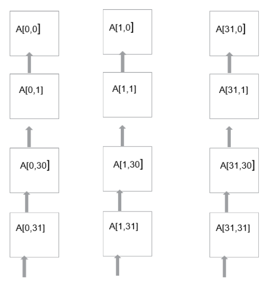
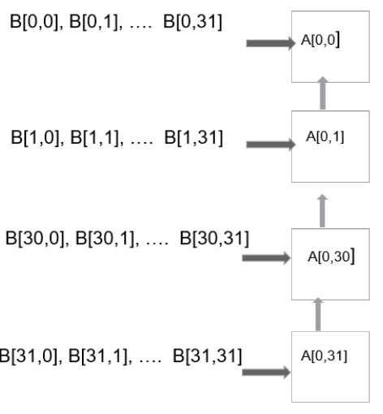
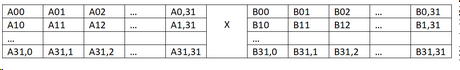
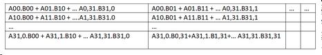
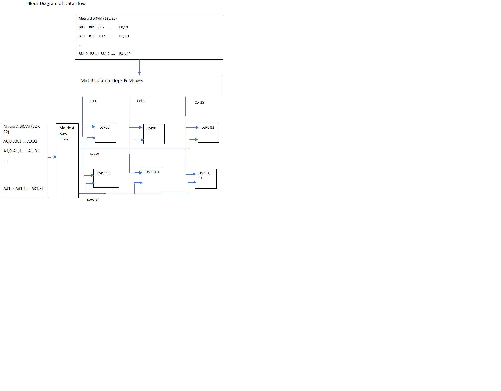

<table class="sphinxhide" style="width:100%;">
  <tr>
    <td align="center">
      <picture>
        <source media="(prefers-color-scheme: dark)" srcset="https://raw.githubusercontent.com/Xilinx/Image-Collateral/main/logo-white-text.png">
        
      </picture>
      <h1>AMD Vitis™ AI Engine Tutorials</h1>
      <a href="https://www.amd.com/en/products/software/adaptive-socs-and-fpgas/vitis.html">See Vitis™ Development Environment on amd.com</a>
        </br>
      <a href="https://www.amd.com/en/products/software/vitis-ai.html">See Vitis™ AI Development Environment on amd.com</a>
    </td>
  </tr>
</table>

# GeMM DSP58 Implementation

## Table of Contents

- [Building the Design](#building-the-design)
  - [Design Build](#design-build)
  - [Make Steps](#make-steps)
  - [Build the Entire Design with a Single Command](#build-the-entire-design-with-a-single-command)
  - [make kernels: Generates the PL Kernels](#make-kernels-generates-the-pl-kernels)
  - [make xsa: Using Vitis Tools to Link HLS Kernels with the Platform](#make-xsa-using-vitis-tools-to-link-hls-kernels-with-the-platform)
  - [Make Application: Compile the Host Application](#make-application-compile-the-host-application)
  - [Make Package: Packaging the Design](#make-package-packaging-the-design)
  - [Make Run_emu: Running Hardware Emulation](#make-run_emu-running-hardware-emulation)
  - [Running on Hardware](#targethw-running-on-hardware)
- [Hardware Design Details](#hardware-design-details)
  - [Matrix Multiplication using DSP58 Implementation Architecture](#matrix-multiplication-using-dsp58-implementation-architecture)
  - [PL Kernel Details](#pl-kernel-details)
  - [Platform Details](#platform-details)
- [Software Design Details](#software-design-details)
  - [Methodology](#methodology)
  - [PS Host Application](#ps-host-application)
- [Performance Details](#performance-details)
  - [Resource Utilization](#resource-utilization)
  - [Power](#power)
  - [Throughput and Latency](#throughput-and-latency)
  - [TOPs per Watt](#tops-per-watt)
  - [Consolidated Summary](#consolidated-summary)
- [Support](#support)

## Building the Design

### Design Build

In this section, learn to build and run the Matrix Multiplication design using the DSP58 Engines in an AMD Versal™ device. Compile the design and integrate it into a larger system design (including the PS host application).

The Makefile that builds the design takes two user inputs from command line. These are:

- TARGET (hw/hw_emu)
- GEMM_SIZE (32, 64, 128, 256, 512 or 1024)

Based on these inputs, the design flow generates a new directory (called `build/`). Underneath are subdirectories named gemm_GEMM_SIZExGEMM_SIZExGEMM_SIZE. For example, if GEMM_SIZE is 64, the system creates a subdirectory named gemm_64x64x64 under the build directory. Underneath, the system creates `hw_emu/` and/or `hw/` subfolders. These folders contain a host app executable and the builds targeted to `hw` or `hw_emu` respectively. The `hw_emu/` subfolder contains the build for hardware emulation. The `hw/` subfolder contains the build for a hardware run on a VCK190 board.

### Make Steps

To run the following `make` steps (for example, `make kernels`, `make xsa`, `make application`, and `make package`), you must be in the `gemm_dsp58/` folder. You can specify the following options in the `make` steps. This section provides instructions for how to apply them later.

- `TARGET:` You can set this option to `hw` or `hw_emu` to build the design in the hardware or hardware emulation flow. The default is `hw_emu`.
- `GEMM_SIZE:` You can set this to 32, 64, 128, 256, 512, or 1024.

The Makefile uses the following directory references:

```makefile
## Relative directory
RELATIVE_PROJECT_DIR := ./
PROJECT_REPO := $(shell readlink -f $(RELATIVE_PROJECT_DIR))
DESIGN_REPO  := $(PROJECT_REPO)/design
PL_SRC_REPO  := $(DESIGN_REPO)/pl_src
CONSTRAINTS_REPO  := $(PL_SRC_REPO)/constraints
HOST_APP_SRC := $(DESIGN_REPO)/host_app_src
SYSTEM_CONFIGS_REPO    := $(DESIGN_REPO)/system_configs
VIVADO_METRICS_SCRIPTS_REPO := $(DESIGN_REPO)/vivado_metrics_scripts

BASE_BLD_DIR := $(PROJECT_REPO)/build_$(PL_FREQ)
GEMM_BLD_DIR     := $(BASE_BLD_DIR)/gemm_$(MAT_DIMS)
BUILD_TARGET_DIR := $(GEMM_BLD_DIR)/$(TARGET)

VIVADO_REPORTS_REPO := $(PROJECT_REPO)/vivado_reports_dir
BLD_VIVADO_REPORTS_DIR := $(VIVADO_REPORTS_REPO)/gemm_$(MAT_DIMS)

EMBEDDED_PACKAGE_OUT := $(BUILD_TARGET_DIR)/package
EMBEDDED_EXEC_SCRIPT := run_script.sh

```

### Build the Entire Design with a Single Command

If you are already familiar with AMD Vitis™ kernel compilation flows, you can build the entire design with one command:

```bash
make run (default TARGET=hw_emu, GEMM_SIZE=64) 
```

or,

```bash
make run TARGET=hw (Target is hardware, GEMM_SIZE=64)
```

This command runs the `make kernels`, `make xsa`, `make application`, `make package`, and `make run_emu` steps for hardware emulation or to run on hardware (VCK190 board) depending on the `TARGET` you specify. The settings also apply to individual make steps listed in the following sections.

The system places the generated files in an individual directory: `$(BUILD_TARGET_DIR)/`. The following sections discuss each `make` step to build the design. These sections also detail the options used and the location of input and output files in each case.

</details>

Refer to [this page](https://docs.amd.com/r/en-US/ug1399-vitis-hls/vitis-v-and-vitis-run-Commands) for a detailed description of all Vitis compiler switches. The following table provides a summary of the switches used.

|Switch|Description|
|---|---|
|--target \| -t [hw\|hw_emu]|Specifies the build target.|
|--platform \| -f|Specifies the name of a supported acceleration platform as specified by the $PLATFORM_REPO_PATHS environment variable or the full path to the platform XPFM file.|
|--save-temps \| -s|Directs the Vitis compiler command to save intermediate files/directories created during the compilation and link process. Use the `--temp_dir` option to specify a location to write the intermediate files to.|
|--temp_dir <string>|This lets you manage the location where the tool writes temporary files created during the build process. The temporary results are written by the Vitis compiler. They are then removed, unless the `--save-temps` option is also specified.|
|--verbose|Display verbose/debug information.|
|--compile \| -c|Required for compilation to generate XO files from kernel source files.|
|--kernel \<arg\>\|-k \<arg\>|Compile only the specified kernel from the input file. Only one -k option is allowed per Vitis compiler command.|
|-D \| --define  \<Macro Name\>=\<value\>|Defines Macros for the compiler.|
|--output \| -o|Specifies the name of the output file generated by the V++ command. The kernel output is XO.|

The design uses the following RTL files:

```txt
${PL_SRC_REPO}/rtl/BDELAY.vhd
${PL_SRC_REPO}/rtl/FIXGEMM.vhd
${PL_SRC_REPO}/rtl/SDELAY.vhd
${PL_SRC_REPO}/rtl/sfixed_pkg.vhd
${PL_SRC_REPO}/rtl/cfixed_pkg.vhd
${PL_SRC_REPO}/rtl/DSP_GW.vhd
${PL_SRC_REPO}/rtl/FIXGEMM_WRAPPER.vhd
${PL_SRC_REPO}/rtl/control_logic.sv
${PL_SRC_REPO}/rtl/gemm_top.sv
${PL_SRC_REPO}/rtl/ps_slave.sv
${PL_SRC_REPO}/rtl/DSP_data_controller.sv
${PL_SRC_REPO}/rtl/op_uram.sv
${PL_SRC_REPO}/rtl/row_uram.sv
${PL_SRC_REPO}/rtl/col_uram.sv
${PL_SRC_REPO}/rtl/gemm_large_ocm.sv
${PL_SRC_REPO}/rtl/partial_sum_bram.sv
${PL_SRC_REPO}/rtl/synchronizer.sv

```

<!---
(For hw_emu step, Row and Column URAMs are initialized to reduce simulation run time.) These files are located under $(PL_SRC_REPO)/mem_init_files/init_files_GEMM_SIZExGEMM_SIZExGEMM_SIZE folder)
--->

`$(CONSTRAINTS_REPO)/gemm_dsp58.tcl` provides constraints for synthesis and implementation.

Following is the output xo file:

```bash
$(PROJECT_REPO)/build/gemm_GEMM_SIZExGEMM_SIZExGEMM_SIZE/gemm_large_ocm.xo

```

#### make kernels: Generates the PL Kernels

This step uses the RTL and mem_init_files specified in the preceding section to generate the PL kernel (gemm_large_ocm.xo)

#### make xsa: Using Vitis Tools to Link HLS Kernels with the Platform

After the kernel is generated, use the Vitis compiler to link it with the platform to generate an XSA file.

The Vitis tools integrates the kernels into an existing extensible platform. This is an automated step from a software developer perspective where the hardware designer provides the platform. Alternatively, you can opt to use one of the many extensible base platforms provided by AMD, and use the Vitis tools to build the hardware design and integrate the kernels into the design.

The following command shows this step:

```bash
make xsa TARGET=<hw/hw_emu> GEMM_SIZE=<64,128,256,512,1024>
```

The expanded command is as follows:

```bash
cd $(BUILD_TARGET_DIR);	\

v++ -l --platform xilinx_vck190_base_202520_1 --save-temps --temp_dir $(BUILD_TARGET_DIR)/_x \
   --verbose -g --clock.freqHz 500000000:gemm_large_ocm_0 --clock.defaultTolerance 0.001 \
   --config $(SYSTEM_CONFIGS_REPO)/gemm.cfg --vivado.prop fileset.sim_1.xsim.simulate.log_all_signals=true \
   --vivado.prop run.synth_1.{STEPS.SYNTH_DESIGN.ARGS.CONTROL_SET_OPT_THRESHOLD}={16} \
   --vivado.prop run.synth_1.{STEPS.SYNTH_DESIGN.ARGS.KEEP_EQUIVALENT_REGISTERS}={true} \
   --xp vivado_prop:run.impl_1.STEPS.PLACE_DESIGN.TCL.PRE=$(CONSTRAINTS_REPO)/gemm_dsp58.tcl
   -t hw_emu -o $(BUILD_TARGET_DIR)/gemm.hw_emu.xclbin $(PROJECT_REPO)/build/gemm_GEMM_SIZExGEMM_SIZExGEMM_SIZE/gemm_large_ocm.xo
```

Refer to [this page](https://docs.amd.com/r/en-US/ug1701-vitis-accelerated-embedded/Linking-the-System) for a detailed description of Vitis linking options. The following table provides a summary of the switches used.

|Switch|Description|
|---|---|
|--platform \| -f|Specifies the name of a supported acceleration platform as specified by the $PLATFORM_REPO_PATHS environment variable or the full path to the platform XPFM file.|
|--save-temps \| -s|Directs the V++ command to save intermediate files/directories created during the compilation and link process. Use the `--temp_dir` option to specify a location to write the intermediate files to.|
|--temp_dir <string>|This lets you manage the location where the tool writes temporary files created during the build process. The Vitis compiler writes temporary results. They are removed later unless the `--save-temps` option is specified.|
|--verbose|Display verbose/debug information.|
|--output \| -o|Specifies the name of the output file generated by the V++ command. In this design the outputs of the HLS/DSP kernels with their interfacing with the PL kernels are in XO files.|
|--vivado.prop \<arg\>|Specifies properties for the Vivado Design Suite to use during synthesis and implementation of the FPGA binary (xclbin). Refer to [this page](https://docs.amd.com/r/en-US/ug1702-vitis-accelerated-reference/vivado-Options) for detailed Vivado options.|
|--profile.data [<kernel_name>\|all]:[<cu_name>\|all]:[<interface_name>\|all]\(:[counters\|all]\)|Enables monitoring of data ports through the monitor IP cores. You must specify this option during linking. Refer to [this page](https://docs.amd.com/r/en-US/ug1701-vitis-accelerated-embedded/Profiling-the-Application) for detailed profiling options.|
|--profile.trace_memory \<FIFO\>:\<size\>\|\<MEMORY\>[\<n\>]|When building the hardware target \(-t=hw\), use this option to specify the type and amount of memory to use for capturing trace data. Refer to [this page](https://docs.amd.com/r/en-US/ug1701-vitis-accelerated-embedded/Profiling-the-Application) for detailed profiling options.|
|--config <config_file>|Specifies a configuration file containing V++ switches.|

A configuration file, `system_configs/gemm.cfg`, tells the linker how to connect the PL kernels together. It describes the overall connection scheme of the system.

```ini
[connectivity]
nk=gemm_large_ocm:1:gemm_large_ocm_0

[clock]
#id=0:gemm_large_ocm_0.S_AXI_ACLK

[advanced]
## Disable Profiling in hw_emu so that it is faster...
param=hw_emu.enableProfiling=false
## Export the xsa of the design..
param=compiler.addOutputTypes=hw_export
param=compiler.worstNegativeSlack=-1.0
[vivado]
prop=run.synth_1.STRATEGY=Flow_PerfOptimized_high
prop=run.impl_1.STEPS.OPT_DESIGN.is_enabled=true
prop=run.impl_1.STEPS.OPT_DESIGN.ARGS.DIRECTIVE=Explore
#prop=run.impl_1.STEPS.PLACE_DESIGN.ARGS.DIRECTIVE=ExtraTimingOpt
prop=run.impl_1.STEPS.PLACE_DESIGN.ARGS.DIRECTIVE=Explore

prop=run.impl_1.STEPS.PHYS_OPT_DESIGN.is_enabled=true
prop=run.impl_1.STEPS.PHYS_OPT_DESIGN.ARGS.DIRECTIVE=AggressiveExplore
#prop=run.impl_1.STEPS.ROUTE_DESIGN.ARGS.MORE OPTIONS=-tns_cleanup
prop=run.impl_1.STEPS.ROUTE_DESIGN.ARGS.DIRECTIVE=AggressiveExplore
```

Refer to [this page](https://docs.amd.com/r/en-US/ug1702-vitis-accelerated-reference/Vitis-Compiler-Configuration-File) for a detailed description of the Vitis compiler configuration file. The following table provides a summary of the configuration options used:

|Switch|Comment|
|---|---|
|--connectivity.nk|Number of kernels. `gemm_large_ocm:1:gemm_large_ocm_0` means that the Vitis compiler instantiates one gemm_large_ocm kernel and names the instance `gemm_large_ocm_0`.|
|param=hw_emu.enableProfiling=false|This option disables profiling during hw_emu for faster run time|
|param=compiler.addOutputTypes=hw_export|This option tells the Vitis compiler that besides creating an XCLBIN file, it also outputs an XSA file which is needed to create a post-Vivado fixed platform for Vitis software development.|
|param=compiler.worstNegativeSlack=-1.0|This parameter sets 210 ps tolerance for WNS|
|prop=run.synth_1.STRATEGY=Flow_PerfOptimized_high|This parameter sets Synthesis strategy|
|prop=run.impl_1.STEPS.OPT_DESIGN.is_enabled=true|This option enables opt design directive|
|prop=run.impl_1.STEPS.OPT_DESIGN.ARGS.DIRECTIVE=Explore|This option sets the value of opt design stage directive|
|prop=run.impl_1.STEPS.PLACE_DESIGN.ARGS.DIRECTIVE=ExtraTimingOpt|This option sets the value of place design directive|
|prop=run.impl_1.STEPS.PHYS_OPT_DESIGN.is_enabled=true|This option enables physical optimization directive|
|prop=run.impl_1.STEPS.PHYS_OPT_DESIGN.ARGS.DIRECTIVE=AggressiveExplore|This option sets value of physical optimization directive|
|prop=run.impl_1.STEPS.ROUTE_DESIGN.ARGS.DIRECTIVE=AggressiveExplore|This option sets value of route design directive|

The Vitis™ compiler calls the Vivado™ IP integrator under the hood to build the design. The platform and kernels are input to the Vivado Design Suite, which generates either a simulation XSA or an XSA after running place and route on the design. The `-target` option set on the Vitis compiler command line determines when Vivado produces the XSA.

You can now view the Vivado project in the `$(BUILD_TARGET_DIR)/_x/link/vivado/vpl/prj` directory. You have now generated the XCLBIN file, `$(BUILD_TARGET_DIR)/gemm.hw_emu.xclbin`, that your design uses to execute on the platform.

#### make application: Compile the Host Application

You can compile the host application by following the typical cross-compilation flow for the Cortex A72 processor. To build the application, run the following command.

```bash
make application 
```

or,

```bash
cd $(BUILD_TARGET_DIR);	\

aarch64-xilinx-linux-g++ -mcpu=cortex-a72.cortex-a53 -march=armv8-a+crc -fstack-protector-strong \
   -D_FORTIFY_SOURCE=2 -Wformat -Wformat-security -Werror=format-security --sysroot=$(SDKTARGETSYSROOT) -O -c \
   -std=c++14 -D__linux__ \
   -DM_LARGE=$(GEMM_SIZE) -DN_LARGE=$(GEMM_SIZE) -DL_LARGE=$(GEMM_SIZE) \
   -I$(SDKTARGETSYSROOT)/usr/include/xrt -I$(SDKTARGETSYSROOT)/usr/include -I$(SDKTARGETSYSROOT)/usr/lib -I$(HOST_APP_SRC)/$(MAT_DIMS) \
$(HOST_APP_SRC)/main.cpp -o $(BUILD_TARGET_DIR)/gemm_top_app.o \
   -L$(SDKTARGETSYSROOT)/lib -lxrt_coreutil

aarch64-xilinx-linux-g++  -mcpu=cortex-a72.cortex-a53 -march=armv8-a+crc -fstack-protector-strong \
   -D_FORTIFY_SOURCE=2 -Wformat -Wformat-security -Werror=format-security --sysroot=$(SDKTARGETSYSROOT) \
   $(BUILD_TARGET_DIR)/gemm_top_app.o -L$(SDKTARGETSYSROOT)/usr/lib -lxrt_coreutil \
   -o $(BUILD_TARGET_DIR)/gemm_dsp_xrt.elf
```

Refer to [this page](https://xilinx.github.io/XRT/master/html/index.html) for XRT documentation. Refer to [this page](https://docs.amd.com/r/en-US/ug1076-ai-engine-environment/Programming-the-PS-Host-Application) for details of host application programming.

|Switch|Description|
|---|---|
|-O \| Optimize.|Optimizing compilation takes more time and memory for a large function. With -O, the compiler tries to reduce code size and execution time without performing any optimizations that can take a longer compilation time.|
|-D__linux__| |
|-DXAIE_DEBUG|Enable debug interface capabilities where certain core status, event status, or stack trace can be dumped.|
|-D\<Pre-processor Macro String\>=\<value\>|Pass pre-processor macro definitions to the cross-compiler.|
|-I \<dir\>|Add the directory `dir` to the list of directories to be searched for header files.|
|-o \<file\>|Place output in file `<file>`. This applies to any output type, including executable files, object files, assembly language files, or preprocessed C code.|
|--sysroot=\<dir\>|Use `dir` as the logical root directory for headers and libraries. For example, if the compiler normally searches for headers in `/usr/include` and libraries in `/usr/lib`, it instead searches `dir/usr/include` and `dir/usr/lib`. The `env_setup.sh` script automatically sets this.|
|-l\<library\>|Search the library named `library` when linking. The 2D-FFT tutorial requires `adf_api_xrt` and `xrt_coreutil` libraries.|
|-L \<dir\>|Add directory `<dir>` to the list of directories to be searched for -l.|

The following is a description of the input sources compiled by the cross-compiler compiler command.

|Inputs Sources|Description|
|---|---|
|$(HOST_APP_SRC)/main.cpp|Source application file for the `gemm_dsp_xrt.elf` that runs on an A72 processor.|
|$(HOST_APP_SRC)/matrix_A_data.h, matrix_B_data.h|Matrix A and B Data for matrix multiplication.|
|$(HOST_APP_SRC)/output_data.h|Golden data to which the DUT output is compared.|

The following is a description of the output objects that results from executing the cross-compiler command with the preceding inputs and options.

|Output Objects|Description|
|---|---|
|$(BUILD_TARGET_DIR)/gemm_dsp_xrt.elf|The executable that runs on an A72 processor.|

#### make package: Packaging the Design

After creating the kernel outputs and the platform, you can generate the programmable device image (PDI) and a package for use on an SD card. The PDI contains all the executables, bitstreams, and device configurations. The packaged SD card directory contains everything to boot Linux, the generated applications, and the XCLBIN.

The command to run this step is as follows (default `TARGET=hw_emu`):

```bash
make package
```

or,

```bash
cp $(PROJECT_REPO)/run_script.sh $(BUILD_TARGET_DIR)/
cd $(BUILD_TARGET_DIR);	\

v++ -p -t hw --save-temps --temp_dir $(BUILD_TARGET_DIR)/_x -f xilinx_vck190_base_202520_1 \
   --package.rootfs $(XLNX_VERSAL)/rootfs.ext4 --package.kernel_image $(XLNX_VERSAL)/Image --package.boot_mode=sd \
   --package.out_dir $(BUILD_TARGET_DIR)/package --package.image_format=ext4 --package.sd_file $(BUILD_TARGET_DIR)/gemm_dsp_xrt.elf \
   $(BUILD_TARGET_DIR)/gemm.hw.xclbin
```

If the `XRT_ROOT` is set, the following Vitis compiler flags are also set:

```bash
   --package.sd_dir $(XRT_ROOT)
```

Refer to [this page](https://docs.amd.com/r/en-US/ug1702-vitis-accelerated-reference/Package-Options) for more details about packaging the system.

|Switch|Description|
|---|---|
|--target \| -t [hw\|hw_emu]|Specifies the build target.|
|--package \| -p|Packages the final product at the end of the Vitis compile and link build process.|
|--package.rootfs \<arg\>|Where \<arg\> specifies the absolute or relative path to a processed Linux root file system file. The platform RootFS file is available for download from amd.com. Refer to the [Vitis Software Platform Installation](https://docs.amd.com/r/en-US/ug1701-vitis-accelerated-embedded/Vitis-Software-Platform-Installation) for more information.|
|--package.kernel_image \<arg\>|Where \<arg\> specifies the absolute or relative path to a Linux kernel image file. Overrides the existing image available in the platform. The platform image file is available for download from amd.com. Refer to the [Vitis Software Platform Installation](https://docs.amd.com/r/en-US/ug1701-vitis-accelerated-embedded/Vitis-Software-Platform-Installation) for more information.|
|--package.boot_mode \<arg\>|Where \<arg\> specifies <ospi\|qspi\|sd> Boot mode used for running the application in emulation or on hardware.|
|--package.image_format|Where \<arg\> specifies \<ext4\|fat32\> output image file format. `ext4` is the Linux file system and `fat32` is the Windows file system.|
|--package.sd_file|Where \<arg\> specifies an ELF or other data file to package into the `sd_card` directory/image. This option can be used multiple times to specify multiple files to add to the `sd_card`.|

|Inputs Sources|Description|
|---|---|
|$(XRT_ROOT)|The PS host application needs the XRT headers in this folder to execute. Set in the `env_setup.sh`.|
|$(XLNX_VERSAL)/rootfs.ext4|The root filesystem file for PetaLinux.|
|$(XLNX_VERSAL)/Image|The pre-built PetaLinux image the processor boots from.|
|$(BUILD_TARGET_DIR)/gemm_dsp_xrt.elf|The PS host application executable created in the `make application` step.|
|$(BUILD_TARGET_DIR)/gemm.hw_emu.xclbin|The XCLBIN file created in the `make xclbin` step.|

The output of the V++ Package step is the package directory that contains the contents to run hardware emulation.

|Output Objects|Description|
|---|---|
|$(BUILD_TARGET_DIR)/package|The hardware emulation package that contains the boot file, hardware emulation launch script, the PLM and PMC boot files, the PMC and QEMU command argument specification files, and the Vivado simulation folder.|

#### make run_emu: Running Hardware Emulation

After packaging, everything is set to run hardware emulation. To run emulation, use the following command (default `TARGET=hw_emu`):

```bash
make run_emu 
```

or,

```bash
###########################################################################
Hardware Emulation Goto:
$(BUILD_TARGET_DIR)/package

and do:
./launch_hw_emu.sh or ./launch_hw_emu.sh -g (for waveform viewer)...

```

When hardware emulation is launched, you can see the QEMU simulator load. Wait for the autoboot countdown to go to zero. After a few minutes, the root Linux prompt comes up:

```bash
root@versal-rootfs-common-2025.2:~#
```

After the root prompt comes up, run the following commands to run the design:  

```bash
cd /mnt
export XILINX_XRT=/usr
./gemm_dsp_xrt.elf a.xclbin
```

The `gemm_dsp_xrt.elf` executes. After a few minutes, you can see the output with `TEST PASSED` on the console. When the system shows this, run the following keyboard command to exit the QEMU instance:

```text
#To exit QEMU Simulation
Press CtrlA, let go of the keyboard, and then press x 
```

To run with waveform, do the following:

```bash
cd $(BUILD_TARGET_DIR)/package
./launch_hw_emu.sh -g
```

This launches the XSIM Waveform Viewer. Drag and drop the signals into the viewer and click **Play** to start the emulation. Go back to the terminal and wait for the Linux prompt to show up. In the XSIM Waveform Viewer, you can observe the signals that you added to the waveform adjusting over the execution of the design. When this completes, press the pause button and close the window to end the emulation. Data Integrity mismatch due to software issue in hardware emulation and design works in hardware run.

### TARGET=hw: Running on Hardware

To run the design on hardware, rerun the following `make` steps with `TARGET=hw` and other applicable options (refer to the preceding `make` steps specified above).

```bash
make kernels TARGET=hw 
make xsa TARGET=hw 
make application TARGET=hw
make package TARGET=hw 
```

These commands create a `$(BUILD_TARGET_DIR)` folder with the kernels, xsa, and `package` for a hardware run.

Run the following step to set up the execution file, generated images, and base images (`$(BUILD_TARGET_DIR)/package/sd_card` and `$(BUILD_TARGET_DIR)/package/sd_card.img`).

```bash
make run_emu TARGET=hw 
```

These commands create a `build/hw` folder with the kernels, XCLBIN, and `package` for a hardware run. Follow steps 1-9 to run the `gemm_dsp_xrt.elf` executable on your VCK190 board.

1. Ensure your board is powered off.
2. Use an SD card writer (such as balenaEtcher) to flash the `sd_card.img` file to an SD card.
3. Plug the flashed SD card into the top slot of the VCK190 board.
4. Set the switch (`SW1 Mode\[3:0\]=1110 = OFF OFF OFF ON`).
5. Connect your computer to the VCK190 board using the USB cable included with the board.
6. Open a Tera Term terminal and select the correct COM port. Set the port settings to the following:

      ```text
      Port: <COMMXX>
      Speed: 115200
      Data: 8 bit
      Parity: none
      Stop Bits: 1 bit
      Flow control: none
      Transmit delay: 0 msec/char 0 msec/line
      ```

7. Power on the board.
8. Wait until you see the `root@versal-rootfs-common-2025_2` Linux command prompt. Press enter a few times to get past any `xinit` errors.
9. Run the following commands in the Tera Term terminal:

      ```bash
      mount /dev/mmcblk0p1 /mnt
      cd /mnt
      export XILINX_XRT=/usr

      ./gemm_dsp_xrt.elf a.xclbin
      ```

## Hardware Design Details

### Matrix Multiplication Using DSP58 Implementation Architecture

In this design, matrix multiplication is implemented using a DSP58 systolic array of size 32x32. This means that there are 32 DSP58 cascade chains, and each chain has 32 DSP58s. Thus, the 32x32 matrix is the basic matrix multiplication size. Larger matrices are broken down into submatrices of size 32x32.

Basic 32x32 multiplication is performed as follows:

1. Matrix A row data moves upwards along DSP A Port cascade chain.
2. For the first 32 clocks, data is only shifted into DSP chains.
3. After 32 clocks, row 0 of matrix A is populated in the first DSP cascade chain.
4. Row 1 is populated in the next cascade chain and so on.

This following figure illustrated this process.



#### Calculating First Row of Output Matrix

After matrix A elements are shifted into a cascade chain, the last row of matrix B is driven clock-by-clock to the bottom-most DSP of the first cascade chain, as shown in the following diagram:



The first row of output matrix is calculated as follows:

1. The bottom-most DSP calculates `A[0,31] *B[31,0]`.
2. It sends the output to upper DSP through a PCOUT cascade port.
3. On the second clock, the upper DSP starts receiving `B[30,0]`, `B[30,1]`, through `B[30,31]` (row 30 of matrix B).
4. So, on the second clock, the second DSP calculates `A[0,30]* B [30,0] + PCOUT = A[0,30] *B[30,0] + A[0,31]* B[31,0]`, and sends it up to the third DSP. The third DSP starts receiving matrix B column 29 on the third clock. It computes the third MAC operation and send it to the fourth DSP. Thus after the 32nd clock, the top DSP has generated the row 0 column 0 element of the output matrix.
5. On the second clock, the bottom DSP receives `B[31,1]`.
6. It calculates `A[0,31] * B[31,1]` which is the beginning of the MAC operation for the row 0 column 1 element of the output matrix. Row 0, column 1 calculations traverse upwards in a similar way, and on the 33rd clock, the top DSP generates the row 0 column 1 element of the output matrix.

Similarly for next 30 clocks (clocks 34 to 63), the top DSP of first cascade chain generates other 30 elements of row 0 of the output matrix.

Other rows of output matrix are calculated as follows:

1. `B[31,0]`, `B[31,1]`, through `B[31,31]` elements, that is row 31 of matrix B, is shifted to the next DSP chain every clock. Hence, the start of driving matrix A rows to subsequent DSP chains also starts with one clock delay.
2. The bottom DSP of second cascade chain starts on the second clock and it computes `A[1,31] * B[31,0]`. This is beginning of the MAC operation for row 1 column 0 element of output matrix. Thus the second cascade chain is one clock delayed with respect to the first cascade chain. It generates its 32 outputs from clock 33 to 64. These outputs are row 1 of the output matrix. Each subsequent cascade chain is one clock delayed with respect to the previous chain, and thus the last cascade chain generates row 31 outputs on clock 63 to 94.

#### 32x32 Matrix Multiplication Latency

For the first 32 clocks, Matrix A Row 0 is loaded into first cascade chain. Over next 32 clocks, First cascade chain calculates first row of output matrix, and for next 32 clocks, other rows of
output matrix are generated. However after 64 clocks, first DSP cascade chain can receive first row data for next 32x32 matrix.

Larger matrices are reduced to smaller 32x32 matrices. For example, 1Kx1Kx1K matrices are represented as follows, where each box is 32x32 matrix.



The following figure shows the output matrix.



#### Data Flow for Larger Matrices

Matrix A00 first multiplies with Matrix B00, which is the basic 32x32 matrix multiplication. Over the first 96 clocks, each DSP chain produces 32 outputs, thus total 1K outputs generate which are the partial sums for the final output. The system writes these partial sums to 64 partial sum block RAMs.

After 64 clocks, the first cascade chain completes with A00 B00 submatrix, and it then starts performing A00 B01 to calculate partial sums for the next column of the output matrix. Likewise over next 32 clocks, other DSP cascade chains also complete A00 *B00 matrix multiplication and move to A00* B01 submatrix multiplication. This way Matrix A00 multiplies with Matrix B00, B01, B02 through B0,31.

This completes A00 submatrix multiplications. Next, the system reads A01 submatrix of Matrix A, and multiplies it with the submatrices of Matrix B. The partial sums add to the partial sums previous generated, and stored. It moves along the first row of Matrix A and multiplies that submatrix with submatrices of Matrix B. This continues for 32 iterations, and in the 32nd iteration, data is written to output block RAM instead of partial sum block RAM. This completes the computation of the first row of the output matrix.

The next step is to move to the next row of Matrix A and repeat all these steps. After 32 such iterations, 1Kx1Kx1K matrix multiplication is completed.

#### Matrix Calculation Latency for Large Matrices

32x32 matrix calculation requires 96 clocks. However, the first cascade chain in the DSP58 array completes its computation after 64 clocks, and it can start receiving data for the next submatrix. Thus for 32 clocks, there is an overlap of previous and new submatrix calculations. So, the total number of clocks required for large matrix multiplication is `64 * No. of Submatrices + 32`.

In this design, the DSP clock is operating at 700 MHz (1.42 ns). The following figure shows block diagram of the design.



### PL Kernel Details

GeMM DSP RTL design can be divided into two main parts:

- Core matrix multiplication functionality in which the gemm_top module is the top level module that implements this functionality.
- Data mover logic for writing Matrix A and B data and to read the matrix output from host application. This is implemented in the ps_slave module.

In this design, core DSP logic operates at 700 MHz while rest of the logic operates at 350 MHz. There is a synchronizer module to handle the synchronization of signals going across these two clock domains

```text
 gemm_large_ocm \
 |-gemm_top \
 |-ps_slave \
 |-synchronizer
```

Under the gemm_top module, the following modules are instantiated:

| Module | Description |
| --- | --- |
| FIXGEMM_WRAPPER | Implements the systolic array of 1K DSP58 engines |
| row_uram | URAMs which store Matrix A data. Entire 1Kx1K matrix A is stored in URAMs |
| col_uram | URAMs which store Matrix B data. Entire 1Kx1K matrix B is stored in URAMs |
| partial_sum_bram | 64 partial sum block RAMs (512 x 64) to store the partial sum |
| op_uram | URAMs that store the final output of the matrix multiplication |
| DSP_data_controller | Controls input data to DSP58 array and output from DSP58 array |
| control_logic | Controls writes/reads to/from URAMs |

Underneath FIXGEMM_WRAPPER, FIXGEMM entity is instantiated, and underneath this there are DSP_GW instantiations.

### Platform Details

The base platform contains the control interface and processing system (CIPS), NoC, and the interfaces among them. The Vitis compiler linker step builds on top of the base platform by adding the PL kernels. To add the various functions in a system-level design, add the PL kernels to the base platform depending on the application (that is, the PL kernels present in each design might vary). In the design, the Vitis compiler `-l` step adds the components.

Refer to [make xsa](#make-xsa-using-vitis-tools-to-link-hls-kernels-with-the-platform) and include the following:

- `gemm_large_ocm` DSP kernel (`gemm_large_ocm.xo`)
- Connections interfaces are defined in the system configuration file

For a schematic view of the design with the extended platform as shown in the following figure, open the following in Vivado:

`build/gemm_GEMM_SIZExGEMM_SIZExGEMM_SIZE/[hw|hw_emu]/_x/link/vivado/vpl/prj/prj.xpr`

## Software Design Details

The software design discussed in the matrix multiplication tutorial consists of the following sections:

### Methodology

#### Frequency Selection

The `gemm_large_ocm` kernel operates at 700 MHz.

#### Timing Closure

For timing closure of the whole design, different implementation properties are used, as mentioned in the `make xsa` step in the preceding section. The design requires these strategies because timing is not met for default implementation settings. Routing congestion limits operating frequency to 700 MHz.

For more information about implementation strategies, refer to the *Vivado Implementation User Guide* [(UG904)](https://docs.amd.com/r/en-US/ug904-vivado-implementation).

### Data Flow

Host `ps_app` writes Matrix A and B data and enables DUT. It then polls for Done signal from DUT. When DUT is done, the host app reads the output URAM and compares the URAM read data with the golden data. Golden input matrix data for Matrix A and B, and golden expected data are stored in arrays which are then read by the host app.

#### Top Function

The system cross-compiles the PS host application (`main.cpp`) to get the executable. The flow in `main.cpp` is as follows:

1. Include the required headers and define the required macros:

   ```cpp
   #include <stdio.h>
   #include <stdlib.h>
   #include <stdint.h>
   #include <fstream>
   #include <iostream>
   #include <string>
   #include "experimental/xrt_aie.h"
   #include "experimental/xrt_kernel.h"
   #include "experimental/xrt_bo.h"
   ```

2. Include input and output arrays

   ```cpp
   #include "matrix_A_data.h"
   #include "matrix_B_data.h"
   #include "output_data.h"

   ...
   ```

3. Check the command line argument. The beginning of the A72 application is represented by the `main` function. It takes in one command line argument: an XCLBIN file.

   i. Open the device and load the XCLBIN:

      ```c++
      auto dhdl = xrtDeviceOpen(0);
      auto xclbin = load_xclbin(dhdl, xclbinFilename);
      auto top = reinterpret_cast<const axlf*>(xclbin.data());
      ```

   ii. Open the GEMM DSP58 kernel and obtain handles to start the kernel.

      ```c++
      ...
      xrtKernelHandle gemm_top_khdl;
      xrtRunHandle gemm_top_rhdl;
      ...
      gemm_top_khdl = xrtPLKernelOpen(dhdl, top->m_header.uuid, gemm_top_obj);
      gemm_top_rhdl = xrtRunOpen(gemm_top_khdl);
      ...
      ```

4. Check the main function.

   ```c++
   int main(int argc, char** argv)

   ```

5. Run the golden_check function to perform a data integrity check.

   ```c++
   void golden_check(unsigned int *mismatch_count)
   {

   uint16_t golden_data_lower;
   uint16_t golden_data_upper;
   uint32_t read_data;
   uint16_t read_data_lower;
   uint16_t read_data_upper;
   uint32_t read_addr;
   unsigned int i, Done;
   unsigned int match_count;

      // Poll for Done bit from DUT
      //printf("entered golden_check");
      //while (Done == 0) {
         // Read address 4
      //    xrtKernelReadRegister(gemm_top_khdl, 0x14, &read_data);
      //    Done = read_data & 0x1;
      //}

      // Write to indirect address control register, Vali = 1, R/W## = 1
      // Write to address 8, data = 0x3
      // xrtKernelWriteRegister (gemm_top_khdl, 0x18, 0x3);

      // Read 16 32x32 Matrices from Output URAMs from address 0x24
      // Total data is 32KB, 2-bytes read at a time, total 16K reads
      match_count = 0;
      mismatch_count = 0;
      for (i=0; i<8192; i=i+2) {
         golden_data_lower = output_data [i];
         golden_data_upper = output_data [i+1];
         xrtKernelReadRegister (gemm_top_khdl, 0x24, &read_data);
         read_data_lower = read_data & 0xFFFF;
         read_data_upper = read_data >> 16; 
         if (golden_data_lower != read_data_lower) {
            printf ("Data mismatch Addr : 0x%x, Golden Data : 0x%x, Read Data : 0x%x\n", i, golden_data_lower, read_data_lower);
            mismatch_count++;
         } else {
            //printf ("Data match Addr : 0x%x, Golden Data : 0x%x, Read Data : 0x%x\n", i, golden_data_lower, read_data_lower);
            match_count++;
         }
         if (golden_data_upper != read_data_upper) {
            printf ("Data mismatch Addr : 0x%x, Golden Data : 0x%x, Read Data : 0x%x\n", i+1, golden_data_upper, read_data_upper);
            mismatch_count++;
         } else {
            //printf ("Data match Addr : 0x%x, Golden Data : 0x%x, Read Data : 0x%x\n", i+1, golden_data_upper, read_data_upper);
            match_count++;
         }
      }  
      printf ("Match Count : %u, Mismatch Count : %u\n", match_count, *mismatch_count);
   }

   ```

#### Sub-Function Details

The following table provides details of sub-functions.

| Function | Description |
| --- | --- |
| test_gemm | Programs matrix A and B URAMs from the array data, sets other control registers, and then enables the gemm kernel. |
| check_done | Polls for the Done signal to be set from DUT. |
| read_perf | Reads the performance counter value counted by the DUT. Gemm kernel counts the number of clocks required for matrix multiplication operation. Note that this count does not include time required for input and output data movement. |
| golden_check | Compares data from Output URAM with the golden data. It maintains an error counter which decides if a test passes or fails. |
| gemm_soft_reset_pulse | Generates soft reset to DUT. |

### PS Host Application

```c++
void gemm_bring_up(void)
{

unsigned int i, j;
uint32_t uram_data;
unsigned int waddr;
    printf("Writing into registers\n");
    // 1. Write to Control register with Address autoincrement bit set to 1
    //    Write to address 0x10 data = 0x2
    xrtKernelWriteRegister(gemm_top_khdl, 0x10,  0x2);
    // 2. Write to Indirect address register value of 0
    //    Write to address 0x1C, data = 0
    xrtKernelWriteRegister(gemm_top_khdl, 0x1C,  0x0);

    // 3. Write to indirect address control register, Valid bit = 1, R/W## = 0
    //    Write to address 0x18 data = 0x1
    xrtKernelWriteRegister(gemm_top_khdl, 0x18,  0x1);

    // Write 16 32x32 A Matrices into Row URAMs at adress 0x20
    // Size of each Matrix is 2KB, total size = 32KB
    // Data is arrangde in 32-bit wide entry (4Byte)
    // So total lines = 8K
     
    printf("Writing Matrix A\n");
    waddr = 0;
    for (i=0; i<NUM_ROW_URAM; i=i+1) {   // Only 8 URAMs are populated
       for (j=0; j<(MATRIX_A_SIZE/NUM_ROW_URAM); j=j+1) { // 1024 locations written to 8 URAMs
          uram_data = matrix_A_data[MATRIX_A_SIZE/NUM_COL_URAM*i+j]; 
          xrtKernelWriteRegister (gemm_top_khdl, 0x20, uram_data);
       }
       // Increment the address
       waddr += 0x8000;
       xrtKernelWriteRegister (gemm_top_khdl, 0x1c, waddr);
    }
    
    waddr = 0x200000;
    xrtKernelWriteRegister (gemm_top_khdl, 0x1c, waddr);
    printf("Writing Matrix B\n");
    for (i=0; i<NUM_COL_URAM; i=i+1) {   // Only 8 URAMs are populated
       for (j=0; j<(MATRIX_B_SIZE/NUM_COL_URAM); j=j+1) { // 1024 locations written to 8 URAMs
          uram_data = matrix_B_data[MATRIX_B_SIZE/NUM_COL_URAM*i+j]; 
          xrtKernelWriteRegister (gemm_top_khdl, 0x20, uram_data);
       }
       // Increment the address
       waddr += 0x8000;
       xrtKernelWriteRegister (gemm_top_khdl, 0x1c, waddr);
    }
    
    // Set DUT Enable bit
    // Write to address 0x10, data = 0x3
    xrtKernelWriteRegister (gemm_top_khdl, 0x10, 0x3); 

}

```

## Performance Details

For all applications, designers must work to predefined specifications and build a system for their specific deployment by meeting their system requirements with respect to their available resources, latency, throughput, performance, and power. In this section, it is outlined how to measure those characteristics for this tutorial.

### Resource Utilization

Resource utilization and power are measured using Vivado, vcdanalyze, and Power Design Manager (PDM) for Versal (2025.2 version) tools.

The registers, CLB LUT, block RAM, URAM, and DSP Engine utilization information can be found in the Vivado project if you perform the following steps:

1. Open the Vivado project: ``$(BUILD_TARGET_DIR)/_x/link/vivado/vpl/prj/prj.xpr``.
2. Open the Implemented Design, then click **Report Utilization**.
3. In the Utilization tab (shown in the following figure), select **gemm_large_ocm_0** and view the resource utilization.

Alternatively, do `make report_metrics TARGET=hw`, (recipe expanded below), alongwith relevant options, to generate `utilization_hierarchical.txt` under `$(BLD_REPORTS_DIR)/` directory:

Resource Utilization for 32x32x32 matrix is as follows:

|          Site Type         |  Used | Fixed | Prohibited | Available | Util% |
|----------------------------|-------|-------|------------|-----------|-------|
| Registers                  | 58442 |     4 |          0 |   1799680 |  2.88 |
| CLB LUTs                   |  14594|     0 |          0 |    899840 |  1.41 |
| LOOKAHEAD8                 |   380 |     0 |          0 |    112480 |  0.12 |
| RAMB36E5                   |     0 |     0 |          0 |       967 |  0.00 |
| URAM                       |   192 |     0 |          0 |       463 | 41.47 |
| DSP58                      |  1024 |  1024 |          0 |      1968 | 52.03 |

Resource Utilization for 64x64x64 matrix is as follows:

|          Site Type         |  Used | Fixed | Prohibited | Available | Util% |
|----------------------------|-------|-------|------------|-----------|-------|
| Registers                  | 71160 |     9 |          0 |   1799680 |  4.15 |
| CLB LUTs                   | 17283 |     0 |          0 |    899840 |  2.31 |
| LOOKAHEAD8                 |   651 |     0 |          0 |    112480 |  0.58 |
| RAMB36E5                   |    64 |     0 |          0 |       967 |  6.62 |
| URAM                       |   192 |     0 |          0 |       463 | 41.47 |
| DSP58                      |  1024 |  1024 |          0 |      1968 | 52.03 |

Resource Utilization for 128x128x128 matrix is as follows:

|          Site Type         |  Used | Fixed | Prohibited | Available | Util% |
|----------------------------|-------|-------|------------|-----------|-------|
| Registers                  | 71022 |    12 |          0 |   1799680 |  4.14 |
| CLB LUTs                   | 17474 |     0 |          0 |    899840 |  2.29 |
| LOOKAHEAD8                 |   651 |     0 |          0 |    112480 |  0.58 |
| RAMB36E5                   |    64 |     0 |          0 |       967 |  6.62 |
| URAM                       |   192 |     0 |          0 |       463 | 41.47 |
| DSP58                      |  1024 |  1024 |          0 |      1968 | 52.03 |

Resource Utilization for 256x256x256 matrix is as follows:

|          Site Type         |  Used | Fixed | Prohibited | Available | Util% |
|----------------------------|-------|-------|------------|-----------|-------|
| Registers                  | 71117 |     7 |          0 |   1799680 |  4.14 |
| CLB LUTs                   | 17491 |     0 |          0 |    899840 |  2.31 |
| LOOKAHEAD8                 |   652 |     0 |          0 |    112480 |  0.58 |
| RAMB36E5                   |    64 |     0 |          0 |       967 |  6.62 |
| URAM                       |   192 |     0 |          0 |       463 | 41.47 |
| DSP58                      |  1024 |  1024 |          0 |      1968 | 52.03 |

Resource Utilization for 512x512x512 matrix is as follows:

|          Site Type         |  Used | Fixed | Prohibited | Available | Util% |
|----------------------------|-------|-------|------------|-----------|-------|
| Registers                  | 67839 |    11 |          0 |   1799680 |  3.97 |
| CLB LUTs                   | 16264 |     0 |          0 |    899840 |  2.18 |
| LOOKAHEAD8                 |   652 |     0 |          0 |    112480 |  0.58 |
| RAMB36E5                   |    64 |     0 |          0 |       967 |  6.62 |
| URAM                       |   144 |     0 |          0 |       463 | 31.10 |
| DSP58                      |  1024 |  1024 |          0 |      1968 | 52.03 |

Resource Utilization for 1024x1024x1024 matrix is as follows:

|          Site Type         |  Used | Fixed | Prohibited | Available | Util% |
|----------------------------|-------|-------|------------|-----------|-------|
| Registers                  | 70986 |    16 |          0 |   1799680 |  4.15 |
| CLB LUTs                   | 17340 |     0 |          0 |    899840 |  2.3  |
| LOOKAHEAD8                 |   652 |     0 |          0 |    112480 |  0.58 |
| RAMB36E5                   |    64 |     0 |          0 |       967 |  6.62 |
| URAM                       |   192 |     0 |          0 |       463 | 41.47 |
| DSP58                      |  1024 |  1024 |          0 |      1968 | 52.03 |

### Power

Power is measured using the Vivado tool. Use the following steps to retrieve this information from the Vivado project.

1. Open the Vivado based power.xpe in PDM.
2. Click the **dsp**  tab and  view the power consumed for the 32 x 32 x 32 design.

The following table provides a summary of power utilization:

| GeMM Configuration | Dynamic Power (W) |
|--------------------|-------------------|
|        32x32x32    |     7.469         |  
|        64x64x64    |     8.659         |
|     128x128x128    |     8.665         |
|     256x256x256    |     8.682         |
|     512x512x512    |     8.538         |
|  1024x1024x1024    |     8.682         |

### Throughput and Latency

Throughput is measured in Tera Term Operations Per Second (TOPS). After the host app completes writing matrices A and B, it drives the start signal to DUT. When DUT is done it drives the Done output. A performance counter increments for all the clocks from Start to Done. This counts the number of clocks for which DUT is active.

For the 32x32x32 configuration, two 32x32x32 matrix multiplications are done.
For each matrix, 64K MAC operations are performed, giving a total 64K * 2 = 128K MACs.
If performance counter reaches value X, that means at operating frequency of 350 MHz (period of 2.857 ns), total time taken by DUT = 2.857 x X ns

Thus TOPS = 128K MACs / (2.857 x X) ns

For the rest of the configurations, one matrix multiplication is done.

| Configuration | MACs | TOPS Calculation |
| --- | --- | --- |
| 64x64x64 | 512K | 512K MACs / (2.857 x X) ns |
| 128x128x128 | 4096K | 4096K MACs / (2.857 x X) ns |
| 256x256x256 | 32768K | 32768K MACs / (2.857 x X) ns |
| 512x512x512 | 262144K | 262144K MACs / (2.857 x X) ns |
| 1024x1024x1024 | 2097152K | 2097152K MACs / (2.857 x X) ns |

#### Summary of Throughput and Latency for all Variations

Latency of the design is given by the perf counter value read from DUT. The performance counter measures the time taken by the DUT for matrix multiplication in terms of number of clocks.

The following table shows the latency for various matrix sizes per matrix (int16) (1x clocks):

| GeMM Configuration | Data Transfer Size |  Latency in     | Latency (us)     | Matrices/s    |
|--------------------|--------------------|-----------------|------------------|---------------|
|        32x32x32    |     1024           |        34       |    0.097         |  10.29 x 10^6 |
|        64x64x64    |     4096           |       130       |    0.371         |  2.69 x 10^6  |
|     128x128x128    |    16384           |      1026       |    2.931         |  3.41 x 10^5  |
|     256x256x256    |    65536           |      8194       |   23.411         |  4.27 x 10^4  |
|     512x512x512    |   262144           |     65538       |    187.3         |  5.34 x 10^3  |
|  1024x1024x1024    |  1048576           |    524290       |   1497.8         |  6.67 x 10^2  |

>**Note**: In hw_emu, due to a simulation problem expected data and read data are off by one clock.

### TOPs per Watt

TOPS and power utilization for DSP-based matrix multiplication is more or less independent of matrix size. TOPS is 1.35 and TOPs per Watt is 0.206 to 0.2189 in this design.

| GeMM Configuration | TOPs/W        |
|--------------------|---------------|
|        32x32x32    |  0.180649     |
|        64x64x64    |  0.163015     |
|     128x128x128    |  0.165125     |
|     256x256x256    |  0.165083     |
|     512x512x512    |  0.167903     |
|  1024x1024x1024    |  0.165123     |

### Consolidated Summary

The following table shows a summary of throughput and latency for all variations.

| GeMM Configuration |  perf (in MSPS)   | Latency(us)      |  Matrices/s   |    TOPs   | No.of Active Cores | Vector Load | No. of Active mem Banks | Mem R/W Rate | Active AIE Tiles | Dynamic Power (mW) | TOPs per Watt  |
|--------------------|-------------------|------------------|---------------|-----------|--------------------|-------------|-------------------------|--------------|------------------|--------------------|----------------|
|        32x32x32    |   10541.176       |  0.097           | 10.29 x 10^6  | 1.34927   |        NA          |    NA       |         NA              |    NA        |      NA          |      7469          |    0.180649    |
|        64x64x64    |   11027.692       |  0.371           | 2.69 x 10^6   | 1.41154   |        NA          |    NA       |         NA              |    NA        |      NA          |      8659          |    0.163015    |
|     128x128x128    |    5589.083       |  2.931           | 3.41 x 10^5   | 1.43081   |        NA          |    NA       |         NA              |    NA        |      NA          |      8665          |    0.165125    |
|     256x256x256    |    2799.316       |  23.411          | 4.27 x 10^4   | 1.43325   |        NA          |    NA       |         NA              |    NA        |      NA          |      8682          |    0.165083    |
|     512x512x512    |    1399.957       |  187.25          | 5.34 x 10^3   | 1.43356   |        NA          |    NA       |         NA              |    NA        |      NA          |      8538          |    0.167903    |
|  1024x1024x1024    |     699.997       |  1497.9          | 6.67 x 10^2   | 1.43359   |        NA          |    NA       |         NA              |    NA        |      NA          |      8682          |    0.165123    |

## Support

GitHub issues are used for tracking requests and bugs. For questions go to [forums.amd.com](https://adaptivesupport.amd.com/s/topiccatalog?language=en_US).

<p class="sphinxhide" align="center"><sub>Copyright © 2020–2026 Advanced Micro Devices, Inc.</sub></p>

<p class="sphinxhide" align="center"><sup><a href="https://www.amd.com/en/corporate/copyright">Terms and Conditions</a></sup></p>
