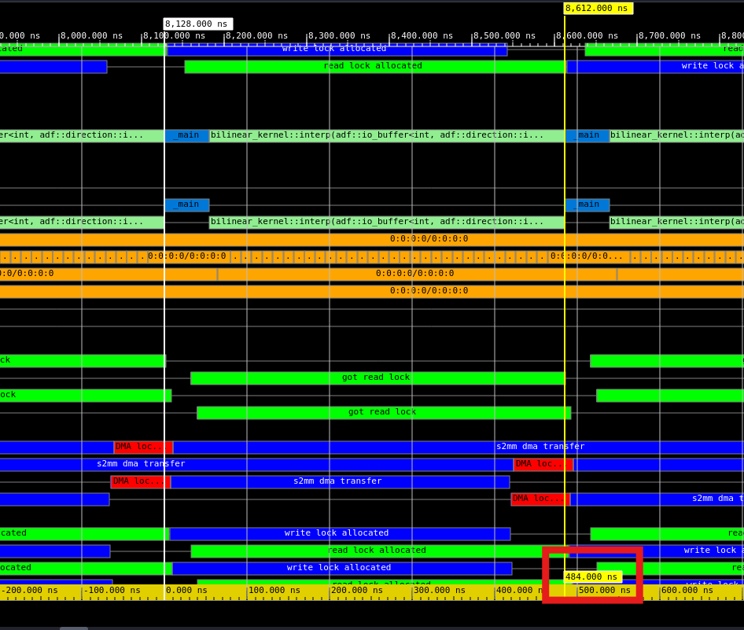

<table class="sphinxhide" width="100%">
 <tr width="100%">
    <td align="center"><h1>AI Engine Development</h1>
    <a href="https://www.xilinx.com/products/design-tools/vitis.html">See Vitis™ Development Environment on xilinx.com</br></a>
    <a href="https://www.xilinx.com/products/design-tools/vitis/vitis-ai.html">See Vitis™ AI Development Environment on xilinx.com</a>
    </td>
 </tr>
</table>

# Bilinear Interpolation

***Version: Vitis 2024.1***

## Table of Contents

1. [Introduction](#introduction)
2. [Computing Interpolated Values](#computing-interpolated-values)
3. [Design Assumptions](#design-assumptions)
4. [AI Engine Code Vectorization](#ai-engine-code-vectorization)
5. [Data Interface](#data-interface)
6. [AI Engine Kernel Processing](#ai-engine-kernel-processing)
7. [Running the Example](#running-the-example)
8. [Analyzing Results](#analyzing-results)
9. [Customizing the Example](#customizing-the-example)

[References](#references)

[Support](#support)

[License](#license)

## Introduction

Bilinear interpolation is a method for interpolating functions of two variables using repeated linear interpolation. It is commonly used in the following applications:

- Image processing and computer vision, where it is used to resample images and textures. For example, when zooming in or out of an image, bilinear interpolation can be used to estimate color values of new pixels based on color values of the original pixels. [[1]] [[2]]
- Finite element analysis, where it is used to estimate values of variables such as stress and strain between nodes in a finite element mesh. [[3]]
- Geographic information systems, where it is used to interpolate elevation or other spatial data from a grid of points. [[4]]
- Computer graphics, where it is used to map textures onto 3D surfaces or perform texture filtering. [[5]]

Bilinear interpolation is one of the simplest and fastest interpolation methods, but it can also introduce some artifacts such as blurring or aliasing. More advanced interpolation methods, such as bicubic interpolation or spline interpolation, can produce smoother and more accurate results, but they are also more computationally expensive.

## Computing Interpolated Values

The problem of bilinear interpolation is illustrated in Figure 1. It is assumed you know the values of a function at points $(x_1, y_1)$, $(x_1, y_2)$, $(x_2, y_1)$, and $(x_2, y_2)$ defined on a grid, which for practical purposes, can be assumed to be rectilinear. The goal is to estimate the function value at a point with coordinates $(x_q, y_q)$ by using the known values at the surrounding points. In Figure 1, green dots represent known values, and the red dot represents the value to be estimated.


*Figure 1 - Bilinear Interpolation Problem*

Bilinear interpolation can be viewed as a two-step process, where linear interpolation is first performed over one dimension then the other. The first step of the process is shown in Figure 2, where the function values at the blue dots are computed from the known values at the green dots by using linear interpolation over the variable $x$.


*Figure 2 - First Linear Interpolation*

These two intermediate points can be expressed in terms of the known values as

$$f(x_q,y_1) = \frac{(x_2-x_q)}{(x_2-x_1)}f(x_1,y_1) + \frac{(x_q-x_1)}{(x_2-x_1)}f(x_2,y_1)$$

and

$$f(x_q,y_2) = \frac{(x_2-x_q)}{(x_2-x_1)}f(x_1,y_2) + \frac{(x_q-x_1)}{(x_2-x_1)}f(x_2,y_2).$$

The second step of the process is shown in Figure 3, where the desired value at the red dot is derived from the computed values at the blue dots using linear interpolation over the variable $y$.


*Figure 3 - Second Linear Interpolation*

The resulting interpolated point is

$$f(x_q,y_q) = \frac{(y_2-y_q)}{(y_2-y_1)}f(x_q,y_1) + \frac{(y_q-y_1)}{(y_2-y_1)}f(x_q,y_2).$$

Combining equations, the bilinear interpolation formula may be expressed as

$$f(x_q,y_q) = \frac{1}{(x_2-x_1)(y_2-y_1)} \begin{bmatrix} x_2-x_q & x_q-x_1 \end{bmatrix} \begin{bmatrix} f(x_1,y_1) & f(x_1,y_2) \\ 
f(x_2,y_1) & f(x_2,y_2) \end{bmatrix} \begin{bmatrix} y_2-y_q \\
y_q-y_1 \end{bmatrix}.$$

## Design Assumptions

While bilinear interpolation may be applied in various applications, an image processing example is used here. In this case, function values correspond to pixel values in the range [0, 255]. Single precision, floating-point numerical format is assumed for interpolated pixel values and interpolation coordinates $(x_q,y_q)$.

A reference image is used to generate a lookup table which provides input to the AI Engine. An input image with resolution $x_{res} \times y_{res}$ is assumed to have pixels defined on a grid with unit spacing. The $x$ and $y$ pixel coordinates may be combined using the equation $I = x \times y_{res} + y$ to derive a LUT index $I$, as shown in Figure 4.


*Figure 4 - Image as a Lookup Table*

For any query point, $(x_q,y_q)$, the floating point coordinates can be separated into integer and fractional parts, where $x_q = x_{int}.x_{frac}$ and $y_q = y_{int}.y_{frac}$. The integer parts are used to extract pixel values used in the interpolation equation. The four values required for interpolation are obtained from the LUT using the following relations:

$$
\begin{aligned}
&f(x_1,y_1) = LUT(x_{int} * y_{res} + y_{int}) \\
&f(x_1,y_2) = LUT(x_{int} * y_{res} + y_{int} + 1) \\
&f(x_2,y_1) = LUT((x_{int} + 1) * y_{res} + y_{int}) \\
&f(x_2,y_2) = LUT((x_{int} + 1) * y_{res} + y_{int} + 1).
\end{aligned}
$$

An example of LUT indexing is shown in Figure 4 using the pixels marked with X. Once the four pixel values required for interpolation are obtained, the integer parts of the coordinates $(x_q,y_q)$ are no longer needed and can be assumed to be zero. This simplifies the interpolation equation to

$$
f(x_q,y_q) = \begin{bmatrix} 1-x_{frac} & x_{frac} \end{bmatrix} \begin{bmatrix} f(x_1,y_1) & f(x_1,y_2) \\
f(x_2,y_1) & f(x_2,y_2) \end{bmatrix} \begin{bmatrix} 1-y_{frac} \\
y_{frac} \end{bmatrix}
$$

or expressed as an inner product

$$
f(x_q,y_q) = \begin{bmatrix} (1-x_{frac})(1-y_{frac}) & (1-x_{frac})y_{frac} & x_{frac}(1-y_{frac}) & x_{frac}y_{frac} \end{bmatrix}
\begin{bmatrix} f(x_1,y_1) \\
f(x_1,y_2) \\
f(x_2,y_1) \\
f(x_2,y_2) \end{bmatrix}.
$$

## AI Engine Code Vectorization

To realize advantages of AI Engine processing, computations must be vectorized. Applying this to pixel interpolation, the calculation may be restated as

$$f(x_q,y_1) = x_{frac}f(x_2,y_1) + f(x_1,y_1) - x_{frac}f(x_1,y_1)$$

and

$$f(x_q,y_2) = x_{frac}f(x_2,y_2) + f(x_1,y_2) - x_{frac}f(x_1,y_2)$$

for the first two interpolations in the x coordinate, and

$$f(x_q,y_q) = y_{frac}f(x_q,y_2) + f(x_q,y_1) - y_{frac}f(x_q,y_1)$$

for the final interpolation in the y coordinate. By reformulating the computation in this way, the first two terms in each equation represent a multiply-accumulate (MAC) operation which may be used in a follow-on multiply and subtract from accumulator (MSC) operation to obtain the result. Each interpolated pixel requires 3 MAC plus 3 MSC operations.

This example uses single precision floating-point for computation. Figure 5 shows the floating-point vector unit of an AI Engine, where it may be observed that the multiply and accumulator units are designed to process eight lanes in parallel. SIMD parallelism is realized by using a pixel-per-lane approach. Since each pixel requires 3 MAC plus 3 MSC operations, each of which may be executed in a single clock cycle, a lower limit on computation requirement would be 0.75 cycles per pixel. This bound on computation should be viewed as a ballpark estimate on expected performance, which is likely unachievable due to overhead, bandwidth limitations, and pipelining inefficiencies.


*Figure 5 - Floating-Point Vector Unit*

## Data Interface

When mapping algorithms to AI Engines, the process often becomes a tradeoff between computational efficiency, data bandwidth, and memory utilization. In the previous section, a value of 0.75 cycles per pixel was derived as a lower bound on computational efficiency. Data interfaces are examined next to determine limitations they impose and to provide guidance on a suitable choice.

### Programmable Logic Component

When considering system partitioning, tasks such as retrieving data from lookup tables and extracting integer and fractional parts of floating-point numbers are better suited to be performed in programmable logic. Efficient use of AI Engines is realized when they are programmed to continually perform vector processing on a steady stream of input data.

Data necessary to process a single pixel is comprised of four reference pixels and fractional parts of the $x_q$ and $y_q$ coordinates. Each of these six data values is assumed to be represented as 32-bit, single precision, floating-point values. A conceptual illustration of how input data is derived in programmable logic for each pixel is shown in Figure 6. This example design does not include a programmable logic component but assumes such a component has been used to generate test input data for AI Engine processing.


*Figure 6 - Derivation of Input Pixel Data*

### PLIO Interface

Considering that input requires 6 floating-point values per pixel while output is a single floating-point value, it is apparent that the input stream places a more restrictive limit on achievable pixel processing rate. The PLIO interface supports transfer rates of 1 floating-point value per cycle, which depending on speed grade of the AMD Versal™ device, amounts to transfer rates of 1.0 to 1.25 billion floating-point values per second. Since the input requires 6 floating-point values per pixel, the input PLIO would restrict the rate to 6.0 cycles per pixel. In order to match the input limitation more closely to computational efficiency, 3 input PLIO interfaces are used, which brings the limitation down to 2.0 cycles per pixel. The data format for each of the input PLIO interfaces is shown in Figure 7.


*Figure 7 - Input PLIO Data Format*

### AI Engine Test Vectors

When AI Engines graphs are simulated apart from programmable logic and processing systems, text files are used to provide input data. This example uses MATLAB® to generate test vectors, which are sequences of `int32` numbers. Although actual data is single precision floating-point, it is difficult to express such numbers in text format. In order to capture full precision, the 32 bits used to represent a floating-point number (sign, exponent, mantissa) are written as equivalent `int32` values. A similar format is used for files containing output data.

## AI Engine Kernel Processing

### Kernel Data Interface

The kernel example presented here uses buffered I/O for input and output. This allows for more efficient VLIW parallelism, where load and store instructions can be executed in the same clock cycle as vector processor instructions. The tradeoff is that there is an increased initial latency. Also, the compiler inserts ping pong buffers for each I/O allocated from AI Engine tile memory. Since this example has three inputs and a single output, a total of eight memory banks will be required. This means additional AI Engine tiles are used to accommodate the memory requirement.

Another option for I/O is to use direct streaming to or from the AI Engine. There are two 32-bit input and two 32-bit output streams available. Although this would eliminate the need for ping pong buffers, additional cycles would be used in the kernel code to shift vector data. For example, if a `float` vector of size 8 is sent to an output stream, eight clock cycles would be required.

A final option for kernel I/O is possible if the source or destination of data is another AI Engine tile. In this case, the cascade interface may be used. A `float` vector of size 8 could be transferred each clock cycle using the cascade interface.

### Kernel Code

To improve compute efficiency, kernel code is created to take advantage of VLIW instructions that perform simultaneous vector multiply, load, and store operations. Each invocation of the kernel processes 256 pixels, but this may be changed when generating test vectors for simulation. The kernel code shown here processes two interpolations over the x coordinate followed by an interpolation over the y coordinate for each loop using vectors of size 8. Computation is performed using AI Engine vector instrinsic functions.

```cpp
void bilinear_kernel::interp(input_buffer<int32, extents<BUFFER_SIZE_IN>>& __restrict in_A, 
                             input_buffer<int32, extents<BUFFER_SIZE_IN>>& __restrict in_B, 
                             input_buffer<int32, extents<BUFFER_SIZE_IN>>& __restrict in_C, 
                             output_buffer<int32, extents<BUFFER_SIZE_OUT>>& __restrict out)
{
    // iterators for input & output buffers
    auto pInA = aie::begin_vector<8>(in_A);
    auto pInB = aie::begin_vector<8>(in_B);
    auto pInC = aie::begin_vector<8>(in_C);
    auto pOut = aie::begin_vector<8>(out);

    for (unsigned i = 0; i < PXLPERGRP/8; i++)
        chess_prepare_for_pipelining
        chess_loop_count(PXLPERGRP/8)
    {
        // get data for first x interpolation
        auto xfrac = (*pInA++).cast_to<float>();
        auto p11 = (*pInB++).cast_to<float>();
        auto p21 = (*pInC++).cast_to<float>();

        // compute first x interpolation
        auto tempy1 = fpmac(p11,xfrac,0,0x76543210,p21,0,0x76543210);
        auto pxy1 = fpmsc(tempy1,xfrac,0,0x76543210,p11,0,0x76543210);

        // get data for second x interpolation
        auto p12 = (*pInB++).cast_to<float>();
        auto p22 = (*pInC++).cast_to<float>();

        // compute second x interpolation
        auto tempy2 = fpmac(p12,xfrac,0,0x76543210,p22,0,0x76543210);
        auto pxy2 = fpmsc(tempy2,xfrac,0,0x76543210,p12,0,0x76543210);

        // get data for y interpolation
        auto yfrac = (*pInA++).cast_to<float>();

        // compute y interpolation
        auto tempxy = fpmac(pxy1,yfrac,0,0x76543210,pxy2,0,0x76543210);
        auto pxy = fpmsc(tempxy,yfrac,0,0x76543210,pxy1,0,0x76543210);

        // write interpolated pixels to output
        *pOut++ = as_v8int32(pxy);
    }
}
```

## Running the Example

Running the example requires that both MATLAB and AMD Vitis™ tools are installed and configured correctly. After downloading the files, cd into the ``.../bilinear_interpolation/aie/`` directory and use the make build process.

### Generating Test Vectors

Prior to running the AI Engine graph simulation, test vectors are required to provide input. Files are also provided to compare with AI Engine simulator output for verification. To generate the vectors, run the command:

```bash
$ make gen_vectors
```

### Running x86 Simulation

To perform a functional x86 simulation, enter the following sequence of commands:

```bash
$ make x86com
$ make x86sim
$ make check_x86sim
```

The first command compiles graph code for simulation on an x86 processor, the second command runs the simulation, and the final command invokes MATLAB to compare the simulator output with test vectors.

### Running AI Engine Simulation

To perform AI Engine emulation using the SystemC simulator, enter the following sequence of commands:

```bash
$ make aiecom
$ make aiesim
$ make check_aiesim
```

The first command compiles graph code for the SystemC simulator, the second command runs the simulation, and the final command invokes MATLAB to compare simulation output with test vectors. If it is desired to generate trace and profile data during simulation, use the sequence:

```bash
$ make aiecom
$ make profile
$ make check_aiesim
```

## Analyzing Results

### Vitis Analyzer

Vitis Analyzer is an essential tool for accessing information on compilation, simulation, and implementation of AI Engine graphs. It can be used to obtain a summary on profiling data and to graphically display trace events. The tool may be invoked with the ``vitis_analyzer`` command, or for this example, by entering:

```bash
$ make analyze
```

The Graph view displays connectivity of the AI Engine graph, which for this example, is displayed in Figure 8. This simple example shows the kernel along with ping pong buffers associated with input and output ports.


*Figure 8 - Vitis Analyzer Graph View*

The Array view displays how the AI Engine graph is mapped to the AI Engine array for the device specified. This example uses a VC1902 Versal AI Core device which contains 400 AI Engine tiles. As shown in Figure 9, this example utilizes one tile for kernel processing and two additional tiles for ping pong buffer and system memory. If more control over placement of memory is desired, design constraints may be specified.


*Figure 9 - Vitis Analyzer Array View*

Figure 10 contains information from the Profile view. The highlighted fields show that the bilinear interpolation kernel takes 537 cycles to process 256 pixels of data. For lowest speed Versal devices, this would translate to a peak processing rate of ~476.7 MP/s. Highest speed devices would have a peak processing rate of ~595.9 MP/s. Kernel computation can be further improved by coding to take advantage of more efficient software pipelining, which has shown that a rate of 667 MP/s is achievable.


*Figure 10 - Vitis Analyzer Profile View*

This specific example does not achieve the rates mentioned because it is limited by data bandwidth. Figure 11 shows part of the Vitis Analyzer trace view. The cursors show that the time between the end of one kernel invocation to the end of the next is 484.0 ns. During this duration 256 pixels are processed, resulting in a rate of 528.9 MP/s.



*Figure 11 - Vitis Analyzer Trace View*

### Test Vector Comparison

When comparing simulation results against test vectors, a MATLAB script is invoked to perform the processing. An example of a successful comparison is shown in Figure 12.


*Figure 12 - Simulation Verification*

The output provides three different indications of simulation performance. The first is an indication of whether the simulation output matched the corresponding test vector. There will be one comparison for each kernel simulated. The script compares `int32` values which represent floating-point interpolated pixel values. Since there may be slight variations in floating point calculations, the comparison allows for mismatch in the least significant mantissa bits of the floating-point number and may be specified in the comparison script.

The second comparison indicates maximum pixel value difference between AIE simulation results and single precision MATLAB generated vectors. Pixels take on values in the range [0, 255], and this result provides the maximum of the differences between all pairs of corresponding pixels.

The final comparison indicates the maximum pixel value difference between AI Engine simulation results and double precision floating-point results generated by the MATLAB ``interp2`` function.

## Customizing the Example

This example may be easily customized to use different test images, to use a specified output resolution, or to use multiple parallel processing cores for increased throughput. When generating test vectors, instead of using the Makefile, one may manually run scripts in MATLAB with desired function arguments. For example, the equivalent to

```bash
$ make gen_vectors
```

is to invoke MATLAB and run

```bash
>> image_transform
>> genvectors_bilinear_interp
```

### Specifying a Test Image and Output Resolution

The ``image_transform`` function uses file ``../images/epyc.jpg`` as a test image by default. A different file named ``image_file`` may be specified when invoking the function in MATLAB. 

```bash
>> image_transform('image_file')
```

Default output resolution in pixels is 1024 $\times$ 1024. A different resolution of $x_{res} \times y_{res}$ may be specified by invoking

```bash
>> image_transform('image_file', [ xres  yres ])
```

The ``image_transform`` function reads the test image file, performs a sequence of linear transformations on image pixel coordinates, and stores these transformations in a file named ``bli_coords.mat`` along with the test image pixel array. When this function is executed in MATLAB, a sequence of image transformations are displayed.

### Multicore Processing

The ``genvectors_bilinear_interp`` function generates test vector files assuming a single AI Engine kernel is used for processing. To utilize multiple kernels in parallel, invoke the function as:

```bash
>> genvectors_bilinear_interp(N)
```

where, N is the number of desired kernels. This function extracts one of the coordinate transformations from file ``bli_coords.mat``, performs bilinear interpolation on the pixels, and creates input and output test vectors for AI Engine simulation. The function also generates a file named ``config.h`` used by the AI Engine compiler and simulator to specify number of kernels and number of kernel invocations required to process the entire test image. This function also performs bilinear interpolation in double precision using the MATLAB ``interp2`` function and stores the result in file ``golden_ref.mat``.

As an example, specifying four kernels should result in the MATLAB Console Window displaying something like

```
>> genvectors_bilinear_interp(4)
Number of output pixels interpolated = 453221 out of 1048576 (43.22252 %)
Maximum pixel error is 0.000052940
Mean square pixel error is 0.000000000
```

along with the image shown in Figure 13.


*Figure 13 - MATLAB genvectors_bilinear_interp Output*

Once these MATLAB scripts are run, the rest of the AI Engine build and simulation process proceeds in the same manner. Figure 14 shows how four kernels are assigned to tiles in the AI Engine array.


*Figure 14 - Multicore Kernel Placement in AI Engine Array*

Figure 15 shows the result of comparing multicore AI Engine simulation output with test vectors. Based on profile results, four kernels will support peak processing rates in the range of approximately 1.7 to 2.1 GP/s, depending on device speed grade.


*Figure 15 - Multicore Simulation Verification*

## References

[1]:<https://en.wikipedia.org/wiki/Bilinear_interpolation> "Bilinear interpolation"

[[1]]: Bilinear interpolation. 17 May 2023, 14:05 UTC. In Wikipedia: The Free Encyclopedia. Wikimedia Foundation Inc. Encyclopedia on-line. Available from https://en.wikipedia.org/wiki/Bilinear_interpolation. Internet. Retrieved 4 August 2023.

[2]: <https://ieeexplore.ieee.org/document/1409828> "A novel approach to real-time bilinear interpolation"
[[2]]: K. T. Gribbon and D. G. Bailey, "A novel approach to real-time bilinear interpolation," Proceedings. DELTA 2004. Second IEEE International Workshop on Electronic Design, Test and Applications, Perth, WA, Australia, 2004, pp. 126-131, doi: 10.1109/DELTA.2004.10055.

[3]: <https://en.thedailyscoup.news/2023/03/05/interpolation-formula-understanding-the-basics-and-applications/> "Interpolation Formula: Understanding the Basics and Applications"

[[3]] Chen, J. (2023, March 5). *Interpolation Formula: Understanding the Basics and Applications.* The Daily Scoup News. https://en.thedailyscoup.news/2023/03/05/interpolation-formula-understanding-the-basics-and-applications/

[4]: <https://ieeexplore.ieee.org/document/9943113> "Super-Resolution of Digital Elevation Model with Local Implicit Function Representation"

[[4]] P. He et al., "Super-Resolution of Digital Elevation Model with Local Implicit Function Representation," 2022 International Conference on Machine Learning and Intelligent Systems Engineering (MLISE), Guangzhou, China, 2022, pp. 111-116, doi: 10.1109/MLISE57402.2022.00030.

[5]: <https://bartwronski.com/2020/04/14/bilinear-texture-filtering-artifacts-alternatives-and-frequency-domain-analysis/> "Bilinear texture filtering – artifacts, alternatives, and frequency domain analysis"

[[5]] Wronski, B. (2020, April 14). *Bilinear texture filtering – artifacts, alternatives, and frequency domain analysis.* https://bartwronski.com/2020/04/14/bilinear-texture-filtering-artifacts-alternatives-and-frequency-domain-analysis/

## Support

GitHub issues will be used for tracking requests and bugs. For questions, go to [support.xilinx.com](http://support.xilinx.com/).


<p class="sphinxhide" align="center"><sub>Copyright © 2020–2024 Advanced Micro Devices, Inc</sub></p>
<p class="sphinxhide" align="center"><sup><a href="https://www.amd.com/en/corporate/copyright">Terms and Conditions</a></sup></p>
