<!--
Copyright (C) 2023, Advanced Micro Devices, Inc. All rights reserved.
SPDX-License-Identifier: MIT
Author: Richard Buz
-->
<table class="sphinxhide" width="100%">
 <tr width="100%">
    <td align="center"><h1>AI Engine Development</h1>
    <a href="https://www.xilinx.com/products/design-tools/vitis.html">See Vitis™ Development Environment on xilinx.com</br></a>
    <a href="https://www.xilinx.com/products/design-tools/vitis/vitis-ai.html">See Vitis™ AI Development Environment on xilinx.com</a>
    </td>
 </tr>
</table>

# Bilinear Interpolation

***Version: Vitis 2023.1***

## Table of Contents

1. [Introduction](#introduction)
2. [Computing Interpolated Values](#computing-interpolated-values)
3. [Design Assumptions](#design-assumptions)
4. [Programmable Logic Interface](#programmable-logic-interface)
5. [AI Engine Code Vectorization](#ai-engine-code-vectorization)
6. [Running the Example](#running-the-example)
7. [Analyzing Results](#analyzing-results)
8. [Customizing the Example](#customizing-the-example)

[References](#references)

[Support](#support)

[License](#license)

## Introduction

Bilinear interpolation is a method for interpolating functions of two variables using repeated linear interpolation. It is commonly used in the following applications:

- Image processing and computer vision, where it is used to resample images and textures. For example, when zooming in or out of an image, bilinear interpolation can be used to estimate color values of new pixels based on color values of the original pixels. [[1]] [[2]]
- Finite element analysis, where it is used to estimate values of variables such as stress and strain between nodes in a finite element mesh. [[3]]
- Geographic information systems, where it is used to interpolate elevation or other spatial data from a grid of points. [[4]]
- Computer graphics, where it is used to map textures onto 3D surfaces or perform texture filtering. [[5]]

Bilinear interpolation is one of the simplest and fastest interpolation methods, but it can also introduce some artifacts such as blurring or aliasing. More advanced interpolation methods, such as bicubic interpolation or spline interpolation, can produce smoother and more accurate results, but they are also more computationally expensive.

## Computing Interpolated Values

The problem of bilinear interpolation is illustrated in Figure 1. It is assumed you know the values of a function at points $(x_1, y_1)$, $(x_1, y_2)$, $(x_2, y_1)$, and $(x_2, y_2)$ defined on a grid, which for practical purposes, can be assumed to be rectilinear. The goal is to estimate the function value at a point with coordinates $(x_q, y_q)$ by using the known values at the surrounding points. In Figure 1, green dots represent known values, and the red dot represents the value to be estimated.

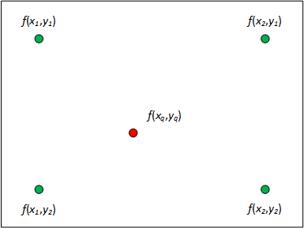

*Figure 1 - Bilinear Interpolation Problem*

Bilinear interpolation can be viewed as a two-step process, where linear interpolation is first performed over one dimension then the other. The first step of the process is shown in Figure 2, where the function values at the blue dots are computed from the known values at the green dots by using linear interpolation over the variable $x$.


*Figure 2 - First Linear Interpolation*

These two intermediate points can be expressed in terms of the known values as

$$f(x_q,y_1) = \frac{(x_2-x_q)}{(x_2-x_1)}f(x_1,y_1) + \frac{(x_q-x_1)}{(x_2-x_1)}f(x_2,y_1)$$

and

$$f(x_q,y_2) = \frac{(x_2-x_q)}{(x_2-x_1)}f(x_1,y_2) + \frac{(x_q-x_1)}{(x_2-x_1)}f(x_2,y_2).$$

The second step of the process is shown in Figure 3, where the desired value at the red dot is derived from the computed values at the blue dots using linear interpolation over the variable $y$.

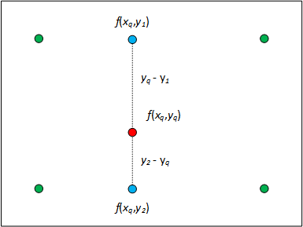

*Figure 3 - Second Linear Interpolation*

The resulting interpolated point is

$$f(x_q,y_q) = \frac{(y_2-y_q)}{(y_2-y_1)}f(x_q,y_1) + \frac{(y_q-y_1)}{(y_2-y_1)}f(x_q,y_2).$$

Combining equations, the bilinear interpolation formula may be expressed as

$$f(x_q,y_q) = \frac{1}{(x_2-x_1)(y_2-y_1)} \begin{bmatrix} x_2-x_q & x_q-x_1 \end{bmatrix} \begin{bmatrix} f(x_1,y_1) & f(x_1,y_2) \\ 
f(x_2,y_1) & f(x_2,y_2) \end{bmatrix} \begin{bmatrix} y_2-y_q \\
y_q-y_1 \end{bmatrix}.$$

## Design Assumptions

While bilinear interpolation may be applied in various applications, an image processing example is used here. In this case, function values correspond to pixel values in the range [0, 255]. Single precision, floating-point numerical format is assumed for interpolated pixel values and interpolation coordinates $(x_q,y_q)$.

A reference image is used to generate a lookup table which provides input to the AI Engine. An input image with resolution $x_{res} \times y_{res}$ is assumed to have pixels defined on a grid with unit spacing. The $x$ and $y$ pixel coordinates may be combined using the equation $I = x \times y_{res} + y$ to derive a LUT index $I$, as shown in Figure 4.

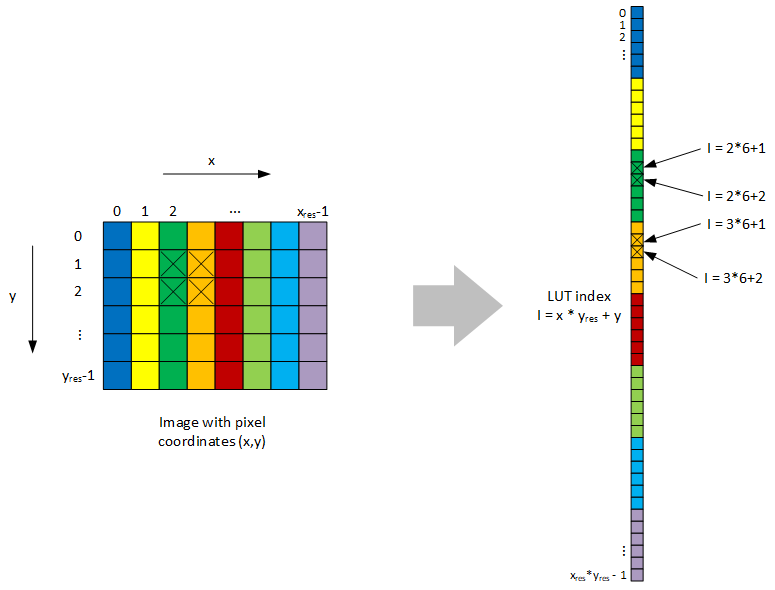

*Figure 4 - Image as a Lookup Table*

For any query point, $(x_q,y_q)$, the floating point coordinates can be separated into integer and fractional parts, where $x_q = x_{int}.x_{frac}$ and $y_q = y_{int}.y_{frac}$. The integer parts are used to extract pixel values used in the interpolation equation. The four values required for interpolation are obtained from the LUT using the following relations:

$$
\begin{aligned}
&f(x_1,y_1) = LUT(x_{int} * y_{res} + y_{int}) \\
&f(x_1,y_2) = LUT(x_{int} * y_{res} + y_{int} + 1) \\
&f(x_2,y_1) = LUT((x_{int} + 1) * y_{res} + y_{int}) \\
&f(x_2,y_2) = LUT((x_{int} + 1) * y_{res} + y_{int} + 1).
\end{aligned}
$$

An example of LUT indexing is shown in Figure 4 using the pixels marked with X. Once the four pixel values required for interpolation are obtained, the integer parts of the coordinates $(x_q,y_q)$ are no longer needed and can be assumed to be zero. This simplifies the interpolation equation to

$$
f(x_q,y_q) = \begin{bmatrix} 1-x_{frac} & x_{frac} \end{bmatrix} \begin{bmatrix} f(x_1,y_1) & f(x_1,y_2) \\
f(x_2,y_1) & f(x_2,y_2) \end{bmatrix} \begin{bmatrix} 1-y_{frac} \\
y_{frac} \end{bmatrix}
$$

or expressed as an inner product

$$
f(x_q,y_q) = \begin{bmatrix} (1-x_{frac})(1-y_{frac}) & (1-x_{frac})y_{frac} & x_{frac}(1-y_{frac}) & x_{frac}y_{frac} \end{bmatrix}
\begin{bmatrix} f(x_1,y_1) \\
f(x_1,y_2) \\
f(x_2,y_1) \\
f(x_2,y_2) \end{bmatrix}.
$$

## Programmable Logic Interface

When considering system partitioning, tasks such as retrieving data from lookup tables and extracting integer and fractional parts of floating-point numbers are better suited to be performed in programmable logic. Efficient use of AI Engines is realized when they are programmed to continually perform vector processing on a steady stream of input data.

Data necessary to process a single pixel is comprised of four reference pixels and fractional parts of the $x_q$ and $y_q$ coordinates. Each of these six data values is assumed to be represented as 32-bit, single precision, floating-point values. Due to a constraint of the AI Engine API, the smallest vector size available to accommodate pixel data is a vector of eight values. Since two extra 32-bit values are available, one of them is used for specifying the index of the interpolated pixel in the output image. This allows each pixel to be processed individually with no dependence on order and makes multicore processing simple. The output pixel index is assumed to be an int32 value and is not processed by the AI Engine, but simply passed through to label the output pixel value.

An illustration of the input vector generated for each pixel is shown in Figure 5.

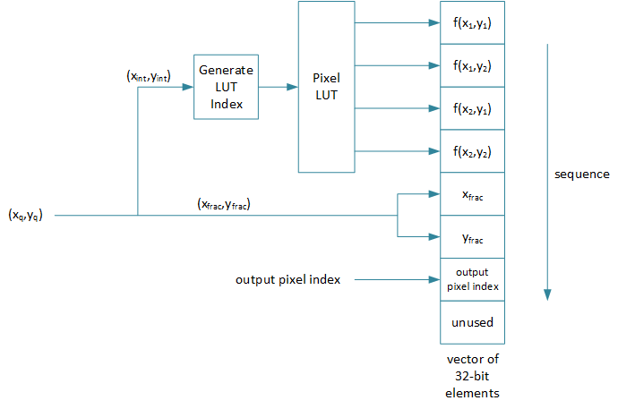

*Figure 5 - Input Vector Format for Pixel Data*

Input to the AI Engine consists of a sequence of these vectors. Output from the AI Engine consists of a sequence of two values for each pixel. The first value is the output pixel index, which is followed by the interpolated pixel value.  Data stream formats at the PL/AIE interface, from the perspective of the AI Engine, are shown in Figure 6.

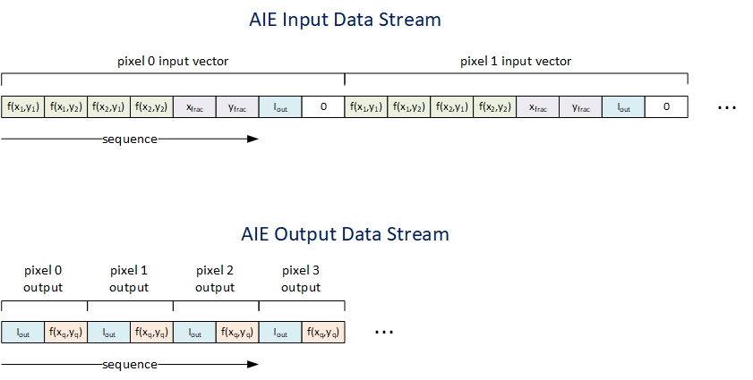

*Figure 6 - Data Streams at the PL/AIE Interface*

### PLIO Interface

Considering the format of both input and output data streams, it is apparent that the input stream places a limit on achievable pixel processing rate. For the lowest speed AMD Versal™ parts, the PLIO interface supports a rate of 4 GBps. Each input vector consists of 32 bytes (four bytes per element times eight elements). Therefore, the PLIO interface limits peak pixel rate to 125 MP/s. For the fastest Versal devices, this limit becomes 156.25 MP/s.

### AI Engine Test Vectors

When AI Engines graphs are simulated apart from programmable logic and processing systems, text files are used to provide input data. This example uses MATLAB® to generate test vectors, which are sequences of int32 numbers. Although actual data is single precision floating-point, it is difficult to express such numbers in text format. In order to capture full precision, the 32 bits used to represent a floating-point number (sign, exponent, mantissa) are written as equivalent int32 values. A similar format is used for files containing output data.

## AI Engine Code Vectorization

To realize advantages of AI Engine processing, code must be vectorized. Applying this to pixel interpolation, the calculation may be restated as:

$$
\begin{bmatrix}
1 - x_{frac} \\
1 - x_{frac} \\
x_{frac} \\
x_{frac}
\end{bmatrix}
.*
\begin{bmatrix}
1 - y_{frac} \\
y_{frac} \\
1 - y_{frac} \\
y_{frac}
\end{bmatrix}
.*
\begin{bmatrix}
f(x_1,y_1) \\
f(x_1,y_2) \\
f(x_2,y_1) \\
f(x_2,y_2)
\end{bmatrix}
\rightarrow \sum ( \cdot ) \rightarrow f(x_q,y_q).
$$

The .* operator denotes element-wise products of vectors, which corresponds to AI Engine vector multiplication. Two vector multiplications are performed, where weights derived from $x_{frac}$ are multiplied with weights derived from $y_{frac}$ and then multiplied by corresponding pixel values. The summation denotes addition of vector product elements, resulting in an interpolated pixel value.

While the vector containing pixel values is acquired directly from kernel input, the other two need to be constructed from values $x_{frac}$ and $y_{frac}$. Assigning individual components of the vectors would involve the scalar processor and impact performance, so a vector formulation is used instead. Restating the weight vectors as

$$
\begin{bmatrix}
1 - x_{frac} \\
1 - x_{frac} \\
x_{frac} \\
x_{frac}
\end{bmatrix} = 
\begin{bmatrix}
1 \\
1 \\
0 \\
0
\end{bmatrix} +
\begin{bmatrix}
-1 \\
-1 \\
1 \\
1
\end{bmatrix} .*
\begin{bmatrix}
x_{frac} \\
x_{frac} \\
x_{frac} \\
x_{frac}
\end{bmatrix}
$$

and

$$
\begin{bmatrix}
1 - y_{frac} \\
y_{frac} \\
1 - y_{frac} \\
y_{frac}
\end{bmatrix} = 
\begin{bmatrix}
1 \\
0 \\
1 \\
0
\end{bmatrix} +
\begin{bmatrix}
-1 \\
1 \\
-1 \\
1
\end{bmatrix} .*
\begin{bmatrix}
y_{frac} \\
y_{frac} \\
y_{frac} \\
y_{frac}
\end{bmatrix},
$$

shows they are efficiently constructed using vector multiply-accumulate operations.

### AI Engine Floating-Point Vector Unit

Figure 7 shows the floating-point vector unit of an AI Engine, where it may be observed that the multiply and accumulator units are designed to process eight lanes in parallel. Since pixel interpolation calculations require four lanes, pixels are processed in pairs to fully utilize the AI Engine.

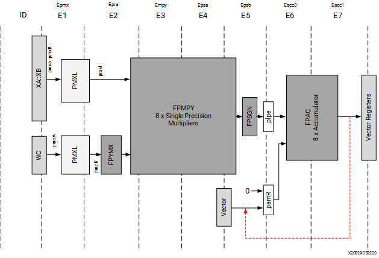

*Figure 7 - Floating-Point Vector Unit*

### AI Engine Kernel Processing

In order to take advantage of software pipelining, kernel code is created to take advantage of VLIW instructions that perform simultaneous vector multiply, load, and store operations. Each invocation of the kernel processes 256 pixels using a sequence of four code loops.

The first loop uses the $x_{frac}$ values from the input vector to construct a set of weight vectors and stores them in intermediate memory.

```cpp
// iterators for I/O
auto pIn = aie::begin_vector<16>(in);
auto pOut = aie::begin_vector<4>(out);

// iterator for x vector memory
auto pXbuf = aie::begin_restrict_vector<8>(xbuf);

// get constant data vectors to compute x vector
aie::vector<float,8> xm = aie::load_v<8>(xmul_init);
aie::vector<float,8> xa = aie::load_v<8>(xacc_init);

for (unsigned i = 0; i < (PXLPERGRP/2); i++)
	chess_prepare_for_pipelining
	chess_loop_range(PXLPERGRP/2,PXLPERGRP/2)
{
	// get two pixels worth of data from input
	auto vin = (*pIn++).cast_to<float>();

	// compute and store x vector
	*pXbuf++ = fpmac(xa,vin,0,0xCCCC4444,xm,0,0x76543210);
}

pIn -= (PXLPERGRP/2);             // reset input iterator for next loop
pXbuf -= (PXLPERGRP/2);           // reset xbuf iterator for next loop
```

The second loop constructs weight vectors from $y_{frac}$ in the exact same manner and stores them in intermediate memory.

```cpp
// iterator for y vector memory
auto pYbuf = aie::begin_restrict_vector<8>(ybuf);    

// get constant data vectors to compute y vector
aie::vector<float,8> ym = aie::load_v<8>(ymul_init);
aie::vector<float,8> ya = aie::load_v<8>(yacc_init);

for (unsigned i = 0; i < (PXLPERGRP/2); i++)
	chess_prepare_for_pipelining
	chess_loop_range(PXLPERGRP/2,PXLPERGRP/2)
{
	// get two pixels worth of data from input
	auto vin = (*pIn++).cast_to<float>();

	// compute and store y vector
	*pYbuf++ = fpmac(ya,vin,0,0xDDDD5555,ym,0,0x76543210);
}

pIn -= (PXLPERGRP/2);             // reset input iterator for next loop
pYbuf -= (PXLPERGRP/2);           // reset ybuf iterator for next loop
```

The third loop retrieves the $x_{frac}$ and $y_{frac}$ based weight vectors from memory and multiplies them with pixel values from the input vector. The final product is written to memory.

```cpp
// iterator for z vector memory
auto pZbuf = aie::begin_restrict_vector<8>(zbuf);    

aie::vector<float,8> xv;          // x vector
aie::vector<float,8> yv;          // y vector
aie::vector<float,8> xy;          // xy product vector

for (unsigned i = 0; i < (PXLPERGRP/2); i++)
	chess_prepare_for_pipelining
	chess_loop_range(PXLPERGRP/2,PXLPERGRP/2)
{
	// retrieve x and y vectors and multiply them
	xv = *pXbuf++;
	yv = *pYbuf++;
	xy = fpmul(xv,yv);

	// get two pixels worth of data from input
	auto vin = (*pIn++).cast_to<float>();

	// compute and store weighted pixel values
	*pZbuf++ = fpmul(vin,0,0xBA983210,xy,0,0x76543210);
}

pIn -= (PXLPERGRP/2);             // reset input iterator for next loop
pZbuf -= (PXLPERGRP/2);           // reset zbuf iterator for next loop
```

The final loop retrieves vector products, adds elements together to get interpolated pixel values, and inserts them into the output buffer along with pixel indexes.

```cpp
// compute interpolated pixel values and insert into output along with pixel index
aie::vector<float,4> vout;        // output vector
aie::vector<float,8> pxlp;        // vector of pixel products to be summed

for (unsigned i = 0; i < (PXLPERGRP/2); i++)
	chess_prepare_for_pipelining
	chess_loop_range(PXLPERGRP/2,PXLPERGRP/2)
{
	// get output pixel index from input
	auto vin = (*pIn++).cast_to<float>();

	// get x*y*p products to sum
	pxlp = *pZbuf++;

        // assign values to output
	vout[0] = vin[6];
	vout[2] = vin[14];
	vout[1] = aie::reduce_add(pxlp.extract<4>(0));
	vout[3] = aie::reduce_add(pxlp.extract<4>(1));

	// send to output buffer
	*pOut++ = vout.cast_to<int32>();
}
```

## Running the Example

Running the example requires that both MATLAB and AMD Vitis™ tools are installed and configured correctly. After downloading the files, cd into the ``.../bilinear_interpolation/aie/`` directory and use the make build process.

### Generating Test Vectors

Prior to running the AI Engine graph simulation, test vectors are required to provide input. Files are also provided to compare with AI Engine simulator output for verification. To generate the vectors, run the command:

```bash
$ make gen_vectors
```

### Running x86 Simulation

To perform a functional x86 simulation, enter the following sequence of commands:

```bash
$ make x86com
$ make x86sim
$ make check_x86sim
```

The first command compiles graph code for simulation on an x86 processor, the second command runs the simulation, and the final command invokes MATLAB to compare the simulator output with test vectors.

### Running AI Engine Simulation

To perform the AI Engine emulation using the SystemC simulator, enter the following sequence of commands:

```bash
$ make aiecom
$ make aiesim
$ make check_aiesim
```

The first command compiles graph code for the SystemC simulator, the second command runs the simulation, and the final command invokes MATLAB to compare simulation output with test vectors. If it is desired to generate trace and profile data during simulation, use the sequence:

```bash
$ make aiecom
$ make profile
$ make check_aiesim
```

## Analyzing Results

### Vitis Analyzer

Vitis Analyzer is an essential tool for accessing information on compilation, simulation, and implementation of AI Engine graphs. It can be used to obtain a summary on profiling data and to graphically display trace events. The tool may be invoked with the ``vitis_analyzer`` command, or for this example, by entering:

```bash
$ make analyze
```

The Graph view displays connectivity of the AI Engine graph, which for this example, is displayed in Figure 8. This simple example shows the kernel, ping pong buffers on input and output ports, and three buffers for holding intermediate results.

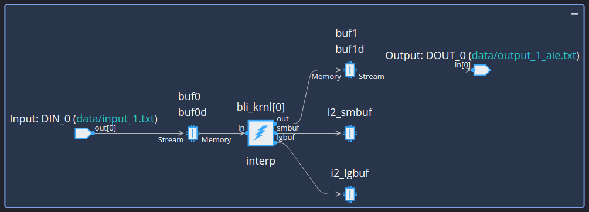

*Figure 8 - Vitis Analyzer Graph View*

The Array view displays how the AI Engine graph is mapped to the AI Engine array for the device specified. This example uses a VC1902 Versal AI Core device which contains 400 AI Engine tiles. As shown in Figure 9, this example only utilizes two tiles.

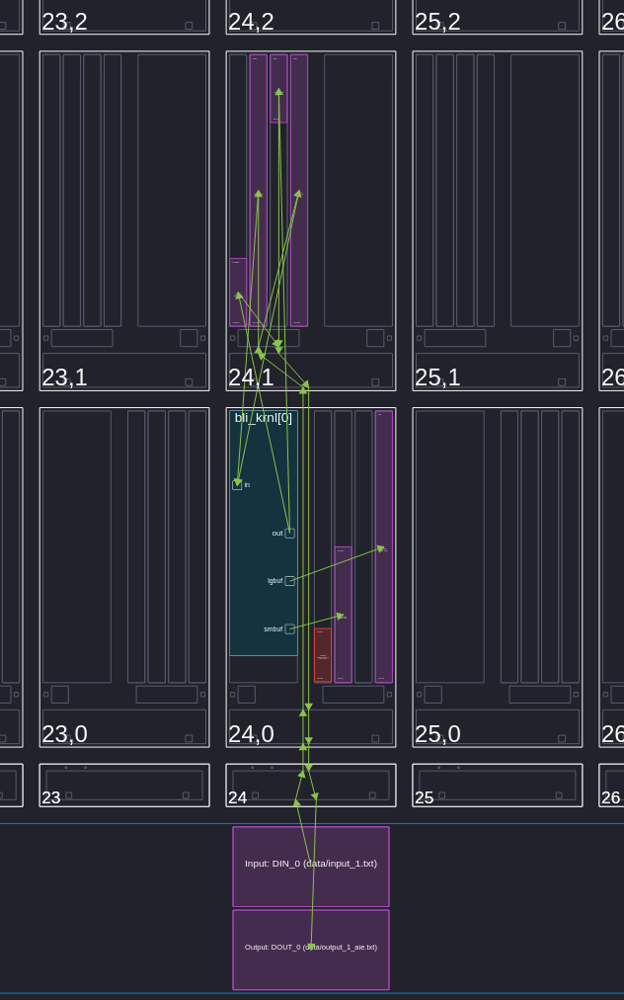

*Figure 9 - Vitis Analyzer Array View*

Figure 10 contains information from the Profile view. The highlighted fields show that the bilinear interpolation kernel takes 4027 cycles to process 256 pixels of data. For lowest speed Versal devices, this would translate to a peak processing rate of ~63.6 MP/s. Highest speed devices would have a peak processing rate of ~79.5 MP/s.

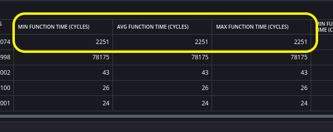

*Figure 10 - Vitis Analyzer Profile View*

### Test Vector Comparison

When comparing simulation results against test vectors, a MATLAB script is invoked to perform the processing. An example of a successful comparison is shown in Figure 11.

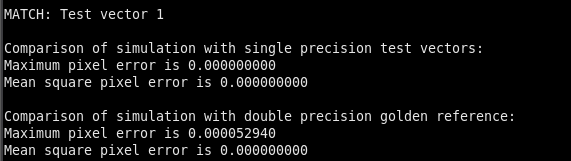

*Figure 11 - Simulation Verification*

The output provides three different indications of simulation performance. The first is an indication of whether the simulation output matched the corresponding test vector. There will be one comparison for each kernel simulated. The script compares int32 values which represent either output pixel indexes or floating-point interpolated pixel values. Since there will be slight variations in floating point calculations, the comparison allows for a difference in the two least significant mantissa bits of the floating-point number.

The second comparison indicates maximum pixel value difference between AIE simulation results and single precision MATLAB generated vectors. Pixels take on values in the range [0, 255], and this result provides the maximum of the differences between all pairs of corresponding pixels.

The final comparison indicates the maximum pixel value difference between AI Engine simulation results and double precision floating-point results generated by the MATLAB ``interp2`` function.

## Customizing the Example

This example may be easily customized to use different test images, to use a specified output resolution, or to use multiple parallel processing cores for increased throughput. When generating test vectors, instead of using the Makefile, one may manually run scripts in MATLAB with desired function arguments. For example, the equivalent to

```bash
$ make gen_vectors
```

is to invoke MATLAB and run

```bash
>> image_transform
>> genvectors_bilinear_interp
```

### Specifying a Test Image and Output Resolution

The ``image_transform`` function uses file ``../images/epyc.jpg`` as a test image by default. A different file named ``image_file`` may be specified by invoking in MATLAB. Default output resolution in pixels is 1024 $\times$ 1024.

```bash
>> image_transform('image_file')
```

A different resolution of $x_{res} \times y_{res}$ may be specified by invoking

```bash
>> image_transform('image_file', [ xres  yres ])
```

The ``image_transform`` function reads the test image file, performs a sequence of linear transformations on image pixel coordinates, and stores these transformations in a file named ``bli_coords.mat`` along with the test image pixel array. When this function is executed in MATLAB, a sequence of image transformations are displayed.

### Multicore Processing

The ``genvectors_bilinear_interp`` function generates test vector files assuming a single AI Engine kernel is used for processing. To utilize multiple kernels in parallel, invoke the function as:

```bash
>> genvectors_bilinear_interp(N)
```

where, N is the number of desired kernels. This function extracts one of the coordinate transformations from file ``bli_coords.mat``, performs bilinear interpolation on the pixels, and creates input and output test vectors for AI Engine simulation. The function also generates a file named ``config.h`` used by the AI Engine compiler and simulator to specify number of kernels and number of kernel invocations required to process the entire test image. This function also performs bilinear interpolation in double precision using the MATLAB ``interp2`` function and stores the result in file ``golden_ref.mat``.

As an example, specifying four kernels should result in the MATLAB Console Window displaying something like

```
>> genvectors_bilinear_interp(4)
Number of output pixels interpolated = 453221 out of 1048576 (43.22252 %)
Maximum pixel error is 0.000035322
Mean square pixel error is 0.000000000
```

along with the image shown in Figure 12.

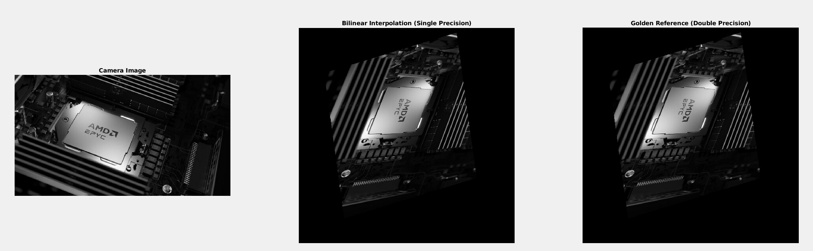

*Figure 12 - MATLAB genvectors_bilinear_interp Output*

Once these MATLAB scripts are run, the rest of the AI Engine build and simulation process proceeds in the same manner. Figure 13 shows how four kernels are assigned to tiles in the AI Engine array.

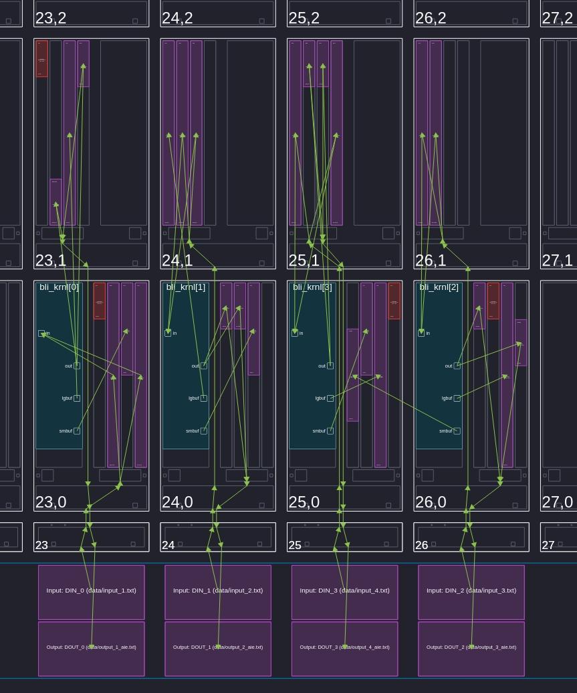

*Figure 13 - Multicore Kernel Placement in AI Engine Array*

Figure 14 shows the result of comparing multicore AI Engine simulation output with test vectors. Based on profile results, four kernels will support peak processing rates in the range of approximately 254 to 318 MP/s, depending on device speed.

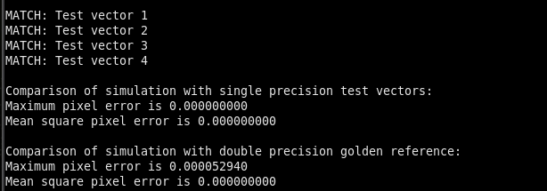

*Figure 14 - Multicore Simulation Verification*

## References

[1]:<https://en.wikipedia.org/wiki/Bilinear_interpolation> "Bilinear interpolation"

[[1]]: Bilinear interpolation. 17 May 2023, 14:05 UTC. In Wikipedia: The Free Encyclopedia. Wikimedia Foundation Inc. Encyclopedia on-line. Available from https://en.wikipedia.org/wiki/Bilinear_interpolation. Internet. Retrieved 4 August 2023.

[2]: <https://ieeexplore.ieee.org/document/1409828> "A novel approach to real-time bilinear interpolation"
[[2]]: K. T. Gribbon and D. G. Bailey, "A novel approach to real-time bilinear interpolation," Proceedings. DELTA 2004. Second IEEE International Workshop on Electronic Design, Test and Applications, Perth, WA, Australia, 2004, pp. 126-131, doi: 10.1109/DELTA.2004.10055.

[3]: <https://en.thedailyscoup.news/2023/03/05/interpolation-formula-understanding-the-basics-and-applications/> "Interpolation Formula: Understanding the Basics and Applications"

[[3]] Chen, J. (2023, March 5). *Interpolation Formula: Understanding the Basics and Applications.* The Daily Scoup News. https://en.thedailyscoup.news/2023/03/05/interpolation-formula-understanding-the-basics-and-applications/

[4]: <https://ieeexplore.ieee.org/document/9943113> "Super-Resolution of Digital Elevation Model with Local Implicit Function Representation"

[[4]] P. He et al., "Super-Resolution of Digital Elevation Model with Local Implicit Function Representation," 2022 International Conference on Machine Learning and Intelligent Systems Engineering (MLISE), Guangzhou, China, 2022, pp. 111-116, doi: 10.1109/MLISE57402.2022.00030.

[5]: <https://bartwronski.com/2020/04/14/bilinear-texture-filtering-artifacts-alternatives-and-frequency-domain-analysis/> "Bilinear texture filtering – artifacts, alternatives, and frequency domain analysis"

[[5]] Wronski, B. (2020, April 14). *Bilinear texture filtering – artifacts, alternatives, and frequency domain analysis.* https://bartwronski.com/2020/04/14/bilinear-texture-filtering-artifacts-alternatives-and-frequency-domain-analysis/

## Support

GitHub issues will be used for tracking requests and bugs. For questions, go to [support.xilinx.com](http://support.xilinx.com/).

## License

Components: xilinx-images

images in the documentation

Components: xilinx-files

The MIT License (MIT)

Copyright (c) 2023 Advanced Micro Devices, Inc.

Permission is hereby granted, free of charge, to any person obtaining a copy
of this software and associated documentation files (the "Software"), to deal in the Software without restriction, including without limitation the rights to use, copy, modify, merge, publish, distribute, sublicense, and/or sell copies of the Software, and to permit persons to whom the Software is
furnished to do so, subject to the following conditions:

The above copyright notice and this permission notice shall be included in all copies or substantial portions of the Software.

THE SOFTWARE IS PROVIDED "AS IS", WITHOUT WARRANTY OF ANY KIND, EXPRESS OR
IMPLIED, INCLUDING BUT NOT LIMITED TO THE WARRANTIES OF MERCHANTABILITY,
FITNESS FOR A PARTICULAR PURPOSE AND NONINFRINGEMENT. IN NO EVENT SHALL THE
AUTHORS OR COPYRIGHT HOLDERS BE LIABLE FOR ANY CLAIM, DAMAGES OR OTHER
LIABILITY, WHETHER IN AN ACTION OF CONTRACT, TORT OR OTHERWISE, ARISING FROM, OUT OF OR IN CONNECTION WITH THE SOFTWARE OR THE USE OR OTHER DEALINGS IN THE SOFTWARE.

<p class="sphinxhide" align="center"><sub>Copyright © 2023 Advanced Micro Devices, Inc.</sub></p>
<p class="sphinxhide" align="center"><sub>Copyright © 2021 Xilinx Inc.</sub></p>

