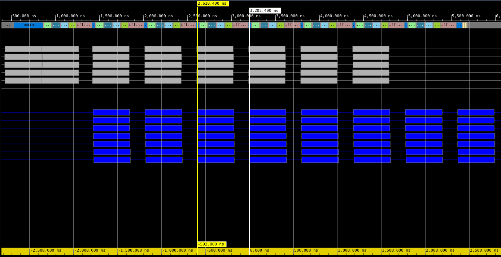
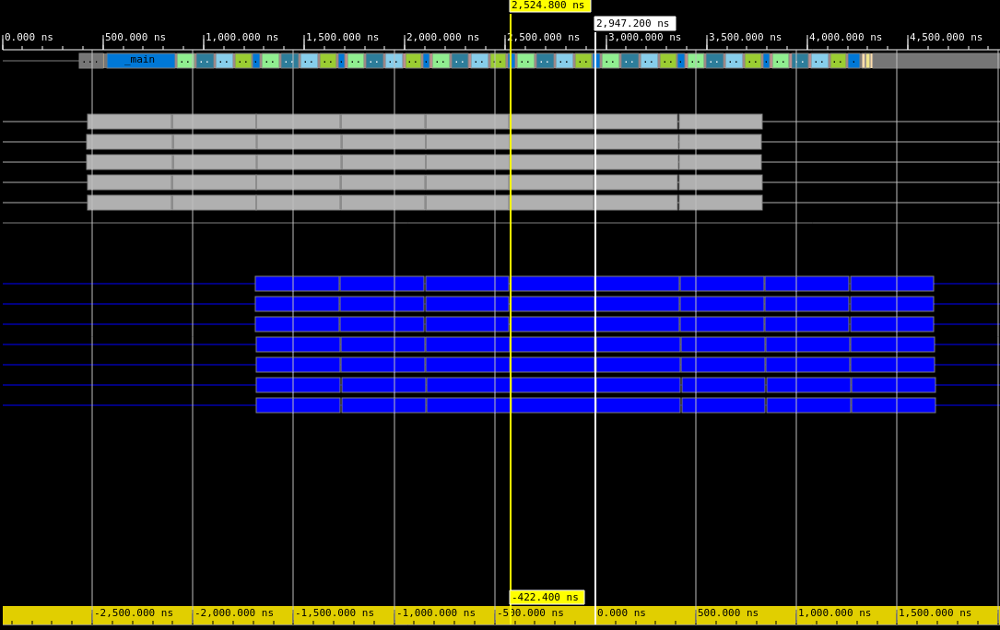
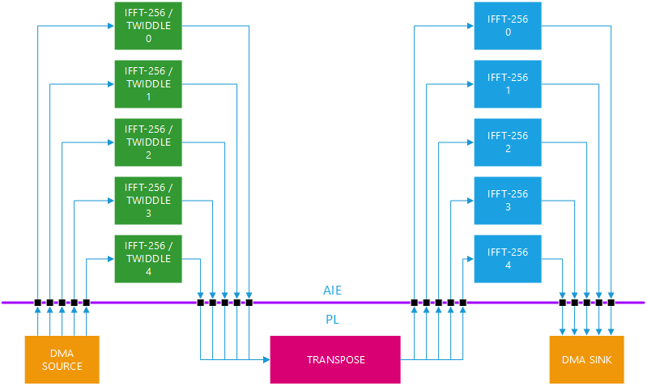
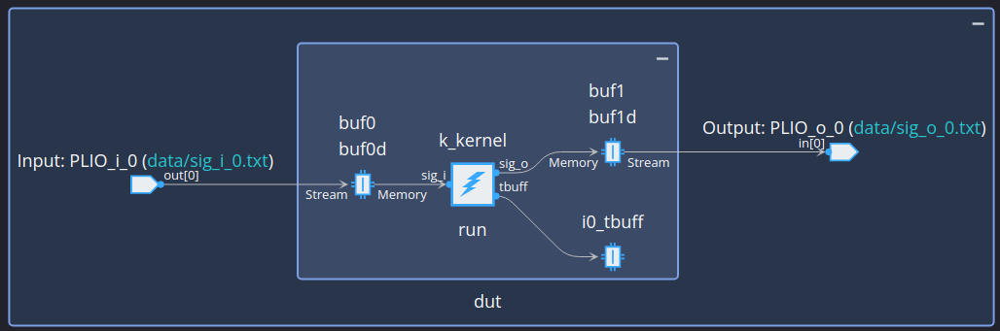
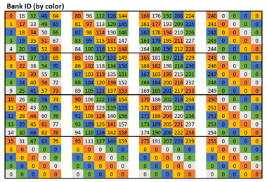
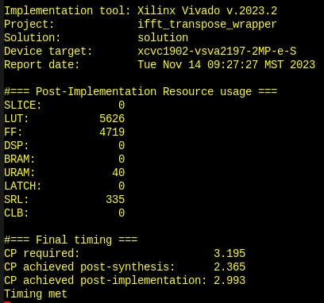
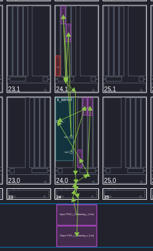
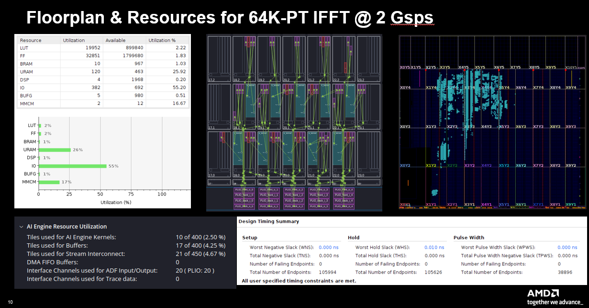

<!--
Copyright (C) 2023, Advanced Micro Devices, Inc. All rights reserved.
SPDX-License-Identifier: MIT
Author: Mark Rollins
-->
<table class="sphinxhide" width="100%">
 <tr width="100%">
    <td align="center"><h1>AI Engine Development</h1>
    <a href="https://www.xilinx.com/products/design-tools/vitis.html">See Vitis™ Development Environment on xilinx.com</br></a>
    <a href="https://www.xilinx.com/products/design-tools/vitis/vitis-ai.html">See Vitis™ AI Development Environment on xilinx.com</a>
    </td>
 </tr>
</table>

# 64K-Pt IFFT @ 2 Gsps Using a 2D Architecture

***Version: Vitis 2024.1***

## Table of Contents

1. [Introduction](#introduction)
2. [Matlab Model](#matlab-model)
3. [Design Overview](#design-overview)
4. [Design Resources](#design-resources)
5. [Build and Run Design](#build-and-run-design)

[References](#references)

[Support](#support)

[License](#license)

## Introduction

The [Vitis DSP Library](https://docs.xilinx.com/r/en-US/Vitis_Libraries/dsp/index.html) currently implements the Fast Fourier Transform (FFT) using a Stockham algorithm. This algorithm computes the transform using a pair of buffers rather than the more popular in-place Cooley-Tukey approach, and maps more efficiently to the vector/SIMD architecture of the AI Engine. This approach yields excellent results, particularly for $N < 4096$ where the processing and storage requirements may be serviced by a single tile. In higher performance cases where sampling rates exceed 1 Gsps (ie. the SSR > 1 regime), this Stockham approach continues to be feasible but leads to an excessive use of tile resources. A more efficient approach is needed for these high throughput use cases. 

A 1D FFT may be implemented on the AI Engine array using a 2D FFT algorithm with higher efficiency overall. This alternative "divide & conquer" approach provides a better solution on the AI Engine array since it is less reliant on "butterfly routing" and we can break large $N$ point sizes into much smaller factors of size $\sqrt N$. This results in a significant reduction in AI Engine tile memory and overall usage of fewer compute tiles. 

The 2D architecture is not new to AI Engine. [XAPP1356](https://docs.xilinx.com/r/en-US/xapp1356-fft-ai-engine) first explored its use several years ago to achieve 3.7 Gsps with 10 AI Engine tiles. In this tutorial, we explore using the 2D architecture to implement large point transforms in the SSR > 1 regime: specifically a 64K-pt IFFT @ 2 Gsps. In this scenario, the design requires both AI Engine tile resources for compute and programmable logic (PL) resources for sample reordering as shown in detail below.

## Matlab Model
A Matlab model of the 64K-pt IFFT implemented as a $256 \times 256$ 2D architecture is shown below. The model & algorithm consist of the following steps:
1. Load the input data in column-major order into a $256 \times 256$ matrix.
1. Take 256-pt transforms along each row
1. Perform a point-wise multiplication of the data matrix with a "twiddle matrix" (see code below for its detailed definition)
1. Take 256-pt transforms along each column
1. Extract the output data in row-major order

```
function [ifft_o] = ifft64k_256x256_model( ifft_i )
   N = numel(ifft_i);
   Nhalf = sqrt(N);
   assert( N == 65536 );
   
   % Need to use DIT when computing transforms up front:
   twid = complex(zeros(Nhalf,Nhalf),zeros(Nhalf,Nhalf));
   for rr = 0 : Nhalf-1
     for cc = 0 : Nhalf-1
       twid(1+rr,1+cc) = exp(+1i*2*pi*rr*cc/N);
     end
   end
   
   % First compute transforms along rows:
   data0 = reshape(ifft_i,Nhalf,Nhalf);
   data1 = Nhalf*ifft(data0,Nhalf,2);

   % Apply pointwise twiddle matrix:
   % --> Note: first row is multiplication by unity
   data2 = data1 .* twid;
   
   % Second compute 16-K point transforms along columns:
   data3 = Nhalf*ifft(data2,Nhalf,1);
   ifft_o = reshape(data3.',1,[]);
end
```

## Design Overview

This section provides an overview of the 64K-pt IFFT @ 2 Gsps using both AI Engine and PL resources.

### Design Approach

We build this design using a combination of AI Engine tiles and PL resources as follows. Based on the five algorithm steps identified earlier, we partition the row and column 256-pt transforms to the AI Engine array. The goal here is to minimize compute resources by using the fewest tiles possible and still meet the 2 Gsps throughput requirement. The AI Engine array also performs point-wise twiddle multiplications in the third step. For a streaming design such as this, the act of performing "row" and "column" transforms translates into a requirement for a "memory transpose" operation. Between these "row" and "column" transforms, we must stream the samples into a storage buffer in row-major order and then extract the samples in column-major order. This is done over a number of parallel streams; the number of streams is chosen to meet the overall throughput requirement. Based on these concepts, the design consists of a "front-end" AI Engine subgraph performing "row" transforms, a "back-end" AI Engine subgraph performing "column" transforms, and a "memory transpose" operation located in PL in between. 

### IFFT-256 Prototyping
Based on this system architecture concept, it only remains to identify how many AI Engine resources are required to implement the (i) "row" transforms, (ii) "point-wise twiddle" multiplications, and (iii) "column" transforms. We do some early prototyping of the AI Engine subgraphs to identify the number of instances required. We identify two separate subgraphs to consider:
1. One "front-end" subgraph performing a "row" IFFT-256 followed by a "pointwise-twiddle" multiplication of the samples on that row, followed by zero-insertion.
2. One "back-end" subgraph performing a "column" IFFT-256 followed by zero-insertion.

The zero-insertion allows the design of the "memory transpose" in PL to be simplified as is outlined in detail below.

The throughput of prototypes of the these two subgraphs identifies the number of instances of each required to achieve our overall throughput target of 2 Gsps. The figure below shows traces in Vitis Analyzer for the front-end subgraph. This design is hand-coded in AIE API combining all three functions together into a single tile design with small memory footprint. It's throughput is 592 us or ~430 Msps. Based on a target throughput of 2 Gsps, we will need to include 5 instances of this subgraph in the overall design.



The figure below shows traces in Vitis Analyzer for the back-end subgraph. This design is also hand-coded in AIE API and combines the IFFT-256 with zero-padding into a second single tile design with small memory footprint. It's throughput is 422.4 ns or ~600 Msps. Based on a target throughput of 2 Gsps, we will need to include 4 instances of this subgraph in the overall design.



Based on these prototyping efforts, we identify the final design architecture shown in the diagram below. The design uses five instances of each front-end and back-end subgraph. We use 5 instances of the back-end subgraph even though only four are required as this simplifies the overall design architecture. These instances become time shared over all transform operations required by the 2D algorithm. However, we require only 256 transforms in each "row" and "column" dimension, yet this number is not divisible by 5. Consequently, we "zero-pad" the 2D data cube by appending four rows at the bottom and four columns at the right to create a 260 x 260 data cube. It then follows that we can perform 52 transforms per AI Engine tile instance in each case for the "front-end" and "back-end" subgraph. This also means the design supports five I/O streams into and out of each subgraph. This also applies to the "memory transpose" operation in the PL. An important side effect of this zero-padding is its simplification in the construction on that PL design. It may then be implemented using a 5-bank memory architecture as outlined in detail below.



### Front-End IFFT-256 AI Engine Kernel

The front-end IFFT-256 kernel performs three functions: a 256-pt IFFT, a point-wise twiddle multiplication, and a zero-padding with 4 samples. The IFFT is built using a Stockham algorithm hand-coded using the AIE API. The point-wise twiddle multiplication is computed using the vectorized `aie::mul()` API. The twiddle factors themselves are generated using the non-linear hardware accelerator connected to the scalar unit and vectorized by multiplying each scalar twiddle by a 8-sample vector containing consecutive twiddle phase steps. Finally, the zero-padding is performed by simply writing a vectorized null vector to the output buffer.

The figure below shows the AI Engine graph for the front-end IFFT-256 kernel. The design uses I/O buffers for simplicity and a scratchpad to act as a temporary buffer for the transform computation. Twiddle factors are stored in arrays as part of the system memory. A single tile is required. The full design uses five instances of this graph overall.



### Memory Transpose PL Kernel
The memory transpose PL kernel writes input samples from the front-end transforms in row-major order and then delivers samples to the back-end transforms reading in column-major order. This must be sustained via streaming over five I/O streams at full speed to achieve the 2.0 Gsps throughput target overall. The key challenge for this kernel is we need to partition the $256 \times 256$ data cube by a factor of 5 and read/write 10 samples per PL clock cycle (where we assume the PL is clocked at 312.5 MHz or 4 times slower than the AI Engine array). 

We illustrate the design concept used by the memory transpose PL kernel using a smaller $16 \times 16$ example shown in the figure below. Note how we have zero-padded the 2D array with four extra rows at the bottom and four extra columns on the right. This new $20 \times 20$ data cube divisible by the 5 I/O streams we wish to use concurrently. The entire data cube is partitioned into 5 separate banks each containing 80 samples. Each bank is identified with a unique color in the figure below. Note how we can write the memory from left to write into consecutive rows at the same time with no bank contention -- each write occurs into a different color. Similarly, we can read the memory from top to bottom from consecutive columns at the same time with no bank contention. This scheme allows us to establish sustained bandwidth @ 2 Gsps to feed the five instances each in the front and back end AI Engine subgraphs. This same concept is used by the Memory Transpose PL kernel but for its larger $256 \times 256$ size. Also note that we must read/write 10 samples per PL cycle so each memory must be dual-ported.



We implement the Memory Transpose PL kernel using HLS @ 312.5 MHz. The resource utilization and timing from out-of-context synthesis & place-and-route is given in the figure below.



### Back-End IFFT-256 AI Engine Kernel

The design of the back-end IFFT-256 is a simplified version of the front-end design. It merely implements the transform and the zero-padding -- there is no point-wise twiddle multiplications. The graph looks nearly identical to the front-end design shown earlier. The figure below shows the physical array view of the back-end design. It also uses I/O buffers and requires a memory footprint that spills over to the neighboring tile. 



## Design Resources

The figure below summarizes the AI Engine and PL resources required to implement the design in the VC1902 device on the VCK190 eval board. The design is using 10 AI Engine tiles for compute and 17 tiles for buffering. The PL design includes the resources required to implement the DMA Source, Memory Transpose, and DMA Sink kernels. This design illustrates how Versal AI Engine and PL may be crafted to create a high performance tightly coupled custom data path tailored directly to the algorithm of interest.



## Build and Run Design

### Setup & Initialization

IMPORTANT: Before beginning the tutorial ensure you have installed Vitis™ 2023.2 software. Ensure you have downloaded the Common Images for Embedded Vitis Platforms from this link.

https://www.xilinx.com/support/download/index.html/content/xilinx/en/downloadNav/embedded-platforms/2023-2.html

Set the environment variable ```COMMON_IMAGE_VERSAL``` to the full path where you have downloaded the Common Images. Then set the environment variable ```PLATFORM_REPO_PATHS``` to the value ```$XILINX_VITIS/lin64/Vitis/2023.2/base_platforms```.

The remaining environment variables are configured in the top level Makefile ```<path-to-design>/12-IFFT64K-2D-architecture/Makefile``` file.

```
RELEASE=2023.2
BOARD=vek280
BASE_NUM=202320_1

# Platform Selection...
VERSAL_VITIS_PLATFORM      = xilinx_${BOARD}\_base_${BASE_NUM}
VITIS_PLATFORM_DIR         = ${PLATFORM_REPO_PATHS}/${VERSAL_VITIS_PLATFORM}
export VITIS_PLATFORM_XPFM = ${VITIS_PLATFORM_DIR}/${VERSAL_VITIS_PLATFORM}.xpfm

# Set SysRoot, RootFS and Image
export VITIS_SYSROOTS   = ${COMMON_IMAGE_VERSAL}/sysroots/cortexa72-cortexa53-xilinx-linux
export KERNEL_IMAGE     = ${COMMON_IMAGE_VERSAL}/Image
export ROOTFS           = ${COMMON_IMAGE_VERSAL}/rootfs.ext4
export XLNX_VERSAL      = ${COMMON_IMAGE_VERSAL}
export PLATFORM         = ${VITIS_PLATFORM_XPFM}
export SYSROOT          = ${VITIS_SYSROOT}
```

### Hardware Emulation

```
[shell]% cd <path-to-design>/12-IFFT64K-2D-architecture
[shell]% make all TARGET=hw_emu
```

This will take about 90 minutes to run the first time as the build will perform C/RTL verification and Vivado out-of-context place-and-route runs for all six HLS IPs. This will only be done once, but is not strictly required for hardware emulation. To skip this step, alternately run using the following:

```
[shell]% cd <path-to-design>/12-IFFT64K-2D-architecture
[shell]% make all TARGET=hw_emu DO_COSIM=false
```

The build process will generate a folder ```12-IFFT64K-2D-architecture/package``` containing all the files required for hardware emulation. This can be run as shown below. An optional `-g` can be applied to the ```launch_hw_emu.sh``` command to launch the Vivado waveform GUI to observe the top-level AXI signal ports in the design.

```
[shell]% cd <path-to-design>/12-IFFT64K-2D-architecture/package
[shell]% ./launch_hw_emu.sh -run-app embedded_exec.sh
```

### Hardware

The design can be built for the VEK280 board using the Makefile as follows:

```
[shell]% cd <path-to-design>/12-IFFT64K-2D-architecture
[shell]% make all TARGET=hw
```

The build process will generate the SD card image in the ```<path-to-design>/12-IFFT64K-2D-architecture/package/sd_card``` folder.

## References

[1]: [Vitis DSP Library](https://docs.xilinx.com/r/en-US/Vitis_Libraries/dsp/index.html)

[2]: [XAPP1356: "Block-by-Block Configurable Fast Fourier Transform Implementation on AI Engine](https://docs.xilinx.com/r/en-US/xapp1356-fft-ai-engine)

## Support

GitHub issues will be used for tracking requests and bugs. For questions, go to [support.xilinx.com](http://support.xilinx.com/).

## License

Components: xilinx-images

images in the documentation

Components: xilinx-files

The MIT License (MIT)

Copyright (c) 2023 Advanced Micro Devices, Inc.

Permission is hereby granted, free of charge, to any person obtaining a copy
of this software and associated documentation files (the "Software"), to deal
in the Software without restriction, including without limitation the rights
to use, copy, modify, merge, publish, distribute, sublicense, and/or sell
copies of the Software, and to permit persons to whom the Software is
furnished to do so, subject to the following conditions:

The above copyright notice and this permission notice shall be included in all
copies or substantial portions of the Software.

THE SOFTWARE IS PROVIDED "AS IS", WITHOUT WARRANTY OF ANY KIND, EXPRESS OR
IMPLIED, INCLUDING BUT NOT LIMITED TO THE WARRANTIES OF MERCHANTABILITY,
FITNESS FOR A PARTICULAR PURPOSE AND NONINFRINGEMENT. IN NO EVENT SHALL THE
AUTHORS OR COPYRIGHT HOLDERS BE LIABLE FOR ANY CLAIM, DAMAGES OR OTHER
LIABILITY, WHETHER IN AN ACTION OF CONTRACT, TORT OR OTHERWISE, ARISING FROM,
OUT OF OR IN CONNECTION WITH THE SOFTWARE OR THE USE OR OTHER DEALINGS IN THE
SOFTWARE.

<p class="sphinxhide" align="center">  &copy; Copyright 2023 Advanced Micro Devices, Inc.</p>
<p class="sphinxhide" align="center">  &copy; Copyright 2021 Xilinx Inc.</p>

