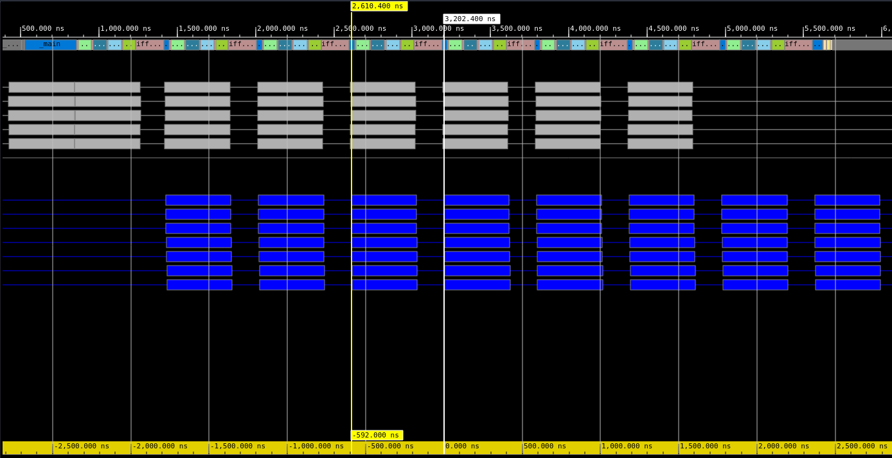
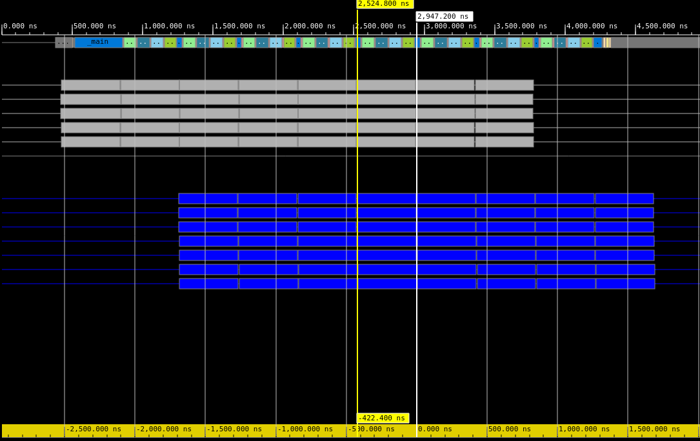
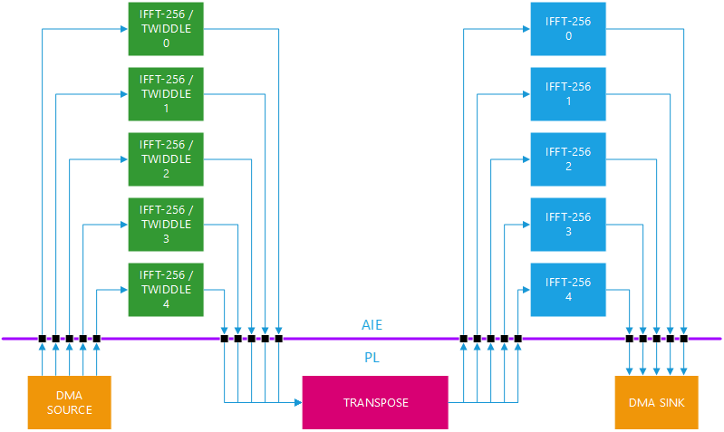
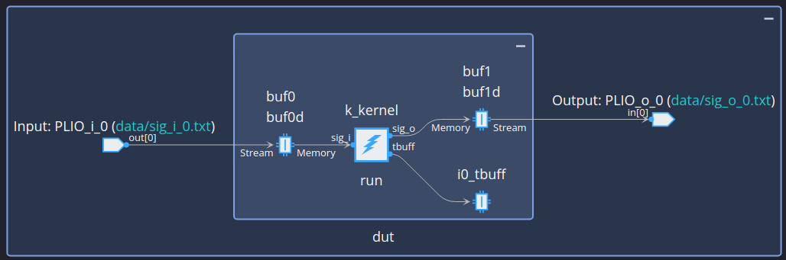
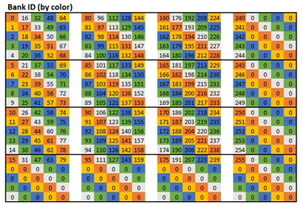
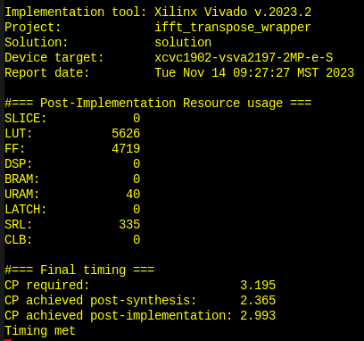
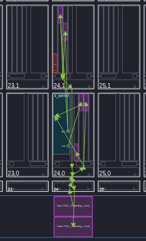
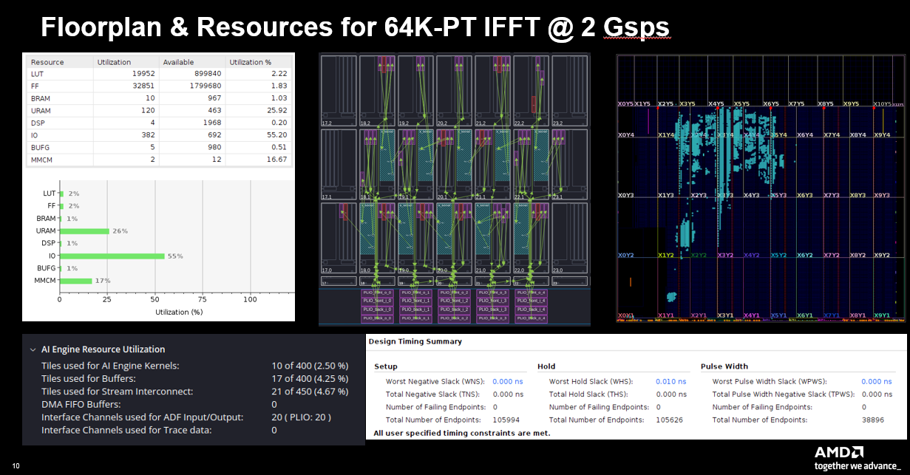

<table class="sphinxhide" style="width:100%;">
  <tr>
    <td align="center">
      <picture>
        <source media="(prefers-color-scheme: dark)" srcset="https://raw.githubusercontent.com/Xilinx/Image-Collateral/main/logo-white-text.png">
        
      </picture>
      <h1>AMD Vitis™ AI Engine Tutorials</h1>
      <a href="https://www.amd.com/en/products/software/adaptive-socs-and-fpgas/vitis.html">See Vitis™ Development Environment on amd.com</a>
        </br>
      <a href="https://www.amd.com/en/products/software/vitis-ai.html">See Vitis™ AI Development Environment on amd.com</a>
    </td>
  </tr>
</table>

# 64K-Pt IFFT @ 2 GSPS Using a 2D Architecture

***Version: Vitis 2025.2***

## Introduction

The [Vitis DSP Library](https://docs.amd.com/r/en-US/Vitis_Libraries/dsp/index.html) currently implements the Fast Fourier Transform (FFT) using a Stockham algorithm. This algorithm computes the transform using a pair of buffers rather than the more popular in-place Cooley-Tukey approach, and maps more efficiently to the vector/SIMD architecture of the AI Engine. This approach yields excellent results, particularly for $N < 4096$ where a single tile can service the processing and storage requirements. In higher performance cases where sampling rates exceed 1 GSPS (ie. the SSR > 1 regime), this Stockham approach continues to be feasible but leads to an excessive use of tile resources. These high throughput use cases require a more efficient approach.

You can implement a 1D FFT on the AI Engine array using a 2D FFT algorithm with higher efficiency overall. This alternative "divide & conquer" approach provides a better solution on the AI Engine array because it is less reliant on "butterfly routing" and allows breaking large $N$ point sizes into much smaller factors of size $\sqrt N$. This results in a significant reduction in AI Engine tile memory and overall usage of fewer compute tiles.

The 2D architecture is not new to AI Engine. [XAPP1356](https://docs.amd.com/r/en-US/xapp1356-fft-ai-engine) first explored its use several years ago to achieve 3.7 GSPS with 10 AI Engine tiles. This tutorial explores using the 2D architecture to implement large point transforms in the SSR > 1 regime, specifically a 64K-pt IFFT @ 2 GSPS. In this scenario, the design requires both AI Engine tile resources for compute and programmable logic (PL) resources for sample reordering as shown in the following section.

## MATLAB Model

A MATLAB® model of the 64K-pt IFFT implemented as a $256 \times 256$ 2D architecture is shown in the following code. The model and algorithm consist of the following steps:

1. Load the input data in column-major order into a $256 \times 256$ matrix.
2. Take 256-pt transforms along each row
3. Perform a point-wise multiplication of the data matrix with a "twiddle matrix" (see following code for its detailed definition)
4. Take 256-pt transforms along each column
5. Extract the output data in row-major order

```cpp
function [ifft_o] = ifft64k_256x256_model( ifft_i )
   N = numel(ifft_i);
   Nhalf = sqrt(N);
   assert( N == 65536 );
   
   % Need to use DIT when computing transforms up front:
   twid = complex(zeros(Nhalf,Nhalf),zeros(Nhalf,Nhalf));
   for rr = 0 : Nhalf-1
     for cc = 0 : Nhalf-1
       twid(1+rr,1+cc) = exp(+1i*2*pi*rr*cc/N);
     end
   end
   
   % First compute transforms along rows:
   data0 = reshape(ifft_i,Nhalf,Nhalf);
   data1 = Nhalf*ifft(data0,Nhalf,2);

   % Apply pointwise twiddle matrix:
   % --> Note: first row is multiplication by unity
   data2 = data1 .* twid;
   
   % Second compute 16-K point transforms along columns:
   data3 = Nhalf*ifft(data2,Nhalf,1);
   ifft_o = reshape(data3.',1,[]);
end
```

## Design Overview

This section provides an overview of the 64K-pt IFFT @ 2 GSPS using both AI Engine and PL resources.

### Design Approach

This design has a combination of AI Engine tiles and PL resources as follows. Based on the five algorithm steps identified earlier, the row and column 256-pt transforms are partitioned to the AI Engine array. The goal here is to minimize compute resources by using the fewest tiles possible and still meet the 2 GSPS throughput requirement. The AI Engine array also performs point-wise twiddle multiplications in the third step. For a streaming design such as this, the act of performing "row" and "column" transforms translates into a requirement for a "memory transpose" operation. Between these "row" and "column" transforms, the design must stream the samples into a storage buffer in row-major order and then remove the samples in column-major order. This occurs over a number of parallel streams. The number of streams is chosen to meet the overall throughput requirement. Based on these concepts, the design consists of a "front-end" AI Engine subgraph performing "row" transforms, a "back-end" AI Engine subgraph performing "column" transforms, and a "memory transpose" operation located in PL in between.

### IFFT-256 Prototyping

Based on this system architecture concept, it only remains to identify how many AI Engine resources the design requires to implement the following:

- "row" transforms
- "point-wise twiddle" multiplications,
- "column" transforms

Early prototyping of the AI Engine subgraphs identifies the number of instances required. The design identifies two separate subgraphs to consider:

1. One "front-end" subgraph performing a "row" IFFT-256 followed by a "pointwise-twiddle" multiplication of the samples on that row, followed by zero-insertion.
2. One "back-end" subgraph performing a "column" IFFT-256 followed by zero-insertion.

The zero-insertion allows simplifying the design of the "memory transpose" in PL, which the following section outlines in detail.

The throughput of prototypes of the these two subgraphs identifies the number of instances of each required to achieve the overall throughput target of 2 GSPS. The following figure shows traces in Vitis Analyzer for the front-end subgraph. This design is hand-coded in AIE API combining all three functions together into a single tile design with small memory footprint. It is throughput is 592 us or ~430 MSPS. Based on a target throughput of 2 GSPS, the design must have five instances of this subgraph in the overall design.



The following figure shows traces in Vitis Analyzer for the back-end subgraph. This design is also hand-coded in AIE API and combines the IFFT-256 with zero-padding into a second single tile design with small memory footprint. It is throughput is 422.4 ns or ~600 MSPS. Based on a target throughput of 2 GSPS, the design must have four instances of this subgraph in the overall design.



Based on these prototyping efforts, the final design architecture is shown in the following diagram. The design uses five instances of each front-end and back-end subgraph. The design uses five instances of the back-end subgraph even though only four are required, as this simplifies the overall design architecture. These instances become time shared over all transform operations required by the 2D algorithm. However, the design requires only 256 transforms in each "row" and "column" dimension, yet this number is not divisible by 5. Consequently, the 2D data cube is "zero-padded" by appending four rows at the bottom and four columns at the right to create a 260 x 260 data cube. Thus, the design can perform 52 transforms per AI Engine tile instance in each case for the "front-end" and "back-end" subgraph. This also means the design supports five I/O streams into and out of each subgraph. This also applies to the "memory transpose" operation in the PL. An important side effect of this zero-padding is its simplification in the construction on that PL design. You can then implement the design using a 5-bank memory architecture, outlined in detail in the following section.



### Front-End IFFT-256 AI Engine Kernel

The front-end IFFT-256 kernel performs three functions: a 256-pt IFFT, a point-wise twiddle multiplication, and a zero-padding with four samples. The IFFT is built using a Stockham algorithm hand-coded using the AIE API. The point-wise twiddle multiplication is computed using the vectorized `aie::mul()` API. The twiddle factors themselves are generated using the non-linear hardware accelerator connected to the scalar unit and vectorized by multiplying each scalar twiddle by a 8-sample vector containing consecutive twiddle phase steps. Finally, the zero-padding is performed by simply writing a vectorized null vector to the output buffer.

The following figure shows the AI Engine graph for the front-end IFFT-256 kernel. The design uses I/O buffers for simplicity and a scratchpad to act as a temporary buffer for the transform computation. Twiddle factors are stored in arrays as part of the system memory. A single tile is required. The full design uses five instances of this graph overall.



### Memory Transpose PL Kernel

The memory transpose PL kernel writes input samples from the front-end transforms in row-major order and then delivers samples to the back-end transforms reading in column-major order. This must be sustained through streaming over five I/O streams at full speed to achieve the 2.0 GSPS throughput target overall. The key challenge for this kernel is partitioning the $256 \times 256$ data cube by a factor of five and reading/writing 10 samples per PL clock cycle (the PL is clocked at 312.5 MHz or four times slower than the AI Engine array).

The following figure shows the design concept used by the memory transpose PL kernel using a smaller $16 \times 16$ example. Note how the design is the 2D array is zero-padded with four extra rows at the bottom and four extra columns on the right. This new $20 \times 20$ data cube is divisible by the five I/O streams used concurrently. The entire data cube is partitioned into five separate banks each containing 80 samples. Each bank is identified with a unique color in the following figure. Note how the design can write the memory from left to right into consecutive rows at the same time with no bank contention. Each write occurs into a different color. Similarly, the design can read the memory from top to bottom from consecutive columns at the same time with no bank contention. This scheme allows establishing sustained bandwidth @ 2 GSPS to feed the five instances each in the front and back end AI Engine subgraphs. The Memory Transpose PL kernel uses the same concept but for its larger $256 \times 256$ size. Also note that the design must read/write 10 samples per PL cycle so each memory must be dual-ported.



The Memory Transpose PL kernel implementation uses HLS @ 312.5 MHz. The following figure gives the resource utilization and timing from out-of-context synthesis and place-and-route.



### Back-End IFFT-256 AI Engine Kernel

The design of the back-end IFFT-256 is a simplified version of the front-end design. It merely implements the transform and the zero-padding -- there is no point-wise twiddle multiplications. The graph looks almost identical to the front-end design shown earlier. The following figure shows the physical array view of the back-end design. It also uses I/O buffers and requires a memory footprint that spills over to the neighboring tile.



## Design Resources

The following figure summarizes the AI Engine and PL resources required to implement the design in the VC1902 device on the VCK190 eval board. The design uses 10 AI Engine tiles for compute and 17 tiles for buffering. The PL design includes the resources required to implement the DMA Source, Memory Transpose, and DMA Sink kernels. This design shows how you can craft Versal AI Engine and PL to create a high performance tightly-coupled custom datapath tailored directly to the algorithm of interest.



## Build and Run Design

### Setup & Initialization

IMPORTANT: Before beginning the tutorial, install the Vitis™ 2025.2 software platform. Also, download the Common Images for Embedded Vitis Platforms from [this link](https://www.xilinx.com/support/download/index.html/content/xilinx/en/downloadNav/embedded-platforms.html).

Set the environment variable ```COMMON_IMAGE_VERSAL``` to the full path where you have downloaded the Common Images. Then set the environment variable ```PLATFORM_REPO_PATHS``` to the value ```$XILINX_VITIS/base_platforms```. You can find more information on this process [here](../../../AIE#environment-settings).

The remaining environment variables are configured in the top level Makefile ```<path-to-design>/12-IFFT64K-2D/Makefile``` file.

```text
RELEASE=2025.2

TOP_DIR                   ?= $(shell readlink -f .)
PLATFORM_NAME              = xilinx_vck190_base_202610_1
PLATFORM_PATH              = ${PLATFORM_REPO_PATHS}

export PLATFORM            = ${PLATFORM_PATH}/${PLATFORM_NAME}/${PLATFORM_NAME}.xpfm
export SYSROOT             = ${COMMON_IMAGE_VERSAL}/sysroots/cortexa72-cortexa53-amd-linux
export KERNEL_IMAGE        = ${COMMON_IMAGE_VERSAL}/Image
export ROOTFS              = ${COMMON_IMAGE_VERSAL}/rootfs.ext4
export PREBUILT_LINUX_PATH = ${COMMON_IMAGE_VERSAL}
```

### Hardware Emulation

```shell
[shell]% cd <path-to-design>/12-IFFT64K-2D
[shell]% make all TARGET=hw_emu
```

This takes about 90 minutes to run. The build process generates a folder ```12-IFFT64K-2D/package``` containing all the files required for hardware emulation. You can run the emulation as shown below. You can also apply an optional `-g` to the ```launch_hw_emu.sh``` command to launch the Vivado waveform GUI to observe the top-level AXI signal ports in the design.

```shell
[shell]% cd <path-to-design>/12-IFFT64K-2D/package
[shell]% ./launch_hw_emu.sh -run-app embedded_exec.sh
```

### Hardware

Build the design for the VCK190 board using the Makefile as follows:

```shell
[shell]% cd <path-to-design>/12-IFFT64K-2D
[shell]% make all TARGET=hw
```

The build process generates the SD card image in the ```<path-to-design>/12-IFFT64K-2D/package/sd_card``` folder.

## References

[1]: [Vitis DSP Library](https://docs.amd.com/r/en-US/Vitis_Libraries/dsp/index.html)
[2]: [XAPP1356: "Block-by-Block Configurable Fast Fourier Transform Implementation on AI Engine](https://docs.amd.com/r/en-US/xapp1356-fft-ai-engine)

## Support

GitHub issues are used to track requests and bugs. For questions, go to [support.amd.com](https://adaptivesupport.amd.com/s/?language=en_US).

<p class="sphinxhide" align="center"><sub>Copyright © 2023-2026 Advanced Micro Devices, Inc.</sub></p>
<p class="sphinxhide" align="center"><sup><a href="https://www.amd.com/en/corporate/copyright">Terms and Conditions</a></sup></p>
