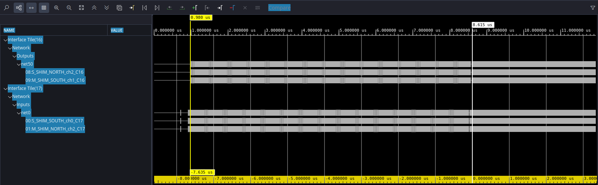

<!--
Copyright (C) 2024, Advanced Micro Devices, Inc. All rights reserved.
SPDX-License-Identifier: MIT
Author: Mark Rollins
-->

## DFT Designs on AI Engine

Small transforms with $N < 70$ can often be implemented quite efficiently in AI Engines using a
“vector x matrix” approach. Instead of using the “divide-and-conquer” approach of FFT, compute
the transform explicitly using the DFT. This section provides such an example.

### DFT as a Vector x Matrix Multiplication

The figure below illustrates how the DFT can be
computed as a “vector-matrix” multiplication for the size $N = 16$. Input samples arrive in a 1 x 16
input vector for each transform. This vector is multiplied by a 16 x 16 matrix of DFT twiddle
factors to produce a 1 x 16 output vector. This computation requires $N^2 = 256$ complex
multiplications per transform.

### High Throughput SSR=8 DFT Design

The direct form DFT approach is used here to construct a high throughput $N=16$ DFT design,
achieving rates of SSR = 8 for `cint16` I/O data types and `cint16` twiddle factor data types. The
following figure illustrates the principles of its operation as outlined below:
* The design targets SSR=8 operation, which implies the input samples arrive at a rate of 8
samples per AI Engine clock cycle. Given the transform consists of $N=16$ samples, it receives
eight samples in each cycle, and the complete transform must be computed at a sustained rate
of two cycles per transform.
* A single AI Engine can perform one [1x2] x [2x4] vector-matrix multiplication in a single cycle,
consisting of eight parallel complex-valued `cint16` multiply/accumulate operations (OPs). The
complete 16-pt DFT can be broken down into 32 such OPs. Given that the entire transform
must be computed within two cycles, a design with 16 AI Engine tiles is required.
* Color coding is used in the previous figure, so the computation is mapped across tiles.
Imagine each colored “row-pair” representing four AI Engine tiles (with four such row-pairs
overall). Each tile computes two OPs, sums the results together, and transfers its results to the
tile immediately below itself using the “stream cascade” interface. Each middle-row pair
combines its results with those received from the tile above. The bottom-most row-pair
completes the final sum and outputs its results.
* The design uses two input streams to feed each row-pair of the design, reading & writing on
both streams four samples once every four cycles. The previous figure illustrates how each
stream delivers two samples from two consecutive vector inputs. Each input stream is
broadcast to all tiles in a row-pair according to the color scheme.
* The bottom row-pair produces the design outputs, writing four samples every four cycles.
Each tile in this last row-pair produces four vector dot products of one-quarter of the input
vector with four columns of the DFT twiddle matrix.
* Over every four cycles, input two input vectors and compute two output vectors, performing
two independent DFT computations.
* The design is implemented using AI Engine API coding techniques. Details can be found in the
accompanying source code.

The following figure shows the AI Engine graph for the $N=16$ DFT design. The following
observations can be summarized as follows:
* The design uses 16 AI Engine tiles overall.
* Each row of four tiles in the following figure corresponds to a particular column of the 16 x 16
matrix shown in the previous figure. The cascade streams pass intermediate results between
tiles in each row (representing data being passed down the columns in the previous figure).
* As outlined above, a pair of PLIO inputs is broadcast to four tiles.
* The DFT twiddle factor coefficients are stored in each tile using local memory buffers.
* The last tile in each row produces a pair of PLIO outputs.

### Throughput Measurement for the `dft16` Design

The following figure shows the Vitis Analyzer trace for the $N=16$ DFT design, where throughput
is measured by identifying the total time taken to process 8192 samples in a single kernel
invocation. The design achieves a throughput of 7.635 μs or 8192 / 7.635 μs = 1073 Msps. This
throughput rate is achieved on each of the designs eight PLIOs, indicating the design achieves its
SSR=8 objective.

  &copy; Copyright 2024 Advanced Micro Devices, Inc.

  &copy; Copyright 2021 Xilinx Inc.

