<table class="sphinxhide" style="width:100%;">
  <tr>
    <td align="center">
      <picture>
        <source media="(prefers-color-scheme: dark)" srcset="https://raw.githubusercontent.com/Xilinx/Image-Collateral/main/logo-white-text.png">
        
      </picture>
      <h1>AMD Vitis™ AI Engine Tutorials</h1>
      <a href="https://www.amd.com/en/products/software/adaptive-socs-and-fpgas/vitis.html">See Vitis™ Development Environment on amd.com</a>
        </br>
      <a href="https://www.amd.com/en/products/software/vitis-ai.html">See Vitis™ AI Development Environment on amd.com</a>
    </td>
  </tr>
</table>

# FFT Designs on AI Engine

This section showcases several Fast Fourier Transform (FFT) designs for AMD Versal™ AI Engine, starting with a single-core design using the AI Engine API. After establishing the single-core throughput and latency baseline using AMD Vitis™ AI Engine SW simulation tools, it presents several FFT design optimization techniques to improve these benchmarks. The Vitis DSP library uses these techniques to yield high-performance, scalable FFT IP spanning single-core to multicore designs.

## Single Tile AI Engine API Design

The first FFT design presented here for the Versal AI Engine uses the AI Engine API. The API is a portable programming interface for AI Engine accelerators implemented as a C++ header-only library that provides data types and computational operations that translate into efficient low-level intrinsic and VLIW assembly code for the AI Engine vector processor. The API provides high-level abstractions that improve code readability and simplify code maintenance.

This first design is a Radix-2 DIT 32-pt FFT using the Stockham approach. The design implements the complete transform computation using a single AI Engine tile. The code adopts the [C++ Kernel Class](https://docs.amd.com/r/en-US/ug1079-ai-engine-kernel-coding/C-Kernel-Class-Support) programming style that works nicely with the API. The following code block shows the source code for `fft32_r2_kernel.h` that defines the C++ kernel class.

```cpp
#pragma once
#include <adf.h>
#include <aie_api/aie.hpp>
#include "fft32_r2_twiddle.h"
using namespace adf;
class fft32_r2_kernel {
public:
  typedef cint16 TT_DATA;
  typedef cint16 TT_TWID;
  static constexpr unsigned N = 32;
  static constexpr unsigned SHIFT_TW = 15;
  static constexpr unsigned SHIFT_DT = 15;
  static constexpr bool     INVERSE  = false;
  static constexpr unsigned REPEAT   = 128;
  static constexpr unsigned WIN_SIZE = N * REPEAT;
private:
  // Temporary Buffers:
  alignas(aie::vector_decl_align) TT_DATA tbuff[N];
  // Twiddle factors:
  alignas(aie::vector_decl_align) static constexpr TT_TWID    tw1[ 1] = TWID1;
  alignas(aie::vector_decl_align) static constexpr TT_TWID    tw2[ 2] = TWID2;
  alignas(aie::vector_decl_align) static constexpr TT_TWID    tw4[ 4] = TWID4;
  alignas(aie::vector_decl_align) static constexpr TT_TWID    tw8[ 8] = TWID8;
  alignas(aie::vector_decl_align) static constexpr TT_TWID   tw16[16] = TWID16;
public:
  // Constructor:
  fft32_r2_kernel(void);
  // Run:
  void run(  input_buffer<TT_DATA,extents<WIN_SIZE> >& __restrict sig_i,
            output_buffer<TT_DATA,extents<WIN_SIZE> >& __restrict sig_o );
  static void registerKernelClass( void )
  {
    REGISTER_FUNCTION( fft32_r2_kernel::run );
  }
};
```

The following section highlights some critical aspects of the previous code:

* The data types for this design are defined as `TT_DATA` and `TT_TWID`. This FFT uses 16-bit fixed-point data types with "cint16" for the datapath and "cint16" twiddle factors. The design declares a data buffer `tbuff` to provide the additional storage required for the Stockham approach.
* The `run()` function defines the kernel interface. This kernel is designed to use buffer-based I/O. The buffer size is set using the `WIN_SIZE` parameter. Note the window size depends on the transform size `N` and the `REPEAT` parameter used to establish "batch-processing" to increase throughput, as outlined in detail as follows.
  * The `INVERSE` parameter controls whether the kernel computes an FFT (true) or an iFFT (false).
  * The twiddle factor tables are hard-coded to values supplied in the external included file `fft32_r2_twiddle.h`. Note how all data tables are aligned to 128-bit boundaries as required to support vector memory access in the AI Engine architecture. The AI Engine API provides `aie::vector_decl_align` as a future-proof means to supply the correct alignment (should this requirement change in future architectures).

The following code block shows the source code for `fft32_r2_kernel.cpp` that contains its implementation.

```cpp
#include <adf.h>
#include <aie_api/aie.hpp>

#include "fft32_r2_kernel.h"

fft32_r2_kernel::fft32_r2_kernel( void )
{
  aie::set_rounding(aie::rounding_mode::positive_inf);
  aie::set_saturation(aie::saturation_mode::saturate);
}

void fft32_r2_kernel::run(  input_buffer<TT_DATA,extents<WIN_SIZE> >& __restrict sig_i,
                           output_buffer<TT_DATA,extents<WIN_SIZE> >& __restrict sig_o )
{
  // Set pointers to windows:
  TT_DATA* ibuff = sig_i.data();
  TT_DATA* obuff = sig_o.data();
  // Perform FFT:
  for (int rr=0; rr < REPEAT; rr++)
    chess_prepare_for_pipelining
    chess_loop_range(REPEAT,)
  {
    aie::fft_dit_r2_stage<16>(ibuff, tw1,  N, SHIFT_TW, SHIFT_DT, INVERSE, tbuff);
    aie::fft_dit_r2_stage< 8>(tbuff, tw2,  N, SHIFT_TW, SHIFT_DT, INVERSE, ibuff);
    aie::fft_dit_r2_stage< 4>(ibuff, tw4,  N, SHIFT_TW, SHIFT_DT, INVERSE, tbuff);
    aie::fft_dit_r2_stage< 2>(tbuff, tw8,  N, SHIFT_TW, SHIFT_DT, INVERSE, ibuff);
    aie::fft_dit_r2_stage< 1>(ibuff, tw16, N, SHIFT_TW, SHIFT_DT, INVERSE, obuff);
    ibuff += N;
    obuff += N;
  }
}
```

The following section highlights some critical aspects of the previous code:

* AI Engine rounding and saturation modes are set in the kernel constructor using the AI Engine API.
* The `run()` function provides the kernel signature. As mentioned earlier, the kernel is buffer-based based on I/O. Pointers to the input and output buffers included here.
* The kernel contains a single "for-loop." Each iteration of this loop computes a single 32-pt transform. The `REPEAT` parameter controls how many transforms are computed per kernel invocation. Sufficient input data must be supplied for exactly these many transforms.
* The `fft_dit_r2_stage()` function implements each Stockham DIT stage. The design requires five such stages to implement a 32-pt transform. This routine is described in further detail in the following section.
* The code demonstrates the "ping-pong" nature of the Stockham algorithm outlined earlier. Here, the input buffer (pointed to by `ibuff`) forms one side, and the `tbuff` forms the other side of this ping-pong buffer. Each buffer serves alternately as input or output as the stage computations progress.

The `fft_dit_r2_stage()` provided by the API performs Radix-2 stages for DIT Stockham FFTs. These are documented in [[3]](https://download.amd.com/docnav/aiengine/xilinx2023_2/aiengine_api/aie_api/doc/group__group__fft.html). The routine is templatized and parameterized for flexibility to support various data types and transform sizes. The AIE API supports Radix-2, Radix-3, Radix-4, and Radix-5 stages depending on data types. See [[3]](https://download.amd.com/docnav/aiengine/xilinx2023_2/aiengine_api/aie_api/doc/group__group__fft.html) for the current supported routines.
  
The following figure shows the AI Engine graph for this single-tile FFT design. The PLIO connects are made using streams, but these are translated to kernel interface buffers. In this case, the `REPEAT` parameter was set to unity, indicating the buffer size was set to match the transform size.
  
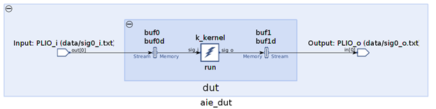

## Throughput and Latency Measurements for `fft32_r2` Design

The following figures show the throughput and latency as measured using AMD Vitis™ Analyzer, which are 152.8 ns and 464.8 ns, respectively.

This throughput level is equivalent to 32/152.8e-9 = 209 MSPS. This provides the baseline performance for a single-tile AI Engine implementation of the FFT-32 Stockham transform with fixed-point `cint16` data types.

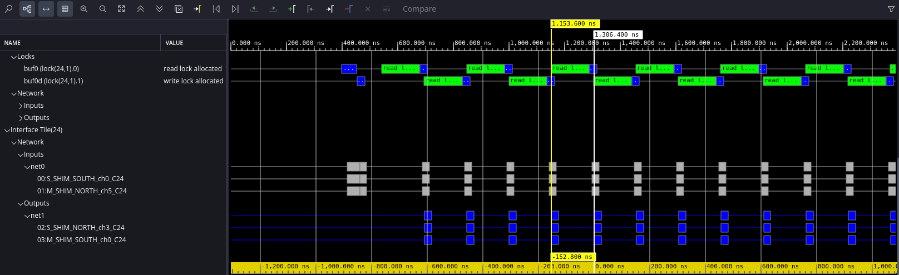

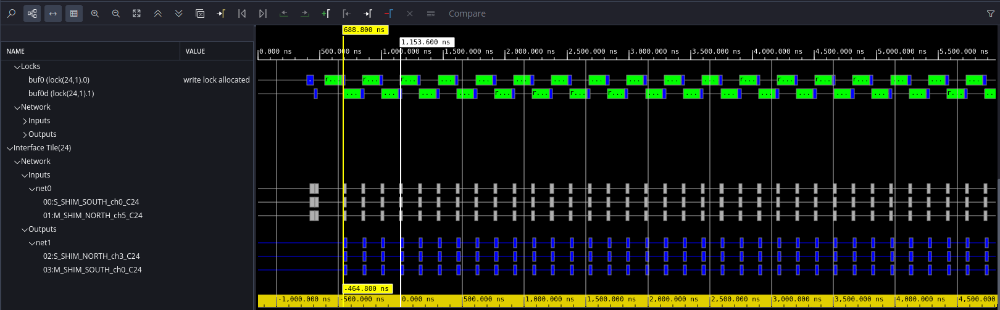

## Optimization Technique: Batch Processing

The system can improve throughput of buffer-based AI Engine transforms at the expense of additional latency using "batch processing." This technique employs a buffer size that is larger than the transform size. This way, the switching overhead from ping to pong buffers occurs only once per batch instead of every transform. Overall, throughput improves at the expense of additional latency because it takes longer to buffer multiple data sets.

The following table illustrates the impact of using `REPEAT=128` over `REPEAT=1` for the AIE API version of the FFT-32 design. The overall throughput increased from 209 Msps to 315 MSPS, while the latency increased significantly due to the buffering up of 128 transforms.

In practice, the fundamental 128 KB limit of neighboring AI Engine local tile memory limits batch processing improvements, particularly for larger transforms. Additional techniques are required to further improve throughput.

|Design            |# of AI Engines| `REPEAT`|Throughput (MSPS)| Latency (us)|
|------------------|---------------|---------|-----------------|-------------|
|`fft32_r2`        | 1             | 1       | 209             | 0.446       |
|`fft32_r2`        | 1             | 128     | 315             | 26.2        |
|`fft32_dsplib`    | 1             | 1       | 225             | 0.423       |
|`fft32_dsplib`    | 1             | 128     | 358             | 22.85       |
|`fft_dsplib_split`| 3             | 1       | 381             | 0.392       |
|`fft_dsplib_ssr`  | 4             | 128     | 531             | 8.604       |

## Single-Tile DSPlib Design

The alternative to custom-coded FFT designs using AI Engine API is to simply instantiate the high-performance IP available in the Vitis DSP library. These IP cores provide high performance that is scalable from a single AI Engine tile to literally dozens of tiles. The IP consists of C++ template classes. The template parameters can be set according to the desired system-level performance and resource utilization suited to the application.

This section considers a "drop-in" replacement for the Radix-2 FFT-32 designed earlier using the AIE API. The transform from Vitis DSP library differs in a few ways from the earlier design:

* The Vitis DSP library relies on Radix-4 transforms to optimize QoR. Consequently, to implement an FFT-32, the design uses two Radix-4 stages and a final Radix-2 stage. This leads to better throughput as Radix-4 stages vectorize more efficiently to the AI Engine architecture. This also leads to better latency because there are fewer stages overall to compute.
* The FFT designs in the Vitis DSP library use either `cfloat` or `cint32` internally in all cases, even for I/O data delivered as `cint16`. This approach avoids explicit bit growth management from stage to stage, which would otherwise impact throughput negatively. This also helps make the IP scalable.

The following code block shows the source code for instantiating the single-tile FFT-32 design from Vitis DSP library (`fft32_dsplib`). The following highlights some key aspects of the design:

* The file must include the proper header file `fft_ifft_dit_1ch_graph.hpp` to access the FFT graph, and must identify the namespace `xf::dsp::aie::fft::dit_1ch`.
* The template parameters for the IP are configured using a number of `static constexpr` definitions. The transform size is configured to 32 points, I/O is defined for a 16-bit fixed-point, an FFT is selected, and `TP_API=0` selects a buffer-based interface. Two key optimization parameters, `TP_PARALLEL` and `TP_CASC_LEN`, are left at their defaults, leading to a simple single-tile design.
* The IP graph is instantiated as `dut_fft`.
* The `fft_i` and `fft_o` define arrays of I/O ports from PLIO. This initial design requires only a single port, but later in the tutorial additional ports are added to increase the throughput of the design.

```cpp
#pragma once
#include <adf.h>
#include <vector>
#include <fft_ifft_dit_1ch_graph.hpp>
using namespace adf;
using namespace xf::dsp::aie::fft::dit_1ch;

template<int ORIGIN_X, int ORIGIN_Y>
class fft32_dsplib_graph : public graph {
public:
  typedef cint16                              TT_TYPE;
  typedef cint16                              TT_TWIDDLE;
  static constexpr int  REPEAT                = 1;
  static constexpr int  TP_POINT_SIZE         = 32;
  static constexpr int  TP_FFT_NIFFT          = 1;
  static constexpr int  TP_SHIFT              = 0;
  static constexpr int  TP_CASC_LEN           = 1;
  static constexpr int  TP_DYN_PT_SIZE        = 0;
  static constexpr int  TP_WINDOW_SIZE        = TP_POINT_SIZE * REPEAT;
  static constexpr int  TP_API                = 0;
  static constexpr int  TP_PARALLEL_POWER     = 0;
  static constexpr int  Nports = (TP_API == 1 ) ? (1 << (TP_PARALLEL_POWER+1)) : 1;

  std::array<input_plio,Nports>  fft_i;
  std::array<output_plio,Nports> fft_o;

  fft_ifft_dit_1ch_graph<TT_TYPE,TT_TWIDDLE,TP_POINT_SIZE,TP_FFT_NIFFT,TP_SHIFT,
                         TP_CASC_LEN,TP_DYN_PT_SIZE,TP_WINDOW_SIZE,TP_API,
                         TP_PARALLEL_POWER> dut_fft;
  fft32_dsplib_graph(void)
  {
    for (int ii=0; ii < Nports; ii++) {
      std::string fname_i = "data/sig" + std::to_string(ii) + "_i.txt";
      std::string fname_o = "data/sig" + std::to_string(ii) + "_o.txt";
      fft_i[ii] =  input_plio::create("PLIO_i_"+std::to_string(ii),plio_64_bits,fname_i);
      fft_o[ii] = output_plio::create("PLIO_o_"+std::to_string(ii),plio_64_bits,fname_o);
      connect<stream>( fft_i[ii].out[0], dut_fft.in[ii]  );
      connect<stream>( dut_fft.out[ii],  fft_o[ii].in[0] );
    }
  }
};
```

The following figure shows the AI Engine graph for `fft32_dsplib`. The AI Engine graphs corresponding to code for `fft32_r2` and `fft32_dsplib` have similarities. In the latter, the additional data buffers required by the Stockham approach appear explicitly at the graph level, whereas they remain internal in the former. The `REPEAT` parameter uses unity, setting the buffer size to match the transform size.

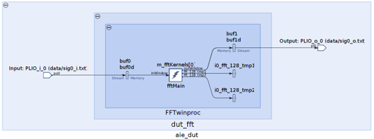

## Throughput and Latency Measurements for `fft32_dsplib` Design

The throughput and latency measured using Vitis Analyzer are shown to be 142.4 ns and 423.2 ns, in the following figures. This throughput level is equivalent to 32/142.4e-9 = 225 MSPS. Note that a higher QoR is achieved by the Vitis DSP library IP.

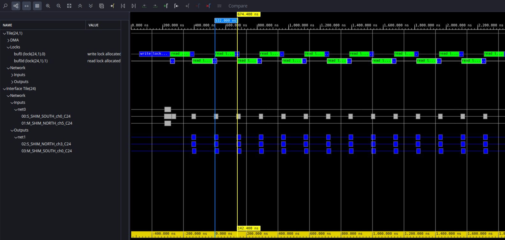

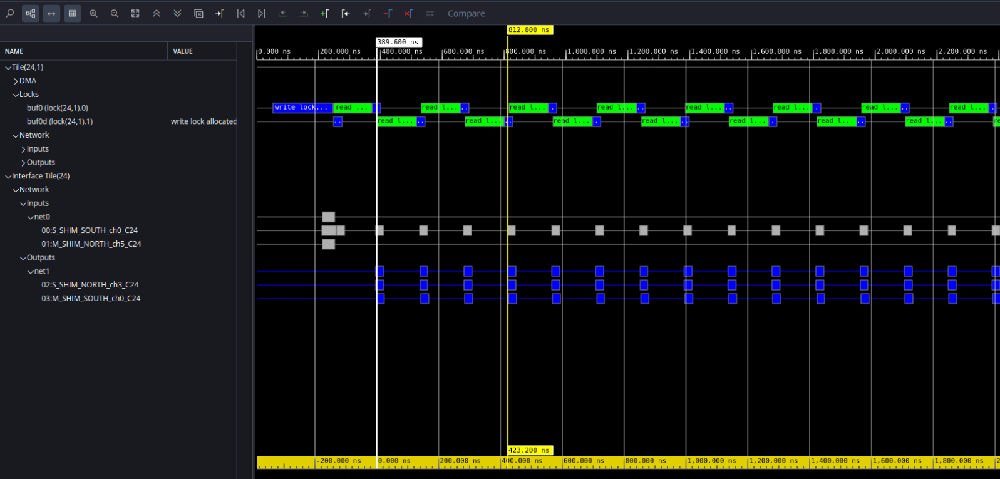

The Vitis DSP library supports the same "batch processing" approach to improving throughput. Set the `TP_WINDOW_SIZE` parameter to hold multiple transforms and reduce the overhead. The previous code block is set up to do this using the `REPEAT` parameter. When set to `REPEAT=128`, a throughput and latency of 11.434 μs and 22.85 μs are achieved, respectively. This throughput level is equivalent to 128*32/11.434e-6 = 358 MSPS. These results are summarized and compared to the earlier design in the table above.
  
## Optimization Technique: Split Stages

A second means of improving the throughput of FFT designs lies in leveraging the pipelining afforded by the AI Engine array. The computation can be partitioned across multiple tiles in a row, passing intermediate results from one tile to the next using the shared memory buffers between them. This form of "pipelining" leads to increased throughput from using additional tile resources.

The Vitis DSP library design `fft32_dsplib_split` demonstrates this approach. The `TP_CASC_LEN` parameter identifies how many tiles in a row shall be used to perform the transform. When set to `TP_CASC_LEN=3`, the computation is split over three tiles. This choice aligns with the FFT-32 case because it is implemented as two Radix-4 stages followed by a third Radix-2 stage. So, each stage is assigned to its tile.

The following figure shows the AI Engine graph for this three-tile FFT design from Vitis DSP library. A shared memory buffer is placed between each pair of tiles in the chain. With `cint16` data and a 32-point transform, intermediate results can pass between tiles using conventional 32-bit memory interfaces without degradation in bit fidelity. For larger transforms or 32-bit I/O, the Vitis DSP Library automatically uses the 384-bit cascade accumulator streaming connections between tiles.
The paragraphs and markdown formatting are now correctly formatted.

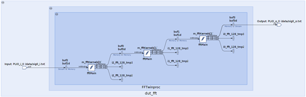

## Throughput and Latency Measurements for `fft32_dsplib_split` Design

With the `REPEAT` parameter set to unity, indicating the buffer size was set to match the transform size, the throughput, and latency measured using Vitis Analyzer are shown to be 84 ns and 392 ns, respectively, in the following figures. This throughput level is equivalent to 32/88e-9 = 381 Msps.

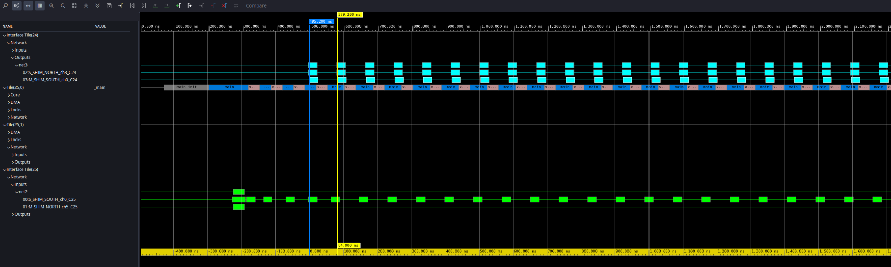

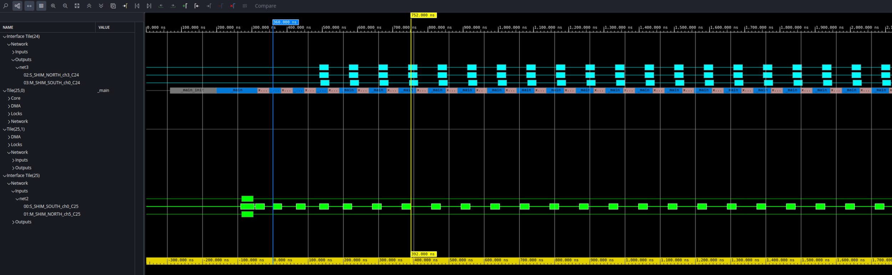

# Optimization Technique: Parallel Implementation

The Vitis DSP library design `fft32_dsplib_ssr` demonstrates one final optimization technique that provides the most significant increase in throughput by mapping the transform computation over a 2D grid of tiles. This combines the advantages of the "pipelined" approach shown earlier with additional benefits of parallelism from using multiple rows of the AI Engine array. The 2D approach also leverages the ability to bring in more data at higher bandwidths using multiple parallel PLIO streams.

The template parameter `TP_PARALLEL_POWER` can scale the FFT design across a 2D array of tiles. It also allows for support of transform sizes beyond the capabilities of a single tile. Essentially, this parameter splits the computation across `T = 2^TP_PARALLEL_POWER` tiles, with each tile performing a point size of `N/T`. These "front-end" tiles are called "subframe processors." The design is fed by `2T` stream ports. To synthesize the result, these `T` tiles will be combined with another `log2(T) x T` tiles of the Radix-2 stages. This is demonstrated in the following figure for three different values of `TP_PARALLEL_POWER`.

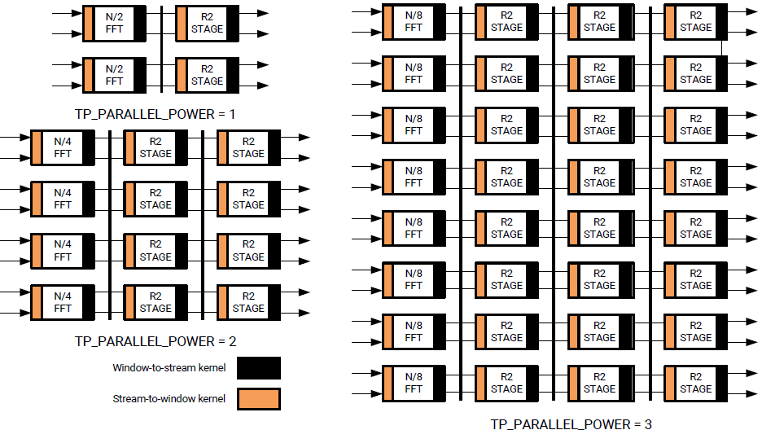

Each rectangle in the previous figure represents a combination of three kernels implemented in a single AI Engine tile. The orange rectangles represent a "stream-to-window" kernel that collects the dual-stream inputs into an input window buffer. The black rectangles represent a "window-to-stream" kernel that distributes the computed samples to the dual-stream outputs. The stream routing network then routes these outputs to their proper destinations according to the required Stockham addressing. The following table summarizes the number of AI Engine tiles required to implement the FFT IP as a function of the `TP_PARALLEL_POWER` parameter.

| `TP_PARALLEL_POWER` | # of AI Engine Tiles|
|---------------------|---------------------|
| 0                   |  1                  |
| 1                   |  4                  |
| 2                   |  12                 |
| 3                   |  32                 |
| 4                   |  80                 |
  
One scaling limitation of the Vitis DSP Library FFT IP is the following. The supported transform size for the front-end subframe processors when scaling with `TP_PARALLEL_POWER` is restricted to all powers of two between 16 and 4096 inclusive. Transform sizes outside of this range are not supported. Therefore, scaling the FFT-32 can only be done with `TP_PARALLEL_POWER = 1` because this results in the smallest supported transform size of 16 for the subframe processors. The following figure shows the graph for this case.

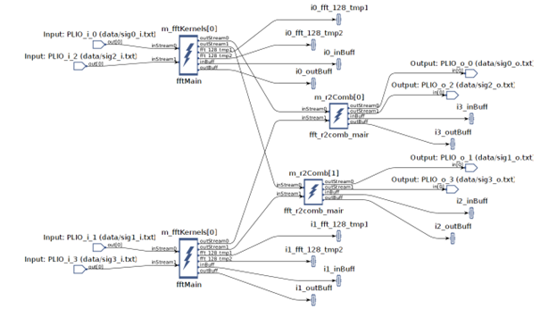

## Throughput and Latency measurements for `fft32_dsplib_ssr` Design

With the `REPEAT` parameter set to 128, the throughput and latency as measured using Vitis Analyzer are shown to be 7.716 μs and 8.604 μs, respectively, in the following figures. This throughput level is equivalent to 128*32/7.716e-6 = 531 MSPS. This can be compared to the other FFT-32 designs in the previous table.

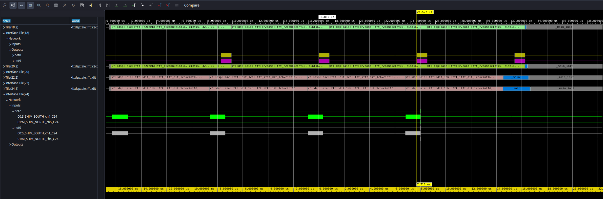

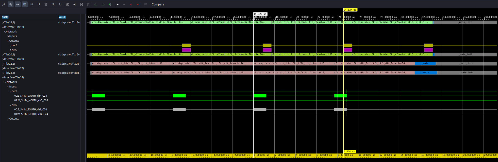

<hr class="sphinxhide"></hr>

<p class="sphinxhide" align="center"><sub>Copyright © 2020–2026 Advanced Micro Devices, Inc.</sub></p>

<p class="sphinxhide" align="center"><sup><a href="https://www.amd.com/en/corporate/copyright">Terms and Conditions</a></sup></p>
