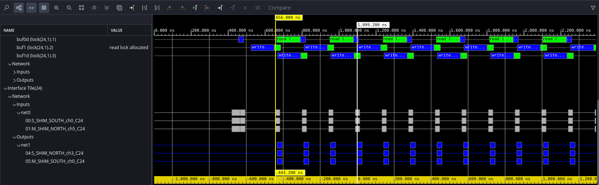

<!--
Copyright (C) 2024, Advanced Micro Devices, Inc. All rights reserved.
SPDX-License-Identifier: MIT
Author: Mark Rollins
-->

## FFT Designs on AI Engine

This section showcases several FFT designs for AMD Versal™ AI Engine, starting with a singlecore
design implemented using the AI Engine API. After establishing the single-core throughput
and latency baseline using AMD Vitis™ AI Engine SW simulation tools, it presents several FFT
design optimization techniques to improve these benchmarks. These techniques are used within
the Vitis DSP library to yield high-performance, scalable FFT IP spanning single-core to multicore
designs.

### Single Tile AI Engine API Design

The first FFT design presented here for the Versal AI Engine is implemented using the AI Engine
API. The API is a portable programming interface for AI Engine accelerators that is implemented
as a C++ header-only library that provides data types and computational operations that get
translated into efficient low-level intrinsic and VLIW assembly code for the AI Engine vector
processor. The API provides high-level abstractions that improve code readability and simplify
code maintenance.

This first design is a Radix-2 DIT 32-pt FFT using the Stockham approach. The design implements
the complete transform computation using a single AI Engine tile. The code adopts the [C++
Kernel Class](https://docs.amd.com/r/en-US/ug1079-ai-engine-kernel-coding/C-Kernel-Class-Support) 
programming style that works nicely with the API. The following code block shows the source code for `fft32_r2_kernel.h` 
that defines the C++ kernel class.

```
#pragma once
#include <adf.h>
#include <aie_api/aie.hpp>
#include "fft32_r2_twiddle.h"
using namespace adf;
class fft32_r2_kernel {
public:
  typedef cint16 TT_DATA;
  typedef cint16 TT_TWID;
  static constexpr unsigned N = 32;
  static constexpr unsigned SHIFT_TW = 15;
  static constexpr unsigned SHIFT_DT = 15;
  static constexpr bool     INVERSE  = false;
  static constexpr unsigned REPEAT   = 128;
  static constexpr unsigned WIN_SIZE = N * REPEAT;
private:
  // Temporary Buffers:
  alignas(aie::vector_decl_align) TT_DATA tbuff[N];
  // Twiddle factors:
  alignas(aie::vector_decl_align) static constexpr TT_TWID    tw1[ 1] = TWID1;
  alignas(aie::vector_decl_align) static constexpr TT_TWID    tw2[ 2] = TWID2;
  alignas(aie::vector_decl_align) static constexpr TT_TWID    tw4[ 4] = TWID4;
  alignas(aie::vector_decl_align) static constexpr TT_TWID    tw8[ 8] = TWID8;
  alignas(aie::vector_decl_align) static constexpr TT_TWID   tw16[16] = TWID16;
public:
  // Constructor:
  fft32_r2_kernel(void);
  // Run:
  void run(  input_buffer<TT_DATA,extents<WIN_SIZE> >& __restrict sig_i,
            output_buffer<TT_DATA,extents<WIN_SIZE> >& __restrict sig_o );
  static void registerKernelClass( void )
  {
    REGISTER_FUNCTION( fft32_r2_kernel::run );
  }
};
```

Some critical aspects of the previous code are highlighted in the following:
* The data types for this design are defined as `TT_DATA` and `TT_TWID`. This FFT uses 16-bit fixed-point
data types with “cint16” for the data path and “cint16” twiddle factors.
The design declares a data buffer `tbuff` to provide the additional storage required for the Stockham approach.
* The `run()` function defines the kernel interface. This kernel is designed to use
buffer-based I/O. The buffer size is set using the `WIN_SIZE` parameter. Note the
window size depends on the transform size `N` and the `REPEAT` parameter
used to establish “batch-processing” to increase throughput, as outlined in detail as follows.

  * The `INVERSE` parameter controls whether the kernel computes an FFT (true) or an IFFT (false).
  * The twiddle factor tables are hard-coded to values supplied in the external
    included file `fft32_r2_twiddle.h`. Note how all data tables are aligned to
    128-bit boundaries as required to support vector memory access in the AI Engine
    architecture. The AI Engine API provides `aie::vector_decl_align` as a future-proof
    means to supply the correct alignment (should this requirement change in future
    architectures).

The following code block shows the source code for `fft32_r2_kernel.cpp` that contains its implementation.

```
#include <adf.h>
#include <aie_api/aie.hpp>

#include "fft32_r2_kernel.h"

fft32_r2_kernel::fft32_r2_kernel( void )
{
  aie::set_rounding(aie::rounding_mode::positive_inf);
  aie::set_saturation(aie::saturation_mode::saturate);
}

void fft32_r2_kernel::run(  input_buffer<TT_DATA,extents<WIN_SIZE> >& __restrict sig_i,
                           output_buffer<TT_DATA,extents<WIN_SIZE> >& __restrict sig_o )
{
  // Set pointers to windows:
  TT_DATA* ibuff = sig_i.data();
  TT_DATA* obuff = sig_o.data();
  // Perform FFT:
  for (int rr=0; rr < REPEAT; rr++)
    chess_prepare_for_pipelining
    chess_loop_range(REPEAT,)
  {
    aie::fft_dit_r2_stage<16>(ibuff, tw1,  N, SHIFT_TW, SHIFT_DT, INVERSE, tbuff);
    aie::fft_dit_r2_stage< 8>(tbuff, tw2,  N, SHIFT_TW, SHIFT_DT, INVERSE, ibuff);
    aie::fft_dit_r2_stage< 4>(ibuff, tw4,  N, SHIFT_TW, SHIFT_DT, INVERSE, tbuff);
    aie::fft_dit_r2_stage< 2>(tbuff, tw8,  N, SHIFT_TW, SHIFT_DT, INVERSE, ibuff);
    aie::fft_dit_r2_stage< 1>(ibuff, tw16, N, SHIFT_TW, SHIFT_DT, INVERSE, obuff);
    ibuff += N;
    obuff += N;
  }
}
```

Some critical aspects of the previous code are highlighted in the following:
* AI Engine rounding and saturation modes are set in the kernel constructor using the AI Engine API.
* The kernel signature is provided by the `run()` function. As mentioned earlier, the
  kernel is buffer-based based on I/O. Pointers to the input and output buffers included here.
* The kernel contains a single “for-loop”. Each iteration of this loop computes a single
  32-pt transform. The `REPEAT` parameter controls how many transforms are computed per
  kernel invocation. Sufficient input data must be supplied for exactly these many transforms.
* The `fft_dit_r2_stage()` function implements each Stockham DIT stage. The
  design requires five such stages to implement a 32-pt transform. This routine is described in
  further detail below
* The code demonstrates the “ping-pong” nature of the Stockham algorithm outlined earlier.
  Here, the input buffer (pointed to by `ibuff`) forms one side, and the `tbuff` forms the other
  side of this ping-pong buffer. Each buffer serves alternately as input or output as the stage
  computations progress.

THe `fft_dit_r2_stage()` provided by the API performs Radix-2 stages for DIT Stockham FFTs. These are documented fully 
in [[3]](https://www.xilinx.com/htmldocs/xilinx2023_2/aiengine_api/aie_api/doc/group__group__fft.html). The routine is templatized 
and parameterized for flexibility to support various data types and transform sizes. The AIE API supports Radix-2, Radix-3, Radix-4,
and Radix-5 stages depending on data types. See [[3]](https://www.xilinx.com/htmldocs/xilinx2023_2/aiengine_api/aie_api/doc/group__group__fft.html) for 
the current supported routines.
  
The following figure shows the AI Engine graph for this single-tile FFT design. The PLIO connects
are made using streams, but these are translated to kernel interface buffers. In this case, the
`REPEAT` parameter was set to unity, indicating the buffer size was set to match the transform
size.
  


### Throughput and Latency Measurements for `fft32_r2` Design
The throughput and latency as measured using AMD Vitis™ Analyzer are shown to be 152.8 ns and 464.8 ns, respectively, in the following figures.
This throughput level is equivalent to 32/152.8e-9 = 209 Msps. This provides the baseline performance for a single-tile AI Engine implementation of the 
FFT-32 Stockham transform with fixed-point `cint16` data types.


### Optimization Technique: Batch Processing

The throughput of buffer-based AI Engine transforms can be improved at the expense of
additional latency using “batch processing.” This technique employs a buffer size that is larger
than the transform size. This way, the switching overhead from ping to pong buffers occurs only
once per batch instead of every transform. Overall, throughput is improved at the expense of
additional latency because it takes longer to buffer multiple data sets.

The following table illustrates the impact of using `REPEAT=128` over `REPEAT=1` for the AIE
API version of the FFT-32 design. The overall throughput increased from 209 Msps to 312 Msps,
while the latency increased significantly due to the buffering up of 128 transforms.

In practice, the fundamental 128 KB limit of neighboring AI Engine local tile memory limits the
improvement offered by batch processing, particularly for the larger transforms, and it needs to
resort to additional techniques to improve throughput further.

|Design            |# of AI Engines| `REPEAT`|Throughput (Msps)| Latency (us)|
|------------------|---------------|---------|-----------------|-------------|
|`fft32_r2`        | 1             | 1       | 209             | 0.446       |
|`fft32_r2`        | 1             | 128     | 312             | 26.2        |
|`fft32_dsplib`    | 1             | 1       | 222             | 0.443       |
|`fft32_dsplib`    | 1             | 128     | 367             | 22.29       |
|`fft_dsplib_split`| 3             | 1       | 363             | 0.408       |
|`fft_dsplib_ssr`  | 4             | 128     | 474             | 9.52        |

### Single-Tile DSPlib Design

The alternative to custom-coded FFT designs using AI Engine API is to simply instantiate the
high-performance IP available in the Vitis DSP library. These IP cores provide very high
performance that is scalable from a single AI Engine tile to literally dozens of tiles. The IP is
realized as a set of C++ template classes. The template parameters can be set according to the
desired system-level performance and resource utilization suited to the application.

This section considers a “drop-in” replacement for the Radix-2 FFT-32 designed earlier using the
AIE API. The transform from Vitis DSP library differs in a few minor ways from the earlier design:
* The Vitis DSP library relies heavily on Radix-4 transforms to optimize QoR. Consequently, to
implement an FFT-32, the design will be built with two Radix-4 stages and a final Radix-2
stage. This leads to better throughput as Radix-4 stages vectorize more efficiently to the
AI Engine architecture. This also leads to better latency because there are fewer stages overall
to compute.
* The FFT designs in the Vitis DSP library use either `cfloat` or `cint32` internally in all cases,
even for I/O data delivered as `cint16`. This is done so bit growth need not be managed
explicitly from stage to stage as this impacts throughput negatively. This also facilitates
making the IP scalable.

The following code block shows the source code for instantiating the single-tile FFT-32 design
from Vitis DSP library (`fft32_dsplib`). The following highlights some key aspects of the
design:
* The file must include the proper header file `fft_ifft_dit_1ch_graph.hpp` to access the FFT graph, and must identify the
namespace `xf::dsp::aie::fft::dit_1ch`
* The template parameters for the IP are configured using a number of `static constexpr` definitions. The transform size is configured to
32 points, I/O is defined for a 16-bit fixed-point, an FFT is selected, and `TP_API=0` selects a
buffer-based interface. Two key optimization parameters, `TP_PARALLEL` and
`TP_CASC_LEN`, are left at their defaults, leading to a simple single-tile design.
* The IP graph is instantiated as `dut_fft`.
* The `fft_i` and `fft_o` define arrays of I/O ports from PLIO. Only a single port is required for this
initial design, but you will see later how additional ports can be added to increase the
throughput of the design.

```
#pragma once
#include <adf.h>
#include <vector>
#include <fft_ifft_dit_1ch_graph.hpp>
using namespace adf;
using namespace xf::dsp::aie::fft::dit_1ch;

template<int ORIGIN_X, int ORIGIN_Y>
class fft32_dsplib_graph : public graph {
public:
  typedef cint16                              TT_TYPE;
  typedef cint16                              TT_TWIDDLE;
  static constexpr int  REPEAT                = 1;
  static constexpr int  TP_POINT_SIZE         = 32;
  static constexpr int  TP_FFT_NIFFT          = 1;
  static constexpr int  TP_SHIFT              = 0;
  static constexpr int  TP_CASC_LEN           = 1;
  static constexpr int  TP_DYN_PT_SIZE        = 0;
  static constexpr int  TP_WINDOW_SIZE        = TP_POINT_SIZE * REPEAT;
  static constexpr int  TP_API                = 0;
  static constexpr int  TP_PARALLEL_POWER     = 0;
  static constexpr int  Nports = (TP_API == 1 ) ? (1 << (TP_PARALLEL_POWER+1)) : 1;

  std::array<input_plio,Nports>  fft_i;
  std::array<output_plio,Nports> fft_o;

  fft_ifft_dit_1ch_graph<TT_TYPE,TT_TWIDDLE,TP_POINT_SIZE,TP_FFT_NIFFT,TP_SHIFT,
                         TP_CASC_LEN,TP_DYN_PT_SIZE,TP_WINDOW_SIZE,TP_API,
                         TP_PARALLEL_POWER> dut_fft;
  fft32_dsplib_graph(void)
  {
    for (int ii=0; ii < Nports; ii++) {
      std::string fname_i = "data/sig" + std::to_string(ii) + "_i.txt";
      std::string fname_o = "data/sig" + std::to_string(ii) + "_o.txt";
      fft_i[ii] =  input_plio::create("PLIO_i_"+std::to_string(ii),plio_64_bits,fname_i);
      fft_o[ii] = output_plio::create("PLIO_o_"+std::to_string(ii),plio_64_bits,fname_o);
      connect<stream>( fft_i[ii].out[0], dut_fft.in[ii]  );
      connect<stream>( dut_fft.out[ii],  fft_o[ii].in[0] );
    }
  }
};
```

The AI Engine graph for `fft32_dsplib` is shown below. The AI Engine graphs corresponding to code for `fft32_r2` and `fft32_dsplib` have similarities. 
In the latter, the additional data buffers required by the Stockham approach are made explicit at the graph level, whereas they were kept internal in the former. 
The `REPEAT` parameter was set to unity, indicating the buffer size was set to match
the transform size. 


### Throughput and Latency Measurements for `fft32_dsplib` Design

The throughput and latency measured using Vitis Analyzer are shown to be
144 ns and 443.2 ns, in the following figures. This throughput level is equivalent to 32/144e-9
= 222 Msps. Note that a higher QoR is achieved by the Vitis DSP library IP.




The same “batch processing” approach to improving throughput is supported by the Vitis DSP
library. Set the `TP_WINDOW_SIZE` parameter to hold multiple transforms and reduce the
overhead. The previous code block is set up to do this using the `REPEAT` parameter. When set to
`REPEAT=128`, a throughput and latency of 11.14 μs and 22.29 μs are achieved, respectively.
This throughput level is equivalent to 128*32/11.14e-6 = 367 Msps. These results are
summarized and compared to the earlier design in the table above.  
  
### Optimization Technique: Split Stages

A second means of improving the throughput of FFT designs lies in leveraging the pipelining
afforded by the AI Engine array. The computation can be partitioned across multiple tiles in a
row, passing intermediate results from one tile to the next using the shared memory buffers in
between. This form of “pipelining” leads to increased throughput from using additional tile
resources.

The Vitis DSP library design `fft32_dsplib_split` demonstrates this approach. The
`TP_CASC_LEN` parameter identifies how many tiles in a row shall be used to perform the
transform. When set to `TP_CASC_LEN=3`, the computation is split over three tiles. This choice
aligns with the FFT-32 case because it is implemented as two Radix-4 stages followed by a third
Radix-2 stage. So, each stage is assigned to its tile.

The figure below shows the AI Engine graph for this three-tile FFT design from Vitis DSP
library. A shared memory buffer is placed between each pair of tiles in the chain. As using
`cint16` data here and the transform is only 32 points, it can pass intermediate results between
tiles using the conventional 32-bit memory interfaces without degradation in bit fidelity. In other
cases, such as larger transforms or when using 32-bit I/O where this is not possible, the Vitis
DSP Library automatically elects to pass intermediate results using the 384-bit cascade
accumulator streaming connections between tiles.


### Throughput and Latency Measurements for `fft32_dsplib_split` Design

With the `REPEAT` parameter set to unity, indicating the buffer size was set to match the
transform size, the throughput, and latency measured using Vitis Analyzer are shown to be 88
ns and 408.8 ns, respectively, in the following figures. This throughput level is equivalent to
32/88e-9 = 363 Msps.


## Optimization Technique: Parallel Implementation

The Vitis DSP library design `fft32_dsplib_ssr` demonstrates one final optimization technique that provides the most significant increase in
throughput by mapping the transform computation over a 2D grid of tiles. This combines the
advantages of the “pipelined” approach shown earlier with additional benefits of parallelism
achieved by using multiple rows of the AI Engine array. Additionally, the 2D approach leverages
the ability to bring in more data at higher bandwidths using multiple parallel PLIO streams.

The template parameter `TP_PARALLEL_POWER` can scale the FFT design across a 2D array of
tiles. It also allows for support of transform sizes beyond the capabilities of a single tile.
Essentially, this parameter splits the computation across `T = 2^TP_PARALLEL_POWER` tiles, with
each tile performing a point size of `N/T`. These “front-end” tiles are called “subframe processors.”
The design is fed by `2T` stream ports. To Synthesize the result, these `T` tiles will be combined with
another `log2(T) x T` tiles of the Radix-2 stages. This is demonstrated in the following figure for
three different values of `TP_PARALLEL_POWER`.


Each rectangle in the previous figure represents a combination of three kernels implemented in a
single AI Engine tile. The orange rectangles represent a “stream-to-window” kernel that collects
the dual-stream inputs into an input window buffer. The black rectangles represent a “window-to-
stream” kernel that distributes the computed samples to the dual-stream outputs, which can
then be distributed to their proper destinations over the stream routing network (according to
the required Stockham addressing). The following table summarizes the number of AI Engine tiles
required to implement the FFT IP as a function of the `TP_PARALLEL_POWER` parameter.

| `TP_PARALLEL_POWER` | # of AI Engine Tiles|
|---------------------|---------------------|
| 0                   |  1                  |
| 1                   |  4                  |
| 2                   |  12                 |
| 3                   |  32                 |
| 4                   |  80                 |
  
One scaling limitation of the Vitis DSP Library FFT IP is the following. The supported transform
size for the front-end subframe processors when scaling with `TP_PARALLEL_POWER` is
restricted to all powers of two between 16 and 4096 inclusive. Transform sizes outside of this
range are not supported. Therefore, scaling the FFT-32 can only be done with
`TP_PARALLEL_POWER = 1` because this results in the smallest supported transform size of 16
for the subframe processors. The following figure shows the graph for this case.  
  

    
### Throughput and Latency measurements for `fft32_dsplib_ssr` Design

With the `REPEAT` parameter set to 128, the throughput and latency as measured using Vitis
Analyzer are shown to be 8.631 μs and 9.52 μs, respectively, in the following figures. This
throughput level is equivalent to 128*32/8.631e-6 = 474 Msps. This can be compared to the
other FFT-32 designs in the previous table. 


<p class="sphinxhide" align="center">  &copy; Copyright 2024 Advanced Micro Devices, Inc.</p>
<p class="sphinxhide" align="center">  &copy; Copyright 2021 Xilinx Inc.</p>

