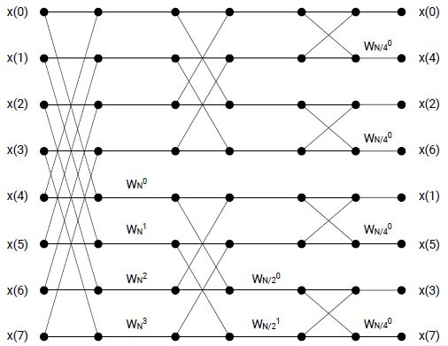
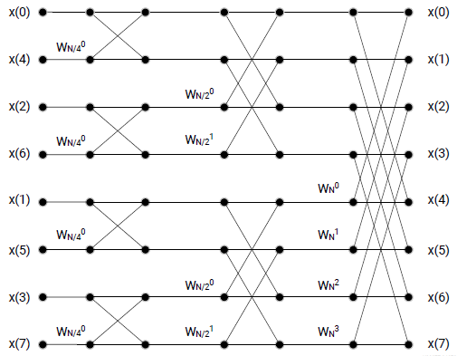
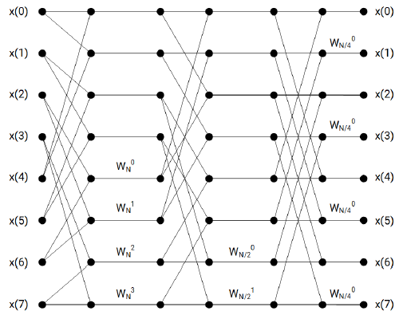
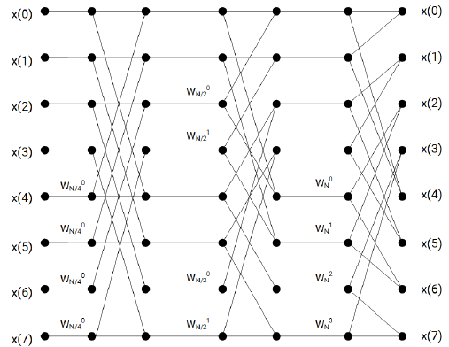

<!--
Copyright (C) 2024, Advanced Micro Devices, Inc. All rights reserved.
SPDX-License-Identifier: MIT
Author: Mark Rollins
-->

## Introduction
Fast Fourier transform algorithms [[1]](https://ieeexplore.ieee.org/abstract/document/5217220) 
compute the discrete Fourier transform of a sampled signal,
translating the original time-domain signal to its frequency-domain representation. The
complexity of computing the DFT is $O(N^2)$ from its definition but can be reduced to $O(NlogN)$
when using the FFT variants, where $N$ is the sample size of the transform. As a result of these
massive computation savings, these transforms find broad applicability across many applications
in engineering and scientific fields.
Due to their ubiquitous nature, the FFT and DFT represent the principal intellectual property (IP)
components for digital signal processing designs in both hardware and software. No other piece
of IP is used more broadly. This application note describes how the AMD Versal™ AI Engine
architecture creates high-performance IP designs for the DFT and FFTs in Versal to use the
optimized IP designs provided by the Vitis DSP Library [[2]](https://docs.amd.com/r/en-US/Vitis_Libraries/dsp/index.html). 
The AI Engine API [[3]](https://www.xilinx.com/htmldocs/xilinx2023_2/aiengine_api/aie_api/doc/index.html) can be used to build
custom FFT designs when circumstances warrant, such as if the FFT IP needs to be coupled
tightly to other system-specific functions. This document covers both scenarios.
This tutorial is organized as follows. Firstly, reviewing general background material for the DFT
and FFT establishes the common baseline framework. The goal is not to teach FFT fundamentals
but to identify clearly how building FFT IP in Versal differs from this common framework. Instead
of the widely used “in-place” algorithms of Cooley-Tukey, Versal adopts the less well-known
“Stockham” approach to achieve a superior quality of result (QoR) tailored to its single-instruction
multiple data (SIMD) architecture. After reviewing these algorithmic differences, the tutorial
presents several FFT IP designs and illustrates their architectures and how their performance is
optimized for throughput and latency.

### Discrete Fourier Transform

The DFT transforms a sequence of $N$ complex (time-domain) numbers ${x_0, x_1, \ldots, x_{N-1}}$ into a
second sequence of complex (frequency-domain) numbers ${X_0, X_1, \ldots, X_{N-1}}$ as shown in the equation below. 
Because each sample $X_k$ requires $N$ complex
multiplications with the fixed “twiddle factors” $exp(-i2πkn/N)$, a total of $N^2$ multiplications are
required overall, leading to the computational complexity of $O(N^2)$.

$$X_k = \sum_{n=0} ^{N-1} x_n \cdot e^{-i\dfrac{2\pi}{N}kn}$$

Direct computation of the above equation can be feasible for cases where $N$ is not too large. The
above equation can be written as a matrix-vector multiplication where the twiddle factors are
collected in an $N\times N$ matrix, and the samples xn are collected in an $N\times 1$ vector. Indeed, a “direct
form” solution like this is shown for a Versal DFT design in a following section.

### Fast Fourier Transform
The best-known FFT algorithms originate from factorings of
$$e^{-i\dfrac{2\pi}{N}kn}$$
which rely on a “divide-and-conquer” algorithm that breaks down the DFT computation
recursively from problem sizes $N=N_1\cdot N_2$ into smaller problem sizes $N_1$ and $N_2$, leading to a
reduction in computational complexity from $O(N^2)$ to $O(NlogN)$. The details of this approach are
well-known and are not repeated here.
The most famous and broadly used FFT algorithms divide each transform into two pieces of size
$N/2$ and were published originally in 1965 by Cooley and Tukey. This “divide-by-2” approach
restricts $N$ to be a “power-of-two” and has come to be called a “Radix-2” FFT algorithm.
Transforms of length $N$ containing other prime factors require additional “mixed-radix”
factorizations. The “divide-by-2” factorizations admit a combining of “Radix-2” pairs into
“Radix-4” factors that lead to savings in multipliers, making the “Radix-4” approach a most
popular implementation.
Two popular FFT factorizations of Cooley/Tukey dominate the FFT landscape. The Decimation in
Frequency (DIF) splits the ${X_k} terms in half using an “even/odd” approach. This leads to a
“butterfly” algorithm, which operates on inputs in the natural order to produce outputs in a “bitreversed”
order (a specific permutation obtained by reversing the order of bits in the output
address labels). An example of this approach is shown below for an 8-point transform.



The Decimation in Time (DIT) factorization splits the ${X_k}$ terms in half using an “even/odd”
approach. This leads to a similar “butterfly” algorithm which operates on inputs in bit-reversed
order to produce outputs in natural rder. An example of this approach is shown below for an 8-
point transform. This is how multiplication by the “twiddle factors” occurs as a “precursor”
(before the butterfly) operation for DIT. In contrast, it occurs as a “post cursor” (after the
butterfly) operation for the DIF approach. The exact nature of the hardware architecture used
can influence which approach is preferred. This is the case for Versal, as is shown below.



The following code block is a MATLAB® code example of a “Radix-2” formulation of the Cooley-
Tukey DIT FFT algorithm. The algorithm structure contains three “for-loops.” The outer loop
processes a number $S=log2(N)$ of Radix-2 stages. The inner two loops process a set of $N/2$
butterfly operations, where the “span” of the butterflies (or distance between its node pairs)
depends on the computation stage. The Cooley-Tukey transforms (both DIF and DIT) are
considered “in-place” algorithms because the input and output addresses of each butterfly are
identical. This has certain advantages in implementation, making these FFTs popular for hardware
designs.

```
function [fft_o] = fft_cooleytukey_dit(fft_i)
   N = numel(fft_i);
   Nstage = log2(N);
   buff_i = bitrevorder(fft_i);
   for stage = Nstage : -1 : 1
     Nhalf = N / 2^stage;
     twid = exp(-1i*2*pi*[0:Nhalf-1]/(2*Nhalf));
     stride = 2^(stage-1);
     skip = N/stride;
     for s = 0 : stride-1
       q = s * skip;
       for p = 0 : Nhalf-1
         % Note: "in-place" addresses:
         idx0_i = q + p + 0;
         idx0_o = q + p + 0;
         idx1_i = q + p + Nhalf;
         idx1_o = q + p + Nhalf;
         a = buff_i(1+idx0_i);
         b = buff_i(1+idx1_i) * twid(1+p);
         buff_i(1+idx0_o) = a + b;
         buff_i(1+idx1_o) = a - b;
       end
     end
   end
   fft_o = buff_i;
end
```

The following code block provides a MATLAB code example of a “Radix-2” formulation of the
Cooley-Tukey DIF FFT algorithm. The algorithm structure also contains three “for-loops,” as in the
DIT case. The main difference is the input and output addresses are reversed for the DIT case.
The input is applied naturally, whereas the output arrives in bit-reversed order. Also, the ordering
of spans in each butterfly is reversed. This is also reflected in the diagrams shown earlier.

```
function [fft_o] = fft_cooleytukey_dif(fft_i)
   N = numel(fft_i);
   Nstage = log2(N);
   buff_i = fft_i;
   for stage = 1 : Nstage
     Nhalf = N / 2^stage;
     twid = exp(-1i*2*pi*[0:Nhalf-1]/(2*Nhalf));
     stride = 2^(stage-1);
     skip = N/stride;
     for s = 0 : stride-1
       q = s * skip;
       for p = 0 : Nhalf-1
         % Note: "in-place" addresses:
         idx0_i = q + p + 0;
         idx0_o = q + p + 0;
         idx1_i = q + p + Nhalf;
         idx1_o = q + p + Nhalf;
         a = buff_i(1+idx0_i);
         b = buff_i(1+idx1_i);
         buff_i(1+idx0_o) =  a + b;
         buff_i(1+idx1_o) = (a - b) * twid(1+p);
       end
     end
   end
   fft_o = bitrevorder(buff_i);
end
```

### Stockham Fast Fourier Transform
One significant drawback of the Cooley-Tukey FFT factorizations is the need for the bit reversal
operations required to establish natural sample order at either the input or output. These bit
reversal permutations can be managed cheaply in traditional hardware (FPGA fabric) solutions
but are expensive when implementing FFTs on coarse-grained CPU or GPU architectures due to
incoherent memory access. Stockham FFT was developed to target vector computers whose
specific factorization attempts to achieve maximal vector parallelism. For this reason, the
Stockham FFT has undergone broad adoption as the method of choice for graphics processors
(GPUs) [[4]](https://ieeexplore.ieee.org/document/4607357). This situation applies equally well 
to the Versal AI Engine and its SIMD vector pipeline architecture.

Unlike the Cooley-Tukey FFT, which implements all computations using the “in-place” approach
identified earlier but requires costly bit-reversal operations, the Stockham FFT expends
additional storage to achieve the natural ordering of I/O samples.

The following figure shows a signal flow graph for a Stockham Radix-2 DIF 8-point transform. Its
structure is like earlier Cooley/Tukey formulations. The number of stages and butterflies is
identical. Still, the I/O addressing of each butterfly differs – the computation is “out-of-place” and requires
an extra storage buffer. The addressing permutation changes at each stage but resolves itself
such that a natural ordering is maintained at both the input and output of the signal flow graph.



Unique variants of the Stockham algorithm for vector computing leverage additional tricks to
improve performance, like refactoring the algorithm to replace “power-of-two” memory strides
with unit strides in the access of twiddle factors and by precomputing twiddle factors in separate
contiguous memory.

The following figure shows a signal flow graph for the Stockham Radix-2 DIT 8-point transform.
Once again, its structure is like the earlier one but uses “out-of-place” butterflies with a reversed
(as compared to the Stockham DIF version) permutation order to achieve a natural I/O ordering.



In practice, the Stockham FFT is often used using two buffers, X and Y, in a ping-pong fashion.
This can be imagined in the context of the previous figures, wherein data is input into buffer X in
the first stage, and the butterfly outputs are computed and stored in buffer Y. The output of the
second stage is then computed from inputs in Y and stored back into X. Finally, the third stage
outputs are computed from inputs in X and stored back into Y.

The following code block provides a MATLAB implementation of the Stockham DIT FFT
algorithm. Like the Cooley/Tukey formulation in FFT Code, the algorithm consists of a triple
nested “for-loop” with the outer loop running over the $S=log2(N)$ stages of butterflies. The code
clearly shows its “out-of-place” character – input addresses are separated by
one stride, whereas output addresses are separated by “Nhalf” strides, and the stride changes on
each stage. The code also clearly shows the “ping/pong” nature of the Stockham approach. The twiddle
factor is applied before the sum and difference computations. This fact will be seen again below regarding 
Versal AI Engine hardware support for FFT.

```
function [fft_o] = fft_stockham_dit(fft_i)
   N = numel(fft_i);
   Nstage = log2(N);
   buff_i = fft_i;
   buff_t = zeros(size(buff_i));
   for stage = Nstage : -1 : 1
     Nhalf = N / 2^stage;
     twid = exp(-1i*2*pi*[0:Nhalf-1]/(2*Nhalf));
     stride = 2^(stage-1);
     for p = 0 : Nhalf-1
       for q = 0 : stride-1
         % Note: address is not "in-place"
         idx0_i = q + stride*(2*p+0);
         idx1_i = q + stride*(2*p+1);
         idx0_o = q + stride*(p+0    );
         idx1_o = q + stride*(p+Nhalf);
         a = buff_i(1+idx0_i);
         b = buff_i(1+idx1_i) * twid(1+p);
         buff_t(1+idx0_o) = a + b;
         buff_t(1+idx1_o) = a - b;
       end
     end
     buff_i = buff_t;
   end
   fft_o = buff_i;
end
```

The following code block provides a MATLAB implementation of the Stockham DIF FFT
algorithm. Like the Cooley/Tukey formulation in FFT Code, the algorithm consists of a triple
nested “for-loop” with the outer loop running over the $S=log2(N)$ stages of butterflies. Comments
like those made for the DIT version earlier can be made here. The butterfly computation occurs
“out-of-place” in this DIF variant. The twiddle factors are applied after the butterfly
computation (as compared to before the butterfly in the DIT case).

```
function [fft_o] = fft_stockham_dif(fft_i)
   N = numel(fft_i);
   Nstage = log2(N);
   buff_i = fft_i;
   buff_t = zeros(size(buff_i));
   for stage = 1 : Nstage
     Nhalf = N / 2^stage;
     twid = exp(-1i*2*pi*[0:Nhalf-1]/(2*Nhalf));
     stride = 2^(stage-1);
     for p = 0 : Nhalf-1
       for q = 0 : stride-1
         % Note: address is not "in-place"
         idx0_i = q + stride*(p+0    );
         idx1_i = q + stride*(p+Nhalf);
         idx0_o = q + stride*(2*p+0);
         idx1_o = q + stride*(2*p+1);
         a = buff_i(1+idx0_i);
         b = buff_i(1+idx1_i);
         buff_t(1+idx0_o) =  a + b;
         buff_t(1+idx1_o) = (a - b) * twid(1+p);
       end
     end
     buff_i = buff_t;
   end
   fft_o = buff_i;
end
```

<p class="sphinxhide" align="center">  &copy; Copyright 2024 Advanced Micro Devices, Inc.</p>
<p class="sphinxhide" align="center">  &copy; Copyright 2021 Xilinx Inc.</p>

