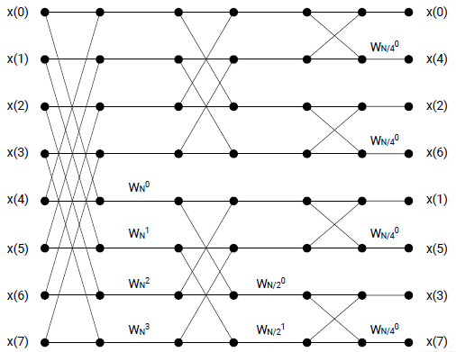
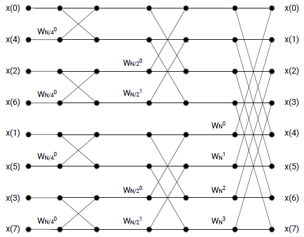
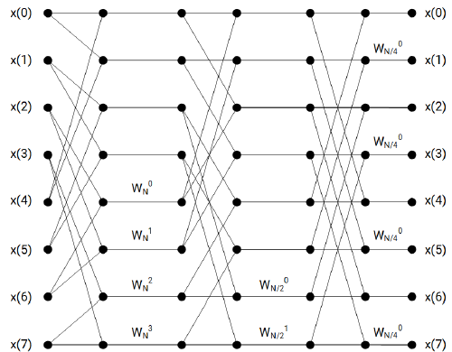
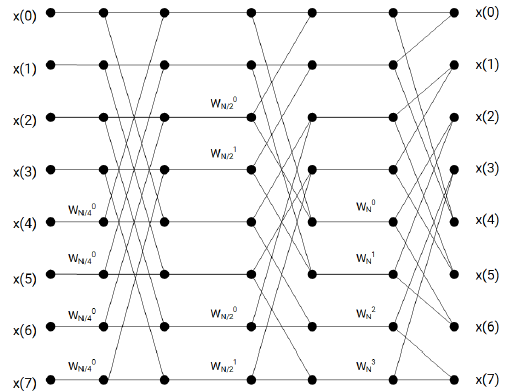

<table class="sphinxhide" style="width:100%;">
  <tr>
    <td align="center">
      <picture>
        <source media="(prefers-color-scheme: dark)" srcset="https://raw.githubusercontent.com/Xilinx/Image-Collateral/main/logo-white-text.png">
        
      </picture>
      <h1>AMD Vitis™ AI Engine Tutorials</h1>
      <a href="https://www.amd.com/en/products/software/adaptive-socs-and-fpgas/vitis.html">See Vitis™ Development Environment on amd.com</a>
        </br>
      <a href="https://www.amd.com/en/products/software/vitis-ai.html">See Vitis™ AI Development Environment on amd.com</a>
    </td>
  </tr>
</table>

# Introduction

Fast Fourier transform (FFT) algorithms [[1]](https://ieeexplore.ieee.org/abstract/document/5217220) compute the discrete Fourier transform (DFT) of a sampled signal, translating the original time-domain signal to its frequency-domain representation. The complexity of computing the DFT is $O(N^2)$ from its definition but reduces to $O(N\log N)$ when using the FFT variants, where $N$ is the sample size of the transform. Because of these massive computation savings, these transforms find broad applicability across many applications in engineering and scientific fields.

Due to their ubiquitous nature, the FFT and DFT represent the principal intellectual property (IP) components for digital signal processing designs in both hardware and software. No other piece of IP is used more extensively. This application note describes how the AMD Versal™ AI Engine architecture creates high-performance IP designs for the DFT and FFTs in Versal devices to use the optimized IP designs provided by the Vitis DSP Library [[2]](https://docs.amd.com/r/en-US/Vitis_Libraries/dsp/index.html). You can use the AI Engine API [[3]](https://download.amd.com/docnav/aiengine/xilinx2023_2/aiengine_api/aie_api/doc/index.html) to build custom FFT designs when circumstances warrant, such as if the FFT IP needs close coupling to other system-specific functions. This document covers both scenarios.

This tutorial covers the following. First, reviewing general background material for the DFT and FFT establishes the common baseline framework. The goal is not to teach FFT fundamentals but to identify clearly how building FFT IP on Versal architecture differs from this common framework. Instead of the widely used "in-place" algorithms of Cooley-Tukey, the Versal architecture adopts the less well-known "Stockham" approach to achieve a superior quality of result (QoR) tailored to its single-instruction multiple data (SIMD) architecture. The tutorial then reviews these algorithmic differences before presenting several FFT IP designs. It shows their architectures and how to optimize their performance for throughput and latency.

## Discrete Fourier Transform

The DFT transforms a sequence of $N$ complex (time-domain) numbers ${x_0, x_1, \ldots, x_{N-1}}$ into a second sequence of complex (frequency-domain) numbers ${X_0, X_1, \ldots, X_{N-1}}$ as shown in the following equation. Because each sample $X_k$ requires $N$ complex multiplications with the fixed "twiddle factors" $\exp(-i2\pi kn/N)$, the computation requires $N^2$ multiplications overall, leading to the computational complexity of $O(N^2)$.

$$X_k = \sum_{n=0} ^{N-1} x_n \cdot e^{-i\dfrac{2\pi}{N}kn}$$

Direct computation of the preceding equation can be feasible for cases where $N$ is not too large. You can write the preceding equation as a matrix-vector multiplication where an $N\times N$ matrix collects the twiddle factors, and an $N\times 1$ vector collects the samples $x_n$. Indeed, a following section shows a "direct form" solution like this for a Versal DFT design.

## Fast Fourier Transform

The best-known FFT algorithms originate from the following:

$$e^{-i\dfrac{2\pi}{N}kn}$$

They rely on a "divide-and-conquer" algorithm that breaks down the DFT computation recursively from problem sizes $N=N_1\cdot N_2$ into smaller problem sizes $N_1$ and $N_2$, leading to a reduction in computational complexity from $O(N^2)$ to $O(N\log N)$. The details of this approach are well-known and are not repeated here.

The most famous and widely used FFT algorithms divide each transform into two pieces of size $N/2$. Cooley and Tukey first published them in 1965. This "divide-by-2" approach restricts $N$ to powers of two and is called a "Radix-2" FFT algorithm. Transforms of length $N$ containing other prime factors require additional "mixed-radix" factorizations. The "divide-by-2" factorizations admit a combining of "Radix-2" pairs into "Radix-4" factors that lead to savings in multipliers, making the "Radix-4" approach a most popular implementation.

Two popular FFT factorizations of Cooley/Tukey dominate the FFT landscape. 

1. The Decimation in Frequency (DIF) splits the ${X_k}$ terms in half using an "even/odd" approach. This leads to a "butterfly" algorithm, which operates on inputs in the natural order to produce outputs in a "bitreversed" order (a specific permutation obtained by reversing the order of bits in the output address labels). The following figure shows an example of this approach for an 8-point transform.

    

2. The Decimation in Time (DIT) factorization splits the ${X_k}$ terms in half using an "even/odd" approach. This leads to a similar "butterfly" algorithm which operates on inputs in bit-reversed order to produce outputs in natural order. The following figure shows an example of this approach for an 8-point transform. This is how multiplication by the "twiddle factors" occurs as a "precursor" (before the butterfly) operation for DIT. In contrast, it occurs as a "post cursor" (after the butterfly) operation for the DIF approach. The exact nature of the hardware architecture used can influence which approach Versal devices prefer, as the following figure shows.

    

The following code block is a MATLAB® code example of a "Radix-2" formulation of the Cooley-Tukey DIT FFT algorithm. The algorithm structure contains three "for-loops." The outer loop processes a number $S=\log_2(N)$ of Radix-2 stages. The inner two loops process a set of $N/2$ butterfly operations, where the "span" of the butterflies (or distance between its node pairs) depends on the computation stage. The Cooley-Tukey transforms (both DIF and DIT) are considered "in-place" algorithms because the input and output addresses of each butterfly are identical. This has certain advantages in implementation, making these FFTs popular for hardware designs.

```cpp
function [fft_o] = fft_cooleytukey_dit(fft_i)
   N = numel(fft_i);
   Nstage = log2(N);
   buff_i = bitrevorder(fft_i);
   for stage = Nstage : -1 : 1
     Nhalf = N / 2^stage;
     twid = exp(-1i*2*pi*[0:Nhalf-1]/(2*Nhalf));
     stride = 2^(stage-1);
     skip = N/stride;
     for s = 0 : stride-1
       q = s * skip;
       for p = 0 : Nhalf-1
         % Note: "in-place" addresses:
         idx0_i = q + p + 0;
         idx0_o = q + p + 0;
         idx1_i = q + p + Nhalf;
         idx1_o = q + p + Nhalf;
         a = buff_i(1+idx0_i);
         b = buff_i(1+idx1_i) * twid(1+p);
         buff_i(1+idx0_o) = a + b;
         buff_i(1+idx1_o) = a - b;
       end
     end
   end
   fft_o = buff_i;
end
```

The following code block provides a MATLAB code example of a "Radix-2" formulation of the Cooley-Tukey DIF FFT algorithm. The algorithm structure also contains three "for-loops," as in the DIT case. The main difference is the input and output addresses are reversed for the DIT case. The input arrives in natural order, whereas the output arrives in bit-reversed order. Also, the ordering of spans in each butterfly is reversed. This is also reflected in the diagrams shown earlier.

```cpp
function [fft_o] = fft_cooleytukey_dif(fft_i)
   N = numel(fft_i);
   Nstage = log2(N);
   buff_i = fft_i;
   for stage = 1 : Nstage
     Nhalf = N / 2^stage;
     twid = exp(-1i*2*pi*[0:Nhalf-1]/(2*Nhalf));
     stride = 2^(stage-1);
     skip = N/stride;
     for s = 0 : stride-1
       q = s * skip;
       for p = 0 : Nhalf-1
         % Note: "in-place" addresses:
         idx0_i = q + p + 0;
         idx0_o = q + p + 0;
         idx1_i = q + p + Nhalf;
         idx1_o = q + p + Nhalf;
         a = buff_i(1+idx0_i);
         b = buff_i(1+idx1_i);
         buff_i(1+idx0_o) =  a + b;
         buff_i(1+idx1_o) = (a - b) * twid(1+p);
       end
     end
   end
   fft_o = bitrevorder(buff_i);
end
```

## Stockham Fast Fourier Transform

The Cooley-Tukey FFT factorizations have one significant drawback: the need for bit reversal operations to establish natural sample order at either the input or output. Traditional hardware solutions manage these bit-reversal permutations cheaply. However, they become expensive when implementing FFTs on coarse-grained CPU or GPU architectures due to incoherent memory access.

The Stockham FFT targets vector computers with a specific factorization that achieves maximal vector parallelism. Graphics processors (GPUs) have widely adopted the Stockham FFT as their method of choice [[4]](https://ieeexplore.ieee.org/document/4607357). The Versal AI Engine and its SIMD vector pipeline architecture benefit equally from this approach.

The Cooley-Tukey FFT implements all computations using the "in-place" approach identified earlier but requires costly bit-reversal operations. In contrast, the Stockham FFT expends additional storage to achieve the natural ordering of I/O samples.

The following figure shows a signal flow graph for a Stockham Radix-2 DIF 8-point transform. Its structure is like earlier Cooley/Tukey formulations. The number of stages and butterflies is identical. Still, the I/O addressing of each butterfly differs. The computation is "out-of-place" and requires an extra storage buffer. The addressing permutation changes at each stage but resolves itself such that both the input and output of the signal flow graph maintain a natural ordering.



Unique variants of the Stockham algorithm for vector computing leverage additional tricks to improve performance, like refactoring the algorithm to replace "power-of-two" memory strides with unit strides in the access of twiddle factors and by precomputing twiddle factors in separate contiguous memory.

The following figure shows a signal flow graph for the Stockham Radix-2 DIT 8-point transform. Its structure resembles the earlier one but uses "out-of-place" butterflies. The permutation order is reversed (compared to the Stockham DIF version) to achieve a natural I/O ordering.



In practice, the Stockham FFT often uses two buffers, X and Y, in a ping-pong fashion. Consider this in the context of the previous figures: data enters buffer X in the first stage, and the stage computes butterfly outputs and stores them in buffer Y. The second stage then computes outputs from inputs in Y and stores them back into X. Finally, the third stage computes outputs from inputs in X and stores them back into Y.

The following code block provides a MATLAB implementation of the Stockham DIT FFT algorithm. Like the Cooley/Tukey formulation in FFT Code, the algorithm consists of a triple nested "for-loop" with the outer loop running over the $S=\log_2(N)$ stages of butterflies. The code clearly shows its "out-of-place" character: input addresses are separated by one stride, whereas output addresses are separated by "Nhalf" strides, and the stride changes on each stage. The code also clearly shows the "ping/pong" nature of the Stockham approach. The twiddle factor is applied before the sum and difference computations. A following section revisits this when discussing Versal AI Engine hardware support for FFT.

```cpp
function [fft_o] = fft_stockham_dit(fft_i)
   N = numel(fft_i);
   Nstage = log2(N);
   buff_i = fft_i;
   buff_t = zeros(size(buff_i));
   for stage = Nstage : -1 : 1
     Nhalf = N / 2^stage;
     twid = exp(-1i*2*pi*[0:Nhalf-1]/(2*Nhalf));
     stride = 2^(stage-1);
     for p = 0 : Nhalf-1
       for q = 0 : stride-1
         % Note: address is not "in-place"
         idx0_i = q + stride*(2*p+0);
         idx1_i = q + stride*(2*p+1);
         idx0_o = q + stride*(p+0    );
         idx1_o = q + stride*(p+Nhalf);
         a = buff_i(1+idx0_i);
         b = buff_i(1+idx1_i) * twid(1+p);
         buff_t(1+idx0_o) = a + b;
         buff_t(1+idx1_o) = a - b;
       end
     end
     buff_i = buff_t;
   end
   fft_o = buff_i;
end
```

The following code block provides a MATLAB implementation of the Stockham DIF FFT algorithm. Like the Cooley/Tukey formulation in FFT Code, the algorithm consists of a triple nested "for-loop" with the outer loop running over the $S=\log_2(N)$ stages of butterflies. Comments like those made for the DIT version earlier can be made here. The butterfly computation occurs "out-of-place" in this DIF variant. The twiddle factors are applied after the butterfly computation (as compared to before the butterfly in the DIT case).

```cpp
function [fft_o] = fft_stockham_dif(fft_i)
   N = numel(fft_i);
   Nstage = log2(N);
   buff_i = fft_i;
   buff_t = zeros(size(buff_i));
   for stage = 1 : Nstage
     Nhalf = N / 2^stage;
     twid = exp(-1i*2*pi*[0:Nhalf-1]/(2*Nhalf));
     stride = 2^(stage-1);
     for p = 0 : Nhalf-1
       for q = 0 : stride-1
         % Note: address is not "in-place"
         idx0_i = q + stride*(p+0    );
         idx1_i = q + stride*(p+Nhalf);
         idx0_o = q + stride*(2*p+0);
         idx1_o = q + stride*(2*p+1);
         a = buff_i(1+idx0_i);
         b = buff_i(1+idx1_i);
         buff_t(1+idx0_o) =  a + b;
         buff_t(1+idx1_o) = (a - b) * twid(1+p);
       end
     end
     buff_i = buff_t;
   end
   fft_o = buff_i;
end
```

<hr class="sphinxhide"></hr>

<p class="sphinxhide" align="center"><sub>Copyright © 2020–2026 Advanced Micro Devices, Inc.</sub></p>

<p class="sphinxhide" align="center"><sup><a href="https://www.amd.com/en/legal/copyright.html">Terms and Conditions</a></sup></p>
