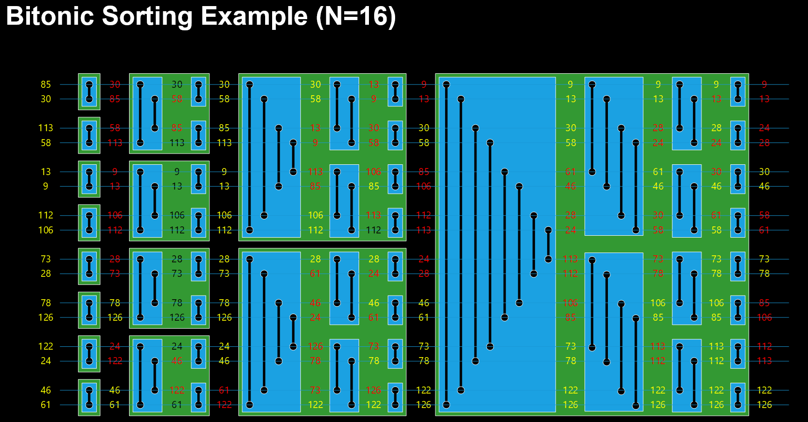
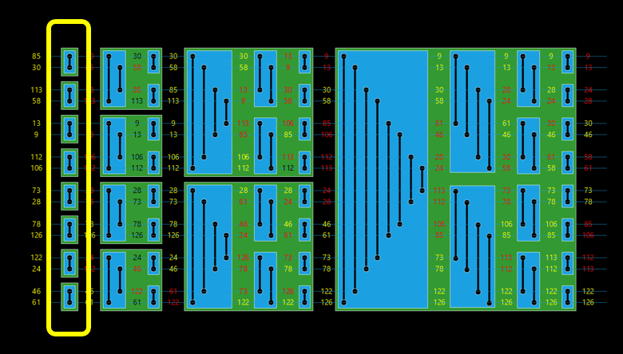
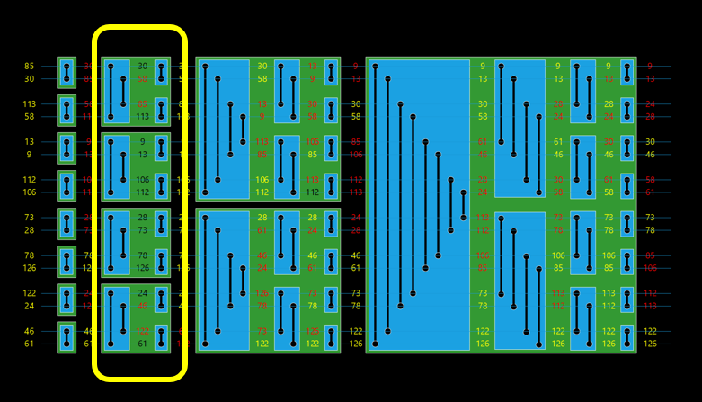
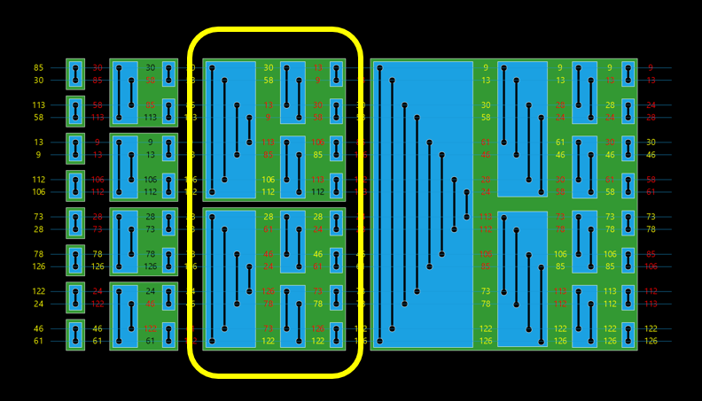
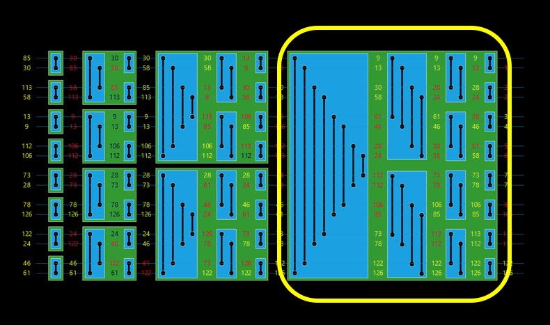
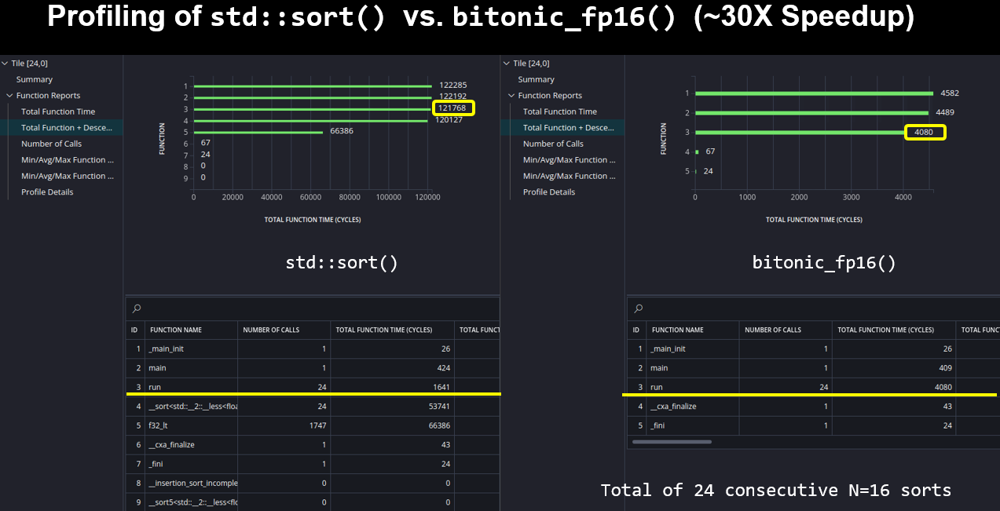
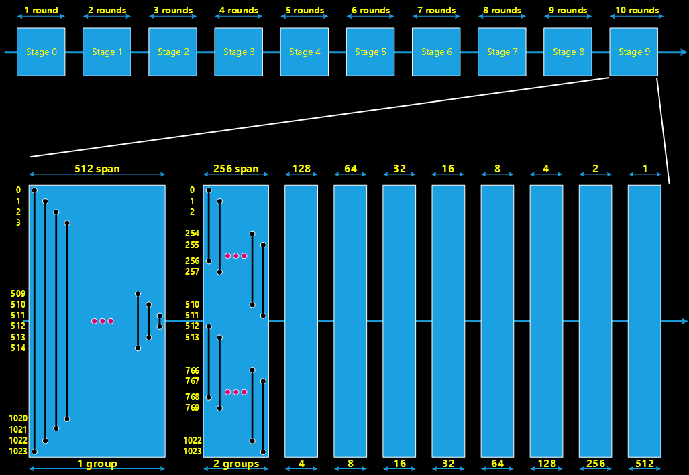
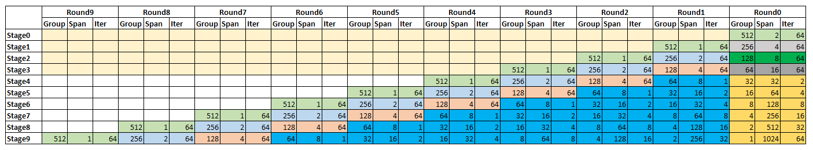
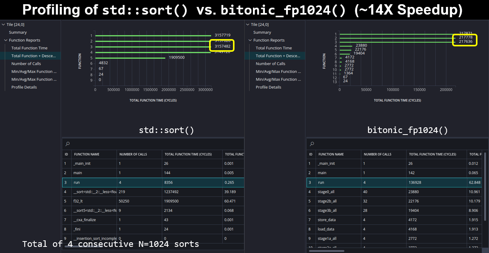

<table class="sphinxhide" style="width:100%;">
  <tr>
    <td align="center">
      <picture>
        <source media="(prefers-color-scheme: dark)" srcset="https://raw.githubusercontent.com/Xilinx/Image-Collateral/main/logo-white-text.png">
        
      </picture>
      <h1>AMD Vitis™ AI Engine Tutorials</h1>
      <a href="https://www.amd.com/en/products/software/adaptive-socs-and-fpgas/vitis.html">See Vitis Development Environment on amd.com</a>
        </br>
      <a href="https://www.amd.com/en/products/software/vitis-ai.html">See Vitis AI Development Environment on amd.com</a>
    </td>
  </tr>
</table>

# Bitonic SIMD Sorting on AI Engine for `float` Datatypes

***Version: Vitis 2025.2***

## Table of Contents

1. [Introduction](#introduction)
2. [Small Bitonic Sorting Example](#small-bitonic-sorting-example)
3. [Large Bitonic Sorting Example](#large-bitonic-sorting-example)

[References](#references)

[Support](#support)

[License](#license)

## Introduction

Bitonic sorting [[1]] is parallel algorithm for sorting, originally developed by Ken Batcher. You target hardware sorting networks to sort $N$ elements in decreasing or increasing order. The network uses $O(N\log^2(N))$ comparator elements with a parallel sorting delay of $O(\log^2(N))$ time. The algorithm consists of $q(q+1)/2$ rounds of parallel pairwise comparisons across the $N$ elements. Each round compares element pairs using a butterfly network with crossover points that change, delivering partially sorted results to the next round. Bitonic sorting is attractive on architectures provisioned with many parallel execution units, particular when $N$ is large. Hardware solutions in programmable logic fit well. Software solutions also yield excellent results on single-instruction multiple data (SIMD) architectures that perform many parallel comparisons in a single cycle.

This tutorial illustrates how to implement a bitonic SIMD sorter on AI Engine in Versal for `float` data types. Two examples are given. You start with a small example using $N=16$ to demonstrate the concept and develop strategies for vectorization and management of the vector register space. You then apply these ideas to a second larger example using $N=1024$. Finally, you compare profiling and throughput performance to `std::sort()` using Introsort [[2]] employing $O(N\log(N))$ comparisons on a scalar CPU.

## Small Bitonic Sorting Example

The following diagram shows a small bitonic sorting example with $N=16$ elements. The network consists of $q=10$ rounds of butterfly comparisons. These rounds are collected into $\log_2(N)=4$ stages, where there are a different number of rounds per stage. 
* Stage 0 consists of one round
* Stage 1 consists of two rounds
* Stage 2 consists of three rounds
* Stage 4 consists of four rounds 

The figure highlights in yellow output samples from that stage whos ordering has not been affected. Red highlights output samples from that stage whose ordering has been affected. 

Some identical rounds appear in each stage of processing. For example, the last two rounds of Stage 2 and Stage 3 contain identical processing. You use this fact in the second example to construct bitonic sorting designs for larger $N$.

The bitonic sorting algorithm uses a divide-and-conquer approach. Each processing stage reorders samples in a local fashion with an increasing span:
* Stage 0 performs one butterfly comparison round to sort consective 2-tuples.
* Stage 1 performs two butterfly comparison rounds to sort consecutive 4-tuples.
* Stage 2 performs three butterfly comparison rounds to sort consective 8-tuples.
* Stage 3 performs four butterfly comparison rounds to sort consective 16-tuples.

After all stages of processing, the output from the final round is in fully sorted order. 



### Stage 0

The following figure shows the processing performed by Stage 0. Here a single butterfly round reorders local pairs of consecutive samples. You must perform a total of eight parallel comparisons per stage. With `float` data types, you use `fpmax()` and `fpmin()` intrinsics. Alternatively you call the AIE API functions as shown in the example.



The following code block implements Stage 0 using intrinsics. You store the full compliment of 16 input samples in a 16-lane vector register. The `fpmax()` and `fpmin()` intrinsics provide the core sorting functionality, each performing eight parallel comparisons in SIMD fashion in a single cycle. The `fpshuffle16()` intrinsics perform input and output data shuffling, moving all eight top butterfly samples to a single 8-lane vector register and all eight bottom samples to another. After identifying the maximum and minimum samples, you store them back in the 16-lane vector. Smaller values occupy the top positions, and larger values occupy the bottom positions. Profiling with `aiesimulator` shows this intrinsic code requires 27 cycles per invocation. 

```
void __attribute__((noinline)) bitonic_fp16::stage0_intrinsic( aie::vector<float,16>& vec )
{
  static constexpr unsigned BFLY_STAGE0_TOP_I = 0xECA86420;
  static constexpr unsigned BFLY_STAGE0_BOT_I = 0xFDB97531;
  static constexpr unsigned BFLY_STAGE0_TOP_O = 0xB3A29180;
  static constexpr unsigned BFLY_STAGE0_BOT_O = 0xF7E6D5C4;
  vec = fpshuffle16(vec,0,BFLY_STAGE0_TOP_I,BFLY_STAGE0_BOT_I);
  aie::vector<float,8> v_top = vec.extract<8>(0);
  aie::vector<float,8> v_bot = vec.extract<8>(1);
  aie::vector<float,8> v_mx = fpmax(v_top,v_bot);
  aie::vector<float,8> v_mn = fpmin(v_top,v_bot);
  vec = aie::concat(v_mn,v_mx);
  vec = fpshuffle16(vec,0,BFLY_STAGE0_TOP_O,BFLY_STAGE0_BOT_O);
}
```

The code below implements Stage 0 using AIE API. The full compliment of 16 input samples are stored in a 16-lane vector register. Here, the `aie::filter_even()` API pulls out the top butterfly samples by selecting the even numbered lanes. The `aie::filter_odd()` pulls out the bottom butterfly samples by selecting the odd numbered lanes. The `aie::max()` and `aie::min()` API's identify the largest and smallest samples for each butterfly. Finally, the `aie::interleave_zip()` API collects the two 8-lane inputs into a 16-lane output vector, assigning even lanes from the first vector and odd lanes from the second vector. This code is functionally equivalent to the intrinsic version above. Profiling reveals it requires 28 cycles per invocation. 

```
void __attribute__((noinline)) bitonic_fp16::stage0_api( aie::vector<float,16>& vec )
{
  aie::vector<float,8> v_top = aie::filter_even(vec);
  aie::vector<float,8> v_bot = aie::filter_odd(vec);
  aie::vector<float,8> v_mx = aie::max(v_top,v_bot);
  aie::vector<float,8> v_mn = aie::min(v_top,v_bot);
  std::tie(v_mn,v_mx) = aie::interleave_zip(v_mn,v_mx,1);
  vec = aie::concat(v_mn,v_mx);
}

```

### Stage 1
The following figure shows the processing performed by Stage 1. Two butterfly rounds perform local reordering of 4-tuples of consecutive samples. As with Stage 0, single‑instruction multiple data (SIMD) instructions perform eight parallel comparisons per cycle. The second butterfly round is identical to the single round from Stage 0. 



The following code block implements the first round of Stage 1 using AIE API. It uses the same 16-lane vector register along with the `aie::max()` and `aie::min()` routines for sample comparison. The `fpshuffle16()` intrinsic extracts I/O samples for the top and bottom butterfly samples. AI Engine coding style supports mixing AIE API and intrinsics in the same code using a common set of AIE API register definitions. This makes it convenient to drop down to intrinsics if necessary from within an AIE API coding framework. Profiling reveals this function requires 27 cycles per invocation. 

```
void __attribute__((noinline)) bitonic_fp16::stage1a( aie::vector<float,16>& vec )
{
  static constexpr unsigned BFLY_STAGE1a_TOP_I = 0xDC985410;
  static constexpr unsigned BFLY_STAGE1a_BOT_I = 0xEFAB6723;
  static constexpr unsigned BFLY_STAGE1a_TOP_O = 0xAB328910;
  static constexpr unsigned BFLY_STAGE1a_BOT_O = 0xEF76CD54;
  vec = fpshuffle16(vec,0,BFLY_STAGE1a_TOP_I,BFLY_STAGE1a_BOT_I);
  aie::vector<float,8>  v_top = vec.extract<8>(0);
  aie::vector<float,8>  v_bot = vec.extract<8>(1);
  aie::vector<float,8>  v_mx = aie::max(v_top, v_bot);
  aie::vector<float,8>  v_mn = aie::min(v_top, v_bot);
  vec = aie::concat(v_mn,v_mx);
  vec = fpshuffle16(vec,0,BFLY_STAGE1a_TOP_O,BFLY_STAGE1a_BOT_O);
}
```

### Stage 2
The following figure shows the processing performed by Stage 2. Three butterfly rounds reorder 8-tuples of consecutive samples locally. As in the previous two stages, SIMD instructions perform a total of eight parallel comparisons per cycle. The third butterfly round matches the last round from Stage 0 and Stage 1. 



The following code block implements the first round of Stage 2 using AIE API. It uses the same 16-lane vector register with `aie::max()` and `aie::min()` for sample comparisons. The `fpshuffle16()` intrinsic extracts I/O samples for the top and bottom butterfly samples. This code matches the first round of Stage 1, except for the I/O sample extraction permutations. These differences occur because the top and bottom butterfly samples sit in different positions within the 16-lane vector register. The second round of Stage 2 (not shown here) follows the same structure with a distinct set of permutations. Profiling reveals both of these function require 27 cycles per invocation.

```
void __attribute__((noinline)) bitonic_fp16::stage2a( aie::vector<float,16>& vec )
{
  static constexpr unsigned BFLY_STAGE2a_TOP_I = 0xBA983210;
  static constexpr unsigned BFLY_STAGE2a_BOT_I = 0xCDEF4567;
  static constexpr unsigned BFLY_STAGE2a_TOP_O = 0x89AB3210;
  static constexpr unsigned BFLY_STAGE2a_BOT_O = 0xCDEF7654;
  aie::vector<float,8> v_mx;
  aie::vector<float,8> v_mn;
  vec = fpshuffle16(vec,0,BFLY_STAGE2a_TOP_I,BFLY_STAGE2a_BOT_I);
  v_mx = aie::max(vec.extract<8>(0),vec.extract<8>(1));
  v_mn = aie::min(vec.extract<8>(0),vec.extract<8>(1));
  vec = aie::concat(v_mn,v_mx);
  vec = fpshuffle16(vec,0,BFLY_STAGE2a_TOP_O,BFLY_STAGE2a_BOT_O);
}
```

### Stage 3
The following figure shows the processing performed by Stage 3. Four butterfly rounds reorder 16-tuples of consecutive samples locally. As in the previous three stages, SIMD instructions perform a total of eight parallel comparisons per cycle. The final two butterfly rounds match the last rounds from Stage 2. 



The following code block mplements the first round of Stage 3 using AIE API. For this round, you reverse the bottom set of butterfly inputs in order to perform the required sample comparisons. Use the `aie::reverse()` API for this purpose. After sample comparison, reverse the samples again to restore their placement before storing them back in the 16-lane register. This round is simpler than previous cases because no I/O permutations occur during sample extraction. Profiling reveals this function requires 27 cycles per invocation.

```
void __attribute__((noinline)) bitonic_fp16::stage3a( aie::vector<float,16>& vec )
{
  aie::vector<float,8>  v_top = vec.extract<8>(0);
  aie::vector<float,8>  v_bot = aie::reverse(vec.extract<8>(1));;
  aie::vector<float,8>  v_mx  = aie::max(v_top,v_bot);
  aie::vector<float,8>  v_mn  = aie::min(v_top,v_bot);
  vec   = aie::concat(v_mn,aie::reverse(v_mx));
}
```

### Profiling of $N=16$ Bitonic Sort vs. `std::sort()`

To show the advantage of bitonic SIMD sorting, you compare its profiling with the `std::sort()` routine from the C++-17 standard library. The following diagram from Vitis Analyzer shows the average number of cycles for each algorithm and a total of 24 random sorting runs. The bitonic sort took the same time of 170 total cycles per invocation. The `std::sort()` cycles were dependent on the particular sort data, taking a minimum of 3,197 cycles, a maximum of 7,061 cycles and an average of 5,073 cycles. This gives bitonic SIMD sorting an advantage of ~30X over `std::sort()`.




## Large Bitonic Sorting Example

This section reviews the design of a larger Bitonic SIMD sorting example for $N=1024$ samples. This task is more challenging than the $N=16$ example because the entire array no longer fits in the available vector register space. You must store the array in local tile memory and work on smaller portions of the array using the vector registers. The existing $N=16$ code base works well here. You extend it by adding stages and memory addressing to manage computation across the full $N=1024$ array.

The block diagram shows the bitonic sorter design for $N=1024$. The design requires a total of $q(q+1)/2=55$ rounds of processing when $q=\log_2(N)=10$. These rounds are collected into $q$ stages. The first four stages (Stage 0 to Stage 3) match those from the $N=16$ example. The only difference is these stages operate on the full vector of $N=1024$ sample vector. You process these as 64 groups of 16 samples each, with each group following the same operations as in the earlier example. 

The following diagram breaks apart the ten rounds of Stage 9 to show the nature of processing occuring from Stages 4 to 9. Each round of a stage contains three parameters: **GROUP**, **SPAN**, and **ITERATION**.
* GROUP: Number of identical processing sets in each round. 
* SPAN: Width or straddle in samples between the top or bottom of two consecutive butterflies in the round.
* ITERATION: Number of SIMD comparisons performed per GROUP (process eight samples per comparison as in the $N=16$ example).



Based on these definitions, you can characterize each round. For example, you can characterize the first round of Stage 9 as <GROUP,SPAN,ITER>=<1,1024,64> because the largest span of the first butterfly is 1024 samples (SPAN=1024). There is a single group of butterflies that span the array vertically (GROUP=1). There are 64 SIMD cycles required to process $8\times64=512$ butterflies in the round (ITER=64). You can characterize the second round of Stage 9 as <GROUP,SPAN,ITER>=<2,256,32> because the span of all butterfiles is 256 samples (SPAN=256), there are two groups (GROUP=2), and there are $8\times32=512$ butterflies in the round (ITER=32).

It turns out the first round in Stage 1 to $q$ always contains these butterflies with reducing span dropping from the largest span down to a single sample. All other rounds in the stage consist of butterflies with identical spans. This creates two fundamental types of processing that you must manage. For each type, they only differ in the number of groups processed in each round. You can identify this in the following figure where the different types of processing are each identified with a unique color. All rounds from Stage 4 and beyond consist of five different types of processing. Three of these originate from Stage 0 and Stage 1. The other two follow the reducing span butterflies and fixed span butterflies identified previously. 



The following code block shows the implementation of the reducing span algorithm required for the first round of every stage from Stage 4 and up. You loop over `GROUP*ITER` iterations of 8-lane comparison operations. For these reducing span comparisons, you reverse the order of the bottom butterfly data to perform the proper comparisons. You then omit the reversal before storing results because the remaining rounds reorder each half of the samples. This omission saves cycles. After processing `ITER` sets of SIMD computations for each `GROUP`, adjust the butterfly memory pointers and load another 16-lanes of data from memory, storing previously sorted results. 

```
template<unsigned GROUP,unsigned SPAN,unsigned ITER> void __attribute__((noinline)) bitonic_fp1024::stageY(void)
{
  float* __restrict gTop = &data[0];
  float* __restrict gBot = &data[SPAN];
  float* __restrict pTop = gTop;
  float* __restrict pBot = gBot - 8;
  for (unsigned ii=0, jj=0; ii < GROUP*ITER; ii++)
    chess_prepare_for_pipelining
    {
      // ------------------------------------------------------------
      aie::accum<accfloat,8> v_top; v_top.from_vector(aie::load_v<8>(pTop));
      aie::vector<float,8>   v_bot = aie::load_v<8>(pBot);
      aie::vector<float,8>   v_mx = fpmax(v_top,v_bot,0,0x01234567);
      aie::vector<float,8>   v_mn = fpmin(v_top,v_bot,0,0x01234567);
      v_mn.store(pTop);
      v_mx.store(pBot); // Algorithm works whether or not we use aie::reverse() here -- Omit to save cycles
      // ------------------------------------------------------------
      if (jj==ITER-1) {
        // Time to hop to next group:
        pTop = gTop + SPAN;
        pBot = gBot + SPAN - 8;
        gTop = gTop + SPAN;
        gBot = gBot + SPAN;
        jj=0;
      }
      else {
        // Next set of 8 butterflies:
        pTop = pTop + 8;
        pBot = pBot - 8;
        jj++;
      }
    }
}
```

The following code block shows the implementation of the fixed span algorithm required for the remaining rounds of every stage from Stage 4 and higher. No reversal operations are required since the butterfly assignments follow a regular pattern. Again, the memory management adjusts the top and bottom butterfly pointers according to the different `GROUP` and `ITER` to be processed

```
template<unsigned GROUP,unsigned SPAN,unsigned ITER> void __attribute__((noinline)) bitonic_fp1024::stageB(void)
{
  float* __restrict gTop = &data[0];
  float* __restrict gBot = &data[SPAN];
  float* __restrict pTop = gTop;
  float* __restrict pBot = gBot;
  for (unsigned ii=0, jj=0; ii < GROUP*ITER; ii++)
    chess_prepare_for_pipelining
    {
      // ------------------------------------------------------------
      aie::vector<float,8>  v_top = aie::load_v<8>(pTop);
      aie::vector<float,8>  v_bot = aie::load_v<8>(pBot);
      aie::vector<float,8>  v_mx  = aie::max(v_top,v_bot);
      aie::vector<float,8>  v_mn  = aie::min(v_top,v_bot);
      v_mn.store(pTop);
      v_mx.store(pBot);
      // ------------------------------------------------------------
      if (jj==ITER-1) {
        // Time to hop to next group:
        gTop = gTop + 2*SPAN;
        gBot = gBot + 2*SPAN;
        pTop = gTop;
        pBot = gBot;
        jj=0;
      }
      else {
        // Next set of 8 butterflies:
        pTop = pTop + 8;
        pBot = pBot + 8;
        jj++;
      }
    }
}
```

### Profiling of $N=1024$ Bitonic Sort vs. `std::sort()`

Again, compare bitonic SIMD sorting with the `std::sort()` routine provided as part of the C++-17 standard library. The following diagram from Vitis Analyzer shows the average number of cycles for each algorithm with a total of four random sorting runs. The bitonic sort takes 217,636 total cycles overall. The `std::sort()` takes 3,157,482 cycles. This gives bitonic SIMD sorting an advantage of ~14X over `std::sort()` for this larger array size. 




## References

[1]: <https://en.wikipedia.org/wiki/Bitonic_sorter> "Bitonic Sorter"

[[1]] Wikipedia, "[Bitonic Sorter](https://en.wikipedia.org/wiki/Bitonic_sorter)"

[2]: <https://en.wikipedia.org/wiki/Introsort> "Introsort"

[[2]] Wikipedia, "[Introsort](https://en.wikipedia.org/wiki/Introsort)"

## Support

Use GitHub issues to track requests and bugs. For questions, go to [support.xilinx.com](http://support.xilinx.com/).


<p class="sphinxhide" align="center"><sub>Copyright © 2023-2026 Advanced Micro Devices, Inc.</sub></p>
<p class="sphinxhide" align="center"><sup><a href="https://www.amd.com/en/corporate/copyright">Terms and Conditions</a></sup></p>
