<table class="sphinxhide" width="100%">
 <tr width="100%">
    <td align="center"><h1>AI Engine Development</h1>
    <a href="https://www.xilinx.com/products/design-tools/vitis.html">See Vitis™ Development Environment on xilinx.com</br></a>
    <a href="https://www.xilinx.com/products/design-tools/vitis/vitis-ai.html">See Vitis™ AI Development Environment on xilinx.com</a>
    </td>
 </tr>
</table>

# Fractional Delay Farrow Filter

***Version: Vitis 2024.1***

## Table of Contents

1. [Introduction](#introduction)
2. [Requirements and System Partitioning](#requirements-and-system-partitioning)
3. [AI Engine Implementation and Optimization](#ai-engine-implementation-and-optimization)
4. [Build and Run Design](#build-and-run-design)
5. [Summary and Conclusion](#summary-and-conclusion)

[References](#references)

[Support](#support)

[License](#license)

## Introduction

A fractional delay filter is a common digital signal processing (DSP) algorithm found in many applications including digital receivers in modems and is required for timing synchronization.
Assuming you have a signal $x_n$ sampled uniformly with a sampling frequency $F_s$ (samples per second), this means samples exist at $x(nT_s)$ where $T_s=1/F_s$ and $n$ is an integer. Because the receiver timing is initially unknown, demodulating the signal at these intervals can result in inter-symbol interference due to samples not landing in the middle of the eye diagram.
This introduces the need for a fractional delay filter so samples can be produced at $x(nT_s + uT_s)$ where $-0.5 < u < 0.5$ is the unknown fractional delay parameter to be identified at the receiver. In some cases, this fractional delay is time-varying, for example, as $u(nT_s)$, and so the time-recovered signal can be given as $x(nT_s + u(nT_s)\cdot T_s)$. Reference [[1]] provides some background on timing recovery in such systems.

The ideal fractional delay filter is an allpass filter with infinite impulse response achieved using a time-shifted $sinc()$ function. Such a filter is not implementable, so an approximation must be made.
One such approximation is the use of Polynomial Interpolation where the samples at $x(nT_s + u(nT_s)\cdot T_s)$ are computed through the help of neighbouring samples. For a continuous-time signal $x(t)$, a polynomial of order p is a function of the form: $x(t)$ = $c_p$ $t^p$ + $c_{p-1}$ $t^{p-1}$ + ... + $c_1$ $t$ + $c_0$. The assumption is if Polynomial order $p$ is chosen high enough, you can interpolate our given samples to find values at desired time indexes with sufficient accuracy.

An efficient realization of a continuously variable fractional delay filter is shown by C. W. Farrow in [[2]].
In the general case, a Farrow filter of polynomial order P would have the structure shown in the following figure.

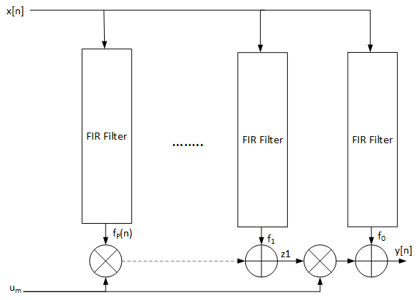

*Figure 1 - Farrow Filter with Polynomial Order p = P*

There are two key benefits to the structure shown.

First, the required fractional delay can be tuned in real-time without coefficient reloading. When compared to direct-form finite impulse response (FIR) fractional delay filters which require a different set of coefficients for all supported fractional delay values, a Farrow structure achieves this with constant polynomial coefficients.

Second, the Farrow Filter makes use of Horner's rule [[3]] in which a polynomial:

$a_0$ + $a_1$ $x$ + $a_2$ $x^2$ + ... + $a_P$ $x^P$

can be equivalently computed as:

$a_0$ + $x$( $a_1$ + $x$ $a_2$ + ... + $x$ ( $a_{P-1}$ + $x$ $a_P$ ) ).

This allows the evaluation of a polynomial of degree P with only P multiplications and P additions.

Using the Farrow filter structure and coefficients shown in section VI by C. W. Farrow in [[2]], you arrive at the following diagram.

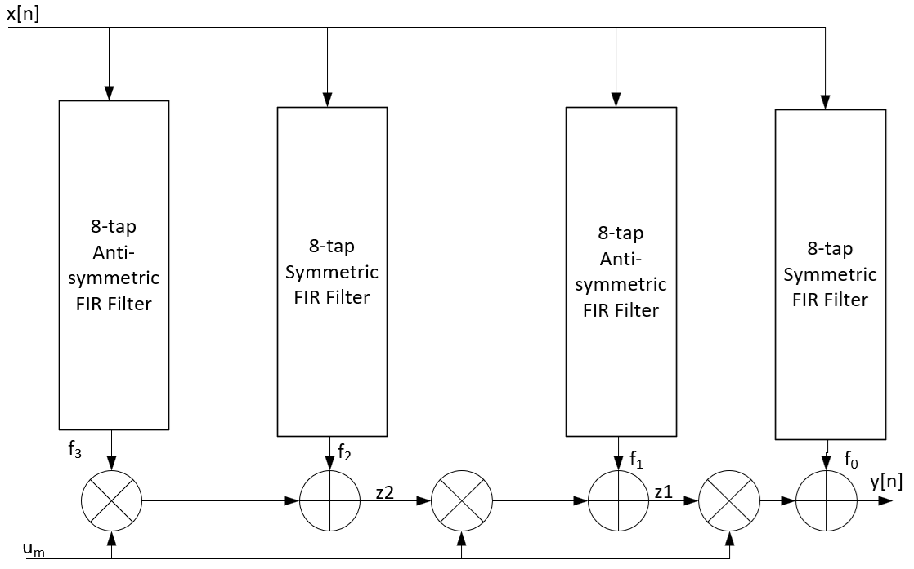

*Figure 2 - Farrow Filter with Polynomial Order p = 3*

You can achieve the following frequency and time domain responses.

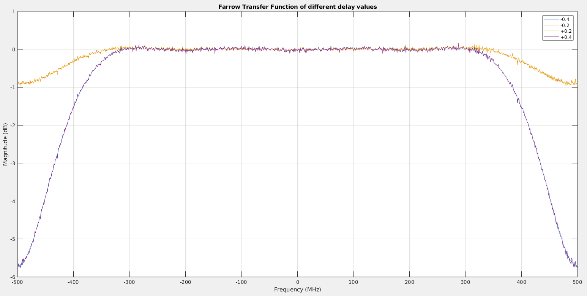

*Figure 3 - Farrow Filter with Polynomial Order p = 3 - Frequency Response*

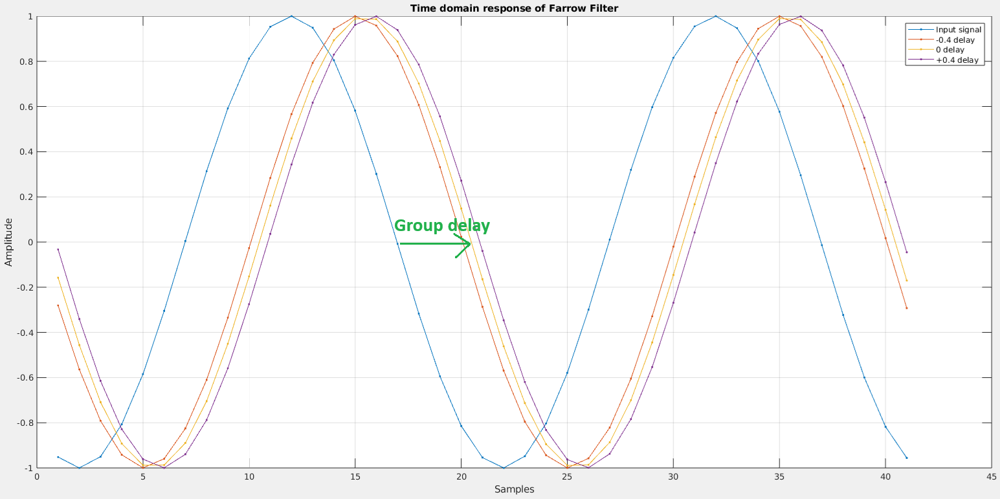

*Figure 4 - Farrow Filter with Polynomial Order p = 3 - Time domain Response*

This tutorial focuses initially on building a functionally accurate model of the filter using AI Engine APIs and running it through the tools. Afterwards, certain code optimizations are applied to improve performance, so you eventually achieve the required throughput target.

## Requirements and System Partitioning

Implement the Farrow filter complying with the following requirements:

|Requirements| |
|---|---|
| Sampling rate | 1 Gsps |
| I/O data type | `cint16` |
| Coefficients data type | `int16` |
| Delay input data type | `int16` |

>**NOTE:** In real applications, Farrow filters are often seen operating at a lower sampling rate. However, multiple instances of filters with a lower sampling rate can be implemented on AI Engine using a time-division multiplexed (TDM) form of such a high sampling rate filter with only minor changes required to its existing codebase.

### Compute Analysis

Based on the specified sampling rate and Figure 2, you need to perform 19 MACs every cycle where each MAC operation involves a `cint16` data with a `int16` coefficient.

Based on the specified data and coefficient types, you should be able to perform 16 `cint16` x `int16` MACs every cycle in a single tile, as described in Table 1 of the *Versal Adaptive SoC AI Engine Architecture Manual* [(AM009)](https://docs.xilinx.com/r/en-US/am009-versal-ai-engine/Functional-Overview).

### Bandwidth Analysis

Every cycle, the specified filter consumes a single pair of 'data' (`cint16`) and 'delay' (`int16`) input samples and produces a `cint16` output sample. This can be achieved with three PLIOs connected to a single tile using streams or buffers. Even though the variable fractional delay parameter $u(nT_s)$ is specified to be `int16`, each PLIO delivers 32-bits per clock cycle.

For this reason, the needed `int16` value is sign extended to `int32` while the sample gets delivered to the tile, then drops to `int16` again during compute. Alternatively, two `int16` delay samples can be packed into a single `int32` sample.

### Storage Analysis

Minimal storage is needed if you use streams. If you use buffers instead, you need to reserve room for two inputs and one output ping-pong buffers. The size of storage will be determined by the number of samples processed in a single function call. Define this as `NSAMP`. For example, if NSAMP=1024, storage needed for input, output, and delay data amounts to three I/Os x 1024 samples x two ping-pong x 4 Bytes/sample = 24 KB.

A single AI Engine tile has 32 KB of local tile memory and has access to three neighboring tile memories for a total size of 128 KB.

## AI Engine Implementation and Optimization

Inspecting Figure 2 more closely, you can see that:

* Intermediate output f3 and f1 is running an 8-tap anti-symmetric filter on an input signal. This can be easily computed using the `aie::sliding_mul_sym_xy_ops<>::mul_antisym()` API.
* Similarly, f2 and f0 can also be computed using the `aie::sliding_mul_sym_xy_ops<>::mul_sym()` API.
* The bottom section of Figure 2 corresponding to Horner's rule can be computed using `aie::mul()` and `aie::mac()` instructions.

### Initial Farrow Design

Navigating to `farrow_initial` and inspecting `farrow_kernel.cpp`, you see a version of the implementation that is coded primarily to get a functionally correct output, without spending any effort on optimizing throughput performance.

Once inside `farrow_initial`, you can perform x86 functional simulation and compare against the golden output generated by the MATLAB model by running the following command:

```
$ make x86compile
$ make x86sim
$ make check_sim_output_x86
```

The first command compiles the graph code for simulation on an x86 processor, the second command runs the simulation, and the final command invokes MATLAB to compare the simulator output against golden test vectors.

Alternatively, you can issue `make x86all`. The console should output `Max error LSB = 1`.

To understand the performance of your initial implementation, you can perform AI Engine emulation using the SystemC simulator by entering the following sequence of commands. In the context of AI Engine processors, Initiation Interval is defined as how often (in cycles) a new iteration of the loop can start.

For example, if a new iteration of the loop can start every II=16 cycles, and each loop iteration produces 16 samples, that means the processor is producing the equivalent of one sample per clock (excluding processor overhead).

Assuming your AI Engine clock is 1.25 GHz, that means your throughput can potentially reach 1.25 Gsps excluding any processor overhead. Output throughput is defined as number of samples produced from your kernel per second. Run the following command:

```
$ make compile
$ make sim
$ make get_II
$ make check_sim_output_aie
```

The first command compiles graph code for the SystemC simulator, the second command runs the simulation, the third command calls a python script to extract Initiation Interval from the compiled design, and the final command invokes MATLAB to compare simulation output with test vectors and compute raw throughput.

Alternatively, you can issue `make all`. The console should output:

```
*** LOOP_II *** Tile: 24_0	minII: 43	beforeII: 123	afterII: 123	Line: 77	File: farrow_kernel.cpp
Raw Throughput = 204.7 MSPS
Max error LSB = 1
```

Launch vitis_analyzer `vitis_analyzer aiesimulator_output/default.aierun_summary`. The current implementation generates a graph and array view shown below.

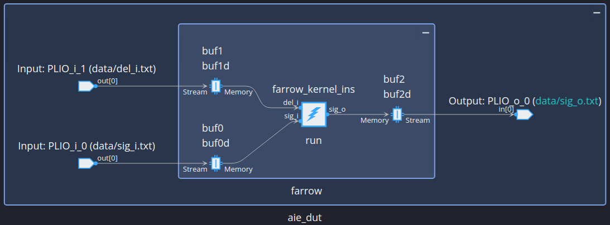

*Figure 5 - Farrow Filter Initial Implementation Graph View*

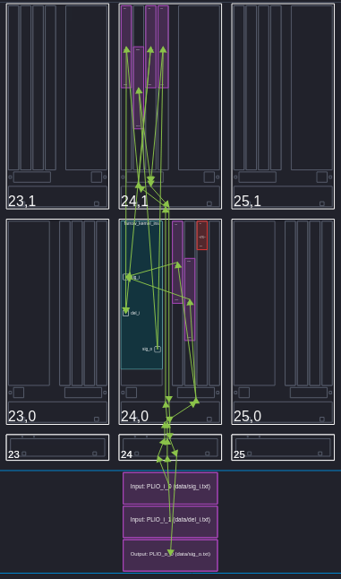

*Figure 6 - Farrow Filter Initial Implementation Array View*

Because every loop iteration produces 16 samples, you need II=16 to achieve your desired throughput. Your first design achieved II=123, so this version of the implementation clearly has no chance of achieving the desired throughput. You can get a rough estimate of the expected throughput using the expected versus achieved II.

In this case, 16/123 x 1.25 GHz = 163 Msps. Indeed, this is confirmed by the reported Raw Throughput, which is measured across all graph iterations. A more accurate throughput measurement can be made by measuring the steady state achieved in the final graph iteration.
In vitis_analyzer, select the trace view and set markers to measure the throughput of this final iteration as shown below. Because each graph iteration processes 1024 samples, throughput = 1024/6.398 $us$ = 160 Msps.

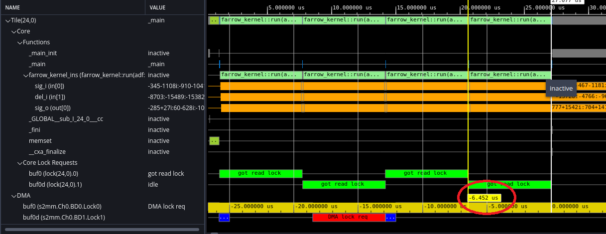

*Figure 7 - Farrow Filter Initial Implementation Trace View*

### First Farrow Optimization

Inspecting `farrow_initial/aie/farrow_kernel.cpp` and `farrow_initial/aie/farrow_kernel.h`, you can quickly observe a few possible optimizations.

1. There are four vector registers with the same content (v_buff3/2/1/0). Those can be replaced with one.
2. There are four separate vector registers to store filter coefficients (f3-f0_coeffs). These can be combined into one, while using different indices in `aie::sliding_mul_sym_ops()` to select the proper coefficients.
3. There are four state variables to store the same content in tile memory (f3-f0_state). Those can be replaced with one.
4. The required 16 bits of the 32-bit $u(nT_s)$ signal arrive in interleaved fashion in a vector register. To extract the needed samples, the `aie::filter_even()` API is used which consumes additional cycles. This can be simplified by placing the 16-bit samples of interest consecutively followed by zero stuffing the remaining bits. This requires a different input simulation file for the rearranged $u(nT_s)$ signal, hence `gen_vectors.m` producing an additional `del_i` text file.

Once those changes are implemented in the `farrow_optimization1/aie` folder, you can repeat the previously mentioned steps to characterize the design.

After running `make all`, the console should display:

```
*** LOOP_II *** Tile: 24_0	minII: 28	beforeII: 91	afterII: 82	Line: 62	File: farrow_kernel.cpp
Raw Throughput = 300.8 MSPS
Max error LSB = 1
```

Achieved II dropped from 123 to 82, but you are still not where you need to be, so further optimization is needed.

### Second Farrow Optimization

Inspecting design files in the `farrow_optimize1/aie` folder, you can observe that the amount of vector registers you need every cycle (v_buff,f_coeff,del,y3-y0,z2,z1) exceeds the total supported by the chip as specified in the *Versal Adaptive SoC AI Engine Architecture Manual* [(AM009)](https://docs.xilinx.com/r/en-US/am009-versal-ai-engine/Register-Files). This leads to "vector register spillage" where the processor must use additional cycles to save intermediate compute results from vector registers to the stack memory (and vice-versa) to manage the vector register hardware resource. Refactoring the code to use fewer register resources can eliminate this additional overhead.

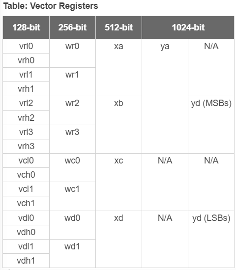

Also, given the AI Engine Fixed-point Vector Unit Multiplication and Upshift Paths also specified in the *Versal Adaptive SoC AI Engine Architecture Manual* [(AM009)](https://docs.xilinx.com/r/en-US/am009-versal-ai-engine/Register-Files) shown below, the multiplication of vector and accumulator registers is not supported.

Therefore, intermediate output z2 shown in Figure 2 needs to pass through Shift-round Saturate (SRS) Path so it is converted from accumulator register into vector register before it gets used in the next `aie::mac()` instruction (same applies to intermediate output z1).

This restriction presents a challenge to the compiler limiting pipelined scheduling opportunities.

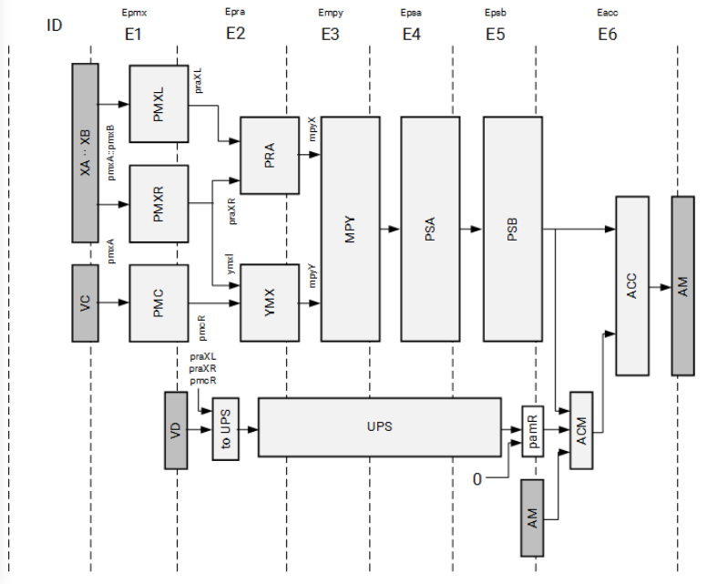

Due to reasons above, breaking the single `for` loop into multiple smaller ones is expected to improve performance.

To accomplish this, intermediate compute results need to be stored in scratch pad tile memory before they are read as input to each subsequent `for` loop. Reserving memory for these intermediate outputs is shown in `farrow_kernel.h`, example `alignas(32) TT_SIG y3[BUFFER_SIZE];`.
Accessing that memory location is done through vector iterator defined in`farrow_kernel.cpp`; for example, `auto p_y3 = aie::begin_restrict_vector<8>(y3);`.

The use of `_restrict` is intended to allow more aggressive compiler optimization, by explicitly stating that no memory dependency will be caused by pointer aliasing. For more information, see *AI Engine Kernel and Graph Programming Guide* (UG1079) - [Restrict Keyword](https://docs.xilinx.com/r/en-US/ug1079-ai-engine-kernel-coding/Restrict-Keyword?tocId=qE8HLaIwMuwjEVOsjtyQgg).

Finally, replace:

```
    acc_x = aie::mul(*p_y3++,del);
    *p_z2++ = aie::add(acc_x.to_vector<TT_SIG>(DNSHIFT),*p_y2++);
```

with:

```
    acc_x = aie::mac(aie::from_vector<TT_ACC>(*p_y2++,DNSHIFT), *p_y3++,del);
    *p_z2++ = acc_x.to_vector<TT_SIG>(DNSHIFT);
```

While these are functionally equivalent, the second code snippet allows for better pipelining and scheduling opportunities.

Once those changes are implemented into the design files in the `farrow_optimization2/aie` folder, you can repeat the previously mentioned steps to characterize the design.
After running `make all`, the console should display:

```
*** LOOP_II *** Tile: 25_0	minII: 16	beforeII: 29	afterII: 16	Line: 62	File: farrow_kernel.cpp
*** LOOP_II *** Tile: 25_0	minII: 3	beforeII: 16	afterII: 3	Line: 94	File: farrow_kernel.cpp
*** LOOP_II *** Tile: 25_0	minII: 3	beforeII: 16	afterII: 3	Line: 110	File: farrow_kernel.cpp
*** LOOP_II *** Tile: 25_0	minII: 3	beforeII: 16	afterII: 3	Line: 126	File: farrow_kernel.cpp
Raw Throughput = 768.1 MSPS
Max error LSB = 1
```

Because you have four `for` loops, `make get_II` generates four II numbers, one for each loop. These loops run consecutively, so the total II is the sum of all, which is 25 > 16. To meet your budget of 16 cycles, you will need to split your loops into two tiles, with the first tile containing the first loop and the second tile contains the three remaining loops.

Launch vitis_analyzer `vitis_analyzer aiesimulator_output/default.aierun_summary`. The current implementation generates array view shown below. Notice the increased size of the sysmem to accommodate scratch pad memory reserved for intermediate kernel results.

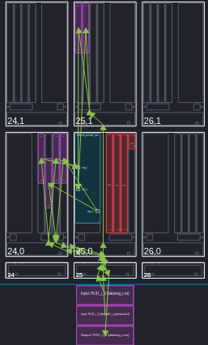

*Figure 9 - Farrow Filter Optimize2 Implementation Array View*

### Final Farrow Optimization

The final version of the implementation splits the four for loops into two kernels as previously discussed. The final optimization performed in this version of the implementation is with regards to the storage of intermediate result z2 and z1 shown in Figure 2.

Because the loops in `farrow_kernel2.cpp` are accessed sequentially, and the memory banks support reading and writing in the same clock cycle, the same memory bank can be used to store both intermediate results z2 and z1 as long as a different pointer address is used.

Once those changes are implemented into design files in the `farrow_final/aie` folder, repeat the previously mentioned steps to characterize the design. After running `make all`, the console should display:

```
*** LOOP_II *** Tile: 24_1	minII: 3	beforeII: 16	afterII: 3	Line: 50	File: farrow_kernel2.cpp
*** LOOP_II *** Tile: 24_1	minII: 3	beforeII: 16	afterII: 3	Line: 66	File: farrow_kernel2.cpp
*** LOOP_II *** Tile: 24_1	minII: 3	beforeII: 16	afterII: 3	Line: 82	File: farrow_kernel2.cpp
*** LOOP_II *** Tile: 25_0	minII: 16	beforeII: 29	afterII: 16	Line: 53	File: farrow_kernel1.cpp
Raw Throughput = 1151.1 MSPS
Max error LSB = 1
```

Launch vitis_analyzer, `vitis_analyzer Work/farrow_app.aiecompile_summary`. The current implementation generates the summary view shown below. The final design uses two compute tiles and a total of five tiles when taking buffers into consideration.

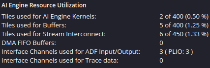

*Figure 10 - Farrow Filter Final Implementation Summary View*

Launch vitis_analyzer `vitis_analyzer aiesimulator_output/default.aierun_summary`. The current implementation generates the views shown below. Notice the new ping-pong buffers associated with the intermediate outputs connected between the two kernels.

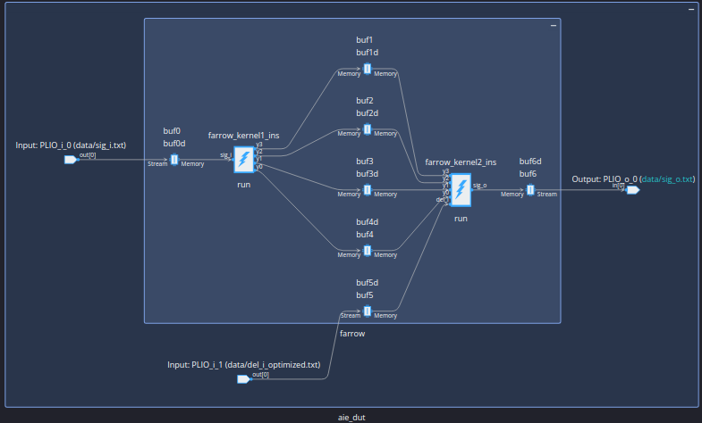

*Figure 11 - Farrow Filter Final Implementation Graph View*

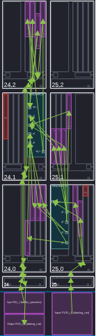

*Figure 12 - Farrow Filter Final Implementation Array View*

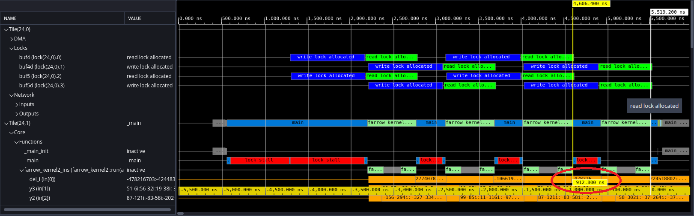

*Figure 13 - Farrow Filter Final Implementation Trace View*

Steady state throughput is 1024/912.8e-6 = 1115 Msps.

## Build and Run Design

### Setup and Initialization

>**IMPORTANT:** Before beginning the tutorial ensure you have installed Vitis 2024.1 software. Ensure you have downloaded the Common Images for Embedded Vitis Platforms from [this link](https://www.xilinx.com/support/download/index.html/content/xilinx/en/downloadNav/embedded-platforms.html).

Set the ```COMMON_IMAGE_VERSAL``` environment variable to the full path where you have downloaded the Common Images. Then set the environment variable ```PLATFORM_REPO_PATHS``` to the value, ```$XILINX_VITIS/lin64/Vitis/2024.1/base_platforms```.

The remaining environment variables are configured in the top level Makefile ```<path-to-design>/15-farrow-filter/Makefile``` file.

```
# Platform Selection...
VERSAL_VITIS_PLATFORM      = xilinx_vck190_base_202410_1
VITIS_PLATFORM_DIR         = ${PLATFORM_REPO_PATHS}/${VERSAL_VITIS_PLATFORM}
export VITIS_PLATFORM_XPFM = ${VITIS_PLATFORM_DIR}/${VERSAL_VITIS_PLATFORM}.xpfm

# Set SysRoot, RootFS and Image
export VITIS_SYSROOTS   = ${COMMON_IMAGE_VERSAL}/sysroots/cortexa72-cortexa53-xilinx-linux
export SDKTARGETSYSROOT = ${VITIS_SYSROOTS}
export KERNEL_IMAGE     = ${COMMON_IMAGE_VERSAL}/Image
export ROOTFS           = ${COMMON_IMAGE_VERSAL}/rootfs.ext4
export XLNX_VERSAL      = ${COMMON_IMAGE_VERSAL}
export PLATFORM         = ${VITIS_PLATFORM_XPFM}
export SYSROOT          = ${SDKTARGETSYSROOT}
```

### Hardware Emulation

```
[shell]% cd <path-to-design>/15-farrow-filter
[shell]% make clean all TARGET=hw_emu
```

It will take about 45 minutes to run the first time as the build will perform C/RTL verification and AMD Vivado&trade; out-of-context place-and-route runs for all both HLS IPs. This will only be done once but is not strictly required for hardware emulation. To skip this step, alternately run using the following:

```
[shell]% cd <path-to-design>/15-farrow-filter
[shell]% make clean all TARGET=hw_emu DO_COSIM=false
```

The build process will generate a folder ```<path-to-design>/15-farrow-filter/package``` containing all the files required for hardware emulation. This can be run as shown below. An optional `-g` can be applied to the ```launch_hw_emu.sh``` command to launch the Vivado waveform GUI to observe the top-level AXI signal ports in the design.

```
[shell]% cd <path-to-design>/15-farrow-filter/package
[shell]% ./launch_hw_emu.sh -g -run-app embedded_exec.sh
```

After hardware emulation run is complete, you can measure throughput in Vivado by inspecting the waveforms.
>**NOTE:** The AI Engine component is built to execute four graph iterations, each with 1024 samples, but the host application will execute the AI Engine component four times.

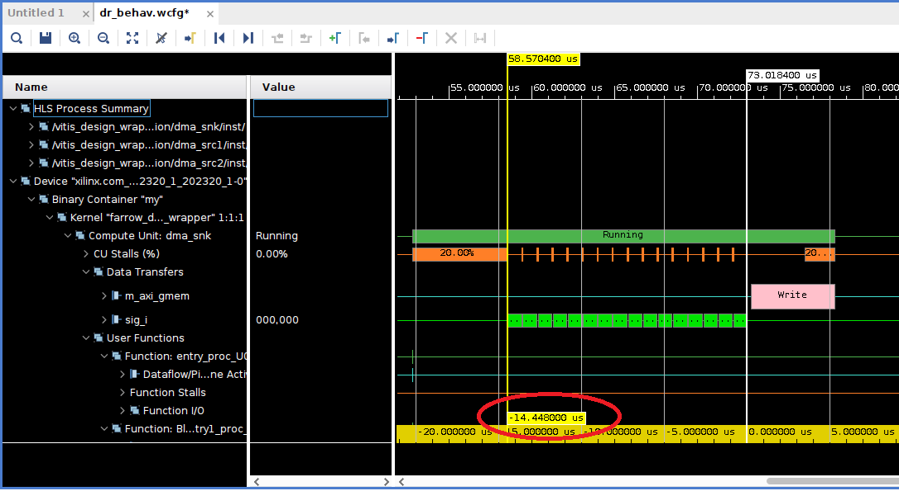

*Figure 14 - Farrow Filter Final Implementation Hardware Emulation*

Throughput is 1024 x 4 x 4/14.4e-6 = 1138 Msps.

### Hardware

The design can be built for the VCK190 board using the Makefile as follows:

```
[shell]% cd <path-to-design>/15-farrow-filter
[shell]% make clean all TARGET=hw
```

The build process will generate the SD card image in the ```<path-to-design>/15-farrow-filter/package/sd_card``` folder.

## Summary and Conclusion

In this tutorial, you built a time-varying fractional delay filter based on polynomial approximation and Farrow structure that runs above 1 Gsps. Emphasis is put on highlighting some common performance optimization steps applied to the design to meet required throughput targets.

## References

[1]:<https://ieeexplore.ieee.org/document/221081>
[[1]]: F. M. Gardner, "Interpolation in digital modems. I. Fundamentals," in IEEE Transactions on Communications, vol. 41, no. 3, pp. 501-507, March 1993, doi: 10.1109/26.221081.

[2]:<https://ieeexplore.ieee.org/document/15483>
[[2]]: C. W. Farrow, "A continuously variable digital delay element," 1988., IEEE International Symposium on Circuits and Systems, Espoo, Finland, 1988, pp. 2641-2645 vol.3, doi: 10.1109/ISCAS.1988.15483.

[3]:<https://en.wikipedia.org/wiki/Horner%27s_method>
[[3]]: Horner's method: https://en.wikipedia.org/wiki/Horner%27s_method

## Support

GitHub issues will be used for tracking requests and bugs. For questions, go to [support.xilinx.com](http://support.xilinx.com/).

## License

Components: xilinx-images

images in the documentation

Components: xilinx-files

The MIT License (MIT)

Copyright (c) 2023 Advanced Micro Devices, Inc.

Permission is hereby granted, free of charge, to any person obtaining a copy
of this software and associated documentation files (the "Software"), to deal in the Software without restriction, including without limitation the rights to use, copy, modify, merge, publish, distribute, sublicense, and/or sell copies of the Software, and to permit persons to whom the Software is
furnished to do so, subject to the following conditions:

The above copyright notice and this permission notice shall be included in all copies or substantial portions of the Software.

THE SOFTWARE IS PROVIDED "AS IS", WITHOUT WARRANTY OF ANY KIND, EXPRESS OR
IMPLIED, INCLUDING BUT NOT LIMITED TO THE WARRANTIES OF MERCHANTABILITY,
FITNESS FOR A PARTICULAR PURPOSE AND NONINFRINGEMENT. IN NO EVENT SHALL THE
AUTHORS OR COPYRIGHT HOLDERS BE LIABLE FOR ANY CLAIM, DAMAGES OR OTHER
LIABILITY, WHETHER IN AN ACTION OF CONTRACT, TORT OR OTHERWISE, ARISING FROM, OUT OF OR IN CONNECTION WITH THE SOFTWARE OR THE USE OR OTHER DEALINGS IN THE SOFTWARE.

<p class="sphinxhide" align="center"><sub>Copyright © 2021-2024 Advanced Micro Devices, Inc.</sub></p>
