<table class="sphinxhide" style="width:100%;">
  <tr>
    <td align="center">
      <picture>
        <source media="(prefers-color-scheme: dark)" srcset="https://raw.githubusercontent.com/Xilinx/Image-Collateral/main/logo-white-text.png">
        
      </picture>
      <h1>AMD Vitis™ AI Engine Tutorials</h1>
      <a href="https://www.amd.com/en/products/software/adaptive-socs-and-fpgas/vitis.html">See Vitis Development Environment on amd.com</a>
        </br>
      <a href="https://www.amd.com/en/products/software/vitis-ai.html">See Vitis AI Development Environment on amd.com</a>
    </td>
  </tr>
</table>

# Fractional Delay Farrow Filter

***Version: Vitis 2025.2***

## Table of Contents

1. [Introduction](#introduction)
2. [Requirements and System Partitioning](#requirements-and-system-partitioning)
3. [AI Engine Implementation and Optimization](#ai-engine-implementation-and-optimization)
4. [Build and Run Design](#build-and-run-design)
5. [Summary and Conclusion](#summary-and-conclusion)

[References](#references)

[Support](#support)

[License](#license)

## Introduction

A fractional delay filter is a common digital signal processing (DSP) algorithm found in many applications including digital receivers in modems. This is a requirement for timing synchronization.
Assuming you have a signal $x_n$ sampled uniformly with a sampling frequency $F_s$ (samples per second), this means samples exist at $x(nT_s)$ where $T_s=1/F_s$ and $n$ is an integer. Because the receiver timing is initially unknown, demodulating the signal at these intervals can result in inter-symbol interference due to samples not landing in the middle of the eye diagram.
This introduces the need for a fractional delay filter so samples can produce at $x(nT_s + uT_s)$ where $-0.5 < u < 0.5$ is the unknown fractional delay parameter to be identified at the receiver. In some cases, this fractional delay is time-varying, for example, as $u(nT_s)$, and so the time-recovered signal can be given as $x(nT_s + u(nT_s)\cdot T_s)$. Reference [[1]] provides some background on timing recovery in such systems.

The ideal fractional delay filter is an allpass filter with infinite impulse response achieved using a time-shifted $sinc()$ function. Such a filter is not implementable, so an approximation must be made.
One such approximation is the use of Polynomial Interpolation where the samples at $x(nT_s + u(nT_s)\cdot T_s)$ are computed through the help of neighbouring samples. For a continuous-time signal $x(t)$, a polynomial of order p is a function of the form: $x(t)$ = $c_p$ $t^p$ + $c_{p-1}$ $t^{p-1}$ + ... + $c_1$ $t$ + $c_0$. The assumption is if Polynomial order $p$ is chosen high enough, you can interpolate our given samples to find values at desired time indexes with sufficient accuracy.

An efficient realization of a continuously variable fractional delay filter is shown by C. W. Farrow in [[2]].
In the general case, a Farrow filter of polynomial order P would have the structure shown in the following figure.

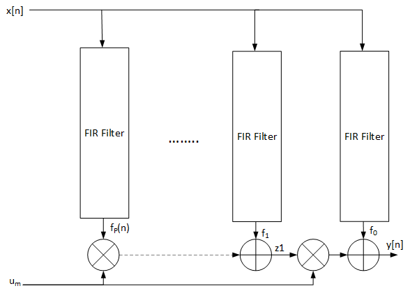

*Figure 1 - Farrow Filter with Polynomial Order p = P*

There are two key benefits to the structure shown.

First, the required fractional delay can be tuned in real-time without coefficient reloading. When compared to direct-form finite impulse response (FIR) fractional delay filters which require a different set of coefficients for all supported fractional delay values, a Farrow structure achieves this with constant polynomial coefficients.

Second, the Farrow Filter makes use of Horner's rule [[3]] in which a polynomial:

$a_0$ + $a_1$ $x$ + $a_2$ $x^2$ + ... + $a_P$ $x^P$

can be equivalently computed as:

$a_0$ + $x$( $a_1$ + $x$ $a_2$ + ... + $x$ ( $a_{P-1}$ + $x$ $a_P$ ) ).

This allows the evaluation of a polynomial of degree P with only P multiplications and P additions.

Using the Farrow filter structure and coefficients shown in section VI by C. W. Farrow in [[2]], you arrive at the following diagram.

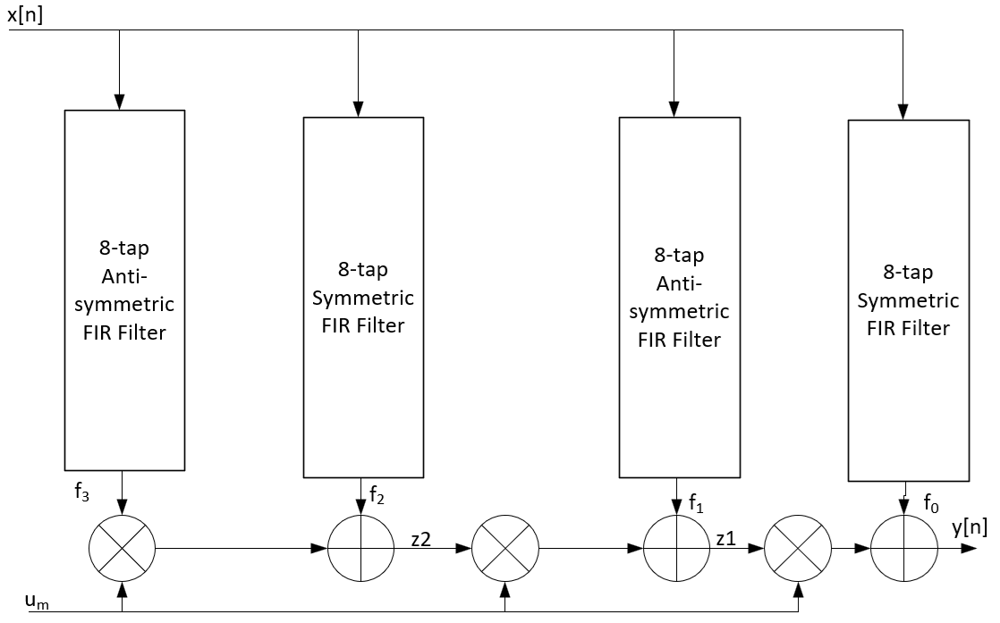

*Figure 2 - Farrow Filter with Polynomial Order p = 3*

You can achieve the following frequency and time domain responses.

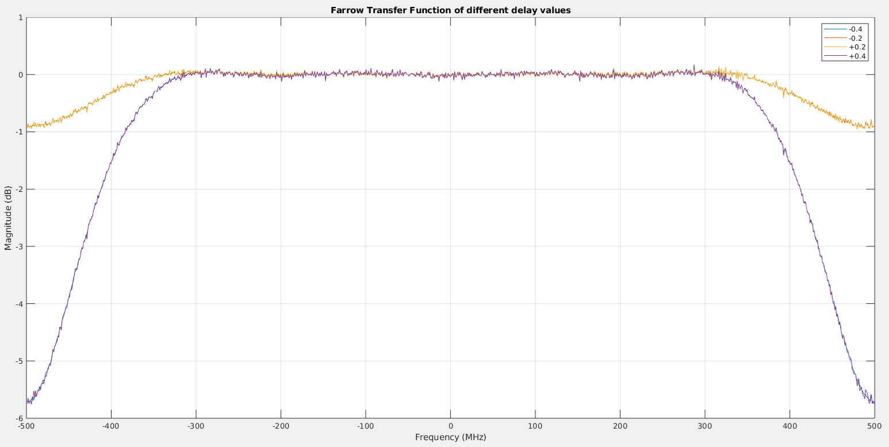

*Figure 3 - Farrow Filter with Polynomial Order p = 3 - Frequency Response*

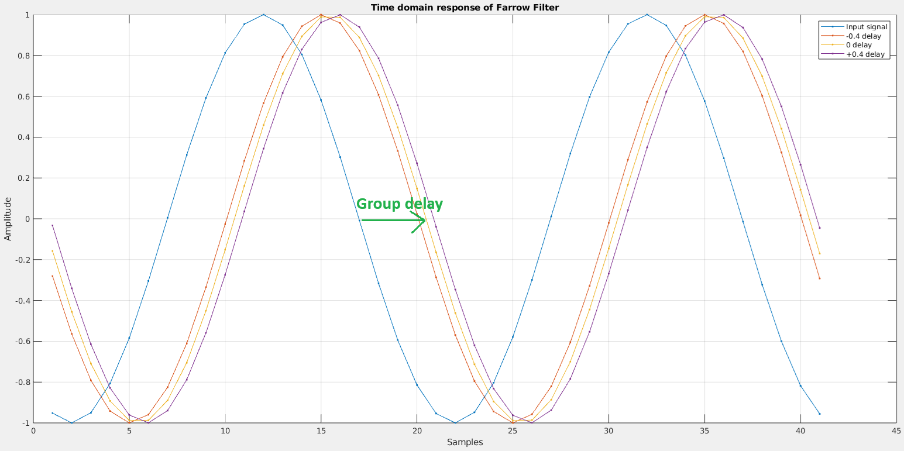

*Figure 4 - Farrow Filter with Polynomial Order p = 3 - Time domain Response*

This tutorial focuses initially on building a functionally accurate model of the filter using AI Engine APIs and running it through the tools. Afterwards, certain code optimizations are applied to improve performance, so you eventually achieve the required throughput target.

## Requirements and System Partitioning

Implement the Farrow filter complying with the following requirements:

|Requirements| |
|---|---|
| Sampling rate | 1 Gsps |
| I/O data type | `cint16` |
| Coefficients data type | `int16` |
| Delay input data type | `int16` |

>**NOTE:** In real applications, Farrow filters often operate at lower sampling rates. You can implement multiple instances of filters with a lower sampling rate on AI Engine using a time-division multiplexed (TDM) forms of a high sampling rate filter. Make only minor codebase changes to use the TDM approach.

### Compute Analysis

Based on the specified sampling rate and Figure 2, perform 19 multiply‑accumulate (MAC) operations every cycle. Each MAC operation involves a `cint16` data with a `int16` coefficient.

Based on the specified data and coefficient types, you can perform 16 `cint16` x `int16` MACs every cycle in a single tile. Table 1 of the *Versal Adaptive SoC AI Engine Architecture Manual* [(AM009)](https://docs.amd.com/r/en-US/am009-versal-ai-engine/Functional-Overview) describes this.

### Bandwidth Analysis

Every cycle, the specified filter consumes a single pair of `cint16` data and one `int16` delay input sample. The filter produces a `cint16` output sample. You can achieve this with three programmable logic input‑output (PLIO) interfaces connected to a single tile using streams or buffers. Even though the variable fractional delay parameter $u(nT_s)$ is `int16`, each PLIO delivers 32-bits per clock cycle.

For this reason, the needed `int16` value is sign extended to `int32` while the sample gets delivered to the tile, then drops to `int16` again during compute. Alternatively, you can pack two `int16` delay samples into a single `int32` sample.

### Storage Analysis

Minimal storage is needed if you use streams. If you use buffers instead, you need to reserve room for two inputs and one output ping-pong buffers. The size of storage will be determined by the number of samples processed in a single function call. Define this as `NSAMP`. For example, if NSAMP=1024, storage needed for input, output, and delay data amounts to three I/Os x 1024 samples x two ping-pong x 4 Bytes/sample = 24 KB.

A single AI Engine tile has 32 KB of local tile memory and has access to three neighboring tile memories for a total size of 128 KB.

## AI Engine Implementation and Optimization

Inspecting Figure 2 more details, you can see that:

* Compute intermediate outputs `f3` and `f1` by running an 8-tap anti-symmetric filter on an input signal using: `aie::sliding_mul_sym_xy_ops<>::mul_antisym()` API.
* Similarly, compute `f2` and `f0` using the `aie::sliding_mul_sym_xy_ops<>::mul_sym()` API.
* Compute the bottom section of Figure 2 corresponding to Horner's rule using `aie::mul()` and `aie::mac()` instructions.

### Initial Farrow Design

Navigate to `farrow_initial` and inspect `farrow_kernel.cpp`. Observe that the code focuses on producing functionally correct output without optimizing throughput performance.

Inside `farrow_initial`, run the x86 functional simulation and compare the results to the golden output generated by the MATLAB® model. Use the following command:

```
$ make x86compile
$ make x86sim
$ make check_sim_output_x86
```

The first command compiles the graph code for simulation on an x86 processor, the second command runs the simulation, and the final command invokes MATLAB® to compare the simulator output with golden test vectors.

Alternatively, you can run `make x86all`. The console should output `Max error LSB = 1`.

To understand the performance of your initial implementation, you can perform AI Engine emulation using the SystemC simulator by entering the following sequence of commands. In the context of AI Engine processors, initiation interval (II) defines how often, in cycles, a new loop iteration can start.

For example, if a new iteration of the loop can start every II=16 cycles, and each loop iteration produces 16 samples, that means the processor is producing the equivalent of one sample per clock (excluding processor overhead).

Assuming your AI Engine clock is 1.25 GHz, that means your throughput can reach 1.25 Gsps excluding any processor overhead. Output throughput defines the number of samples produced from your kernel per second. Run the following command:

```
$ make compile
$ make sim
$ make get_II
$ make check_sim_output_aie
```

The first command compiles graph code for the SystemC simulator, the second command runs the simulation, the third command calls a python script to remove II from the compiled design, and the final command invokes MATLAB to compare simulation output with test vectors and compute raw throughput.

Alternatively, you can issue `make all`. The console outputs the following:

```
*** LOOP_II *** Tile: 24_0	minII: 46	beforeII: 116	afterII: 116	Line: 77	File: farrow_kernel.cpp
Raw Throughput = 216.3 MSPS
Max error LSB = 1
```

Launch `vitis_analyzer vitis_analyzer aiesimulator_output/default.aierun_summary`. The current implementation generates a graph and array view.

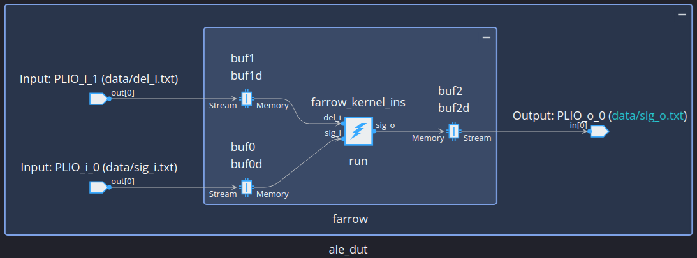

*Figure 5 - Farrow Filter Initial Implementation Graph View*

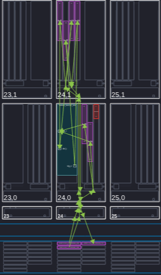

*Figure 6 - Farrow Filter Initial Implementation Array View*

Because every loop iteration produces 16 samples, you need II=16 to achieve your desired throughput. Your first design achieved II=116, so this version of the implementation clearly has no chance of achieving the desired throughput. You can get a rough estimate of the expected throughput using the expected versus achieved II.

In this case, 16/116 x 1.25 GHz = 172 Msps. Indeed, this is confirmed by the reported Raw Throughput, which is measured across all graph iterations. A more accurate throughput measurement can be made by measuring the steady state achieved in the final graph iteration.
In vitis_analyzer, select the trace view and set markers to measure the throughput of this final iteration as shown below. Because each graph iteration processes 1024 samples, throughput = 1024/6.038 $us$ = 170 Msps.

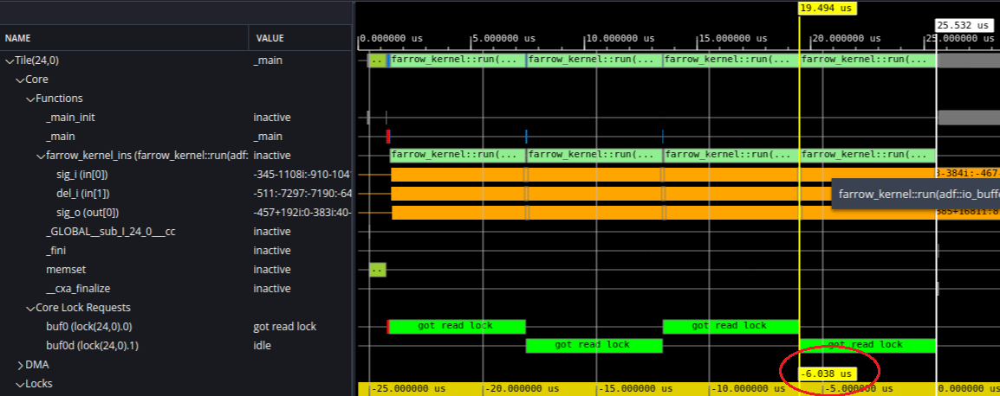

*Figure 7 - Farrow Filter Initial Implementation Trace View*

### First Farrow Optimization

Inspecting `farrow_initial/aie/farrow_kernel.cpp` and `farrow_initial/aie/farrow_kernel.h`, you can quickly observe a few possible optimizations.

1. There are four vector registers with the same content (v_buff3/2/1/0). You can replace those with one.
2. There are four separate vector registers to store filter coefficients (f3-f0_coeffs). You can combine them into one, while using different indices in `aie::sliding_mul_sym_ops()` to select the proper coefficients.
3. There are four state variables to store the same content in tile memory (f3-f0_state). You can replace those with one.
4. The required 16 bits of the 32-bit $u(nT_s)$ signal arrive in interleaved fashion in a vector register. To remove the needed samples, use the `aie::filter_even()` API which consumes additional cycles. You can simplify this by placing the 16-bit samples of interest consecutively followed by zero stuffing the remaining bits. This requires a different input simulation file for the rearranged $u(nT_s)$ signal, hence `gen_vectors.m` producing an additional `del_i` text file.

After you implement the changes in `farrow_optimization1/aie`, you can repeat the previously mentioned steps to characterize the design.

After running `make all`, the console displays the following:

```
*** LOOP_II *** Tile: 24_0	minII: 28	beforeII: 91	afterII: 82	Line: 62	File: farrow_kernel.cpp
Raw Throughput = 301.1 MSPS
Max error LSB = 1
```

Achieved II dropped from 116 to 82, but you are still not where you need to be. You need further optimization.

### Second Farrow Optimization

Inspect the design files in `farrow_optimize1/aie` tp evaluate vector register usage per cycle. The required registers (`v_buff`,`f_coeff`, `del` ,`y3-y0` ,`z2` , `z1`) exceed the total supported by the chip as specified in the *Versal Adaptive SoC AI Engine Architecture Manual* [(AM009)](https://docs.amd.com/r/en-US/am009-versal-ai-engine/Register-Files). This leads to *vector register spillage* where the processor must use additional cycles to save intermediate compute results from vector registers to the stack memory (and vice-versa) to manage the vector register hardware resource. Refactoring the code to use fewer register resources can remove this additional overhead.

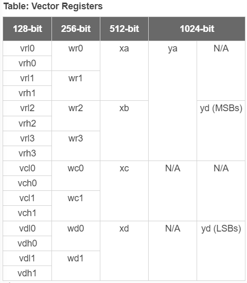

Given the AI Engine Fixed-point vector unit multiplication and upshift paths specified in the *Versal Adaptive SoC AI Engine Architecture Manual* [(AM009)](https://docs.amd.com/r/en-US/am009-versal-ai-engine/Register-Files), the multiplication of vector and accumulator registers is not supported.

Pass intermediate output `z2` shown in Figure 2 through the shift-round saturate (SRS) path. Convert it from an accumulator register into a vector register. This happens before it gets used in the next `aie::mac()` instruction (the same applies to intermediate output `z1`).

This restriction presents a challenge to the compiler limiting pipeline scheduling opportunities.

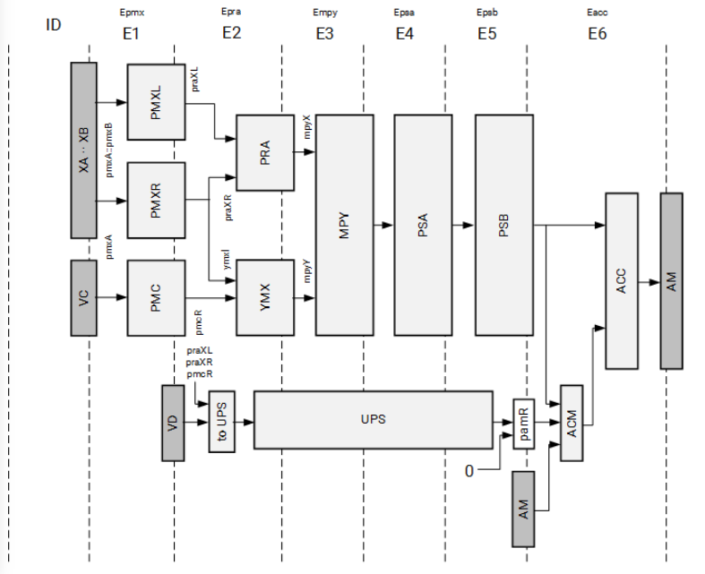

Due to reasons previously mentioned, you can expect improved performance by breaking the single `for` loop into multiple smaller ones.

To accomplish this, store intermediate compute results in scratch pad tile memory before reading them as input for each subsequent `for` loop. Reserve memory for intermediate outputs as shown in `farrow_kernel.h`, for example `alignas(32) TT_SIG y3[BUFFER_SIZE];`.
Access the reserved memory using a vector iterator defined in`farrow_kernel.cpp`, for example `auto p_y3 = aie::begin_restrict_vector<8>(y3);`.

Use `_restrict` to enable more aggressive compiler optimizations by stating no memory dependency occurs from pointer aliasing. For more information, see *AI Engine Kernel and Graph Programming Guide* (UG1079) - [Restrict Keyword](https://docs.amd.com/r/en-US/ug1079-ai-engine-kernel-coding/Restrict-Keyword?tocId=qE8HLaIwMuwjEVOsjtyQgg).

Finally, replace the following lines:

```
    acc_x = aie::mul(*p_y3++,del);
    *p_z2++ = aie::add(acc_x.to_vector<TT_SIG>(DNSHIFT),*p_y2++);
```

With the optimized version:

```
    acc_x = aie::mac(aie::from_vector<TT_ACC>(*p_y2++,DNSHIFT), *p_y3++,del);
    *p_z2++ = acc_x.to_vector<TT_SIG>(DNSHIFT);
```

While these are functionally equivalent, the second code snippet remains functionally equivalent but enables better pipelining and scheduling opportunities.

Implement these changes in the design files in `farrow_optimization2/aie`. Repeat the previous characterization steps to measure the updated design’s performance.
After running `make all`, the console displays:

```
*** LOOP_II *** Tile: 25_0	minII: 16	beforeII: 29	afterII: 16	Line: 62	File: farrow_kernel.cpp
*** LOOP_II *** Tile: 25_0	minII: 3	beforeII: 16	afterII: 3	Line: 94	File: farrow_kernel.cpp
*** LOOP_II *** Tile: 25_0	minII: 3	beforeII: 16	afterII: 3	Line: 110	File: farrow_kernel.cpp
*** LOOP_II *** Tile: 25_0	minII: 3	beforeII: 16	afterII: 3	Line: 126	File: farrow_kernel.cpp
Raw Throughput = 768.3 MSPS
Max error LSB = 1
```

Because you have four `for` loops, `make get_II` generates four II numbers, one for each loop. These loops run consecutively, so the total II is the sum of all, which is 25 > 16. To meet your budget of 16 cycles, you need to split your loops into two tiles, with the first tile containing the first loop and the second tile contains the three remaining loops.

Launch `vitis_analyzer` with `vitis_analyzer aiesimulator_output/default.aierun_summary`. The current implementation generates array view as shown in the following. Notice the increased system memory (`sysmem`) size to accommodate scratch pad memory reserved for intermediate kernel results.

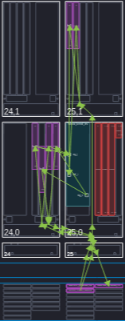

*Figure 9 - Farrow Filter Optimize2 Implementation Array View*

### Final Farrow Optimization

The final version of the implementation splits the four for loops into two kernels as previously discussed. The final optimization performed in this version of the implementation is with regards to the storage of intermediate result z2 and z1 shown in Figure 2.

The loops in `farrow_kernel2.cpp` run sequentially. Memory banks support simultaneous read and write per clock cycle. Store both results in the same memory bank. Use different pointer addresses to store `z2` and `z1` within the shared bank. 

Implement the changes the `farrow_final/aie` design files. Repeat the earlier characterization steps to evaluate performance. Run `make all` and confirm the console displays the expected output:

```
*** LOOP_II *** Tile: 24_1	minII: 3	beforeII: 16	afterII: 3	Line: 50	File: farrow_kernel2.cpp
*** LOOP_II *** Tile: 24_1	minII: 3	beforeII: 16	afterII: 3	Line: 66	File: farrow_kernel2.cpp
*** LOOP_II *** Tile: 24_1	minII: 3	beforeII: 16	afterII: 3	Line: 82	File: farrow_kernel2.cpp
*** LOOP_II *** Tile: 25_0	minII: 16	beforeII: 29	afterII: 16	Line: 53	File: farrow_kernel1.cpp
Raw Throughput = 1150.0 MSPS
Max error LSB = 1
```

Launch `vitis_analyzer`, `vitis_analyzer Work/farrow_app.aiecompile_summary`. The current implementation generates the summary view. The final design uses two compute tiles and a total of five tiles when taking buffers into consideration.

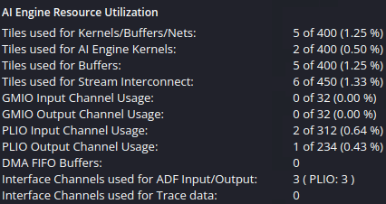

*Figure 10 - Farrow Filter Final Implementation Summary View*

Launch `vitis_analyzer` with `vitis_analyzer aiesimulator_output/default.aierun_summary`. The current implementation generates the views as shown in the following figure. Observe the new ping-pong buffers associated with the intermediate outputs connected between the two kernels.

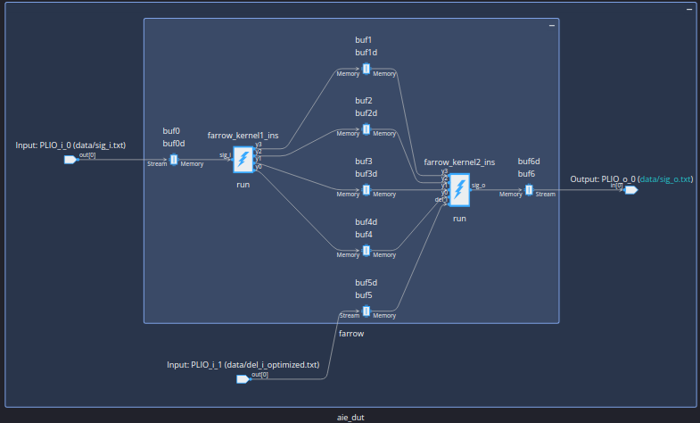

*Figure 11 - Farrow Filter Final Implementation Graph View*

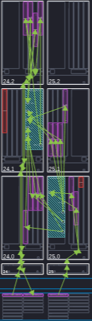

*Figure 12 - Farrow Filter Final Implementation Array View*

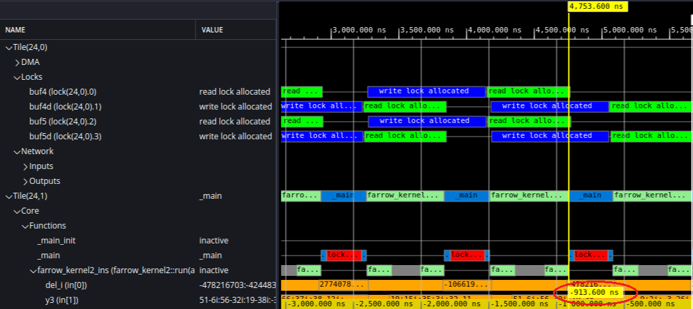

*Figure 13 - Farrow Filter Final Implementation Trace View*

Steady state throughput is 1024/913e-6 = 1122 Msps.

## Build and Run Design

### Setup and Initialization

IMPORTANT: Install the Vitis 2025.2 software before starting the tutorial. Downloaded the Common Images for Embedded Vitis Platforms from [this link](https://www.xilinx.com/support/download/index.html/content/xilinx/en/downloadNav/embedded-platforms.html).

Set the environment variable ```COMMON_IMAGE_VERSAL``` to the full path where you downloaded the Common Images. Then set the environment variable ```PLATFORM_REPO_PATHS``` to the value ```$XILINX_VITIS/base_platforms```. The remaining environment variables are configured in the top level Makefile.

### Hardware Emulation

```
[shell]% cd <path-to-design>/15-farrow_filter
[shell]% make clean all TARGET=hw_emu
```

This takes about 90 minutes to run. The build process generates ```15-farrow_filter/package``` containing all the files required for hardware emulation. This can be run as shown below. An optional `-g` can be applied to the ```launch_hw_emu.sh``` command to launch the Vivado waveform GUI to observe the top-level AXI signal ports in the design.

```
[shell]% cd <path-to-design>/15-farrow_filter/package
[shell]% ./launch_hw_emu.sh -g -run-app embedded_exec.sh
```

After hardware emulation run is complete, you can measure throughput in Vivado by inspecting the waveforms.
>**NOTE:** The AI Engine component executes four graph iterations, each processing 1024 samples. The host application executes the AI Engine component four times.

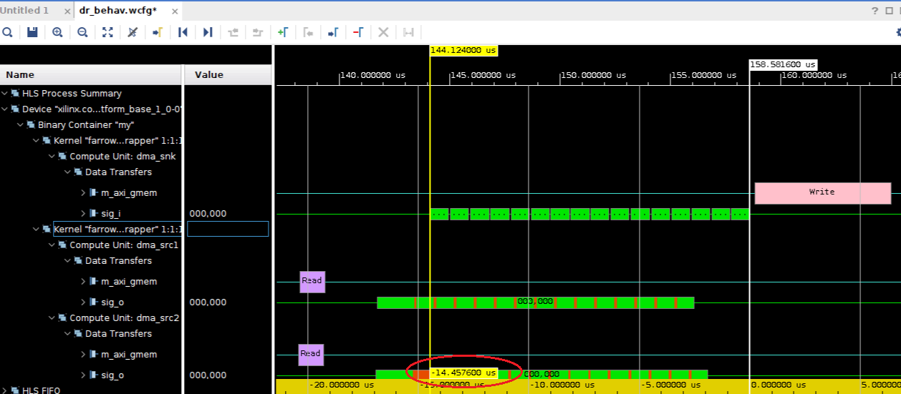

*Figure 14 - Farrow Filter Final Implementation Hardware Emulation*

Throughput measured through the traces is 1024 x 4 x 4/14.5e-6 = 1130 Msps.

After the hardware emulation run completes, the following displays on the terminal. Measure throughput using XRT APIs. For more information, refer to *AI Engine Tools and Flows User Guide* [(UG1076)](https://docs.amd.com/r/en-US/ug1076-ai-engine-environment/XRT-Support-for-Event-APIs).

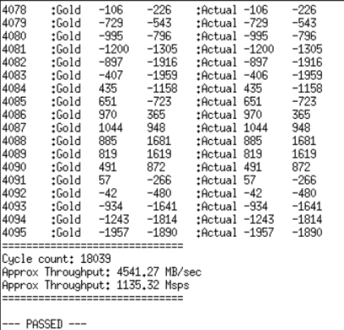

### Hardware

You can build the design for the VCK190 board using the Makefile as follows:

```
[shell]% cd <path-to-design>/15-farrow_filter
[shell]% make clean all TARGET=hw
```

The build process generates the SD card image in the ```<path-to-design>/15-farrow_filter/package/sd_card``` folder. After flashing sd_card.img into the sd card, power on the board and run the design. The following is displayed on the terminal.

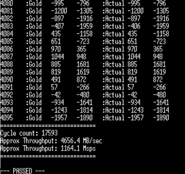

## Summary and Conclusion

In this tutorial, you built a time-varying fractional delay filter based on polynomial approximation and Farrow structure that runs over 1 Gsps. Put emphasis on highlighting some common performance optimization steps applied to the design to meet required throughput targets.

## References

[1]:<https://ieeexplore.ieee.org/document/221081>
[[1]]: F. M. Gardner, "Interpolation in digital modems. I. Fundamentals," in IEEE Transactions on Communications, vol. 41, no. 3, pp. 501-507, March 1993, doi: 10.1109/26.221081.

[2]:<https://ieeexplore.ieee.org/document/15483>
[[2]]: C. W. Farrow, "A continuously variable digital delay element," 1988., IEEE International Symposium on Circuits and Systems, Espoo, Finland, 1988, pp. 2641-2645 vol.3, doi: 10.1109/ISCAS.1988.15483.

[3]:<https://en.wikipedia.org/wiki/Horner%27s_method>
[[3]]: Horner's method: https://en.wikipedia.org/wiki/Horner%27s_method

## Support

GitHub issues track requests and bugs. For questions, go to [support.xilinx.com](http://support.xilinx.com/).

<p class="sphinxhide" align="center"><sub>Copyright © 2023–2026 Advanced Micro Devices, Inc.</sub></p>
<p class="sphinxhide" align="center"><sup><a href="https://www.amd.com/en/corporate/copyright">Terms and Conditions</a></sup></p>
