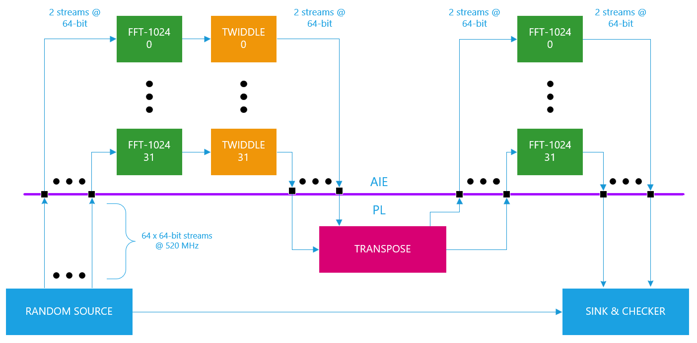
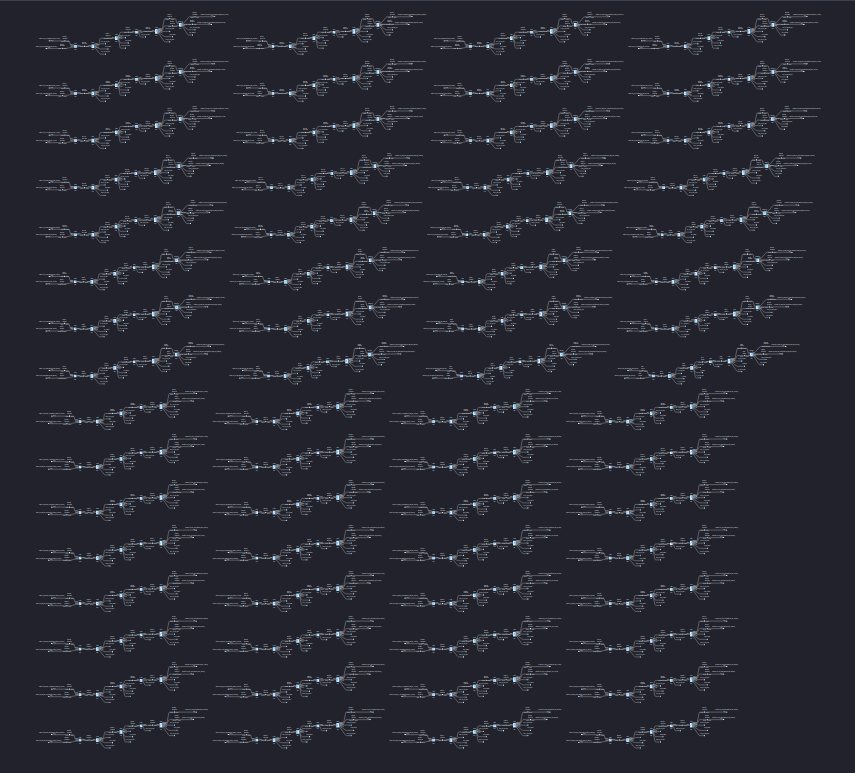
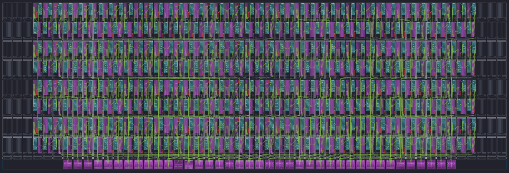
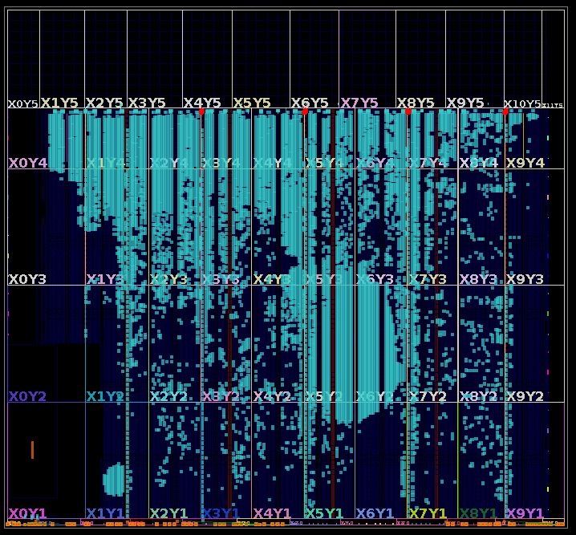
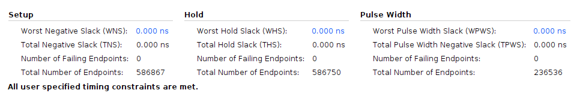
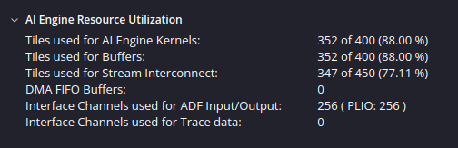
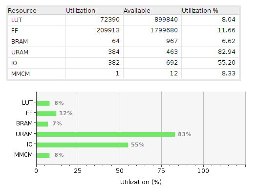
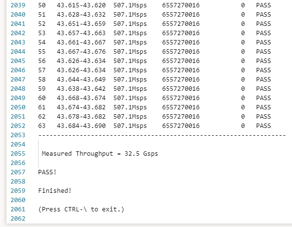

<table class="sphinxhide" style="width:100%;">
  <tr>
    <td align="center">
      <picture>
        <source media="(prefers-color-scheme: dark)" srcset="https://raw.githubusercontent.com/Xilinx/Image-Collateral/main/logo-white-text.png">
        
      </picture>
      <h1>AMD Vitis™ AI Engine Tutorials</h1>
      <a href="https://www.amd.com/en/products/software/adaptive-socs-and-fpgas/vitis.html">See Vitis™ Development Environment on amd.com</a>
        </br>
      <a href="https://www.amd.com/en/products/software/vitis-ai.html">Refer to Vitis™ AI Development Environment on amd.com</a>
    </td>
  </tr>
</table>

# 1 Million Point `float` FFT @ 32 Gsps on AI Engine

***Version: Vitis 2025.2***

## Table of Contents

1. [Introduction](#introduction)
2. [Matlab Models](#matlab-models)
3. [Design Overview](#design-overview)
4. [Design Resources](#design-resources)
5. [Build and Run Design](#build-and-run-design)

[References](#references)

[Support](#support)

[License](#license)

## Introduction

A 1D fast Fourier transform (FFT) implements on the AI Engine array using a 2D FFT algorithm with higher efficiency overall. This "divide & conquer" approach provides a better solution because it relies less on "butterfly routing", and you can break large $N$ point sizes into much smaller factors of size $\sqrt N$. This results in a significant reduction in AI Engine tile memory and overall usage of fewer compute tiles.

This tutorial uses this approach to design a 1M-pt FFT for `float` data types that achieves an impressive throughput rate exceeding 32 Gsps. The design partitions all compute to the AI Engine array and uses UltraRam resources in the programmable logic (PL) to implement the sample reordering needed for the "matrix transpose" operation.

## MATLAB Models

A MATLAB® model `matlab/aie_model_fft_fp_1mpt.m` provides a simple algorithmic model of the 1M-pt transform, implementing it using a $1024\times 1024$ 2D architecture. The algorithm performs conceptually the following steps:

* Write the 1M incoming samples into a $1024\times 1024$ matrix in column major order
* Perform 1K-pt transforms along the matrix rows
* Multiply the 2D matrix pointwise with another 2D matrix of equal size filled with "twiddle factors".
* Perform 1K-pt transforms along the matrix columns
* Extract the 1M outgoing samples in row-major order

The MATLAB models validate the AI Engine design. You can generate the I/O test vectors into the `<path-to-design>/aie_src/data` directory using the following approach.
>**NOTE:** You do not need these I/O test vectors to run the design on the VCK190 evaluation board. You need them only to simulate the AI Engine portion of the design in isolation using either `x86simulator` or `aiesimulator`.

```bash
[shell]% cd <path-to-design>/aie_src
[shell]% make testvectors
```

## Design Overview

The following figure shows block diagram of the 1M-pt transform as follows:

* The "front-end" compute consists of 32 identical instances of a FFT-1024 kernel followed by a twiddle rotation kernel. The FFT-1024 kernels use five AI Engine tiles, one for each radix-4 stage, given $1024=4\times 4\times 4\times 4\times 4$. Each tile employs two 64-bit PLIO streams at 520 MHz. Given these streams carry `cfloat` data types requiring 64-bits per sample, it follows each PLIO stream may transfer 520 Msps; overall this provides a throughput of $32\times 2\times 520=33.28$ Gsps.
* The "transpose" block in the PL provides sample reordering for "row-wise" versus "column-wise" processing -- in effect performing a matrix transpose operation using UltraRam resources in the PL. Note this operation requires a large multi-ported memory resource with 64 I/O streams.
* The "back-end" compute consists of 32 identical instances of an FFT-1024 kernel. Again, these kernels use 5 AI Engine tiles each with two 64-bit PLIO streams @ 520 MHz.
* A random source block in the PL drives the 1M-pt FFT design with stimulus. A sink block in the PL captures the FFT output samples and compares them to a regenerated copy of the input stimulus to validate the design functionality.



### AI Engine Graph View

The following diagram shows the graph view of the AI Engine array for this design. The design contains 32 instances of each 1024-pt "row" FFTs in the front-end and "column" FFTs in the back-end. Each 1024-pt transform implements using five tiles in each case. An extra tile implements "twiddle rotation" for each FFT instance in the front-end. Consequently, the diagram shows 32 instances of a "6-tile subgraph" that implement the front-end transforms and twiddle rotations, along with 32 instances of a "5-tile subgraph" for the back-end compute processing.



### AI Engine Array View

The following diagram shows the floor plan view of the AI Engine array. The design requires resources from a $44\times 8$ rectangular region of the array. The design leaves the three leftmost and rightmost array columns unused.



### VC1902 Floorplan View

The following diagram shows the VC1902 device floorplan with all PL resources highlighted to show utilization. Because the AI Engine array makes use of PLIO resources distributed across the full width of the die, the PL circuitry exhibits the same characteristic.



### AI Engine Design Validation

The AI Engine design validates in functional simulation using either the X86 or AIE simulators. To use the X86 simulator to compile, simulate, then validate the outputs of the simulation, use the following approach:

```
[shell]% cd <path-to-design>/aie_src
[shell]% make x86_compile
[shell]% make x86_sim
[shell]% make x86_check_op
```

To use the AIE simulator to do the same things plus validate the design I/O throughput as measured from simulated PLIO timestamps, use the following approach:

```
[shell]% cd <path-to-design>/aie_src
[shell]% make aie_compile
[shell]% make aie_sim
[shell]% make aie_check_op
[shell]% make aie_get_tp
```

### VC1902 Timing Closure

The following diagram shows the timing summary report for the overall design. The design achieves timing closure at all end-points.



## Design Resources

The following diagram summarizes the AI Engine resources the design uses. The design employs 352 tiles for the combined functions of compute and local buffering. The $32 \times 6=192$ tiles implement the "row transforms" and "twiddle rotations" of the front-end portion of the design. The $32\times 5=160$ tiles implement the "column transforms" of the back-end portion of the design. The design utilizes a total of 352 AI Engine tiles. A total of 256 PLIO stream resources transfer data between the AI Engine array and PL. Notice how careful floorplanning leads to a design that does not use additional overhead resources from the array.



The following diagram summarizes the PL resources the design uses. Block RAM and UltraRam blocks provide the required storage to implement the "matrix transpose" operation sitting between the front-end and back-end AI Engine compute kernels. A modest amount of LUT and FF resources supports the design, including the pseudo-random binary sequence (PRBS) generators and checkers. The PL design runs at 520 MHz.



## Build and Run Design

### Setup & Initialization

This design runs on the VCK190 evaluation board using a custom platform and bare metal OS. You do not need to configure the environment to point to base platforms or Linux filesystems. Build the bitstream directly from the top level Makefile.

### Hardware

To build the design for hardware, execute the following steps:

```
[shell]% cd <path-to-design>
[shell]% make all
```

The build process generates the SD card image in `<path-to-design>/package/build_hw/sd_card.img`. The full build process typically takes up to 2.5 hours on a high-performance server.

The following figure shows a screen capture of the application when run on the VCK190. It shows an overall measured throughput of 32.5 Gsps and a measured latency of ~44 μs on each of the PLIO streams. Find the full log captured from the board [here](images/1M_point_FFT_log.txt).



## References

[1]: <https://en.wikipedia.org/wiki/Fast_Fourier_transform> "Fast Fourier Transform"

[[1]] Wikipedia, "[Fast Fourier Transform](https://en.wikipedia.org/wiki/Fast_Fourier_transform)"

## Support

GitHub issues track requests and bugs. For questions, go to [adaptivesupport.amd.com](https://adaptivesupport.amd.com/).

## License

Copyright © 2023–2026 Advanced Micro Devices, Inc. All rights reserved.

<p class="sphinxhide" align="center"><sub>Copyright © 2023–2026 Advanced Micro Devices, Inc.</sub></p>
<p class="sphinxhide" align="center"><sup><a href="https://www.amd.com/en/corporate/copyright">Terms and Conditions</a></sup></p>
