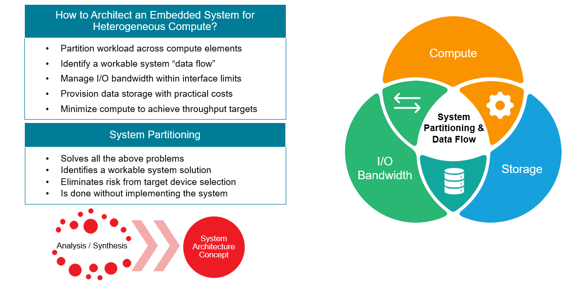
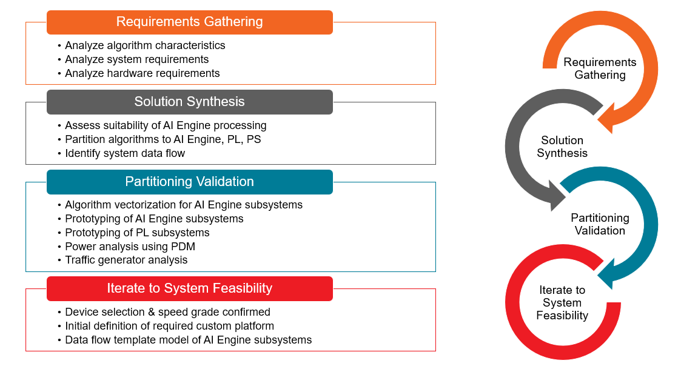
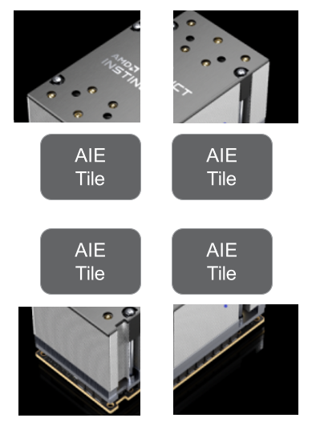
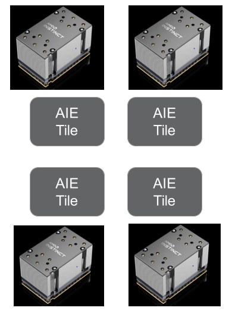
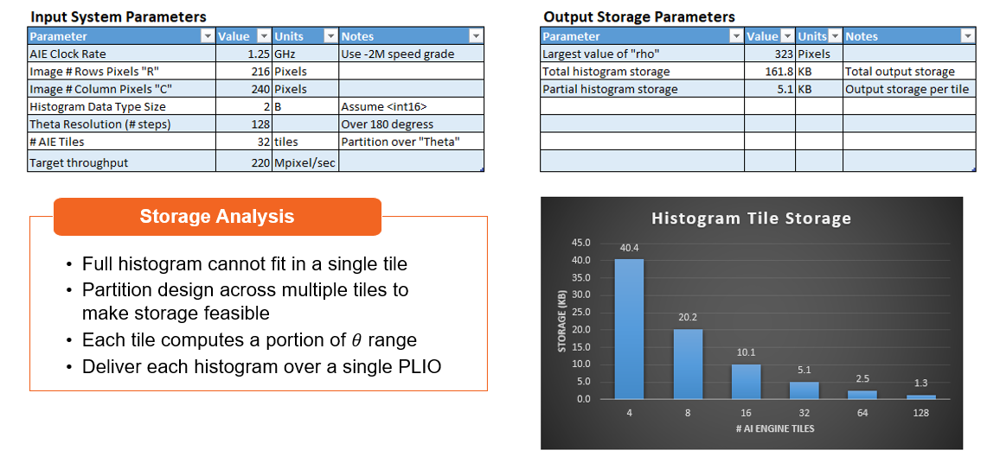
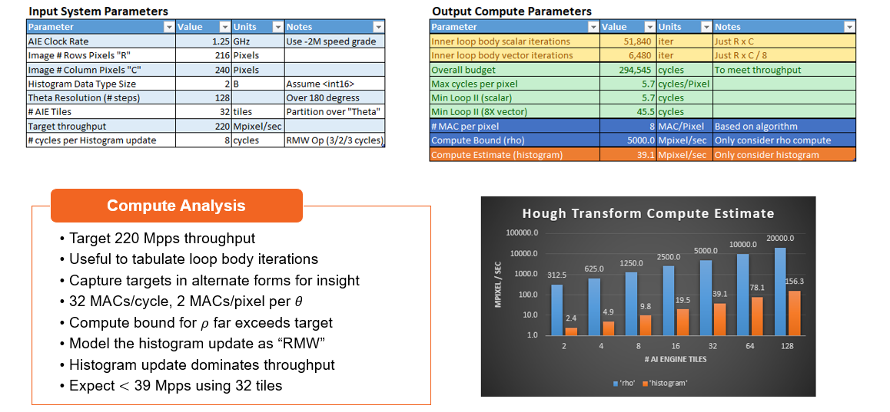
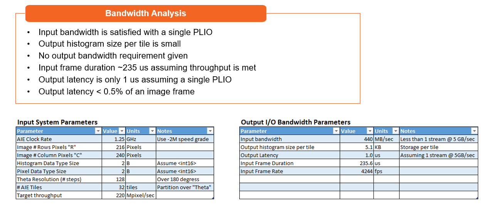
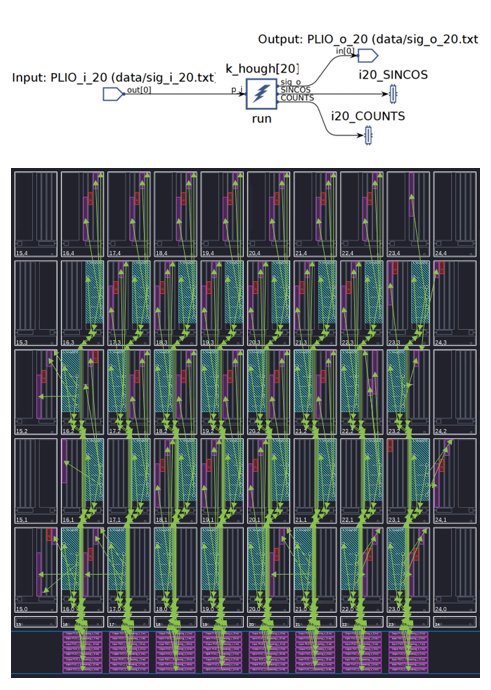
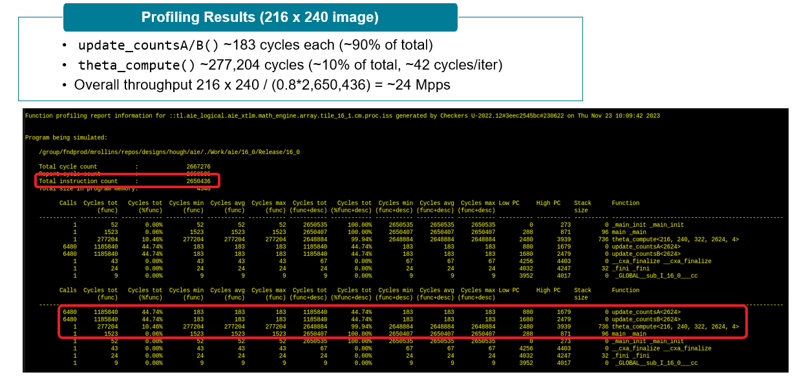
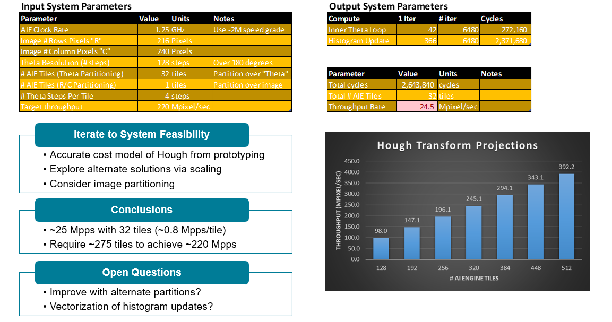

<!--
Copyright (C) 2023, Advanced Micro Devices, Inc. All rights reserved.
SPDX-License-Identifier: MIT
Author: Mark Rollins
-->
<table class="sphinxhide" width="100%">
 <tr width="100%">
    <td align="center"><h1>AI Engine Development</h1>
    <a href="https://www.xilinx.com/products/design-tools/vitis.html">See Vitis™ Development Environment on xilinx.com</br></a>
    <a href="https://www.xilinx.com/products/design-tools/vitis/vitis-ai.html">See Vitis™ AI Development Environment on xilinx.com</a>
    </td>
 </tr>
</table>

# System Partitioning of a Hough Transform on AI Engine

***Version: Vitis 2024.1***

## Table of Contents

1. [Introduction](#introduction)
2. [Hough Transform Matlab Model](#hough-transform-matlab-model)
3. [System Partitioning](#system-partitioning)
4. [Conclusions](#conclusions)

[References](#references)

[Support](#support)

[License](#license)

## Introduction

This tutorial discusses the process of planning the implementation of a well-known image processing algorithm, mapping, and partitioning it to the resources available in an AMD Versal&trade; Adaptive SoC device. The goal is to partition the compute workloads of the application across the heterogeneous compute domains of the device, namely the Processor Subsystem (PS), the Programmable Logic (PL), and the AI Engine (AIE). Then identify a "data flow" through the device to pass data between storage locations and these compute domains. This requires analysis of the Compute, Storage, and Bandwidth requirements of the system algorithms and aligning those to the available device resources to discover a workable system solution. This is known as System Partitioning, and the process is illustrated using the well-known Hough Transform.

### What is the Hough Transform?

The Hough Transform is a feature extraction technique for computer vision and image processing. It was invented in 1959 to detect lines in the machine analysis of monochromatic bubble chamber photographs, patented in 1962, and popularized and extended in support from lines to other objects by Duda & Hart in 1972 [1]. Only the line detection style of Hough Transform  is considered in this tutorial. 

The Hough Transform detects lines in an image using a parameteric representation by transforming the line in 2D from its normal $(x,y)$ coordinates into a new $(\rho,\theta)$ domain where $\rho$ represents the line drawn from the origin to where it meets the line at a 90 degree angle, and $\theta$ identifies the angle that perpendicular line makes to the x-axis. This is shown in the following diagram. Notice how all points on the red line have the same $(\rho,\theta)$ values. Consequently, if every pixel in the image is associated with a $(\rho,\theta)$ pair, lines in the original image may be identified in the $(\rho,\theta)$ plane by observing the relative occurance of these pairs -- via a histogram of the $(\rho,\theta)$ data. These histogram statistics are collected by the Hough Transform in the $(\rho,\theta)$ plane to identify lines in the original image. 


### What is System Partitioning?

System Partitioning is used to architect an embedded system for hetergeneous compute by partitioning the application workload across the various compute elements in the device. Once partitioned, a workable "data flow" identifies the path taken between subsystems in the device as data moves between storage and compute resources. Along the way, I/O bandwidth is managed carefully within interface limits. Data storage locations are identified based on suitability of interface bandwidths, storage depths, and compute requirements. In the end, a workable system solution is identified that eliminates risk from the device selection. This is all accomplished using a combination of analysis and prototyping work without implementing the full design. This solution scope is outlined in the following diagram.



### System Partitioning Methodology

The following methodology is defined to steer the system partitioning analysis activities:
1. Requirements Gathering -- An analysis step to compare system/algorithm requirements against device resources.
2. Solution Synthesis -- A conceptual step to identify possible solutions based on specific partitions and their resulting data flows.
3. Partitioning Validation -- A  feasibility assessment driven by detailed analysis and prototyping to identify shortcomings and reduce risk.
4. Iterate to System Feasibility -- Revise, rework, and re-envision until a suitable low-risk solution is identified.

Some aspects of each phase is outlined in the following diagram.



### Hough Transform Matlab Model

A proper algorithm model is required for system partitioning. It is started with the Matlab model shown below. A detailed study of this model identifies key aspects of the system design that impact its solution. For example:

* The overall compute load complexity is driven by the image size through $R$ and $C$ dimensions.
* The resolution adopted for $\theta$ through the `theta_res` parameter drives complexity, bandwidth, and histogram storage.
* The algorithm exhibits a "dual-nested for-loop" character.
* The algorithm employs lookup tables through `cos_theta` and `sin_theta`.
* The algorithm has been quantized to use `int16` data types.
* There are multiple compute workloads: for `rho_i`, `addr` and histogram update `H`.

```
function [H,theta,rho,rho_calc] = hough_model( BW, theta_res )
   if     (nargin == 1) theta_res = 180; 
   elseif (nargin ~= 2) error('hough_model(BW,theta_res)'); end
   [R,C] = size(BW);
   rho_max = ceil(sqrt((R-1)^2 + (C-1)^2));
   fprintf(1,'rho_max: %g\n',rho_max);
   % Initialize:
   tmp = linspace(-90,90,1+theta_res);
   theta = tmp(1:end-1);
   cos_theta = double(fi(cos(theta*pi/180),1,16,15,'RoundingMethod','Round','OverflowAction','Saturate'));
   sin_theta = double(fi(sin(theta*pi/180),1,16,15,'RoundingMethod','Round','OverflowAction','Saturate'));
   rho = [-rho_max:1:rho_max];
   Nt = numel(theta);
   Nr = numel(rho);
   H = zeros(Nr,Nt); 
   rho_calc = zeros(R,C,Nt);
   % Compute transform:
   for yy = 0 : R-1
     for xx = 0 : C-1
       % Compute the 'rho' value:
       rho_i = double(fi(xx*cos_theta + yy*sin_theta,...
                         1,16,0,'RoundingMethod','Round','OverflowAction','Saturate'));
       rho_calc(1+yy,1+xx,:) = rho_i;
       % Add offset to turn onto 'rho' address:
       addr = rho_i + rho_max;
       for ii = 1 : Nt
         H(1+addr(ii),ii) = H(1+addr(ii),ii) + BW(1+yy,1+xx);
     end % yy
   end %xx
end
```

The Matlab model is run and its performance compared to the built-in Matlab function `hough` is found in the Image Processing Toolbox. Here, it is run with a $216\times 240$ image of the AMD Instinct and show "heat maps" of the 2D Hough Transform output histograms for both the Matlab function and the AMD 16-bit Matlab model. 


## System Partitioning

This section illustrates the details of system partitioning for the Hough Transform. The ultimate system goals, techniques to parallelize the algorithm over multiple AI Engine tiles, analyzing storage, compute, and bandwidth and their impacts on the partitioning choices are considered. A spreadsheet analysis steers us to some early conclusions on what might be feasible, but some detailed prototyping work is required to refine these estimates to finally identify a more accurate scoping of how many AI Engine resources are required to achieve the design objectives. 

### Goals

This tutorial aims at identifying the "best we can do" using only AI Engine resources to implement the Hough Transform. To this end, a target throughput requirement of 220 Mpixel/sec (or Mpps) is set and the question is posed, "How many AI Engine tiles are required?" As understood from the Matlab model above, the image size and $\theta$ resolution are key parameters driving compute, bandwidth, and storage. With this in mind, brainstorm solutions for how you can parallelize the Hough Transform algorithm across multiple AI Engine tiles.

### Parallelizing Over "Image Tiles"

One obvious way to increase throughput is to parallelize the image over AI Engine tiles directly such that each tile sees only a small portion of the original image. This is shown in the following diagram. In this way, each tile computes a full Hough transform for the portion of the image that it sees. This yields a linear reduction in its compute workload and a similar reduction in the input bandwidth delivered to each tile. There is no reduction in tile memory for histogram storage. One consequence of this approach is that you must combine the histogram outputs from each tile, resulting in an additional compute workload to combine together all tile results.



### Parallelizing Over "Theta"

An alternative strategy partitions the Hough Transform such that each tile sees the full image but computes only a partial transform over a subset of the $\theta$ range. This also leads to a linear reduction in compute, but does not achieve any input bandwidth reduction. This scheme benefits from a linear reduction in the tile histogram storage. Collect the histogram outputs from each tile, but there is no extra compute workload involved with this approach.



### Analyzing Storage Requirements

Having identified some possible parallelization schemes, dive into the Requirements Gathering phase of System Partitioning to analyze storage requirements. Details of this analysis are outlined in the following diagram. Following the "Parallelizing over Theta" strategy, a single full histogram cannot fit into the 32 KB local tile memory. Partition over multiple tiles to make storage feasible. The total histogram storage for the image size is 162 KB, and you require at least eight tiles to reduce this to manageable levels.



### Analyzing Compute Requirements

Next, use a spreadsheet analysis to assess compute requirements. Load the system input parameters on the left side of the spreadsheet shown below and analyze compute parameters on the right side. It is useful to tabulate the numbers of processor cycles required by each loop body in the original Matlab model of the Hough Transform. Based on the AI Engine compute capacity of 32 MACs/cycle for `int16` data types, you can process two MACs/pixel per $\theta$ value in real time. Based on these vector estimates, the spreadsheet indicates to process 5.7 cycles per pixel to meet the 220 Mpps throughput objective. This is equivalent to 45 cycles for the vector processor with its eight lanes SIMD execution. The compute bound for the vector processor is high at 5000 Mpps. However, assuming an 8-cycle "read-modify-write" instruction to update the histogram tables in the third compute workload, the throughput is limited by the scalar processor to 39 Mpps if using 32 tiles. When projected to more tiles, reaching the 220 Mpps target with even 128 tiles is not possible. 



### Analyzing I/O Bandwidth Requirements

The bandwidth analysis for this design is straightforward. The input bandwidth is satisfied with a single PLIO. The output histogram size per tile is small, and neither an output bandwidth nor latency target is established. The computed frame duration is 235 us assuming the given image size and 220 Mpps target throughput. A single output PLIO stream can transfer the full histogram result in 1 us; this is less than 1% of the image frame and seems reasonable.



### SIMD / Vectorization

An important aspect of System Partitioning for AI Engine is to consider how the SIMD vector data path may be leveraged for high performance compute. This usually involves investigating strategies for "vectorization" or assigning signal samples to lanes. For the $\rho$ computation of the Hough Transform, a workable scheme involves using `mac16()` intrinsics to process four pixels at a time. 

* In one vector register, four copies of four different $\theta$ values are loaded to allow you to process four $\theta$ values for four different pixels in a single instruction. This produces sixteen histogram outputs per cycle and two such computes per loop body are scheduled.
* In a second vector register, load four $(x,y)$ pixel values into lanes aligned properly to their $\theta$ counterparts in the other register. 

### Solution Synthesis

Based on the previous spreadsheet analysis, it is anticipated that a 32-tile AI Engine design might be limited to ~39 Mpps throughput due to the read-modify-write updates of the histogram counts on the scalar processor. It is difficult to nail down more accurately a means to achieving a 220 Mpps throughput objective from this early analysis. Some accurate prototyping work is required on a proposed solution to validate assumptions and obtain more accurate performance projections.

Based on the early spreadsheet analysis work, a Solution Proposal is as follows:
* Assume a 32-tile solution where each tile computes four of the 128 $\theta$ values
* Each tile uses local tile memory for storage of $\cos$ and $\sin$ LUTs
* Use the `mac16()` vectorization outlined above operating at four pixels per cycle
* A 5.1 KB histogram LUT is expected in each tile as predicted from the storage analysis above

From early spreadsheet work, a throughput limited to ~39 Mpps is anticipated and the target is II=45 for the vectorized compute, but expect performance to be limited by the histogram updates. Now code this early prototype to validate and accurately quantify these assumptions.

The following diagram shows the AI Engine graph view for a single tile of this prototype design. All 32 tiles are identical. The floor plan view of the composite design is also shown. This design was profiled on the given image to tabulate accurately the its throughput performance and to obtain the cycle count performance of each function.



### Partitioning Validation

Coding up the Hough Transform prototype yields additional insight into the design and a deeper understanding of its performance limitations. Indeed, as predicting, the histogram update code (shown below) illustrates the exact "read-modify-write" form anticipated from the start. It is difficult to identify any means to vectorize it and remove this performance bottleneck. 

```
template <int COUNT_NUM>
  inline void update_countsA( TT_COUNT (&COUNTS)[COUNT_NUM],
                              aie::vector<TT_COUNT,16>& rho, aie::vector<TT_COUNT,8>& pixels )
  {
    COUNTS[rho[ 0]] += pixels[0];
    COUNTS[rho[ 1]] += pixels[0];
    COUNTS[rho[ 2]] += pixels[0];
    COUNTS[rho[ 3]] += pixels[0];
    COUNTS[rho[ 4]] += pixels[1];
    COUNTS[rho[ 5]] += pixels[1];
    COUNTS[rho[ 6]] += pixels[1];
    COUNTS[rho[ 7]] += pixels[1];
    COUNTS[rho[ 8]] += pixels[2];
    COUNTS[rho[ 9]] += pixels[2];
    COUNTS[rho[10]] += pixels[2];
    COUNTS[rho[11]] += pixels[2];
    COUNTS[rho[12]] += pixels[3];
    COUNTS[rho[13]] += pixels[3];
    COUNTS[rho[14]] += pixels[3];
    COUNTS[rho[15]] += pixels[3];
  }
```

The following diagram tabulates the profiling data generated by the compiler for the 32-tile Hough Transform prototype design when run on the $216\times 240$ image. The important conclusions are quite clear:
* The `update_countsA/B()` routines require ~183 cycles each representing ~90% of the total cycles
* The `theta_compute()` routine requires ~277,204 cycles representing ~10% of the total cycles, and equivalent to ~42 cycles per II (very close to the original spreadsheet estimate of 45)
* The overall throughput is $216\times 240/(0.8\times2,650,436) = ~24$ Mpps

From detailed prototyping, you have now quantified the throughput performance of the Hough Transform accurately, and these results might be used to revise the original spreadsheet estimates to produce accurate projections of how to achieve a 220 Mpps throughput target. 



### Iterating to System Feasibility

Now having an accurate cost model of the Hough Transform from prototyping, you are in a position to explore alternate solutions via scaling. Here, consider "Image Partitioning" in addition to "Theta Partitioning" as a means to scale up the throughput. In this scheme, partition out portions of the images to 32-tile clusters, where each cluster is computing partial histograms for four $\theta$ values (as in the prototype). Using this approach, you can scale throughput linearly higher. As shown in the following diagram, you can achieve ~ 220 Mpps with ~275 tiles.



## Conclusions

This tutorial uses the Hough Transform as a working example to illustrate the concepts of System Partitioning, and how this methodology is used to scope new AI Engine designs and to more generally partition hetergeneous compute workloads across the resources available in Versal Adaptive SoCs. Through requirements gathering, solution synthesis, prototype validation, and iterative refinement, system applications might be successfully partitioned to these devices using common analysis tools such as spreadsheets and targeted prototyping & profiling. 

## References

[1]: [Use of the Hough Transformation to Detect Lines and Curves in Pictures](https://dl.acm.org/doi/10.1145/361237.361242)

## Support

GitHub issues will be used for tracking requests and bugs. For questions, go to [support.xilinx.com](http://support.xilinx.com/).

## License

Components: xilinx-images

images in the documentation

Components: xilinx-files

The MIT License (MIT)

Copyright (c) 2024 Advanced Micro Devices, Inc.

Permission is hereby granted, free of charge, to any person obtaining a copy
of this software and associated documentation files (the "Software"), to deal
in the Software without restriction, including without limitation the rights
to use, copy, modify, merge, publish, distribute, sublicense, and/or sell
copies of the Software, and to permit persons to whom the Software is
furnished to do so, subject to the following conditions:

The above copyright notice and this permission notice shall be included in all
copies or substantial portions of the Software.

THE SOFTWARE IS PROVIDED "AS IS", WITHOUT WARRANTY OF ANY KIND, EXPRESS OR
IMPLIED, INCLUDING BUT NOT LIMITED TO THE WARRANTIES OF MERCHANTABILITY,
FITNESS FOR A PARTICULAR PURPOSE AND NONINFRINGEMENT. IN NO EVENT SHALL THE
AUTHORS OR COPYRIGHT HOLDERS BE LIABLE FOR ANY CLAIM, DAMAGES OR OTHER
LIABILITY, WHETHER IN AN ACTION OF CONTRACT, TORT OR OTHERWISE, ARISING FROM,
OUT OF OR IN CONNECTION WITH THE SOFTWARE OR THE USE OR OTHER DEALINGS IN THE
SOFTWARE.

<p class="sphinxhide" align="center">  &copy; Copyright 2024 Advanced Micro Devices, Inc.</p>


