<table class="sphinxhide" style="width:100%;">
  <tr>
    <td align="center">
      <picture>
        <source media="(prefers-color-scheme: dark)" srcset="https://raw.githubusercontent.com/Xilinx/Image-Collateral/main/logo-white-text.png">
        
      </picture>
      <h1>AMD Vitis™ AI Engine Tutorials</h1>
      <a href="https://www.amd.com/en/products/software/adaptive-socs-and-fpgas/vitis.html">See Vitis™ Development Environment on amd.com</a>
        <br>
      <a href="https://www.amd.com/en/products/software/vitis-ai.html">See Vitis™ AI Development Environment on amd.com</a>
    </td>
  </tr>
</table>

# System Partitioning of a Hough Transform on AI Engine

***Version: Vitis 2025.2***

## Table of Contents

1. [Introduction](#introduction)
2. [Hough Transform Matlab Model](#hough-transform-matlab-model)
3. [System Partitioning](#system-partitioning)
4. [Conclusions](#conclusions)

[References](#references)

[Support](#support)

## Introduction

This tutorial discusses planning and implementing a well-known image processing algorithm on an AMD Versal™ Adaptive SoC device. The goal is to partition compute workloads across the device's heterogeneous compute domains: processor subsystem (PS), programmable logic (PL), and AI Engine (AIE). Then, identify a data flow to pass data between storage locations and compute domains. This requires analyzing Compute, Storage, and Bandwidth requirements and aligning them to available device resources. This process is system partitioning, shown here using the Hough Transform.

### What is the Hough Transform

The Hough Transform is a feature extraction technique for computer vision and image processing. It was invented in 1959 to detect lines in bubble chamber photographs. It was patented in 1962 and popularized by Duda and Hart in 1972 [1]. This tutorial uses the line detection style of Hough Transform only.

The Hough Transform detects lines using a parametric representation. It transforms lines from normal $(x,y)$ coordinates into a $(\rho,\theta)$ domain. Here, $\rho$ represents the perpendicular distance from the origin, and $\theta$ identifies the angle to the x-axis. The following diagram shows this transformation. Notice all points on the red line have the same $(\rho,\theta)$ values. When every pixel associates with a $(\rho,\theta)$ pair, you can identify lines through histogram analysis. These histogram statistics in the $(\rho,\theta)$ plane identify lines in the original image.

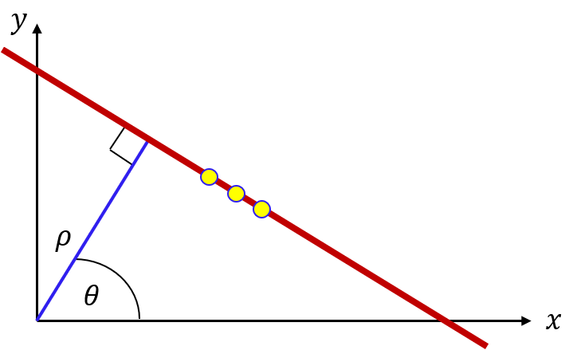

### What is System Partitioning

Use system partitioning to architect an embedded system for heterogeneous compute by partitioning the application workload across the various compute elements in the device. After partitioning, a workable data flow identifies the path taken between subsystems in the device as data moves between storage and compute resources. Manage I/O bandwidth within interface limits. Select data storage locations based on suitability of interface bandwidths, storage depths, and compute requirements. Identify a workable system solution that eliminates risk from the device selection. This is all accomplished using a combination of analysis and prototyping work without implementing the full design. The following diagram outlines the solution scope.

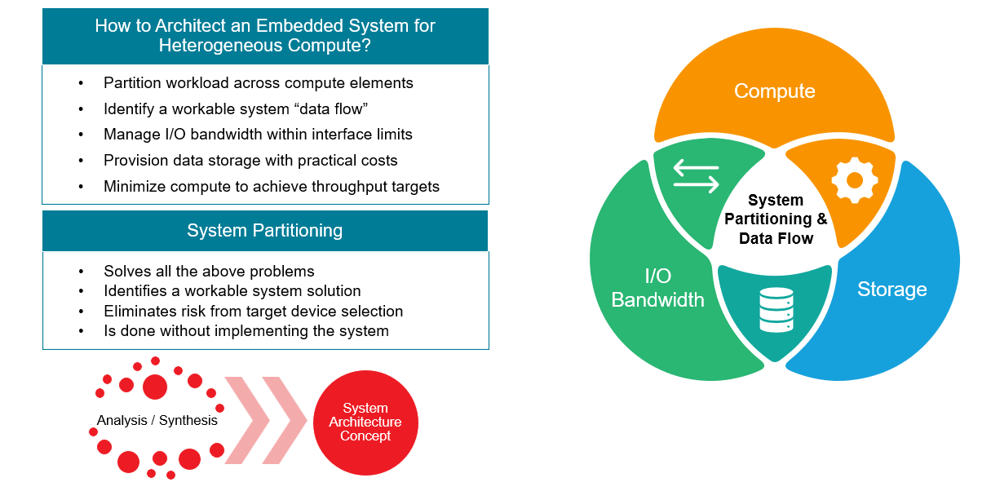

### System Partitioning Methodology

Use the following methodology to guide your system partitioning analysis activities:

1. Requirements Gathering -- Analyze system and algorithm requirements in relation to device resources.
2. Solution Synthesis -- Identify possible solutions based on specific partitions and resulting data flows.
3. Partitioning Validation -- Assess feasibility through detailed analysis and prototyping to identify shortcomings and reduce risk.
4. Iterate to System Feasibility -- Revise, rework, and re-envision until achieving a suitable low‑risk solution.

The following diagram outlines aspects of each phase.

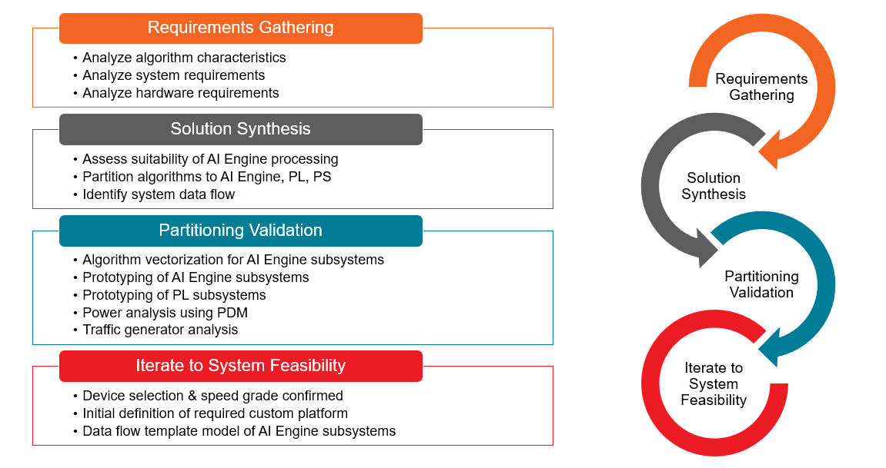

### Hough Transform MATLAB Model

You need a proper algorithm model for system partitioning. Begin with the MATLAB® model shown in the following example. A detailed study of this model identifies key aspects of the system design that impact its solution. For example:

* The image size drives the overall compute load complexity through $R$ and $C$ dimensions.
* The resolution adopted for $\theta$ through the `theta_res` parameter drives complexity, bandwidth, and histogram storage.
* The algorithm exhibits a "dual-nested for-loop" character.
* The algorithm employs lookup tables through `cos_theta` and `sin_theta`.
* The algorithm is quantized to use `int16` data types.
* There are multiple compute workloads: for `rho_i`, `addr` and histogram update `H`.

```
function [H,theta,rho,rho_calc] = hough_model( BW, theta_res )
   if     (nargin == 1) theta_res = 180;
   elseif (nargin ~= 2) error('hough_model(BW,theta_res)'); end
   [R,C] = size(BW);
   rho_max = ceil(sqrt((R-1)^2 + (C-1)^2));
   fprintf(1,'rho_max: %g\n',rho_max);
   % Initialize:
   tmp = linspace(-90,90,1+theta_res);
   theta = tmp(1:end-1);
   cos_theta = double(fi(cos(theta*pi/180),1,16,15,'RoundingMethod','Round','OverflowAction','Saturate'));
   sin_theta = double(fi(sin(theta*pi/180),1,16,15,'RoundingMethod','Round','OverflowAction','Saturate'));
   rho = [-rho_max:1:rho_max];
   Nt = numel(theta);
   Nr = numel(rho);
   H = zeros(Nr,Nt);
   rho_calc = zeros(R,C,Nt);
   % Compute transform:
   for yy = 0 : R-1
     for xx = 0 : C-1
       % Compute the 'rho' value:
       rho_i = double(fi(xx*cos_theta + yy*sin_theta,...
                         1,16,0,'RoundingMethod','Round','OverflowAction','Saturate'));
       rho_calc(1+yy,1+xx,:) = rho_i;
       % Add offset to turn onto 'rho' address:
       addr = rho_i + rho_max;
       for ii = 1 : Nt
         H(1+addr(ii),ii) = H(1+addr(ii),ii) + BW(1+yy,1+xx);
     end % yy
   end %xx
end
```

Run the MATLAB model and compare its performance to the built-in MATLAB `hough` function from the Image Processing Toolbox. Run it with a $216\times 240$ image of the AMD Instinct. View heat maps of the 2D Hough Transform output histograms for both the MATLAB function and the AMD 16-bit MATLAB model.

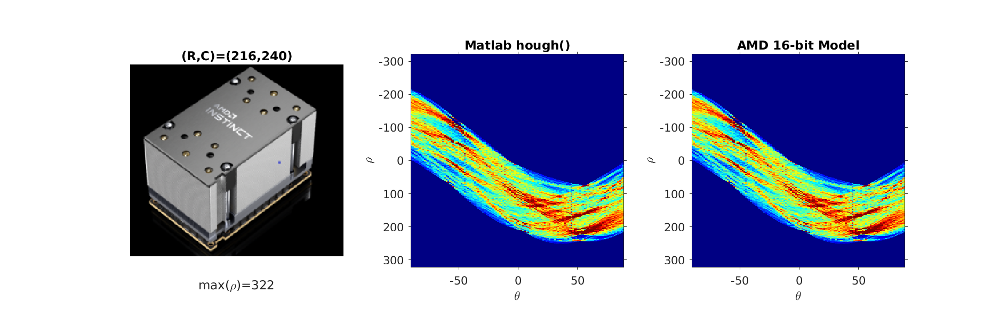

## System Partitioning

This section demonstrates system partitioning details for the Hough Transform. It considers system goals, parallelization techniques, and analysis of storage, compute, and bandwidth impacts. A spreadsheet analysis provides early conclusions on feasibility. Detailed prototyping work is necessary to refine estimates and accurately scope the AI Engine resources required.

### Goals

This tutorial aims at identifying the best achievable performance using only AI Engine resources to implement the Hough Transform. Set a target throughput of 220 megapixels per second (MP/s) and ask, "How many AI Engine tiles are required?" From the MATLAB model, understand that image size and $\theta$ resolution are key parameters influencing compute, bandwidth, and storage. With this knowledge, brainstorm ways to parallelize the Hough Transform algorithm across multiple AI Engine tiles.

### Parallelizing Over Image Tiles

One obvious way to increase throughput is to parallelize the image over AI Engine tiles directly. Each tile sees only a small portion of the original image. The following diagram shows this approach. Each tile computes a full Hough transform for its image portion. This yields linear reductions in compute workload and input bandwidth per tile. Tile memory for histogram storage is not reduced. You must combine histogram outputs from each tile, adding extra compute workload.

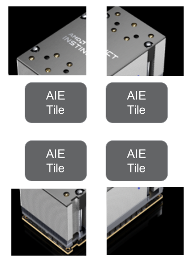

### Parallelizing Over Theta

An alternative strategy partitions the Hough Transform so each tile sees the full image. Each tile computes only a partial transform over a $\theta$ subset. This achieves linear compute reduction but no input bandwidth reduction. This scheme benefits from linear reduction in tile histogram storage. Collect histogram outputs from each tile without extra compute workload.

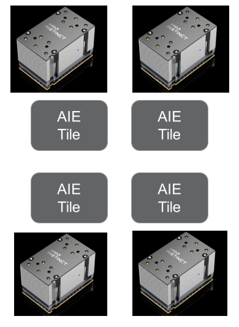

### Analyzing Storage Requirements

Having identified some possible parallelization schemes, dive into the Requirements Gathering phase of System Partitioning to analyze storage requirements. Details of this analysis are outlined in the following diagram. Following the "Parallelizing over Theta" strategy, a single full histogram cannot fit into the 32 KB local tile memory. Partition over multiple tiles to make storage feasible. The total histogram storage for the image size is 162 KB, and you require at least eight tiles to reduce this to manageable levels.

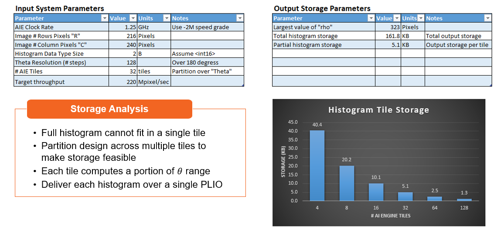

### Analyzing Compute Requirements

Next, use a spreadsheet analysis to assess compute requirements. Load the system input parameters on the left side of the spreadsheet and analyze compute parameters on the right side. It is useful to tabulate the numbers of processor cycles required by each loop body in the original MATLAB model of the Hough Transform. Given an AI Engine compute capacity of 32 MACs/cycle for `int16` data types, you can process two MACs/pixel per $\theta$ value in real time. Based on these vector estimates, the spreadsheet indicates to process 5.7 cycles per pixel to meet the 220 MP/s throughput objective. This equals 45 cycles for the vector processor with eight-lane single‑instruction multiple‑data (SIMD) execution. The compute bound for the vector processor is high at 5000 MP/s. Assuming an 8-cycle read-modify-write instruction to update histogram tables, throughput becomes limited by the scalar unit. With 32 tiles, throughput reaches only 39 MP/s. Even with 128 tiles, reaching the 220 MP/s target is impossible.

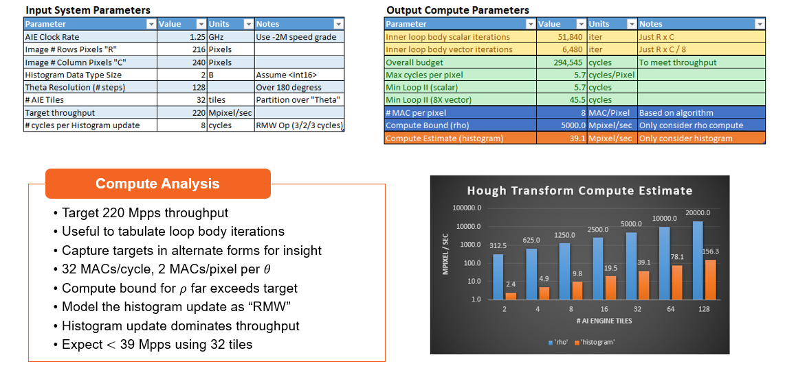

### Analyzing I/O Bandwidth Requirements

The bandwidth analysis for this design is straightforward. You satisfy the input bandwidth with a single programmable logic input/output (PLIO). The output histogram size per tile is small, and you set no output bandwidth or latency target. The computed frame duration is 235 μs assuming the given image size and 220 MP/s target throughput. A single output PLIO stream transfers the full histogram result in 1 μs, less than 1% of the image frame. This transfer rate is reasonable.

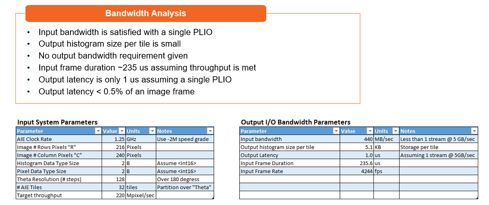

### SIMD / Vectorization

When performing system partitioning for the AI Engine, consider how the SIMD vector data path supports high-performance compute. Investigate vectorization strategies or assign signal samples to lanes. For the $\rho$ computation of the Hough Transform, a workable scheme involves using `mac16()` intrinsics to process four pixels at a time.

* In one vector register, load four copies of four different $\theta$ values. Process four $\theta$ values for four pixels in one instruction, producing 16 histogram outputs per cycle. Schedule two computes per loop body.
* In a second vector register, load four $(x,y)$ pixel values into lanes aligned to their $\theta$ counterparts in the other register.

### Solution Synthesis

Based on the spreadsheet analysis, a 32-tile AI Engine design reaches about ~39 MP/s throughput. The limitation comes from read-modify-write updates of histogram counts on the scalar unit. Perform more accurate prototyping to validate assumptions and obtain performance projections. This early analysis cannot nail down a means to achieving 220 MP/s throughput.

Based on the early spreadsheet analysis work, a solution proposal is as follows:

* Assume a 32-tile solution where each tile computes four of the 128 $\theta$ values
* Each tile uses local tile memory for storage of $\cos$ and $\sin$ LUTs
* Use the `mac16()` vectorization outlined above operating at four pixels per cycle
* A 5.1 KB histogram LUT is expected in each tile as predicted from the storage analysis above

From early spreadsheet work, a throughput limited to ~39 MP/s is anticipated and the target is II=45 for the vectorized compute, but expect performance to be limited by the histogram updates. Now code this early prototype to validate and accurately quantify these assumptions.

The following diagram shows the AI Engine graph view for a single tile of this prototype design. All 32 tiles are identical. The floor plan view of the composite design is also shown. Profile the design on the given image to tabulate its throughput performance accurately and to obtain the cycle count performance of each function.

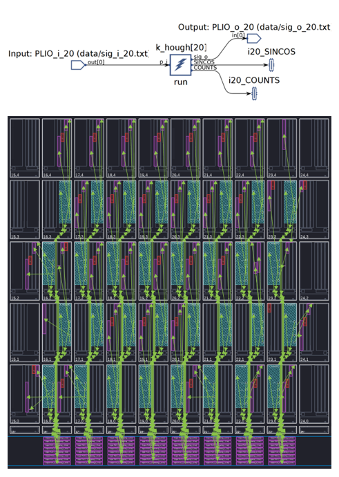

### Partitioning Validation

Coding up the Hough Transform prototype yields additional insight into the design and a deeper understanding of its performance limitations. Indeed, as predicted, the histogram update code shows the exact read-modify-write form anticipated from the start. It is difficult to identify any means to vectorize it and remove this performance bottleneck.

```
template <int COUNT_NUM>
  inline void update_countsA( TT_COUNT (&COUNTS)[COUNT_NUM],
                              aie::vector<TT_COUNT,16>& rho, aie::vector<TT_COUNT,8>& pixels )
  {
    COUNTS[rho[ 0]] += pixels[0];
    COUNTS[rho[ 1]] += pixels[0];
    COUNTS[rho[ 2]] += pixels[0];
    COUNTS[rho[ 3]] += pixels[0];
    COUNTS[rho[ 4]] += pixels[1];
    COUNTS[rho[ 5]] += pixels[1];
    COUNTS[rho[ 6]] += pixels[1];
    COUNTS[rho[ 7]] += pixels[1];
    COUNTS[rho[ 8]] += pixels[2];
    COUNTS[rho[ 9]] += pixels[2];
    COUNTS[rho[10]] += pixels[2];
    COUNTS[rho[11]] += pixels[2];
    COUNTS[rho[12]] += pixels[3];
    COUNTS[rho[13]] += pixels[3];
    COUNTS[rho[14]] += pixels[3];
    COUNTS[rho[15]] += pixels[3];
  }
```

The following diagram tabulates the profiling data generated by the compiler for the 32-tile Hough Transform prototype design when run on the $216\times 240$ image. The important conclusions are clear:

* The `update_countsA/B()` routines require ~183 cycles each representing ~90% of the total cycles
* The `theta_compute()` routine requires ~277,204 cycles representing ~10% of the total cycles. This is equivalent to ~42 cycles per II, very close to the spreadsheet estimate of 45.
* The overall throughput is $216\times 240/(0.8\times2,650,436) = ~24$ MP/s

From detailed prototyping, you have accurately quantified the Hough Transform throughput performance. These results can revise the original spreadsheet estimates. This produces accurate projections for achieving a 220 MP/s throughput target.

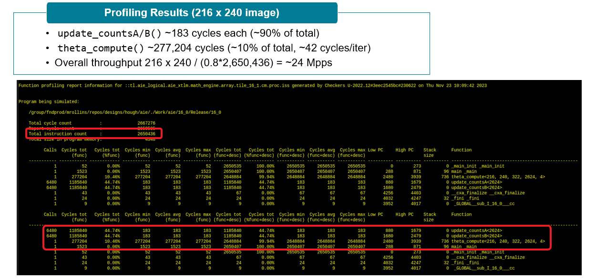

### Iterating to System Feasibility

With an accurate cost model from prototyping, you can explore alternate solutions through scaling. Consider "Image Partitioning" plus "Theta Partitioning" to scale up throughput. In this scheme, partition image portions to 32-tile clusters. Each cluster computes partial histograms for four $\theta$ values (as in the prototype). This approach scales throughput linearly higher. The following diagram shows achieving ~ 220 MP/s with ~275 tiles.

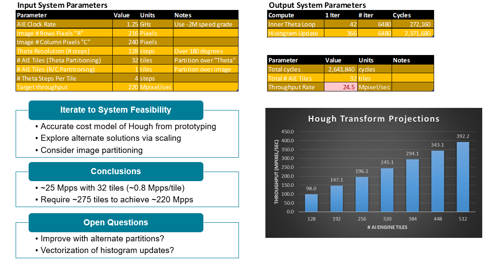

## Conclusions

This tutorial uses the Hough Transform to show system partitioning concepts. It shows how this methodology scopes new AI Engine designs and partitions heterogeneous compute workloads across Versal Adaptive SoC resources. Through requirements gathering, solution synthesis, prototype validation, and iterative refinement, applications can be successfully partitioned. Common analysis tools include spreadsheets and targeted prototyping & profiling.

## References

[1]: [Use of the Hough Transformation to Detect Lines and Curves in Pictures](https://dl.acm.org/doi/10.1145/361237.361242)

## Support

GitHub issues are for tracking requests and bugs. For questions, go to [support.xilinx.com](http://support.xilinx.com/).

<hr class="sphinxhide">

<p class="sphinxhide" align="center"><sub>Copyright © 2024–2026 Advanced Micro Devices, Inc.</sub></p>

<p class="sphinxhide" align="center"><sup><a href="https://www.amd.com/en/corporate/copyright">Terms and Conditions</a></sup></p>
