<!--
Copyright (C) 2024, Advanced Micro Devices, Inc. All rights reserved.
SPDX-License-Identifier: MIT
Author: Mark Rollins
-->
<table class="sphinxhide" width="100%">
 <tr width="100%">
    <td align="center"><h1>AI Engine Development</h1>
    <a href="https://www.xilinx.com/products/design-tools/vitis.html">See Vitis™ Development Environment on xilinx.com</br></a>
    <a href="https://www.xilinx.com/products/design-tools/vitis/vitis-ai.html">See Vitis™ AI Development Environment on xilinx.com</a>
    </td>
 </tr>
</table>

# MUltiple SIgnal Classification (MUSIC) Algorithm on AI Engine

***Version: Vitis 2024.1***

## Table of Contents

1. [Introduction](#introduction)
2. [System Model](#system-model)
3. [Subspace Algorithm](#subspace-algorithm)
4. [MUSIC Spectrum Estimation](#music-spectrum-estimation)
5. [MATLAB Model](#matlab-model)
6. [AI Engine Subgraph Designs](#ai-engine-subgraph-designs)
7. [Top Level Design](#top-level-design)
8. [Building the Design](#building-the-design)
9. [Hardware-in-the-Loop Demo](#hardware-in-the-loop-demo)
10. [Conclusions](#conclusions)

[References](#references)

[Appendix](#appendix)

[Support](#support)

[License](#license)

## Introduction

This tutorial implements the Multiple Signal Classification (MUSIC) Algorithm [1] on the AI Engine. MUSIC is a popular algorithm for Direction of Arrival (DOA) estimation in antenna array systems. This tutorial assumes a system model with an 8-element uniform linear array (ULA). The algorithm chosen for AI Engine implementation operates directly on 128 x 8 data snapshots using a QR-Factorization followed by a Singular Value Decomposition (SVD) to obtain the basis vectors of the noise subspace. The QRD algorithm uses the well known modified Gram-Schmidt approach. The SVD algorithm adopts a one-sided Jacobi rotation approach with a fixed set of four iterations. 

This tutorial implements the MUSIC algorithm fully in the AI Engine and validates its performance in real time hardware running on the VC1902 device (-2M speed grade) on the VCK190 evaluation board. A Hardware-in-the-Loop (HIL) demonstrator connects a host computer running MATLAB over TCP/IP to the VCK190 board that delivers buffered array snapshots to the board and receives DOA estimates back in real time to demonstrate a best effort DOA estimation throughput rate of 1 MHz. The following table summarizes the system parameters for this tutorial.

This MUSIC tutorial was co-developed by AMD and our third party partner, [Fidus Systems](https://fidus.com).

|Parameter|Value|Units|
|---------|-----|-----|
| Uniform Linear Array | $N=8 $| elements |
| Array element spacing | $d=\lambda/2$ | m |
| Data snapshot| 128 x 8 | samples |
| Target throughput | 1 | $\mu s$ |
| Subspace algorithm | QRD + SVD | n/a |
| One-sided Jacobi SVD | 4 | iterations |
| MUSIC spectrum resolution | 256 | bins |
| MUSIC spectrum sweep range | 9 to 248 | bins |
| Minimum DOA separation | 6 | deg |

## System Model

The system model consists of:
* A uniform linear array (ULA) with $N$ equally $d$-spaced antenna elements and,
* A set of $S$ sources emitting or echoing narrow-band independent signals $\textbf{x}_1,\ldots,\textbf{x}_S$.
* The direction of arrival (in azimuth) of these signals at the ULA are $\theta_1,\ldots,\theta_S$.

The signal $\textbf{a}(t)=[a_1(t),\ldots,a_N(t)]$ received by the ULA at time $t$ can be expressed in matrix form as $\textbf{a}=\textbf{D}\times\textbf{x}+\textbf{w}$ where $\mathbf{D}=[d_{\theta_1},\ldots,d_{\theta_S}]^T$ and $\textbf{d}_{\theta_k}$ is the $k$-th steering vector for the ULA. The vector $\textbf{w}$ is uncorrelated white Gaussian noise. The data vectors $\textbf{a}(t)$ may be collected into a $128 \times 8$ snapshot matrix $\textbf{A}$ to collect one sample from each of $8$ elements of the array obtained over $128$ consecutive time instants. The following diagram shows the ULA receiving scenario.

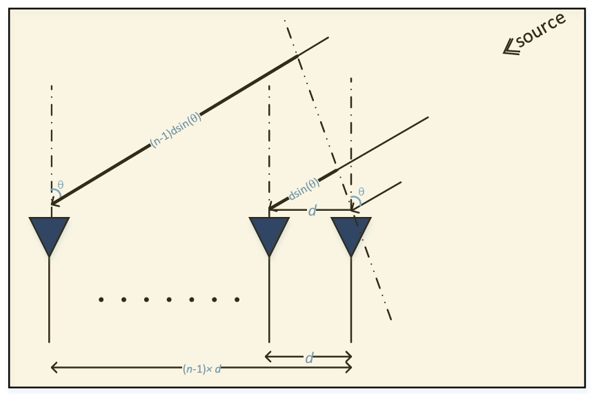

## Subspace Algorithm

MUSIC performs DOA estimation using a subspace approach involving a peak search across the noise subspace of the array. The critical first step requires identification of the basis vectors of this noise subspace. Several approaches are possible. Eigenspace methods are popular. This tutorial adopts an algorithm based on QR-Decomposition and SVD as these algorithms can be implemented efficiently on the AI Engine. Data flow is simplified because this approach operates directly on the snapshot matrix $\textbf{A}$. 

The figure below demonstrates the overall concept. The snapshot matrix $\textbf{A}$ is "tall and skinny" with dimensions $128\times 8$. The basis vectors of the noise subspace $\textbf{V}_r$ may be computed from a two step procedure. First, a QR-Decomposition of the snapshot matrix $\textbf{A}=\textbf{Q}\textbf{R}$ produces the $\textbf{R}$ matrix with upper triangular portion $\textbf{R}_r$. The $\textbf{Q}$ matrix may be discarded. Second, the SVD of $\textbf{R}_r=\textbf{U}_r\textbf{S}_r\textbf{V}_r^\dagger$ provides a basis for the desired noise subsplace by selecting the appropriate columns of $\textbf{V}_r^\dagger$ based on identifying the noise subspace singular values from $\textbf{S}_r$. This subspace identification may be performed simply by extracting the $S$ smallest singular values if $S$ is known, or the # of active signals may be identified online using simple (ie. "thresholding") or more advanced (i,e., "information theoretic") techniques. This tutorial assumes $S$ is known.

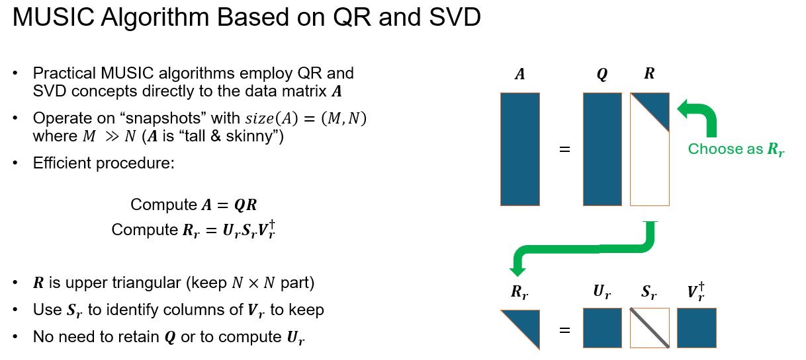

## MUSIC Spectrum Estimation

Once identified, MUSIC uses the columns of the noise subspace $\textbf{V}_r$ to identify incident signal directions orthogonal to that subspace. This involves sweeping the steering vector (as a function of the DOA) against these noise subspace basis vectors to compute the strength of the so-called MUSIC pseudo-spectrum given in the following equation. The index $P$ represents the index of the first noise singular value (assuming they have been sorted in descending order). Also $\textbf{V}_r(j)$ denotes the $j$-th column of $\textbf{V}_r$. Once again, $P$ may be assumed known or estimated using various techniques. The $\times$ operator below represents an inner product. The $\textbf{s}(k)$ represents the steering vector which is a function of the array manifold and the presumed direction of arrival.

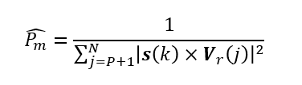

MUSIC may solve the above equation either directly by looking for the peaks of the pseudo-spectrum that occur when the steering vector becomes orthogonal to the noise subspace. This occurs in the preceding equation when its denominator goes to zero. Computing these peaks requires a costly division operator. Instead, the denominator may be inspected instead for its nulls. This generally gives a very similar result but requires no division operator. This tutorial uses the latter approach to reduce the compute workload. 

## MATLAB Model

MATLAB models of MUSIC validate the algorithmic approach taken and provide a means to synthesize I/O data for the AI Engine implementation. The system model may be found in the `<path-to-repo>/matlab/System` folder. The system parameters shown in the code below may be configured in the `Configuration/testCfg.m` file. After editing this file (or going with its default settings), the MUSIC model may be run using the `testMusic.m` script from the `<path-to-repo>/matlab/System` folder.

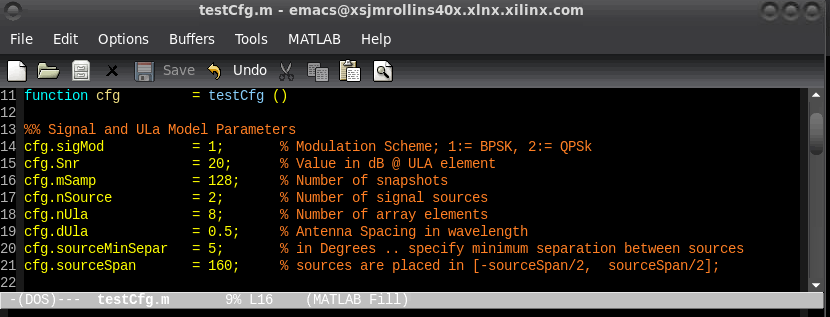

Running the MATLAB model produces the console and figure output shown below. Some statistics are given for the accuracy of the Gram-Schmidt QRD used by the tutorial versus the built-in `qr()` MATLAB function, along with the difference between the MATLAB `svd()` versus the one-sided Jacobi algorithm with four iterations used by the tutorial. The figure plots the peaks of the MUSIC pseudo-spectrum along with the nulls of its corresponding denominator which are identified instead by the approach adopted in the tutorial. In addition to the console and figure output, the MATLAB model generates a detailed dump of the system signals in the top-level `data` folder.

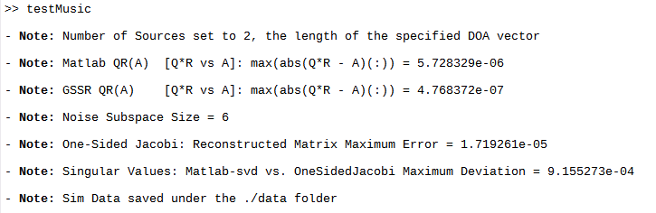

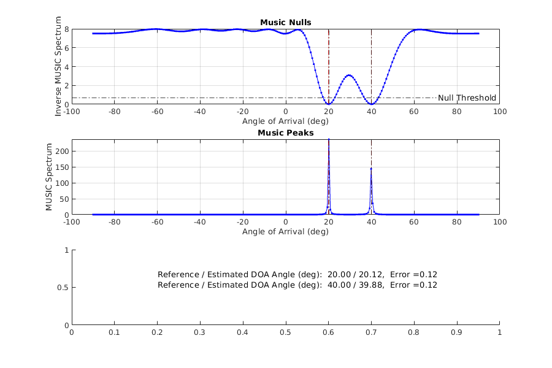

## AI Engine Subgraph Designs

The full MUSIC algorithm on AI Engine is built from a data flow graph containing six different subgraphs: IO Adapter, QRD, SVD, DOA, Scanner, and Finder. This section provides an overview of each one of these subgraphs.

### IO Adapter Subgraph

The IO Adapter subgraph delivers the $\textbf{A}$ matrix from the input PLIO to the QRD subgraph. Buffers are used for I/O for all downstream MUSIC subgraphs. All of these subgraphs may use a single I/O buffer read over a high bandwidth memory interface, moving from tile to tile in a linear fashion. This is clarified in more detail below. No bandwidth limitations are encountered downstream due to this use of the 256-bit AI Engine memory interface. However, the design must be fed by two PLIO streams @ 32-bits for 1250 MHz to achieve a 1 $\mu s$ throughput overall. The IO Adapter subgraph sinks two input PLIO streams and combines them into a single output buffer containing the input $\textbf{A}$ matrix to be processed by the first QRD subgraph. Two streams are required because the $128\times 8$ elements of $\textbf{A}$ cannot be transferred over a single PLIO in 1 $\mu s$. The following block diagram shows the AI Engine physical array view for the IO Adapter subgraph.

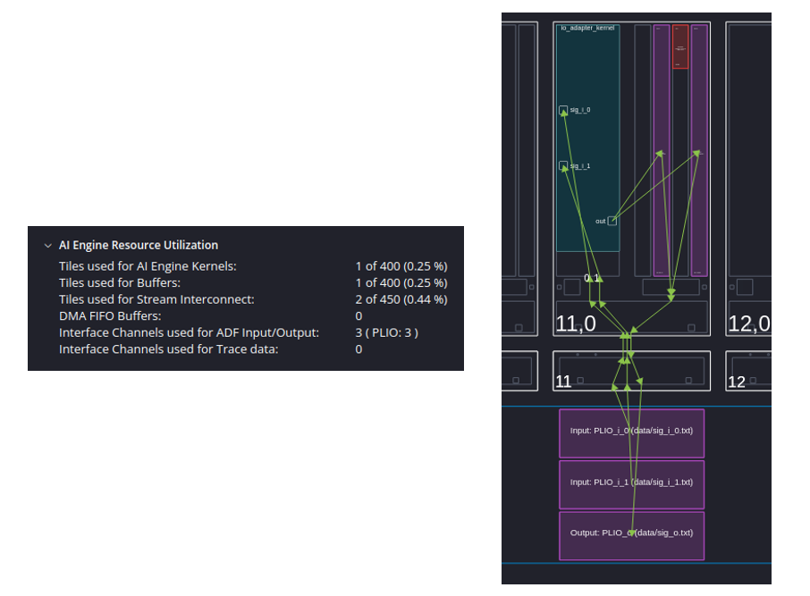

### QRD Subgraph

The following MATLAB code shows the QRD algorithm adopted in this tutorial. It contains an inner loop and an outer loop. Its loop structure has been modified for more efficient AI Engine implementation. The outer loop updates of `R(kk,kk) ` and `Q(:,kk)` have been moved from after to before the inner loop. Also, the inner loop indices now run from `kk+1` to `C` instead of from `1` to `kk-1`. This admits an easier to implement form of software pipelining in which a single AI Engine tile may be assigned to compute a single iteration of each outer loop body. For example, the first tile computes the `R(1,1)` and `Q(:,1)` updates and then performs all inner loop computations corresponding to `kk=1`. This tile will then pass all values of `R` and `Q` to the next tile in the chain. The second tile will accept these inputs but only update `R(2,2)` and `Q(:,2)` and all inner loop computations corresponding to `kk=2`. This approach requires a total of $8$ tiles to process the $128\times 8$ snapshot matrix $\textbf{A}$ for MUSIC.

```
function [Q,R] = qrd_mgssr_hw_model(A)

   [R,C] = size(A);
   Q = single(A);
   R = single(zeros(C,C));
   
   % Here, 'kk' now represents the tile
   % --> Each tile performs its outer loop and then performs the inner loop iterations for all 
   %     columns that follow
   for kk = 1 : C
      R(kk,kk) = norm(Q(:,kk));
      Q(:,kk) = Q(:,kk) * (1.0/R(kk,kk));
      for ii = kk+1 : C
         R(kk,ii) = transpose(conj(Q(:,kk))) * Q(:,ii);
         Q(:,ii) = Q(:,ii) - R(kk,ii) * Q(:,kk);
      end
   end
end
```

It turns out this $8$-tile solution does not provide sufficient compute capacity to achieve the 1 $\mu s$ throughput objective of the tutorial. Additional throughput can be achieved by partitioning each inner loop body to its own tile. Similarly, each outer loop body may be partitioned to its own tile. The algorithm exhibits $C$ outer loop iterations, and $C-k$ inner loop body iterations for each outer loop $k$. It follows the total # of tiles required is $C + C(C-1)/2$. For the $8$ columns here, this equals $8+8\times7/2=36$ tiles.

The following diagram shows the AI Engine floorplan for this $36$-tile solution. Here, no attempt has been made to floorplan the design; the tools elect by default to simply use the second row for buffers. These could be co-located in the first row for many of the tiles; indeed this occurs in the final floorplan shown below. 


The following diagram shows additional details of the AI Engine QRD $norm()$ kernel code. The code is partitioned into three separate workloads:

* The "Initialization" code accepts the $R$ and $Q$ inputs from the previous tile and initializes $R$ to zero for the first tile.
* The "QRD Norm" code computes the $norm()$ required by the QRD outer loop body, updates the appropriate $Q$ column.
* The "Output" code delivers the updated $R$ and $Q$ values to the following tile. The $Q$ is not returned by the last tile.

Note that kernels with indices $0,8,15,21,26,30,33,35$ perform the outer loop $norm()$ operations whereas the remaining tiles compute the inner loop bodies. Only the upper triangular portion of the $R$ matrix is updated as it is passed through the AI Engine pipeline. 

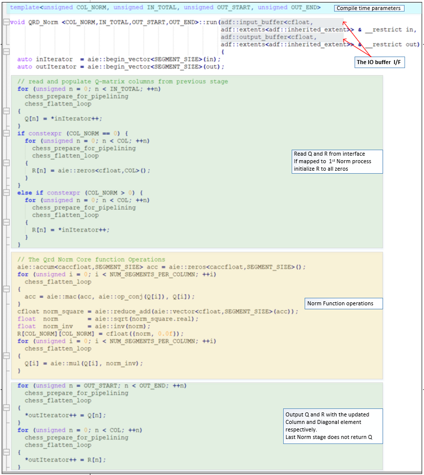

The following diagram shows additional details of the AI Engine QRD $qr()$ kernel code. The code is partitioned into three separate workloads:

* The "Initialization" code accepts the $R$ and $Q$ inputs from the previous tile.
* The "QR" code computes the dot product between columns `Q(i)` and `Q(m)` and then updates `Q(i)` based on the result.
* The "Output" code delivers the updated $R$ and $Q$ values to the following tile.


### SVD Subgraph

The following MATLAB code shows the SVD algorithm adopted in this tutorial. It contains three nested loops. The outer-most loop performs identical "iterations". This tutorial performs a fixed set of $N_I=4$ iterations per SVD. The inner two loops admit a structure similar to the QRD analyzed above except all compute workloads are contained in the inner most loop only; there is no workload in the outer of these two loops. The inner loop workload involves computing a $2\times2$ Jacobi rotation matrix `Rot` and then applying that matrix to both `V` and `W`. 

```
function [U,S,V] = svd_one_sided_jacobi( A, max_iter )
   if     (nargin == 1)  max_iter = 4;
   elseif (nargin ~= 2) error('Incorrect signature'); 
   end
   
   % Perform one-sided Jacobi for MUSIC application (no need to compute 'U' in principle):
   [m,n] = size(A);
   V = single(eye(n));
   W = single(A);

   for iter = 1 : max_iter
      for p = 1 : n-1
        for q = p+1 : n
           Rot = compute_rotation( W(:,p), W(:,q) );
           V(:,[p,q]) = V(:,[p,q]) * Rot;
           W(:,[p,q]) = W(:,[p,q]) * Rot;
        end
      end
   end
   
   % Compute singular values and 'U':
   U = single(zeros(m,n));
   S = single(zeros(n,n));
   for ii = 1 : n
     S(ii,ii) = sqrt(W(:,ii)'*W(:,ii));
     U(:,ii) = W(:,ii)/S(ii,ii);
   end
end
```

For completeness, the following MATLAB code defines the compute workload for the one-sided Jacobi rotation. This is defined to render the two vectors `Xv` and `Yv` orthogonal. This workload contains some vectorizable dot product operations along with some $sqrt()$, $inv()$, and squaring operations. These may be mapped to the AI Engine vector data path or can leverage the non-linear hardware accelerator on the scalar data path. 

```
function [res] = calc_ei_2t(x,y)
   R = sqrt(x^2+y^2);
   res = complex(x/R,y/R);
end

function [res] = calc_ei_t(sin_2t,cos_2t)
   R = sqrt((1+cos_2t)^2 + sin_2t^2);
   res = complex((1+cos_2t)/R, sin_2t/R);
end

function [Rot] = calc_rot( eit, c, s )
   Rot = [      eit *complex(0,s),       eit*complex(c,0);
           conj(eit)*complex(-c,0), conj(eit)*complex(0,-s) ];
end

function [Rot] = compute_rotation( Xv, Yv )
   Hpp = real(transpose(Xv)*conj(Xv));
   Hqq = real(transpose(Yv)*conj(Yv));
   tmp = transpose(Xv)*conj(Yv);
   Hrr = real(tmp);
   Hjj = imag(tmp);
   
   ei_2t1 = calc_ei_2t(Hjj,Hrr);
   ei_t1  = calc_ei_t(imag(ei_2t1),real(ei_2t1));
   
   tx = 0.5*(Hqq-Hpp);
   ty = Hrr * imag(ei_2t1) + Hjj * real(ei_2t1);
   
   ei_2t2 = calc_ei_2t(tx,ty);
   ei_t2  = calc_ei_t(imag(ei_2t2), real(ei_2t2));
   
   Rot = calc_rot( ei_t1, real(ei_t2), imag(ei_t2) );
end
```

The SVD may be parallelized across multiple AI Engine tiles in a manner very similar to the QRD. The most aggressive scheme assigns a single AI Engine tile to each inner-most loop body; in essence the system of three nested loops is flattened fully. It turns out this scheme is overkill for the throughput target of 1 $\mu s$. Instead, it is possible to partition three inner loop body workloads to each AI Engine tile and still meet the requirement. This saves considerable resources; only $38$ tiles are required in total for the SVD.

The screenshot below shows the kernel object creation in the `adf::graph` of the SVD graph implementation in `svd_graph.h`. The code comments indicate which indices $(p,q)$ are assigned to each tile. Each tile is assigned three inner loop workloads. The last tile is only assigned two inner loop workloads, but it also performs the final workload to compute the singular values required by the MUSIC algorithm for identifying the noise subspace basis vectors. 

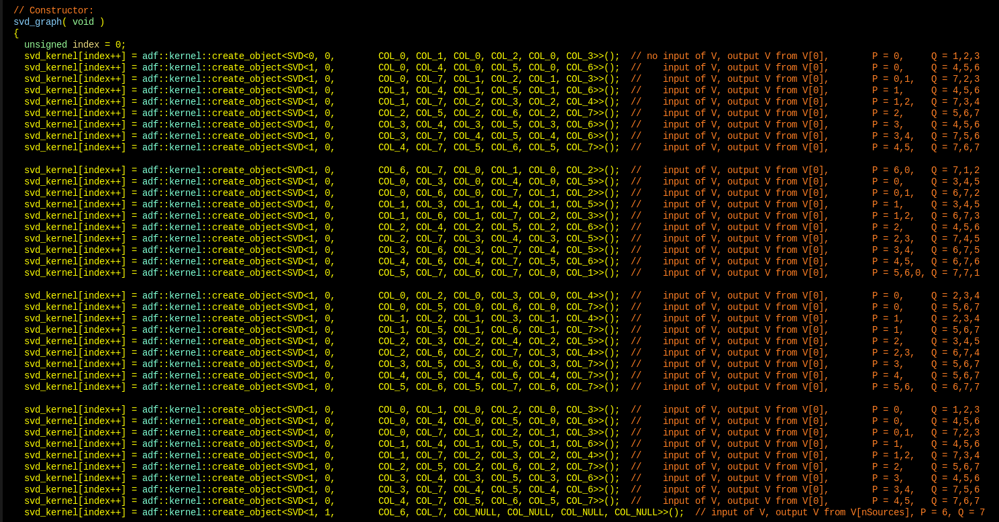

The following diagram shows the AI Engine physical array view for the SVD subgraph. Once again, the data flow graph has a linear structure similar to the QRD graph, although less memory resources are required because the $\textbf{U}$, $\textbf{S}$, and $\textbf{V}$ matrices are all $8\times 8$ in this case. 

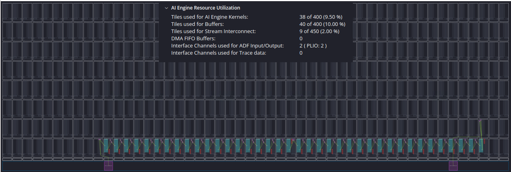

### DOA Subgraph

The DOA subgraph estimates the MUSIC Spectrum $\hat{\textbf{P}}_m$ defined earlier at $256$ equally spaced bins. In order to achieve the target throughput of 1 $\mu s$, this workload is partitioned across a number of tiles where each tile computes the spectrum for $L$ consecutive points. This is shown in the diagram below. A value of $L=4$ is required to meet the throughput; this is equivalent to $64$ AI Engine tiles. 

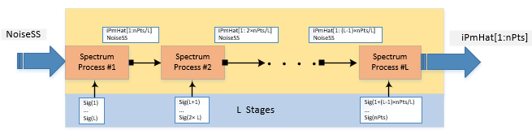

The following diagram shows the AI Engine physical array view for the DOA subgraph. The data flow graph is linear with $64$ total tiles to support evaluation of the MUSIC spectrum over $256$ equally spaced points. The incidence signals used for the MUSIC workloads are pre-computed at compile time based on the array steering vector and stored in lookup tables. Data flow proceeds from tile to tile, each one passing the noise subspace basis vectors and number of sources to the next tile in the graph. Each tile computes $L=4$ spectrum bins and passes them down the pipeline. Bins are passed with `cfloat` data type with the imaginary part set to zero.

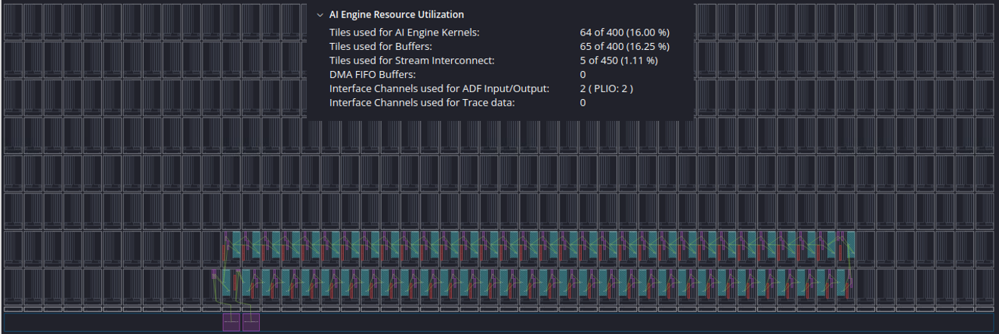

### Scanner Subgraph

The Scanner subgraph performs a coarse-grained search of the MUSIC spectrum computed by the DOA subgraph, looking for regions of the spectrum that fall below a "null threshold". The Scanner breaks apart the $256$ spectrum bins into $32$ contiguous groups of $8$ bins each, and produces $32$ output tags that are set to true if there exists a bin value in that group which falls below the given null threshold. To meet the 1 $\mu s$ throughput target, two AI Engine tiles are required, where each tile processes $128$ of the $256$ available bins. This algorithmic approach is outlined in the following diagram.

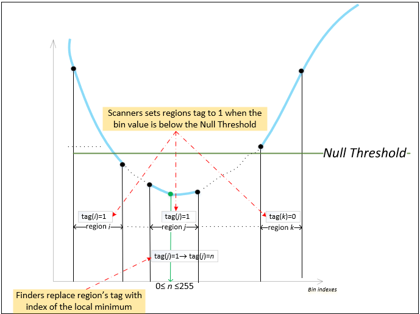

The following diagram shows the AI Engine physical array view for the Scanner subgraph. As noted above, the design requires $2$ tiles and some additional storage for I/O buffers. 

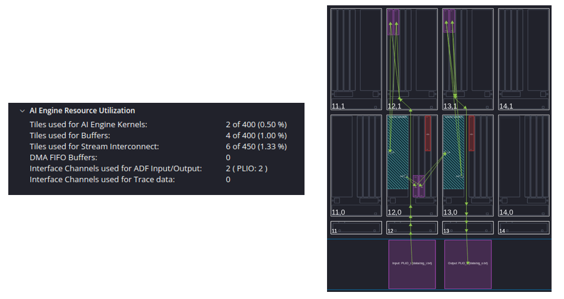

### Finder Subgraph

The Finder subgraph performs a fine-grained search of the MUSIC spectrum regions tagged by the Scanner subgraph to identify a negative-to-positive gradient change in the spectrum as highlighted in the diagram above. When a gradient change is found, the tag is set to the index of the bin corresponding to the local minimum. To meet the 1 $\mu s$ throughput target, this search is partitioned over a $16$ tile pipeline where each tile performs the fine-grained search on two of the 8-bin regions. The diagram below shows the AI Engine physical array view for the Finder subgraph. 

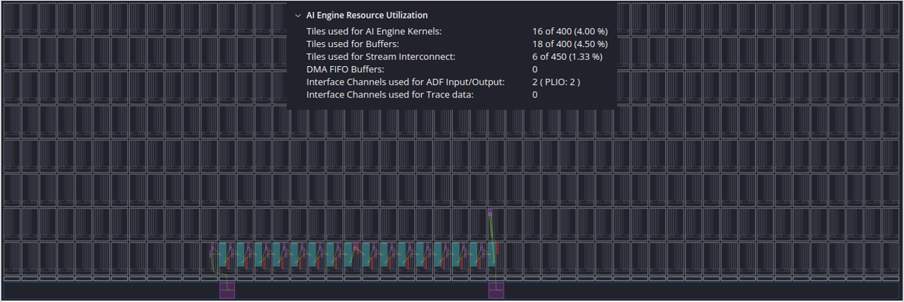

## Top-Level Design

This section provides an overview of the top-level VC1902 design of the MUSIC algorithm. The following diagram shows screenshots of the top-level Versal block design (BD) in IP integrator including the CIPS, NOC, DDR Interface, and AI Engine hard IPs on the left side. The Vitis Region is shown on the right side and includes three HLS kernels. Two `mm2s()` kernels provide data movers to pass snapshot matrices $\textbf{A}$ from DDR to the AI Engine over two PLIO streams. A single `s2mm()` kernel provides a data mover to pass the resultant MUSIC output tags back to DDR. The Vitis linker `v++` has inserted clock domain crossing and data width converter IPs to match the rates from these three HLS blocks running with 128-bit I/O @ $312.5$ MHz to the 64-bit I/O @ $625$ MHz used by the PLIO interface to the AI Engine.

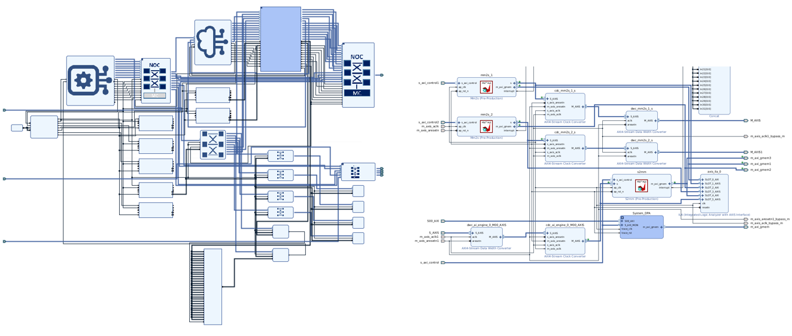

The following diagram shows the final AI Engine physical array floorplan for the MUSIC design. Some minimal floorplanning has been done to steer the kernel locations by the tools. Additional floorplanning could be done to tighten up the local tile memory placements. The tiles associated with each MUSIC subgraph have been color coded for ease of identification. The design consists of six different subgraphs: IO Adapter $(1)$, QRD $(36)$, SVD $(38)$, DOA $(64)$, Scanner $(2)$, Finder $(16)$. The full design requires a total of $157$ compute tiles. The "snake-like" data flow is identified by arrows in the diagram. Alternative placements are possible.

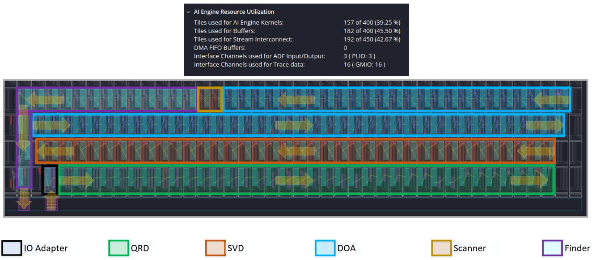

The following diagram shows the final PL floorplan of the VC1902 device. Most of these highlighted resources involve circuitry required to support the base platform of the VCK190 evaluation board and are not related to the MUSIC algorithm itself. 

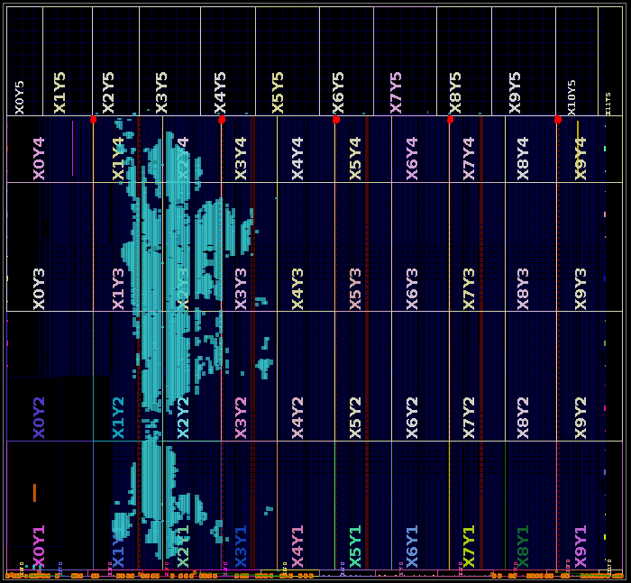

The following diagram captures the device level resource utilization of the VC1902 device. The design is using a very small portion of the available PL resources. 

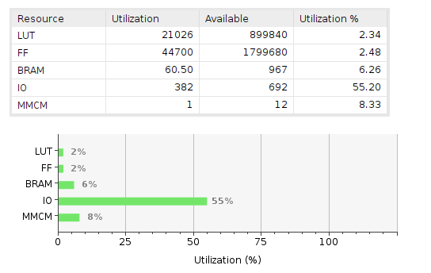

Timing closure of the top-level device is achieved automatically with the standard Vitis `v++` link and package flow. This is not surprising because there are only three data movers required to support the MUSIC implementation that is fully contained within the AI Engine array and no timing closure is required for this hardened portion of the design.

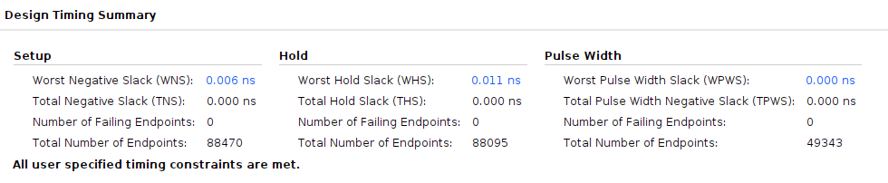

## Building the Design

### Setup and Initialization

IMPORTANT: Before beginning the tutorial ensure you have installed Vitis™ 2024.1 software. Ensure you have downloaded the Common Images and the Embedded Vitis Platforms from this link.

https://www.xilinx.com/support/download/index.html/content/xilinx/en/downloadNav/embedded-platforms/2024-1.html

Set the environment variable `COMMON_IMAGE_VERSAL` to the full path where you have downloaded the Common Images. Set the environment variable `PLATFORM_REPO_PATHS` to the full path where you have downloaded the embedded base platforms. The remaining environment variables are configured in the top-level Makefile `<path-to-repo>/Makefile`.

### Hardware Emulation

This tutorial is not set up to run hardware emulation as it contains a full "Hardware-in-the-Loop" demonstrator outlined below. It is only necessary to build the top-level design for hardware in order to generate an SD card to run on the VCK190 evaluation board. 

### Hardware

The design can be built for the VCK190 evaluation board using the `Makefile` as follows:

```
[shell]% cd <path-to-repo>/
[shell]% make all TARGET=hw
```

The build process will generate the SD card image in the `<path-to-repo>/package/sd_card` folder. 

## Hardware-in-the-Loop Demo

This section provides an overview of the HIL demo system including how MATLAB is used to drive the system. Details on how to setup the VCK190 evaluation board and the ethernet connection between the host computer and the VCK190 board are given in the [Appendix](#appendix).

### Architecture

The following diagram shows the architecture of the HIL system. It consists of a host computer connected to the VCK190 evaluation board. The HIL starts and terminates on the host computer. 

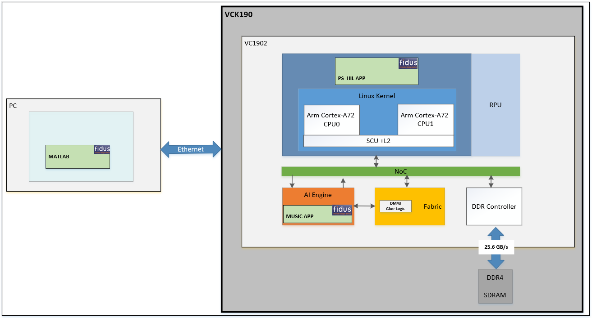

### System Operation

The HIL system performs the following operational steps:

1. A system MATLAB model running on the host computer generates a set of synthetic snapshots from a simulation model where $S$ targets are configured to move at constant velocities while emitting an EM signal resulting in incident signals towards the ULA with given angles with respect to the boresight direction.
2. The host computer runs the MUSIC model on the generated snapshots and generates reference results for the detected DOAs. These are compared to values produced by the AI Engine implementation. Steps 1 and 2 can be performed once again after Step 5.
3. The VC1902 PS application initializes the hardware data path including memory buffers, PL data movers, and AI Engine configuration.
4. The VC1902 PS application starts a TCP server to accept incoming TCP connection requests on a port specified via a command line parameter.
5. The host computer starts a TCP client on the port number on which the TCP server accepts incoming TCP/IP packets.
6. The TCP client on the host computer sends the configured number of snapshots in a single batch carried in TCP/IP packets. Each snapshot in the batch is encapsulated in a frame that includes a header that provides start of frame, a sequence number, snapshot type as well as several other system and MUSIC configuration parameters as shown in the [Appendix](#appendix).
7. PS client data extracts the payload from incoming TCP/IP packets and collects data in the memory buffers in DDR4 before initiating the hardware pipeline.
8. Upon the collection of the last (or a unique) snapshot from TCP client, the fabric `mm2s()` DMA starts transferring the snapshots to the AI engine as a single DMA operation.
9. The AI Engine receives data from two 64-bit PLIO inputs running @ 625 MHz, performs MUSIC processing steps through one or more AI Engine graph iterations, depending on the number of snapshots.
10. The AI Engine outputs the spectral bins and DOA vector transferred by the `s2mm()` PL DMA into the memory buffer located in DDR4 of the VCK190 board.
11. The PS application waits for all hardware pipeline stages to complete their operations and transfers the expected amounts of data to/from memory.
12. The TCP server sends the output produced by the AI Engine back to the TCP client. Each snapshot output including its spectrum bins and DOA vector is encapsulated into a frame with a proper header.
13. The host computer receives the spectrum and DOA vector computed by the AI Engine and plots the results of both the expected and reference data.
14. The TCP/IP server remains in listening mode for a fixed amount of time, while the client is performing data visualization.
15. Go to Step 12 if no new data is received from the TCP/IP client during the wait time window. Go to Step 6 if the TCP/IP client sends a new input batch.

### Performance Estimation

The AI Engine performance is estimated on each batch processing run by reading the AI Engine profiling counter. This counter value $C$ at the end of a batch run equals the number of cycles for MUSIC to process an entire batch of $K$ snapshots. The average sweep time is then given as $T=(C-B/8)/(K-1)$ where $B$ is the number of bytes produced by the AI Engine for each snapshot (i.e., 256 `cfloat` bins + 32 `cfloat` tags = 2304B). Examples of some demo waveforms are given in the following table.

|Test Case|Average Sweep Time (ns) |Note|
|---------|-----|-----|
| Demo 3 (64 snapshots) | 993 | 0 sources |
| Demo 4 (40 snapshots) | 972 | 1 source |
| Demo 5 (40 snapshots) | 969 | 2 sources |
| Demo 6 (40 shapshots) | 960 | 3 sources |

### Software Version

The HIL system uses MATLAB version R2023a Update 4.

### MATLAB Folder Structure

The MATLAB folder tree includes both the `HIL` folder and the `SYSTEM` folder. The latter is not used for the HIL system and contains golden system and MUSIC models. A copy of the MUSIC models is located in the `HIL` folder and is used by the HIL system. So the `HIL` folder is fully self-contained.

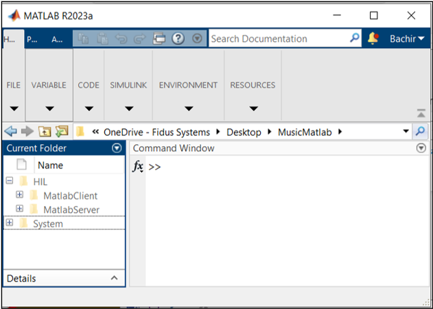

### Steps to Generate and Run HIL Demo Data

Step #1: Start MATLAB and change directory to the `MatlabClient` folder and open the `Configuration/systemConfig.m` file.

Step #2: Configure or update the highlighted system parameters in `Configuration/systemConfig.m` according to your required system preferences and save the file.

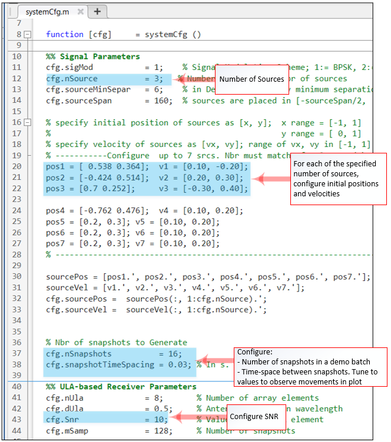

The following diagram is helpful to understand the signal geometry to be configured by the system preferences. The system implements a ULA. Source locations are identified by $(x,y)$ Cartesian coordinates and move with a velocity in that plane with respect to the boresight of the ULA. 

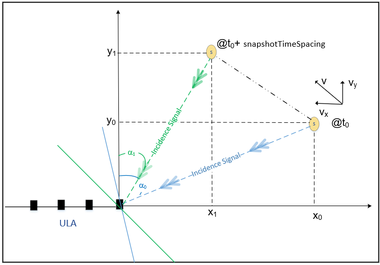

Step #3: Configure or update the highlighted MUSIC parameters in `Configuration/musicConfig.m` according to your designed algorithm preferences and save the file.

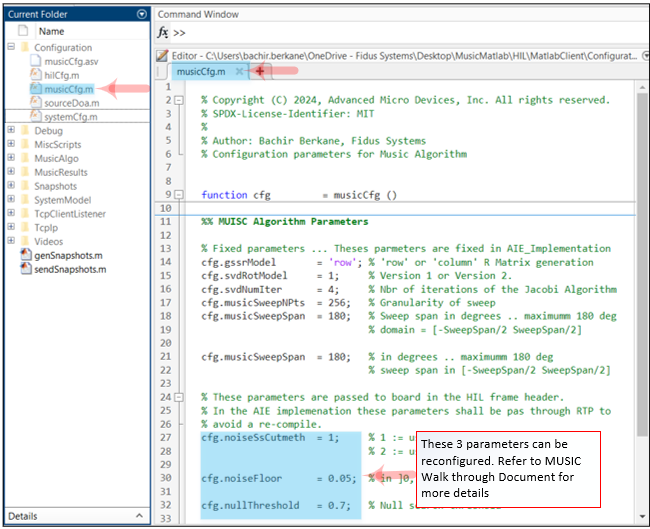

Step #4: Run the `genSnapshots.m` script. Snapshots will be generated and stored in the `Snapshots` folder. This script applies MUSIC on the batch snapshots and saves the data under the `MusicResults` folder.

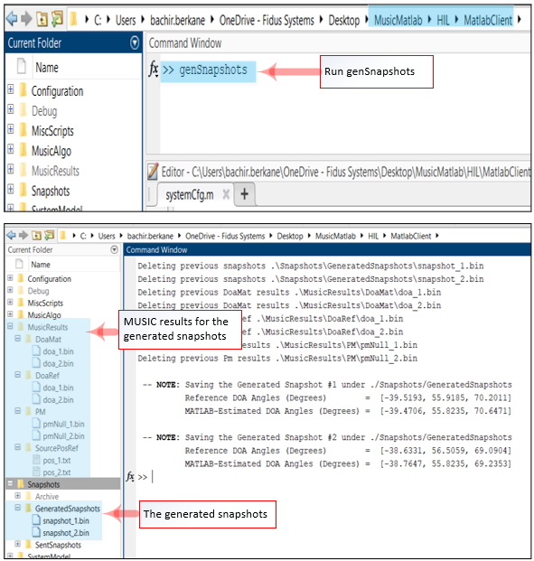

Step #5: It is possible that some of the generated snapshots fall outside the coverage zone. In these cases, tune the parameters to ensure all snapshots fall within the coverage zone.

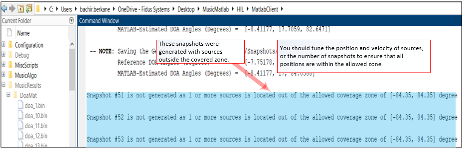

Step #6: Configure or update the highlighted parameters in `Configuration/hilCfg.m` and save the file.

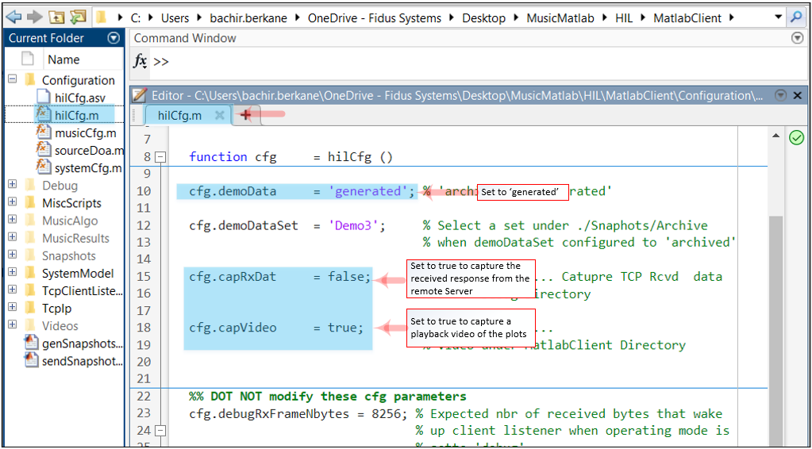

Step #7: Configure or update the IP address and port number in `TcpIp/getIpAddr.m` and save the file. 

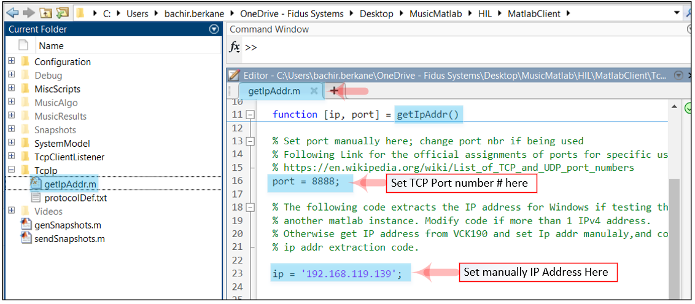

Step #8: Run the `sendSnapshots.m` script. The generated snapshots will be sent to the remote server. The client enters listening mode and waits for a response from the server. Once the response is received, MATLAB models launch visualization as shown below.


The TCP/IP server remains in listening mode for a fixed amount of time, while the client is performing data visualization. If no new data is received from the TCP/IP client during the wait time window, the server sends the previous responses again, and MATLAB performs data visualization. To send new data, send the `clear client` command as shown in the following figure and go to Step #2.

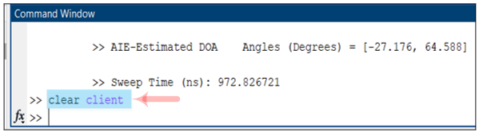

### Archiving Demo Data

To archive a batch of snapshots, use the following steps.

Step #1: Generate a batch of data as outlined in the preceding section.

Step #2: Run the script `createDemoDir('dir-name')` to archive the generated batch and reference data under the folder `dir-name`.

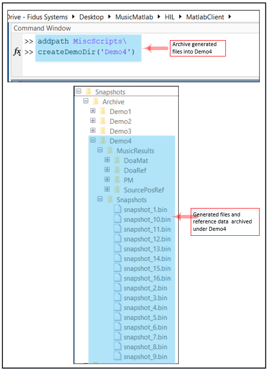

Any archived snapshot data may be run through the HIL system by continuing with the following steps.

Step #3: Configure or update the highlighted parameters in the `Configuration/hilCfg.m` and save the file. This time set `cfg.demoData` to `'archived'` and then set `cfg.demoDataSet` to the name of the archived data set. 

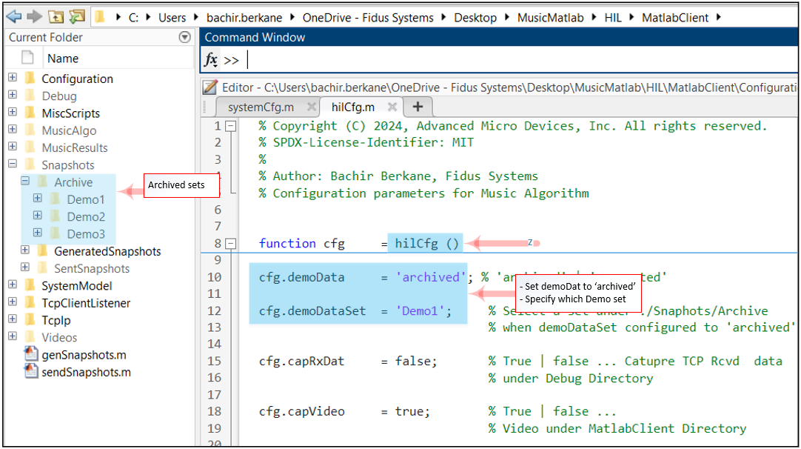

Step #4: Configure or update the IP address and port number in `TcpIp/getIpAddr.m` and save the file. This might have already been properly set.

Step #5: Ensure the parameter `cfg.nSource` in `Configuration/systemCfg.m` file is set to the number of sources to match the archived data. Run the `sendSnapshots.m` script. The archived shapshots will be sent to the remote server. The client will enter its listening mode and wait for a response from the server. Once the response is received, MATLAB models will launch visualization as outlined earlier. Once again, the TCP/IP server will remain in listening mode for a fixed amount of time while the client is performing data visualization. If no new data is received from the TCP/IP client during the wait time window, the server will resend the previous responses, and MATLAB will continue with data visualization. To send new data, send the `clear client` command once again, as outlined earlier. 

### Playback Videos

Playback videos are available under the `Video` folder after the visualization goes through the entire responses of a batch.

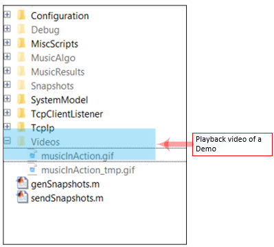

### Client and Server on MATLAB

Use the following steps to run the HIL on two instances of MATLAB. Here you are not running MUSIC on the VCK190 evaluation board, but instead are using a second MATLAB instance to emulate the board. 

Step #1: Start two instances of MATLAB. Set the root directory for the two instances to `HIL/MatlabClient` and `HIL/MatlabServer` respectively.

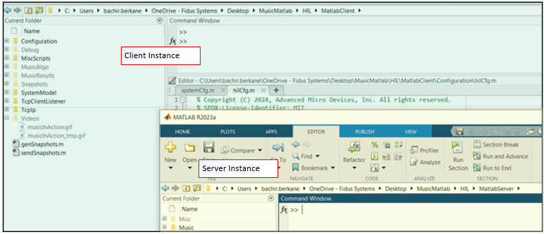

Step #2: Get the local IP address using `ipconfig` on Windows (or with similar procedures if using Linux) and configure using the MATLAB script `TcpIp/getIpAddr.m` as outlined earlier.

Step #3: Create a TCP server on the MATLAB server instance as shown below.

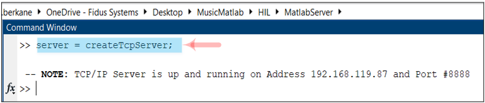

Step #4: On the client MATLAB instance, send the generated or archived batch using the `sendSnapshots.m` script as outlined earlier. The client will enter its listening mode.

Step #5: On the server instance run the script `emulateMUSIConVCK190.m` to emulate the VCK190 workload. The server instance will run MUSIC on the received batch and send back the results.

Step #6: The client instance plots the received responses.

## Conclusions

This tutorial has presented a high-performance AI Engine implementation of the popular MUSIC algorithm for estimating DOA using an antenna array. The MUSIC algorithm employed here adopts a QRD/SVD approach for subspace estimation that is well matched to the AI Engine compute capacity. Software pipelining techniques are employed to create a massively parallel data flow graph across $157$ AI Engine compute tiles to implement a high-performance implementation capable of processing $128\times 8$ data snaphots at a sustained throughput rate of 1 $\mu s$ per snapshot. The full MUSIC algorithm including noise subspace basis identification, MUSIC spectrum evaluation, and null detection is implemented fully in the AI Engine array with no supporting logic from PL required. A comprehensive Hardware-in-the-Loop demonstrator system is built using an external host running Matlab to communicate to the VCK190 evaluation board over Ethernet. 

## References

[1]: [MUSIC Algorithm](https://en.wikipedia.org/wiki/MUSIC_(algorithm))

[2]: [QR Decomposition](https://en.wikipedia.org/wiki/QR_decomposition)

[3]: [Singular Value Decomposition](https://en.wikipedia.org/wiki/Singular_value_decomposition)

[4]: [One-sided Jacobi Algorithm](https://en.wikipedia.org/wiki/Singular_value_decomposition#One-sided_Jacobi_algorithm)

## Appendix

### Deploying the SD Card Image

Follow the steps below to deploy the SD card image to the VCK190 board:

1. Install the following tools (for Windows):
    - SD Card formatter: (https://www.sdcard.org/downloads/formatter/sd-memory-card-formatter-for-windows-download)
    - Win32 Disk Imager: (https://win32diskimager.org)
    - Putty serial terminal: (https://www.putty.org)
2. Obtain the latest SD card image from the build process outlined above.

Refer to the image below for the following steps:

3. Connect the board power cord (connector 31).
4. Power down the board (switch 30) and eject the microSD card from slot 10.
5. Insert the micro SD card into your computer.
6. Dismiss any Windows Explorer pop-up prompts regarding formatting the card.
7. Run the SD card formatter tool, select the card disk letter from a drop-down list and perform a quick format (if the card shows up as several logical disks -- select the first disk letter).
8. Run the Win32DiskImager tool and specify:
   - Image file: path to the SD card image
   - Device: the formatted card disk letter
   - Click write button and wait for the process to complete
9. Eject the card from your computer and insert it into slot 10 on the VCK190 board.

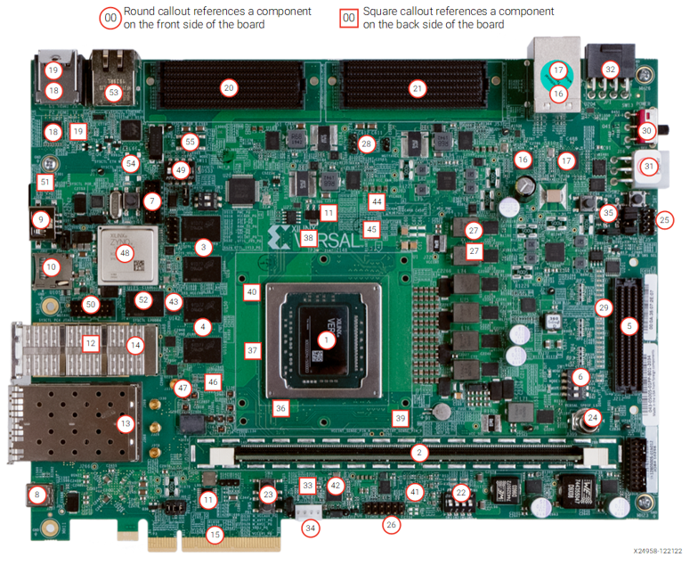

### Booting the VCK190 Board

Connect the VCK190 board serial console to your computer (USBC port 8):

1. Install the FTDI VCP drivers if prompted (https://ftdichip.com/drivers/vcp-drivers).
2. In Windows Device Manager, expand the section "Ports (COM & LPT) and observe three new USB serial ports that belong to the VCK190 board.
3. Note the number of the very first COM port, for example `COM10`.
4. Run PuTTY and open the noted serial port with speed set to 115200.


5. Set the board DIP switch 6 as shown below.

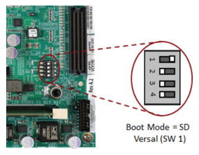

6. Set the board DIP switch 49 as shown below.

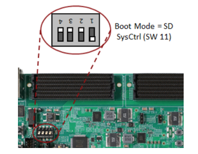

7. Power up the board using switch 30 and observe the Linux boot prompt on the serial console.

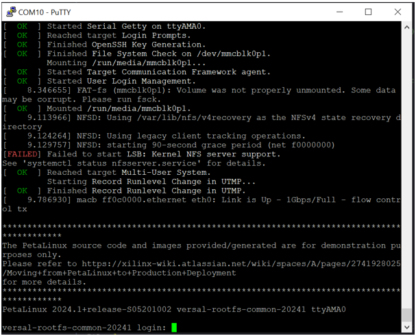

8. Log in as `petalinux`.

9. For the first time you will be prompted to set a new password, follow the prompts.

### Simple Ethernet Configuration 

Follow the steps below when the VCK190 board and MATLAB host computer are connected to the same local network:

1. Log in as root user on the VCK190 using `sudo su`.
2. Connect the board to network via ethernet port 17 (the top one) and find the IP address it obtains over DHCP on the first ethernet port via `ifconfig eth0` (for example the obtained address may be 192.168.1.10).
3. If DHCP is not available on your network, assign the board IP address manually. Make sure the IP address belongs to a valid subnet (for example `ifconfig eth0 192.168.1.10`).
4. Note the board IP address and use it when connecting from MATLAB.

### Using a VPN

For remote testing through a corporate VPN connection, configure your network to expose the VCK190 board to the VPN and forward the inbound MATLAB TCP connections to its IP address. Refer to the following example:

* Assuming two remote laptops are connected to the same VPN network, one is running MATLAB (1) and another is locally connected to the VCK190 board (2).
* No additional configuration is needed for laptop 1 because it already can establish outgoing connections to IP addresses within the VPN network.
  - You can also use onboard Ethernet port if is not occupied and the original VPN connection is established through WiFi.
* Assuming a Windows 10 system, share the VPN connection with the spare Ethernet on laptop 2.
  - Open Control Panel, Network and Internet, Network and Sharing Center, and on the left side click `Change Adapter Settings`.
  - Locate the virtual network adapter representing your VPN connection.
  - Locate the spare Ethernet adapter and note its name.
  - Check `Allow other network users to connect through this computer's Internet connection` and select the spare Ethernet network adapter name from the drop-down menu.
  - Apply the changes.

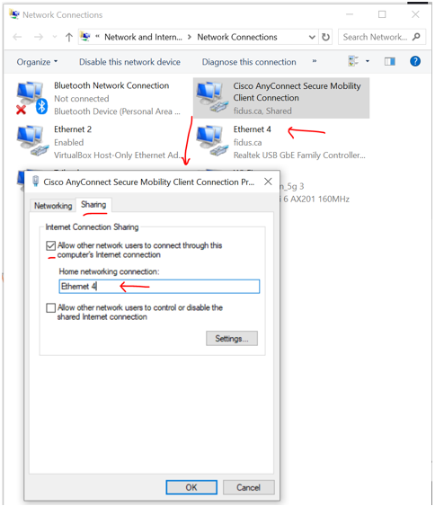

* Connect VCK190 board Ethernet port 17 (the top one) directly to the laptop 2 spare Ethernet port.
* The board will obtain an IP address automatically through DHCP. On the board console, find out its IP address.
   - ifconfig eth0
   - For example, the address is 192.168.137.79
   - NOTE: subnet 137 is automatically assigned by Windows
•	Again open the VPN network adapter Properties, Sharing tab.
•	Click the Settings… button and add a port forwarding rule such that the incoming TCP connections to a certain port are forwarded to the VCK190 board. Port 8888 is selected as an example; it must be the same port number the VCK190 host application is listening to.

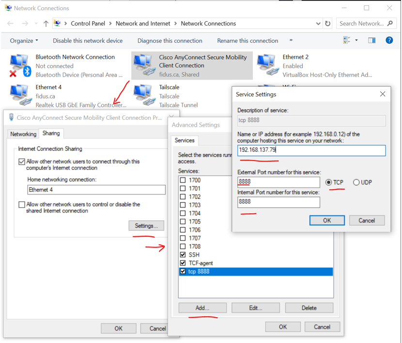

*	Apply the changes. At this point, any TCP connection originated from the VPN network to specified port will be forwarded to the board.
*	Note the IP address you will need for establishing the TCP connection. In this case, it is not the board IP address, but the VPN adapter IP address.
   - Right-click the VPN network adapter, select Status, click Details…
   - Note the IPv4 address, which will belong to your VPN subnet.
   - Use this IP address when connecting from MATLAB.

### Running the PS Application

Follow the below steps to test the Fidus MUSIC algorithm with MATLAB:

*	Run the host application on VCK190 board:
  - `sudo su`
  - `cd /run/media/mmcblk0p1/`
  - `./host_app -c binary_container_1.xclbin -p 8888`
     * -c specifies the platform configuration binary
     * -p specifies the TCP port the application is going to listen to
*	The application will load the platform configuration and start a TCP server on the given port:

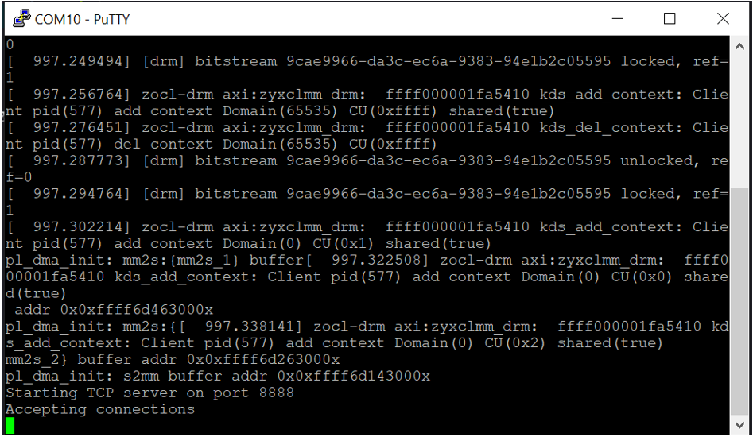

### Testing with MATLAB

* Connect MATLAB to the board by specifying `<target ip address>:<tcp port>` as described in the network configuration section, and send the input data.
* The application receives N input snapshots from MATLAB via the TCP protocol, extracts the payload data, initializes the input and output DMA memory buffers, and executes one or more iterations of the Fidus MUSIC algorithm implementation on the AIE engine.
* The output data from N snapshots is collected in the memory and then sent back to MATLAB via the TCP connection, one batch at a time, with a fixed delay between the batches.
* Observe the MATLAB visualization and the application console output.

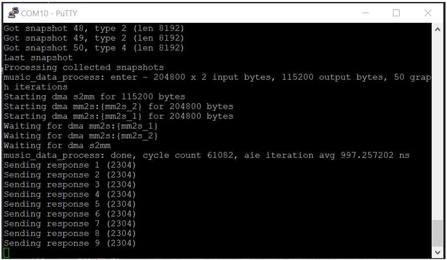

* The application also reports the average AIE execution time measured over the series of input snapshots (997.257202 ns in the above screenshot). This value is also sent back to MATLAB and presented on the visualization.
* Without disconnecting the MATLAB TCP client, send another batch of input snapshots to execute the algorithm again.
* Terminate the MATLAB TCP client and the application on the board will exit automatically.
   - NOTE: if the application is terminated abruptly amid ongoing TCP exchange, the next time it starts, it may fail to bind its listening socket to the network   interface. In this case, terminate the MATLAB client connection, and allow 1-2 minutes timeout before restarting the application to clean up the stale connection.
* Restart the application on the board and connect MATLAB client again to perform another algorithm run.

## Support

GitHub issues will be used for tracking requests and bugs. For questions, go to [support.xilinx.com](http://support.xilinx.com/).

## License

Components: xilinx-images

images in the documentation

Components: xilinx-files

The MIT License (MIT)

Copyright (c) 2024 Advanced Micro Devices, Inc.

Permission is hereby granted, free of charge, to any person obtaining a copy
of this software and associated documentation files (the "Software"), to deal
in the Software without restriction, including without limitation the rights
to use, copy, modify, merge, publish, distribute, sublicense, and/or sell
copies of the Software, and to permit persons to whom the Software is
furnished to do so, subject to the following conditions:

The above copyright notice and this permission notice shall be included in all
copies or substantial portions of the Software.

THE SOFTWARE IS PROVIDED "AS IS", WITHOUT WARRANTY OF ANY KIND, EXPRESS OR
IMPLIED, INCLUDING BUT NOT LIMITED TO THE WARRANTIES OF MERCHANTABILITY,
FITNESS FOR A PARTICULAR PURPOSE AND NONINFRINGEMENT. IN NO EVENT SHALL THE
AUTHORS OR COPYRIGHT HOLDERS BE LIABLE FOR ANY CLAIM, DAMAGES OR OTHER
LIABILITY, WHETHER IN AN ACTION OF CONTRACT, TORT OR OTHERWISE, ARISING FROM,
OUT OF OR IN CONNECTION WITH THE SOFTWARE OR THE USE OR OTHER DEALINGS IN THE
SOFTWARE.

<p class="sphinxhide" align="center">  &copy; Copyright 2024 Advanced Micro Devices, Inc.</p>


