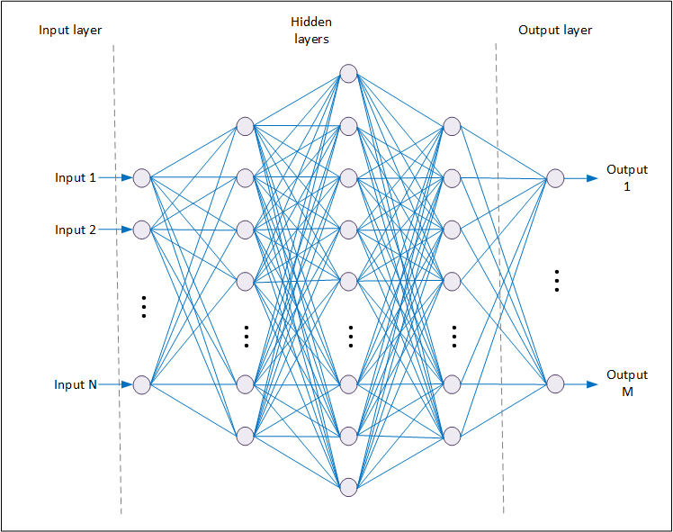
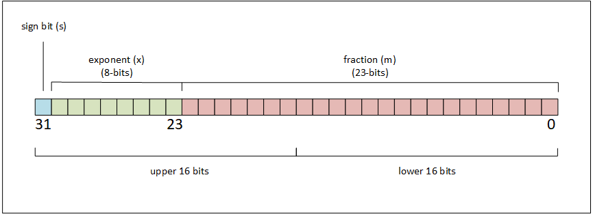
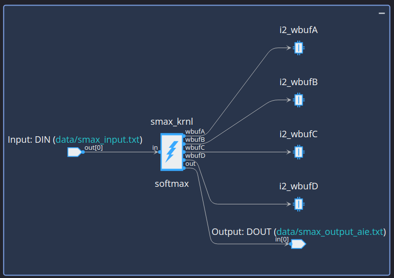
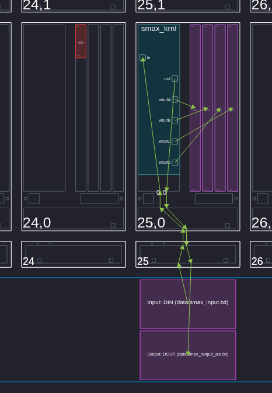
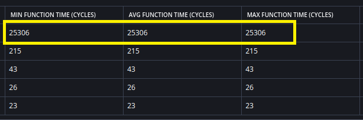
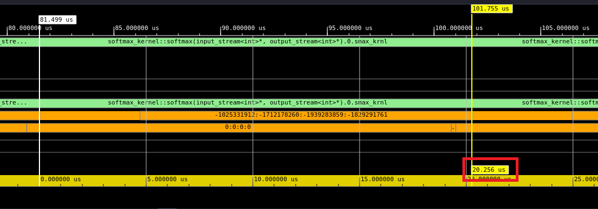
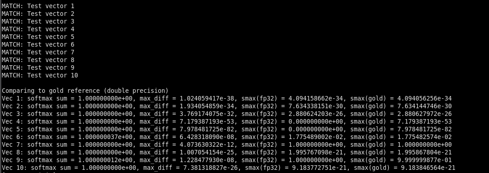

<table class="sphinxhide" style="width:100%;">
  <tr>
    <td align="center">
      <picture>
        <source media="(prefers-color-scheme: dark)" srcset="https://raw.githubusercontent.com/Xilinx/Image-Collateral/main/logo-white-text.png">
        
      </picture>
      <h1>AMD Vitis™ AI Engine Tutorials</h1>
      <a href="https://www.amd.com/en/products/software/adaptive-socs-and-fpgas/vitis.html">See Vitis™ Development Environment on amd.com</a>
        </br>
      <a href="https://www.amd.com/en/products/software/vitis-ai.html">See Vitis™ AI Development Environment on amd.com</a>
    </td>
  </tr>
</table>

# Softmax Function

***Version: Vitis 2025.2***

## Table of Contents

- [Softmax Function](#softmax-function)
  - [Table of Contents](#table-of-contents)
  - [Introduction](#introduction)
  - [Softmax Function Definition](#softmax-function-definition)
  - [Computing the Exponential Function](#computing-the-exponential-function)
    - [IEEE 754 Format Trick](#ieee-754-format-trick)
    - [Improving Accuracy](#improving-accuracy)
    - [Adapting for Single-Precision Floating-Point](#adapting-for-single-precision-floating-point)
  - [AI Engine Implementation](#ai-engine-implementation)
  - [AI Engine Kernel Processing](#ai-engine-kernel-processing)
    - [Kernel Data Interface](#kernel-data-interface)
    - [Kernel Code](#kernel-code)
  - [Running the Example](#running-the-example)
    - [Generating Test Vectors](#generating-test-vectors)
    - [Running x86 Simulation](#running-x86-simulation)
    - [Running AI Engine Simulation](#running-ai-engine-simulation)
  - [Analyzing Results](#analyzing-results)
    - [Vitis Analyzer](#vitis-analyzer)
    - [Test Vector Comparison](#test-vector-comparison)
  - [References](#references)
  - [Support](#support)


## Introduction

Machine Learning appears in almost all modern applications. Machine learning typically processes structured data, while deep learning focuses on unstructured data requiring greater abstraction to remove significant features from a dataset. Applications that benefit from deep learning include natural language processing and image classification. In these cases, the relationship between input data and desired output can be highly complex.

Deep learning solutions often use a neural network, as shown in the following figure.



*Figure 1 - Artificial Neural Network*

An artificial neural network contains layers of neurons designed to mimic behavior of the human brain. Each layer has nodes connected to adjacent layers. The number of nodes and the number of hidden layers vary by implementation. Nodes in the graph represent individual neurons.


*Figure 2 - Artificial Neuron*

Each layer multiplies its input data by a weight before summing the results. Training the neural network with empirical data determines these weights.

The activation function converts the weighted sum of inputs into an output signal. Activation functions introduce non‑linearity, allowing neural networks to approximate complex functions of the input data. You can use various activation functions across different layers. A common activation function for the output layer is softmax.

## Softmax Function Definition

The softmax function is defined for a vector of real values $\mathbf{z} = \left( z_1, z_2, \ldots , z_M \right)$ by the equation:

$$
\Large {\sigma \left( \mathbf{z} \right) {\small i}} = {\frac{e^{z_i}}{\sum\nolimits_{j=1}^{M} e^{z_j}}}
$$

Here, $z_i$ represents each individual layer output. Softmax considers the entire layer, scaling outputs so they sum to a value of 1. Each individual output is interpretable as a probability. In classification problems, interpret softmax output as probability that the input data belongs to a specified class.

Overflow can occur when computing exponential functions in softmax. For single‑precision floating‑point numbers, exponential overflow occurs when inputs exceed approximately 88.723.

To avoid overflow, evaluate softmax using the equivalent formula:

$$
\Large {\sigma \left( \mathbf{z} \right) {\small i}} = {\frac{e^{z_i - \alpha}}{\sum\nolimits_{j=1}^{M} e^{z_j- \alpha}}}
$$

Choose $\alpha$ as the maximum $z_i$ value in the input vector. Subtracting the maximum constrains exponential inputs to $(-\infty, 0]$, which limits the exponential function values to the range $[0, 1]$.

Another alternative to evaluating the softmax function is to use the equivalent formula:

$$
\Large {\sigma \left( \mathbf{z} \right) {\small i}} = \exp \left( z_i - \log \sum\nolimits_{j=1}^{M} e^{z_j} \right)
$$

This approach requires no division but often produces larger computational errors [[1]].

## Computing the Exponential Function

### IEEE 754 Format Trick

Softmax computation, beyond basic arithmetic, requires efficient evaluation of the exponential function. Several methods exist, but a useful alternative estimates the exponential function using a technique based on IEEE 754 floating‑point format [[2]].

The following figure shows a double‑precision floating‑point number represented in IEEE 754 format.


*Figure 3 - IEEE 754 Format for Double-Precision Numbers*

The IEEE 754 format represents a number as $(-1)^s(1+m)2^{x-x_0}$, where $s$ is a sign bit, $m$ is the 52-bit fractional part of a normalized mantissa, and $x$ is an 11-bit exponent with bias $x_0 = 1023$.

The approximation uses the identity $e^y = 2^{y/log(2)}$. For any floating-point number $y$, approximate $e^y$ by setting the exponent $x$ to $y/log(2) + x_0$. To compute this efficiently, divide a double-precision number into two groups: the upper 32 bits and lower 32 bits. In this method, set the lower 32 bits to zero while keeping the upper 32 bits identical to those representing the signed 32‑bit integer:

$$
I_{upper} = \left\lfloor \frac{2^{20}y}{log(2)} + 2^{20}x_0 - C \right\rfloor .
$$

A factor of $2^{20}$ represents a binary shift necessary to align with the exponent field of the IEEE 754 format. Residual mantissa bits help provide a degree of interpolation between exponent values. The parameter $C$ is a correction factor meant to mitigate estimation error. A value of $C=60801$ minimizes root‑mean‑square (RMS) error [[2]]. This estimation method can adapt to other floating-point formats, such as 32-bit single-precision floating-point.

### Improving Accuracy

Although the IEEE 754 trick is computationally efficient, it can produce estimation errors up to 4 % of the true value. A method described in [[3]] restores accuracy by using all 64 bits and applying a correction function $F$.

Begin by expressing the exponential function as:

$$
e^y = 2^{y/log(2)} = 2^{y_{i}} \cdot 2^{y_{f}} \approx 2^{y_{i}} \cdot \left( 1 + m - F \right),
$$

where $y_i$ and $y_f$ are the integer and fractional parts of $y/log(2)$, respectively. Define $F = 1 + m - 2^{y_{f}}$. Given that $m \equiv y_{f}$, rewrite $F \left( y_{f} \right) = 1 + y_{f} - 2^{y_{f}}$. Model $F \left( y_f \right)$ as a polynomial where $y_f$ is defined over the range $[0, 1)$.

Estimate the exponential function by computing:

$$
I = \left\lfloor \frac{2^{52}}{log(2)} \left( y - log(2) F(y_f) \right) + 2^{52}x_0 \right\rfloor
$$

Interpret (I) as a 64‑bit signed integer, then reinterpret the result as a double‑precision floating‑point value. Using all 64 bits requires a factor $2^{52}$ to align the exponent field with IEEE 754 format.

### Adapting for Single-Precision Floating-Point

AMD Versal™ Core Adaptive SoCs primarily contain a variant of AI Engine processor with a single-precision floating-point as a native data type. The IEEE 754 standard specifies binary32 single‑precision floating‑point format, shown in the following figure.



*Figure 4 - IEEE 754 Single-Precision Floating-Point Format*

The format resembles double-precision format but has reduced dynamic range and precision due to fewer exponent and mantissa bits. To adapt exponential function approximation to single-precision floating-point data types, use the equation:

$$
I = \left\lfloor \frac{2^{23}}{log(2)} \left( y - log(2) F(y_f) \right) + 2^{23}x_0 \right\rfloor
$$

Here, $x_0 = 127$ and $I$ is computed as a signed 32-bit integer, then reinterpreted as single-precision floating-point.

Approximate the correction function $F(y_f)$ with a polynomial. One example is:

$p(x) = p_4 x^4 + p_3 x^3 + p_2 x^2 + p_1 x + p_0$ where

- $p_4 = -1.367030945e^{-2}$
- $p_3 = -5.174499750e^{-2}$
- $p_2 = -2.416043580e^{-1}$
- $p_1 = 3.070270717e^{-1}$
- $p_0 = -3.492907808e^{-6}$

These values come from Chebyshev approximation. Polynomials of degree greater than four offer no additional benefit for single-precision calculations. Using this polynomial as the correction function yields exponential approximations with maximum error under 0.0015%.

For comparison, another version of [Softmax Function Tutorial](../../../AIE-ML/Design_Tutorials/05-Softmax-Function/) is available for the AIE-ML variant of AI Engines, where bfloat16 is the native floating-point data type.

## AI Engine Implementation

A key parameters affecting softmax computation is the number of classes. In the example here, 2048 classes represent the output nodes of a neural network. Because data uses single-precision floating-point format, the floating-point vector unit of the AI Engine is required, as shown in the following figure. The floating-point multiply unit processes vectors with eight lanes. Softmax computation is designed to accommodate a single‑instruction multiple‑data (SIMD) factor of eight.


*Figure 5 - AI Engine Floating-Point Vector Unit*

The preceding figure shows the floating-point vector processor with a pipeline depth of seven. Design kernel processing to keep the pipeline full for maximum compute efficiency. Efficiency decreases when computation waits for intermediate results. To leverage software pipelining, break computation into components and store intermediate results in data memory.

Each kernel loop performs a specific computation for all classes in the softmax function, eight elements per iteration. Each kernel invocation computes a single softmax vector containing all output values in the following order:

1. Read and store all input values while searching for the maximum value. (single loop)
2. Compute exponential function of all values. (ten computational loops, includes subtraction of maximum from input and correction polynomial evaluation)
3. Sum all exponentials and invert sum to obtain scaling factor. (single loop plus scalar processor inverse operation)
4. Multiply all exponentials by scaling factor and send result to output. (single loop)

## AI Engine Kernel Processing

### Kernel Data Interface

The kernel is designed for single‑precision floating‑point processing, but the function signature uses `int32` for both input and output.

```cpp
void softmax_kernel::softmax(input_stream<int32>* in, output_stream<int32>* out)
```

Each `int32` value contains the 32-bits of a single-precision floating-point number in IEEE 754 format. The kernel reinterprets these values as floating-point for processing.

Using `int32` preserves all bits of the floating-point number when reading from or writing to text files during AI Engine simulation. This approach enables direct bit=level comparison for test vector matching. Streaming interfaces handle input and output, reducing latency and eliminating the need for ping‑pong buffers in data memory.

### Kernel Code

The first processing loop of the kernel appears in the following code. The kernel defines iterators for work buffers in data memory to store intermediate results. The processing loop reads input values for softmax computation, stores them in memory, and searches for the maximum input value.

```cpp
// work buffers in data memory
auto pWbufA = aie::begin_restrict_vector<8>(wbufA);
auto pWbufB = aie::begin_restrict_vector<8>(wbufB);
auto pWbufC = aie::begin_restrict_vector<8>(wbufC);
auto pWbufD = aie::begin_restrict_vector<8>(wbufD);

// read and store data while searching for maximum value
float max_val = -2 ^ 127;

for (unsigned i=0; i < BUFFSZ/8; i++) 
    chess_prepare_for_pipelining
    chess_loop_count(BUFFSZ/8)
{
    aie::vector<float,8> vin = aie::vector_cast<float>(readincr_v<8>(in));
    float vmax = aie::reduce_max(vin);
    if (vmax > max_val) {
        max_val = vmax;
    }
    *pWbufB++ = vin;
}

pWbufB -= (BUFFSZ/8);

chess_separator();
```

The next kernel code segment contains the first three computational loops used to evaluate the exponential function of all inputs. The first loop subtracts the maximum value from all inputs, then multiplies the result by a scale factor of ${\log_{2}}e$. This is equivalent to $\frac{1}{\log(2)}$. The kernel header factor defines this scale factor.

The second loop computes `floor()` of the scaled values. Because fixed‑point conversion uses a rounding function, subtract 0.5 first to match `floor()` output. This approach fails to compute `floor()` correctly for small, negative values.

The third loop computes the fractional value $x - \lfloor x \rfloor$. Iterators for data memory are reset after each loop to prepare them for follow-on processing.

```cpp
/****** Start of computation of exponential function of all input values ******/
// subtract maximum value from all input values and scale result by log2(e)
aie::accum<accfloat,8> acc_init;
acc_init.from_vector(aie::broadcast<float,8>(-log2e*max_val));

for (unsigned i=0; i < BUFFSZ/8; i++)
    chess_prepare_for_pipelining
    chess_loop_count(BUFFSZ/8)
{
    *pWbufA++ = aie::mac(acc_init, *pWbufB++, log2e);
}

pWbufA -= (BUFFSZ/8);
pWbufB -= (BUFFSZ/8);

chess_separator();

// compute integer part of scaled inputs, equivalent to floor()
// Note: Not strictly a floor(), fails for negative numbers with very small magnitudes
for (unsigned i=0; i < BUFFSZ/8; i++) 
    chess_prepare_for_pipelining
    chess_loop_count(BUFFSZ/8)
{
    aie::vector<float,8> vecA = aie::vector_cast<float>(*pWbufA++);
    aie::vector<float,8> xshft = aie::sub(vecA, 0.5f);
    aie::vector<int32,8> xfloor = aie::to_fixed(xshft,0);
    *pWbufC++ = aie::to_float(xfloor);
}

pWbufA -= (BUFFSZ/8);
pWbufC -= (BUFFSZ/8);

chess_separator();

// compute the fractional part of scaled input
for (unsigned i=0; i < BUFFSZ/8; i++) 
    chess_prepare_for_pipelining
    chess_loop_count(BUFFSZ/8)
{
    *pWbufB++ = aie::sub(*pWbufA++, *pWbufC++);
}

pWbufA -= (BUFFSZ/8);
pWbufB -= (BUFFSZ/8);
pWbufC -= (BUFFSZ/8);

chess_separator();
```

The next four loops are used to evaluate the correction polynomial using Horner's method. Polynomial coefficients are specified in the kernel header file.

```cpp
/****** Start of correction polynomial computation ******/
// using Horner's method, break polynomial evaluation into separate loops for improved pipelining

// polynomial loop 1
aie::accum<accfloat,8> p_acc;
p_acc.from_vector(aie::broadcast<float,8>(p3));

for (unsigned i=0; i < BUFFSZ/8; i++) 
    chess_prepare_for_pipelining
    chess_loop_count(BUFFSZ/8)
{
    *pWbufC++ = aie::mac(p_acc, *pWbufB++, p4);
}

pWbufB -= (BUFFSZ/8);
pWbufC -= (BUFFSZ/8);

chess_separator();
  
// polynomial loop 2
p_acc.from_vector(aie::broadcast<float,8>(p2));

for (unsigned i=0; i < BUFFSZ/8; i++)
    chess_prepare_for_pipelining
    chess_loop_count(BUFFSZ/8)
{
    *pWbufD++ = aie::mac(p_acc, *pWbufB++, *pWbufC++);
}

pWbufB -= (BUFFSZ/8);
pWbufC -= (BUFFSZ/8);
pWbufD -= (BUFFSZ/8);

chess_separator();

// polynomial loop 3
p_acc.from_vector(aie::broadcast<float,8>(p1));

for (unsigned i=0; i < BUFFSZ/8; i++)
    chess_prepare_for_pipelining
    chess_loop_count(BUFFSZ/8)
{
    *pWbufC++ = aie::mac(p_acc, *pWbufB++, *pWbufD++);
}

pWbufB -= (BUFFSZ/8);
pWbufC -= (BUFFSZ/8);
pWbufD -= (BUFFSZ/8);

chess_separator();

// polynomial loop 4
p_acc.from_vector(aie::broadcast<float,8>(p0));

for (unsigned i=0; i < BUFFSZ/8; i++) 
    chess_prepare_for_pipelining
    chess_loop_count(BUFFSZ/8)
{
    *pWbufD++ = aie::mac(p_acc, *pWbufB++, *pWbufC++);
}

pWbufB -= (BUFFSZ/8);
pWbufC -= (BUFFSZ/8);
pWbufD -= (BUFFSZ/8);

/****** End of correction polynomial computation ******/

chess_separator();
```

Three more loops are used to complete evaluation of the exponential function of the inputs, as shown below. The first loop subtracts the correction polynomial result from the scaled input. The next loop scales and translates the result so that the exponent is aligned with IEEE 754 format and has the proper offset. Parameters used in computation are specified in the kernel header file. Finally, the integer part of the result is extracted and reinterpreted as a floating-point number. Before reinterpreting the number as floating-point, some checking is performed to ensure the `int32` value is reasonable to represent a `float` in the range $[0, 1]$, and any outliers are set to zero.

```cpp
// apply correction term to scaled input
for (unsigned i=0; i < BUFFSZ/8; i++) 
    chess_prepare_for_pipelining
    chess_loop_count(BUFFSZ/8)
{
    *pWbufB++ = aie::sub(*pWbufA++, *pWbufD++);
}

pWbufA -= (BUFFSZ/8);
pWbufB -= (BUFFSZ/8);
pWbufD -= (BUFFSZ/8);

chess_separator();

// convert results to IEEE 754 format - use 2 loops
aie::accum<accfloat,8> b_acc;
b_acc.from_vector(aie::broadcast<float,8>(exp_B));

for (unsigned i=0; i < BUFFSZ/8; i++) 
    chess_prepare_for_pipelining
    chess_loop_count(BUFFSZ/8)
{
    *pWbufC++ = aie::mac(b_acc,*pWbufB++,exp_S);
}

pWbufB -= (BUFFSZ/8);
pWbufC -= (BUFFSZ/8);

chess_separator();

for (unsigned i=0; i < BUFFSZ/8; i++) 
    chess_prepare_for_pipelining
    chess_loop_count(BUFFSZ/8)
{
    aie::vector<int32,8> exp_i = aie::to_fixed(*pWbufC++,0);

    // integer values should be in the range [0, 1,065,353,216], find outliers and set to zero
    aie::mask<8>  msk_neg = aie::lt(exp_i,0);
    aie::vector<int32,8> exp_bnd = aie::select(exp_i, aie::zeros<int32,8>(), msk_neg);
    aie::mask<8>  msk_pos = aie::gt(exp_bnd,1065353216);
    exp_bnd = aie::select(exp_bnd, aie::zeros<int32,8>(), msk_pos);

    *pWbufA++ = exp_bnd.cast_to<float>();
}

pWbufA -= (BUFFSZ/8);
pWbufC -= (BUFFSZ/8);

/****** End of computation of exponential functions of all input values ******/

chess_separator();
```

After computing exponential values for all inputs, the kernel evaluates the softmax function in the following code segment. The first loop sums exponential values in individual vector lanes. The kernel then sums the lanes and uses the scalar processor to compute a scale factor, which is the inverse of the sum. The final loop multiplies all exponential values by the scale factor and sends the results to the output.

```cpp
// accumulate all vectors to determine scale factor
auto vsum = aie::zeros<float,8>();

for (unsigned i=0; i < BUFFSZ/8; i++) 
    chess_prepare_for_pipelining
    chess_loop_count(BUFFSZ/8)
{
    vsum = aie::add(vsum, *pWbufA++);
}

pWbufA -= (BUFFSZ/8);

chess_separator();

// compute inverse
float scl_fctr = aie::inv(aie::reduce_add(vsum));

// scale values and write to output
for (unsigned i=0; i < BUFFSZ/8; i++) 
    chess_prepare_for_pipelining
    chess_loop_count(BUFFSZ/8)
{
    aie::vector<float,8> vout = aie::mul(*pWbufA++, scl_fctr);
    writeincr(out, aie::vector_cast<int32>(vout));
}
```

## Running the Example

Running the example requires that both MATLAB and Vitis tools are installed and configured correctly. After downloading the files, change directory into ``.../19-Softmax-Function/aie/`` and build using ``make``.

### Generating Test Vectors

Before running the AI Engine graph simulation, generate test vectors to provide input. Scripts compare with AI Engine simulator output for verification. To generate the vectors, run the command:

```bash
$ make gen_vectors
```

Test vectors are included with this tutorial, so generation is optional before AI Engine simulation. If desired, run the ``matlab/genvectors_softmax_aie_float32.m`` function from MATLAB to generate test vectors. The function accepts input arguments specifying the number of softmax classes and the number of softmax vectors to generate. This function also creates a ``aie/src/config.h`` file to configure the AIE kernel and simulation for processing generated test vectors.

### Running x86 Simulation

To perform a functional x86 simulation, enter the following sequence of commands:

```bash
$ make x86com
$ make x86sim
$ make check_x86sim
```

The first command compiles graph code for simulation on an x86 processor, the second command runs the simulation, and the final command invokes MATLAB to compare the simulator output with test vectors.

### Running AI Engine Simulation

To perform the AI Engine emulation using the SystemC simulator, enter the following sequence of commands:

```bash
$ make aiecom
$ make aiesim
$ make check_aiesim
```

The first command compiles graph code for the SystemC simulator, the second command runs the simulation, and the final command invokes MATLAB to compare simulation output with test vectors. To generate trace and profile data during simulation, run the following sequence:

```bash
$ make aiecom
$ make profile
$ make check_aiesim
```

## Analyzing Results

### Vitis Analyzer

Vitis Analyzer provides information on compilation, simulation, and implementation of AI Engine graphs. Use it to obtain a summary on profiling data and to graphically display trace events. Launch the tool with the ``vitis_analyzer`` command. For this example, enter:

```bash
$ make analyze
```

The graph view displays connectivity of the AI Engine graph. This simple example shows a softmax kernel with streaming data input and output. Also visible are four buffers in data memory used for holding intermediate computations.



*Figure 6 - Vitis Analyzer Graph View*

The array view shows how the AI Engine graph maps to the AI Engine array for the specified device. This example uses a VC1902 Versal AI Core device with 400 AI Engine tiles. The following figure shows two AI Engine tiles in use. One tile handles kernel processing and contains work buffers in data memory. The memory requirement for these buffers depends on the number of classes in the softmax function. with 2048 classes, the tile uses its entire 32 kB memory. This requires a second tile to accommodate system memory, shown in red.



*Figure 7 - Vitis Analyzer Array View*

The following figure contains information from the Profile view. The highlighted fields show that the softmax kernel takes 25,306 cycles to process 2048 classes. For lowest speed grade Versal devices, this translates to a processing rate of ~39,516 softmax computations per second. Higher speed grade devices can have a peak rate of ~49,395 softmax computations per second.



*Figure 8 - Vitis Analyzer Profile View*

The following figure shows part of the Vitis Analyzer trace view. The cursors show that the time between the end of one kernel invocation to the end of the next is 20.256 $\mu s$. Additional overhead causes softmax computation rate to decrease slightly to ~49,368 computations per second in higher speed grade devices. Computation efficiency limits this particular implementation. To improve processing rate, you can further optimize code, or possibly trade off accuracy by eliminating the polynomial correction factor from exponential function evaluation.



*Figure 9 - Vitis Analyzer Trace View*

### Test Vector Comparison

A MATLAB script processes simulation results and compares them with test vectors. The following figure shows an example of a successful comparison.



*Figure 10 - Simulation Verification*

The output shows two indicators of simulation performance. The first indicator reveals whether the simulation output matches corresponding test vectors. There is one comparison for each softmax function evaluated. The script compares `int32` values which represent single-precision floating-point softmax function values. Because floating-point results can vary, the comparison allows mismatch in the least significant mantissa bit of the floating-point number. Adjust the number of allowed LSB mismatches in the MATLAB script.

The second comparison indicates the maximum difference between AI Engine simulation results and double-precision floating-point results generated by MATLAB processing. For each softmax computation, the output specifies the maximum error and the two values compared. The results also show the summation of all terms for each softmax computation. Ideally, this summation equals 1.0.

## References

[1]:<https://doi.org/10.1093/imanum/draa038> "Blanchard2021"
[[1]]: P. Blanchard, D. J. Higham, N. J. Higham, Accurately computing the log-sum-exp and softmax functions, IMA Journal of Numerical Analysis, Volume 41, Issue 4, October 2021, Pages 2311–2330.

[2]:<https://www.schraudolph.org/pubs/Schraudolph99.pdf> "Schraudolph2000"
[[2]]: N. N. Schraudolph, "A fast, compact approximation of the exponential function," *Neural Comput.*, vol. 12, no. 9, pp. 2009-2012, 2000.

[3]: <https://research.ibm.com/publications/fast-exponential-computation-on-simd-architectures> "Malossi2015"
[[3]]: A. C. I. Malossi, Y. Ineichen, C. Bekas and A. Curioni "Fast exponential computation on SIMD architectures," HiPEAC 2015 - 1st Workshop On Approximate Computing (WAPCO), Amsterdam, NL, 2015, doi: 10.13140/2.1.4362.3207.

## Support

GitHub issues track requests and bugs. For questions, go to [support.xilinx.com](http://support.xilinx.com/).

<hr class="sphinxhide"></hr>

<p class="sphinxhide" align="center"><sub>Copyright © 2024–2026 Advanced Micro Devices, Inc.</sub></p>

<p class="sphinxhide" align="center"><sup><a href="https://www.amd.com/en/corporate/copyright">Terms and Conditions</a></sup></p>
