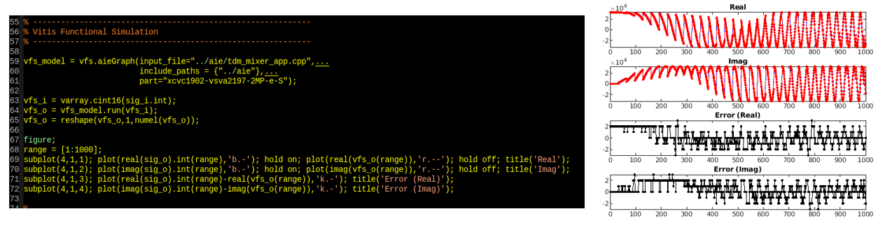

<table class="sphinxhide" style="width:100%;">
  <tr>
    <td align="center">
      <picture>
        <source media="(prefers-color-scheme: dark)" srcset="https://raw.githubusercontent.com/Xilinx/Image-Collateral/main/logo-white-text.png">
        
      </picture>
      <h1>AMD Vitis™ AI Engine Tutorials</h1>
      <a href="https://www.amd.com/en/products/software/adaptive-socs-and-fpgas/vitis.html">See Vitis™ Development Environment on amd.com</a>
         
      <a href="https://www.amd.com/en/products/software/vitis-ai.html">See Vitis™ AI Development Environment on amd.com</a>
    </td>
  </tr>
</table>

# Time-Division Multiplexed Mixer Example

***Version: Vitis 2025.2***

## Table of Contents

1. [Introduction](#introduction)
1. [Corner-Turning using Tile DMA](#corner-turning-using-tile-dma)
1. [Baseline Mixer Design](#baseline-mixer-design)
1. [Vitis Functional Simulation](#vitis-functional-simulation)
1. [Optimized Mixer Design](#optimized-mixer-design)
1. [Conclusions](#conclusions)

## Introduction

This tutorial explains creating a time-division multiplexed (TDM) mixer design on AI Engine. Wireless designs can employ a TDM strategy when the sampling rate of each channel is much lower than the AI Engine clock rate. For example, if each channel's sampling rate is 122.88 MSPS and the clock rate is 1250 MHz, interleave eight channels into one single-stream input to the AI Engine. This produces a TDM factor of 8. Prefer interleaving single samples from each channel instead of blocks of contiguous samples to reduce overall latency.

This tutorial targets three goals using the context of the TDM mixer:

* Explains performing a corner-turning operation using DMA hardware resources inside the AI Engine local tile. This approach offloads this sample reordering from the AI Engine core processing and integrates it into the data flow. This increases design efficiency and frees more core capacity for compute workloads.
* Shows you how each AI Engine tile's non-linear `sincos()` generator helps vectorize workloads that involve phase or frequency generation without lookup tables.
* Provides an example of optimizing AI Engine code for improved software pipelining to achieve higher throughput through simple code refactoring.

Finally, the tutorial uses the Vitis functional simulation to run functional simulations of AI Engine designs in the MATLAB® environment. The Vitis functional simulation flow lets you feed I/Os between MATLAB and the AI Engine for x86 functional simulation without I/O files. The direct connection of the x86simulator to your system model in MATLAB verifies your algorithm vectorization as you migrate your algorithms to AI Engine.

## Corner-Turning Using Tile DMA

The TDM mixer accepts I/Os in an interleaved fashion, passing one sample from each channel in turn and repeating this pattern for subsequent samples. Applying a mixer function directly to this TDM stream requires generating a different frequency for each sample, assuming each channel uses its own carrier. Vectorization across eight samples, using `cint16` data types, means the AI Engine must generate eight unique frequency samples per cycle. However, the AI Engine's non-linear `sincos()` generator belongs to the scalar processor and produces only a single sample per cycle. Vectorization then requires another approach, such as parallel lookup tables or more expensive Taylor series expansions.

### Vectorization of the Mixer

Consider a single-channel mixer. Because it involves only one carrier, you can vectorize frequency generation across consecutive time-domain samples using the following approach. Assume a carrier angular frequency of $\omega_o$. Use the `sincos()` generator one time per cycle to produce the term $\exp(j\omega(8T_s))$. Advance the `sincos()` generator by eight samples to match the desired vectorization; $T_s$ represents the sampling period.

Pre-compute a fixed vector phase ramp with elements $[1, \exp(j\omega T_s), \exp(j\omega 2T_s), \ldots, \exp(j\omega 7T_s)]$. Compute the next eight samples of the single-channel mixer in vectorized fashion by multiplying this vector phase ramp lane-by-lane with the scalar exponential from the `sincos()` generator. Repeat this in a sustained loop on a cycle-by-cycle basis because the phase ramp is fixed and the `sincos()` generator processes a new input in each cycle.

### Corner-Turning Concept

You cannot directly apply this single-channel-mixer in the context of the TDM mixer. In the TDM mixer, samples from different channels arrive in an interleaved manner, while samples in the single-channel case arrive consecutively. This creates a data flow problem. You must convert the interleaved stream into a channel-by-channel stream at the mixer input, then restore the interleaved format at the mixer output.

This operation is sometimes called a corner-turn or 2D transpose, based on the following figure. Samples arrive row-wise, interleaved by channel, one sample at a time. The diagram shows four channels and eight samples for each channel. Feed the single-channel mixer with samples chosen column-wise: first eight samples from channel 0, then eight from channel 1, and so on. The minimum number of samples must be eight to match the vectorization. In practice, the column depth is a multiple of eight.

### Local Tile DMA Tiling Parameters

You can implement this corner-turning data flow directly using the local DMA hardware in each AI Engine tile. Program the input stream dma to write the local input buffer row-wise using a tiling parameter as shown in the following sections. The AI Engine then reads this input buffer column-wise when performing channel-by-channel computation, storing results column-wise in its output buffer.

Program the output stream DMA to read the output buffer row-wise, restoring the TDM nature of the output stream. Corner-turning at both input and output buffers of the mixer uses no core compute resources because local tile DMA hardware computes addressing. This makes it part of the natural data flow.

### TDM Mixer Graph Design

The graph code for the TDM mixer targets full-speed operation above 1000 MSPS.

The design uses templates to support `NSAMP` I/O samples and `CC` channels. Ensure `NSAMP` is a multiple of eight to match the vectorization. Ensure `CC` is a multiple of four to match assumptions of the final optimized code outlined in the following figure.

The graph encapsulates a single AI Engine tile that runs the mixer kernel. The design supplies I/O data over a single programmable logic input/output (PLIO) stream. The design uses I/O buffers sized `NSAMP * CC` samples with default double buffering. In this example, configure mixer frequencies statically using the `tdm_mixer_phase_inc.h` included header file.

At graph level, two programming model elements handle corner-turning operations in the data flow. Two `tiling_parameters` structures define the settings. The `bdw` instance configures the input buffer corner-turning. The `bwr` instance configures the output buffer corner-turning.

Associate these tiling parameters with specific kernel I/O ports by adding annotations. For example, kernel input port `kk.in[0]` uses the `bdw` tiling parameter in Line 55. This specifies the `write_access` of the port is controlled by `tiling(bdw)`. Similarly, Line 56 specifies the `read_access` of kernel output port `kk.out[0]` is controlled by `tiling(bdr)`.

### Input Buffer Tiling Parameters

The `bdw` tiling parameter defines how the stream DMA writes input samples into the kernel input buffer.

First, define the `buffer_dimension`. You can use either 1D or 2D buffers. To perform a corner-turn, define a 2D buffer with dimension-0 equal to `NSAMP` samples and dimension-1 equal to `CC` samples. This sets the physical extent of the buffer.

The tiling descriptor uses tiles, each containing $M\times N$ samples. For a simple corner-turn, use a single-sample tile with `tiling_dimension` set to `{1,1}`. The DMA hardware writes tiles in the order specified by the `tile_traversal`, which specifies three values for each `buffer_dimension`:

* The next `dimension` to process.
* The `stride` in samples before writing the next tile.
* The `wrap` count in tiles when the address resets to zero.  

You can use the `offset` parameter to start addressing from a nonzero index in each buffer dimension. Corner-turning does not require an offset.

The `bdw` tiling parameter in Line 42 defines the following data flow (refer to [[2]] for details):

* The input buffer is 2D with dimensions `{NSAMP,CC}` and zero offsets.
* The DMA processes single-sample tiles.
* The DMA writes into dimension-1 first (along the rows), advancing one sample at a time and wrapping to zero after `CC` samples.
* The DMA then advances one sample along dimension-0, then continues across dimension-1 for the rest of the row.
* The DMA wraps to zero in dimension-0 after `NSAMP` samples.

This configuration causes the DMA to write samples row-by-row (dimension-1) into the buffer. To perform the desired corner-turn, the AI Engine kernel reads samples column-by-column (dimension-0) from the buffer. Because the input buffer has no read-access tiling parameter, it defaults to a 1D buffer of `NSAMP*CC` samples, reading along dimension-0 (exactly what is needed).

### Output Buffer Tiling Parameters

The `bdr` tiling parameter defines how the stream DMA reads output samples from the kernel output buffer. This works the same as the `bdw` tiling parameter, except writing and reading functions swap roles.

The AI Engine tile writes output samples along dimension‑0 of a default one-dimensional (1D) buffer because no write‑access tiling parameter is specified. Therefore, the kernel writes by columns, and the output DMA reads by rows.

## Baseline Mixer Design

The baseline TDM mixer design uses a single kernel implementing the vectorization described earlier. It processes `NSAMP` samples of one channel, switches to a different carrier frequency, processes `NSAMP` samples of that channel, and repeats until it processes all channels.

You can read the input and output buffers in linear addressing order because the DMA configuration already places samples in their correct destinations. The following figure shows the baseline design. The design supports `NSAMP=64` samples and `CC=32` channels, uses a single compute tile, and distributes buffers across three tiles. There is no attempt to optimize the design floor plan. The design uses double-buffered I/O, and it contains one `phase_inc` lookup table specifying phase increments for each channel. Unity values drive the design so each channel produces its own tone.

The compiler schedules the inner for-loop (Line 57) within an initiation interval (II) of 15 cycles. The theoretical minimum II from hardware operations is two cycles, indicating inefficiency from poor software scheduling. This performance runs about 7X to 8X slower than theory. Refactor the code in the following section to improve throughput. With II=15, the design achieves a throughput of ~2600 MB/s or ~550 MSPS (assuming each `cint16` sample is four bytes).

Consider two points about the II reporting of Line 57:

* The tool shows II information only when you enable the verbose option.
* Although the code contains three for-loops, reporting appears only for the innermost loop. This result means the compiler applied software pipelining optimization solely to the innermost loop for this design. In other designs, the tool can report IIs for multiple loops when it optimizes them with pipelining.

The following figure shows kernel code for the baseline design. The top-left portion shows the header file code. The constructor receives the static mixer frequency configuration from the `phase_inc_i` array. An additional `phase` array holds the state of the mixer between kernel invocations. The bottom-left shows the constructor code. It initializes the phase of all mixer channels to zero in this code.

The right portion shows the actual kernel code. The output loop (Line 42) runs over all channels supported by the mixer. Lines 45 to 51 compute the fixed vector ramp required by the current channel. Line 54 restores the previous phase value for the current channel from memory. The inner loop on Line 57 processes all `NSAMP` samples for the current channel eight at a time using two pipelined operations. The first multiplies the vector ramp by the next value generated by the `sincos()` generator. The second multiplies the 8-lane vector of the mixer phasor with the 8-lane vector of input samples. The `curr` variable accumulates the phase for the `sincos()` generator. Line 67 stores the final phase value to memory for the next kernel call.

Lines 61 and 62 perform two 8‑lane vector multiplications. These instructions are pipelined and require many cycles to complete. The compiler must finish these instructions before scheduling the next loop body iteration, reducing throughput and stalling execution. As a result, this loop achieves an II=15, even though these instructions have a theoretical II=2. Improvement depends on filling the loop with more compute workloads, as described in the following section.

## Vitis Functional Simulation

This tutorial uses the Vitis functional simulation (VFS) feature to validate the TDM mixer implementation in AI Engine against its MATLAB behavioral models. VFS automatically creates shared objects for your AI Engine and PL HLS-based kernels in your Versal design. It integrates these objects into common system-level simulation frameworks, such as MATLAB and Python. Using VFS  enables functional verification of your Versal AI Engine and PL designs within your preferred simulation framework and without generating I/O files.

The MATLAB version of VFS validates the TDM Mixer functional performance. The following diagram shows the MATLAB m-code required to use VFS:

* Source `${XILINX_VITIS}/settings64.sh` before starting your MATLAB session.
* Create an AI Engine graph instance using `vfs.aieGraph` in Line 59.
* Run your model in MATLAB using the `run()` function of your VFS instance in Line 64.

## Optimized Mixer Design

The `tdm_mixer_fast.cpp` file replaces the baseline TDM mixer design in `tdm_mixer.cpp`. Edit Line 38 of `tdm_mixer_graph.h` so its kernel definition points to this modified source. The goal is to improve throughput by addressing poor software pipelining in the baseline code.

The baseline implementation achieves low throughput because it initiates only one compute workload per inner loop body. These vectorized `mac()` instructions are pipelined, limiting scheduling opportunities. You can give the compiler more parallel scheduling capacity by performing multiple compute workloads in each loop iteration. The refactored code runs four compute workloads per inner loop iteration instead of one. Each workload processes a different mixer channel, essentially pushing four iterations of the outer `CC` loop into the inner `NSAMP` loop.

This change requires bringing four input sample sets into the inner loop instead of one. Define an array of four read iterators at Line 37 and an array of four write iterators at Line 43. Each iterator advances through input/output buffers by column. One inner loop iteration processes all samples in a single column, then jumps ahead three columns for the next iteration.

Before the inner loop, pre-compute four fixed-phase ramp vectors instead of one. Track four phase counters instead of one. Restore and save four phase states instead of one.

After refactoring, compiler scheduling analysis reports minimum II=8 and actual II=21. Although the baseline reported II = 2 minimum and II = 15 actual, remember the baseline processed eight samples for one channel. The optimized loop processes eight samples for four channels. When scaling baseline values by 4X, the minimum II remains identical. You now achieve actual II = 21 instead of an equivalent II = 60 in the baseline. This represents a 3X improvement in cycle efficiency.

The optimized design achieves ~4600 MB/s or ~1150 MSPS as shown in the following figure. The design now meets the original throughput target of greater than 1000 MSPS.

## Conclusions

This tutorial presents the design of a TDM mixer on AI Engine. You use tiling descriptors in the DMA hardware of the local tile to achieve a corner-turning data flow without affecting core compute resources. This method offers advantages in applications that require multi-channel signal processing. The tutorial demonstrates a ~2X throughput improvement through more efficient compiler software pipelining by simple code refactoring.

VFS integrates functional AI Engine x86 simulation models directly into MATLAB for algorithm validation. You can perform verification without generating I/O files or leaving the MATLAB environment.

## References

[1]:<https://docs.amd.com/r/en-US/am009-versal-ai-engine/Arithmetic-Logic-Unit-Scalar-Functions-and-Data-Type-Conversions> "AIE ALU Scalar Functions"
[[1]]: Versal Adaptive SoC AI Engine Architecture Manual (AM009).

[2]:<https://docs.amd.com/r/en-US/ug1603-ai-engine-ml-kernel-graph/Tiling-Parameters-and-Buffer-Descriptors> "Tiling Parameters and Buffer Descriptors"
[[2]]: AI Engine-ML Kernel and Graph Programming Guide (UG1603).

## Support

GitHub issues track requests and bugs. For questions, go to [support.xilinx.com](http://support.xilinx.com/).

Copyright © 2024–2026 Advanced Micro Devices, Inc.

<a href="https://www.amd.com/en/corporate/copyright">Terms and Conditions</a>

