
<table class="sphinxhide" width="100%">
 <tr width="100%">
    <td align="center"><h1>AI Engine Development</h1>
    <a href="https://www.xilinx.com/products/design-tools/vitis.html">See Vitis™ Development Environment on amd.com </a>
    <a href="https://www.xilinx.com/products/design-tools/vitis/vitis-ai.html">See Vitis™ AI Development Environment on amd.com</a>
    </td>
 </tr>
</table>

# Back-Projection for Synthetic Aperture Radar on AI Engines
## Back-Projection Engine

This section provides an overview of the SAR BP engine built using AI Engines. A single engine instance provides a complete implementation of the SAR BP algorithm. Multiple instances of the engine may be used to increase throughput by partitioning a non-overlapping portion of the target image to each engine instance. This is considered in the next section.

### Design Approach

This tutorial implements the full SAR BP algorithm in AI Engine tiles; all compute workloads are partitioned to the AI Engine array. Due to its large 2 GB memory footprint, the SAR image is stored in PL URAM. The design establishes a "back-and-forth" streaming data flow from PL to the AI Engine array and back again. The BP engine updates the input SAR image based on the current input radar pulse, producing a revised output SAR image that is streamed back to PL URAM. The design approach adopts the following concepts outlined below.

#### DDR Buffers and PL URAM Buffers

* A set of 586 radar pulses of length 2048 is stored in the `pulse_i` buffer in DDR. These are the zero-padded radar signatures collected from the GOTCHA data set [[1]] over azimuth angles $38,39,40,41,$, and $42$ for "Pass 1" on the "HH" polarization. This data set is input once to the engine for every radar pulse processed.
* A set of 586 tuples $(A_x,A_y,A_z)$ representing the 3D coordinates of the antenna platform for each radar pulse captured is stored in the `coord_i` buffer in DDR. This buffer acts as a real-time parameter (RTP) vector for the BP engine that is transferred once to the AI Engine array prior to the processing of any radar pulses. 
* A set of 586 samples representing the range $R_0$ from antenna platform to SAR target image center is stored in the `R0_range_i` buffer in DDR. This buffer acts as a real-time parameter (RTP) vector for the BP engine that is transferred once to the AI Engine array prior to the processing of any radar pulses. 
* A single buffer `image_buffer` located in PL URAM stores the full SAR target image. The AIE array streams the input image from PL, updates the image for the current radar pulse in the AIE array, then streams the updated resultant image back to the PL URAM where it is stored in the same buffer. 
* The AI Engine array is enabled to run for `NPULSE_USE` radar pulses. The BP engine graph is designed to process a full radar pulse per graph iteration. 
* Asynchronous DMA transfers are used to send the `pulse_i` data from DDR to AI Engine array. A single DMA transfer is initiated for all radar pulses. Each radar pulse is processed by a single graph iteration.
* After all radar pulses have been processed, the final target image may be uploaded from PL to DDR using a synchronous DMA transfer.
 
#### BP Engine Graph aand Kernel Scheduling

* The BP engine uses multi-rate scheduling to control its system level operation. The scheme is hard-coded yet configurable for processing any number of radar pulses.
* The design employs a single top-level graph.
* A single graph iteration corresponds to a full update of the SAR target image for one radar pulse. Using multi-rate scheduling, each AI Engine kernel executes as many times as required to perform its workload for that pulse. 
* The `ifft2k_async()` graph contains two kernels. The `ifft()` kernel performs the inverse transform function. The `lut()` kernel computes the slope and offset LUTs required by the downstream  `interp1()` graph. Each kernel must be performed once per radar pulse. Consequently, the `ifft()` and `lut()` kernels both use a setting of `repetition_count=1`.
* The `range_gen()` kernel generates the $(x,y,z)$ coordinates of the target image in a just-in-time fashion as this data is already known and is easily computed. This saves considerable storage for the implementation.
* All other graphs in the BP engine perform computations related to updating the SAR target image. Because the memory footprint for this image exceeds the local tile memory, partial SAR image data is streamed through the design using double-buffering. The design adopts a size of 1024 samples for these I/O kernel buffers. For a $512\times 512$ image, it follows that 256 kernel invocations are required per graph iteration in order to process the full target image; all remaining kernels use `repetition_count=256`.
* Both `interp1()` kernels (for servicing the real and imaginary components of the phase correction) must re-use its slope and offset LUTS over multiple kernel invocations to process the full target image. Because these LUTs are computed only once per graph iteration, the design must employ asynchronous buffering of these LUTs. Otherwise, the default multi-rate scheduling would insist on a 256-fold replication of these buffers. This is infeasible. For this reason, the `interp1()` kernel must be hand-coded to manage this asynchronous buffering. The current DSP library `func_approx()` IP (which otherwise could perform the required linear interpolation functionality) only supports synchronous buffering.
* The memory footprint if the `ifft()` and `lut()` kernels is quite heavy and is only performed once per graph iteration. These outputs are held constant over 256 invocations of all remaining kernels. Consequently, the design elects to use `single_buffer()` designations on the I/O buffers of `ifft()` and `lut()`. This has minimal impact on the overall system throughput since most of the DDR input transfers of the next radar pulse may be hidden by the compute workload of the current radar pulse as noted earlier. 

### Graph View

The following figure shows the graph view for the SAR BP engine.

* The graph has two inputs, `ifft_i`, `image_i`, and one output `image_o`. The `ifft_i` is driven by GMIO whereas the other two are both driven by PLIO. 
* The `ifft()` and `lut()` kernels execute once per graph iteration to compute the IFFT and populate the slope & offset LUTs required for linear interpolation.
* The `range_gen()` kernel also executes once per graph iteration to compute the $(x,y,z)$ coordinates of the target image.
* All remaining kernels execute 256 times per graph iteration, processing 1024 pixels per kernel invocation.
* The `interp1()` graph is implemented by two separate kernels `interp1_re()` and `interp1_im()`. Each kernel uses asynchronous input buffers to manage its input LUTs.
* The `expjx()` graph is implemented by two separate kernels `cos()` and `sin()`. These are instantiations of `func_approx()` from the Vitis DSP Library.

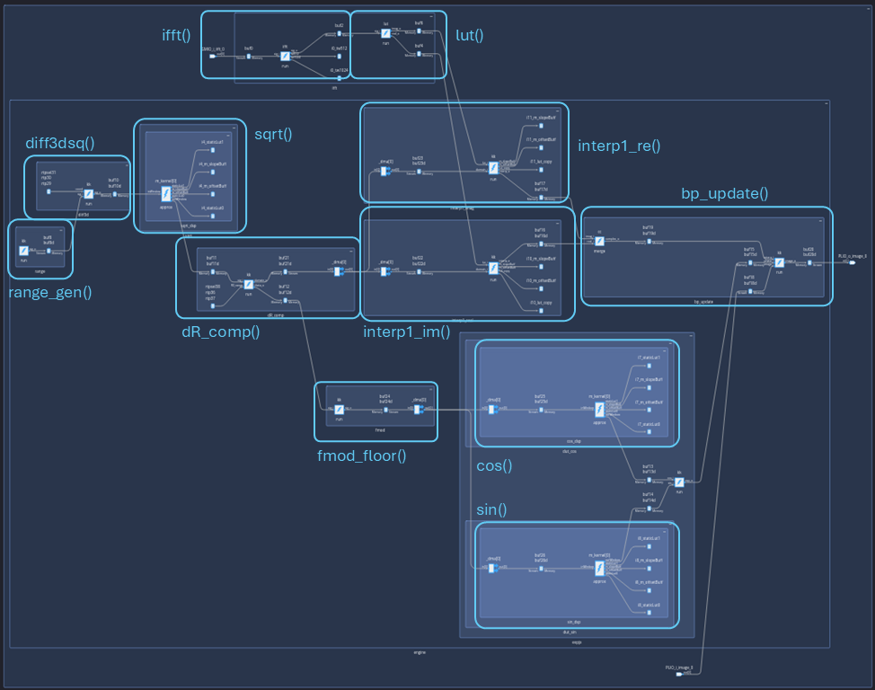

### Floorplan View

The floorplan view of the SAR BP engine design is shown in the following figure. Mapping and placement are achieved using a "bounding-box" constraint with a $4\times 8$ rectangle of tiles. AI Engine compilation uses `Xmapper=BufferOptLevel9` to ensure there are no memory bank conflicts that could stall the pipeline.

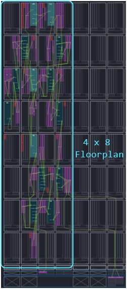

### Resource Utilization

The AI Engine resources for the SAR BP engine are shown below. The design uses 14 tiles for compute and 26 tiles overall for compute and buffering. Recall the earlier system partitioning analysis estimated a total of 31 tiles, indicating this initial provisioning was not overly aggressive. The engine requires a total of four GMIO interface ports. The memory footprint of the design is quite large but the mapper/router is able to automatically find a contention-free solution with a simple area group constraint. 

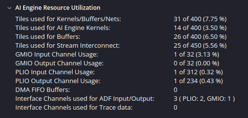

### Throughput and Latency 

This section investigates the throughput and latency of the SAR BP engine using both hardware emulation and hardware. 

#### Hardware Emulation

The single engine version of the design may be evaluated for its throughput andd latency using hardware emulation. The simulation is run for only `NPULSE_USE=2` and `NFRAME=1` to make this practical (see [Line 13](../aie/sar_top_1engine/sar_top_1engine_cfg.h#L13) and [Line 18](../aie/sar_top_1engine/sar_top_1engine_cfg.h#L18) in `sar_top_1engine_cfg.h`). The simulation waveforms provide a means to investigate the behavior of the circuit. A diagram of the waveforms is given below. Some important observations include the following:

* The waveforms show the AXI-S stream traffic between the PL URAM buffer and the AI Engine array over the two streams `aie_to_buff` and `buff_to_aie`.
* The top-most waveform shows the initial IFFT computation occuring before any data returns to the PL URAM over `aie_to_buff` is $\approx 30 \mu s$.
* The middle waveform shows the time period for processing a single radar pulse is $\approx 662.6 \mu s$.
* The bottom waveform shows the time period for uploading the final target image is $\approx 720.9 \mu s$.
* Based on these values, we can compute an approximate frame rate for processing 586 pulses as $1/(30e-6+586*662.6e-6+720.9e-6) \approx 2.6$ frames per second. This is very close to the frame rate predicted during system partitioning.
* The frame rate as measured by the time stamps (see below for details) is 1.65 fps, a lower number because the image upload time is amortized over only two radar pulses in this case. 

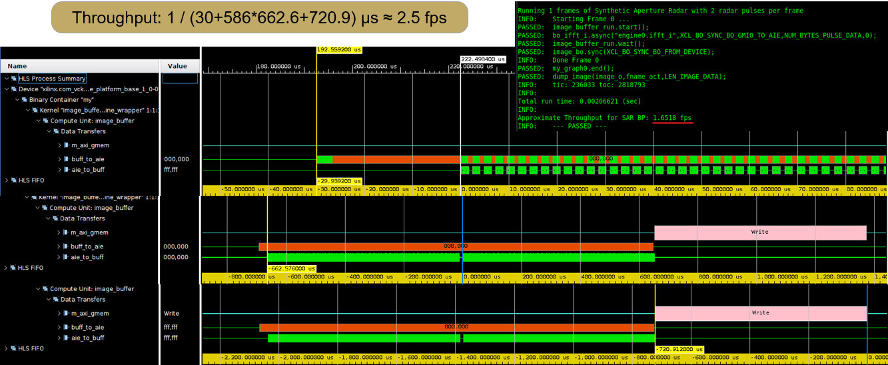

The latency of the design can be considered as the time required for processing the full target image less the upload time assuming the image is produced as new IFFT radar pulses are streamed into the engine. In this case, the latency includes that of the IFFT processing plus the time required to process all the radar pulses. This amounts to approximately $390  ms$ for a full compliment of 586 radar pulses as shown in the following figure. 

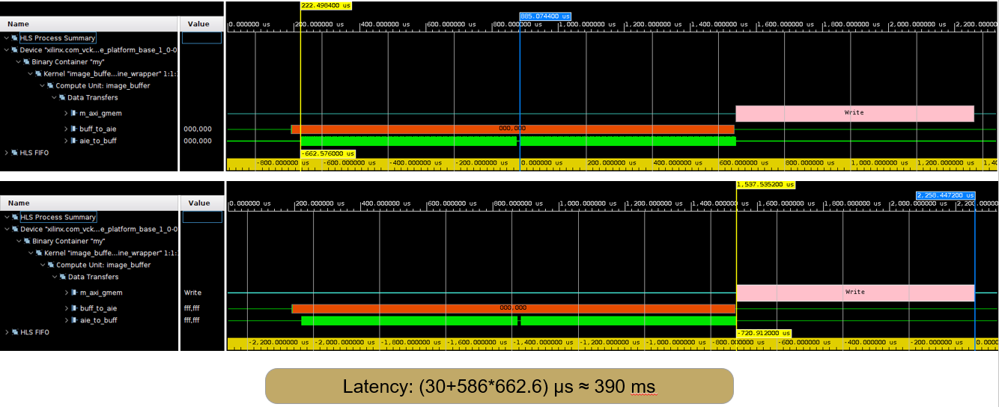

#### Hardware

The single engine version of the design may also be run in hardware on the VCK190 evaluation board. In this case, `NPULSE_USE=586` and `NFRAME=16` to run a full 16 frames with the full compliment of radar pulses for each. Throughput is measured using the `xrt::graph::get_timestamp()` function that returns a time stamp from the AIE array. The difference between two such timestamps provides the number of AI Engine clock cycles between the them. Specifically, two time stamps are taken in [Line 178](../device1/host.cpp#L178) and [Line 208](../device1/host.cpp#L208) of `device1/host.cpp`. A screenshot of this run captured from the VCK190 board is shown below.

* Note the final throughput computed using `xrt::graph::get_timestamp()` is 2.6 frames per second. This matches well to the estimate computed from the 2-pulse simulation performed via hardware emulation. 

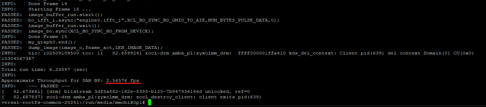

### Block Design: `ifft2k_async()`

Details of the `ifft2k_async()` block are shown in the following figure.

* The `ifft2k_async()` graph contains two kernels, the `ifft()` and the `lut()`. Both use a `repetition_count=1` to perform their workloads once per graph iteration.
* Single I/O buffering is used throughout the design to minimize its memory footprint without significant impact to throughput performance.
* The design implements the `ifft()` kernel using custom AIE API rather than using the DSP library because the kernel must perform a $1/N_{FFT}$ scaling and a `fftshift()` reordering of the front and back halves of the output data. 
* The `lut()` kernel computes the slope and offset LUTs required by the downstream `interp1()` graph to perform linear interpolation of the `ifft()` outputs. Separate LUTs are produced for the real and imaginary parts of the `ifft()` output. The slope and offset entries of the last bin in the both output LUTs are set to zero for simplicity to align with the approach used for the `sin()` and `cos()` blocks below.
* Two dummy output kernels are used to validate the overall graph due to the fact that the output LUTs employ asynchronous single buffering.
* The throughput of ~115 Msps exceeds the worst-case requirement of 26 Msps identified during system partitioning when using eight engines to achieve a total aggregate throughput of > 20 fps.
* The latency of the design is ~32 µs.

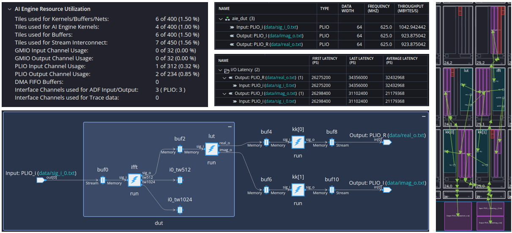

### Block Design: `range_gen()`

Details of the `range_gen()` block are shown in the following figure.

* The `range_gen()` contains a single kernel that generates the $(x,y,z)$ position across the target scene. This block uses a `repetition_count=1` to perform its workload once over each graph iteration.
* The $x$ and $y$ coordinates are computed based on the resolution computed from the radar system parameters. The $z$ coordinates are all set to zero in the absence of any targeting height information.
* The `range_gen()` generates the coordinates in the order expected by the `diff3dsq()` block to follow.

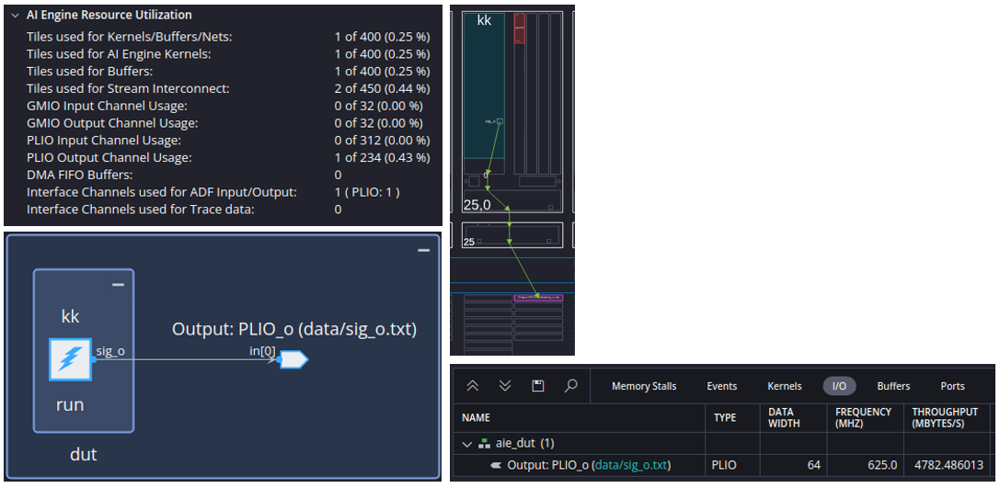

### Block Design: `diff3dsq()`

Details of the `diff3dsq()` block are shown in the the following figure.

* The `diff3dsq()` graph computes the squared Euclidean distance between the antenna platform $(A_X,A_Y,A_Z)$ and every position $(x,y,z)$ in the target scene.
* The graph contains a single kernel that uses a `repetition_count=256` and a I/O buffer size of 1024 samples to perform the full compute workload of the target image in one graph iteration.
* The graph also scales its output by a fixed factor `sqrt_compress = 1.025640994e-08` to compress its dynamic range to the $1 \le x \lt 4$ range required for the downstream `sqrt()`. This constant was identified by examining the full dynamic range over the GOTCHA data set (but could be parameterized in principle).
* The graph uses a vector RTP of tuples $(A_X,A_Y,A_Z)$ to define the array platform coordinates for each radar pulse to be processed. 
* The initiation interval $II=47$ is not the best pipelined solution here, but its throughput of 410 Msps is sufficient to meet the 400 Msps target of the design.

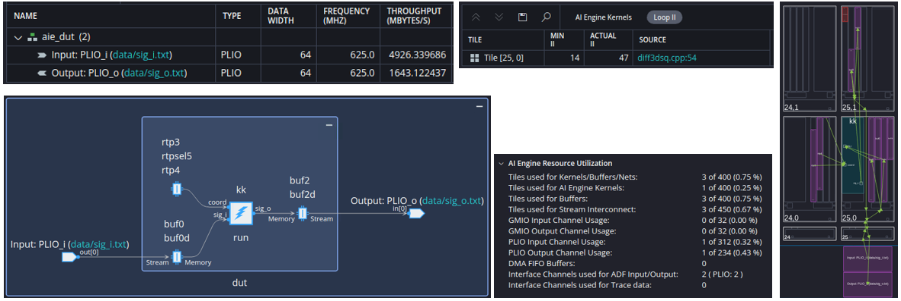

### Block Design: `sqrt()`

Details of the `sqrt()` block are shown in the following figure.

* The `sqrt()` graph is an instantiation of the `func_approx()` IP from the Vitis DSP Library configured with `TP_COARSE_BITS=10`. This yields an accuracy better than 1e-06 across the input range of $1 \le x \lt 4$.
* The graph is configured for `repetition_count=256` and uses I/O double buffers with 1024 samples each.
* The memory footprint for this block is large due to the lookup tables. 
* The design throughput of 437 Msps exceeds the design target of 400 Msps.

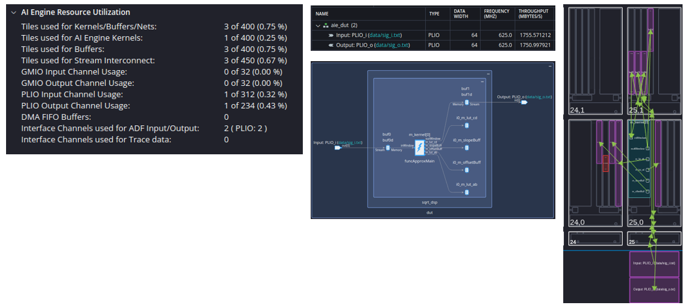

### Block Design: `dR_comp()`

Details of the `dR_comp()` block are shown in the following figure.

* The `dR_comp()` graph applies an expansion gain to restore the output `sqrt()` dynamic range, computes the difference between that output and the $R_0$ range to target scene center, and then applies scaling gains for the downstream `fmod_floor()` and `interp1()` graphs to manage dynamic ranges of those functions.
* The graph uses a vector RTP of distances $R_0$ for each radar pulse to be processed. 
* The downstream output for `fmod_floor()` is scaled by the radar parameters [[2]] $2F_{min}/c$ as required by the MATLAB system model. The factor of $/pi$ is omitted as it will be incorporated into the LUT implementations of both `cos()` and `sin()` kernels. 
* The downstream output for `interp1()` is offset and scaled by the inverse of the maximum target scene size $W_r$. This mapping computes $\hat{dR}=0.5+(1/W_r)dR$ such that $\hat{dR}$ runs over the range $(0,1)$ instead of $(-W_r/2,+W_r/2)$. This x-axis normalization simplifies the linear interpolation to follow.
* The design throughput of ~750 Msps exceeds the design target of 400 Msps.

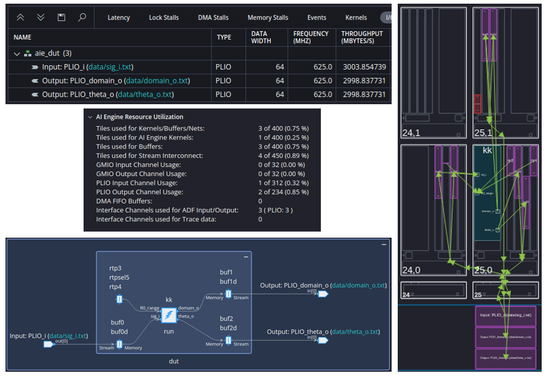

### Block Design: `fmod_floor()`

Details of the `fmod_floor()` block are shown in the following figure.

* The `fmod_floor()` graph reduces its output dynamic range to $(0,1)$ to match that expected by the downstream `expjx()` graph by computing $y=mod(x,1)=x-floor(x)$.
* The output is also clamped at `MAXVAL = 0.9990234375` to align with the highest bin in the LUT-based implementation of `expjx()`. This works together with those downstream graphs to approximate any input falling into this last bin as if it instead fell on the last bin lower edge to improve the accuracy of the approximate implementation. 
* The design throughput of ~480 Msps exceeds the design target of 400 Msps.

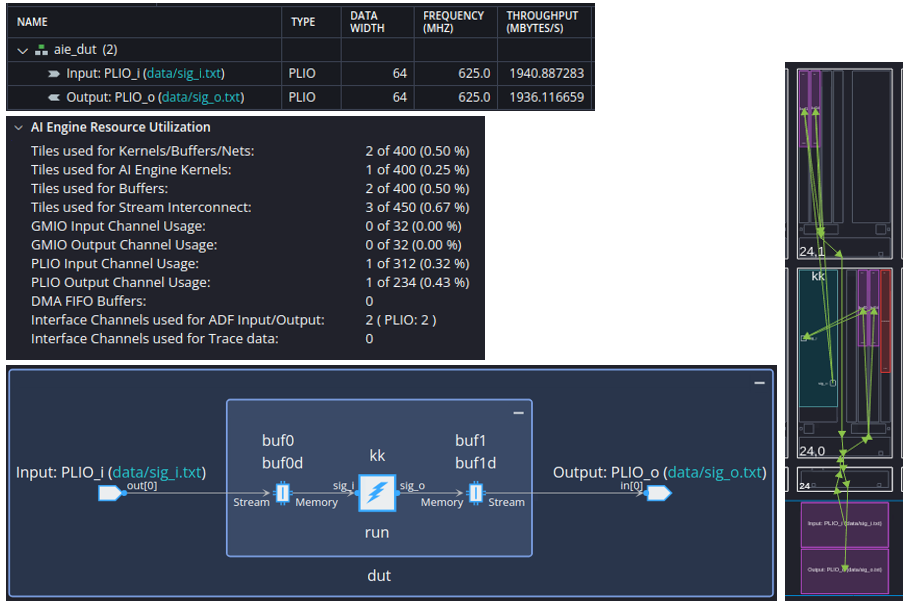

### Block Design: `expjx()`

Details of the `expjx()` block are shown in the following figure.

* The `expjx()` graph computes the complex exponential of its input argument (assumed to be restricted to the $(0,1)$ range) using two underlying instances of the `func_approx()` IP from the Vitis DSP Library, one configured for `cos()` and another configured for `sin()`. Both use `TP_COARSE_BITS=10` to set the resolution of the linear interpolation.
* The initialization code of the `cos()` and `sin()` LUTs for slope and offset are not yet delivered currently in the library, but are provided here in this tutorial.
* The design throughput of ~435 Msps exceeds the design target of 400 Msps.

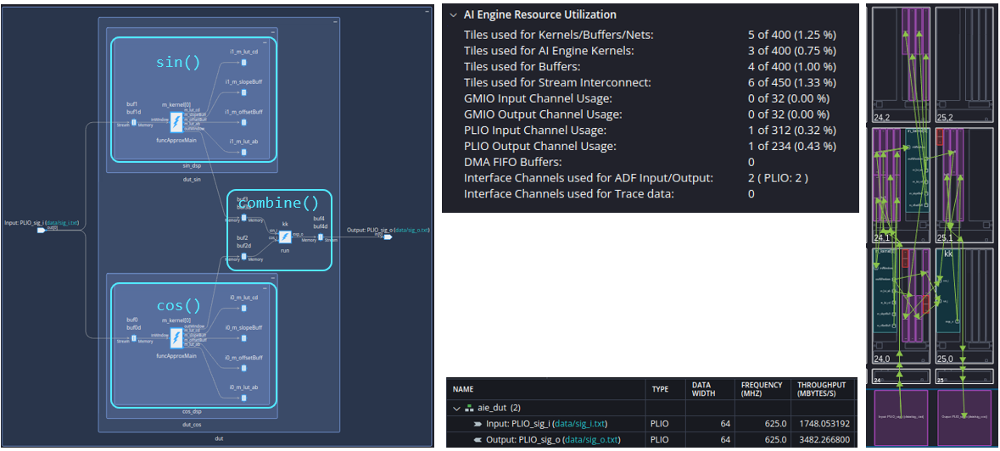

### Block Design: `interp1()`

Details of the `interp1()` block are shown in the following figure.

* The `interp1()` graph performs linear interpolation on the real (or imaginary) part of the `ifft()` output using the slope and offset LUTs produced by that graph. The `dR_comp()` graph produces the x-axis inputs at which the interpolation is performed. The SAR BP engine requires two instances of this block.
* This block is hand-coded in AIE API but the lion share of the code is harvested from the Vitis DSP Library from the `func_approx()` IP. Hand-coding is used so the input buffering of the slope and offset LUTs can be made asynchronous. Currently, the library support is restricted to static LUT configurations but the SAR algorithm requires new LUTs to be computed for each radar pulse. 
* The design throughput of ~430 Msps exceeds the design target of 400 Msps.

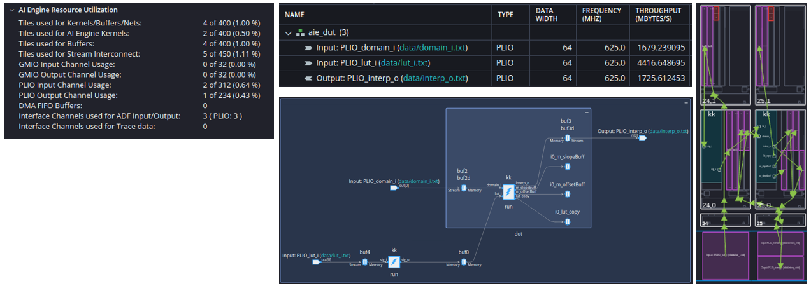

### Block Design: `image_buffer()`

The `image_buffer()` block implements the image I/O buffer for the design; it uses PL URAM for image storage and is designed using Vitis HLS. Details of the block are shown in the following figure.

* The HLS design consists of two phases: the `SEND_PULSES` phase transmits the image stored in the PL URAM to the AI engine over a single AXI-S stream. The image is updated by the BP SAR engine and returned to the PL URAM over another AXI-S stream. The process is repeated for a number of radar pulses `NPULSE_USE` configured via the host software. Once all radar pulses have been processed, the `UPLOAD_IMAGE` phase uploads the final SAR target image to DDR over the NoC.
* The clock rate for the HLS design is 312.5 MHz. AXI-S I/O streams are 128-bit to align with the 1250 MHz @ 32-bit interface of the AI Engine array. The clock domain crossing and data width converter blocks are instantiated automatically by Vitis tools.
* The main resource required is the the 60 URAM blocks required for the image buffer. 

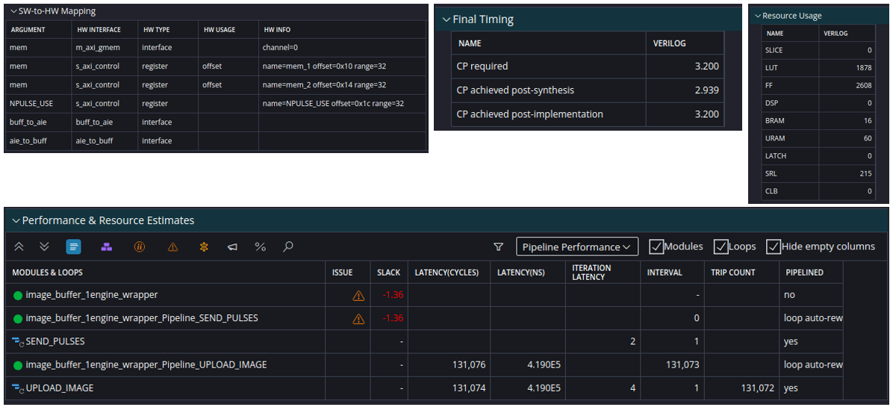

The HLS code for `image_buffer()` needs to be written carefully to handle backpressure on the input and output AXI-S streams. A diagram of the annotated HLS code is shown below. Note a few key aspects of the implementation:

* The `SEND_PULSES` section of the code on Line 12 captures a while loop that manages the read side and write side of the PL URAM image buffer. The write-side address leads the read side address by the latency of the AI Engine implementation. For this reason, we expect an offset between the write and read addresses.
* Backpressure can occur on both the write side or the read side of the buffer. Write-side backpressure happens every radar pulse when the graph stalls waiting for the IFFT to be complete before image processing commences. Read-side backpressure may occur in a similar manner when the final image pixels for a radar pulse have been transferred back to the PL URAM and the AI engine then stalls. 
* We need the read and write sides to stall independently as they may stall at different times. This is achieved by each side validating the state of the AXI-S streams prior to performing a read or a write operation. The aspects of the code involved in these checks are annotated in red in the following figure. 
* On the write side, a check is performed in Line 16 and writes are performed only when the outgoing stream is not already full.
* On the read side, a check is performed in Line 26 and reads are performed only when the incoming stream is not empty.
* The pragma on Line 7 ensures the PL URAM has a latency of only 1 cycle. This is needed in order to achieve II=1 pipelined operation of the `SEND_PULSES` task.
* The `UPLOAD_IMAGE` section of the code on Line 38 contains a for loop to transfer the final image back to the host via DDR over the NoC. 

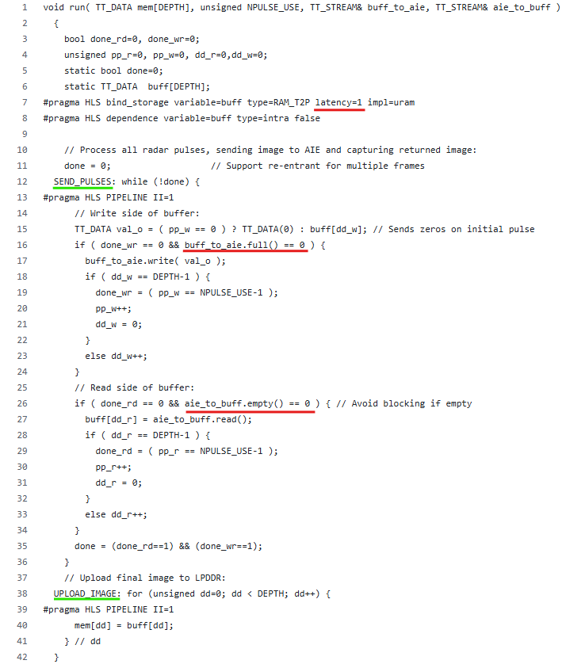

### Final SAR BP Engine Performance

The following figure compares the performance of the final AI Engine implementation vs the ideal MATLAB baseline when run on the GOTCHA data set with a total of 586 radar pulses. This run illustrates the final performance with all the implementation artifacts. The SSIM metric has a value of 0.9965 and the PSNR has a value of 74.1 dB. These compare favorably to the early results computed during system modeling. 

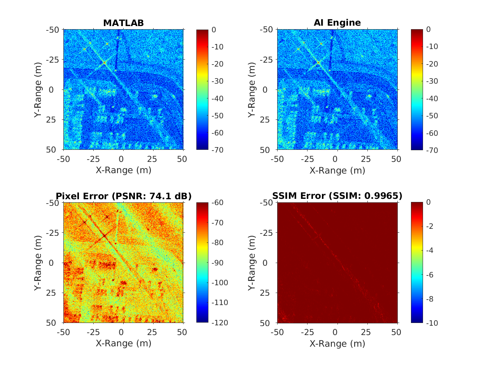

### References

[1]: <https://www.sdms.afrl.af.mil/index.php?collection=gotcha> "GOTCHA Volumetric SAR Data Set"
[[1]]: U.S. Air Force, "GOTCHA Volumetric SAR Data Set", U.S. Air Force Sensor Data Management System.

[2]:<https://www.spiedigitallibrary.org/conference-proceedings-of-spie/7699/1/SAR-image-formation-toolbox-for-MATLAB/10.1117/12.855375.short> "SAR image formation toolbox for MATLAB"
[[2]]: L.A. Gorham & L.J. Moore, "SAR Image Formation Toolbox for MATLAB", SPIE Defense, Security, and Sensing, Orlando, FL, 2010.

Copyright © 2025 Advanced Micro Devices, Inc

<a href="https://www.amd.com/en/corporate/copyright">Terms and Conditions</a>

