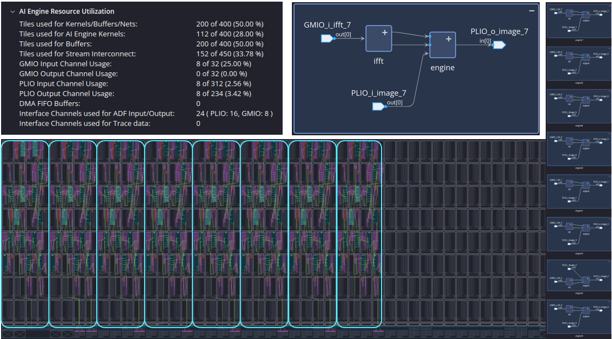
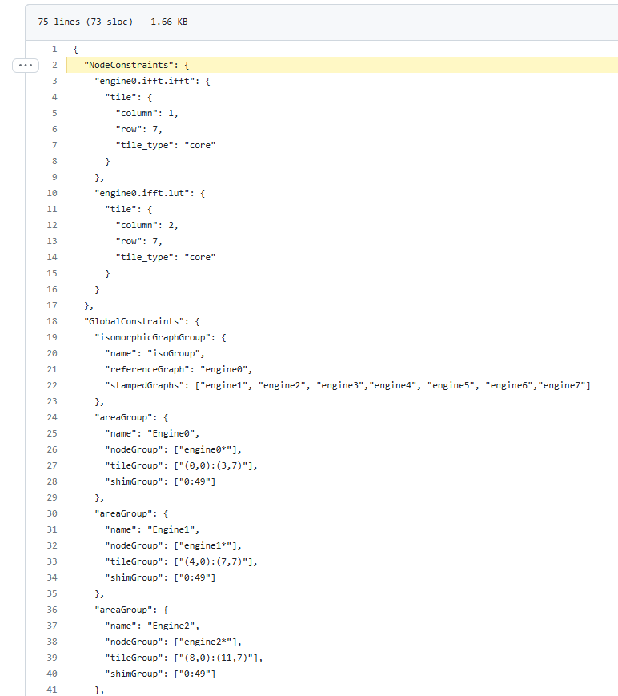
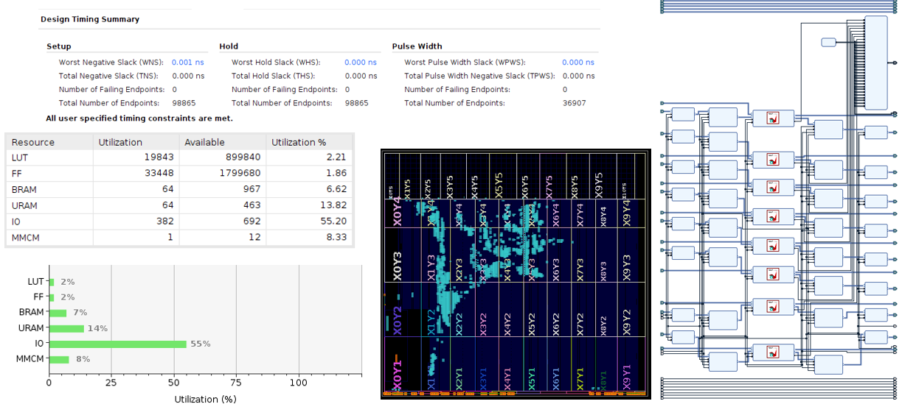
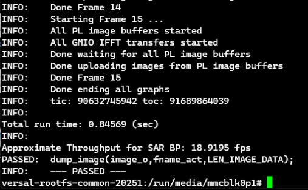

<table class="sphinxhide" style="width:100%;">
  <tr>
    <td align="center">
      <picture>
        <source media="(prefers-color-scheme: dark)" srcset="https://raw.githubusercontent.com/Xilinx/Image-Collateral/main/logo-white-text.png">
        
      </picture>
      <h1>AMD Vitis™ AI Engine Tutorials</h1>
      <a href="https://www.amd.com/en/products/software/adaptive-socs-and-fpgas/vitis.html">Refer to the Vitis™ Development Environment on amd.com</a>
         
      <a href="https://www.amd.com/en/products/software/vitis-ai.html">Refer to the Vitis™ AI Development Environment on amd.com</a>
    </td>
  </tr>
</table>

# Back-Projection for Synthetic Aperture Radar on AI Engines

## Multiple Engines

### Overview

This section provides an overview of the 8-engine design. The design achieves ~8X throughput improvement by splitting the target SAR image into eight pieces, and instantiating eight separate engines in the AIE array to process each piece in parallel. As a result, you require eight separate PL URAM buffers. This is because each buffer requires one eighth the size of the buffer in the single engine design. Overall, the 8-engine design uses the same number of URAM blocks. The following figure shows an overview of the design.

* The design uses eight identical graphs. There is no separate top-level wrapper graph here. This makes the design extension easy but does consume more device resources than required. Additional comments on this follow.
* Each graph is identical, but each has an `ID` template parameter so the PLIO and GMIO inputs are unique. You can see this in [Line 18](../aie/sar_top_1engine/sar_top_1engine_graph.h#L18) of `sar_top_1engine_graph.h`. This parameter also determines which $(x,y,z)$ coordinates the `range_gen()` block generates for each engine.  
* The following figure summarizes AI Engine design resources. The design requires $112$ compute kernels and some $200$ tiles for buffering. There are eight GMIOs to supply the radar pulse inputs to each engine. There are eight pairs of PLIOs to provide the image connections to the PL URAM blocks.

### Placement Constraints

This design employs the "Stamp and Repeat" placement methodology to achieve the regular floorplan shown. In this case, the design adopts the JSON constraints file approach rather than resorting to putting placement constraints in the graph code. The `aie_top_8engine_app.aiecst` file located [here](../aie/sar_top_8engine/sar_top_8engine_app.aiecst) contains the constraints. Some important considerations are as  follows:

* The `NodeConstraints` on [Line 2](../aie/sar_top_8engine/sar_top_8engine_app.aiecst#L2) put tile constraints on the iFFT portion of the design to assist the router in finding a solution. The placement provides sufficient room at the top of the columns for the heavy memory footprint of these kernels.
* The `GlobalConstraints` on [Line 18](../aie/sar_top_8engine/sar_top_8engine_app.aiecst#L18) contain the "Stamp & Repeat" constraints for the 8-engine design. Here, the `isomorphicGraphGroup` identifies the `referenceGraph` as "engine0" and the `stampedGraphs` as "engine1" through "engine7." The following lines define the desired `areaGroup` placements for each engine in terms of the desired `tileGroup` and `shimGroup`, respectively. This enables a set of common tile rectangles to be defined, where a common placement is applied from the "engine0" solution to the remaining engines in the design.
* The mapper/router performs the back-end solution because all placement for "engine0" was solved previously, and is simply copied across all the remaining engines.

### Device-Level Details

This section shows the device-level details of the 8-engine design. The following figure summarizes these.

* The Vitis Region is on the right side of the diagram. There are eight instances of the PL URAM buffer along with the associated clock domain crossing and data width converter blocks to interface the 128-bit @ 312.5 MHz HLS interfaces to the 32-bit AIE interfaces @ 1250 MHz.

* The device level floorplan is on the bottom center of the diagram. Some logic in the diagram corresponds to the PL URAM buffer blocks. The rest is due to the base platform.

* The resource utilization is on the left side. The design is using only 2% of logic resources and 13% of the URAM resources for the PL URAM buffers.

* Vitis achieves timing closure with its default parameters.

### Hardware Throughput

The 8-engine design was also run in hardware on the VCK190 evaluation board. Once again, `NPULSE_USE=586` and `NFRAME=16` was used to run a full 16 frames with the full compliment of radar pulses for each. The throughput was measured using the `xrt::graph::get_timestamp()` function as before. A screenshot captured from the VCK190 board run is shown below.

* The final throughput using `xrt::graph::get_timestamp()` is 18.9 frames per second. This is only slighty lower than 8X times the frame rate achieved with the single engine, indicating the data flow remains efficient even with eight separate engines.

### Opportunities for Optimization

In this tutorial, the 8-engine design was achieved by repeatedly instantiating the single engine design. This leaves a few opportunities for optimization on the table. These options include the following:

* Each engine uses its own iFFT engine to transform the radar pulse. In reality, this operation is common to all engines and an single iFFT graph could achieve it. The output of that common graph could then be broadcast to all eight engines. Clearly from [ifft2k_async()](backproject-engine.md#block-design-ifft2k_async) this approach saves seven instances of six tiles or ~40 tiles. It also removes seven GMIOs from the design which dramatically reduces the NoC bandwidth required to deliver the radar pulses to the AI Engine array from DDR.

* Constructing an 8-engine design with a single iFFT requires some code restructuring because routing the iFFT graph output to all engines requires a new top-level graph. This complicates the "Stamp and Repeat" approach to placement but is manageable.

* You can, in principle, remove the PL URAM portion of the design by partitioning these image buffers to DDR instead of the PL. In this case, the radar processing requires eight GMIO pairs, one pair for each engine. The data flow proceeds from DDR, streaming the input image to each engine over the NoC to the AIE array, updating each image segment by its engine, then streaming the output image back to DDR over the NoC. This removes all PL resources from the design—a significant saving and simplification. You need to optimize the DDR buffer design to maximize the burst bandwidth available to each engine. AMD is currently exploring this variant of the design.

Copyright © 2026 Advanced Micro Devices, Inc

<a href="https://www.amd.com/en/corporate/copyright">Terms and Conditions</a>

