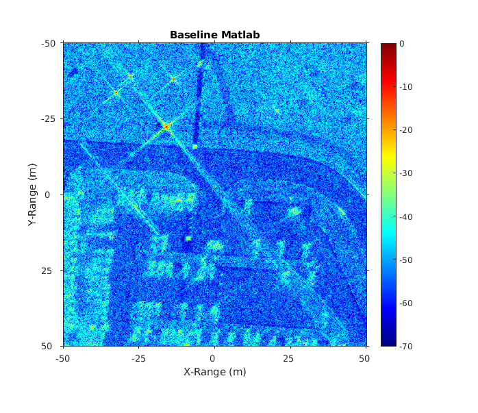
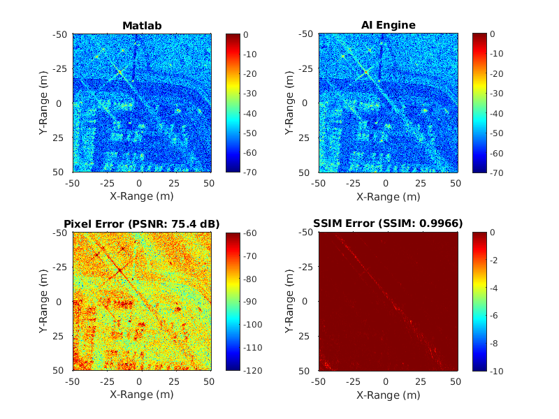
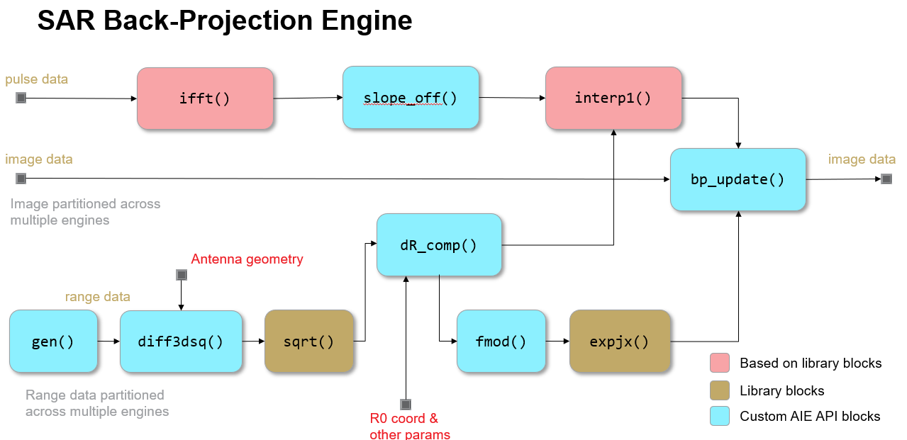

<table class="sphinxhide" style="width:100%;">
  <tr>
    <td align="center">
      <picture>
        <source media="(prefers-color-scheme: dark)" srcset="https://raw.githubusercontent.com/Xilinx/Image-Collateral/main/logo-white-text.png">
        
      </picture>
      <h1>AMD Vitis™ AI Engine Tutorials</h1>
      <a href="https://www.amd.com/en/products/software/adaptive-socs-and-fpgas/vitis.html">Refer to the Vitis™ Development Environment on amd.com</a>
        </br>
      <a href="https://www.amd.com/en/products/software/vitis-ai.html">Refer to the Vitis™ AI Development Environment on amd.com</a>
    </td>
  </tr>
</table>

# Back-Projection for Synthetic Aperture Radar on AI Engines

## System Model

This section covers the development of the MATLAB system model of the SAR Back-Projection algorithm implemented on AI Engines.

### Introduction and Approach

The purpose of the system model is three-fold:

1. Capture the ideal algorithm model and evaluate its baseline system performance using the GOTCHA [[1]] data set.
2. Identify the compute workloads required for the AI Engine implementation.
3. Model any algorithmic imperfections induced by the AI Engine solution and assess their performance impact.

#### Structural Similarity Index Measure

This tutorial adopts the Structural Similarity Index Measure (SSIM) [[2]] as the system metric for evaluating the performance impact of any algorithmic impairments introduced by the AI Engine implementation of the SAR BP algorithms. The SSIM metric is used to measure the similarity between two images and is often adopted as a method of predicting the perceived quality of digital images and videos in various industries. The SSIM provides a perception-based metric that captures changes in image structure that including both luminance and contrast making effects. This differs from mean squared error (MSE) or peak signal-to-noise (PSNR) that typically ignore these structural changes. The SSIM metric for two pictures will evaluate to unity when the pictures are identical (i.e., there is no degradation in the test image), and will decrease towards zero as the test image becomes corrupted. The tutorial adopts a target SSIM=0.99 as the maximum degradation to be allowed for the AI Engine implementation of the SAR BP algorithm (as is also used in [[3]]).

### MATLAB System Model

We start with the baseline MATLAB model for SAR published by Gorham & Moore (refer to [[4]]). This model is well-known and accepted in the SAR community. It provides a solid baseline, and also uses the GOTCHA data set for comparison purposes. We elect to use the same system scenario studied in the paper, namely the "Pass 1 with HH polarization" scenario. This scheme uses an integration angle of 4 degrees centered at 40 degrees azimuth. The scene extent is 100m x 100m with 20 cm pixel spacing, resulting in a 501 x 501 pixel image. Based on the radar parameters, the maximum scene size has a range extent of 101.8 m and a cross-range extent of 108.4 m.

#### Inner Loop Analysis

The following code block shows the inner loop of the system level MATLAB model as outlined in [[4]]. This captures the full algorithmic processing for a single radar pulse. The final SAR image is obtained by processing many radar pulses and combining them coherently.

```
Line  1:  data_o.r_vec = linspace(-data_o.Nfft/2,data_o.Nfft/2-1,data_o.Nfft)*data_o.maxWr/data_o.Nfft;
Line  2:  % Loop through every pulse:
Line  3:    for ii = 1 :  data_o.Np
Line  4:      % Form the range profile with zero padding added:
Line  5:      rc = fftshift(ifft(data_o.phdata(:,ii),data_o.Nfft));
Line  6:      % Calculate differential range for each pixel in the image (m):
Line  7:      dist_sq = (data_o.AntX(ii)-data_o.x_mat).^2 + ...
Line  8:                (data_o.AntY(ii)-data_o.y_mat).^2 + ...
Line  9:                (data_o.AntZ(ii)-data_o.z_mat).^2;
Line 10:      dR = sqrt(dist_sq) - data_o.R0(ii); 
Line 11:      % Calculate phase correction for image: 
Line 12:      phCorr = exp(1i*4*pi*data_o.minF(ii)/c*dR);
Line 13:      % Determine which pixels fall within the range swath:
Line 14:      I = find(and(dR > min(data_o.r_vec), dR < max(data_o.r_vec)));
Line 15:      % Update the image using linear interpolation:
Line 16:      dist_part = interp1(data_o.r_vec,rc,dR(I),'linear');
Line 17:      data_o.im_final(I) = data_o.im_final(I) + dist_part .* phCorr(I);
Line 18:   end % ii
```

The MATLAB model of the SAR BP algorithm when run on the GOTCHA data set for the 40 degree azimuth scenario outlined above yields the following output image shown below. This matches very well to the image shown in [[4]]. A logarithmic scale has been used to display this grayscale image. The `jet` MATLAB colormap has been used to accentuate its dynamic range.



### SAR Back-Projection Compute Workloads

Analysis of the above MATLAB code helps to identify the various compute workloads for the SAR BP algorithm:

* Line 5: The algorithm requires an IFFT that is applied to the radar phase pulse data. A single transform is computed per radar pulse. Its output is used to update all pixels in the target image.
* Line 7: A squared distance measure is computed between the antenna platform $(A_X,A_Y,A_Z)$ and every position $(x,y,z)$ in the target scene.
* Line 10: The differential distance $d_R$ is computed as the difference between the target distance and the range to the scene center $R_0$. This requires a `sqrt()` and subtraction operation for every pixel in the target image.
* Line 12: A complex-valued phase correction term is computed as the output of a complex `exp()` function. Its input argument is the differential distance $d_R$ scaled by a number of the radar parameters, $\pi$, $F_{min}$ and $c$, the speed of light. Once again, these computations must be performed for every pixel in the target image.
* Line 14: This indexing check ensures no computed distances fall outside the radar range. This may be avoided in practice by careful dimensioning of the solution parameters.
* Line 16: A one-dimensional linear interpolation is made between the differential distance $d_R$ based on the radar range profile $r_c$ computed by the IFFT.
* Line 17: Finally, each pixel in the target image is updated by adding the complex-valued product of the phase correction term and the interpolated differential distance.

Based on the analysis above, the following AI Engine kernels are identified to service the overall set of compute workloads:

* `ifft()` -- implement the IFFT transform
* `diff3dsq()` -- compute the 3D squared distance
* `sqrt()` -- compute the square root of the squared distance
* `dR_comp()` -- compute the difference between target distance and the range to scene center
* `fmod_floor()` -- reduce the input argument to `exp()` modulo $2\pi$ (may not be obvious without the discussion below)
* `expjx()` -- compute the complex exponential function
* `interp1()` -- interpolate the differential distance against the fixed radar grid
* `bp_update()` -- update the SAR target image using the phase correction and distance terms.

Note that all AI Engine kernels will use single-precision floating-point data types. This means they can target the vectorized floating-point data path for the AIE architecture to yield good performance.

### Algorithm Adaptations for AI Engine

In some cases, algorithms might need to be modified to better suit the unique characteristics of the AI Engine. Typically this involves how the algorithms are vectorized for cost efficiency. Sometimes such vectorization can alter the algorithms as compared to the original system model. These algorithmic changes must be validated in the system model context to ensure the overall system behavior meets target specifications. To do this, early implementations of such workloads require prototyping to explore both algorithmic accuracy and throughput/cost. Here we consider the former, whereas the latter is investigated in the context of system partitioning. Often, as is the case here, a single prototype can serve both purposes.

The remainder of this section outlines the various algorithm adaptations made for this AI Engine implementation of the SAR BP algorithm.

#### System Parameter Adaptations

It simplifies the AI Engine implementation to modify certain system-level parameters to align with hardware restrictions. In particular, the SAR target image of $501\times 501$ pixels is better implemented as $512\times 512$ pixels to better align with various system memory resources. This makes the total number of pixels divisible by 1024 which helps in both memory management and AI Engine graph and kernel scheduling. This will be seen later.

#### `ifft()` Adaptations

Reference [[4]] recommends that the IFFT size $N_{FFT}$  should be 10 times the length of the radar pulses and a power of two. The radar pulses in the GOTCHA data set each have ~424 samples and so a baseline size of $N_{FFT}=4096$ seems reasonable for the baseline MATLAB system model. This brings challenges for AI Engine implementation because 4096 x 8 Bytes = 32 KB of storage required for a single input or output buffer. Because the memory footprint for the SAR engine is quite large (as outlined in the System Partitioning section), we adopt $N_{FFT}=2048$ for the AI Engine implementation to somewhat alleviate this concern. The radar pulses from the GOTCHA data set are zero-padded from ~424 samples to match $N_{FFT}$.

#### Vectorized Functional Approximation

SAR BP requires vectorized versions of `cos()`, `sin()`, and `sqrt()` for efficient implementation. This tutorial design adopts the new [`func_approx()`](https://docs.amd.com/r/en-US/Vitis_Libraries/dsp/user_guide/L2/func-func-approx.html) element from the [Vitis DSP Library](https://docs.amd.com/r/en-US/Vitis_Libraries/dsp/index.html). This new IP implements LUT-based vectorized linear approximations to functions using a configured table of slope and offset values that describe the function. The library comes with a built-in LUT configuration for the `sqrt()` function. LUT configurations for `cos()` and `sin()` are provided here in this tutorial.

The main consideration when using the `func_approx()` IP is to establish the required accuracy. This translates directly into the memory depth of the LUT. The overall LUT depth is restricted based on the available memory resources in the surrounding tiles. This depth is set by the `TP_COARSE_BITS` parameter and will depend on the data type chosen for the I/O. For the `float` data type used by this SAR BP design, we get an overall table depth of `2*(2^TP_COARSE_BITS)*sizeof(float)` bytes. To attempt to minimize the memory footprint of the overall design, a value of `TP_COARSE_BITS=10` is selected yielding a LUT size of 8 KB.

The `func_approx()` IP is used to implement `cos()`, `sin()`, and `sqrt()` designs, with all three instantiations adopting the same `TP_COARSE_BITS=10` configuration.

One important aspect of these LUT-based function approximations is that their inputs operate over a restricted dynamic range. The library supports three different ranges based on the `TP_DOMAIN_MODE` setting:

* Using `TP_DOMAIN_MODE=0` configures the IP to use an input domain of $0 \le x \lt 1$.
* Using `TP_DOMAIN_MODE=1` configures the IP to use an input domain of $1 \le x \lt 2$.
* Using `TP_DOMAIN_MODE=2` configures the IP to use an input domain of $1 \le x \lt 4$.

In this tutorial, the `cos()` and `sin()` kernels use `TP_DOMAIN_MODE=0` whereas the `sqrt()` kernel uses `TP_DOMAIN_MODE=2`. These selections impact the dynamic range of their input signals, and these must be managed carefully across the AI Engine design. One impact of having the input domain restriction on the `sqrt()` kernel is that fixed pre-scaling and post-scaling is required around the LUT-based function approximation. In this tutorial, these constants are pre-computed based on the worst-case characteristics of the GOTCHA data set. The input domain restriction on the `cos()` and `sin()` kernels implies that the input argument for the `expjx()` kernel (which is the common input to the underlying `cos()` and `sin()` kernels) must be reduced modulo $2\pi$ and scaled to the range $(0,1)$. Further details are presented later in the tutorial.

#### `interp1()` Adaptations

Because `interp1()` performs linear interpolation and this is what the new `func_approx()` library element does, the latter may be used to directly implement the former. The `TP_COARSE_BITS=11` parameter must be chosen to match the size $N_{FFT}$ of the transform implemented by the `ifft()` kernel. The LUT containing the slope and offset values to effect the linear interpolation between bin edges must be computed by the AI Engine hardware based on the outputs produced by each `ifft()` kernel invocation. This reconfigurable LUT option is not currently supported by the library however, so a custom-coded block based on the library design is developed for this tutorial.

#### `fmod_floor()` Adaptations

The `fmod_floor()` kernel is absent in the original baseline MATLAB code, but becomes necessary due to the input domain restriction on the `cos()` and `sin()` kernels. The tutorial design assumes the actual input range $(0,2\pi)$ is mapped in hardware to the range $(0,1)$. This scaling is managed with fixed factors in the `dR_comp()` kernel. It follows the `fmod_floor()` kernel must reduce the input signal to the range $(0,1)$ by computing the $\text{mod}(x,1)$ function. This is done using a custom kernel with float-to-fixed conversions based on some IEEE754 tricks.

### Final AI Engine Algorithm Performance

The impact of all of the algorithm adaptations outlined above was assessed by integrating Vitis Functional Simulation models of four prototype AI Engine graphs into the baseline MATLAB model as follows:

* The IFFT size change was implemented directly in MATLAB code.
* AI Engine prototype graphs were constructed for the `cos()` and `sin()` instantiations of the `func_approx()` Vitis DSP Library IPs.
* An AI Engine prototype graph was constructed for the `fmod_floor()` function.
* An AI Engine prototype graph was constructed for the `sqrt()` instantiation of the `func_approx()` library element. MATLAB code was written to mimic the required pre-scaling and post-scaling around it.

Based on these behavioral AI Engine algorithm models, the performance of the AI Engine implementation was run on the same GOTCHA data set as the MATLAB baseline. The SSIM metric between the original MATLAB baseline and the AI Engine model was evaluated using the built-in `ssim()` MATLAB function. The results are shown in the following figure. There is good agreement between the baseline model and the AI Engine implementation. The algorithm adaptations introduce a minor discrepancy into the output images which are very difficult to see visually and lead to an SSIM of 0.9966 which is deemed to be an acceptable level of degradation.



### SAR BP Engine Block Diagram

Earlier sections review the baseline MATLAB model of the SAR BP algorithm, identify the specific compute workloads required to perform the algorithm, formulate a specific set of AI Engine kernels to tackle these workloads, and consider various algorithm adaptations that yield attractive AI Engine implementations of those kernels. Early prototyping work validates the performance of these algorithm variants in the context of the MATLAB system model using Vitis Functional Simulation. These results may now be summarized in the functional block diagram of an AI Engine based computation engine for SAR BP shown below. The diagram captures ten different functional blocks and identifies the required data flow between them. Configuration input data is shown in red text and the I/O data path is shown in gold text. These are identified from the baseline MATLAB model. The legend indicates an early identification of implementations of these blocks based on the analysis above including library blocks, customized library blocks or fully custom blocks. The next step is to conduct system partitioning to identify AI Engine solutions for all blocks, define the data flow between them, and quantify the throughput performance and resource estimates for the design proposal.



### References

[1]: <https://www.sdms.afrl.af.mil/index.php?collection=gotcha> "GOTCHA Volumetric SAR Data Set"
[[1]]: U.S. Air Force, "GOTCHA Volumetric SAR Data Set", U.S. Air Force Sensor Data Management System.

[2]: <https://en.wikipedia.org/wiki/Structural_similarity_index_measure#:~:text=The%20structural%20similarity%20index%20measure,the%20similarity%20between%20two%20images.> "SSIM"
[[2]]: Wikipedia, "Structural Similarity Index Measure".

[3]: <https://ieeexplore.ieee.org/document/10396232> "IEEE-10396232"
[[3]]: R.P. Duarte et. al., "Hardware Accelerated Backprojection Algorithm on Xilinx Ultrascale+ SoC-FPGA for On-Board SAR Image Formation", European Data Handling & Data Processing Conference, Oct. 2023.

[4]:<https://www.spiedigitallibrary.org/conference-proceedings-of-spie/7699/1/SAR-image-formation-toolbox-for-MATLAB/10.1117/12.855375.short> "SAR image formation toolbox for MATLAB"
[[4]]: L.A. Gorham & L.J. Moore, "SAR Image Formation Toolbox for MATLAB", SPIE Defense, Security, and Sensing, Orlando, FL, 2010.

<p class="sphinxhide" align="center"><sub>Copyright © 2025 Advanced Micro Devices, Inc</sub></p>
<p class="sphinxhide" align="center"><sup><a href="https://www.amd.com/en/corporate/copyright">Terms and Conditions</a></sup></p>
