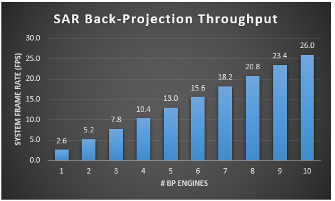
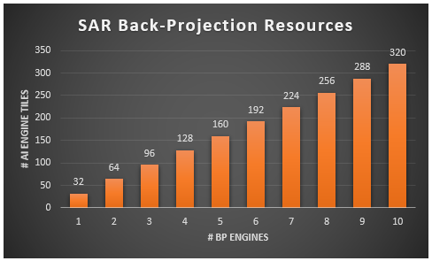

<table class="sphinxhide" style="width:100%;">
  <tr>
    <td align="center">
      <picture>
        <source media="(prefers-color-scheme: dark)" srcset="https://raw.githubusercontent.com/Xilinx/Image-Collateral/main/logo-white-text.png">
        
      </picture>
      <h1>AMD Vitis™ AI Engine Tutorials</h1>
      <a href="https://www.amd.com/en/products/software/adaptive-socs-and-fpgas/vitis.html">Refer to the Vitis™ Development Environment on amd.com</a>
         
      <a href="https://www.amd.com/en/products/software/vitis-ai.html">Refer to the Vitis™ AI Development Environment on amd.com</a>
    </td>
  </tr>
</table>

# Back-Projection for Synthetic Aperture Radar on AI Engines

## System Partitioning

The previous section developed a baseline MATLAB model for the SAR BP algorithm. It identified certain algorithm adaptations to make the compute workloads better suited to AI Engine implementation. The performance of this new BP algorithm was evaluated using the system model context with Vitis Functional Simulation of some early AI Engine implementation models. After confirming the system performance is acceptable, the next step requires system partitioning work. This identifies a feasible architecture, data flow, and kernel partitioning that leads to a workable design with attractive performance characteristics and cost effective resource profile. That is the subject of this section.

### System Parameters & Performance Targets

The first system partitioning step identifies the system parameters to use when designing the SAR BP engine. The following table shows a proposed set of system parameters. These parameters are influenced by the GOTCHA data set [[1]] proposed for evaluating the system performance.

| Parameter      | Value | Units | Notes |
| ----------- | ----------- | --- | --- |
| Image Width/Height | 512 | pixels | Assume square image |
| # of pulses   | 586 | pulses | For 5 azimuth angles of GOTCHA data set |
| Target throughput | 1 | GOPs/sec | Rate of per-pixel back-proj OPs |
| iFFT Transform Size | 2048 | points | Based on system model | 

The parameters shown drive the overall system performance and cost of the solution. The computational complexity of the algorithm is $O(N^3)$ for $N\times N$ pixel images. The workload scales linearly with the number of radar pulses to combine coherently. The iFFT cost varies as $(N\cdot\log(N))$ and can require a large memory footprint. 

The "1 GOPs/sec" figure of merit represents the rate of BP operations on a pixel-by-pixel basis. This value represents a placeholder for now. A fundamental open question at this point is what throughput can an AI Engine implementation sustain for the SAR BP algorithm? The answer requires some early prototyping. For now however, it is useful to consider what system performance can be achieved based on this number. We resort to spreadsheets to answer this question. 

A key focus of the system partitioning activity is to identify both system performance measures and block-level requirements for the design based on the parameters in the preceding table. The following table computes various system parameters of interest and block requirements based on the parameters above. The following values assume a 1 GOPs/sec throughput to start. This is a somewhat useful and optimistic value as it aligns well to the 1 GHz clock rate of the AI Engine array. Further refinement of this value requires some early prototyping. This helps you understand what sampling rates are feasible (and with what resource profile) before architecting a solution.

| Parameter | Value | Units | Notes |
| --- | --- | --- | --- |
| Final frame rate | 6.5 | fps | All pulses accumulated |
| Per-Pulse frame rate | 3820 | fps | For a single pulse |
| Image Storage in DDR | 2 | MB | Assume 8B per pixel |
| iFFT Transform Rate | 3820 | Hz | One transform per radar pulse |
| iFFT Sampling Rate | 8 | Msps | Assume streaming solution |
| Total # of AI Engine tiles | TBD | tiles | Require prototyping |

### AI Engine Prototyping

All required compute workloads were identified during system modeling and validated in terms of their algorithmic performance. However, none have yet been quantified in terms of their throughput performance and resource requirements. That is the focus of this section. The following table summarizes kernels and their characteristics in detail. The table summarizes only the final prototyping results. This is because the final kernel designs are reviewed in detail in subsequent sections. See the source code for specific details between the early prototypes and the final designs. The `proto` folder contains all prototyped kernels. 

The main goal of prototyping is to quickly establish a simple working data flow model of the kernel. Sometimes, this is a rapid prototype that is not bit-accurate nor functional but models data flow correctly. More detailed and accurate prototyping is necessary when there is significant inherent risk due to unfamiliar workloads. This situation applies here. But still, the prototypes should not be full designs. Here, you implement quick prototypes with models that do not model the full signal processing required for all kernels. The prototypes only include the key workloads. The prototypes omit operations such as dynamic range management, scaling, etc. You can compare the prototype code in the `proto` folder with the code for the final design in the `aie` folder.

The following table summarizes the result of prototyping. Note the following details of the prototyping results:

* A library block was used to prototype `ifft4k()` quickly. This requires 11 tiles. It is likely that the smaller `ifft2k()` design requires half as many tiles, so including this larger design builds margin into our resource estimate.
* No prototype was built for the `dR_comp()` kernel because it represented a simple subtraction workload that yields excellent performance. A guess of three tiles resources is used to align with the larger memory footprint found in the other prototyped kernels. This introduces some additional margin to reduce risk.
* The `sqrt_lib()`, `cos_lib()`, and `sin_lib()` kernels use library blocks for quick prototyping.
* The `interp1()` kernel was not prototyped because it is anticipated to use the underlying library block implementation with some custom coding to manage asynchronous buffers. Here its performance and resources are based on the library blocks.

| Kernel | Throughput (Msps) | # Tiles | Notes |
| --- | --- | --- | --- |
| ifft4k() | 180 | 11 | Trim to 5 tiles for 2K-pt |
| diff3dsq() | 433 | 2 | |
| dR_comp() | no proto | 3 | Guess # tiles |
| sqrt_lib() | 420 | 2 | Library |
| fmod_floor() | 375 | 1 | Need to optimize |
| cos_lib() | 420 | 3 | Library |
| sin_lib() | 420 | 3 | Library |
| interp1() | 420 | 4 | Guess based on Library |
| bp_update() | 620 | 2 | |
| **Overall**| **400** | **31** | **Target 4 x 8 array** |

### SAR BP Engine Design Proposal

Early prototyping of the various workloads identifies some common trends and clear conclusions:

* The iFFT throughput (which was prototyped for the 4K-pt size as compared to the reduced-footprint 2K-pt size) of 100 Msps comfortably exceeds the 8 Msps requirement above assuming a 1G BP OPs/sec throughput. This conclusion carries over safely to the 2K-pt size identified in the system modeling phase.
* Most of the remaining compute workloads that operate pixel-by-pixel achieve a throughput in the mid 400 Msps range, with a few kernels achieving two to three times this much. It follows then, one straightforward approach is to design a SAR BP engine capable of ~400 Msps throughput based on these early prototype kernel architectures. Note the `fmod_floor()` prototype kernel does not meet this 400 Msps throughput target. Its implementation needs to be optimized using code refactoring and improved software pipelining (or it can split across multiple instances). The design phase covers these details.
* The memory footprint of these kernels is large across the board. Each kernel typically requires a single compute tile but burns 2 to 4 tiles in memory. 
* Based on this early estimate of 31 tiles and the expectation that the size of the `ifft2k()` kernel frees up 5 or 6 tiles, it makes sense given the array geometry to provision for a $4\times 8$ engine configuration with 32 tiles. This provides some resource margin.

### Projected System Throughput

Given the proposed architecture of a single SAR BP engine as a $4\times 8$ rectangular array of tiles capable of achieving ~400 Msps pixel-by-pixel throughput, these assumptions can be inserted back into the system partitioning spreadsheet to investigate the capability of larger solutions using several identical instances of this baseline engine. Each engine instance can be assigned its own portion of the target output image to realize a linear scaling in throughput capacity. The following chart shows the resulting system frame rate. The baseline engine achieves a system frame rate of 2.6 fps. A design with eight engine instances can achieve a system frame rate of 20.8 fps in principle.

### Projected System Resources

Similarly, you can tweak the spreadsheet to compute the amount of AI Engine tile resources to implement the various multi-engine designs. The following chart shows the result. The design with eight engine instances requires 256 tiles of resources. 

### Next Steps

Based on the system partitioning work and early prototyping performed in this section, you have identified a suitable architecture for a SAR BP engine with 32 tiles arranged in a convenient $4\times 8$ rectangle. You have also quantified performance through spreadsheet techniques. Estimates of 25 utilized tiles ensure the proposed architecture provides some margin for unforseen functional additions and should yield sufficient flexibilty for automatic mapping/routing by the AI Engine tools. The regular geometry of the engine should be ideal for placing multiple instances to achieve a design with even higher thoughput. The remainder of this tutorial presents the details of a SAR BP engine based on this proposal. It then considers a higher throughput variant with multiple engine instances. 

### References

[1]: <https://www.sdms.afrl.af.mil/index.php?collection=gotcha> "GOTCHA Volumetric SAR Data Set"
[[1]]: U.S. Air Force, "GOTCHA Volumetric SAR Data Set", U.S. Air Force Sensor Data Management System.

Copyright © 2025 Advanced Micro Devices, Inc

<a href="https://www.amd.com/en/corporate/copyright">Terms and Conditions</a>

