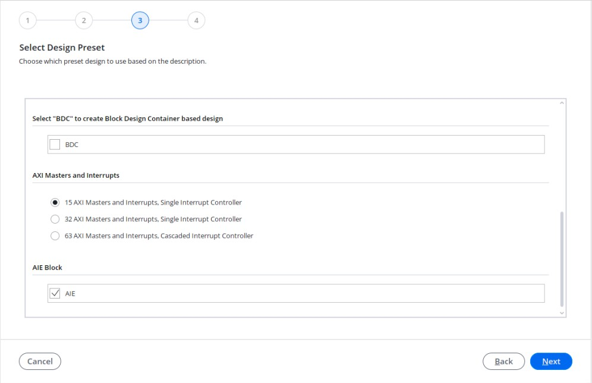
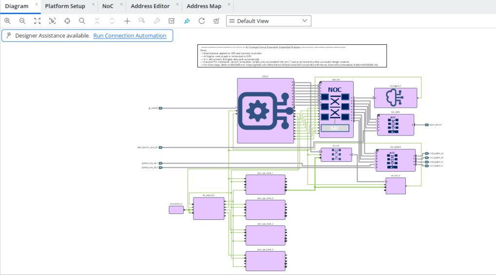
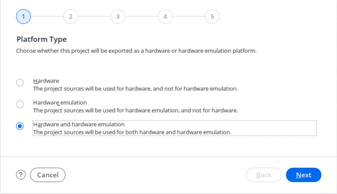
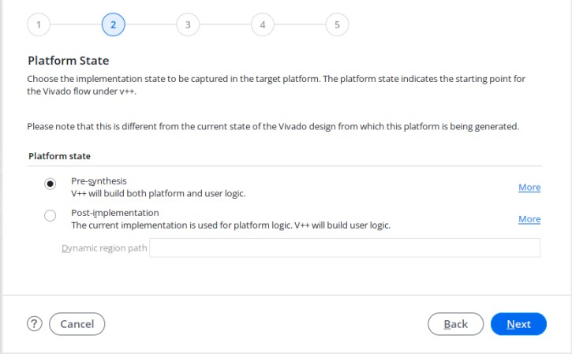
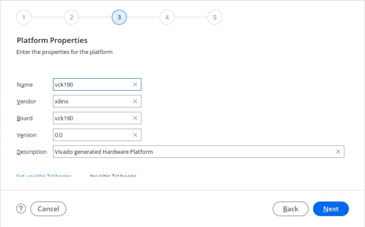
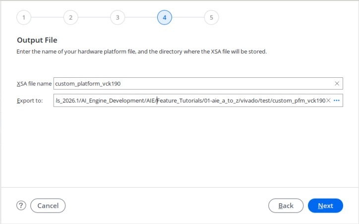
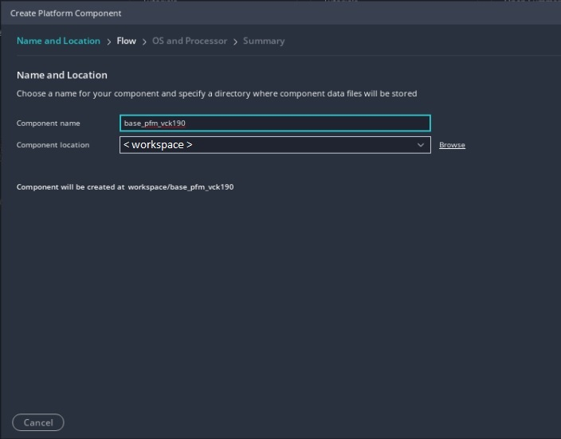
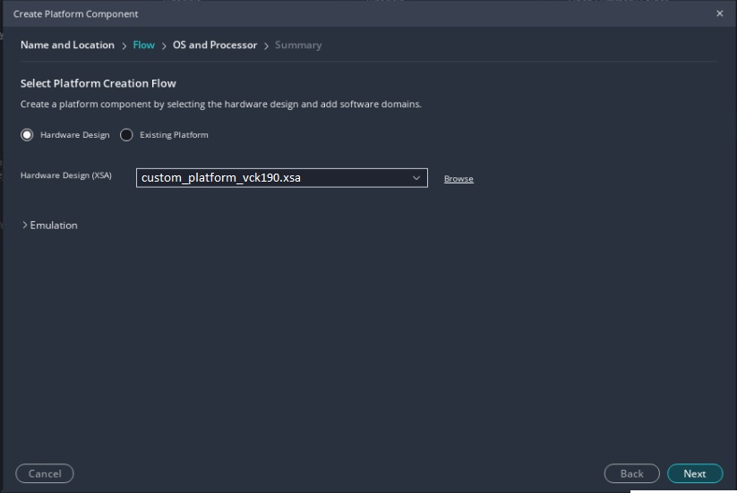
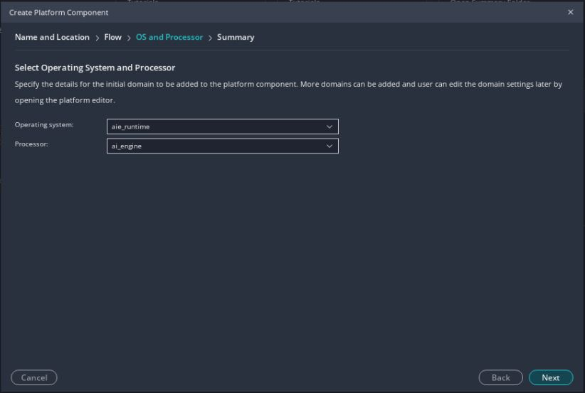
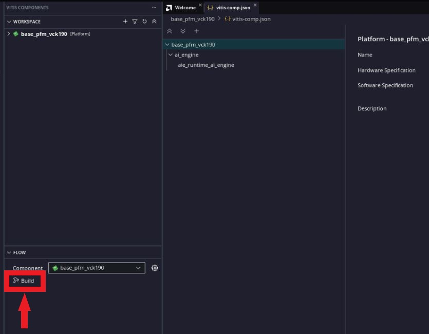

<table class="sphinxhide" style="width:100%;">
  <tr>
    <td align="center">
      <picture>
        <source media="(prefers-color-scheme: dark)" srcset="https://raw.githubusercontent.com/Xilinx/Image-Collateral/main/logo-white-text.png">
        
      </picture>
      <h1>AMD Vitis™ AI Engine Tutorials</h1>
      <a href="https://www.amd.com/en/products/software/adaptive-socs-and-fpgas/vitis.html">See Vitis™ Development Environment on amd.com</a>
         
      <a href="https://www.amd.com/en/products/software/vitis-ai.html">See Vitis™ AI Development Environment on amd.com</a>
    </td>
  </tr>
</table>

# Custom Platform Creation

## Platforms

A platform is the starting point of your design and is used to build the AMD Vitis™ software platform applications.

>**NOTE**: Use the VCK190 base platform provided on amd.com as a starting point for your designs. This page explains how to generate the base platform. If you want to skip this step, start directly from [AI Engine Development](./02-aie_application_creation.md).

In this first section of the tutorial, an example shows how to create a new platform. This starts with building the hardware system using the AI Engine in the AMD Vivado™ Design Suite.

This is in most ways a traditional AMD Vivado™ design. You are building the platform, that is, the part of the design that you do not want the Vitis software platform to configure or modify. This can include completely unrelated logic, any hierarchy you want to have in the design, but there are some rules that you must follow:

- Your design must contain an IP integrator block diagram containing the CIPS, NOC, and other infrastructure IP.
- Your design must have at least one clock that you expose to the Vitis IDE for use with any kernels that it adds.
This clock must have an associated `proc_sys_reset` block.

This tutorial targets the VCK190 board (refer to <https://www.xilinx.com/products/boards-and-kits/vck190.html>).

### Step 1: Build the AMD Versal™ Extensible Embedded Platform Example Design in the Vivado IDE

1. Launch Vivado IDE, and select ***Open Example Project*** from the Welcome window. You can also do it by clicking ***File*** from the menu, and selecting ***Project → Open Example***.

2. Click ***Next*** to skip the first page of the wizard. In the template selection page, select the ***Versal Extensible Embedded Platform*** template. Click ***Next***.

3. Name this project as ***custom_pfm_vck190*** and click ***Next***.

4. In the board selection page, select ***VCK190 Evaluation Platform***. If you are targetting other platforms, select them. Click ***Next***.

5. In the design preset page, keep the default settings. Note that AI Engine is enabled:

      

6. Click ***Finish*** to complete the example design creation phase. This opens the Vivado project with the template design you just created. You can open the block design to view the details of the platform design. By using the pre-built template, you can get a validated hardware design of the platform to move on to the next step. In your real design development procedure, you can use this as a baseline design and make further modifications on top of it.

      

7. Click ***Generate Block Design*** from the Flow Navigator panel on the left, click ***Generate***, and wait for the process to complete.

      >**NOTE**: The Vivado IDE displays a critical warning when generating the Block Design. This is because the Interrupt Controller IP has an unconnected input. You can ignore this as the Vitis software platform connects this input automatically later in the flow.

8. Click ***File*** from the menu, and select ***Export*** > ***Export Platform***.

   a. On the second page, select ***Hardware and hardware emulation*** as the platform type.

      

   b. On the third page select ***Pre-synthesis***.

      

   c. On the fourth page, add the name of the platform.

      

   d. On the fourth page, set the name of the XSA, and click ***Finish***.

      

9. Close the Vivado project after platform export process finishes.

      >**Note**:  You can automate the Vivado platform creation by running "make vivado_platform"

### Step 2: Build the Platform in the Vitis Software Platform

1. Open the Vitis Unified IDE, and select a workspace.

2. On the Welcome Page, select ***Create Platform Component***, or select ***File → New Component →  Platform***.

3. Set the platform component name to ***base_pfm_vck190*** and click ***Next***.

      

4. Select ***Hardware Design*** and use the XSA generated during the previous step and click ***Next***

     

5. Set the Operating System to  ***aie_runtime*** and the Processor to ***ai_engine***. Click ***Next***. Then click ***Finish*** to create the platform component.

      

6. Build the platform by clicking ***Build*** in the flow navigator with the `base_pfm_vck190` component selected.

      

      >**NOTE**: If you modify the XSA file later, go to `vitis-comp.json` located in the Settings folder of the platform component and click ***switch xsa***.

7. You can find the generated platform in `base_pfm_vck190/export`.

In this step, you created the platform starting with building the hardware platform in the Vivado Design Suite. Then, you built the platform in the Vitis software platform, based on the exported XSA file.

>**Note**:  The Vivado platform creation can be automated by running "make vitis_platform".

In the next step, build an AI Engine application using this platform.

<b><a href="./README.md">Return to Start of Tutorial</a> — <a href="./02-aie_application_creation.md">Go to AI Engine Development</a></b>

Copyright © 2020–2026 Advanced Micro Devices, Inc.

<a href="https://www.amd.com/en/corporate/copyright">Terms and Conditions</a>

