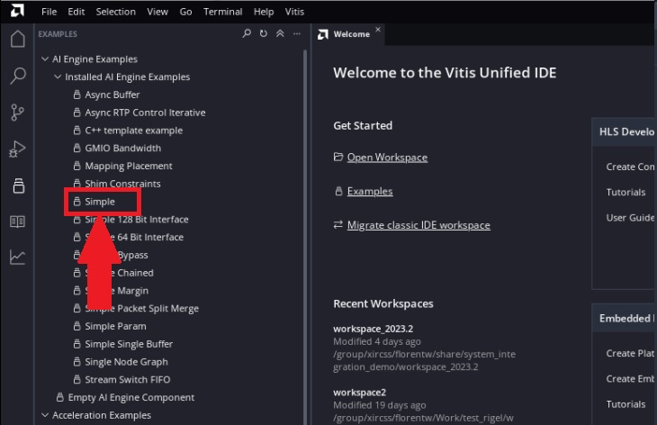
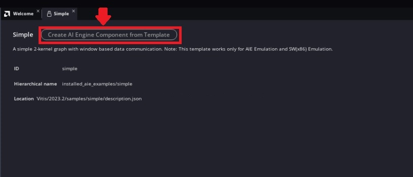
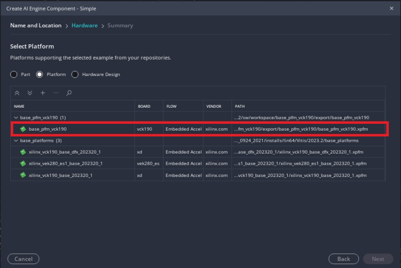
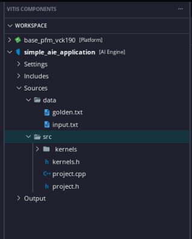
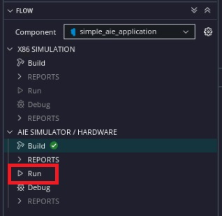
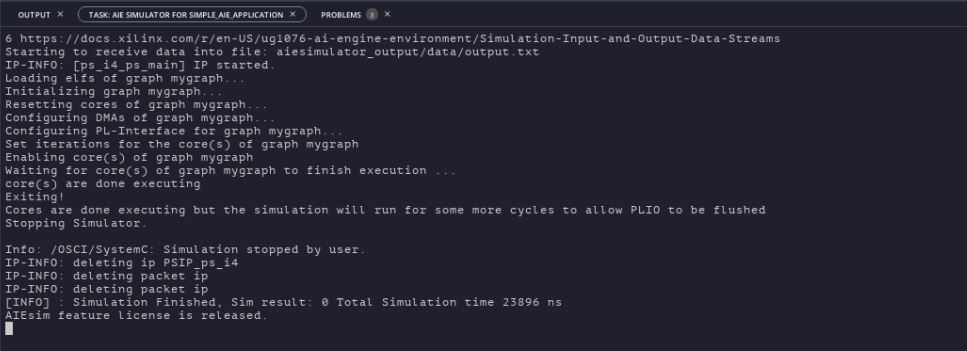

<table class="sphinxhide" width="100%">
 <tr width="100%">
    <td align="center"><h1>AI Engine Development</h1>
    <a href="https://www.xilinx.com/products/design-tools/vitis.html">See Vitis™ Development Environment on xilinx.com</br></a>
    <a href="https://www.xilinx.com/products/design-tools/vitis/vitis-ai.html">See Vitis™ AI Development Environment on xilinx.com</a>
    </td>
 </tr>
</table>

# Introduction - AI Engine Development

In this section of the tutorial, you will learn how to create a new AI Engine application project from a template, and run through the ***Emulation-AIE*** process.

## Step 1: Create a new AI Engine Application Project

1. Open the Vitis Unified IDE if you have closed it. You can use the same workspace as the previous stage or create a new one.

2. Click on ***View > Examples*** to view the application examples installed with Vitis

3. Under **AI Engine Examples > Installed AI Engine Examples** select the ***Simple*** example

      

4. Click ***Create AI Engine Component from Template***

      

      >**NOTE:** In the description of the template, it says that the template works only for AI Engine Emulation and software (x86) simulation. In the following steps, you will learn how to make it work on hardware.  

5. Set the component name as ***simple_aie_application*** and click ***Next***

      

6. On the platform page, select the platform you want to use:

      * If you have created the platform following step 1, select the **base_pfm_vck190** platform you just created. If you do not use the same workspace from last step, click **Add**, and select the folder `base_pfm_vck190/export` to add the platform into this workspace.
      * If you have skipped step 1, select the VCK190 base platform (xilinx_vck190_base_002320_1) which is part of the Vitis installation.

      >**NOTE 1:** Make sure to read, and follow the Vitis Software Platform Release Notes (v2023.1) for setting up software and installing the VCK190 base platform.

      

        >**NOTE 2:** In the Vitis Unified IDE you can also select the device directly (xcvc1902) and link the platform later in the flow

7. Click ***Finish***.

8. The template imports two folders:

      * `src` contains the sources for the kernels and the graph.
      * `data` contains the data for the simulation input (`input.txt`) and the golden reference for the output (`golden.txt`).

      

9. Open the file `project.h` to see the graph. You can see that the graph (simpleGraph) has one input and one output and implements two kernels with the same function. The output of the first kernel feeds the second one.

      ```
      first = kernel::create(simple);
      second = kernel::create(simple);
      adf::connect(in.out[0], first.in[0]);
      connect(first.out[0], second.in[0]);
      connect(second.out[0], out.in[0]);
      ```

      This is the representation of the graph.

      

10. Open the file `kernels/kernels.cc` to see what function will be implemented in the kernels.
You can see that this is a simple operation which is doing the sum of the real and imaginary parts of the input to create the real part of the output and the subtraction the real and imaginary part of the input to create the imaginary part of the output.

      ```
      void simple(adf::input_buffer<cint16> & in, adf::output_buffer<cint16> & out) {
        cint16 c1, c2;
        cint16* inItr = in.data();
        cint16* outItr = out.data();
        for (unsigned i=0; i<NUM_SAMPLES; i++) {
          c1 = *inItr++;
          c2.real = c1.real+c1.imag;
          c2.imag = c1.real-c1.imag;
          *outItr++ = c2;
        }
      }
      ```

### Step 2: Build the Project and Run Through Emulation-AIE

1. In the flow navigator, make sure the **simple_aie_application** component is selected and click on ***Build*** under **AIE SIMULATOR / HARDWARE**

      

2. To run the System C simulation (called **Emulation-AIE** or **AIE SIMULATOR**),  in the Flow navigator, make sure the **simple_aie_application** component is selected and click on ***Run*** under **AIE SIMULATOR / HARDWARE**

    

3. You should see the simulation running successfully in the console. The output data is written to the file `build/aiesimulator_output/data/output.txt`. You can compare the file `output.txt` with the `golden.txt` file. The output data should match the golden value.

      

> Note:  The ai engine application creation can be automated by running "make aie_app"

<p align="center"><a href="./03-pl_application_creation.md">Go to System Integration</a></b></p>

<p class="sphinxhide" align="center"><sub>Copyright © 2020–2023 Advanced Micro Devices, Inc</sub></p>

<p class="sphinxhide" align="center"><sup><a href="https://www.amd.com/en/corporate/copyright">Terms and Conditions</a></sup></p>
