<table class="sphinxhide" width="100%">
 <tr width="100%">
    <td align="center"><h1>AI Engine Development</h1>
    <a href="https://www.xilinx.com/products/design-tools/vitis.html">See Vitis™ Development Environment on xilinx.com</br></a>
    <a href="https://www.xilinx.com/products/design-tools/vitis/vitis-ai.html">See Vitis™ AI Development Environment on xilinx.com</a>
    </td>
 </tr>
</table>

# Introduction: System Integration

In this section of the tutorial, you will learn how to add programmable logic (PL) kernels in HLS into the system project, and build the whole system.

## Step 1: Modify the Graph for Use in Hardware Build

You now have a working application to run on the AI Engine array. What you need now is to modify the AI Engine graph for use in hardware, and connect the AI Engine array to the PL using the Vitis compiler (V++).

The main function in `project.cpp` will not be used in the hardware run, so you need to add a switch (`#if defined(...)`) so that main will not be taken into account for the hardware build.

```
#if defined(__AIESIM__) || defined(__X86SIM__) || defined(__ADF_FRONTEND__)

int main(void) {
  mygraph.init();
  mygraph.run(4);
  mygraph.end();
  return 0;
}
#endif
```

## Step 2: Add PL Kernels

In this example, HLS kernels are used which bridge between memory and the AXI4-Stream interface to input and output data from memory.

* The `mm2s` kernel reads data from memory and inputs it to the AI Engine array.
* The `s2mm` kernel receives output data from the AI Engine array and writes it to memory.

1. In the Vitis Unified IDE click ***File > New Component > HLS***

2. Name the first component **mm2s** and click ***Next***.

3. In the **Configuration File** page, keep the default settings (**Empty File**) and click ***Next***

4. In the **Add Source Files** page, add the file **mm2s.cpp** from the src folder

      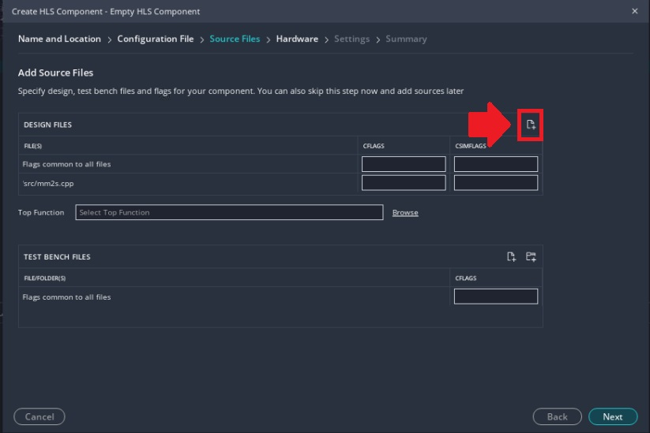

5. In the same page, set the mm2s function as the top function (click ***Browse*** and select ***mm2s***)

      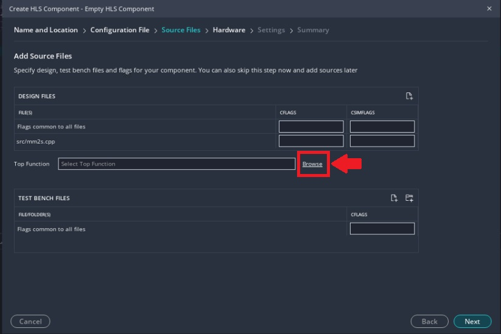

      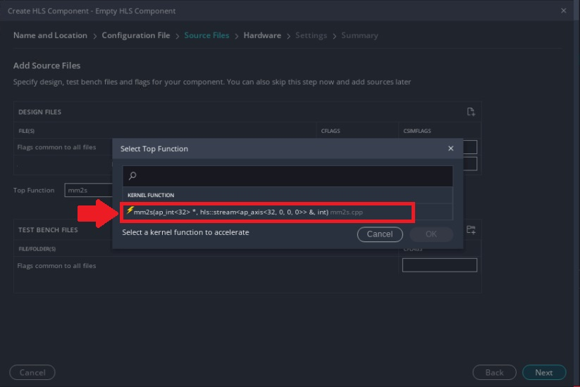

6. In the **Select Platform** Page:
* If you have created the platform following step 1, select the **base_pfm_vck190** platform you just created.
* If you have skipped step 1, select the VCK190 base platform (xilinx_vck190_base_002320_1) which is part of the Vitis installation.

 Click ***Next***

7. In the **Edit Settings** page select ***Vitis Kernel Flow Target*** under **flow_target** and ***Generate a Vitis XO*** under **package.output_format** and click ***Next***

      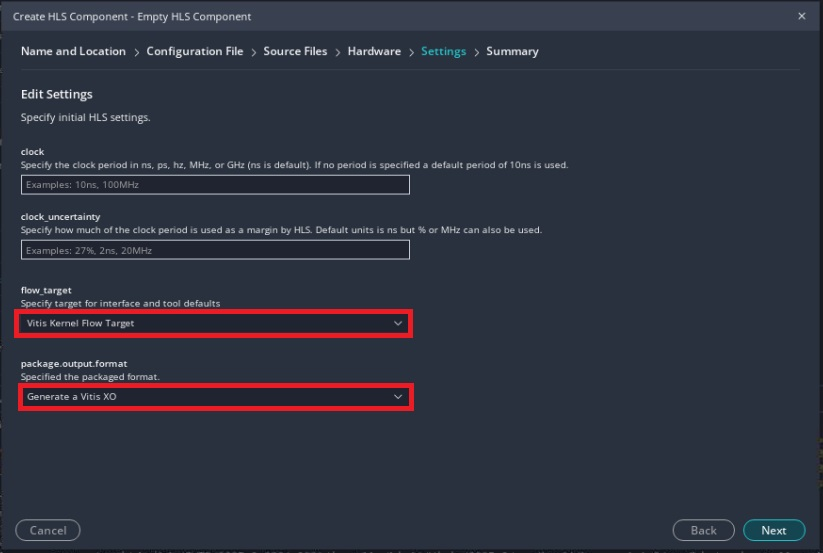

8. Click ***Finish***

9. Repeat steps 1 to 8 to create another HLS component called **s2mm** with the **s2mm.cpp** source file

## Step 3: Configure the Hardware Linking Project

Now that you have imported the kernels, you need to tell the Vitis linker how to connect everything together.

1. Create a new System Project component by clicking ***File > New Component > System Project***

2. Call this system component **simple_aie_application_system_project** and click ***Next***

3. In the **Select Platform** Page:
* If you have created the platform following step 1, select the **base_pfm_vck190** platform you just created.
* If you have skipped step 1, select the VCK190 base platform (xilinx_vck190_base_002320_1) which is part of the Vitis installation.

4. Skip the **Embedded Component Paths** page (click ***Next***). This page is used for system running Linux. Our system will be Baremetal.

5. Click ***Finish***

6. Open the settings file called **vitis-sys.json** under **simple_aie_application_system_project > Settings** and click on ***Add Existing Components*** in the **Components** section at the bottom of the file. Click ***HLS*** and select the ***mm2s*** and ***s2mm*** components.

      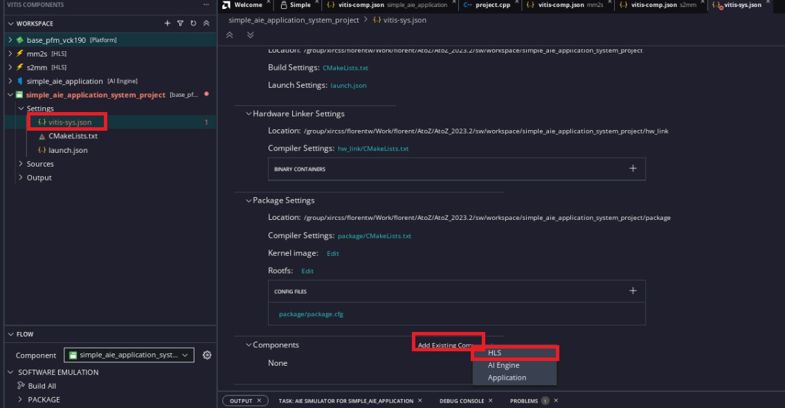

7.  Click again on ***Add Existing Components*** in the **Components** section at the bottom of the file. Click ***AI Engine*** and select the **simple_aie_application*** components.

8. Now you need to tell the Vitis compiler about the connectivity of the system. This step is done using a configuration file. Still in the settings file **vitis-sys.json**, under **Hardware Link Settings** expend **binary_container_1** and click on ***hw_link/binary_container_1-link.cfg***

      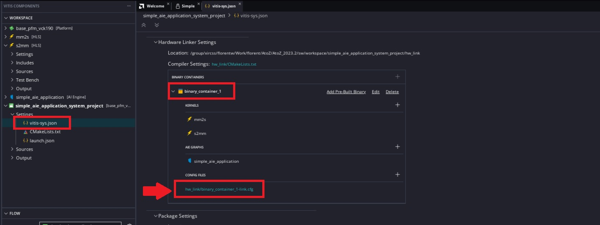

In **binary_container_1-link.cfg** change the view to **Source editor** and add the following lines under **[connectivity]**

      ```
      stream_connect=mm2s_1.s:ai_engine_0.mygraph_in
      stream_connect=ai_engine_0.mygraph_out:s2mm_1.s
      ```
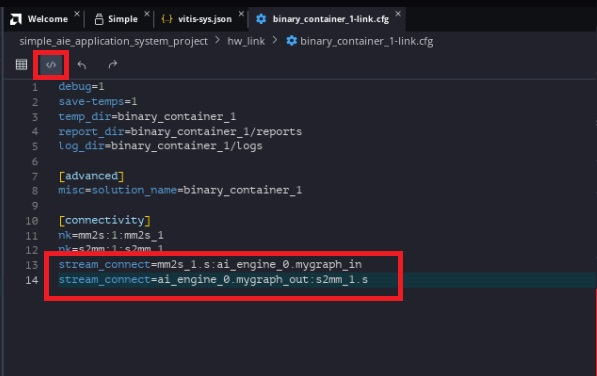

Note that as per the [Vitis Unified Software Platform Documentation: Application Acceleration Development (UG1393)](https://docs.xilinx.com/r/en-US/ug1393-vitis-application-acceleration/connectivity-Options), the naming convention for the compute units (or kernel instances) are `<kernel>_#`, where `#` indicates the CU instance. Thus, the CU names built corresponding to the kernels `mm2s` and `s2mm` in your project are respectively `mm2s_1` and `s2mm_1`. The `stream_connect` option is defined as `<compute_unit_name>.<kernel_interface_name>:<compute_unit_name>.<kernel_interface_name>`. For example, to connect the AXI4-Stream interface of the `mm2s_1` (compute unit name) called `s` (kernel interface name) to the `mygraph_in` (interface name) input of the graph in the `ai_engine_0` (compute unit name) IP you need the following option: `stream_connect=mm2s_1.s:ai_engine_0.mygraph_in`.

9. In the **binary_container_1-link.cfg** page, change back the view to **Settings Forms** and enable **Export hardware (XSA)**.

      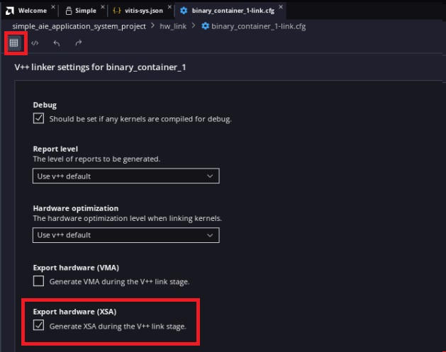

## Step 4. Build the System

1. In the flow navigator, make sure **simple_aie_application_system_project** is selected and click on ***Build Binary Container*** under **HARDWARE > LINK - binary_container_1**. Click ***OK*** when asked to build the HLS components (mm2s and s2mm)
The compilation process takes some time to finish. The underlying AI Engine application project, hardware kernel project, and hardware linking project are compiled one after another. The system should build successfully with no error.

      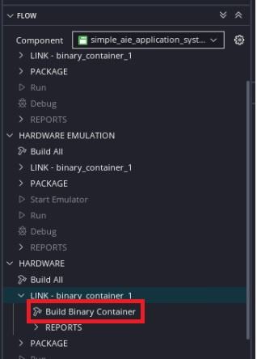

2. You can open the generated the AMD Vivado™ project in `<workspace>/simple_aie_application_system_project/build/hw/hw_link/binary_container_1/binary_container_1/vivado/vpl/prj/prj.xpr` to take a look at the compilation result. You can see that the Vitis compiler added the two HLS IP (`mm2s` and `s2mm`) and connected them to the memory (NOC) and AI Engine IP.

      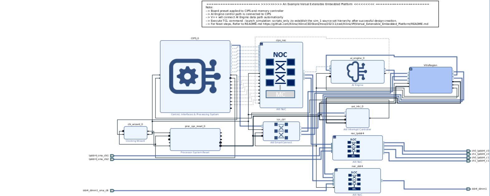

      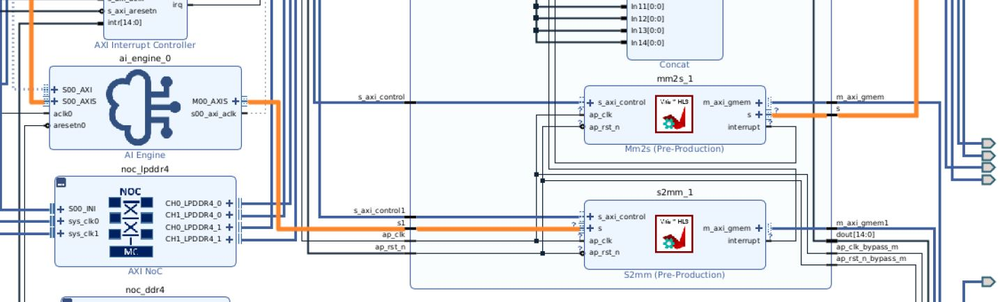

In the next step, you will create a processing system (PS) bare-metal application, and run the system with it.

<p align="center"><b><a href="./04-ps_application_creation_run_all.md">Go to PS Application and Run</a></b></p>

<p class="sphinxhide" align="center"><sub>Copyright © 2020–2023 Advanced Micro Devices, Inc</sub></p>

<p class="sphinxhide" align="center"><sup><a href="https://www.amd.com/en/corporate/copyright">Terms and Conditions</a></sup></p>
