<table class="sphinxhide" style="width:100%;">
  <tr>
    <td align="center">
      <picture>
        <source media="(prefers-color-scheme: dark)" srcset="https://raw.githubusercontent.com/Xilinx/Image-Collateral/main/logo-white-text.png">
        
      </picture>
      <h1>AMD Vitis™ AI Engine Tutorials</h1>
      <a href="https://www.amd.com/en/products/software/adaptive-socs-and-fpgas/vitis.html">See Vitis™ Development Environment on amd.com</a>
        </br>
      <a href="https://www.amd.com/en/products/software/vitis-ai.html">See Vitis™ AI Development Environment on amd.com</a>
    </td>
  </tr>
</table>

# Introduction: System Integration

In this section of the tutorial, learn how to add programmable logic (PL) kernels in HLS into the system project and build the whole system.

## Step 1: Add the PL Kernels

In this example, HLS kernels bridge between memory and the AXI4-Stream interface to input and output data from memory.

* The `mm2s` kernel reads data from memory and inputs it to the AI Engine array.
* The `s2mm` kernel receives output data from the AI Engine array and writes it to memory.

1. In the Vitis Unified IDE click ***File > New Component > HLS***

2. Name the first component **mm2s** and click ***Next***.

3. In the **Configuration File** page, keep the default settings (**Empty File**) and click ***Next***

4. In the **Add Source Files** page, add the file **mm2s.cpp** from the `src` folder.

      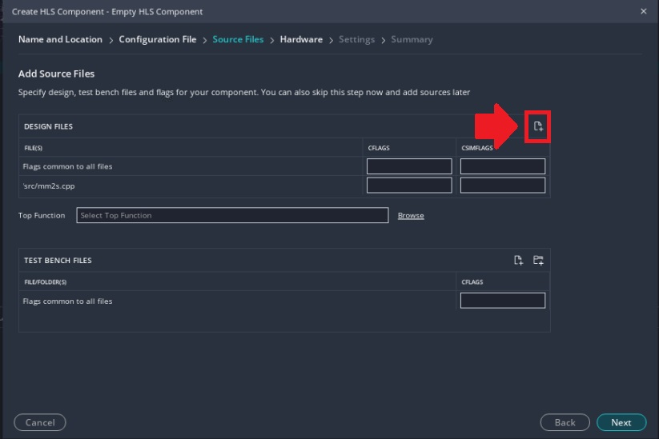

5. In the same page, set the mm2s function as the top function (click ***Browse*** and select ***mm2s***).

      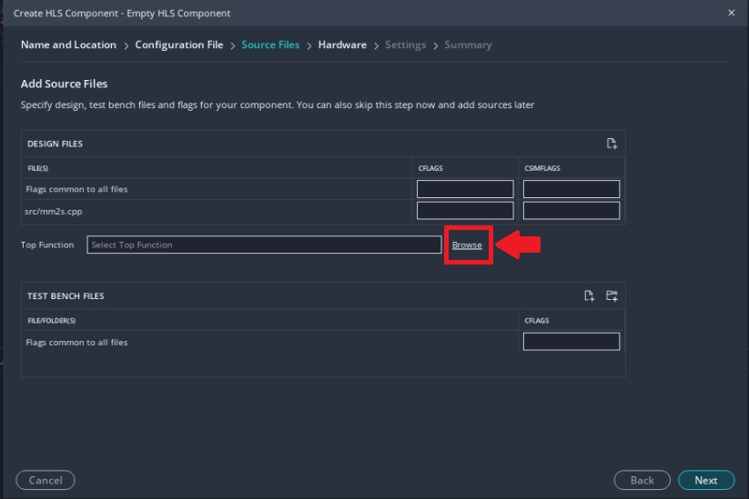

      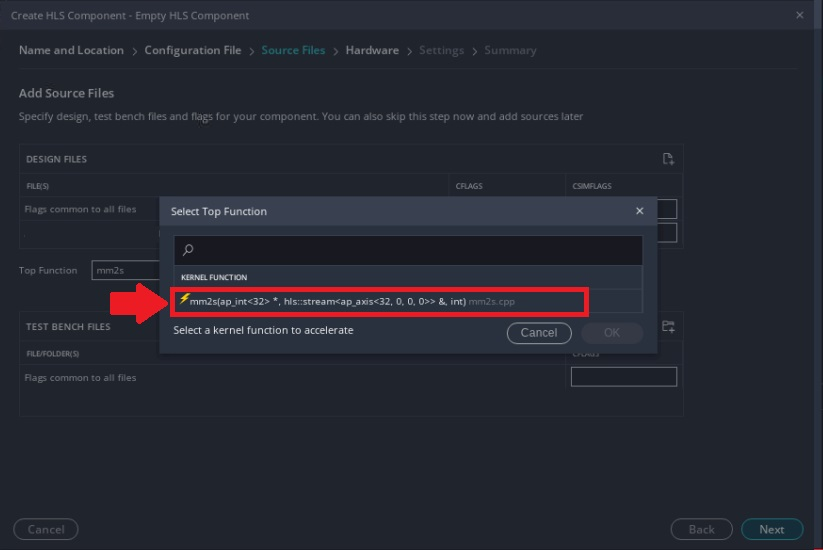

6. In the **Select Platform** Page, select **Hardware Design** select the XSA file generated from the platform creation step (custom_platform_vck190.xsa).

    Click ***Next***.

7. In the **Edit Settings** page,  ***xo*** under **package.output_format** and click ***Next***.

      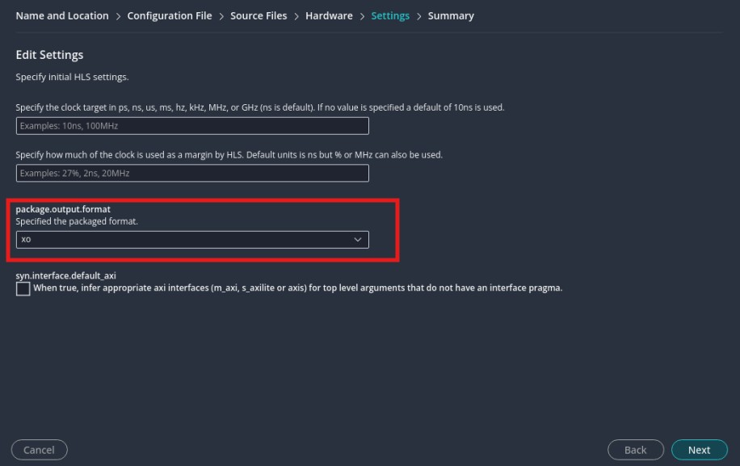

8. Open the  hls_config.cfg file under settings and change to source editor view. Add the following line under hls:
      
      ```cpp
      [hls]
      flow_target=vitis
      ```

      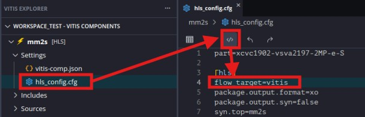

8. Click ***Finish***.

9. Repeat steps 1 to 8 to create another HLS component called **s2mm** with the **s2mm.cpp** source file.

## Step 3: Configure the Hardware Linking Project

Now that you have imported the kernels, you need to tell the Vitis linker how to connect everything together.

1. Create a new System Project component by clicking ***File > New Component > System Project***

2. Call this system component **simple_aie_application_system_project** and click ***Next***

3. In the **Select Platform** Page, select **Hardware Design** and select the xsa from the platform creation step (custom_platform_vck190.xsa).

4. Skip the **Embedded Component Paths** page (click ***Next***). This page is used for system running Linux. This system uses bare-metal.

5. Click ***Finish***.

6. Open the settings file called **vitis-sys.json** under **simple_aie_application_system_project > Settings** and click ***Add Existing Components*** in the **Components** section at the bottom of the file. Click ***HLS*** and select the ***mm2s*** and ***s2mm*** components.

      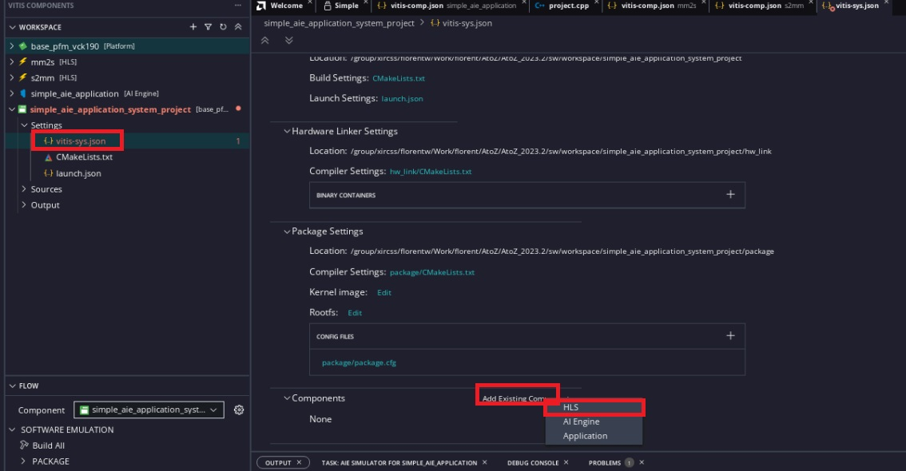

7. Click ***Add Existing Components*** in the **Components** section at the bottom of the file. Click ***AI Engine*** and select the **simple_aie_application*** components.

8. Now you need to tell the Vitis compiler about the connectivity of the system. This step uses a configuration file. Still in the settings file **vitis-sys.json**, under **Hardware Link Settings** expend **binary_container_1** and click ***hw_link/binary_container_1-link.cfg***.

      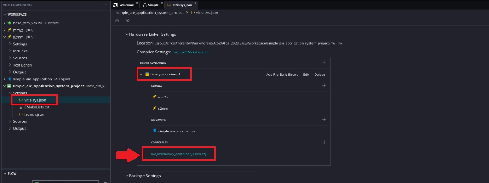

      In **binary_container_1-link.cfg**, change the view to **Source editor** and add the following lines under **[connectivity]**:

      ```cpp
      stream_connect=mm2s_1.s:ai_engine_0.mygraph_in
      stream_connect=ai_engine_0.mygraph_out:s2mm_1.s
      ```

      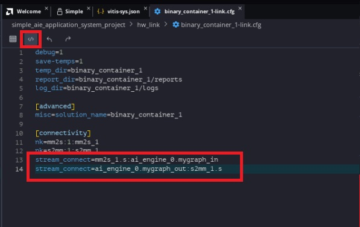

      Note that per the [Vitis Unified Software Platform Documentation: Application Acceleration Development (UG1393)](https://docs.amd.com/r/en-US/ug1393-vitis-application-acceleration/connectivity-Options), the naming convention for the compute units (or kernel instances) is `<kernel>_#`, where `#` indicates the CU instance. Thus, the CU names built corresponding to the kernels `mm2s` and `s2mm` in your project are respectively `mm2s_1` and `s2mm_1`. The `stream_connect` option is defined as `<compute_unit_name>.<kernel_interface_name>:<compute_unit_name>.<kernel_interface_name>`. For example, to connect the AXI4-Stream interface of the `mm2s_1` (compute unit name) called `s` (kernel interface name) to the `mygraph_in` (interface name) input of the graph in the `ai_engine_0` (compute unit name) IP, use the following option: `stream_connect=mm2s_1.s:ai_engine_0.mygraph_in`.

## Step 4. Build the System

1. In the flow navigator, select **simple_aie_application_system_project** and click ***Build Binary Container*** under **HARDWARE > LINK - binary_container_1**. Click ***OK*** when asked to build the HLS components (mm2s and s2mm).
The compilation process takes some time to finish. The underlying AI Engine application project, hardware kernel project, and hardware linking project compile one after another. The system builds successfully with no error.

      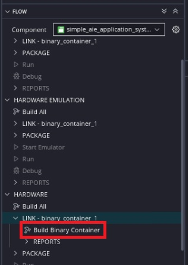

2. You can open the generated AMD Vivado™ project in `<workspace>/simple_aie_application_system_project/build/hw/hw_link/binary_container_1/binary_container_1/vivado/vpl/prj/prj.xpr` to take a look at the compilation result. You can see that the Vitis compiler added the two HLS IP (`mm2s` and `s2mm`) and connected them to the memory (NoC) and AI Engine IP.

      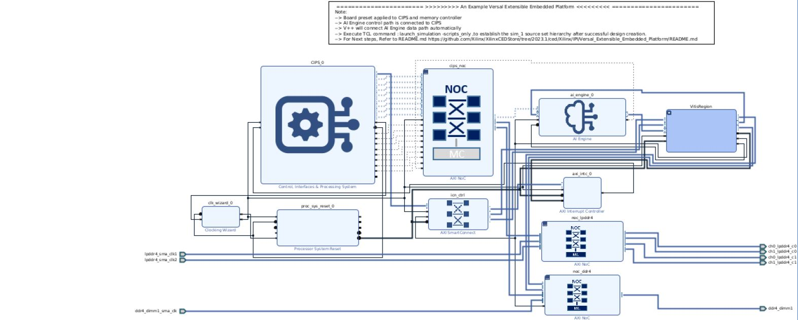

      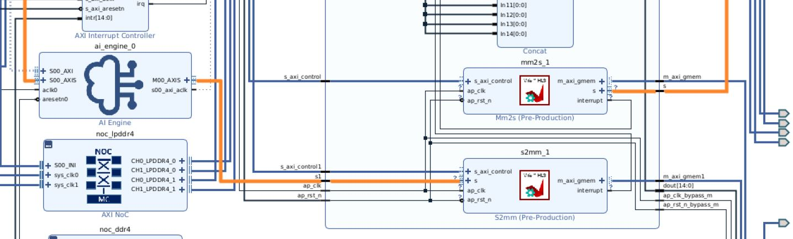

> Note: You can automate creating the PL by running "make pl_app".

In the next step, create a processing system (PS) bare-metal application and run the system with it.

<p align="center"><b><a href="./04-ps_application_creation_run_all.md">Go to PS Application and Run</a></b></p>

<p class="sphinxhide" align="center"><sub>Copyright © 2020–2025 Advanced Micro Devices, Inc.</sub></p>

<p class="sphinxhide" align="center"><sup><a href="https://www.amd.com/en/corporate/copyright">Terms and Conditions</a></sup></p>
