<table class="sphinxhide" width="100%">
 <tr width="100%">
    <td align="center"><h1>AI Engine Development</h1>
    <a href="https://www.xilinx.com/products/design-tools/vitis.html">See Vitis™ Development Environment on xilinx.com</br></a>
    <a href="https://www.xilinx.com/products/design-tools/vitis/vitis-ai.html">See Vitis™ AI Development Environment on xilinx.com</a>
    </td>
 </tr>
</table>

# Introduction: PS Application Creation and Run

In this section of the tutorial, you will learn how to build a PS bare-metal application using the XSA created in the previous step, and then build, as well as run the complete system.

## Step 1: Create a New Platform in the Bare-metal Domain

1. In the Vitis Unified IDE with the same workspace directory as the previous step. Click ***File → New Component →  Platform***.

2. Set the Platform Project Name to **AIE_A-to-Z_pfm_vck190**, and click **Next**.

3. Use the XSA generated in the previous step that you can find in `simple_aie_application_system_project/build/hw/hw_link/binary_container_1.xsa`

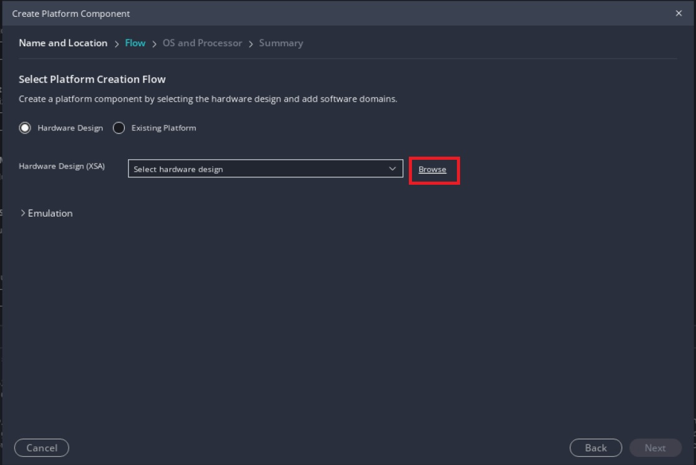

4. Set **standalone** as the **Operating system** and **psv_cortexa72_0** as the **Processor**, and click **Finish**.

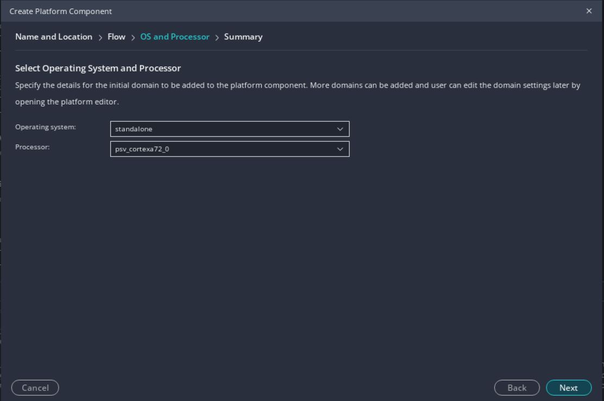

5. Build the platform.

## Step 2. Build the Baremetal AI Engine Control Application

1. Create a new application by clicking ***File → New Component → Application***.

2. Set the name for the application to `A-to-Z_app` and click ***Next***.

3. Select **AIE_A-to-Z_pfm_vck190** as the platform and click ***Next***.

4. Select the A72_0 processor domain (`standalone_psv_cortexa72_0`), and click ***Next*** and then ***Finish***.

5. Right-click the `src` folder under the **A-to-Z_app** project, and click ***Import → Files***.

6. Import the `aie_control.cpp` file from the AI Engine application project (`simple_application/build/hw/Work/ps/c_rts/aie_control.cpp`).

7. Import `main.cpp` from the `src` folder from the git repository.

      Go through the `main.cpp` file. You can see that the code is initializing the input data and the memory space for the output data. One thing to note is the use of the `.init()` and `.run()` APIs to control the AI Engine.

      ```
      printf("Starting AIE Graph\n");
      printf("Graph Initialization\n");
      mygraph.init();
      printf("Done \n");
      printf("- \n");

      printf("Running Graph for 4 iterations\n");
      mygraph.run(4);
      ```

      There are two options to enable an AI Engine graph from a system:

      * Enable the graph in the PDI. This means that the graph will be started during BOOT and will run forever.
      * Enable the AI Engine graph from the PS program using the `<graph>.init()` and `<graph>.run()` APIs. This is what you are using in this case.

8. Under the **A-to-Z_app component** open **UserConfig.cmake** under **Settings**. In the **Directories** section add the following directories under **Include Paths (-I)**.
      * `<workspace>/simple_aie_application/src`
      * `$ENV{XILINX_VITIS}/aietools/include`

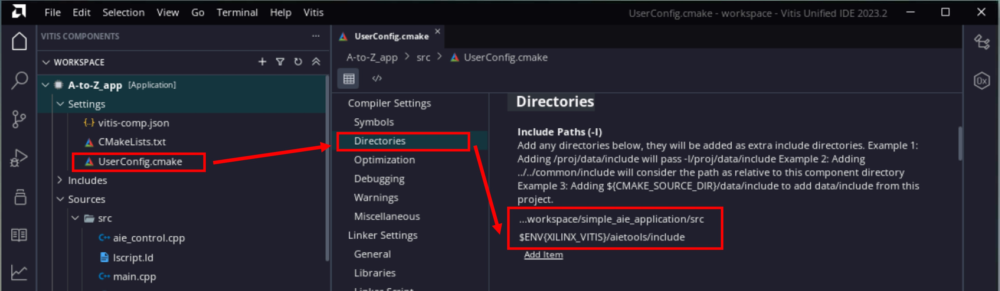

9. Still in the **UserConfig.cmake** file, in the **Libraries** section add

      * `adf_api` under **Libraries (-l)**
      * `$ENV{XILINX_VITIS}/aietools/lib/aarchnone64.o` under **Library search path (-L)**

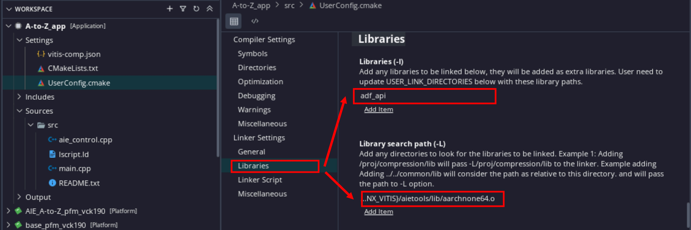


11. Modify the Linker Script to increase the heap size for AIE library.

      * In the Project Explorer, expand the A-to-z_app component.

      * In the src directory, double-click `lscript.ld` to open the linker script for this project.

      * In the linker script modify the Heap size to `0x100000` (1MB).

    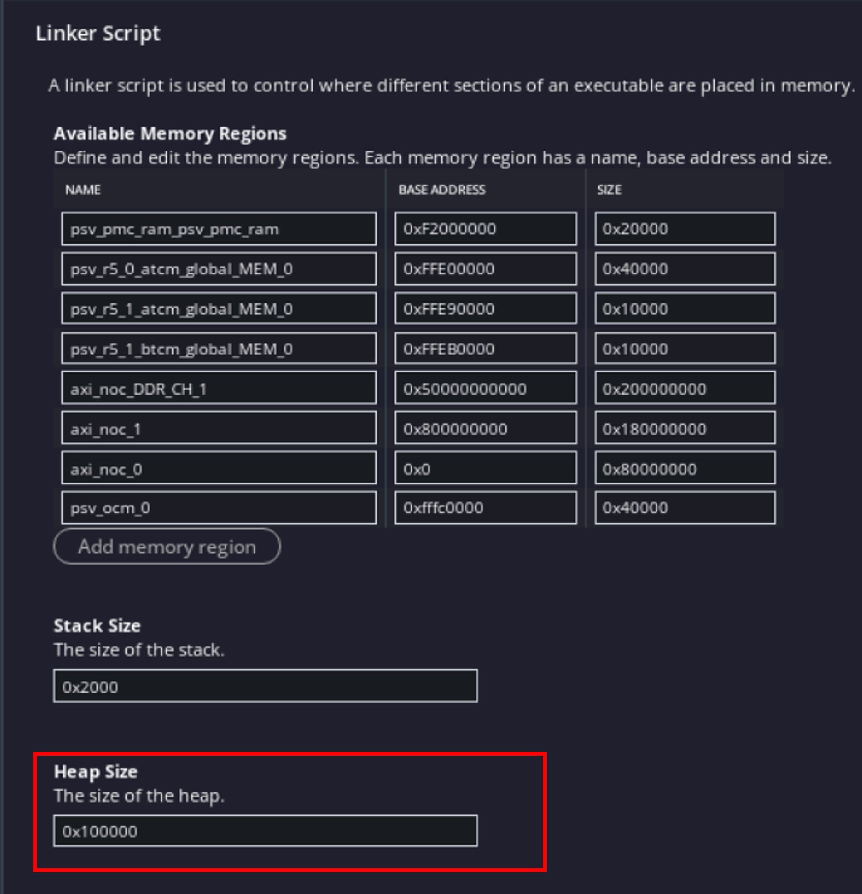

12. Build the A72 PS component (`A-to-Z_app`).

## Step 3: Package the Full System

1. Open the settings file **vitis-sys.json** for the **simple_aie_application_system_project** and click on the **package.cfg** config file under **Package Settings**

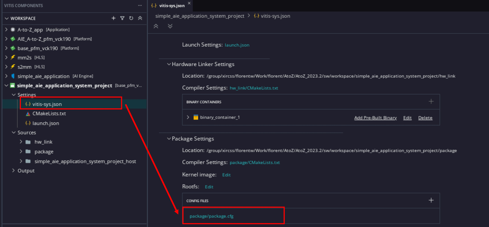

2. In the **General** Section, in the Baremetal Elf setting add the following to tell the packager to add the application executable and run it on the A72 processor

      `../../../../A-to-Z_app/build/A-to-Z_app.elf,a72-0`

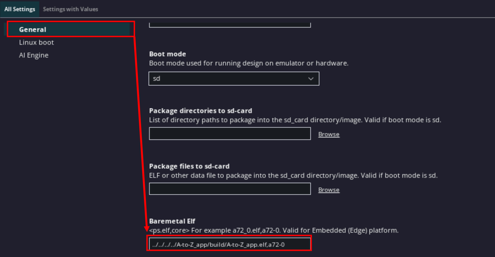

3. In the **AI Engine section** select the option **Do not enable cores**

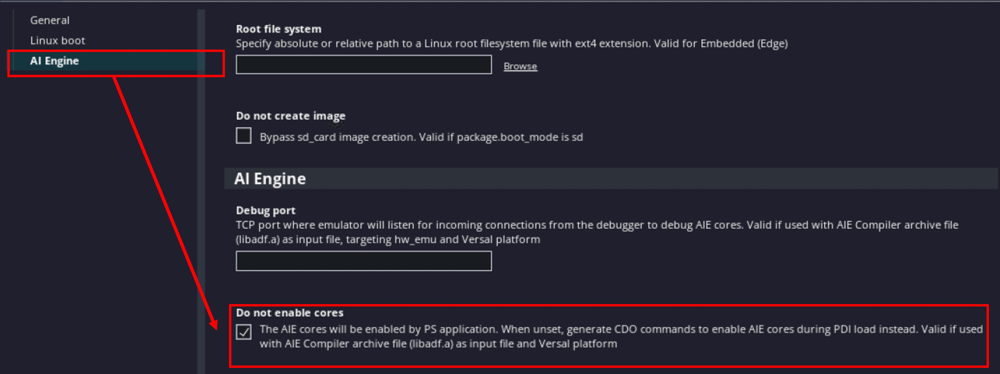    

      >**NOTE:** The option will add the line --package.defer_aie_run in the package
       configuration file. This is required when running the AI Engine graph from th
       e PS (see the [Versal ACAP AI Engine Programming Environment User Guide (UG1076)](https://docs.xilinx.com/r/en-US/ug1076-ai-engine-environment/Integrating-the-Application-Using-the-Vitis-Tools-Flow)).
      If the user is looking for a free running graph, this option should be disabled

4. In the **AI Engine section** deselect the option **Enable debug**

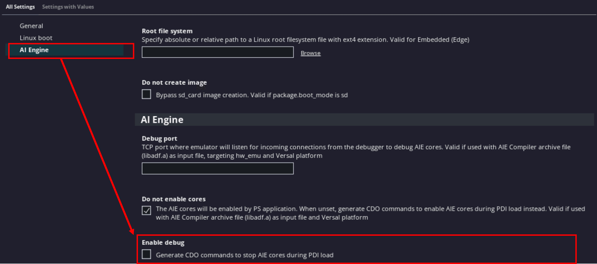

>**NOTE:** This option is used when running the debugger. In our case, we will just run the system without using the debugger

5. Build the **simple_aie_application_system_project** project for Hardware emulation (Click ***Build All*** under **HARDWARE EMULATION** in the Flow navigator).

## Step 4: Run the System in Hardware Emulation

Now that the system is built, you can test it in hardware emulation.

   1. In the flow navigator, click on ***Start Emulator*** under **HARDWARE EMULATION**

         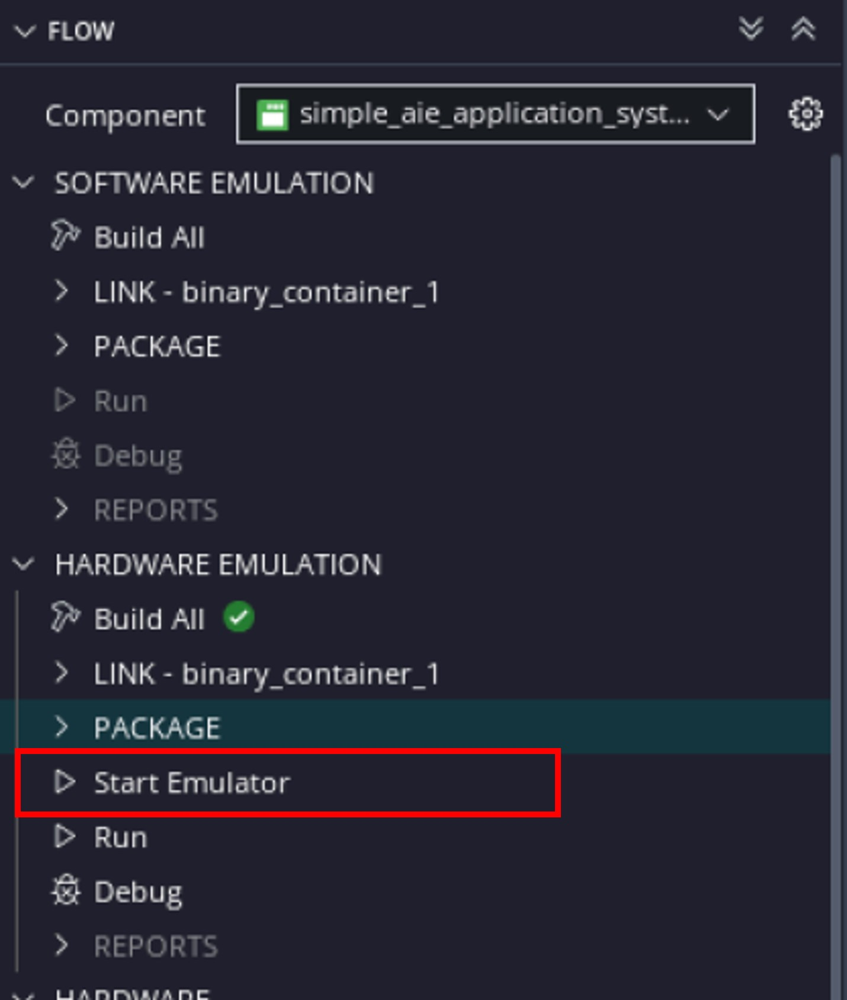

   2. On the **Start Emulator** pop up window, keep the default settings and click ***Start***.

         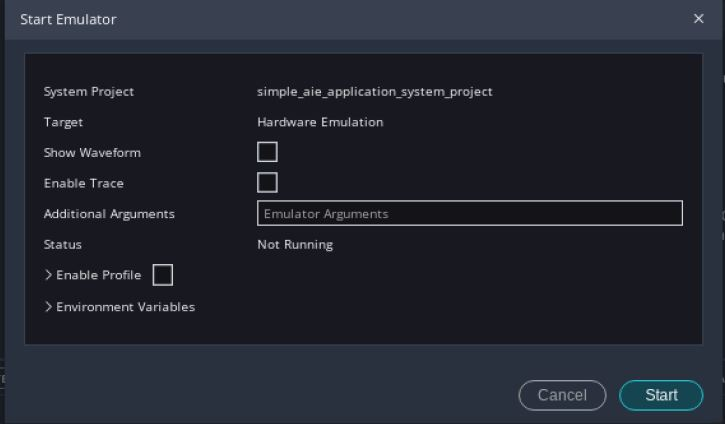

      >**NOTE:** You can use the option, **Show Waveform**, to open the Vivado Simulator, and observe the waveform from the PL signals. If you select this option, make sure you run the simulation in Vivado simulator as QEMU will wait for it.

   3. You should see the application running successfully with no error in the Vitis console.

         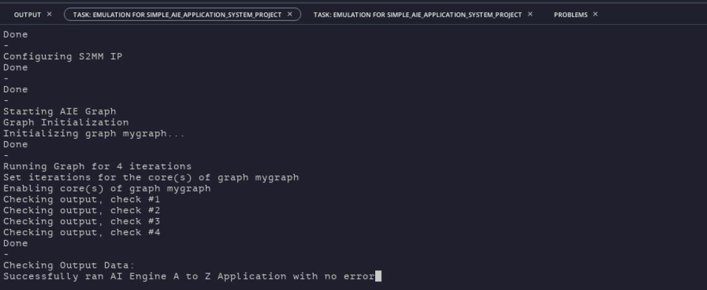

   4. To stop the emulator, click on the ***x*** on the Start Emulator line in the flow navigator
         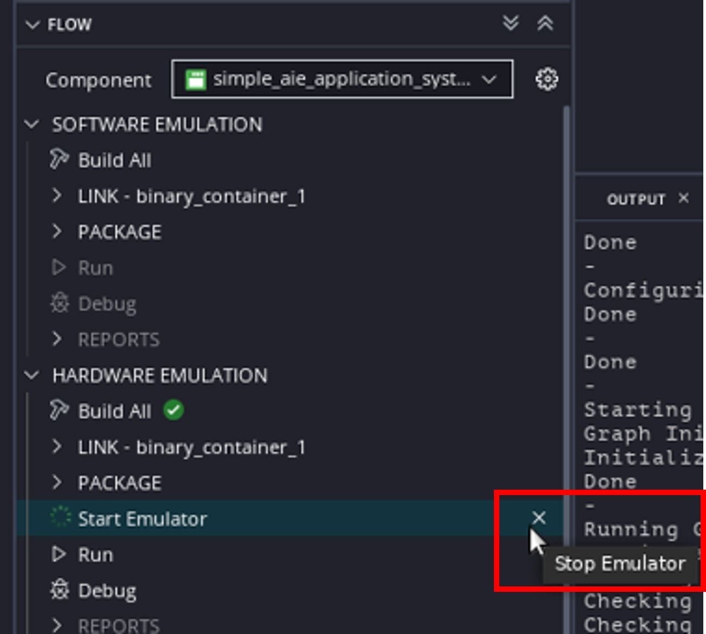

## Step 5: Build the System targeting the Hardware

Before you run the system in hardware, you need to rebuild the system to target the hardware.

   1.  Build the **simple_aie_application_system_project** project for Hardware  (Click ***Build All*** under **HARDWARE** in the Flow navigator).


## Step 6: Run the System in Hardware

Use the SD card to run the application.

   1. Set up your board with proper connection of power cable, JTAG USB cable, UART USB cable, and set the BOOT MODE to SD Boot.

   2. Under the  **simple_aie_application_system_project** component expand **Output > hw > package**. In the `package` directory, you will find a `sd_card.img` file.

  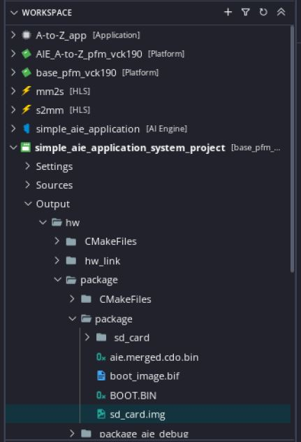

        > **NOTE:** You can find the `sd_card.img` file in **package** and **package_aie_debug** directories. The `sd_card.img` in **package_aie_debug** directory is for hardware debug purpose. It stops AI Engine after loading and waits for the run instruction from the debugger. The one in the **package** directory is for free running. So choose `sd_card.img` in **package** directory for SD card free running.

   3. Format your SD card FAT32 partition using the `sd_card.img` file.

   4. Start a UART terminal connected to the COM ports of the VCK190         

   5. Insert your SD card into your board, and power on your board. You should see the application running successfully with no error.

         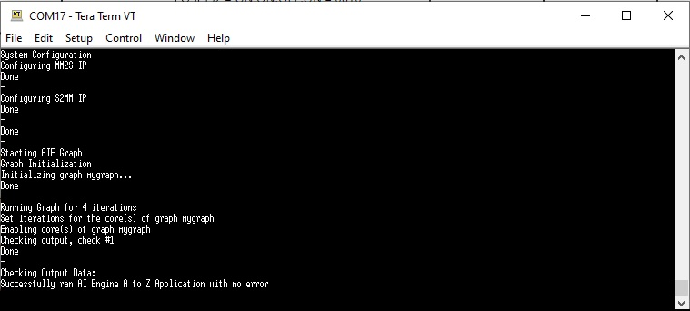

## Summary

In this tutorial, you have performed an end-to-end flow to create a platform based on the VCK190 board, added an AI Engine kernel and PL kernels into the system, and built a PS bare-metal application to control the system. Then you have run the system is hardware emulation and hardware.

<p class="sphinxhide" align="center"><sub>Copyright © 2020–2023 Advanced Micro Devices, Inc</sub></p>

<p class="sphinxhide" align="center"><sup><a href="https://www.amd.com/en/corporate/copyright">Terms and Conditions</a></sup></p>
