<table class="sphinxhide" style="width:100%;">
  <tr>
    <td align="center">
      <picture>
        <source media="(prefers-color-scheme: dark)" srcset="https://raw.githubusercontent.com/Xilinx/Image-Collateral/main/logo-white-text.png">
        
      </picture>
      <h1>AMD Vitis™ AI Engine Tutorials</h1>
      <a href="https://www.amd.com/en/products/software/adaptive-socs-and-fpgas/vitis.html">See Vitis™ Development Environment on amd.com</a>
        </br>
      <a href="https://www.amd.com/en/products/software/vitis-ai.html">See Vitis™ AI Development Environment on amd.com</a>
    </td>
  </tr>
</table>

# Introduction: PS Application Creation and Run

In this section of the tutorial, learn how to build a PS bare-metal application using the XSA created in the previous step, and then build and run the complete system.

## Step 1: Create a New Platform in the Bare-metal Domain

1. In the Vitis Unified IDE with the same workspace directory as the previous step. Click ***File → New Component →  Platform***.

2. Set the Platform Project Name to **AIE_A-to-Z_pfm_vck190**, and click **Next**.

3. Use the XSA generated in the previous step that you can find in `simple_aie_application_system_project/build/hw/hw_link/binary_container_1.xsa`

   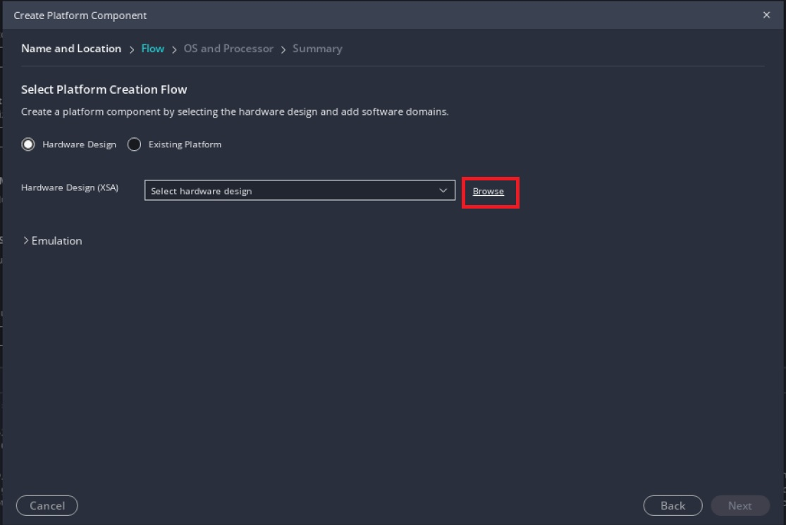

4. Set **standalone** as the **Operating system**, **psv_cortexa72_0** as the **Processor** and **GCC Compiler** as the **Compiler**, and click **Finish**.

   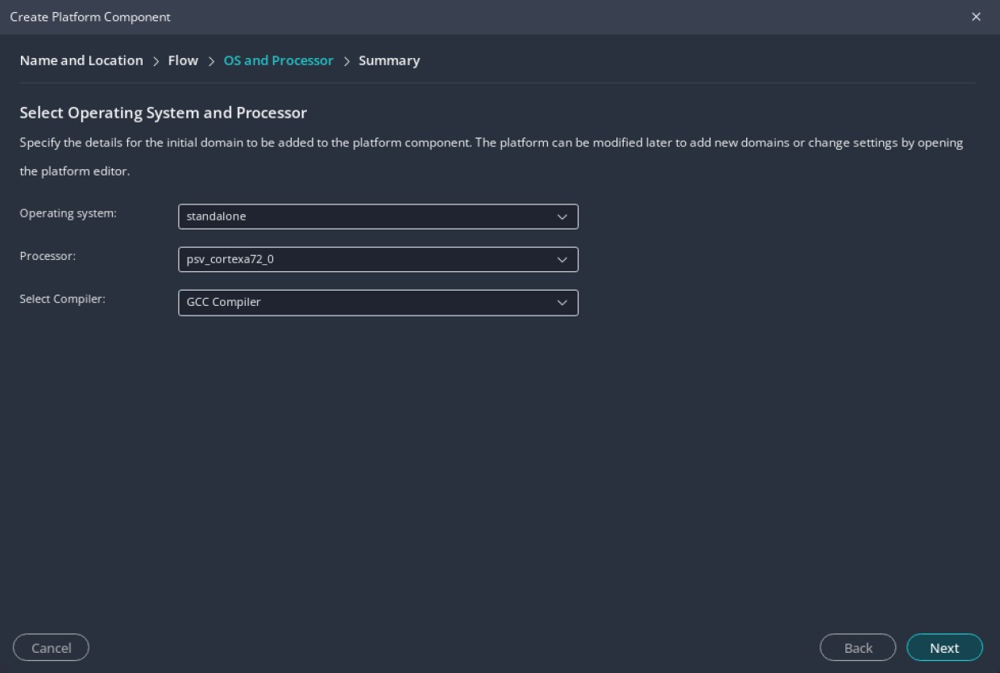

5. Open the platform configuration file **vitis-comp.json** and go to the Board Support Package section for the standalone_psv_cortexa72_0 domain. Enable the **aiebaremetal** library.

   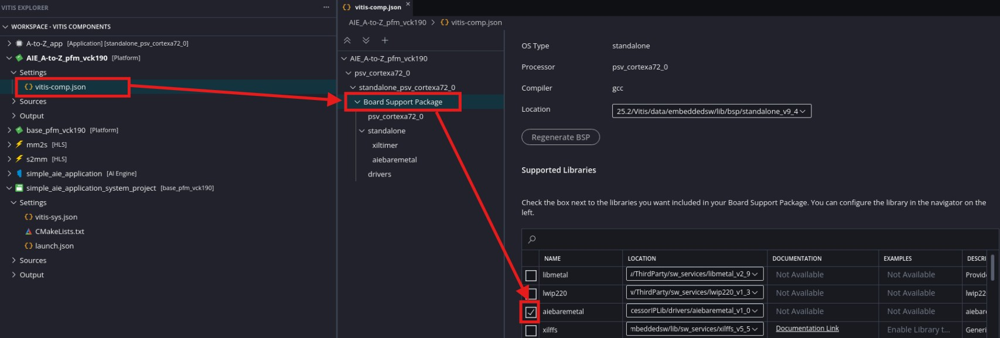

6. Build the platform.

## Step 2. Build the Bare-metal AI Engine Control Application

1. Create a new application by clicking ***File → New Component → Application***.

2. Set the name for the application to `A-to-Z_app` and click ***Next***.

3. Select **AIE_A-to-Z_pfm_vck190** as the platform and click ***Next***.

4. Select the A72_0 processor domain (`standalone_psv_cortexa72_0`), and click ***Next*** and then ***Finish***.

5. Right-click the `src` folder under the **A-to-Z_app** project, and click ***Import → Files***.

6. Import the `baremetal_metadata_compile.cpp` file from the AI Engine application project (`simple_application/build/hw/Work/baremetal_metadata_compile.cpp`).

7. Import `main.cpp` from the `src` folder from the git repository.

      Go through the `main.cpp` file. You can see that the code is initializing the input data and the memory space for the output data. One thing to note is the use of the `.run()` and `.end()` APIs to control the AI Engine.

      ```cpp
      printf("Running Graph for 4 iterations\n");
      gr.run(4);
      ```

      There are two options to enable an AI Engine graph from a system:

      * Enable the graph in the PDI. This means that the graph starts during BOOT and runs forever.
      * Enable the AI Engine graph from the PS program using `<graph>.run()` APIs. This is what you are using in this case.

8. Under the **A-to-Z_app component** open **UserConfig.cmake** under **Settings**. In the **Symbols** section add `__PS_BARE_METAL__`.

   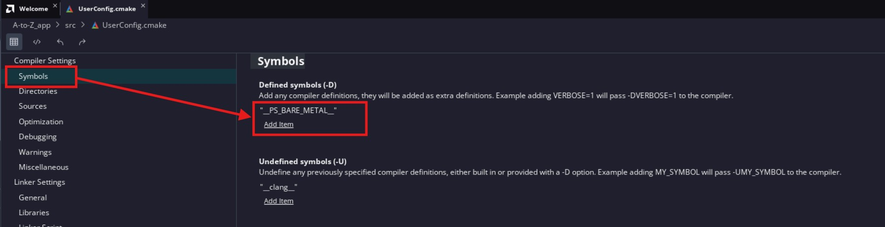

9. Modify the Linker Script to increase the heap size for AIE library.

      * In the Project Explorer, expand the A-to-z_app component.
      * In the src directory, double-click `lscript.ld` to open the linker script for this project.
      * In the linker script modify the Heap size to `0x100000` (1 MB).

    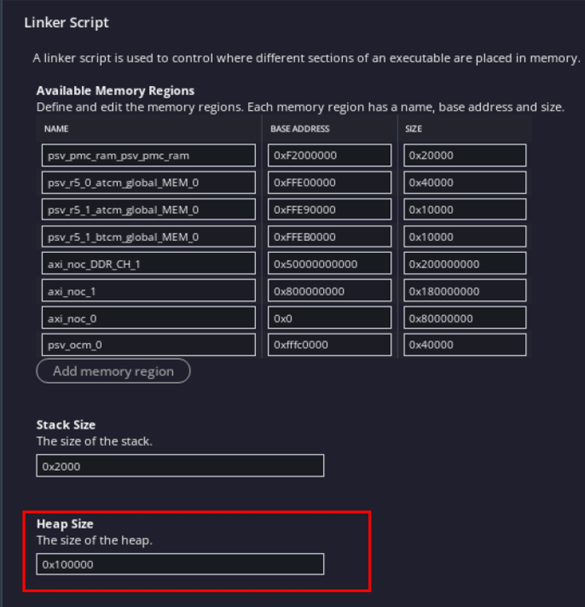

10. Build the A72 PS component (`A-to-Z_app`).

>**Note**: You can automate the creation of the Vitis fixed platform and the PS application by running "make ps_app."

## Step 3: Package the Full System

1. Open the settings file **vitis-sys.json** for the **simple_aie_application_system_project** and click the **package.cfg** config file under **Package Settings**.

   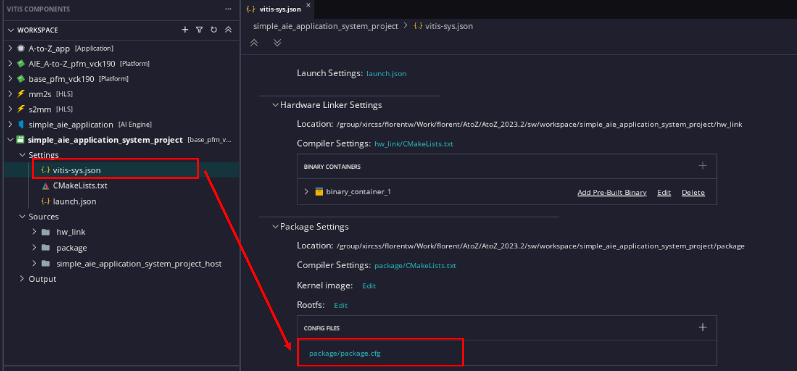

2. In the **General** Section, in the Bare-metal Elf setting add the following to tell the packager to add the application executable and run it on the A72 processor

      `../../../../A-to-Z_app/build/A-to-Z_app.elf,a72-0`

   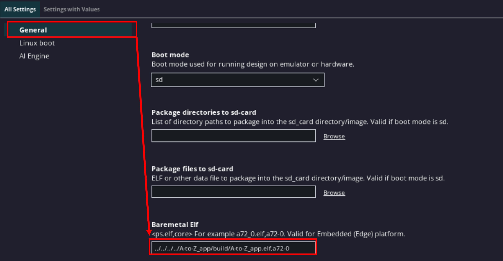

3. In the **AI Engine section** select the option **Do not enable cores**.

   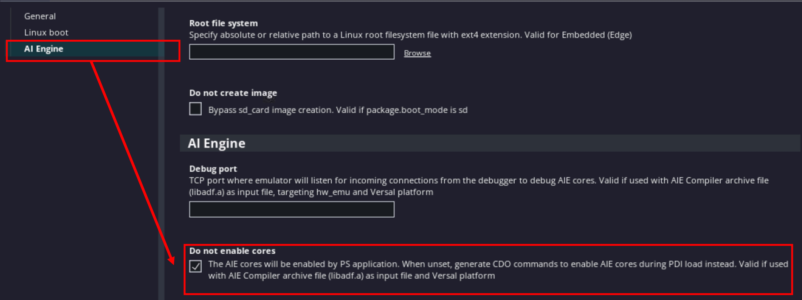

      >**NOTE:** The option adds the line `--package.defer_aie_run` in the package configuration file. The system requires this when running the AI Engine graph from the PS (refer to the [Versal adaptive SoC AI Engine Programming Environment User Guide (UG1076)](https://docs.amd.com/r/en-US/ug1076-ai-engine-environment/Integrating-the-Application-Using-the-Vitis-Tools-Flow)).

      If you are looking for a free running graph, turn off this option.

4. In the **AI Engine section** deselect the option **Enable debug**.

   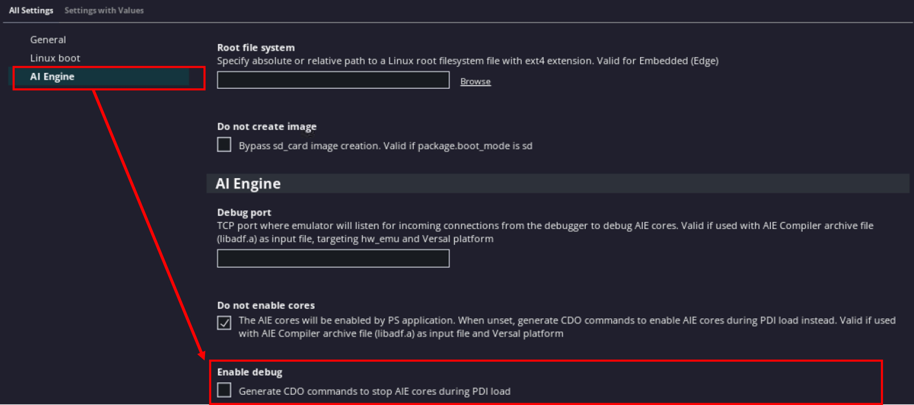

   >**NOTE:** Use this option when running the debugger. In this case, run the system without using the debugger.

5. Build the **simple_aie_application_system_project** project for Hardware emulation (Click ***Build All*** under **HARDWARE EMULATION** in the Flow navigator).

## Step 4: Run the System in Hardware Emulation

Now that you have built the system, test it in hardware emulation.

   1. In the flow navigator, click ***Start Emulator*** under **HARDWARE EMULATION**

         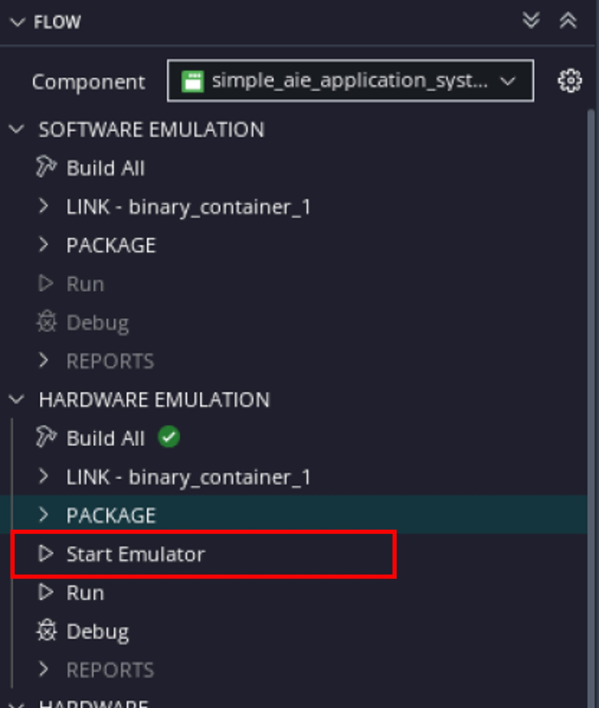

   2. On the **Start Emulator** pop up window, keep the default settings and click ***Start***.

         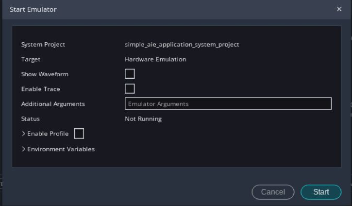

      >**NOTE:** You can use the **Show Waveform** option to open the Vivado Simulator, and observe the waveform from the PL signals. If you select this option, make sure you run the simulation in the Vivado simulator as the QEMU waits for it.

   3. The console shows the application running successfully with no error in the Vitis console.

         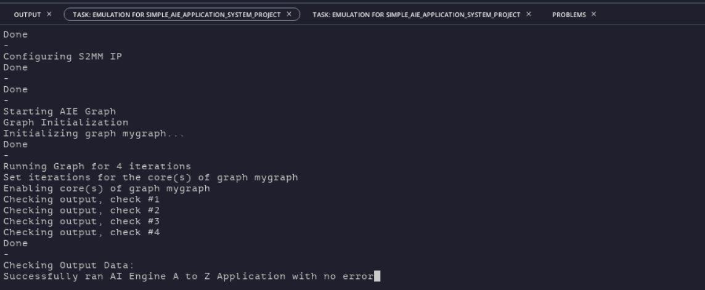

   4. To stop the emulator, click ***x*** on the Start Emulator line in the Flow Navigator.

         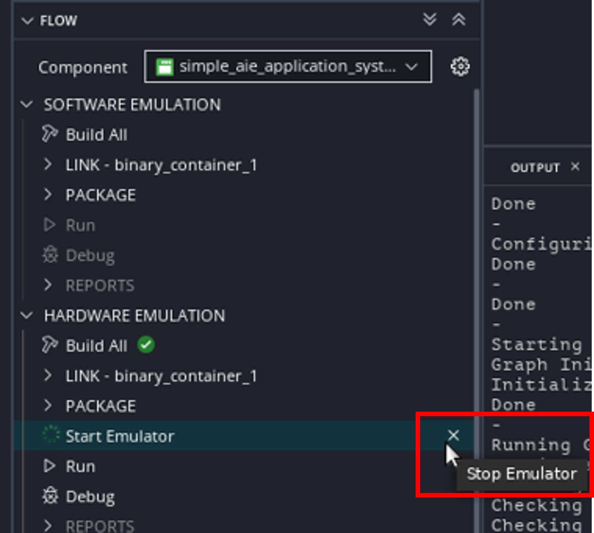

## Step 5: Build the System targeting the Hardware

Before you run the system in hardware, you need to rebuild the system to target the hardware.

   1. Build the **simple_aie_application_system_project** project for Hardware  (Click ***Build All*** under **HARDWARE** in the Flow navigator).

## Step 6A: Run the System in Hardware with SD Boot

Use the SD card to run the application.

   1. Set up your board with proper connection of power cable, JTAG USB cable, UART USB cable, and set the BOOT MODE to SD Boot.

   2. Under the  **simple_aie_application_system_project** component expand **Output > hw > package**. In the `package` directory, find the `sd_card.img` file.

      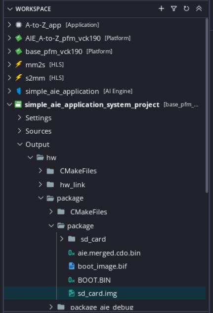

        > **NOTE:** You can find the `sd_card.img` file in **package** and **package_aie_debug** directories. The `sd_card.img` in **package_aie_debug** directory is for hardware debug purpose. It stops AI Engine after loading and waits for the run instruction from the debugger. The one in the **package** directory is for free running. So choose `sd_card.img` in **package** directory for SD card free running.

   3. Format your SD card FAT32 partition using the `sd_card.img` file.

   4. Start a UART terminal connected to the COM ports of the VCK190.

   5. Insert your SD card into your board, and power on your board. The console shows the application running successfully with no error.

         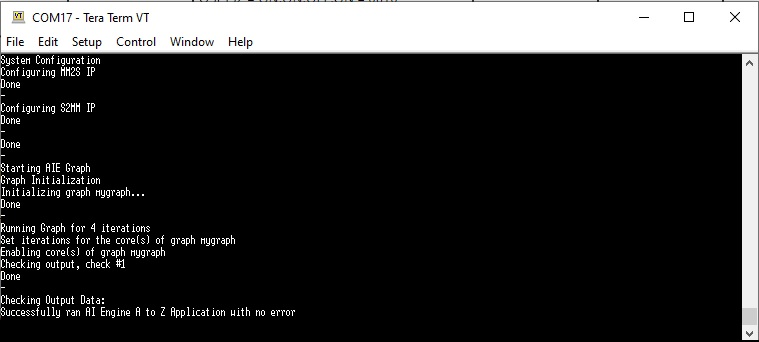

## Step 6B: Run or Debug the System in Hardware using JTAG

To run the system in HW using JTAG through the Vitis IDE, create a second system project. As this is a bare-metal system, include only the AI Engine application and the PS application.

   1. Create a new System Project component by clicking ***File > New Component > System Project***

   2. Call this system component **a-to-z_jtag** and click ***Next***

   3. In the **Select Platform**, select the `AIE_A-to-Z_pfm_vck190`

   4. Skip the **Embedded Component Paths** page (click ***Next***). This page is used for system running Linux. This system uses bare-metal. Click ***Finish***.

   5. Open the settings file called **vitis-sys.json** under **a-to-z_jtag > Settings** and click ***Add Existing Components*** in the **Components** section at the bottom of the file. Click ***Application*** and select the ***A-to-Z_app*** components.

   6. Click ***Add Existing Components*** in the **Components** section at the bottom of the file. Click ***AI Engine*** and select the **simple_aie_application*** components.

   7. Still in **a-to-z_jtag**, under **Package Settings**, add the path to the v++ link generated XSA Vitis Worspace/simple_aie_application_system_project/build/hw/hw_link/binary_container_1.xsa

         

   8. In the package settings, **package.cfg**, disable **Enable debug**

      

   9. In the Flow Navigator, select **a-to-z_jtag** and click ***Build All***.

         

   10. In the Flow Navigator, click the wheel next to the run.

         

   11. In the **launch.json** page, click **New Launch configuration**.

   12. If you have a remote connection, set the correct **Target Connection**

   13. Start a UART terminal connected to the COM ports of the VCK190.

   14. Run the application through the `launch.json` page. The console shows the application running successfully with no error.

## Summary

In this tutorial, you have performed an end-to-end flow to create a platform based on the VCK190 board. You added an AI Engine kernel and PL kernels into the system, and built a PS bare-metal application to control the system. Then you ran the system in hardware emulation and hardware.

<p class="sphinxhide" align="center"><sub>Copyright © 2020–2026 Advanced Micro Devices, Inc.</sub></p>

<p class="sphinxhide" align="center"><sup><a href="https://www.amd.com/en/corporate/copyright">Terms and Conditions</a></sup></p>
