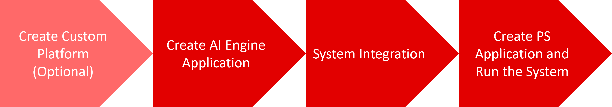

<table class="sphinxhide" style="width:100%;">
  <tr>
    <td align="center">
      <picture>
        <source media="(prefers-color-scheme: dark)" srcset="https://raw.githubusercontent.com/Xilinx/Image-Collateral/main/logo-white-text.png">
        
      </picture>
      <h1>AMD Vitis™ AI Engine Tutorials</h1>
      <a href="https://www.amd.com/en/products/software/adaptive-socs-and-fpgas/vitis.html">See Vitis™ Development Environment on amd.com</a>
         
      <a href="https://www.amd.com/en/products/software/vitis-ai.html">See Vitis™ AI Development Environment on amd.com</a>
    </td>
  </tr>
</table>

# A to Z Bare-metal Flow

***Version: Vitis 2025.2***

This tutorial introduces a complete end-to-end flow for a bare-metal host application using AI Engines and PL kernels. The tutorial is based on the 2025.2 Vitis unified software platform.

>**NOTE**: This tutorial has been written for multiple versions of the tools. Each version available can be found in the specific Github branch. The recommendation is to use the latest version available.

The flow is broken into four different steps shown in the following diagram.

[Start with Custom Platform Creation (Optional)](./01-custom_base_platform_creation.md)

[Start with AI Engine Development Using a Base Platform](./02-aie_application_creation.md)

Copyright © 2020–2025 Advanced Micro Devices, Inc.

<a href="https://www.amd.com/en/corporate/copyright">Terms and Conditions</a>

