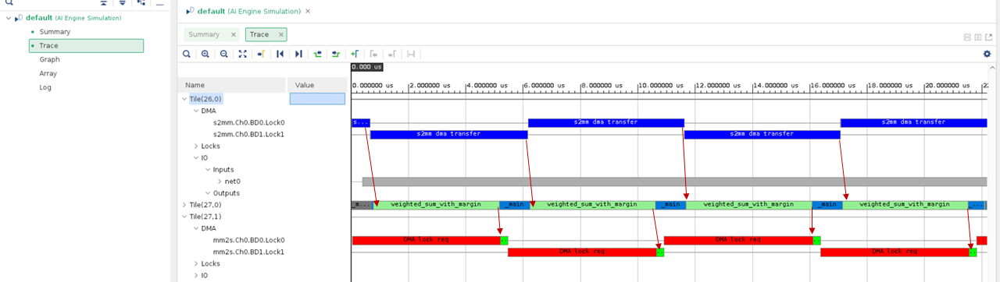
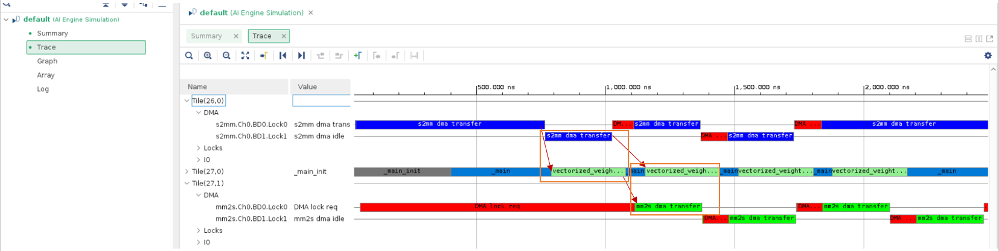
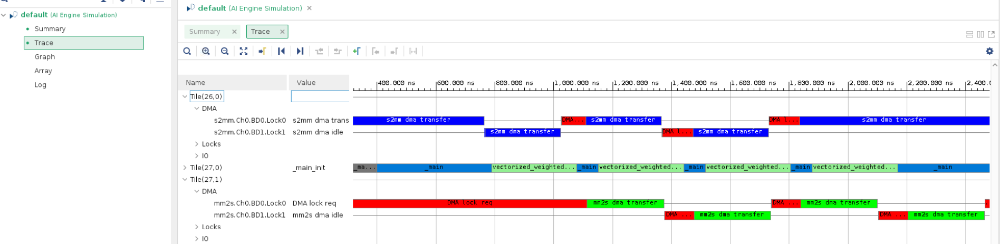

<table class="sphinxhide" style="width:100%;">
  <tr>
    <td align="center">
      <picture>
        <source media="(prefers-color-scheme: dark)" srcset="https://raw.githubusercontent.com/Xilinx/Image-Collateral/main/logo-white-text.png">
        
      </picture>
      <h1>AMD Vitis™ AI Engine Tutorials</h1>
      <a href="https://www.amd.com/en/products/software/adaptive-socs-and-fpgas/vitis.html">See Vitis Development Environment on amd.com</a>
        </br>
      <a href="https://www.amd.com/en/products/software/vitis-ai.html">See Vitis AI Development Environment on amd.com</a>
    </td>
  </tr>
</table>

# AI Engine GMIO Programming Model

***Version: Vitis 2025.2***

This example introduces the AI Engine GMIO programming model. It includes three steps:

- [AI Engine GMIO Programming Model](#ai-engine-gmio-programming-model)
	- [Step 1 - Synchronous GMIO Transfer](#step-1---synchronous-gmio-transfer)
			- [Run AI Engine compiler and AI Engine simulator](#run-ai-engine-compiler-and-ai-engine-simulator)
	- [Step 2 - Asynchronous GMIO Transfer for Input and Synchronous GMIO Transfer for Output](#step-2---asynchronous-gmio-transfer-for-input-and-synchronous-gmio-transfer-for-output)
			- [Run AI Engine compiler and AI Engine simulator](#run-ai-engine-compiler-and-ai-engine-simulator-1)
	- [Step 3 - Asynchronous GMIO Transfer and Hardware Flow](#step-3---asynchronous-gmio-transfer-and-hardware-flow)
			- [Run AI Engine simulator and hardware flow](#run-ai-engine-simulator-and-hardware-flow)
	- [Conclusion](#conclusion)

Use the AI Engine simulator event trace to identify performance improvements step by step. In the final step, you add code to make GMIO work in hardware.

## Step 1 - Synchronous GMIO Transfer

In this step, you use the synchronous GMIO transfer mode. Change your working directory to `single_aie_gmio/step1`. When you examine the graph code `aie/graph.h`, the design has one output `gmioOut` of type `output_gmio`, one input `gmioIn` of type `input_gmio`, and one AI Engine kernel `weighted_sum_with_margin`.

```cpp
	class mygraph: public adf::graph
	{
	private:
	  adf::kernel k_m;

	public:
	  adf::output_gmio gmioOut;
	  adf::input_gmio gmioIn;

	  mygraph()
	  {
		k_m = adf::kernel::create(weighted_sum_with_margin);
		gmioOut = adf::output_gmio::create("gmioOut",64,1000);
		gmioIn = adf::input_gmio::create("gmioIn",64,1000);

		adf::connect<>(gmioIn.out[0], k_m.in[0]);
		adf::connect<>(k_m.out[0], gmioOut.in[0]);
		adf::source(k_m) = "weighted_sum.cc";
		adf::runtime<adf::ratio>(k_m)= 0.9;
	  };
	};
```

Create and connect the GMIO ports `gmioIn` and `gmioOut` as follows:

```cpp
	gmioOut = adf::output_gmio::create("gmioOut",64,1000);
	gmioIn = adf::input_gmio::create("gmioIn",64,1000);

	adf::connect<>(gmioIn.out[0], k_m.in[0]);
	adf::connect<>(k_m.out[0], gmioOut.in[0]);
```

The GMIO instantiation `gmioIn` represents the DDR memory space that you read using the AI Engine. The `gmioOut` instantiation represents the DDR memory space you write using the AI Engine. You (the creator) specify the GMIO's logical name, burst length (64, 128, or 256 bytes) for the memory-mapped AXI4 transaction, and required bandwidth in MB/s (here 1000 MB/s).

Inside the main function of `aie/graph.cpp`, you allocate two 256-element ``int32`` arrays (1024 bytes) using `GMIO::malloc`. The `dinArray` points to the memory space you read using the AI Engine. The `doutArray` points to the memory space you write using the AI Engine. In Linux, you must allocate the virtual address passed to `GMIO::gm2aie_nb`, `GMIO::aie2gm_nb`, `GMIO::gm2aie`, and `GMIO::aie2gm` using `GMIO::malloc`. After you allocate the input data, you can initialize it.

```cpp
int32* dinArray=(int32*)GMIO::malloc(BLOCK_SIZE_in_Bytes);
int32* doutArray=(int32*)GMIO::malloc(BLOCK_SIZE_in_Bytes);
```

Use `doutRef` for a golden output reference. You can allocate it by a standard `malloc` because it does not involve GMIO transfer.

```cpp
int32* doutRef=(int32*)malloc(BLOCK_SIZE_in_Bytes);
```

Use `GMIO::gm2aie` and `GMIO::gm2aie_nb` to initiate read transfers from the AI Engine to DDR memory using memory-mapped AXI transactions. The first argument in `GMIO::gm2aie` and `GMIO::gm2aie_nb` is the pointer to the start address of the memory space for the transaction (here `dinArray`). The second argument is the transaction size in bytes. The memory space for the transaction must be within the memory space allocated by `GMIO::malloc`. Similarly, use `GMIO::aie2gm` and `GMIO::aie2gm_nb` to initiate write transfers from the AI Engine to DDR memory. When you issue the transaction with the non-blocking functions `GMIO::gm2aie_nb` and `GMIO::aie2gm_nb`, they return immediately. They do not wait for the transaction to complete. In contrast, the functions, `GMIO::gm2aie` and `GMIO::aie2gm` behave in a blocking manner.

```cpp
    gr.gmioIn.gm2aie(dinArray,BLOCK_SIZE_in_Bytes);
    gr.run(ITERATION);
    gr.gmioOut.aie2gm(doutArray,BLOCK_SIZE_in_Bytes);
```

Complete the blocking transfer (`gmioIn.gm2aie`) before `gr.run()` because the GMIO transfer is in synchronous mode. By default, the graph's buffer input uses a PING-PONG structure with only two buffers to store the received data. This setup means you can transfer at most two blocks of buffer input data can using the GMIO blocking transfer. Otherwise, `GMIO::gm2aie` stops the design until the buffers free up. In this example program, you set `ITERATION` to one.

Because `GMIO::aie2gm()` works in synchronous mode, you can process the output immediately after it finishes.

>**Note:** In Linux, the GMIO uses non-cacheable memory.

In the example program, the design runs four iterations in a loop. Within each loop, you perform pre-processing before and post-processing after data transfer.

```cpp
    for(int i=0;i<4;i++){
      //pre-processing
      for(int j=0;j<ITERATION*1024/4;j++){
        dinArray[j]=j+i;
      }

      gr.gmioIn.gm2aie(dinArray,BLOCK_SIZE_in_Bytes);
      gr.run(ITERATION);
      gr.gmioOut.aie2gm(doutArray,BLOCK_SIZE_in_Bytes);

      //post-processing
      ref_func(dinArray,coeff,doutRef,ITERATION*1024/4);
      for(int j=0;j<ITERATION*1024/4;j++){
        if(doutArray[j]!=doutRef[j]){
          std::cout<<"ERROR:dout["<<j<<"]="<<doutArray[j]<<",gold="<<doutRef[j]<<std::endl;
          error++;
        }
      }
    }
```

When PS has completed processing, the memory space allocated by `GMIO::malloc` can be released by `GMIO::free`.

```cpp
    GMIO::free(dinArray);
    GMIO::free(doutArray);
```

### Run AI Engine Compiler and AI Engine Simulator

Run the following `make` command to compile the design graph `libadf.a` and launch the AI Engine simulator:

```
	make aiesim
```

Notice that ``--dump-vcd`` option is added to the AI Engine simulator command. Use `vitis_analyzer` to open AI Engine simulator run result.

```
	vitis_analyzer ./aiesimulator_output/default.aierun_summary
```

Click the **Trace** tab in the AMD Vitis™ analyzer. The events are shown as follows:



The red arrow denotes the dependency between data transfer and kernel execution. It can be seen that the data transfer and kernel execution are performed in a sequential manner. The time required for kernel execution is much longer than that for data transfer. Next overlay data transfer and kernel execution with a vectorized kernel.

## Step 2 - Asynchronous GMIO Transfer for Input and Synchronous GMIO Transfer for Output

In the previous step, it was identified that the sequential manner of data transfer and kernel execution is the main bottleneck of the design performance. In this step, the AI Engine kernel is replaced with a vectorized version to reduce kernel execution time. Change the working directory to `single_aie_gmio/step2`. The vectorized kernel code is in `aie/weighted_sum.cc`.

Besides the kernel update, you can perform asynchronous GMIO transfers for inputs. Skip synchronous GMIO transfers for outputs in this step. The purpose of mixing synchronous and asynchronous GMIO transfers is to overlap data transfer and kernel execution, thereby improving the performance.

Examine the code in the main function `aie/graph.cpp`. `ITERATION` is four, and the graph is executed by four iterations with `gr.run(ITERATION)` and the GMIO transaction from memory to AI Engine is through non-blocking GMIO API `gr.gmioIn.gm2aie_nb(dinArray,BLOCK_SIZE_in_Bytes);`. It does not block the following executions. However, you can continue to use the blocking GMIO API for output data.

```cpp
	//pre-processing
	...
	gr.gmioIn.gm2aie_nb(dinArray,BLOCK_SIZE_in_Bytes);//Transfer all blocks input data at a time
	gr.run(ITERATION); //ITERATION=4
	gr.gmioOut.aie2gm(doutArray,BLOCK_SIZE_in_Bytes);//Transfer all blocks output data at a time
	...
	//post-processing
```

Although a non-blocking GMIO API is used to transfer the input data, there is no need for explicit synchronization between data transfer and kernel execution. The synchronization between input data transfer and kernel execution is guaranteed by the buffer which means that every iteration of kernel execution will wait for the block of input data to be ready. The output data is synchronized using a blocking GMIO API. After the blocking API returns, the data is guaranteed to be available in the DDR memory and the post-processing sequence can be safely started.

### Run AI Engine Compiler and AI Engine Simulator

Run the following `make` command to compile the design graph `libadf.a` and launch the AI Engine simulator:

```
make aiesim
```

Use `vitis_analyzer` to open AI Engine simulator run result.

```
vitis_analyzer ./aiesimulator_output/default.aierun_summary
```

Click the **Trace** tab in the Vitis Analyzer. The events are shown as follows:



The red arrow denotes the dependency between data transfer and kernel execution and the orange rectangle shows the overlap between data transfer and kernel execution. It can be seen that the kernel execution time has reduced (by comparing to data transfer) and data transfer and kernel execution are overlapping. The next step explores asynchronous output data transfer and its synchronization mechanism.

## Step 3 - Asynchronous GMIO Transfer and Hardware Flow

In this step, you will see how to asynchronously transfer output data with non-blocking GMIO API, and how to use `GMIO::wait` to perform data synchronization. In addition, you will see how to run the AI Engine program with GMIO in hardware.

Change the working directory to `single_aie_gmio/step3`. Examine `aie/graph.cpp`. The main difference in code is as follows:

```cpp
	gr.gmioIn.gm2aie_nb(dinArray,BLOCK_SIZE_in_Bytes);//Transfer all blocks input data at a time
	gr.run(ITERATION);
	gr.gmioOut.aie2gm_nb(doutArray,BLOCK_SIZE_in_Bytes);//Transfer all blocks output data at a time
	//PS can do other tasks here when data is transferring
	gr.gmioOut.wait();
```

>**Note:** `gr.gmioOut.aie2gm_nb()` will return immediately after it has been called without waiting for the data transfer to be completed. PS can do other tasks after non-blocking API call when data is being transferred. Then, it needs `gr.gmioOut.wait();` to do the data synchronization. After `GMIO::wait`, the output data is in memory and can be processed by the host application.

To make GMIO work in hardware flow, examine `sw/host.cpp`. It uses XRT API instead:

```cpp
	auto din_buffer = xrt::aie::bo (device, BLOCK_SIZE_in_Bytes,xrt::bo::flags::normal, /*memory group*/0); //Only non-cacheable buffer is supported
	int* dinArray= din_buffer.map<int*>();
	auto dout_buffer = xrt::aie::bo (device, BLOCK_SIZE_in_Bytes,xrt::bo::flags::normal, /*memory group*/0); //Only non-cacheable buffer is supported
	int* doutArray= dout_buffer.map<int*>();
    std::cout<<"GMIO::malloc completed"<<std::endl;

	......
	auto ghdl=xrt::graph(device,uuid,"gr");
	din_buffer.async("gr.gmioIn",XCL_BO_SYNC_BO_GMIO_TO_AIE,BLOCK_SIZE_in_Bytes,/*offset*/0);
    ghdl.run(ITERATION);
	auto dout_buffer_run=dout_buffer.async("gr.gmioOut",XCL_BO_SYNC_BO_AIE_TO_GMIO,BLOCK_SIZE_in_Bytes,/*offset*/0);
    //PS can do other tasks here when data is transferring
    dout_buffer_run.wait();//Wait for gmioOut to complete
```

### Run AI Engine Simulator and Hardware Flow

Run the following `make` command to compile the design graph `libadf.a` and launch the AI Engine simulator:

```
make aiesim
```

Use `vitis_analyzer` to open AI Engine simulator run result.

```
vitis_analyzer ./aiesimulator_output/default.aierun_summary
```

Click the **Trace** tab in the Vitis Analyzer. The events are displayed as shown in the following figure:



It can be seen that the data transfer and kernel execution are overlapping.

Run the following `make` command to build image for hardware:

```bash
make package TARGET=hw
```

After the package is done, run the following commands at the Linux prompt after booting Linux from an SD card:

```bash
export XILINX_XRT=/usr
cd /run/media/mmcblk0p1
./host.exe a.xclbin
```

The host code is self-checking. It will check the output data against the golden data. If the output data matches the golden data after the run is complete, it will print the following:

```
PASS!
```

## Conclusion

In this example, you learned about the following core concepts:

- Programming a model for blocking and non-blocking GMIO transactions
- Improving design performance by using guidance from the AI Engine simulator event trace
- Using the hardware flow for AI Engine GMIO

Next, review [AIE GMIO Performance Profile](./perf_profile_aie_gmio.md).

<p class="sphinxhide" align="center"><sub>Copyright © 2020–2026 Advanced Micro Devices, Inc.</sub></p>

<p class="sphinxhide" align="center"><sup><a href="https://www.amd.com/en/legal/copyright.html">Terms and Conditions</a></sup></p>
