<table class="sphinxhide" style="width:100%;">
  <tr>
    <td align="center">
      <picture>
        <source media="(prefers-color-scheme: dark)" srcset="https://raw.githubusercontent.com/Xilinx/Image-Collateral/main/logo-white-text.png">
        
      </picture>
      <h1>AMD Vitis™ AI Engine Tutorials</h1>
      <a href="https://www.amd.com/en/products/software/adaptive-socs-and-fpgas/vitis.html">See Vitis™ Development Environment on amd.com</a>
        </br>
      <a href="https://www.amd.com/en/products/software/vitis-ai.html">See Vitis™ AI Development Environment on amd.com</a>
    </td>
  </tr>
</table>

# AI Engine Versal Integration

***Version: Vitis 2025.2***

## Introduction

Versal™ adaptive SoCs combine programmable logic (PL), processing system (PS), and AI Engines with leading-edge memory and interfacing technologies to deliver powerful heterogeneous acceleration for any application. Data scientists and software and hardware developers can program and optimize the hardware and software. A host of tools, software, libraries, IP, middleware, and frameworks enable Versal adaptive SoCs to support all industry-standard design flows.

This tutorial demonstrates creating a system design running on the AI Engine, PS, and Programmable Logic (PL). The AI Engine domain contains a simple graph with three kernels. Windows and streams connect these kernels. The PL domain contains data movers that provide input and capture output from the AI Engine. The PS domain contains a host application that controls the entire system. Validate the design running on these heterogeneous domains by first emulating the hardware and then running on actual hardware.

This tutorial steps through software emulation, hardware emulation, and hardware flow in the context of a complete Versal adaptive SoC system integration. By default, the Makefile sets the build target to `hw_emu`. To build for `hw`, use the corresponding TARGET option as described in the following sections.

>**IMPORTANT**: Before beginning the tutorial, install the AMD Vitis™ unified software platform 2025.2. The software includes all the embedded base platforms including the VCK190 base platform that this tutorial uses. Also, download the Common Images for Embedded Vitis Platforms from this link: https://www.xilinx.com/support/download/index.html/content/xilinx/en/downloadNav/embedded-platforms/2025.2.html

The 'common image' package contains a prebuilt Linux kernel and root file system for embedded design development with the Versal board using the Vitis IDE.

Before starting this tutorial, run the following steps:

1. Navigate to the directory where you have unzipped the Versal Common Image package.
2. In a Bash shell, run the ```/Common Images Dir/xilinx-versal-common-v2025.2/environment-setup-cortexa72-cortexa53-amd-linux``` script. This script sets up the SDKTARGETSYSROOT and CXX variables. If the script is not present, you must run the ```/Common Images Dir/xilinx-versal-common-v2025.2/sdk.sh```.
3. Set up your ROOTFS, and IMAGE to point to the ```rootfs.ext4``` and Image files located in the ```/Common Images Dir/xilinx-versal-common-v2025.2``` directory.
4. Set up your PLATFORM_REPO_PATHS environment variable to ```$XILINX_VITIS/base_platforms/xilinx_vck190_base_202520_1/xilinx_vck190_base_202520_1.xpfm```.

This tutorial targets VCK190 production board for 2025.2 version.

## Objectives

After completing this tutorial, you can:

* Compile HLS functions for integration in the PL.
* Compile ADF graphs.
* Explore Vitis Analyzer for viewing compilation and simulation summary reports.
* Create a configuration file that describes system connections and use it during the link stage.
* Package the design to run on software emulation, hardware emulation, and an easy-to-boot SD card image to run on hardware.
* Become familiar with the new Vitis unified IDE.

This tutorial contains two flows that you can work through:

* The Vitis classic command line flow incorporating the aiecompiler, aiesimulator, and v++ command
* The new Vitis unified IDE flow which demonstrates the use of the new tool available in the 2025.2 release as described in the *Vitis Unified IDE and Common Command-Line Reference Guide* ([UG1702](https://docs.amd.com/r/en-US/ug1702-vitis-accelerated-reference)). The following text documents the classic command-line flow. Find the new Vitis unified IDE flow [here](./unified-ide.md).

## Tutorial Overview

**Section 1**: Compiling the AI Engine code for `aiesimulator` and viewing compilation results in the Vitis Analyzer.

**Section 2**: Simulating the AI Engine graph using the `aiesimulator` and viewing trace and profile results in Vitis Analyzer.

**Section 3**: Running the hardware emulation and viewing the run summary in Vitis Analyzer.

**Section 4**: Running on hardware.

The following figure shows the design used in this tutorial.

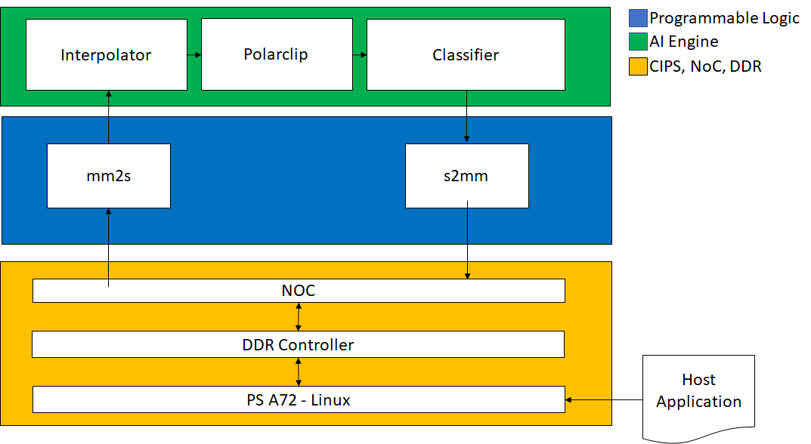

|Kernel|Type|Comment|
|------|-----|--------|
|MM2S|HLS|Memory Map to Stream HLS kernel to feed input data from DDR to AI Engine interpolator kernel through the PL DMA.|
|Interpolator|AI Engine|Half-band 2x up-sampling FIR filter with 16 coefficients. Its input and output are cint16 window interfaces and the input interface has a 16 sample margin.|
|Polar_clip|AI Engine|Determines the magnitude of the complex input vector and clips the output magnitude if it is greater than a threshold. The polar_clip has a single input stream of complex 16-bit samples, and a single output stream whose underlying samples are also complex 16-bit elements.|
|Classifier|AI Engine|This kernel determines the quadrant of the complex input vector and outputs a single real value depending which quadrant. The input interface is a cint16 stream and the output is a int32 window.|
|S2MM|HLS|Stream to Memory Map HLS kernel to feed output result data from AI Engine classifier kernel to DDR through the PL DMA.|

## Section 1: Compiling the AI Engine Code for AIE Simulator and Viewing Compilation Results in the Vitis Analyzer

1. Set the `SYSROOT` and `CXX` variables as mentioned in the **Introduction**.
2. Clean the `Working` directory to remove all files related to software emulation by running the following command:

    ```bash
    make clean
    ```

### Compiling an AI Engine ADF Graph for V++ Flow

To compile the graph type for use in either HW or HW_EMU, use:

```bash
make aie TARGET=hw
```

Or

```bash
v++ -c --mode aie --target hw --platform $PLATFORM_REPO_PATHS/xilinx_vck190_base_202520_1/xilinx_vck190_base_202520_1.xpfm --include "$XILINX_VITIS/aietools/include" --include "./aie" --include "./data" --include "./aie/kernels" --include "./" --aie.xlopt=0 --work_dir=./Work aie/graph.cpp
```

The generated output from `aiecompiler` is the `Work` directory and the `libadf.a` file. This file contains the compiled AI Engine configuration, graph, and Kernel `.elf` files.

#### Vitis Analyzer Compile Summary

Use Vitis Analyzer to view the AI Engine compilation results. It highlights the state of compilation and displays the graph solution in both the **Graph** and **Array** views. It provides guidance around the kernel code and allows you to open various reports produced by `aiecompiler`. The `aiecompiler` generates the `graph.aiecompile_summary` file, which is located in the `Work` directory.

To open the summary file, use the following command:

`vitis_analyzer -a ./Work/graph.aiecompile_summary`

The **Summary** View displays the compilation runtime, the compiler version used, the targeted platform, created kernels, and the exact command line used for the compilation.

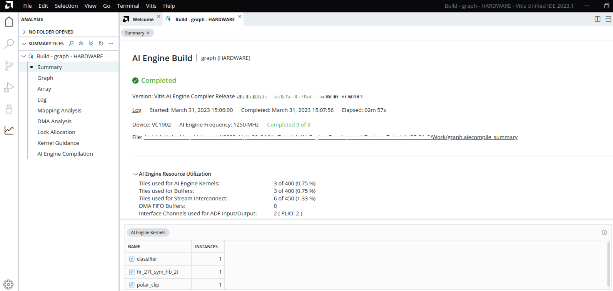

1. Click **Kernel Guidance**. This view provides a list of messages (INFO, Warning, Critical Warning) and provides optimization and best practice guidance for kernel development. By default, the view hides ***INFO*** messages.

    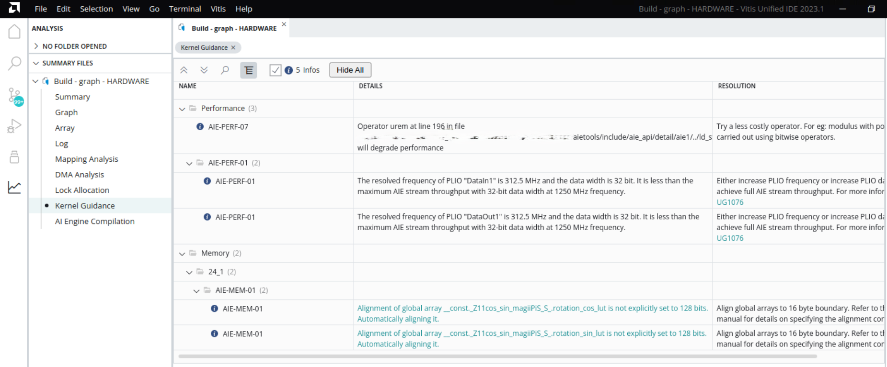

2. Click **Mapping Analysis**. This report provides detailed mapping information that the `aiecompiler` generates for mapping the graph to the AI Engine.

    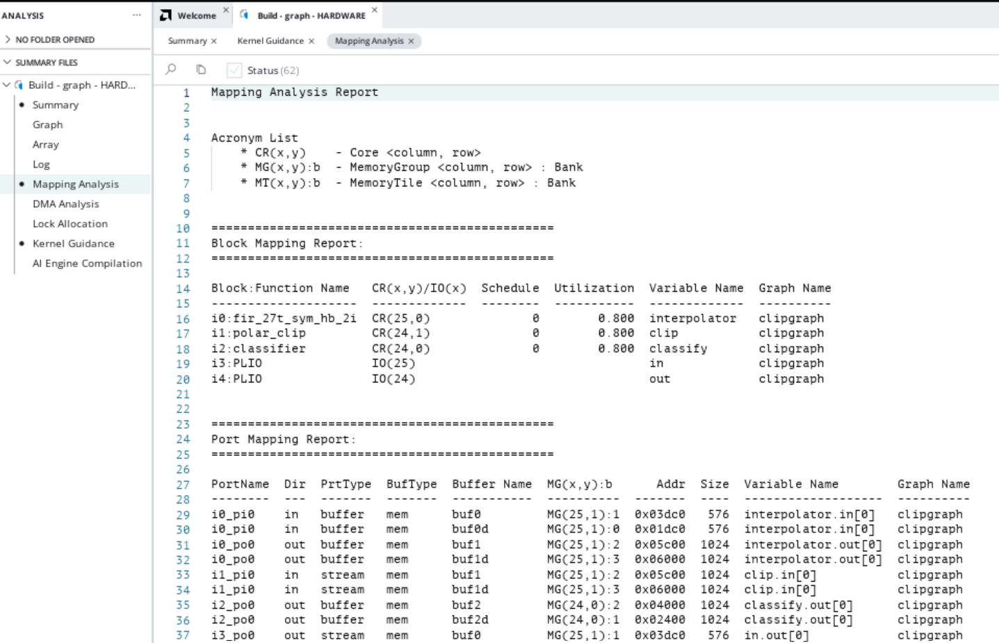

3. Click **DMA Analysis**. This is a text report showing a summary of the DMA accesses from the graph.

    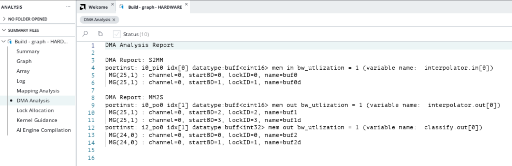

4. Click **Lock Allocation**. This shows the locks per buffer and where it is mapped in the ADF Graph.

    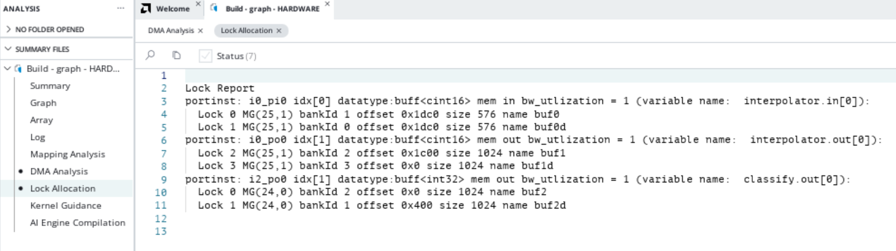

5. Click **Log**. This is the compilation log for your graph.

    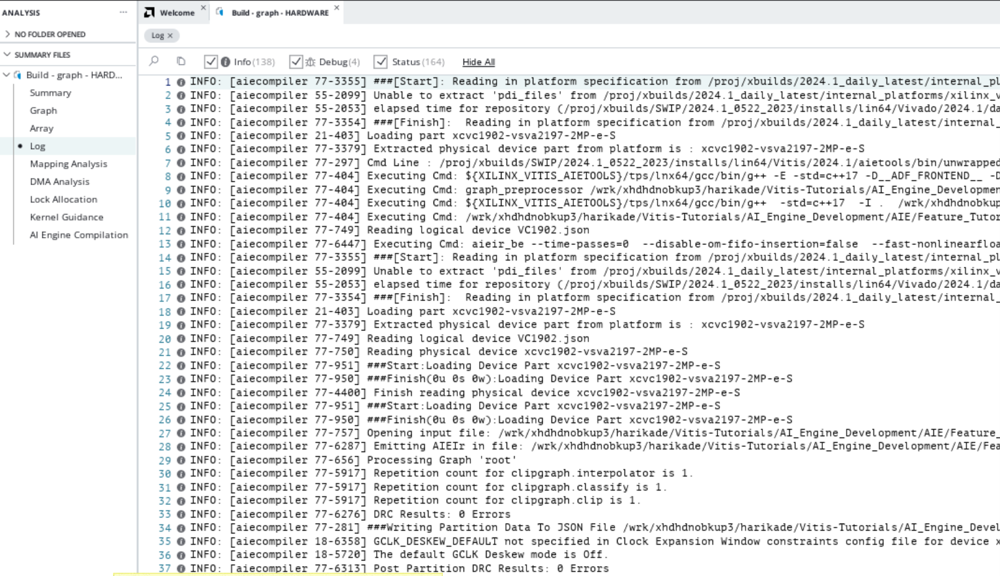

6. Click **AI Engine Compilation**. This view shows the individual logs and command line options for the individual Tile compilations. The following figure shows an example of the kernel in ***Tile [24,0]***.

    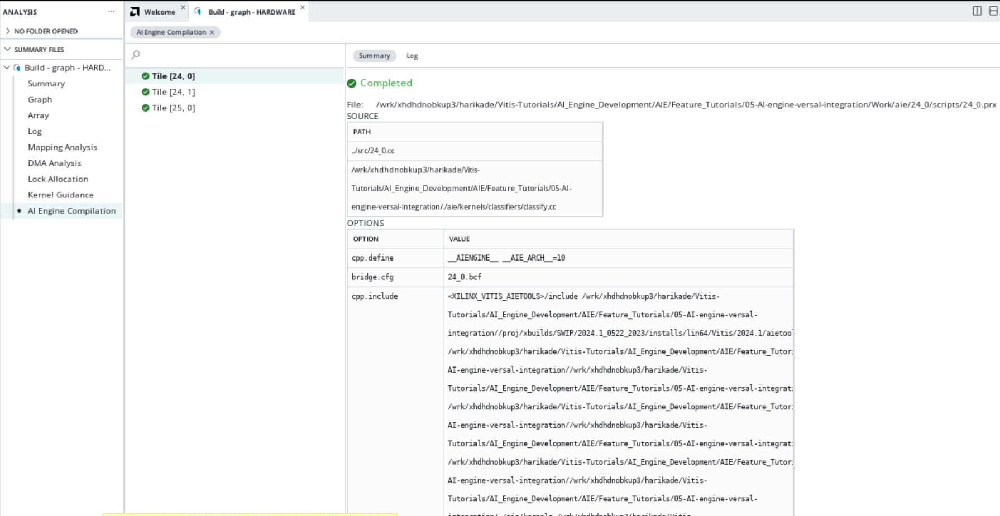
    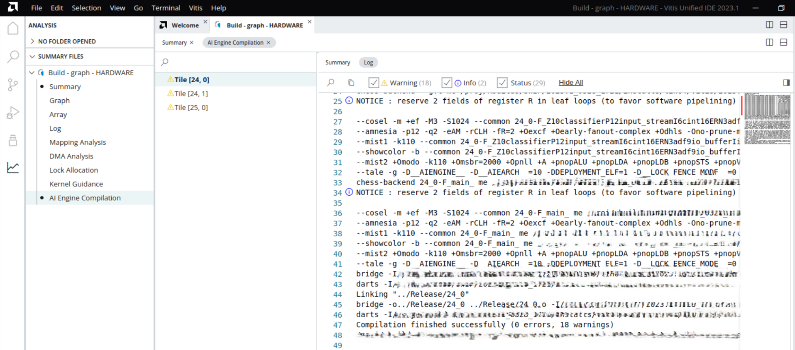

>**Note**: See the **Graph View** and **Array View** in the next section.

## Section 2: Simulate the AI Engine Graph using the `aiesimulator` and Viewing Trace and Profile Results in Vitis Analyzer

After compiling the graph, you can simulate your design with the `aiesimulator` command. This uses a cycle-approximate model to test your graph and get preliminary throughput information early in the design cycle, while the PL developers continue to work on the platform for the application.

**Note**: Simulating the design with VCD will increase simulation runtime. To learn more about this feature, see [AI Engine SystemC Simulator](https://docs.amd.com/access/sources/dita/map?isLatest=true&ft:locale=en-US&url=ug1076-ai-engine-environment).

1. To run simulation use the command:

    ```bash
    make sim TARGET=hw
    ```

    or

    ```bash
    aiesimulator --profile --dump-vcd=tutorial --pkg-dir=./Work
    ```

    | Flag | Description |
    | ---- | ----------- |
    | --profile | Profiles all kernels, or select kernels (col,row)...(col,row) |
    | --dump-vcd | Grabs internal signals of tiles and dumps it in a VCD file |
    | --pkg-dir | The ***Work*** directory |

2. When simulation has completed, use a terminal to navigate to the `aiesimulator_output` directory by running:

    `cd aiesimulator_output; ls`

   You see something similar to this:

    ```bash
    aiesim_options.txt      profile_funct_24_0.xml  profile_funct_25_0.xml  profile_instr_24_0.xml  profile_instr_25_0.xml
    data                    profile_funct_24_1.txt  profile_funct_25_1.txt  profile_instr_24_1.txt  profile_instr_25_1.txt  
    default.aierun_summary  profile_funct_24_1.xml  profile_funct_25_1.xml  profile_instr_24_1.xml  profile_instr_25_1.xml
    profile_funct_24_0.txt  profile_funct_25_0.txt  profile_instr_24_0.txt  profile_instr_25_0.txt
    ```

    The files prefixed with `profile_` are the outputs of the profiling and calculated per tile. In this tutorial, profiling occurs for all tiles used. You can limit profiling to specific tiles by providing the row and column of the tile. For more information about profiling with `aiesimulator`, refer to [Simulating an AI Engine Graph Application](https://docs.amd.com/r/en-US/ug1076-ai-engine-environment/Simulating-an-AI-Engine-Graph-Application). You can open these files to view the calculations. The Vitis Analyzer displays curated data better. The `data` directory contains the output files from the `graph.cpp` for the PLIO objects. Finally, `aiesimulator` produces the `default.aierun_summary`, which contains all information from `aiesimulator` with profiling and trace information. Opening this file in Vitis Analyzer lets you browse all the output files, and profile/trace data.

    >**NOTE**: The system generates the `tutorial.vcd` on the same level as the `./Work` directory.

    You can now open the generated `default.aierun_summary` from the `aiesimulator_output` directory for Vitis Analyzer.

3. To do this,run the command:

    ```bash
    vitis_analyzer -a ./aiesimulator_output/default.aierun_summary
    ```

    With this tool you can use a variety of views to debug and potentially optimize your graph.

    The **Summary** view provides an overview of running `aiesimulator`. As you can see in the following figure, it provides information on status, version used, time, and platform used. It also shows the command line used to execute.

    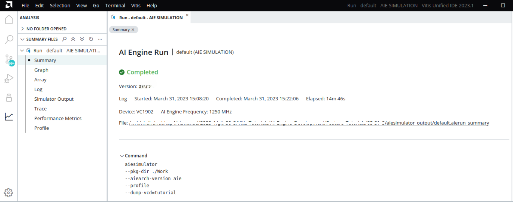

4. Click **Profile**.

    The **Profile View** provides detailed information collected during the simulation. Information includes cycle count, total instructions executed, program memory, and specific information per functions in the two tiles that the kernels are programmed.

    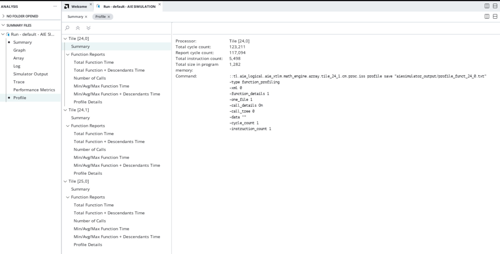

    This is the top-level view of the profile. The left column lets you select one of many types of reports generated per function.

5. Select the first **Total Function Time** from this column. The following appears.

    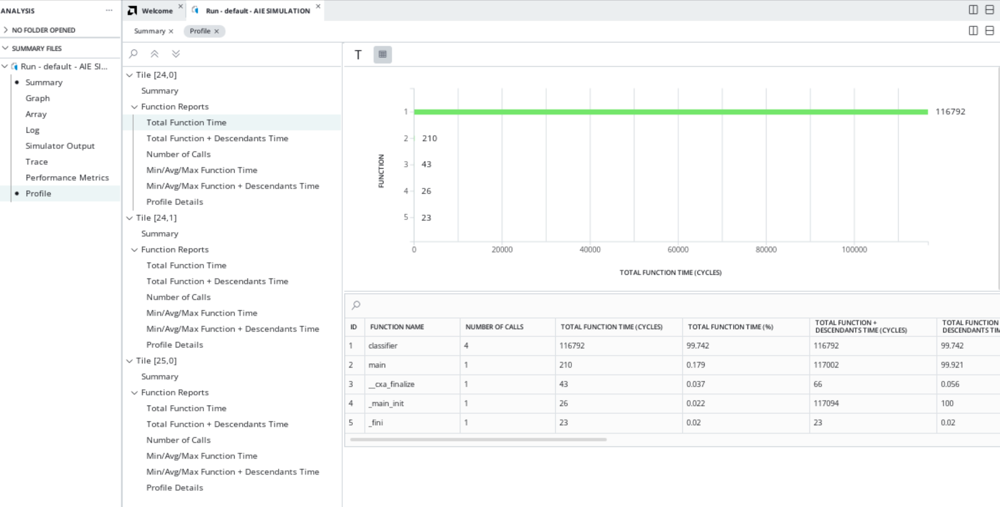

    In this chart you can see which function executes most, function time, and so on. This information can be useful in determining if the tile is under- or over-utilized in your design.

6. Click **Graph**.

    The **Graph** view provides an overview of your graph and shows how the graph design works in a logical fashion. In this view, you can see all the PLIO ports, kernels, buffers, and net connections for the entire Adaptive Data Flow (ADF) Graph.

    >**Note**: This view, and the **Array** view, have cross-probe selection. This means selecting an object in this view selects it in the other and vice versa.

    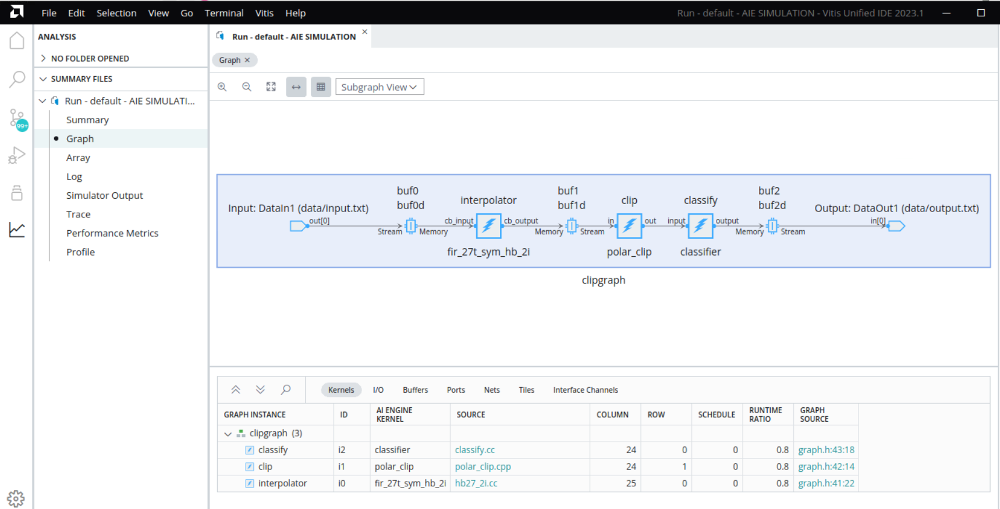

7. Click **Array**.

    The **Array** view provides a logical device view of the AI Engine, kernel placement, and how they connect to each other as well as to the shim.

    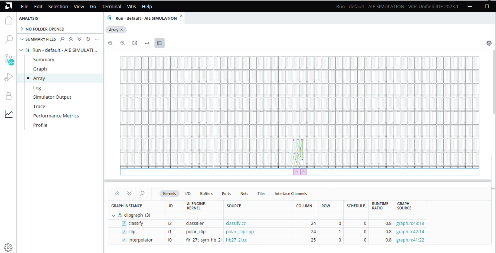

    * Cross probe to kernel and graph source files.
    * The table at the bottom shows the following:
      * **Kernel** - The kernels in the graph.
      * **PL** - Shows connections between the graph and PLIO.
      * **Buffer** - Shows all the buffers used for inputs/outputs of the graph and the buffers for kernels.
      * **Port** - Shows all the ports of each kernel and ADF Graph.
      * **Net** - Shows all nets, named and generated, mapped in the ADF Graph.
      * **Tile** - Shows tile data (kernels, buffers) of mapped tiles and their grid location.

    >**Tip**: For more detailed information about these tables, see [Section: "Viewing Compilation Results in the Vitis Analyzer"](https://docs.amd.com/r/en-US/ug1076-ai-engine-environment/Viewing-Compilation-Results-in-the-Analysis-View-of-the-Vitis-Unified-IDE).

    You can zoom into the view to get finer details of the AI Engine and see how to construct tiles as seen in the following screenshot.

8. To zoom in, click and drag from the upper-left to the lower-right of the area you want to view. A box shows up around the area to zoom. Below is a zoomed-in area.

    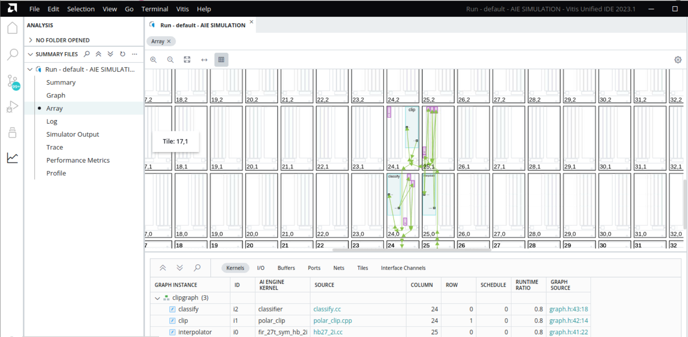

    In this zoomed in location you can see how the kernels connect to a variety of tiles and how the shim connects to the PLIO ports of this design.

9. Click **Simulator Output**.

    Finally, the **Simulator Output** view. This prints out the `output.txt` generated by the graph. This is a timestamped output.

    >**Note**: To compare this file to a golden one, remove the -`T ####ns`- from the file.

    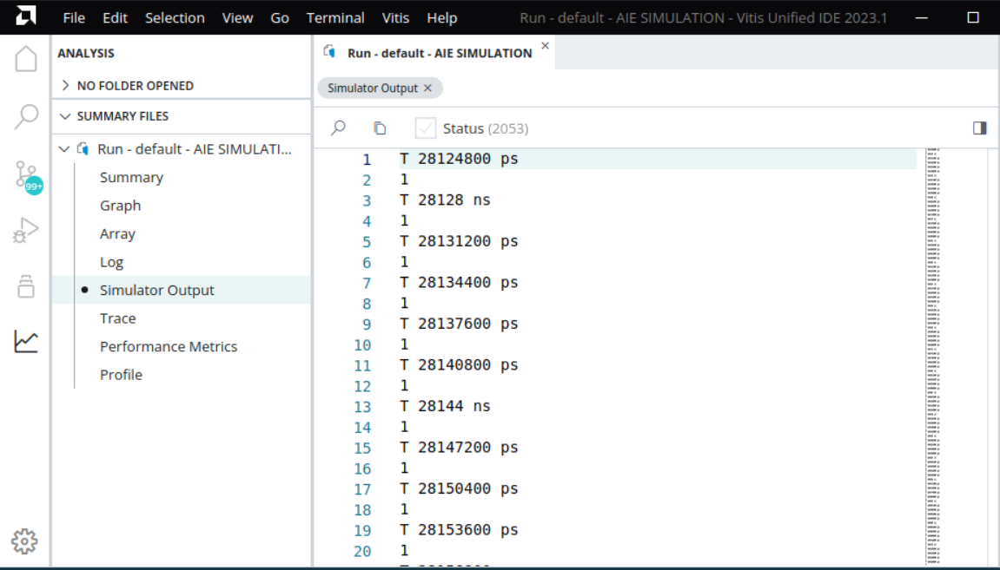

    You can make any changes to the ADF Graph or the kernels inside based on results of the `aiesimulator` by re-running the compiler. Then, view the results in Vitis Analyzer to see the changes you have made.

10. When you are done with Vitis Analyzer, close it by clicking **File** > **Exit**.

## Section 3: Run the Hardware Emulation, and View Run Summary in Vitis Analyzer

### 1. Compiling HLS Kernels Using v++

Compile the `mm2s`, and `s2mm` PL HLS kernels using the `v++` compiler command - which takes in an HLS kernel source and produces an `.xo` file.

To compile the kernels, run the following command:

```bash
make kernels TARGET=hw_emu
```

or

```bash
v++ -c --mode hls --platform $PLATFORM_REPO_PATHS/xilinx_vck190_base_202520_1/xilinx_vck190_base_202520_1.xpfm --config pl_kernels/s2mm.cfg
v++ -c --mode hls --platform $PLATFORM_REPO_PATHS/xilinx_vck190_base_202520_1/xilinx_vck190_base_202520_1.xpfm --config pl_kernels/mm2s.cfg
```

### 2. Using v++ to Link AI Engine and HLS Kernels with the Platform

After you compile and simulate the AI Engine kernels, graph, PL kernel, and HLS kernels, use `v++` to link them with the platform to generate an `.xsa`.

Use the `system.cfg` configuration file to connect the AI Engine and PL kernels in the design.

```ini
[connectivity]
nk=mm2s:1:mm2s
nk=s2mm:1:s2mm
sc=mm2s.s:ai_engine_0.DataIn1
sc=ai_engine_0.DataOut1:s2mm.s
```

To build the design, run the following command:

```bash
make xsa TARGET=hw_emu
```

or

```bash
v++ -l --platform $PLATFORM_REPO_PATHS/xilinx_vck190_base_202520_1/xilinx_vck190_base_202520_1.xpfm s2mm.xo mm2s.xo libadf.a -t hw_emu --save-temps -g --config system.cfg -o tutorial.xsa
```

Now you have a generated `.xsa` that can be used to execute your design on the platform.

### 3. Compiling the A72 Host Application

To compile the A72 host application, run the command:

```bash
make host TARGET=hw_emu
```

Or

```bash
cd ./sw

aarch64-xilinx-linux-g++ -Wall -c -std=c++14 -Wno-int-to-pointer-cast --sysroot=$SDKTARGETSYSROOT -I$SDKTARGETSYSROOT/usr/include/xrt -I$SDKTARGETSYSROOT/usr/include -I./ -I../aie -I$XILINX_VITIS/aietools/include -I$XILINX_VITIS/include -o main.o .cpp

aarch64-xilinx-linux-g++ main.o -lxrt_coreutil -L$SDKTARGETSYSROOT/usr/lib --sysroot=$SDKTARGETSYSROOT -L$XILINX_VITIS/aietools/lib/aarch64.o -o host.exe
cd ..
```

### 4. Packaging the Design

With the AI Engine outputs and the new platform created, you can now generate the Programmable Device Image (PDI) and a package for use on an SD card. The PDI contains all executables, bitstreams, and configurations of every element of the device. The packaged SD card directory contains everything to boot Linux and includes your generated application and `.xclbin`.

To package the design, run the following command:

```bash
make package TARGET=hw_emu
```

Or

```bash
cd ./sw
v++ --package -t hw_emu \
    -f $PLATFORM_REPO_PATHS/xilinx_vck190_base_202520_1/xilinx_vck190_base_202520_1.xpfm \
    --package.rootfs=$PLATFORM_REPO_PATHS/sw/versal/xilinx-versal-common-v2025.2/rootfs.ext4 \
    --package.image_format=ext4 \
    --package.boot_mode=sd \
    --package.kernel_image=$PLATFORM_REPO_PATHS/sw/versal/xilinx-versal-common-v2025.2/Image \
    --package.defer_aie_run \
    --package.sd_file host.exe ../tutorial.xsa ../libadf.a
cd ..
```

>**NOTE:** By default the `--package` flow creates a `a.xclbin` automatically when you do not set the `-o` switch.

### 5. Running Hardware Emulation

After packaging, everything is set to run emulation. Because you ran `aiesimulator` with profiling enabled, you can bring that to hardware emulation. You can pass the `aiesim_options.txt` to the `launch_hw_emu.sh` which enables the profiling options used in `aiesimulator` to apply to hardware emulation. To do this, add the `-aie-sim-options ../aiesimulator_output/aiesim_options.txt`.

>**NOTE:** Because Profiling is deprecated in the Hardware Emulation Flow, comment the line 'AIE_PROFILE=All' in `aiesimulator_output/aiesim_options.txt`

1. To run emulation use the following command:

    ```bash
    make run_emu TARGET=hw_emu
    ```

    or

    ```bash
    cd ./sw
    ./launch_hw_emu.sh -aie-sim-options ../aiesimulator_output/aiesim_options.txt -add-env AIE_COMPILER_WORKDIR=../Work
    ```

    When launched, use the Linux prompt presented to run the design. Note that the emulation process is slow, so do not touch the keyboard of your terminal or you might halt the emulation of the Versal booth (as it happens in the real HW board).

2. Execute the following command when the emulated Linux prompt appears:

    ```bash
    cd /run/media/*1
    export XILINX_XRT=/usr
    dmesg -n 4 && echo "Hide DRM messages..."
    ```

    This sets up the design to run emulation and remove any unnecessary DRM messaging.

3. Run the design using the following command:

    ```bash
    ./host.exe a.xclbin
    ```

    >**Note**: The design runs with dumping VCD, which extends emulation time. It might seem frozen, but it is not.

4. You should see an output displaying **TEST PASSED**. When this is shown, run the keyboard command: `Ctrl+A x` to end the QEMU instance.

5. To view the profiling results and trace in Vitis Analyzer, run the command:

    ```bash
    vitis_analyzer -a sw/sim/behav_waveform/xsim/default.aierun_summary
    ```

    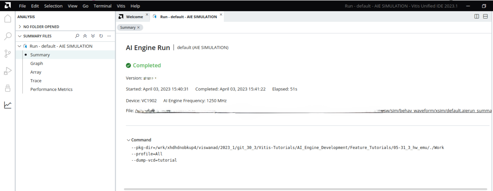

    When you open the run Summary, notice that it is the same layout as that from `aiesimulator`.

6. Click **Trace**. This opens the VCD data (as defined in the `aiesim_options.txt`). This gives detailed information about kernels, tiles, and nets within the AI Engine during execution. Here you can see stalls for each kernel. This can help you identify where they are originating.

    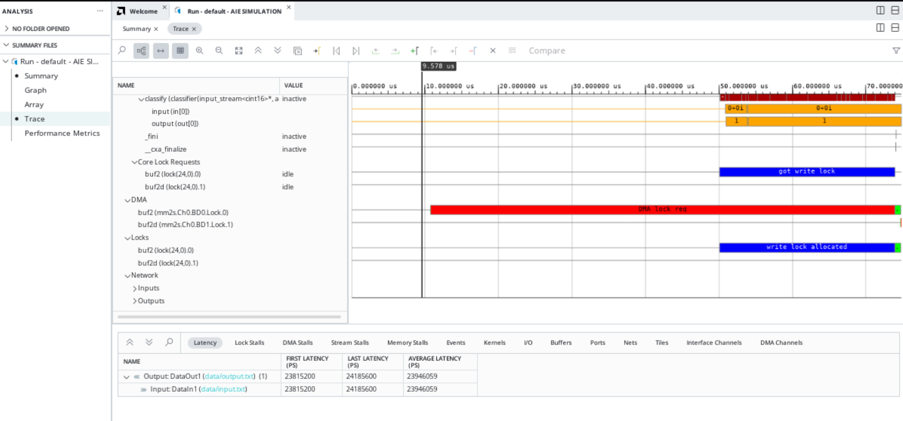

7. From the trace information, calculate the kernel latency as follows:

   Click the Trace in the AI Engine simulation run summary, and navigate to the any function to calculate the latency. For example, consider the classifier function.
   You can notice the function classifier ran for seven iterations. Zoom into the period of one iteration (between two main() function calls as follows), add a  marker, and drag it to the end of the kernel function as follows:
    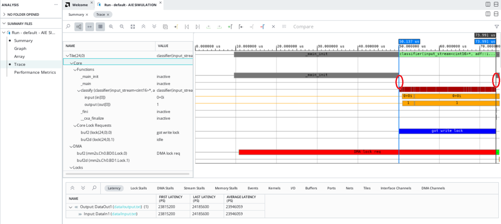

    Notice the difference of 25.093 us as highlighted above. This is the time the kernel took to complete one iteration.

   If you click the AI Engine Simulation Summary, you can notice the AI Engine Frequency as 1250 MHz, i.e., 0.8 ns, i.e., one cycle = 0.8 ns. Now, the classifier function took 23.854 us for one iteration, i.e., 23.854 us / 0.8 ns ~= 29817 cycles. Compare this with the latency you got during the aiesimulation where the AI Engine is a standalone module.

   You can also compare this calculated latency with the value (average latency) displayed in the trace.

8. Explore the two reports and note any differences and similarities. This helps you debug and optimize your design.

9. Open the `aiesimulator` run Summary by clicking **File** > **Open Summary**, navigating to the `aiesimulator_output` directory, and clicking `default.aierun_summary`.

    Explore the two reports and take note of any differences and similarities. This will help you debug and optimize your design.

10. Close out of the **Vitis Analyzer** and build for hardware.

## Section 4: Building and Running on Hardware

1. To build for hardware, run the following command:

    ```bash
    cd ..
    make xsa TARGET=hw
    ```

    or

    ```bash
    v++ -l --platform $PLATFORM_REPO_PATHS/xilinx_vck190_base_202520_1/xilinx_vck190_base_202520_1.xpfm s2mm.xo mm2s.xo libadf.a -t hw --save-temps -g --config system.cfg -o tutorial.xsa
   ```

2. Then re-run the packaging step with:

    ```bash
    make package TARGET=hw
    ```

    or

    ```bash
    cd ./sw
    v++ --package -t hw \
        -f $PLATFORM_REPO_PATHS/xilinx_vck190_base_202520_1/xilinx_vck190_base_202520_1.xpfm \
        --package.rootfs=$PLATFORM_REPO_PATHS/sw/versal/xilinx-versal-common-v2025.2/rootfs.ext4 \
        --package.image_format=ext4 \
        --package.boot_mode=sd \
        --package.kernel_image=$PLATFORM_REPO_PATHS/sw/versal/xilinx-versal-common-v2025.2/Image \
        --package.defer_aie_run \
        --package.sd_file host.exe ../tutorial.xsa ../libadf.a
    cd ..
    ```

    When you run on hardware, ensure you have a supported SD card. Format the SD card with the `sw/sd_card.img` file. Then plug the SD card into the board and power it up.

3. When a Linux prompt appears, run the following commands:

    ```bash
    dmesg -n 4 && echo "Hide DRM messages..."
    sudo -i
    enter password 'root'
    cd /run/media/mmcblk0p1
    export XILINX_XRT=/usr
    ./host.exe a.xclbin
    ```

You should see **TEST PASSED**. You have successfully run your design on hardware.

>**IMPORTANT**: To re-run the application you need to power cycle the board.

### Summary

In this tutorial you learned the following:

* How to compile PLIO and PL Kernels using `v++ -c`
* How to link the `libadf.a`, PLIO, and PL kernels to the `xilinx_vck190_base_202520_1` platform
* How to use Vitis Analyzer to explore the various reports generated from compilation and emulation/simulation
* How to package your host code, and the generated `xclbin` and `libadf.a` into an SD card directory
* How to execute the design for hardware emulation
* How to execute the design on the board

To read more about the use of the Vitis software platform in the AI Engine flow, refer to the AI Engine Tools and Flows User Guide: Integrating the Application Using the Vitis Tool Flow [UG1706](https://docs.amd.com/access/sources/dita/map?isLatest=true&ft:locale=en-US&url=ug1076-ai-engine-environment).

#### Support

GitHub issues are used for tracking requests and bugs. For questions go to [support.xilinx.com](https://adaptivesupport.amd.com/s/?language=en_US).

<p class="sphinxhide" align="center"><sub>Copyright © 2020–2026 Advanced Micro Devices, Inc.</sub></p>

<p class="sphinxhide" align="center"><sup><a href="https://www.amd.com/en/corporate/copyright">Terms and Conditions</a></sup></p>
