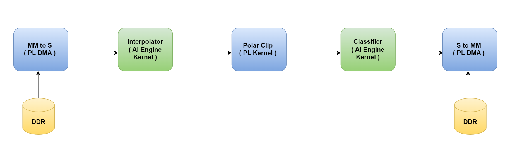
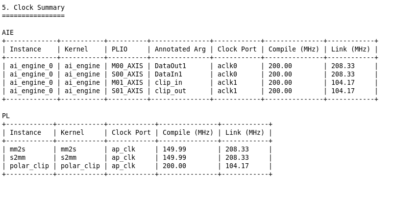

<table class="sphinxhide" style="width:100%;">
  <tr>
    <td align="center">
      <picture>
        <source media="(prefers-color-scheme: dark)" srcset="https://raw.githubusercontent.com/Xilinx/Image-Collateral/main/logo-white-text.png">
        
      </picture>
      <h1>AMD Vitis™ AI Engine Tutorials</h1>
      <a href="https://www.amd.com/en/products/software/adaptive-socs-and-fpgas/vitis.html">See Vitis™ Development Environment on amd.com</a>
        </br>
      <a href="https://www.amd.com/en/products/software/vitis-ai.html">See Vitis™ AI Development Environment on amd.com</a>
    </td>
  </tr>
</table>

# Versal System Design Clocking

***Version: Vitis 2025.2***

## Introduction

You can use the AMD Vitis™ compiler (`v++`) to develop an accelerated AI Engine design for the VCK190. You can also use this compiler to compile programmable logic (PL) kernels and connect these PL kernels to the AI Engine and PS device.

This tutorial covers clocking concepts for the Vitis compiler. It shows how to define clocking for an ADF Graph and PL kernels using clocking automation functionality. The design is a simple classifier design as shown in the following figure:



Prerequisites for this tutorial are:

* Familiarity with the `v++ -c --mode aie` flow
* Familiarity with the `gcc` style command line compilation

This design uses the following clocking steps:

| Kernel Location | Compile Setting |
| --- | --- |
| Interpolator, Polar Clip, & Classifier | AI Engine Frequency (1 GHz) |
| `mm2s` & `s2mm` | 150 MHz and 100 MHz (`v++ -c` & `v++ -l`) |
For detailed information, refer  the Clocking the PL Kernels section [here](https://docs.amd.com/r/en-US/ug1076-ai-engine-environment/Clocking-the-PL-Kernels).

**IMPORTANT**: Before beginning the tutorial, install the Vitis 2025.2 software. The Vitis release includes all the embedded base platforms including the VCK190 base platform that this tutorial uses. Also download the Common Images for Embedded Vitis Platforms from [this link](https://www.xilinx.com/support/download/index.html/content/xilinx/en/downloadNav/embedded-platforms/2025.2.html). The common image package contains a prebuilt Linux kernel and root file system that you can use with the AMD Versal™ board for embedded design development using Vitis.

Before starting this tutorial, run the following steps:

1. Go to the directory where you have unzipped the Versal Common Image package.
2. In a Bash shell, run the `/Common Images Dir/xilinx-versal-common-v2025.2/environment-setup-cortexa72-cortexa53-amd-linux` script. This script sets up the `SDKTARGETSYSROOT` and `CXX` variables. If the script is not present, you must run the `/Common Images Dir/xilinx-versal-common-v2025.2/sdk.sh`.
3. Set up your `ROOTFS` and `IMAGE` to point to the `rootfs.ext4`, and `Image` files located in the `/Common Images Dir/xilinx-versal-common-v2025.2` directory.
4. Set up your `PLATFORM_REPO_PATHS` environment variable to `$XILINX_VITIS/base_platforms/`.

This tutorial targets VCK190 production board for 2025.2 version.

## Objectives

This tutorial demonstrates:

* Clocking in Versal for PL and AIE kernels using the `--freqhz` directive.

## Step 1 - Building the ADF Graph

The ADF graph has connections to the PL through PLIO interfaces. These interfaces can have reference clocking either from the `graph.cpp` through the `PLIO()` constructor or through the `--pl-freq`. This helps determine what kind of clock to set on the PL kernels that connect to the PLIO. In this example, the reference frequency is set to 200 MHz for all PLIO interfaces.

**NOTE**: If you do not specify the `--pl-freq`, it defaults to 1/4 the frequency of the AI Engine frequency.

```bash
v++ -c --mode aie --target=hw -include="$(XILINX_VITIS)/aietools/include" --include="./aie" --include="./data" --include="./aie/kernels" --include="./" --freqhz=200000000 --aie.workdir=./Work aie/graph.cpp
```

| Flag | Description |
| ---- | ----------- |
| --target | Target how the compiler builds the graph. Default is `hw`. |
| --include | All the typical include files needed to build the graph. |
| --freqhz=200000000 | Sets all PLIO reference frequencies (in MHz). |
| --aie.workdir | The location of where the work directory is created. |

## Step 2 - Clocking the PL Kernels

In this design, you use three kernels, **MM2S**, **S2MM**, and **Polar_Clip**, to connect to the PLIO. The **MM2S** and **S2MM** are AXI memory-mapped to AXI4-Stream HLS designs to handle mapping from DDR and streaming the data to the AI Engine. The **Polar_Clip** is a free running kernel that only contains two AXI4-Stream interfaces (input and output) that receives data from the AI Engine, processes the data, and sends it back to the AI Engine. Clocking of these PLIO kernels is separate from the ADF Graph. You specify these when compiling the kernel and when linking the design together. There are different methods to achieve clocking.

Run the following commands.

```bash
    v++ -c --mode hls --platform $PLATFORM_REPO_PATHS/xilinx_vck190_base_202520_1 /xilinx_vck190_base_202520_1 .xpfm 
        --freqhz=150000000 --config pl_kernels/mm2s.cfg \

    v++ -c --mode hls --platform $PLATFORM_REPO_PATHS/xilinx_vck190_base_202520_1 /xilinx_vck190_base_202520_1 .xpfm 
        --freqhz=150000000 --config pl_kernels/s2mm.cfg \

    v++ -c --mode hls --platform $PLATFORM_REPO_PATHS/xilinx_vck190_base_202520_1 /xilinx_vck190_base_202520_1 .xpfm 
        --freqhz=200000000 --config ./pl_kernels/polar_clip.cfg \
```

OR use MHz, for example:

```bash
    v++ -c --mode hls --platform $PLATFORM_REPO_PATHS/xilinx_vck190_base_202520_1 /xilinx_vck190_base_202520_1 .xpfm 
        --freqhz=150MHz --config pl_kernels/mm2s.cfg \
```

OR prepare a config file and pass it during v++ compile, for example:

```bash
    v++ -c --mode hls --platform $PLATFORM_REPO_PATHS/xilinx_vck190_base_202520_1/xilinx_vck190_base_202520_1.xpfm 
        --config ./pl_kernels/polar_clip.cfg \

   In polar_clip.cfg:
    [hls]
	flow_target=vitis
	syn.file=polar_clip.cpp
	syn.cflags=-I.
	syn.top=polar_clip
	package.ip.name=polar_clip
	package.output.syn=true
	package.output.format=xo
	package.output.file=polar_clip.xo
	freqhz=200MHz
```

A brief explanation of the `v++` options:

| Flag/Switch | Description |
| --- | --- |
| `-c` | Tells `v++` to run the compiler.|
| `--mode` | Tells `v++` to run the HLS mode for the PL compilation.|
| `--platform` | (required) The platform to compile towards.|
| `--freqhz` | Tells the Vitis compiler to use a specific clock defined by a nine digit number. Specifying this helps the compiler make optimizations based on kernel timing.|
| `--config` | to specify the kernel config file that contains settings for synthesis like top function, kernel name etc.|

For additional information, refer to the [Vitis Compiler Command](https://docs.amd.com/r/en-US/ug1702-vitis-accelerated-reference/v-Command).

After completion, you have the `mm2s.xo`, `s2mm.xo`, and `polar_clip.xo` files ready for use by `v++`. The host application communicates with these kernels to read/write data into memory.

## Step 3 - `v++` linker -- Building the System

Now that you have a compiled graph (`libadf.a`) and the PLIO kernels (`mm2s.xo`, `s2mm.xo`, and `polar_clip.xo`), you can link everything up for the VCK190 platform.

A few things to remember in this step:

1. For PLIO kernels, you must specify their connectivity for the system.
2. Specify the clocking per PL kernel.
3. You need to determine the `TARGET`: *hw* or *hw_emu*.

To link kernels up to the platform and AI Engine, look at the `system.cfg` file. For this design, the config file looks like this:

```ini
[connectivity]
nk=mm2s:1:mm2s
nk=s2mm:1:s2mm
nk=polar_clip:1:polar_clip
stream_connect=mm2s.s:ai_engine_0.DataIn1
stream_connect=ai_engine_0.clip_in:polar_clip.in_sample
stream_connect=polar_clip.out_sample:ai_engine_0.clip_out
stream_connect=ai_engine_0.DataOut1:s2mm.s
```

Note some connectivity and clocking options here:

* `nk`: This defines your PL kernels as such: `<kernel>:<count>:<naming>`. For this design, you only have one of each `s2mm`, `mm2s`, and `polar_clip` kernels.
* `stream_connect`: This tells `v++` how to hook up the previous two kernels to the AI Engine instance. Remember, AI Engine only handles stream interfaces.

With the changes made, run the following command. In v++ link command, there are three ways to direct clocking in linker stage: ```--clock-id=<id_value>``` , ```--freqhz```, and ```–clock.freqHz```

```bash
    v++ --link --target hw --platform $PLATFORM_REPO_PATHS/xilinx_vck190_base_202520_1/xilinx_vck190_base_202520_1.xpfm 
    pl_kernels/s2mm.xo pl_kernels/mm2s.xo pl_kernels/polar_clip.xo ./aie/libadf.a --freqhz=200000000:mm2s.ap_clk --freqhz=200000000:s2mm.ap_clk 
    --config system.cfg --save-temps -o tutorial1.xsa
```

OR use system.cfg file to direct the clock using global ```freqhz``` option and using ```[clock]``` directive.

```bash
    [connectivity]
	nk=mm2s:1:mm2s
	nk=s2mm:1:s2mm
	nk=polar_clip:1:polar_clip
	sc=mm2s.s:ai_engine_0.DataIn1
	sc=ai_engine_0.clip_in:polar_clip.in_sample
	sc=polar_clip.out_sample:ai_engine_0.clip_out
	sc=ai_engine_0.DataOut1:s2mm.s
	freqhz=200MHz:s2mm.ap_clk

    [clock]
	freqHz=100000000:polar_clip.ap_clk
```

| Flag/Switch | Description |
| --- | --- |
| `--link` | Tells `v++` that it is linking a design, so only the `*.xo` and `libadf.a` files are valid inputs. |
| `--target` | Tells `v++` how far of a build it should go, hardware (which builds down to a bitstream) or hardware emulation (which builds the emulation models). |
| `--platform` | Same from the previous two steps. |
| `--freqhz` | Tells the Vitis compiler to use a specific clock defined by a nine digit number. Specifying this helps the compiler make optimizations based on kernel timing. |
| `--config` | to specify the kernel config file that contains settings for synthesis like top function, kernel name etc. |

After linking completes, you can view clock report generated by v++ --link after pre-synthesis: ``automation_summary_pre_synthesis.txt``

   

   **IMPORTANT: Do not change anything in this view. This is only for demonstration purposes.**

* As you can see, the AIE compile frequency= 200 MHz (same as given in command in step 1)
* To compile, PL kernel frequency for mm2s = 150 MHz (same as given in command in step 2.1)
* To compile, PL kernel frequency for s2mm = 150 MHz (same as given in command in step 2.2)
* To compile, PL kernel frequency for Polar_clip  = 200 MHz (same as given in command in step 2.3)

To check the platform frequency, give command at terminal: 

```bash
platforminfo $PLATFORM_REPO_PATHS/xilinx_vck190_base_202520_1/xilinx_vck190_base_202520_1.xpfm
```

The Vitis platform derives the clock frequency used for linking in the following way:

* Clock frequency used in linking for mm2s = 200 MHz (CLI)
* Clock frequency used in linking for s2mm = 200 MHz (CLI)
* Clock frequency used in linking for polar_clip = 100 MHz (config file)

Because these clock frequencies do not match the platform clock frequency, the Vitis platform picks the clock frequency from the platform which is within the default tolerance (+/- 10%) limit. If the link frequency is outside the limit of tolerance, the Vitis platform instantiates a new MMCM to generate the clock frequency used in linking.

So, for linking, the Vitis platform uses the clock frequency in the following way:

* For mm2s:

   Frequency given during linking = 200 MHz

   Frequency used by Vitis = 208.33 MHz (platform clock coming under the default tolerance of clock frequency given in link command)

* For s2mm:

    Frequency given during linking = 200 MHz

   Frequency used by Vitis = 208.33 MHz (platform clock coming under the default tolerance of clock frequency given in link command)

* For polar_clip:

    Frequency given during linking = 100 MHz

    Frequency used by Vitis = 104.17 MHz (platform clock coming under the default tolerance of clock frequency given in link command)

>**NOTE:** You can make any changes to the `system.cfg` file using the command line. Make sure to familiarize yourself with the Vitis compiler options by referring to the documentation [here](https://docs.amd.com/r/en-US/ug1393-vitis-application-acceleration/Vitis-Compiler-Configuration-File).

## Step 4 - Compiling Host Code

When the `v++` linker is complete, compile the host code that runs on the Linux that comes with the platform. Compiling code for the design requires the location of the **SDKTARGETSYSROOT** or representation of the root file system, that can be used to cross-compile the host code.

1. Open `./sw/host.cpp`, and familiarize yourself with the contents. Pay close attention to API calls and the comments provided.

    Note that this tutorial uses the Xilinx Runtime [(XRT)](https://xilinx.github.io/XRT) in the host application. This API layer communicates with the PL, specifically the PLIO kernels for reading and writing data. To understand how to use this API in an AI Engine application, refer to [Programming the PS Host Application](https://docs.amd.com/r/en-US/ug1076-ai-engine-environment/Programming-the-PS-Host-Application).

    Keep in mind that the output size of the kernel run is half of what was allocated earlier. By changing the `s2mm` kernel from a 32-bit input/output to a 64-bit input/output, the kernel call adjusts. If this is not changed, it hangs because XRT is waiting for the full length to process. In reality, half the count was completed (even though all the data is present). In the `host.cpp`, look at line 117 and 118 and comment them out. Uncomment the following line:

   ```C++
   xrtRunHandle s2mm_rhdl = xrtKernelRun(s2mm_khdl, out_bohdl, nullptr, sizeOut/2);
   ```

2. Open the `Makefile`, and familiarize yourself with the contents. Take note of the `GCC_FLAGS` and `GCC_LIB`.

   * `GCC_FLAGS`: You are compiling this code with C++.
   * `GCC_LIB`: Has the list of all the specific libraries you are compiling and linking with. This is the minimum list of libraries needed to compile an AI Engine application for Linux.

3. Close the makefile and run the command: `make host`.

With the host application fully compiled, you can now move to packaging the entire system.

## Step 5 - Packaging Design and Running on Board

To run the design on hardware using an SD card, you need to package all the files created. For a Linux application, you must make sure that the generated `.xclbin`, `libadf.a`, and all Linux info from the platform are in an easy to copy directory.

1. Open the `Makefile` with your editor of choice, and familiarize yourself with the contents specific to the `package` task.
2. In an easier to read command-line view, here is the command:

    ```bash
    v++ --package --target hw --platform $PLATFORM_REPO_PATHS/xilinx_vck190_base_202520_1 /xilinx_vck190_base_202520_1.xpfm \
        --package.rootfs ${ROOTFS} \
		--package.kernel_image ${IMAGE} \
		--package.boot_mode=sd \
		--package.image_format=ext4 \
		--package.defer_aie_run \
		--package.sd_file host.exe \
        tutorial1.xsa libadf.a
    ```

    **NOTE:** Remember to change the `${ROOTFS}` and `${IMAGE}` to the proper paths.

    Here you are invoking the packaging capabilities of `v++` and defining how it needs to package your design.

    | Switch/Flag | Description |
    | --- | --- |
    | `--package.rootfs` | This specifies the root file system to be used. In the case of the tutorial it is using the pre-built one from the platform. |
    | `--package.kernel_image` | This is the Linux kernel image to be used. This is also a using a pre-built one from the platform. |
    | `--package.boot_mode` | Used to specify how the design is to be booted. For this tutorial, an SD card is used, and it creates a directory with all the contents needed to boot from one. |
    | `--package.image_format` | Tells the packager the format of the Kernel image and root file system. For Linux, this should be `ext4`. |
    | `--package.defer_aie_run` | This tells the packager that when building the boot system to program the AI Engine, to stop execution. In some designs, you do not want the AI Engine to run until the application is fully loaded. |
    | `--package.sd_file` | Specify this to tell the packager what additional files need to be copied to the `sd_card` directory and image. |

3. Run the command: `make package`.
4. When the packaging is complete, do an `cd ./sw && ls` and notice that several new files were created, including the `sd_card` directory.
5. Format the SD card with the `sd_card.img` file.

When running the VCK190 board, make sure you have the right onboard switches flipped for booting from the SD card.

1. Insert the SD card and turn ON the board.
2. Wait for the Linux command prompt to be available on an attached monitor and keyboard.
3. To run your application enter the command: `./host.exe a.xclbin`.
4. You should see a **TEST PASSED** which means that the application ran successfully!

**IMPORTANT**: To re-run the application, you must power cycle the board.

## Challenge (Optional)

### Build the design for Hardware Emulation

Modifying the target for both **Step 3** and **Step 5**, link and package a design for hardware emulation, and run the emulation with the generated script, `launch_hw_emu.sh`.

## Summary

In this tutorial you learned the following:

* How to adjust clocking for PL Kernels and PLIO Kernels
* How to modify the `v++` linker options through the command-line, as well as the config file
* How to insert datawidth converters, clock-domain crossing, and FIFOs in `v++`
* How to run an AI Engine application on a VCK190 board

<p class="sphinxhide" align="center"><sub>Copyright © 2020–2026 Advanced Micro Devices, Inc.</sub></p>

<p class="sphinxhide" align="center"><sup><a href="https://www.amd.com/en/corporate/copyright">Terms and Conditions</a></sup></p>
