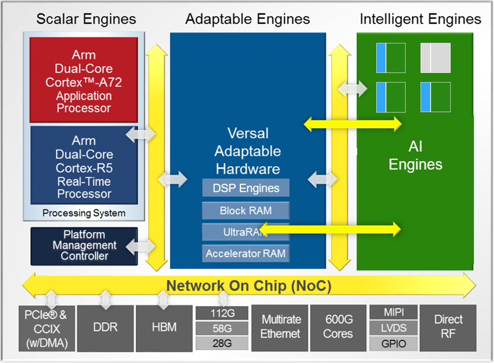
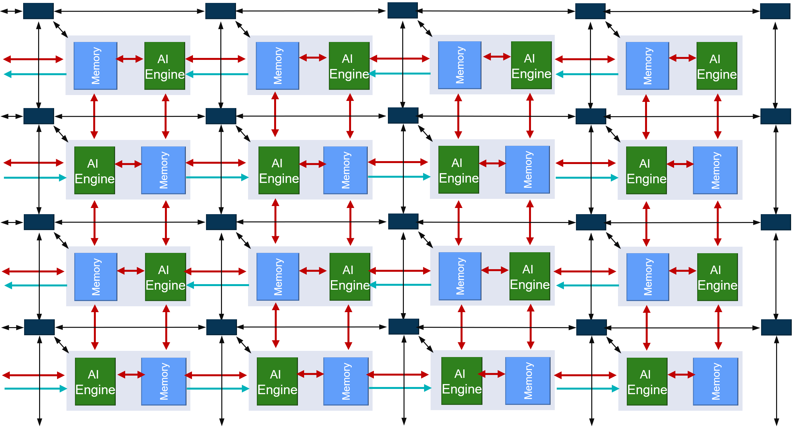
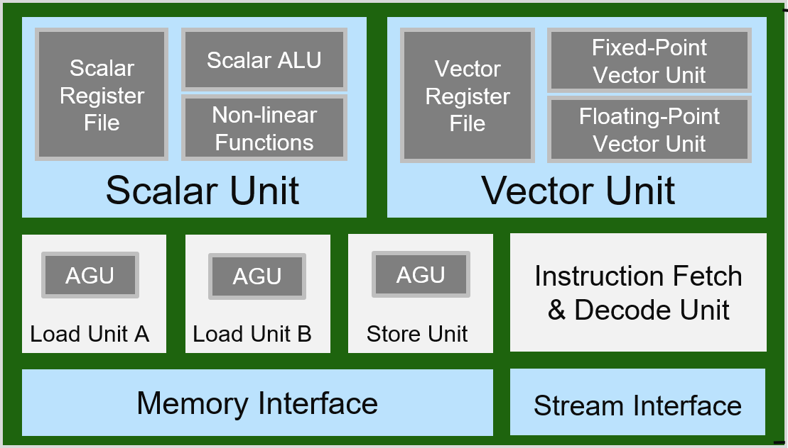
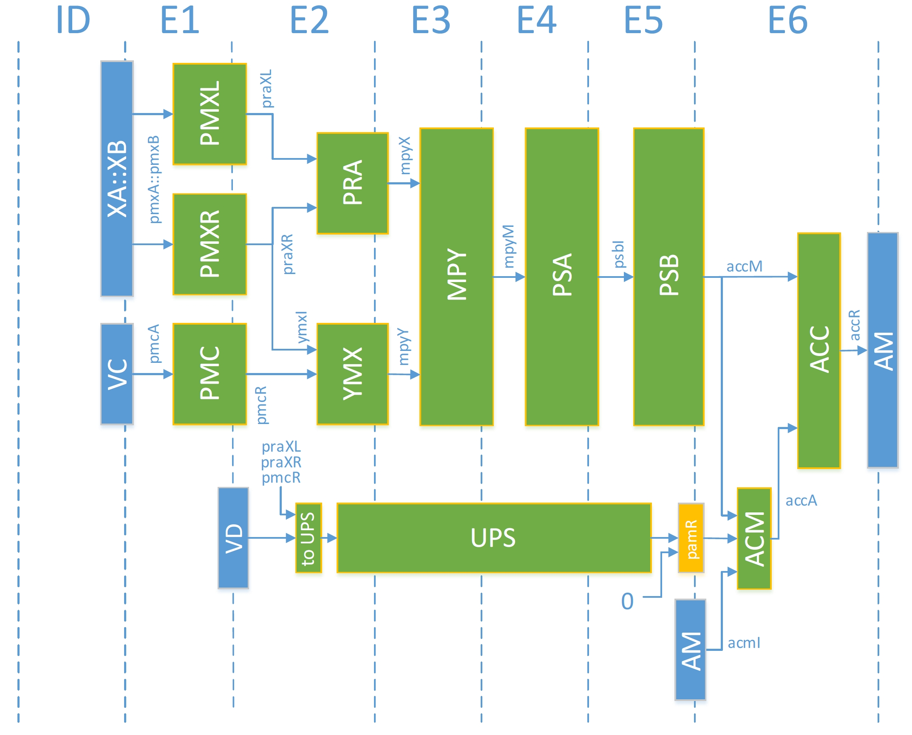
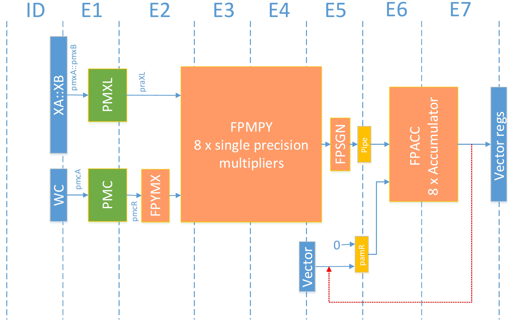

<table class="sphinxhide" style="width:100%;">
  <tr>
    <td align="center">
      <picture>
        <source media="(prefers-color-scheme: dark)" srcset="https://raw.githubusercontent.com/Xilinx/Image-Collateral/main/logo-white-text.png">
        
      </picture>
      <h1>AMD Vitis™ AI Engine Tutorials</h1>
      <a href="https://www.amd.com/en/products/software/adaptive-socs-and-fpgas/vitis.html">See Vitis™ Development Environment on amd.com</a>
        </br>
      <a href="https://www.amd.com/en/products/software/vitis-ai.html">See Vitis™ AI Development Environment on amd.com</a>
    </td>
  </tr>
</table>

# Using Floating-Point in the AI Engine

***Version: Vitis 2025.2***

## Introduction

This set of examples helps you understand floating-point vector computations within the AI Engine.

>**IMPORTANT**: Before beginning the tutorial, install the AMD Vitis™ software platform. The Vitis platform release includes all the embedded base platforms including the VCK190 base platform that this tutorial uses. Also download the Common Images for Embedded Vitis Platforms from [this link](https://www.xilinx.com/support/download/index.html/content/xilinx/en/downloadNav/embedded-platforms.html).

The ‘common image’ package contains a prebuilt Linux kernel and root file system that you can use with the AMD Versal™ board for embedded design development using the Vitis IDE.

Before starting this tutorial, run the following steps:

1. Go to the directory where you have unzipped the Versal Common Image package.
2. In a Bash shell, run the `/Common Images Dir/xilinx-versal-common-v2025.2/environment-setup-cortexa72-cortexa53-amd-linux` script. This script sets up the `SDKTARGETSYSROOT` and `CXX` variables. If the script is not present, run the `/Common Images Dir/xilinx-versal-common-v2025.2/sdk.sh`.
3. Set up your `ROOTFS`, and `IMAGE` to point to the `rootfs.ext4` and `Image` files located in the `/Common Images Dir/xilinx-versal-common-v2025.2` directory.
4. Set up your `PLATFORM_REPO_PATHS` environment variable to `$XILINX_VITIS/base_platforms/`.

This tutorial targets the VCK190 production board for 2025.2 version.

## AI Engine Architecture Details

AMD Versal™ adaptive SoCs combine programmable logic (PL), processing system (PS), and AI Engines with leading-edge memory and interfacing technologies to deliver powerful heterogeneous acceleration for any application. The hardware and software are targeted for programming and optimization by data scientists and software and hardware developers. A host of tools, software, libraries, IP, middleware, and frameworks enable Versal adaptive SoCs to support all industry-standard design flows.



The following figure shows an AI Engine array:



As you can see in the preceding image, each AI Engine is connected to four memory modules on the four cardinal directions.
The AI Engine and memory modules are both connected to the AXI-Stream interconnect.

The AI Engine is a VLIW (7-way) processor that contains:

- Instruction Fetch and Decode Unit
- A Scalar Unit
- A Vector Unit (SIMD)
- Three Address Generator Units
- Memory and Stream Interface

The following figure shows an AI Engine module:



Look at the fixed-point unit pipeline and floating-point unit pipeline within the vector unit.

### Fixed-Point Pipeline



In this pipeline, you can see the data selection and shuffling units: PMXL, PMXR, and PMC. The pre-add (PRA) is before the multiply block. Two lane reduction blocks (PSA, PSB) allow performing up to 128 multiplies and getting an output on 16 lanes down to two lanes. The accumulator block is fed either by its own output (AM) or by the upshift output. The feedback on the ACC block is only one clock cycle.

### Floating-Point Pipeline



In this pipeline, you can see that the selection and shuffling units (PMXL, PMC) are the same as in the fixed-point unit. Unlike the fixed-point pipeline, there is no lane reduction unit. The lanes at the input are also present at the output. Another difference is that the post-accumulator is on two clock cycles. If the goal is to reuse the same accumulator over and over, only one `fpmac` per two clock cycles can be issued.

## Floating-Point Intrinsics

You can perform a limited set of intrinsics with which a multitude of operations. All of them return either a `vector<float,8>` or `vector<cfloat,4>`, 256-bit vectors.

The basic addition, subtraction, and negation functions are as follows:

- fpadd
- fpadd_abs
- fpsub
- fpsub_abs
- fpneg
- fpneg_abs
- fpabs

The simple multiplier function is available with the following options:

- fpmul
- fpabs_mul
- fpneg_mul
- fpneg_abs_mul

The multiplication accumulation/subtraction function has the following options:

- fpmac
- fpmac_abs
- fpmsc
- fpmsc_abs

On top of these various intrinsics, you have a fully configurable version multiplier and multiply-accumulate:

- fpmul_conf
- fpmac_conf

### Start, Offset

In all the subsequent intrinsics, the input vectors go through a data shuffling function. Two parameters control this shuffling:

- Start
- Offset

Take the `fpmul` function:

_vector<float,8>_ **fpmul**(_vector<float,32>_ **xbuf**, _int_ **xstart**, _unsigned int_ **xoffs**, _vector<float,8>_ **zbuf**, _int_ **zstart**, _unsigned int_ **zoffs**)

- **xbuf, xstart, xoffs**: First buffer and shuffling parameters
- **zbuf, zstart, zoffs**: Second buffer and shuffling parameters

- **Start**: Starting offset for all lanes of the buffer
- **Offset**: Additional lane-dependent offset for the buffer. Definition takes 4 bits per lane.

For example:

_vector<float,8>_ **ret** = **fpmul**(**xbuf**,**2**,**0x210FEDCB**,**zbuf**,**7**,**0x76543210**)

```cpp
for (i = 0 ; i < 8 ; i++)
  ret[i] =  xbuf[xstart + xoffs[i]] * zbuf[zstart + zoffs[i]]
```

All values in hexadecimal:

| ret <br> Index <br> (Lane) | xbuf <br> Start | xbuf <br> Offset | Final <br> xbuf <br> Index | zbuf <br> Start | zbuf <br> Offset | Final <br> zbuf <br> Index |
| :---: | :---: | :---: | :---: | :---: | :---: | :---: |
|  0  | 2  | B  | D  | 7 | 0 | 7 |
| 1   | 2  | C  | E  | 7 | 1 | 8 |
| 2   | 2  | D  | F  | 7 | 2 | 9 |
| 3   | 2  | E  | 10  | 7 | 3 | A |
| 4   | 2  | F  | 11  | 7 | 4 | B |
| 5   | 2  | 0  | 2   | 7 | 5 | C |
| 6   | 2  | 1  | 3   | 7 | 6 | D |
| 7   | 2  | 2  | 4   | 7 | 7 | E |

#### fpneg, fpabs, fpadd, fpsub

##### fpneg

Output is the opposite of its input. Input can be either `float` or `cfloat` forming a 512-bit or a 1024-bit buffer (`vector<float,32>, vector<cfloat,16>, vector<cfloat,16>, vector<cfloat,8>`). The output is a 256-bit buffer as all the floating-point operators (`vector<float,8>, vector<cfloat,4>`).

_vector<float,8>_ 	**fpneg** (_vector<float,32>_ **xbuf**, _int_ **xstart**, _unsigned int_ **xoffs**)

```cpp
for (i = 0 ; i < 8 ; i++)
  ret[i] = - xbuf[xstart + xoffs[i]]
```

##### fpabs

Output is the absolute value of the input. It takes only real floating-point input vectors.

##### fpneg_abs

Output is the negation of the absolute value of the input. It takes only real floating-point input vectors.

##### fpadd, fpsub

Output is the sum (the subtraction) of the input buffers.

_vector<float,8>_ 	**fpadd** (_vector<float,8>_ **acc**, _vector<float,32>_ **xbuf**, _int_ **xstart**, _unsigned int_ **xoffs**)

| Parameter | Comment |
| ---: | :--- |
| **acc** | First addition input buffer. It has the same type as the output. |
| **xbuf** | Second addition input buffer. |
| **xstart** | Starting offset for all lanes of X. |
| **xoffs**	| 4 bits per lane: Additional lane-dependent offset for X. |

The executed operation is:

```cpp
for (i = 0 ; i < 8 ; i++)
  ret[i] = acc[i] + xbuf[xstart + xoffs[i]]
```

The following datatypes are allowed:

- **acc**: `vector<float,8>, vector<cfloat,4>`
- **xbuf**: `vector<float,32>, vector<float,16>, vector<cfloat,16>, vector<cfloat,8>`

##### fpadd_abs, fpsub_abs

Adds or subtracts the absolute value of the second buffer to the first one.

```cpp
for (i = 0 ; i < 8 ; i++)
  ret[i] = acc[i] +/- abs(xbuf[xstart + xoffs[i]])
```

#### fpmul

The simple floating-point multiplier comes in many different flavors mixing or not `float` and `cfloat` vector data types. When two `cfloat` are involved, the intrinsic results in two microcode instructions that must be scheduled. The first buffer can be either 512 or 1024-bit long (`vector<float,32>, vector<float,16>, vector<cfloat,16>, vector<cfloat,8>`). The second buffer is always 256-bit long (`vector<float,8>, vector<cfloat,4>`). Any combination is allowed.

_vector<float,8>_ **fpmul**(_vector<float,32>_ **xbuf**, _int_ **xstart**, _unsigned int_ **xoffs**, _vector<float,8>_ **zbuf**, _int_ **zstart**, _unsigned int_ **zoffs**)

Returns the multiplication result.

| Parameter | Comment |
| ---: | :--- |
| **xbuf**  | First multiplication input buffer. |
| **xstart**|	Starting offset for all lanes of X. |
| **xoffs**	| 4 bits per lane, additional lane-dependent offset for X. |
| **zbuf**	| Second multiplication input buffer. |
| **zstart**|	Starting offset for all lanes of Z. This must be a compile time constant. |
| **zoffs** | 4 bits per lane, additional lane-dependent offset for Z. |

```cpp
for (i = 0 ; i < 8 ; i++)
  ret[i] =  xbuf[xstart + xoffs[i]] * zbuf[zstart + zoffs[i]]
```

#### fpabs_mul

Only for real arguments. Signature is identical to `fpmul`:

_vector<float,8>_ **fpabs_mul**(_vector<float,32>_ **xbuf**, _int_ **xstart**, _unsigned int_ **xoffs**, _vector<float,8>_ **zbuf**, _int_ **zstart**, _unsigned int_ **zoffs**)

It returns the absolute value of the product:

```cpp
for (i = 0 ; i < 8 ; i++)
  ret[i] =  abs(xbuf[xstart + xoffs[i]] * zbuf[zstart + zoffs[i]])
```

#### fpneg_mul

Signature is identical to `fpmul`:

_vector<float,8>_ **fpneg_mul**(_vector<float,32>_ **xbuf**, _int_ **xstart**, _unsigned int_ **xoffs**, _vector<float,8>_ **zbuf**, _int_ **zstart**, _unsigned int_ **zoffs**)

It returns the opposite value of the product:

```cpp
for (i = 0 ; i < 8 ; i++)
  ret[i] =  - xbuf[xstart + xoffs[i]] * zbuf[zstart + zoffs[i]]
```

#### fpneg_abs_mul

Only for real arguments. Signature is identical to `fpmul`:

_vector<float,8>_ **fpneg_abs_mul**(_vector<float,32>_ **xbuf**, _int_ **xstart**, _unsigned int_ **xoffs**, _vector<float,8>_ **zbuf**, _int_ **zstart**, _unsigned int_ **zoffs**)

It returns the opposite value of the product:

```cpp
for (i = 0 ; i < 8 ; i++)
 ret[i] =  - abs ( xbuf[xstart + xoffs[i]] * zbuf[zstart + zoffs[i]] )
```

#### fpmac, fpmsc, fpmac_abs, fpmsc_abs

For all these functions, there is one more argument compared to the `fpmul` function. This is the previous value of the accumulator.

_vector<float,8>_ **fpmac**(_vector<float,8>_ **acc**, _vector<float,32>_ **xbuf**, _int_ **xstart**, _unsigned int_ **xoffs**, _vector<float,8>_ **zbuf**, _int_ **zstart**, _unsigned int_ **zoffs**)

- **fpmac** : Multiply operands and add to the accumulator
- **fpmsc** : Multiply operands and subtract from the accumulator
- **fpmac_abs** : Multiply operands and add the absolute value to the accumulator
- **fpmsc_abs** : Multiply operands and subtract the absolute value from the accumulator

The two "abs" variants are available only for real arguments.

#### fpmul_conf, fpmac_conf

These functions are fully configurable `fpmul` and `fpmac` functions. Consider that the output always has eight values because each part of the complex float is treated differently. A `vector<cfloat,4>` has the loop iterating over real0 - complex0 - real1 - complex1 ... . This capability allows flexibility and implements operations on conjugates.

```text
_vector<float,8>_ **fpmac_conf**(_vector<float,8>_ **acc**, _vector<float,32>_ **xbuf**, _int_ **xstart**, _unsigned int_ **xoffs**, _vector<float,8>_ **zbuf**, _int_ **zstart**, _unsigned int_ **zoffs**, _bool_ **ones**, _bool_ **abs**, _unsigned int_ **addmode**, _unsigned int_ **addmask**, _unsigned int_ **cmpmode**, _unsigned int &_ **cmp**)
```

Returns the multiplication result.

| Parameter | Comment |
| ---: | :--- |
| **acc** | Current accumulator value. This parameter does not exist for **fpmul_conf**. |
| **xbuf** | First multiplication input buffer. |
| **xstart** |	Starting offset for all lanes of X. |
| **xoffs**	| 4 bits per lane: Additional lane-dependent offset for X. |
| **zbuf** | **Optional** Second multiplication input buffer. If **zbuf** is not specified, the function takes **xbuf** as the second buffer. |
| **zstart** |	Starting offset for all lanes of Z. This must be a compile time constant. |
| **zoffs** | 4 bits per lane: Additional lane-dependent offset for Z. |
| **ones** | If true, the function replaces all lanes from Z with 1.0. |
| **abs** | If true, the function takes the absolute value before accumulation. |
| **addmode** | Select one of the `fpadd_add` (all add), `fpadd_sub` (all sub), `fpadd_mixadd` or `fpadd_mixsub` (add-sub or sub-add pairs). This must be a compile time constant. |
| **addmask** | 8 x 1 LSB bits: The function negates corresponding lane if bit is set (depending on addmode). |
| **cmpmode** | Use `fpcmp_lt` to select the minimum between accumulator and result of multiplication per lane, `fpcmp_ge` for the maximum and `fpcmp_nrm` for the usual sum. |
| **cmp** | **Optional** 8 x 1 LSB bits: When using `fpcmp_ge` or `fpcmp_lt` in "cmpmode," it sets a bit if the function chose the accumulator (per lane). |

## Floating-Point Examples

This set of examples shows how to use floating-point computations within the AI Engines in different schemes:

- FIR filter
- Matrix Multiply

### FIR Filter

The floating-point pipeline of the AI Engine has no post-add lane reduction hardware. All outputs are always on eight lanes (`float`) or four lanes (`cfloat`). This means you can compute eight (four) lanes in parallel, each time with a single coefficient. Use `fpmul` and then `fpmac` for all the coefficients, one by one.

The floating-point accumulator has a latency of two clock cycles, so you cannot use two `fpmac` instructions using the same accumulator back to back, but only every other cycle. You can optimize code by using two accumulators, used in turn, that add at the end to get the final result.

- Navigate to the `FIRFilter` directory.
- Type `make allaie` in the console and wait for completion of the four following stages:
  1. `aie`
  2. `aiesim`
  3. `aiecmp`
  4. `aieviz`

The last stage opens `vitis_analyzer` that allows you to visualize the graph of the design and the simulation process timeline.

In this design, you learned:

- How to use real floating-point data and coefficients in FIR filters.
- How to handle complex floating-point data and complex floating-point coefficients in FIR filters.
- How to organize the compute sequence.
- How to use `fpmul`, `fpmac`, and `fpadd` in the real and complex case.

#### Real Floating-Point Filter

In the example, the filter has 16 coefficients which do not fit within a 256-bit register. The system must update the register in the middle of the computation.

For data storage, the design uses a small 512-bit register and decomposes it in two 256-bit parts: W0, W1.

- First iteration
  - Part W0 is loaded with first eight samples  (0...7)
  - Part W1 with the next eight samples (8...15)
  - Part W0 with the following ones (16...23)
- Second iteration
  - Part W0 : 8...15
  - Part W1 : 16...23
  - Part W0 : 24...31

#### Complex Floating-Point Filter

`cfloat x cfloat` multiplications take two cycles to perform due to the absence of the post add. You can interleave these two parts with the two cycle latency of the accumulator.

There are still 16 coefficients but now they are complex. Hence, double the size. The code must update the coefficients four times for a complete iteration. The data transfer is also slightly more complex.

### Matrix Multiply

This example shows a matrix multiply (A*B) example with the simple `fpmul` and `fpmac` intrinsics in the real and complex case. In the complex case there are also two other examples using the `fpmul_conf` and `fpmac_conf` intrinsics to compute A*B and A*conj(B).

Because intrinsics are lane by lane computation oriented, this design uses this feature to compute a number of consecutive columns of the output matrix. Computing two rows of the output matrix absorbs the latency of two of the accumulator.

The code explains all the parameter settings for the `fpmul/mac_conf` intrinsics.

- Navigate to the `MatMult` directory.
- Type `make allaie` in the console and wait for completion of the four following stages:
  1. `aie`
  2. `aiesim`
  3. `aiecmp`
  4. `aieviz`

The last stage opens `vitis_analyzer` that allows you to visualize the graph of the design and the simulation process timeline.

In this design, you learned:

- How to organize matrix multiply compute sequence when using real or complex floating-point numbers.
- How to handle complex floating-point data and complex floating-point coefficients in matrix multiply operations.
- How to use `fpmul_conf` and `fpmac_conf` intrinsics.

## Support

GitHub issues are used for tracking requests and bugs. For questions, go to [support.amd.com](https://adaptivesupport.amd.com/s/?language=en_US).

<p class="sphinxhide" align="center"><sub>Copyright © 2020–2026 Advanced Micro Devices, Inc</sub><br><sup>XD021</sup></br></p>

<p class="sphinxhide" align="center"><sup><a href="https://www.amd.com/en/corporate/copyright">Terms and Conditions</a></sup></p>
