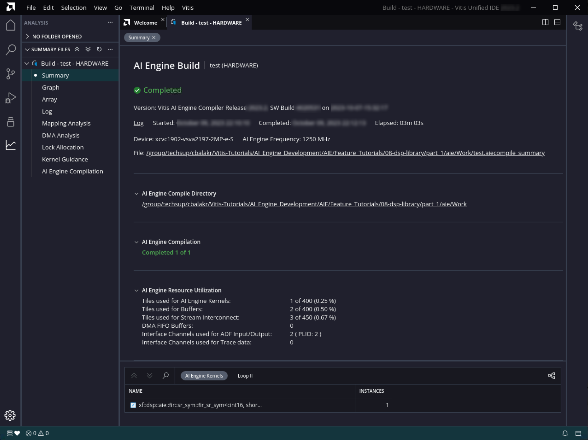
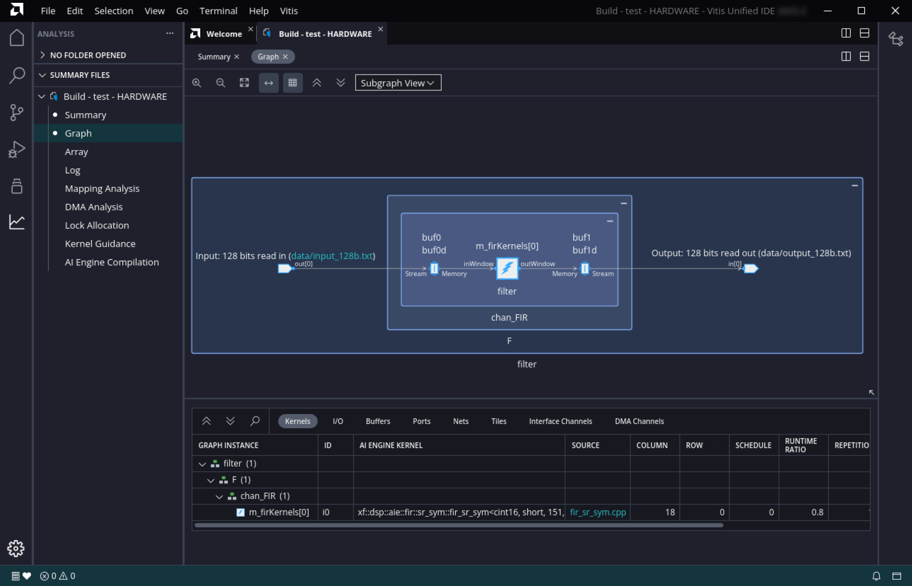
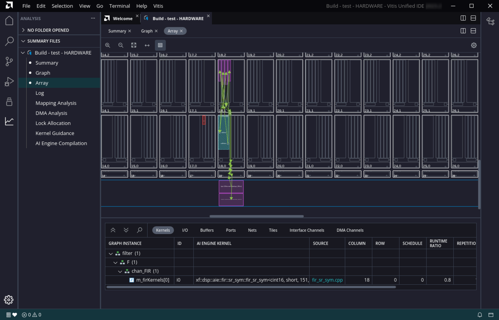
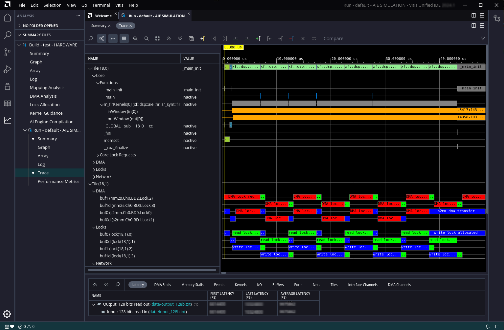
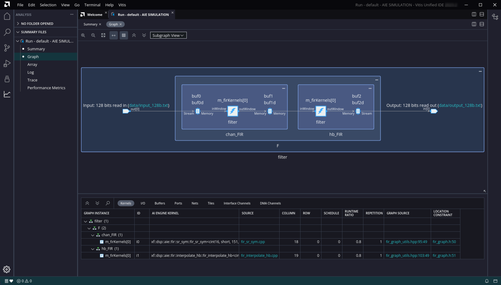
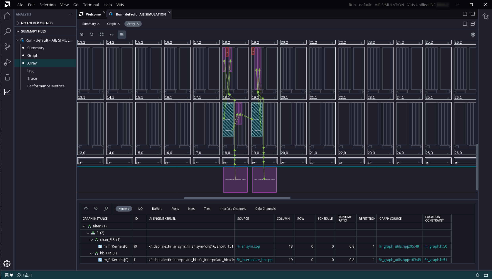
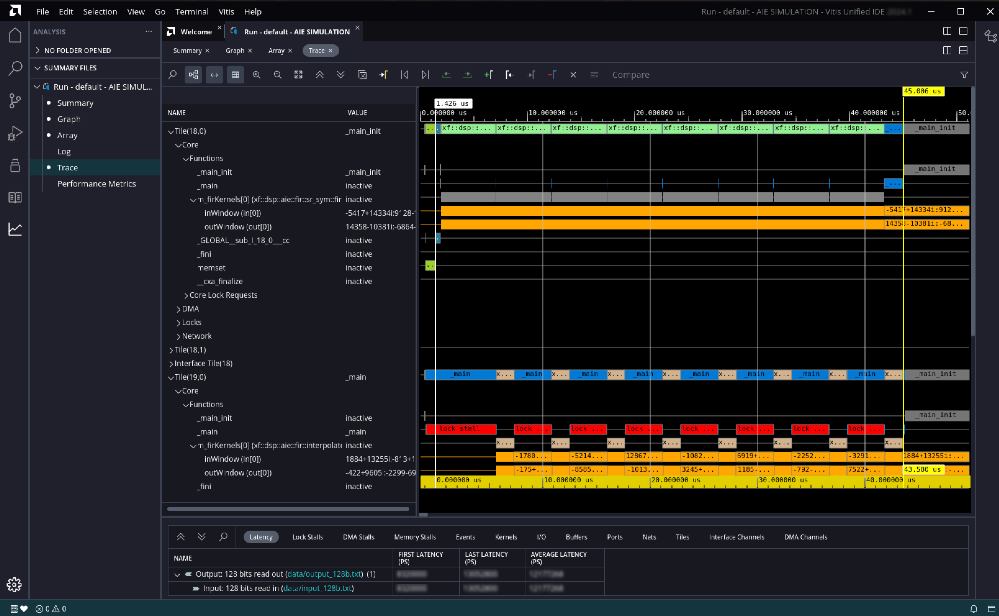
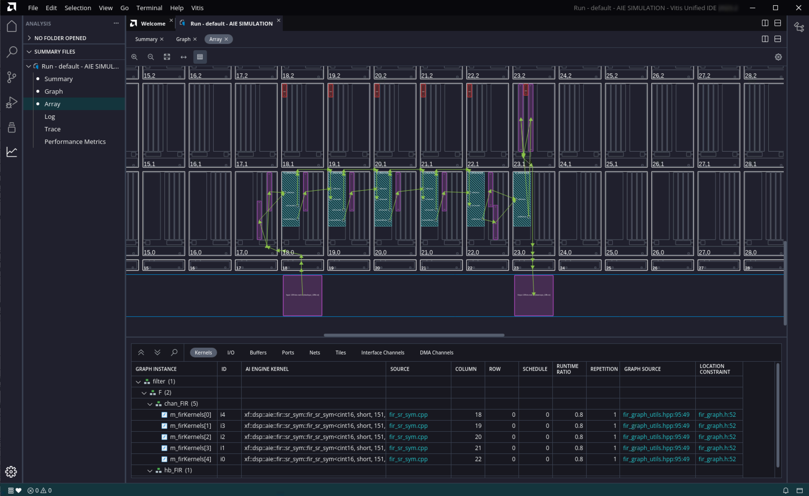
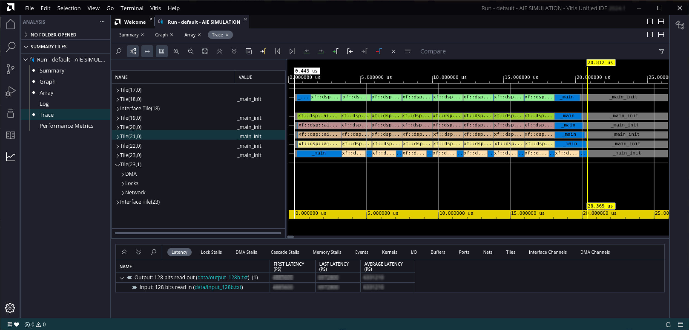

<table class="sphinxhide" width="100%">
 <tr width="100%">
    <td align="center"><h1>AI Engine Development</h1>
    <a href="https://www.xilinx.com/products/design-tools/vitis.html">See Vitis™ Development Environment on xilinx.com</br></a>
    <a href="https://www.xilinx.com/products/design-tools/vitis/vitis-ai.html">See Vitis™ AI Development Environment on xilinx.com</a>
    </td>
 </tr>
</table>

# DSP Library Tutorial

***Version: Vitis 2023.1***

## Introduction

The AMD Versal&trade; adaptive SoC is a fully software-programmable, heterogeneous compute platform that combines the processing system (PS) (Scalar Engines that include Arm® processors), Programmable Logic (PL) (Adaptable Engines that include the programmable logic), and AI Engines that belong to the Intelligent Engine category.

This tutorial demonstrates how to use kernels provided by the DSP Library for a filtering application, how to analyze the design results, and how to use filter parameters to optimize the design's performance using simulation. It does not take the design to a hardware implementation, however.

**IMPORTANT**: Before beginning the tutorial, make sure that you have read and followed the *Vitis Software Platform Release Notes* (v2023.1) for setting up the software and installing the VCK190 base platform.

Before starting this tutorial, run the following steps.

1. Set up your platform by running the `xilinx-versal-common-v2023.1/environment-setup-cortexa72-cortexa53-xilinx-linux` script as provided in the platform download. This script sets up the `SYSROOT` and `CXX` variables. If the script is not present, you _must_ run `xilinx-versal-common-v2023.1/sdk.sh`.
2. Set up your ROOTFS to point to the `xilinx-versal-common-v2023.1/rootfs.ext4`.
3. Set up your IMAGE to point to `xilinx-versal-common-v2023.1/Image`.
4. Set up your `PLATFORM_REPO_PATHS` environment variable based upon where you downloaded the platform.


## Table of Contents


* [Part 1: Creating a Single Kernel Graph](#part-1-creating-a-single-kernel-graph)

* [Part 2: Creating a Multi Kernel Graph](#part-2-creating-a-multi-kernel-graph)

* [Part 3: Optimizing Filter Performance](#part-3-optimizing-filter-performance)


### Objectives

After completing the tutorial, you should be able to:

* Build signal processing datapath using the AMD Vitis™ application acceleration development flow
* Evaluate the performance and resource utilization metrics of a design
* Adjust filter parameters to meet system performance requirements

### Tutorial Overview

This tutorial shows how to construct a simple two-stage decimation filter. This filter is not targeted at a specific real-life application, but is used to show how to use the DSP Library to construct filter chains.

* Part 1 shows how to use create an AI Engine project and instantiate a parameterized FIR filter from DSPLib
* Part 2 shows how to cascade filters together into a chain
* Part 3 shows how to optimize performance of the filter chain by tuning individual filters


## Part 1: Creating a Single Kernel Graph

Part 1 of this tutorial will:

* Shows a basic Makefile for AI Engine and X86 compilation, simulation, and visualization.
* Link in the DSPLib functions.
* Create a simple graph containing a parameterized DSPLib FIR filter.
* Compile and simulate the design.
* Evaluate the results.


### Understanding the Source Files

To begin this tutorial, go to the **part 1** directory:

    ```bash
    cd part_1
    ```

List the files available in `aie/src`:
```
ls aie/src
fir_graph.h  system_settings.h  test.cpp
```

The `system_settings.h` files is a standard header file that defines the constants used in this project. It includes the header file "<adf.h>". This is the Adaptive Data Flow (ADF) header file, which provides the classes used for specifying graphs. It also includes the FIR Filter kernel's header file, `fir_sr_sym_graph.hpp`.

The design itself is implemented in `fir_graph.h`. A graph is used to define elements and the connections between them that make up the design. Some of the key aspects of this file are mentioned below.

```C++
using namespace adf
namespace dsplib = xf::dsp::aie;
```

This simplifies accessing the ADF and DSPLib classes.

The FIR filter taps are declared as a vector, and initialized:
```C++
	std::vector<int16> chan_taps = std::vector<int16>{
		 -17,      -65,      -35,       34,      -13,       -6,       18,      -22,
         .... };

```

The following line instantiates the DSPLib FIR filter kernel, named chan_FIR (channel filter):
```C++
	dsplib::fir::sr_sym::fir_sr_sym_graph<DATA_TYPE, COEFF_TYPE, FIR_LEN_CHAN, SHIFT_CHAN, ROUND_MODE_CHAN, WINDOW_SIZE, AIES_CHAN> chan_FIR;
```

The filter's template parameters and their meanings can be found in UG1295.

```C++
	port<input> in;
	port<output> out;
```
Specifies the input and output ports for this graph.

```C++
		connect<>(in, chan_FIR.in[0]);
		connect<>(chan_FIR.out[0], out);
```
These statements connect our graph's input and outputs to the FIR filter's input and outputs, respectively.

```C++
		location<kernel>(chan_FIR.m_firKernels[0]) = tile(18,0);
```
This statement specifies a location attribute for the filter kernel. It specifies the X/Y location of the AI Engine tile within the AI Engine array in which to place the kernel. Location placements for kernels are optional, but shown here to illustrate how physical constraints can be incorporated into the source code. The results of this statement are seen later when viewing the compilation results.

There is a second graph that instantiates this `FIRGraph` and connects it to the PLIO elements, which are points at which data can be moved onto and off of the AI Engine array:

```C++
class TopGraph : public graph
	{
	public:
		input_plio in;
		output_plio out;

		FirGraph F;

		TopGraph()
		{
			in = input_plio::create("128 bits read in",  adf::plio_128_bits,"data/input_128b.txt",  250);
			out = output_plio::create("128 bits read out", adf::plio_128_bits,"data/output_128b.txt", 250);

			connect<> (in.out[0],F.in);
			connect<> (F.out, out.in[0]);
		};
	};
```

The third file, `test.cpp`, can be considered the testbench component. It is not intended for hardware implementation, but rather to drive the simulation. The main function is specified, which runs the simulation.

```C++
int main(void) {
    filter.init() ;
    filter.run(NUM_ITER) ;
    filter.end() ;
    return 0 ;
}
```

### Compile the application

The `Makefile` is simple. It allows the user to compile for two different targets `x86` and `hw`, visualizes the compiler output in `vitis_analyzer`, runs an AI Engine or X86 simulation, and visualizes also the output in `vitis_analyzer`.

Currently, the `Makefile` does not specify where the DSP Lib includes are located. The first step of this tutorial consists of adding the following lines, on line 27:
```Makefile
#########  Add DSP include files location   #########
DSP_FLAGS := --include=$(DSPLIB_ROOT)/L1/src/aie
DSP_FLAGS += --include=$(DSPLIB_ROOT)/L1/include/aie
DSP_FLAGS += --include=$(DSPLIB_ROOT)/L2/include/aie
```

Type `make aie` to run the following command:
```BASH
aiecompiler -target=hw $(AIE_FLAGS) $(DSP_FLAGS) $(AIE_GRAPH_FILES)
```

This compiles the design and maps it to the AI Engine Tiles.

Visualizing the compilation results is performed by typing `make compviz`, which runs the following command:
```BASH
	vitis_analyzer $(AIE_OUT_DIR)/test.aiecompile_summary
```

After `vitis_analyzer` opens, it displays the Summary page, which provides a brief summary of the project.




Selecting **Graph** on the navigation bar shows a diagram of the filter implementation. It illustrates the data connectivity points into and out of the graph (128-bit interfaces), and the symmetrical FIR filter kernel being implemented on a single tile with ping-pong buffers on either side of it.



Selecting **Array** on the navigation bar shows the physical implementation of the design on the AI Engine array. Here you can see the PLIO interfaces in pink, the AI Engine tile that implements the kernel in blue, and the ping-pong buffers in purple. Note the kernel is located in tile (18,0), which was specified in `fir_filter.h`. Clicking on the components on the diagram takes you to the appropriate tab below, which provides a description of the element. Conversely, you can select the various element tabs (Kernels / I/O / Buffers / Ports / Nets / Tiles / Interface Channels) and click on a component to see where it is located on the array.



You can select the other entries on the navigation bar to see additional implementation details.

When you are done examining the design, click **File -> Close Window**.

### Running the Design through Simulation

You can now run the simulation for this AI Engine application. To get a runtime trace of this simulation, specify it to the simulator. Add the following flag (`--dump-vcd=sim`) in the command belonging to the `aiesim` rule:
```MAKEFILE
aiesim:
	aiesimulator --pkg-dir=$(AIE_OUT_DIR) --dump-vcd=sim
```

Type `make aiesim` to run the AI Engine simulation, and it automatically generates the trace of this simulation stored in the file **sim.vcd**.


### Using Vitis Analyzer to look at the Simulation Results

Type `make aieviz` to visualize the output of the simulation in `vitis_analyzer`.

Selecting **Trace** on the navigation bar shows the simulation trace. Here you can see kernel activity, the DMA transfer activity, locks for the ping-pong buffers, and so on.



When you are done examining the design, click **File -> Close Window**.

## Part 2: Creating a Multi Kernel Graph

Part 2 of this tutorial will:

* demonstrate how to connect together filters to create a filter chain.
* show how to identify areas for optimization within the chain.


### Changes to the Filter Graph from Part 1

For Part 2, a halfband filter is cascaded after the FIR filter that was in the design in part 1.

In the `system_settings.h` file, constants for the halfband filter as well as the kernel's header file have been added, `fir_interpolate_hb_graph.hpp`.

In the file `fir_graph.h`, the following are the notable changes:

The constants for the second filter have been added:
```
    std::vector<int16> hb_taps = std::vector<int16>{
          23,      -63,      143,     -281,      503,     -845,     1364,    -2173,
        3557,    -6568,    20729,    32767};

```

The second (halfband) filter has been instantiated:
```
	dsplib::fir::interpolate_hb::fir_interpolate_hb_graph<DATA_TYPE, COEFF_TYPE, FIR_LEN_HB, SHIFT_HB, ROUND_MODE_HB, WINDOW_SIZE> hb_FIR;
```

Also, the output of the channel FIR filter is now cascaded into the halfband filter, whose output is now connected to the graph's output:
```
		connect<>(chan_FIR.out[0], hb_FIR.in[0]);
		connect<>(hb_FIR.out[0], out);
```

The class `TopGraph` and testbench file, `test.cpp`, are unchanged.

### Build AI Engine Emulation

Type `make aie` to build compile the graph.

### Running the Design through Simulation

Type `make aiesim` to run the simulation and save the trace.

### Using Vitis Analyzer to look at the Compilation and Simulation Results

Type `make aieviz` to start `vitis_analyzer`.

Selecting **Graph** on the navigation bar shows a diagram of the filter implementation. In this version of the graph, you can now see the two kernels, each implemented in the own AI Engine tile.



Selecting the **Array** option on the navigation bar shows the physical implementation of the design on the AI Engine array. You can see the two kernels are located in the tiles specified by the location constraints.



Selecting the **Trace** option on the navigation bar shows the tile (18,0) (the chan_FIR kernel) spending most of its time running kernel code, while tile (19,0) (hb_FIR) spends significant time being idle in _main. chan_FIR is the bottleneck in this datapath, which is not surprising because it has many more taps to compute.



In part 3, you are going to use filter parameters to attempt to increase the performance of the chan_FIR filter and the chain.

## Part 3: Optimizing Filter Performance

Part 3 of this tutorial will:

* demonstrate how to use the CASC_LEN parameter to increase the filter performance.


### Changes to the Filter Graph from Part 1

For Part 3, you are going to increase the performance of the design by adjusting the TP_CASC_LEN parameter on the chan_FIR filter.

In `system_settings.h`, the following parameter has been changed:
```
#define AIES_CHAN         5
```
informing the library element to allocate 5 AI Engines to the FIR filter kernel.

In `fir_graph.h`, the only change here is using a for loop to lock the location constraints of the chan_FIR AI Engine tiles.
```
        for (int i=0; i < AIES_CHAN; i++)  {
                location<kernel>(chan_FIR.m_firKernels[i]) = tile(18+i, 0);
        }
        location<kernel>(hb_FIR.m_firKernels[0]) = tile(23,0);
```

The testbench file, `test.cpp`, is unchanged.

### Build AI Engine Emulation

Type `make aie` to build compile the graph.

### Running the Design through Simulation

Type `make aiesim` to run the simulation and save the trace.

### Using Vitis Analyzer to look at the Compilation and Simulation Results

Type `make aieviz` to start `vitis_analyzer`.

Selecting **Graph** on the navigation bar shows a diagram of the filter implementation. It illustrates the data connectivity points into and out of the graph (128-bit interfaces), and the symmetrical FIR filter kernel being implemented on five tiles, followed by a single tile implementing the halfband filter.


Selecting the **Array** option on the navigation bar shows the physical implementation of the design on the AI Engine array; with the tile's locations being determined by the location constraints.



Selecting the **Trace** option on the navigation bar now shows the channel filter tiles ((18,0) through (22,0)) almost fully occupied with processing the data; the computational load between the channel filter's constituent engines now matching that of the halfband filter (23,0). The design now completes in 8 iterations in ~20 microseconds, compared to ~43.



## Conclusion

This tutorial has demonstrated the following:

* How to create a Makefile to handle an AI Engine Project
* How to create a graph based design description and described the basic element required
* How to incorporate the FIR filter elements provided by the DSP Library
* How to compile and simulate the design
* How to view and interpret the results of an AI Engine based compilation and simulation
* How to adjust FIR parameters to tune the design performance

In doing so, it has hopefully provided a foundation upon which the user can begin to create their own designs in Vitis using the DSP Library.


<p class="sphinxhide" align="center"><sub>Copyright © 2020–2023 Advanced Micro Devices, Inc</sub></p>

<p class="sphinxhide" align="center"><sup><a href="https://www.amd.com/en/corporate/copyright">Terms and Conditions</a></sup></p>
