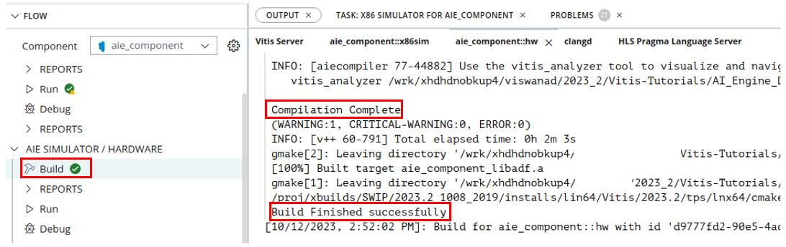
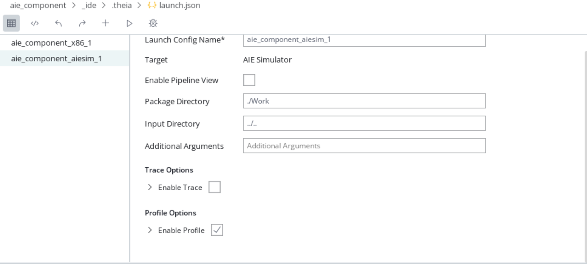
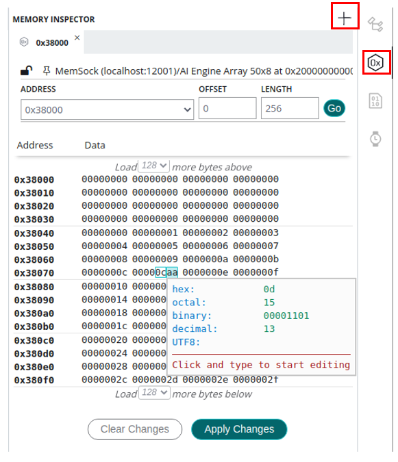
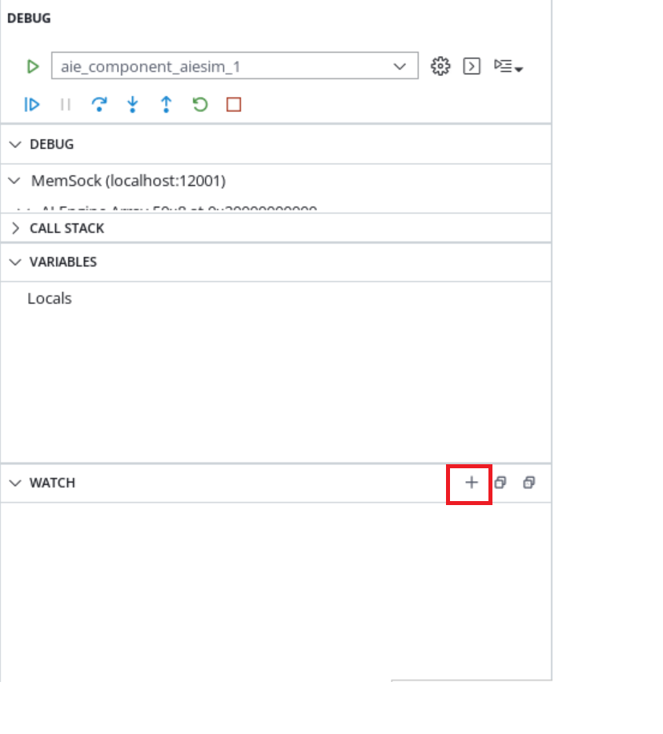
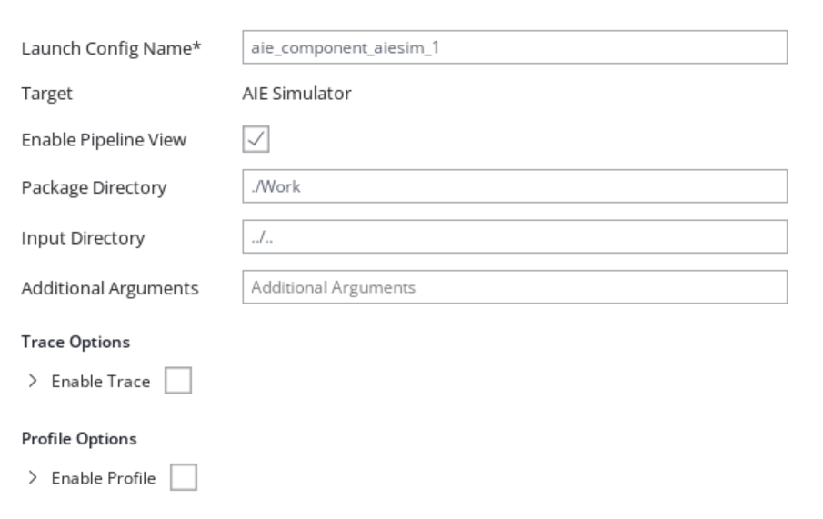

<table class="sphinxhide" width="100%">
 <tr width="100%">
    <td align="center"><h1>AI Engine Development</h1>
    <a href="https://www.xilinx.com/products/design-tools/vitis.html">See Vitis™ Development Environment on xilinx.com</br></a>
    <a href="https://www.xilinx.com/products/design-tools/vitis/vitis-ai.html">See Vitis™ AI Development Environment on xilinx.com</a>
    </td>
 </tr>
</table>

# AI Engine Simulation Debug Walkthrough

## Introduction

The AI Engine simulator (aiesimulator) models the timing and resources of the AI Engine array, while using transaction-level SystemC models for the NoC and double-data rate (DDR) memory. This allows for faster performance analysis of your AI Engine applications and accurate estimation of the AI Engine resource use with cycle-approximate timing information. This takes into account the hardware constraints, such as heap/stack sizes and proram memory size, for verifying the design and keeping track of those detailed timing information that makes the simulation slow and resource intensive.

The AI Engine simulator allows stepping through the AI Engine compiler-generated assembly code which aids in code optimization; however, source level visibility could be limited due to compiler optimization. This section discusses about some important features (listed below) that ease the debugging of the design at AIE Simulation level.  

Before starting this tutorial:

* It is expected that you have run the steps to set the environment variables as described in [Introduction](../README.md#Introduction).
* Create a system project manually using the steps mentioned in [Port the Command Line project to the Vitis IDE System Project](../CreateIDESystemProj.md), or download the AMD Vitis&trade; exported project as instructed in [Download the Vitis IDE Project](../README.md#Download-Vitis-IDE-project).
* Open the Vitis IDE tool by typing `vitis` in the console, set the workspace, and the IDE opens. Click **File**->**Import**, select the **Vitis exported project zip file**, browse to the above zip file, and click `Next`. Enable the check box, **System Projects**, and click **Finish**.

## Features

<table style="width:100%">

<tr>
<td>
 <a href="./README.md#Build-and-simulate-in-Vitis-IDE">Build and Simulate in the Vitis IDE</a>
</td>
<td>
Demonstrates how to use the Vitis IDE to build and simulate an AI Engine design.
</td>
</tr>
	
<tr>
<td>
<a href="./README.md#Debug-using-printf">Debug Using printf</a>
</td>
<td>
Explains how to add `printf` statement, and view the output in the console.
</td>
</tr>

<tr>
<td>
<a href="./README.md#Debug-using-Vitis-IDE-debugger">Debug Using the Vitis IDE Debugger</a>
</td>
<td>
Explores different debugging techniques that uses the Vitis IDE debugger.
</td>
</tr>

<tr>
<td>
<a href="./README.md#Enabling-profile-and-trace-options">Enabling Profile and Trace Options</a>
</td>
<td>
Explains how to enable profile and trace options in the Vitis IDE. Explores different event trace dump options like VCD and WDB.
</td>
</tr>

<tr>
<td>
<a href="./README.md#Deadlock-detection">Deadlock Detection</a>
</td>
<td>
Shows a practical deadlock scenario and some simulator options to identify the deadlock.
</td>
</tr>

<tr>
<td>
<a href="./README.md#Visualizing-deadlock-in-Vitis-Analyzer">Visualizing Deadlock in the Vitis Analyzer</a>
</td>
<td>
Explains how to visualize deadlock using trace information in the Vitis Analyzer, and identify the root cause.
</td>
</tr>

<tr>
<td>
<a href="./README.md#Debugging-memory-access-violations">Debugging Memory Access Violations</a>
</td>
<td>
Introduces an Out of Bound read access and explains how to identify the violations using the AI Engine simulator options.
</td>
</tr>

<tr>
<td>
<a href="./README.md#Single-kernel-debug">Single Kernel Debug</a>
</td>
<td>
Explains how to debug a single kernel design using a pipeline view in the Vitis IDE.
</td>
</tr>

<tr>
<td>
<a href="./README.md#Design-performance-debug">Design Performance Debug</a>
</td>
<td>
Shows how to calculate kernel latency and throughput using profile information.
</td>
</tr>

</table>

# Section 1

## Build and Simulate in the Vitis IDE

1. From the left pane in the Vitis IDE, select the AI Engine Component, and expand to locate and select the `aiecompiler.cfg` file to open the compiler configuration settings.
2. Select the **XLOpt** settings and under the **Kernel optimization** setting, select the **0 - None** from the drop-down. This gives greater visibility during the AI Engine debug.
    

3. Right-click the *[aiengine]* domain project, select **C/C++ Build Settings**, choose **Miscellaneous** -> **Optimization** -> from the drop down choose **No Optimizations(xlopt=0)**. This option helps IDE debugging capability by disabling any kernel optimizations.
4. Now, in the **Flow** navigator window, select the **Build** option under **AIE SIMULATOR/HARDWARE**. This builds the AI Engine component for AIE Simulation target. Once the build completes, you see the **Compilation Complete** and **Build Finished Successfully** messages in the console and a green tick mark as highlighted below.
    
5. In the **Flow** navigator window, under **AIE SIMULATION/HARDWARE**, select the **Run** option. If there is no existing launch configuration, you need to create one by clicking **Create Configuration** -> **New Launch Configuration** -> **AIESim**.
    
6. You can change the Launch Config Name, and click the **Run** button to start the simulation for the AIE simulation target. When the simulation completes, the following output in the console is displayed.

7. Right-click the *[aiengine]* domain project, and select the **Run As → Launch AIE Emulator** option to start the simulation for the aiesimulation target. When the simulation completes, the following output in the console is displayed:

8. The aiesimulator output files from design are located at `${PROJECT}/Emulation-AIE/aiesimulator_output/data`, and the golden output data is located at `09-debug-walkthrough/reference_output/`. Verify the output files `${PROJECT}/Emulation-AIE/aiesimulator_output/data/output_upscale.txt` and `${PROJECT}/Emulation-AIE/aiesimulator_output/data/output_data_shuffle.txt` against the golden files `09-debug-walkthrough/reference_output/upscale.txt` and `09-debug-walkthrough/reference_output/data_shuffle.txt` to ensure that the design's I/O functionalities are correct. The Vitis IDE supports compare with the feature to compare two files.
   * Add the golden data to the `${PROJECT}/data/` by right clicking the `data/` directory in the *[aiengine]* domain project, and select **Import sources**.
   * Highlight the two files to be compared.
   * Right-click one of highlighted files, and select **compare with** > **each other with transformation**. Click the **Predefined filters** icon (as shown below). Enable the **Remove timestamp** checkmark, and click **OK** twice. Selecting **each other with transformation** is required because the AI Engine simulation inserts a timestamp for each output data. For example, compare `${PROJECT}/data/golden_upscale.txt` and `${PROJECT}/Emulation-AIE/data/output_upscale.txt`.
.

# Section 2

## Debug Using printf

The simplest form of tracing is to use a formatted `printf()` statement in the code for printing debug messages. Visual inspection of intermediate values and addresses can help you understand the progress of program execution. No additional include files are necessary for using `printf()` other than standard C/C++ includes (`stdio.h`). You can add `printf()` statements to your code to be processed during the aiesimulation or hardware emulation, and remove them or comment them out for hardware builds.

1. Open the source file, `src/kernels/upscale.cc`. Add the following lines after `in_t = *IniIter++;`:

    ```
    float * print_ptr = (float*)&in_t;
    for(int pp=0;pp<16;pp++)
        printf("Iteration-%d -> Vector-%d -> value = %f\n",i,pp,print_ptr[pp]);
    ```

    >**NOTE:** Adding `printf()` statements to your AI Engine kernel code will increase the compiled size of the AI Engine program. Be careful that the compiled size of your kernel code does not exceed the per-AI Engine processor memory limit of 16 KB.
2. Rebuild the *AI Engine* component.
3. To enable the `printf()` function, it is required to enable **profile** option in the launch configuration settings. To do this, hover your mouse over the **Run** option in the **Flow** navigator, and click the settings button. Now, in the launch configuration window, tick the **Enable Profile** option under **Profile Options** as follows.

4. Observe the following `print` statements in the console:

    ```
    Configuring PL-Interface for graph mygraph...
    Set iterations for the core(s) of graph mygraph
    Enabling core(s) of graph mygraph 
    Waiting for core(s) of graph mygraph to finish execution ...
    Iteration-0 -> Vector-0 -> value = 0.000000
    Iteration-0 -> Vector-1 -> value = 0.000000
    ...
    ...
    Iteration-0 -> Vector-13 -> value = 0.000000
    Iteration-0 -> Vector-14 -> value = 0.000000
    Iteration-0 -> Vector-15 -> value = 0.000000 
    Iteration-1 -> Vector-0 -> value = 0.000000
    Iteration-1 -> Vector-1 -> value = 3.141500
    Iteration-1 -> Vector-2 -> value = 6.283000
    ```

5. Revert the changes in the source file to exercise other debug features.

# Section 3

## Debug Using the Vitis IDE Debugger

This section walks you through a debug methodology that uses the Vitis IDE debugger. You can learn how to invoke the debugger, add breakpoints, view intermediate values, etc.

1. After the design is built for the aiesimulation target, click the **Flow Navigator -> **AIE Simulation** -> **Debug** option..
2. This gets you to the debug mode in the Vitis IDE and waits in `io_buffer_main.h` to acquire the lock to read the input data.
3. Open the source file, `peak_detect.cc`, and place the breakpoint at line (vin = \*InIter++) by clicking the empty space beside the line number in the source editor.

    >**NOTE:**
    >
    >1. You should see the stack trace corresponding to the all the kernel functions mapped to a particular tile. For example, in this case, the kernel `peak_detect` mapped to the tile [25,0]. So, when you select the `core[25,0]` in the `Debug` window, then the **CALL STACK** shows only the trace information correspoinding to the `core[25,0]`.
    >2. Not all the lines in the source code are allowed for placing the breakpoint. Sometimes when you try to place the breakpoint at a particular line (for example, line 27 as shown in below screenshot), the breakpoint is adjusted to the line 32 in the same source code with an **Info** message at the bottom corner as highlighted below. This is because the compiler optimized the particular operation, and the breakponts can only be placed at lines that are not optimized by the compiler.  
    >
    >       
    >
    >* `1`: Indicates the current location of the pointer during the debug (explained more in later steps).
    >* `2`: Try adding a breakpoint at a line that is optimized by the compiler.
    >* `3`: Breakpoints automatically shifted to the other line which can be used to debug. Note the info message.

4. Notice the `continue`,`pause`,`step-over`,`step-into`,`step-out`, `restart`, and `terminate` options in the taskbar after entering debug mode.
5. You should be able to view the variables, breakpoints, and watchpoints to analyze the design at each iteration during the debug session.

    
6. After placing the breakpoint in `peak_detect.cc`, click the **continue** button. You can see the debugger stops at that particular line. From the variable view, you can get the address of any particular variable at that particular instance of the run. For example, the address value of the `InIter` is `0x38000`.


7. Use the **Memory** Inspector option to get the values at the address location, `0x38000`. Click the **+** button, and add the address `0x38000` to the memory monitor. You should see the values equal to the input values in `data/inx.txt`.


8. Also, based on the location of breakpoint, you should be able to see the similar values in the **variable** view. If that variable is not visible in a particular iteration (due to compiler optimizations), you should still be able to track the value by adding in **Expressions**.
9. Select the `+` option in `Watch` window to **Add new expression**, and type `vin`. You should see the initial zeroes which matches with the values you see in the memory inspector. In each iteration, 16 values of 4-bytes (int32) are sent as an input in one iteration.

10. Now, click the continue button again, and you should see the following next set of 16 values in the `vin`.

11. Get the memory address of `OutIter_1`, and validate the values. As the `OutIter_1` is just a passthrough operation from the input to the output, you should see the same values as in `InIter`.

### Limitations

1. There are a maximum of four breakpoints available for each tile. Program under debug is stopped at first line of `main()`. This does not impact those available breakpoints.
2. Expect a non-sequential execution when stepping through the source code.
3. Due to compiler optimization, some variable values are stored in registers. `N/A` is shown in **variables** view for those optimized variables values.

# Section 4

## Enabling Profile and Trace Options

This section walks you through a flow to enable profiling and trace in the Vitis IDE. Using this, you should be able to get performance metrics, and generate trace data which can be visualized in the Vitis Analyzer.

1. In the Flow navigator window, under AIE SIMULATION/HARDWARE, select **Run Settings**.
2. Under **aie_component_aiesim_1** Configuration, select the **Generate Trace** check box, Trace Tyep **VCD**, and leave the default option **VCD** with the filename *foo*.
3. Under the Profile Options tab, enable the **Generate Profile** check box, and leave the other default options under that.
    >**NOTE:** You can also try enablling profile generation for the selected tiles.
    >
    In the Flow navigator window, under AIE SIMULATION/HARDWARE, select the **Run** option to launch the aiesimulation.
4. Once the run completes, in the Flow navigator window, under AIE SIMULATION/HARDWARE, select **Reports** -> **trace**. This opens the following Vitis Analyzer window.

5. Click the **Profile** ->, select the **Summary** and **Profile Details** corresponding to all the tiles ([24,0],[25,0],[25,1]), and observe the cycle count, instruction count, and program memory size. More information about the profile details is explained in the [Design Performance Debug](./README.md#Design-performance-debug) section.
6. Click **Trace**, and observe the trace events corresponding to all the tiles. For example, select the core `[25,0]` corresponding to the kernel `peak_detect`. Expand the kernel function and zoom in to check the input and output values.

    >**NOTE:** If the VCD file generated during AI Engine simulation is too large, it takes too much time for the Vitis Analyzer to analyze the VCD and open the trace view. Alternatively, you can do an online analysis of the VCD when running the AI Engine simulator using the WDB and CTF files. To generate this, you need to choose **Online** option instead of **VCD** in step 2.

### Exercise Step

Under **aie_component_aiesim_1** Configuration, select the check box **Generate Trace**, Trace Type **Online Wdb**, and open the event trace in the **Analysis View -> aie_component -> Run-aie_component -> trace**.
 

# Section 5

## Deadlock Detection

AI Engine designs can run into simulator hangs. A common cause is insufficient input data for the requested number of graph iterations, a mismatch between production and consumption of stream data, cyclic dependency with stream, cascade stream or asynchronous buffers, or the wrong order of blocking protocol calls (acquisition of async buffers, read/write from streams).

This topic walks you through the practical scenario of deadlock during aiesimulation and the different the simulator options that help debugging.

1. Open the `src/kernels/data_shuffle.cc`, and comment out line 24.
2. Compile the design by rebuilding the *[aie_component]* under AIE SIMULATOR/HARDWARE.
3. Run the aiesimulation by selecting **AIE SIMULATOR/HARDWARE** → **Run**, and observe the hang.
4. You can wait for few seconds to confirm the hang, and click the icon located in the bottom right corner that shows the background operations in progress view, and the kill the simulation process.

5. The AI Engine simulator provides an option to exit the simulation if all active cores in the stalled state after the time period (in ns).
6. For example, add `--hang-detect-time=60` in the **Run configurations** -> **Additional Arguments**, and rerun the aiesimulation. You can observe the simulation exits smoothly with the following information in the console.

   ```
   Enabling core(s) of graph mygraph
   WARNING: All the cores are in stalled state at T=636000.000000 ps for a period of 60ns
   |---------------- Core Stall Status ----------------|
   (24,1) -> Lock stall ->  Lock_East detected at T=571600.000000 ps
   (25,1) -> Lock stall ->  Lock_East detected at T=575600.000000 ps
   (25,2) -> Lock stall ->  Lock_South detected at T=574000.000000 ps
   |---------------------------------------------------|
   WARNING: This simulation is running with hang detection time of 60ns, to modify the hang detect time please rerun simulation with -hang-detect-time=<value in NS> option 
   Exiting!
   ```

7. Revert the changes in the source file to exercise other debug features.

More information about how to visualize the deadlock using the stream stalls and lock stalls in the Vitis Analyzer is explained in [Visualizing Deadlock in the Vitis Analyzer](./README.md#Visualizing-deadlock-in-Vitis-Analyzer).

 > **NOTE:**
 >
 >1. The hang detect time should be selected approximately based on the complexity of the kernels, graph, and also on the number of iterations the graph is running.
 >2. If the simulator option, `--simulation-cycle-timeout=cycles`, is also specified, care should be taken that the `--hang-detect-time` should be less than the the timeout. Also note that the timeout is in cycles.
 >3. To convert the cycles to the `ns`, you need to consider the AI Engine clock frequency.

# Section 6

## Visualizing Deadlock in the Vitis Analyzer

This topic is a continuation of the [Deadlock Detection](./README.md#Deadlock-detection) section and walks you through the visualization of the deadlock (Lock stall and stream stall) in the Vitis Analyzer.

1. After simulating with the `--hang-detect-time=60` option, open the trace **analysis view -> aie_component -> AIE SIMULATOR/HARDWARE -> Run-aie_component -> Trace**.
2. Expand the `data_shuffle` kernel function. It ran for only two iterations and went into a stream stall.

3. Expand the `peak_detect` kernel function, and observe the lock stall after three iterations.

The kernel `data_shuffle` expects more stream data from the kernel `peak_detect` which it cannot provide. So, the stream port in the `data_shuffle` went into the stream stall, and the kernel hangs. It cannot accept more inputs from the buffer port which causes the back pressure on the `peak_detect` kernel leading to a lock stall, which is the potential root cause for the deadlock.

# Section 7

## Debugging Memory Access Violations

Memory access violations occur when a kernel is reading or writing out of bounds of an object or reading uninitialized memory. This can manifest itself in multiple ways, such as a simulator crash or hang. This debug feature helps to find out of range memory access from each tile during the AI Engine emulation runtime; however, this option impacts runtime performance negatively. The 'out of range' memory access indicates valid address assignment within each section. There could be certain addresses that are not assigned between sections.

The aiesimulator option, `--enable-memory-check`, helps to find out these out of range memory accesses.

Besides using the simulator option, it is necessary to first identify an invalid address from the design. To do this:

1. In a Linux terminal where a valid Vitis installation/setup is done, issue the following command to list a specific tile's valid memory addresses and sizes assigned by the AI Engine compiler:

   For example, to get valid memory addresses of `peak_detect` kernel:

   ```
   # For Vitis IDE project
   cd ${PROJECT_PATH}/peakDetect/aie_component/build/hw/Work/aie/25_0/Release/25_0
   readelf -S 25_0
   ```

2. The output of the `readelf` command is as follows.

   ```
   readelf -S 25_0
   There are 33 section headers, starting at offset 0x47484:

   Section Headers:
     [Nr] Name              Type            Addr     Off    Size   ES Flg Lk Inf Al
     [ 0]                   NULL            00000000 000000 000000 00      0   0  0
     [ 1] .shstrtab         STRTAB          00000000 00268f 00016c 00      0   0  1
     [ 2] .strtab           STRTAB          00000000 0027fb 000872 00      0   0  0
     [ 3] .symtab           SYMTAB          00000000 00306d 000410 10      2  41  0
     [ 4] .bss.DMb.16       NOBITS          00029e00 000294 000200 00  WA  0   0  1
     [ 5] .bss.DMb.16       NOBITS          0002c000 000294 000200 00  WA  0   0  1
     [ 6] .bss.DMb.16       NOBITS          00031e00 000294 000200 00  WA  0   0  1
     [ 7] .data.DMb.4       PROGBITS        000357e0 000294 000020 00  WA  0   0  1
     [ 8] .data.DM_bankA.4  PROGBITS        00035c00 0002b4 000024 00  WA  0   0  1
     [ 9] .bss.DMb.16       NOBITS          00038000 0002d8 000200 00  WA  0   0  1
     [10] .bss.DMb.16       NOBITS          0003a000 0002d8 000200 00  WA  0   0  1
     [11] .bss.DMb.16       NOBITS          0003c000 0002d8 000200 00  WA  0   0  1
     [12] .text             PROGBITS        00000000 0002d8 000102 00  AX  0   0  1
     [13] .text             PROGBITS        00000110 0003da 0002d8 00  AX  0   0  1
     [14] .text             PROGBITS        000003f0 0006b2 0003de 00  AX  0   0  1
     [15] .text             PROGBITS        000007d0 000a90 0000be 00  AX  0   0  1
     [16] .text             PROGBITS        00000890 000b4e 000094 00  AX  0   0  1
     [17] .debug_line       PROGBITS        00000000 00347d 00169b 00      0   0  0
     [18] .debug_info       PROGBITS        00000000 004b18 00a78c 00      0   0  0
     [19] .debug_abbrev     PROGBITS        00000000 00f2a4 000755 00      0   0  0
     [20] .debug_loc        PROGBITS        00000000 00f9f9 005581 00      0   0  0
     [21] .debug_frame      PROGBITS        00000000 014f7a 000d54 00      0   0  0
     [22] .debug_ranges     PROGBITS        00000000 015cce 0017b8 00      0   0  0
     [23] .debug_str        STRTAB          00000000 017486 023195 00      0   0  0
     [24] .debug_pubnames   PROGBITS        00000000 03a61b 00ad75 00      0   0  0
     [25] .debug_pubtypes   PROGBITS        00000000 045390 00208c 00      0   0  0
     [26] .tctmemstrtab     STRTAB          00000000 000be2 000a78 00      0   0  0
     [27] .tctmemtab        LOPROC+0x123456 00000000 04741c 000068 08     26   0  0
     [28] .tctmemtab        LOPROC+0x123467 00000000 00165a 000068 08     26   0  0
     [29] .stackinfo        LOPROC+0x123458 00000000 0016c2 000010 10      0   0  0
     [30] .rtstab           LOPROC+0x123469 00000000 0016d2 0000a9 0d      0   0  0
     [31] .eoltab           LOPROC+0x123470 00000000 00177b 0008f4 0c      0   0  0
     [32] .chesstypean[...] LOPROC+0x123468 00000000 00206f 000620 10      0   0  0
     Key to Flags:
     W (write), A (alloc), X (execute), M (merge), S (strings), I (info),
     L (link order), O (extra OS processing required), G (group), T (TLS),
     C (compressed), x (unknown), o (OS specific), E (exclude),
     D (mbind), p (processor specific)
   ```

   Here, the flags `WA` and `AX` indicates, this section will be loaded into the tile memory.

3. Add the memory read violation to the kernel code by opening `src/kernels/peak_detect.cc`, and change line 26 to `v_in = *(InIter+8500)`.
4. Build the *[aiengine]* domain project, add the `--enable-memory-check` option to the **Run Configurations**, and run the aiesimulation.
5. Observe the following messages in the console.

   ```
   Waiting for core(s) of graph mygraph to finish execution ...
   670400 ps [ERROR] tl.aie_logical.aie_xtlm.math_engine.array.tile_25_1.cm.proc: dme_lda_e_out access out of 	  boundary! address = 0xbcd20 prog_cntr = 0x00010010010100
   670400 ps [ERROR] tl.aie_logical.aie_xtlm.math_engine.array.tile_25_1.cm.proc: dme_ldb_e_out access out of boundary! address = 0xbcd00 prog_cntr = 0x00010010010100
   670400 ps [ERROR] tl.aie_logical.aie_xtlm.math_engine.array.tile_25_1.cm.proc: dmo_lda_e_out access out of boundary! address = 0xbcd30 prog_cntr = 0x00010010010100
   670400 ps [ERROR] tl.aie_logical.aie_xtlm.math_engine.array.tile_25_1.cm.proc: dmo_ldb_e_out access out of boundary! address = 0xbcd10 prog_cntr = 0x00010010010100
   ```

   The address `0x0000bcd30` is out of range from the valid addresses you see from the `readelf` command.
6. The AI Engine simulation generates the `${PROJECT_PATH}/peakDetect/aie_component/build/hw/AIESim_Guidance.json` file which can be viewed when the `${PROJECT_PATH}/peakDetect/aie_component/build/hw/aiesimulator_output/default.aierun_summary` file is opened in the Vitis Analyzer.


7. The **PC** column in the **Memory Violations** tab helps redirecting to the kernel function that has a memory violation.

   >**NOTE:** Currently, if the violation impacts the API, e.g., `aie::mul` in this case, clicking the `PC` might not redirect you to the exact kernel function. A general recommendation in these kind of cases where memory violations cannot be identified is to use the `x86simulator` with the `valgrind` option as explained in [Memory Access Violation and Valgrind Support for the x86simulator](../X86_Simulation/README.md#memory-access-violation-and-valgrind-support).

8. Revert the changes in the source code to exercise other debug features.

# Section 8

## Kernel Debug

The AI Engine Pipeline view in the Vitis IDE allows you to correlate instructions executed in a specific clock cycle with the labels in the Disassembly view. The underlying AI Engine pipeline is exposed in debug mode using the pipeline view.

1. To get the pipleline view, in the Flow navigator window, under AIE SIMULATION/HARDWARE, select the Run Settings under **aie_component_aiesim_1** Configuration, select the check box **Enable Pipeline View**.

2. Select **Generate Profile** from the Profile Options.
3. Enter the debug, as explained in the [Debug Using Vitis IDE Debugger](./README.md#Debug-using-Vitis-IDE-debugger) section, to observe only a single core in the **Debug** window. The  **Pipeline View** automatically comes up as soon as IDE enters the debug mode.

4. Click the **Step Over** button, and observe the changes in the pipeline view as well as the **Cycle Count**,**Program Counter** in Runtime statistics. The main advantage of the pipeline view is when you want to observe how many cycles a particular instruction takes.
5. Once the debug is done, hit the **Resume** button to complete the simulation or the **Terminate** button to exit the debugger smoothly.

# Section 9

## Design Performance Debug

To estimate the design performance during the AI Engine simulation, it is necessary to analyze the profile results carefully. This section walks you through some topics that are most commonly used to assess how your kernel is performing overall.

Refer to the Section 4 [Enabling the Profile and Trace Options](./README.md#Enabling-the-profile-and-trace-options) to understand how to enable profiling in the Vitis IDE.

1. After running the AI Engine Simulation, open the profile **analysis view -> aie_component -> AIE SIMULATOR/HARDWARE -> Run-aie_component -> Profile**.
2. You can click the **Summary** corresponding to each tile in the landing page, and observe the cycle count, instruction count, and program memory.
3. Now, under the **Function Reports**, click the **Total Function Time** to observe the following table at the bottom for the `data_shuffle` kernel function.

   * The `data_shuffle` kernel function took 2,303 cycles for seven iterations, i.e., ~329 cycles for one iteration which is the **Avg Function Time**.
   * The `main` function is added by the compiler and different from the `main()` function in the `graph.cpp` file. This function took 99749 cycles in total which includes the time to transfer control back and forth between each graph iteration, lock stalls, etc.
   * The `_main_init` runs once for all graph iterations, and it took 26 cycles.
   * The `_cxa_finalize` function took 43 cycles to call the destructors of the global c++ objects.
   * The `_fini` function executes the program terminating instructions, and it took 24 cycles.
4. If you click the AI Engine Simulation **Summary**, you can notice the AI Engine Frequency as `1250 MHz`, i.e., `0.8ns`, i.e., `1` cycle = `0.8 ns`
   Now, the data_shuffle function took `329` cycles for `1` iteration, i.e., `329 × 0.8 ~= 264 ns`.
5. Try to match these values with the trace information. Click **Trace**, and zoom into the period of one iteration (between two `main()` function calls as follows), and add a marker and drag it to the end of the kernel function.

   The difference between the starting time and end time of the kernel function for one iteration matches with the 264 ns seen in the profiling results.

### Calculating the Graph Throughput Using Graph Output

1. From the trace information in the run_summary in the Vitis Analyzer, navigate to the output port for which you want to calculate the throughput (`upscale` kernel in this case). Add a marker at the start of the first output sample as highlighted as follows. Then click the **Go to last time** icon, and observe the cursor moves to the end of the last iteration. Now, click the **previous transition** icon to go the start of the last iteration. Add one more marker at the end, and observe the time difference as `2282.320 ns`.

2. The number of bytes transferred is `128 samples * 4 Bytes * 7 iterations` = `3584` bytes.
3. Throughput = 3584/2273 × e-9 ~= 1.5 Gbps.
   Theoretically, AI Engine can transfer four bytes per cycle (in this case, 0.8 ns). So, to transfer `3584` bytes of data, it requires 896 cycles (`896 × 0.8 = 716 ns`). So, the theoretical throughput is 5 Gbps.

## Support

GitHub issues will be used for tracking requests and bugs. For questions, go to [support.xilinx.com](https://support.xilinx.com/).

<p class="sphinxhide" align="center"><sub>Copyright © 2020–2023 Advanced Micro Devices, Inc</sub></p>

<p class="sphinxhide" align="center"><sup><a href="https://www.amd.com/en/corporate/copyright">Terms and Conditions</a></sup></p>