<table class="sphinxhide" style="width:100%;">
  <tr>
    <td align="center">
      <picture>
        <source media="(prefers-color-scheme: dark)" srcset="https://raw.githubusercontent.com/Xilinx/Image-Collateral/main/logo-white-text.png">
        
      </picture>
      <h1>AMD Vitis™ AI Engine Tutorials</h1>
      <a href="https://www.amd.com/en/products/software/adaptive-socs-and-fpgas/vitis.html">See Vitis™ Development Environment on amd.com</a>
        </br>
      <a href="https://www.amd.com/en/products/software/vitis-ai.html">See Vitis™ AI Development Environment on amd.com</a>
    </td>
  </tr>
</table>

# AI Engine Simulation Debug Walkthrough

## Introduction

The AI Engine simulator (aiesimulator) models the timing and resources of the AI Engine array and uses transaction-level SystemC models for the NoC and double-data rate (DDR) memory. This enables faster performance analysis of AI Engine applications and accurate estimation of the AI Engine resource use with cycle-approximate timing information. This accounts for hardware constraints, such as heap/stack sizes and proram memory size, to verify the design and track detailed timing information that makes the simulation slow and resource intensive.

The AI Engine simulator lets you step through AI Engine compiler-generated assembly code to aid code optimization. However, source level visibility can be limited due to compiler optimization. This section discusses important features that ease debugging at the AIE simulation level.  

Before starting this tutorial:

* Run the steps to set the environment variables as described in [Introduction](../README.md#Introduction).
* Create a system project manually by following the steps in [Port the Command Line project to the Vitis IDE System Project](../CreateIDESystemProj.md)
* Open the Vitis IDE tool by typing `vitis` in the console, set the workspace, and wait for the IDE to open. Click **File**->**Import**, select the **Vitis exported project zip file**, browse to the zip file, and click `Next`. Enable the **System Projects** check box, and click **Finish**.

## Features

<table style="width:100%">

<tr>
<td>
 <a href="./README.md#Build-and-simulate-in-the-Vitis-IDE">Build and Simulate in the Vitis IDE</a>
</td>
<td>
Demonstrates how to use the Vitis IDE to build and simulate an AI Engine design.
</td>
</tr>
	
<tr>
<td>
<a href="./README.md#Debug-using-printf">Debug Using printf</a>
</td>
<td>
Explains how to add `printf` statement, and view the output in the console.
</td>
</tr>

<tr>
<td>
<a href="./README.md#Debug-using-the-Vitis-IDE-debugger">Debug Using the Vitis IDE Debugger</a>
</td>
<td>
Explores different debugging techniques that use the Vitis IDE debugger.
</td>
</tr>

<tr>
<td>
<a href="./README.md#Enabling-profile-and-trace-options">Enabling Profile and Trace Options</a>
</td>
<td>
Explains how to enable profile and trace options in the Vitis IDE. Explores different event trace dump options like VCD and WDB.
</td>
</tr>

<tr>
<td>
<a href="./README.md#Deadlock-detection">Deadlock Detection</a>
</td>
<td>
Shows a practical deadlock scenario and some simulator options to identify the deadlock.
</td>
</tr>

<tr>
<td>
<a href="./README.md#Visualizing-deadlock-in-the-Vitis-Analyzer">Visualizing Deadlock in the Vitis Analyzer</a>
</td>
<td>
Explains how to visualize deadlock using trace information in the Vitis Analyzer, and identify the root cause.
</td>
</tr>

<tr>
<td>
<a href="./README.md#Debugging-memory-access-violations">Debugging Memory Access Violations</a>
</td>
<td>
Introduces an Out of Bound read access and explains how to identify the violations using the AI Engine simulator options.
</td>
</tr>

<tr>
<td>
<a href="./README.md#Kernel-Debug">Kernel Debug</a>
</td>
<td>
Explains how to debug a single kernel design using a pipeline view in the Vitis IDE.
</td>
</tr>

<tr>
<td>
<a href="./README.md#Design-performance-debug">Design Performance Debug</a>
</td>
<td>
Shows how to calculate kernel latency and throughput using profile information.
</td>
</tr>

<tr>
<td>
<a href="./README.md#Determine-Average-Throughput-of-PLIO">Determine Average Throughput of PLIO</a>
</td>
<td>
Determine the average throughput of input and output PLIO.
</td>

</table>

# Section 1

## Build and Simulate in the Vitis IDE

1. From the left pane in the Vitis IDE, select the AI Engine Component. Expand it to locate and select the `aiecompiler.cfg` file to open the compiler configuration settings.
2. Select the **XLOpt** settings. Under the **Kernel optimization** setting, select **0 - None** from the drop-down. This setting gives greater visibility during the AI Engine debug.
    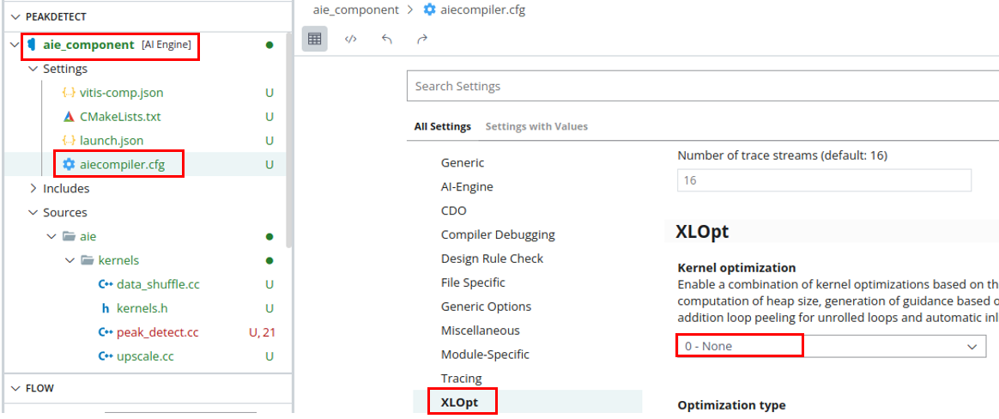
3. In the **Flow** navigator window, select **Build** under **AIE SIMULATOR/HARDWARE**. This builds the AI Engine component for AIE Simulation target. Once the build completes, you see the **Compilation Complete** and **Build Finished Successfully** messages in the console and a green tick mark as shown below.
    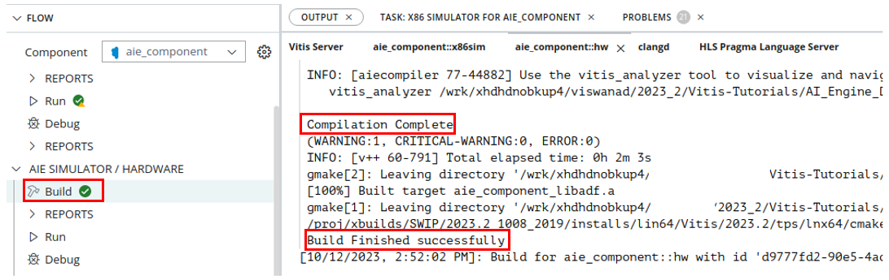
4. In the **Flow** navigator window, under **AIE SIMULATION/HARDWARE**, select **Run**. If there is no existing launch configuration, create one by clicking **Create Configuration** -> **New Launch Configuration** -> **AIESim**.
    
5. Change the Launch Config Name, and click **Run** to start the simulation for the AIE simulation target. When the simulation completes, the following output in the console displays.
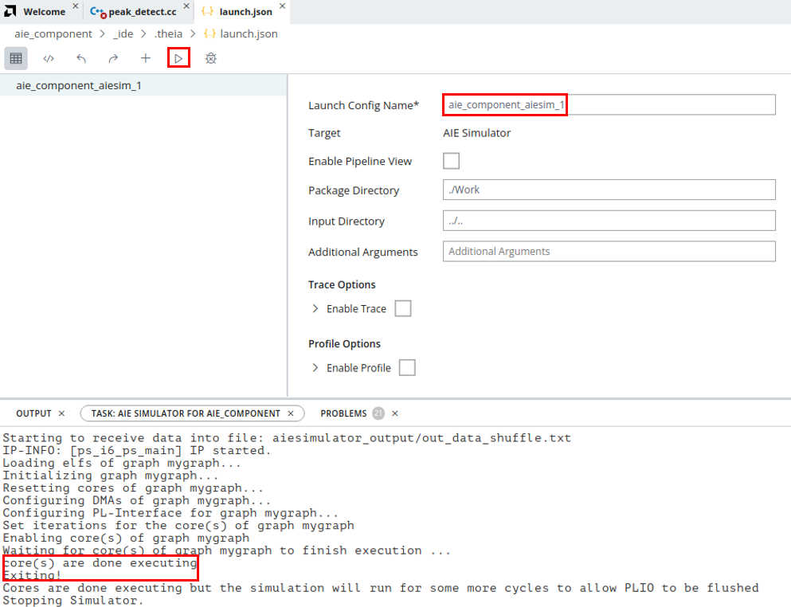
6. Right-click the *[aiengine]* domain project. Select **Run As → Launch AIE Emulator** to start the simulation for the aiesimulation target. When the simulation completes, the following output appears in the console:

7. The aiesimulator output files from design are located at `${PROJECT}/Emulation-AIE/aiesimulator_output/data`, and the golden output data is located at `09-debug-walkthrough/reference_output/`. Verify the output files `${PROJECT}/Emulation-AIE/aiesimulator_output/data/output_upscale.txt` and `${PROJECT}/Emulation-AIE/aiesimulator_output/data/output_data_shuffle.txt` against the golden files `09-debug-walkthrough/reference_output/upscale.txt` and `09-debug-walkthrough/reference_output/data_shuffle.txt` to ensure that the design's I/O functionalities are correct. Compare the files.
   

# Section 2

## Debug Using printf

The simplest form of tracing is to use a formatted `printf()` statement in the code to print debug messages. Visual inspection of intermediate values and addresses helps you understand the progress of program execution. No additional include files are necessary to use `printf()` other than standard C/C++ includes (`stdio.h`). You can add `printf()` statements to your code for aiesimulation or hardware emulation. Remove or comment them out for hardware builds.

1. Open the source file, `src/kernels/upscale.cc`. Add the following lines after `in_t = *IniIter++;`:

    ```
    float * print_ptr = (float*)&in_t;
    for(int pp=0;pp<16;pp++)
        printf("Iteration-%d -> Vector-%d -> value = %f\n",i,pp,print_ptr[pp]);
    ```

    >**NOTE:** Adding `printf()` statements to your AI Engine kernel code increases the compiled size of the AI Engine program. Ensure the compiled size of the kernel code does not exceed the per-AI Engine processor memory limit of 16 KB.
2. Rebuild the *AI Engine* component.
3. To enable the `printf()` function, enable the **profile** option in the launch configuration settings. Hover over the **Run** option in the **Flow** navigator, and click the settings button. In the launch configuration window, check the **Enable Profile** option under **Profile Options** as follows.
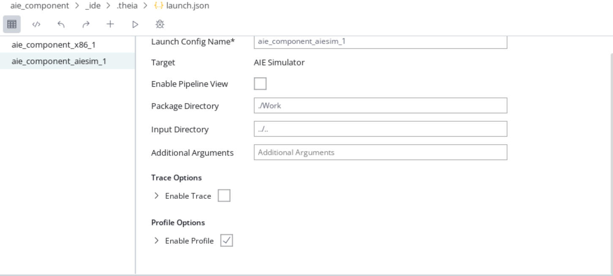
1. Observe the following `print` statements in the console:

    ```
    Configuring PL-Interface for graph mygraph...
    Set iterations for the core(s) of graph mygraph
    Enabling core(s) of graph mygraph 
    Waiting for core(s) of graph mygraph to finish execution ...
    Iteration-0 -> Vector-0 -> value = 0.000000
    Iteration-0 -> Vector-1 -> value = 0.000000
    ...
    ...
    Iteration-0 -> Vector-13 -> value = 0.000000
    Iteration-0 -> Vector-14 -> value = 0.000000
    Iteration-0 -> Vector-15 -> value = 0.000000 
    Iteration-1 -> Vector-0 -> value = 0.000000
    Iteration-1 -> Vector-1 -> value = 3.141500
    Iteration-1 -> Vector-2 -> value = 6.283000
    ```

2. Revert the changes in the source file to exercise other debug features.

# Section 3

## Debug Using the Vitis IDE Debugger

This section discusses a debug methodology that uses the Vitis IDE debugger. You learn how to invoke the debugger, add breakpoints, view intermediate values, and so on.

1. After the design is built for the aiesimulation target, click the **Flow Navigator -> **AIE Simulation** -> **Debug** option..
2. This gets you to the debug mode in the Vitis IDE and waits in `io_buffer_main.h` to acquire the lock to read the input data.
3. Open the source file, `peak_detect.cc`. Place a breakpoint at the line (vin = \*InIter++) by clicking the empty space beside the line number in the source editor.

    >**NOTE:**
    >
    >1. You should see the stack trace for all kernel functions mapped to a tile. For example, in this case, the kernel `peak_detect` mapped to tile [25,0]. When you select the `core[25,0]` in the `Debug` window, the **CALL STACK** shows only the trace information corresponding to the `core[25,0]`.
    >2. Not all lines in the source code allow placing the breakpoint. When you try to place the breakpoint at a particular line (for example, line 27), the breakpoint is adjusted to the line 32 in the same source code with an **Info** message at the bottom corner as highlighted below. This compiler optimized the particular operation, and breakponts can be placed only at lines not optimized by the compiler.  
    >
    >       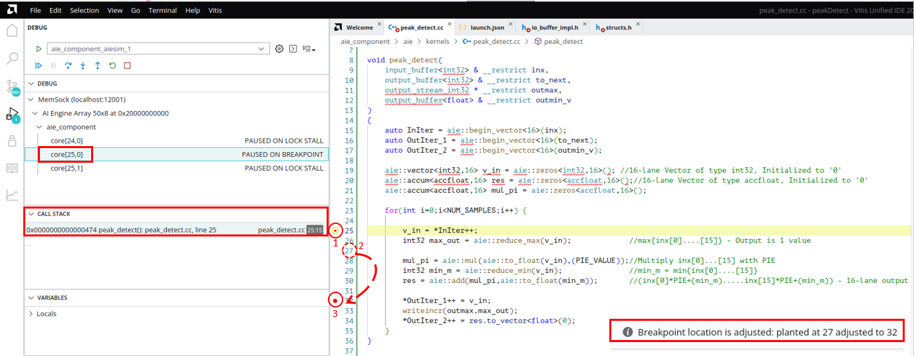
    >
    >* `1`: Indicates the current location of the pointer during debug (explained more in later steps).
    >* `2`: Try adding a breakpoint at a line optimized by the compiler.
    >* `3`: Breakpoints automatically shifted to the other line used to debug. Note the info message.

4. Notice the `continue`,`pause`,`step-over`,`step-into`,`step-out`, `restart`, and `terminate` options in the taskbar after entering debug mode.
5. You can view the variables, breakpoints, and watchpoints to analyze the design at each iteration during the debug session.

    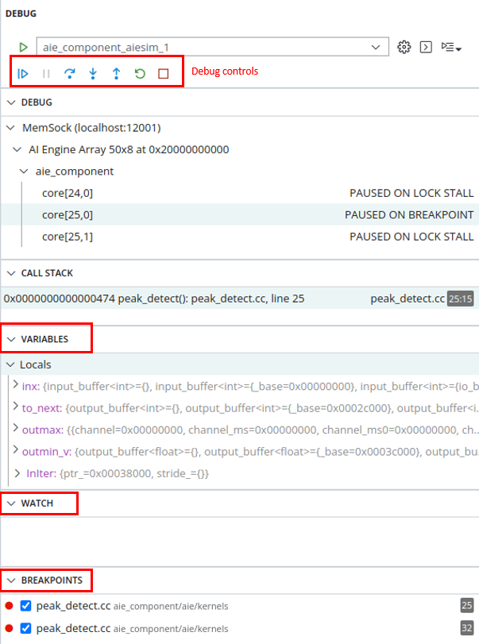
6. After placing the breakpoint in `peak_detect.cc`, click **continue**. The debugger stops at that particular line. From the Variables view, you can get the address of any particular variable at that particular instance of the run. For example, the address value of the `InIter` is `0x38000`.
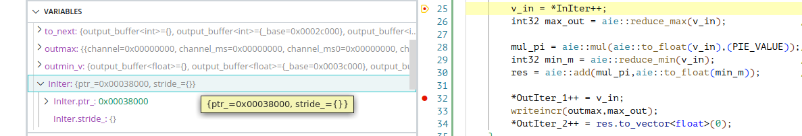

1. Use the **Memory** Inspector option to get the values at the address location, `0x38000`. Click the **+** button, and add the address `0x38000` to the memory monitor. You should see the values equal to the input values in `data/inx.txt`.
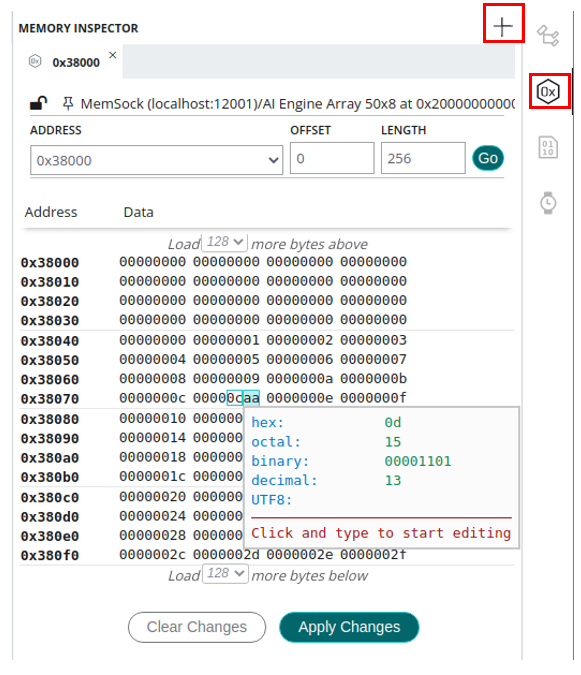

1. Based on the breakpoint location, you should see similar values in the **variable** view. If a variable is not visible in a particular iteration (due to compiler optimizations), track the value by adding in **Expressions**.
2. Select the `+` option in `Watch` window to **Add new expression**, and type `vin`. You should see initial zeroes that match the values in the Memory Inspector. In each iteration, 16 values of 4 bytes (int32) are sent as input in one iteration.
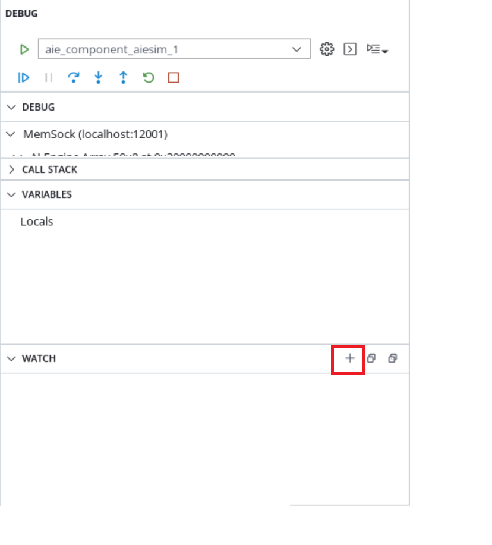
1.  Click **Continue** again. You should see the next set of 16 values in the `vin`.

2.  Get the memory address of `OutIter_1`, and validate the values. As the `OutIter_1` is just a pass-through operation from input to output, you should see the same values as `InIter`.

### Limitations

1. A maximum of four breakpoints available per tile. The program under debug stops at the first line of `main()`. This does not impact those available breakpoints.
2. Expect non-sequential execution when stepping through source code.
3. Due to compiler optimization, some variable values are stored in registers. `N/A` is shown in **variables** view for those optimized variables values.

# Section 4

## Enabling Profile and Trace Options

This section explains how to enable profiling and trace in the Vitis IDE. Use these options to get performance metrics and generate trace data for visualization in the Vitis Analyzer.

1. In the Flow navigator, under AIE SIMULATION/HARDWARE, select **Run Settings**.
2. Under **aie_component_aiesim_1** Configuration, select the **Generate Trace** check box, Trace Tyep **VCD**, and leave the default option **VCD** with the filename *foo*.
3. Under the Profile Options tab, enable the **Generate Profile** check box. Keep the other default options.
    >**NOTE:** You can also enable profile generation for selected tiles.
    >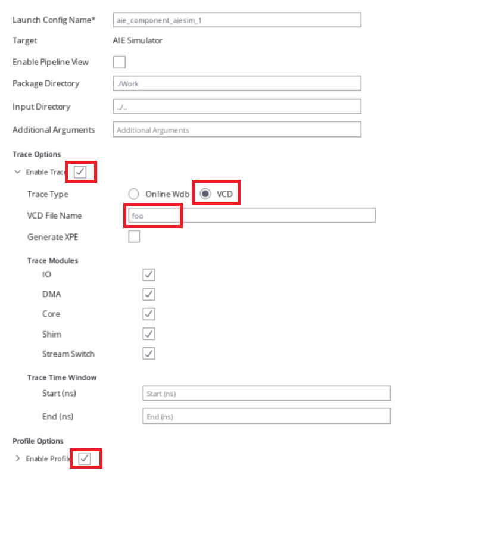
    In the Flow navigator, under AIE SIMULATION/HARDWARE, select **Run** to launch the AI Engine simulation.
4. After the run completes, in the Flow navigator, under AIE SIMULATION/HARDWARE, select **Reports** -> **trace**. This opens the following Vitis Analyzer window.
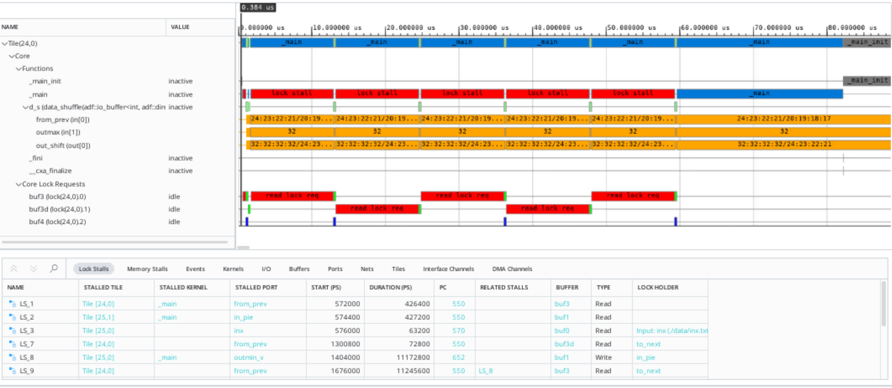
1. Click **Profile** ->, select the **Summary** and **Profile Details** for all tiles ([24,0],[25,0],[25,1]), and observe the cycle count, instruction count, and program memory size. For more information, see [Design Performance Debug](./README.md#Design-performance-debug).
2. Click **Trace**, and observe the trace events for all the tiles. For example, select core `[25,0]` for the kernel `peak_detect`. Expand the kernel function and zoom in to check the input and output values.
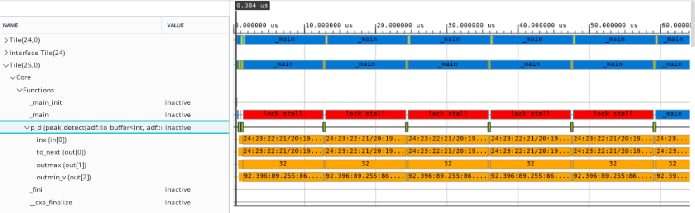
    >**NOTE:** Large VCD file generated during AI Engine simulation takes significant time for the Vitis Analyzer to analyze the VCD and open the trace view. Alternatively, do an online analysis of the VCD when running the AI Engine simulator using the WDB and CTF files. To generate this, choose **Online** option instead of **VCD** in step 2.

### Exercise Step

Under **aie_component_aiesim_1** Configuration, enable **Generate Trace**, Trace Type **Online Wdb**, then open the event trace in the **Analysis View -> aie_component -> Run-aie_component -> trace**.
 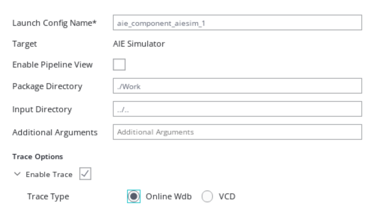

# Section 5

## Deadlock Detection

AI Engine designs can run into simulator hangs. Common causes include insufficient input data for requested number of graph iterations, mismatched production and consumption of stream data, cyclic dependencies on stream, cascade stream, asynchronous buffers, or incorrect ordering of  blocking protocol calls (acquisition of async buffers, read/write from streams).

This topic shows a practical scenario of deadlock in aiesimulation and simulator options that help debug it.

1. Open the `src/kernels/data_shuffle.cc`, and comment out line 24.
2. Compile the design by rebuilding the *[aie_component]* under AIE SIMULATOR/HARDWARE.
3. Run the aiesimulation by selecting **AIE SIMULATOR/HARDWARE** → **Run**, and observe the hang.
4. Wait for a few seconds to confirm the hang. Click the background operations icon located in the bottom right corner that shows the in progress view, then terminate the simulation process.
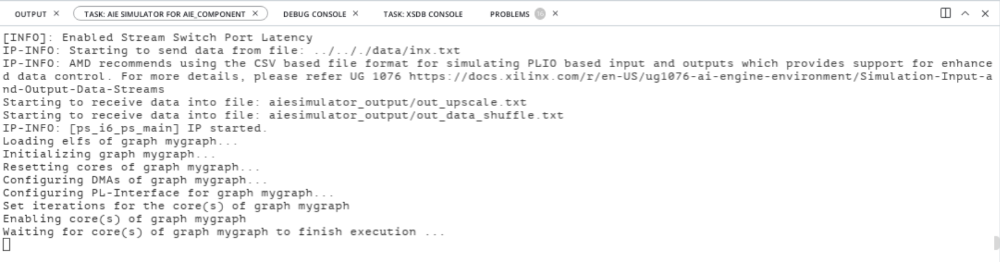
1. The AI Engine simulator provides an option to exit the simulation if all active cores are stalled aftfor a specific time period (in ns).
2. For example, add `--hang-detect-time=60` in the **Run configurations** -> **Additional Arguments**, and rerun the aiesimulation. The simulation exits with the following information in the console.

   ```
   Enabling core(s) of graph mygraph
   WARNING: All the cores are in stalled state at T=636000.000000 ps for a period of 60ns
   |---------------- Core Stall Status ----------------|
   (24,1) -> Lock stall ->  Lock_East detected at T=571600.000000 ps
   (25,1) -> Lock stall ->  Lock_East detected at T=575600.000000 ps
   (25,2) -> Lock stall ->  Lock_South detected at T=574000.000000 ps
   |---------------------------------------------------|
   WARNING: This simulation is running with hang detection time of 60ns, to modify the hang detect time please rerun simulation with -hang-detect-time=<value in NS> option 
   Exiting!
   ```

3. Revert the source file changes to exercise other debug features.

For more information on visualizing deadlock using stream stalls and lock stalls in Vitis Analyzer, see [Visualizing Deadlock in the Vitis Analyzer](./README.md#Visualizing-deadlock-in-the-Vitis-Analyzer).

 > **NOTE:**
 >
 >1. Select hang detect time based on kernel and graph complexity and the number of graph iterations.
 >2. If you also specify the simulator option, `--simulation-cycle-timeout=cycles`, ensure that the `--hang-detect-time` is less than the timeout. The timeout is in cycles.
 >3. To convert cycles to `ns`, use the AI Engine clock frequency.

# Section 6

## Visualizing Deadlock in the Vitis Analyzer

This topic continues from [Deadlock Detection](./README.md#Deadlock-detection) section and shows how to visualize the deadlock (Lock stall and stream stall) in the Vitis Analyzer.

1. After simulating with the `--hang-detect-time=60` option, open the trace **analysis view -> aie_component -> AIE SIMULATOR/HARDWARE -> Run-aie_component -> Trace**.
2. Expand the `data_shuffle` kernel function. It ran for two iterations and went into a stream stall.
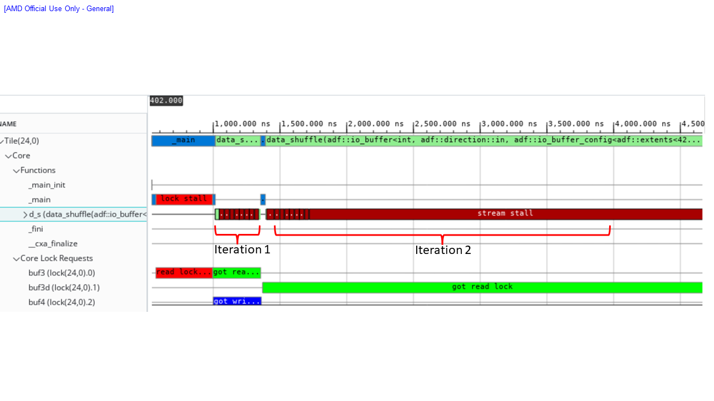
1. Expand the `peak_detect` kernel function, and observe the lock stall after three iterations.
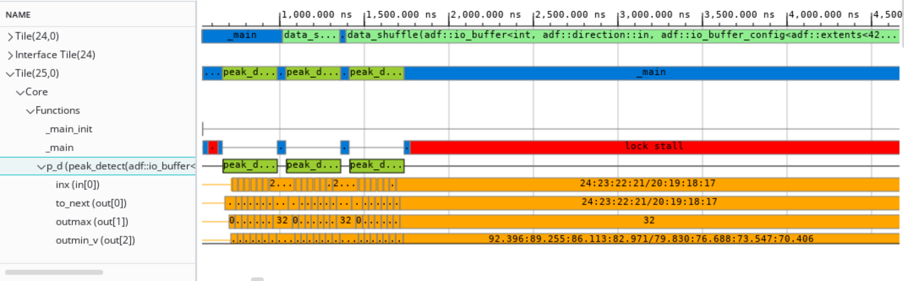
The kernel `data_shuffle` expects more stream data from `peak_detect` than it can provide. So, the stream port in the `data_shuffle` went into the stream stall, and the kernel hangs. It cannot accept more inputs from the buffer port, which causes backpressure on the `peak_detect` kernel leading to a lock stall, which leads to deadlock.

# Section 7

## Debugging Memory Access Violations

Memory access violations occur when a kernel reads or writes out of bounds of an object or reads uninitialized memory. Symptoms include simulator crashes or hangs. This debug feature detects range memory access from each tile during the AI Engine emulation runtime. However, this option negatively impacts runtime performance. The out-of-range memory access indicates valid address assignment within each section. Some addresses can be unassigned between sections.

The aiesimulator option `--enable-memory-check` detects these out of range memory accesses.

Before using the simulator option, identify an invalid address in the design. To do this:

1. In a Linux terminal with a valid Vitis installation/setup, issue the following command to list a specific tile's valid memory addresses and sizes assigned by the AI Engine compiler:

   For example, to get valid memory addresses of `peak_detect` kernel:

   ```
   # For Vitis IDE project
   cd ${PROJECT_PATH}/peakDetect/aie_component/build/hw/Work/aie/25_0/Release/25_0
   readelf -S 25_0
   ```

2. The output of the `readelf` command is as follows.

   ```
   readelf -S 25_0
   There are 33 section headers, starting at offset 0x47484:

   Section Headers:
     [Nr] Name              Type            Addr     Off    Size   ES Flg Lk Inf Al
     [ 0]                   NULL            00000000 000000 000000 00      0   0  0
     [ 1] .shstrtab         STRTAB          00000000 00268f 00016c 00      0   0  1
     [ 2] .strtab           STRTAB          00000000 0027fb 000872 00      0   0  0
     [ 3] .symtab           SYMTAB          00000000 00306d 000410 10      2  41  0
     [ 4] .bss.DMb.16       NOBITS          00029e00 000294 000200 00  WA  0   0  1
     [ 5] .bss.DMb.16       NOBITS          0002c000 000294 000200 00  WA  0   0  1
     [ 6] .bss.DMb.16       NOBITS          00031e00 000294 000200 00  WA  0   0  1
     [ 7] .data.DMb.4       PROGBITS        000357e0 000294 000020 00  WA  0   0  1
     [ 8] .data.DM_bankA.4  PROGBITS        00035c00 0002b4 000024 00  WA  0   0  1
     [ 9] .bss.DMb.16       NOBITS          00038000 0002d8 000200 00  WA  0   0  1
     [10] .bss.DMb.16       NOBITS          0003a000 0002d8 000200 00  WA  0   0  1
     [11] .bss.DMb.16       NOBITS          0003c000 0002d8 000200 00  WA  0   0  1
     [12] .text             PROGBITS        00000000 0002d8 000102 00  AX  0   0  1
     [13] .text             PROGBITS        00000110 0003da 0002d8 00  AX  0   0  1
     [14] .text             PROGBITS        000003f0 0006b2 0003de 00  AX  0   0  1
     [15] .text             PROGBITS        000007d0 000a90 0000be 00  AX  0   0  1
     [16] .text             PROGBITS        00000890 000b4e 000094 00  AX  0   0  1
     [17] .debug_line       PROGBITS        00000000 00347d 00169b 00      0   0  0
     [18] .debug_info       PROGBITS        00000000 004b18 00a78c 00      0   0  0
     [19] .debug_abbrev     PROGBITS        00000000 00f2a4 000755 00      0   0  0
     [20] .debug_loc        PROGBITS        00000000 00f9f9 005581 00      0   0  0
     [21] .debug_frame      PROGBITS        00000000 014f7a 000d54 00      0   0  0
     [22] .debug_ranges     PROGBITS        00000000 015cce 0017b8 00      0   0  0
     [23] .debug_str        STRTAB          00000000 017486 023195 00      0   0  0
     [24] .debug_pubnames   PROGBITS        00000000 03a61b 00ad75 00      0   0  0
     [25] .debug_pubtypes   PROGBITS        00000000 045390 00208c 00      0   0  0
     [26] .tctmemstrtab     STRTAB          00000000 000be2 000a78 00      0   0  0
     [27] .tctmemtab        LOPROC+0x123456 00000000 04741c 000068 08     26   0  0
     [28] .tctmemtab        LOPROC+0x123467 00000000 00165a 000068 08     26   0  0
     [29] .stackinfo        LOPROC+0x123458 00000000 0016c2 000010 10      0   0  0
     [30] .rtstab           LOPROC+0x123469 00000000 0016d2 0000a9 0d      0   0  0
     [31] .eoltab           LOPROC+0x123470 00000000 00177b 0008f4 0c      0   0  0
     [32] .chesstypean[...] LOPROC+0x123468 00000000 00206f 000620 10      0   0  0
     Key to Flags:
     W (write), A (alloc), X (execute), M (merge), S (strings), I (info),
     L (link order), O (extra OS processing required), G (group), T (TLS),
     C (compressed), x (unknown), o (OS specific), E (exclude),
     D (mbind), p (processor specific)
   ```

   Here, the flags `WA` and `AX` indicates the section is loaded into the tile memory.

3. Add the memory read violation to the kernel code by opening `src/kernels/peak_detect.cc`, and change line 26 to `v_in = *(InIter+8500)`.
4. Build the *[aiengine]* domain project. Add the `--enable-memory-check` option to the **Run Configurations**, then run the aiesimulation.
5. Observe the following console messages.

   ```
   Waiting for core(s) of graph mygraph to finish execution ...
   670400 ps [ERROR] tl.aie_logical.aie_xtlm.math_engine.array.tile_25_1.cm.proc: dme_lda_e_out access out of 	  boundary! address = 0xbcd20 prog_cntr = 0x00010010010100
   670400 ps [ERROR] tl.aie_logical.aie_xtlm.math_engine.array.tile_25_1.cm.proc: dme_ldb_e_out access out of boundary! address = 0xbcd00 prog_cntr = 0x00010010010100
   670400 ps [ERROR] tl.aie_logical.aie_xtlm.math_engine.array.tile_25_1.cm.proc: dmo_lda_e_out access out of boundary! address = 0xbcd30 prog_cntr = 0x00010010010100
   670400 ps [ERROR] tl.aie_logical.aie_xtlm.math_engine.array.tile_25_1.cm.proc: dmo_ldb_e_out access out of boundary! address = 0xbcd10 prog_cntr = 0x00010010010100
   ```

   The address `0x0000bcd30` is out of range from the valid addresses you see from the `readelf` command.
6. The AI Engine simulation generates the `${PROJECT_PATH}/peakDetect/aie_component/build/hw/AIESim_Guidance.json` file, which you can view by opening `${PROJECT_PATH}/peakDetect/aie_component/build/hw/aiesimulator_output/default.aierun_summary` in the Vitis Analyzer.
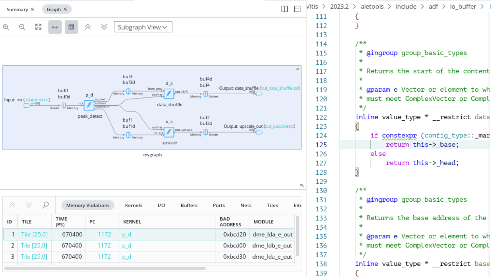

1. The **PC** column in the **Memory Violations** tab helps you navigate to the kernel function that has a memory violation.

   >**NOTE:** Currently, if the violation impacts the API, for example, `aie::mul` in this case, clicking the `PC` might not redirect you to the exact kernel function. In cases where memory violations cannot be identified, it is recommended to use the `x86simulator` with the `valgrind` option as explained in [Memory Access Violation and Valgrind Support](../X86_Simulation/README.md#memory-access-violation-and-valgrind-support).

2. Revert the source code changes to exercise other debug features.

# Section 8

## Kernel Debug

The AI Engine Pipeline view in the Vitis IDE enables you to correlate instructions executed in a specific clock cycle with the labels in the Disassembly view. The underlying AI Engine pipeline is exposed in debug mode using pipeline view.

1. To enable pipleline view, in the Flow navigator under AIE SIMULATION/HARDWARE, select the Run Settings under **aie_component_aiesim_1** Configuration. Select **Enable Pipeline View**.
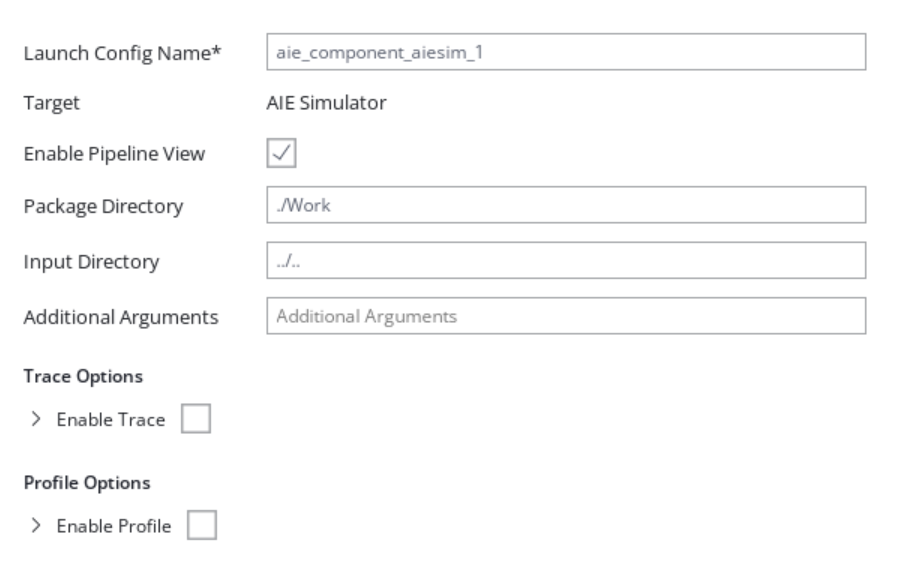
1. Select **Generate Profile** from the Profile Options.
2. Enter the debug, as explained in the [Debug Using Vitis the IDE Debugger](./README.md#Debug-using-the-Vitis-IDE-debugger) section to observe a single core in the **Debug** window. The  **Pipeline View** opens automatically when the IDE enters the debug mode.
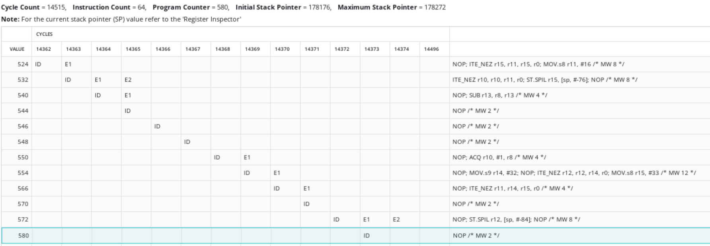
1. Click the **Step Over** button, and observe the changes in the pipeline view and the **Cycle Count**,**Program Counter** in Runtime statistics. Use Pipeline View to see how many cycles a particular instruction takes.
2. When debug is complete, click **Resume** to finish the simulation or **Terminate** to exit the debugger.

# Section 9

## Design Performance Debug

To estimate design performance during the AI Engine simulation, analyze the profile results. This section explains topics that are most commonly used to assess hoverall kernel performance.

Refer to the Section 4 [Enabling Profile and Trace Options](./README.md#Enabling-profile-and-trace-options) to enable profiling in the Vitis IDE.

1. After running the AI Engine Simulation, open the profile in **analysis view -> aie_component -> AIE SIMULATOR/HARDWARE -> Run-aie_component -> Profile**.
2. Click the **Summary** for each tile on the landing page, and review the cycle count, instruction count, and program memory.
3. Under **Function Reports**, click **Total Function Time** to view the following table at the bottom for the `data_shuffle` kernel function.
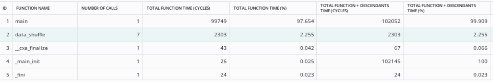
   * The `data_shuffle` kernel function took 2,303 cycles for seven iterations, that is, ~329 cycles for one iteration, which is the **Avg Function Time**.
   * The `main` function is added by the compiler and different from the `main()` function in the `graph.cpp` file. This function took 99749 cycles in total, which includes the time to transfer control back and forth between each graph iteration, lock stalls, and so on.
   * The `_main_init` runs once for all graph iterations, and it took 26 cycles.
   * The `_cxa_finalize` function took 43 cycles to call the destructors of the global c++ objects.
   * The `_fini` function executes the program terminating instructions, and it took 24 cycles.
1. If you click the AI Engine Simulation **Summary**, you see the AI Engine Frequency as `1250 MHz`, that is, `0.8ns`, that is, `1` cycle = `0.8 ns`
   Now, the data_shuffle function took `329` cycles for `1` iteration, that is, `329 × 0.8 ~= 264 ns`.
2. Match these values with trace information. Click **Trace** and zoom into the period of one iteration (between two `main()` function calls as follows). Add a marker and drag it to the end of the kernel function.
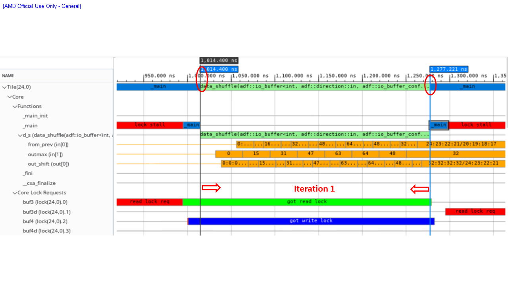
   The difference between the start time and end time of the kernel function for one iteration matches 264 ns from the profiling results.

### Calculating the Graph Throughput Using Graph Output

1. From the trace information in the run_summary in the Vitis Analyzer, navigate to the output port for which you want to calculate the throughput (`upscale` kernel in this case). Add a marker at the start of the first output sample. Click the **Go to last time** icon, and observe the cursor moves to the end of the last iteration. Now, click the **previous transition** icon to go the start of the last iteration. Add one more marker at the end, and observe the time difference as `2282.320 ns`.
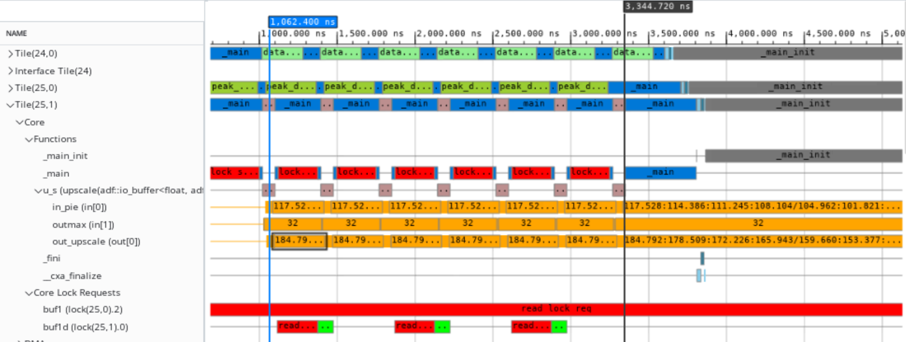
1. The number of bytes transferred is `128 samples * 4 Bytes * 7 iterations` = `3584` bytes.
2. Throughput = 3584/2282 * e-9 ~= 1.5 GBPS.

    Theoratically, AI Engine transfers four bytes per cycle (in this case, 0.8 ns). Transferring `3584` bytes of data requires 896 cycles (896 * 0.8 = 716 ns). So, the theoratical throughput is 5 GBPS.

# Section 10

## Determine Average Throughput of PLIO

The AI Engine simulator reports average throughput for each input and output PLIO. The report is available in the console once the AI Engine simulation run completes using `aiesimulator` command.

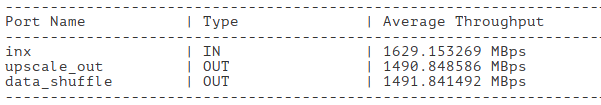

Vitis IDE generates the same report after the AI Engine simulation completes. View the report in the **Reports -> Summary -> Graph -> I/O** as shown below:

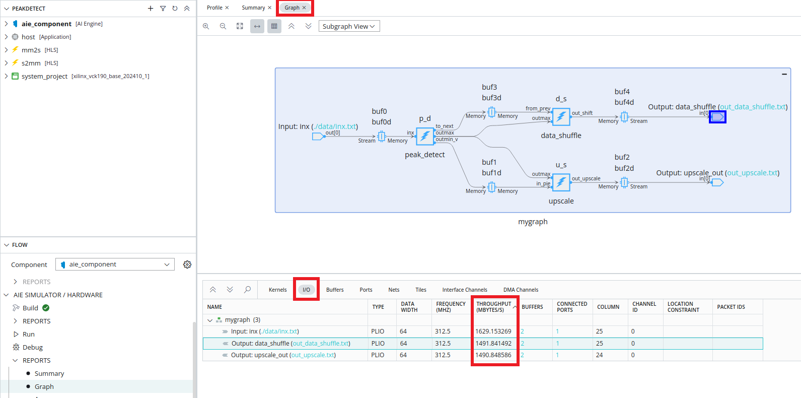

## Support

GitHub issues will be used for tracking requests and bugs. For questions, go to [support.xilinx.com](https://support.xilinx.com/).

<p class="sphinxhide" align="center"><sub>Copyright © 2020–2025 Advanced Micro Devices, Inc.</sub></p>

<p class="sphinxhide" align="center"><sup><a href="https://www.amd.com/en/corporate/copyright">Terms and Conditions</a></sup></p>
